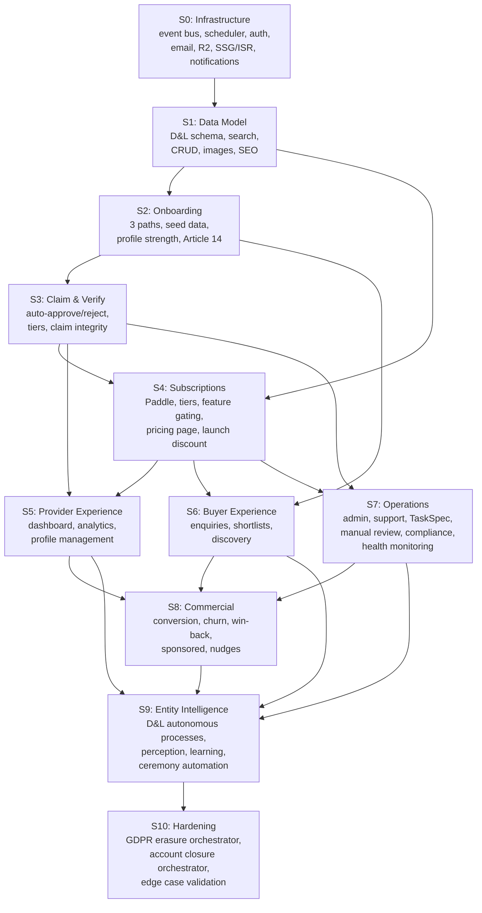

# Requirements Phase — Structure Sketch

**Status:** PLANNING v4 — v3 + interface question changelist integrated (R1–R7, P1–P5, SQ-1 resolved). Ready for requirements drafting.
**Entry criteria:** Concept design complete (5 domains, 341 scenarios). ✅ Met 2026-02-12.
**Upstream:** `2-concept-design/` (all documents incl. cross-domain-dependencies v3), `0-strategic-frame/entity-architecture-frame.md` (v2), `3-requirements/decisions/interface-questions-trade-off-evaluation.md`, `3-requirements/decisions/sq-1.md`

---

## V1 Scope Boundary

Requirements documents V1 only. The following are acknowledged but explicitly excluded:

- V2 buyer-side premium, V3 SaaS workflow tools (CR §8)
- Account-Account relationships / team members (DESIGN-TRACKER deferred)
- Cross-role reputation scoring (requires post-launch usage data)
- Layer 1 governance kernel specification (requires principal input, pre-launch)
- Layer 2 cognitive substrate specification (emerges from V1 operation)
- Automated learning feedback loops (V1 captures data + manual analysis; automation is V2+)

Each slice declares its V1 boundary and lists deferred V2+ items.

---

## Proposed Structure: Option C — Interfaces + Vertical Slices

Two-layer structure. Interface specs preserve sub-entity black box boundaries (composability principle). Slices provide the build sequence (implementation pragmatism).

**Key distinction (RS-2):** Interface specs define the *boundary surface* between sub-entities — event types, query interface signatures, shared types, non-functional requirements, ordering constraints for multi-step flows. They do not define full schema or internal routes. Full Drizzle tables and tRPC routes live in the slice where they are first needed. Interfaces = what crosses the boundary. Slices = what lives inside.

```
3-requirements/
├── README.md                      ← this file
├── REQUIREMENTS-TRACKER.md        ← interface status (versioned), slice status, open question log, decisions log
├── decisions/
│   ├── interface-questions-trade-off-evaluation.md  ← 4 cross-domain interface questions resolved (OQ-1–OQ-4), 12-scenario stress test, P1–P5, R1–R7
│   ├── sq-1.md                    ← sync/async classification of all 25 events × all consumers
│   └── sq-2.md                    ← orchestrated flow recovery model, R8–R12, skip constraints, auto-escalation
├── interfaces/
│   ├── shared-infrastructure.md   ← event bus (generic emit/consume, sync/async dispatch), deferred action scheduler (generic register/execute), auth, email transport (Resend), R2, SSG/ISR strategy, notification infrastructure, non-functional requirements, ordering constraints for multi-step flows, event bus architectural principles (P1–P5), consumer sync/async classification column spec
│   ├── data-and-listings.md       ← D&L boundary: 9 emitted events, 4 consumed events, 2 query interfaces, shared types (SubscriptionTier, VerificationTier, LifecycleStatus, etc.), consumer sync/async classification
│   ├── operations.md              ← Ops boundary: 3 emitted events, 10 consumed events, 5 query interfaces, TaskSpec type, consumer sync/async classification
│   ├── platform-and-product.md    ← PP boundary: 9 emitted events, 12 consumed events, 1 query interface, email template inventory, consumer sync/async classification
│   └── commercial-and-revenue.md  ← CR boundary: 4 emitted events, 8 consumed events, TIER_LIMITS + computeFeatureAccess + PRICING config, mapPaddleWebhook function, consumer sync/async classification
├── stress-tests/                  ← from S4 onward; S0–S3 results embedded in slice §15
│   └── s{N}-stress-test.md        ← 20-scenario analysis + numbered fix instructions (see §Stress Test Workflow below)
├── slices/
│   ├── slice-00-infrastructure.md ← event bus (in-process, sync/async dispatch via waitUntil), deferred action scheduler, auth (Better Auth), email transport (Resend), R2, SSG/ISR config, notification queue, Drizzle connection, structured decision logging format, OrchestratedFlowProgress type (expanded: status/attempt/deadline/escalation), generic orchestrator function, orchestrated_flows table, auto-escalation deferred actions, EVENT_CONSUMER_MATRIX startup validation, service abstraction layer (Resend/Paddle/CH API), event bus scaling monitoring signal
│   ├── slice-01-data-model.md     ← D&L schema (Listing, Account, Taxonomy, QualityScore, Engagement), search (tsvector + pg_trgm), basic CRUD, image pipeline, listing integrity rules (duplicate detection, CH uniqueness), SEO/structured data foundation
│   ├── slice-02-onboarding.md     ← 3 onboarding paths (freelancer, company, claim-path entry only), 4rfv seed data import + Article 14 batch, profile strength meter, progressive disclosure scheduling
│   ├── slice-03-claim-verify.md   ← claim flow (auto-approve/reject only at this slice), verification tiers, claim-specific integrity (atomic locking, competing claims, pre-claim snapshots). Manual review routing deferred to slice-07.
│   ├── slice-04-subscriptions.md  ← Paddle webhook handler (Ops-owned entry point), Paddle checkout (PP-owned overlay), mapPaddleWebhook (CR-defined logic), tier management, feature gating (computeFeatureAccess from CR, mapFeatureAccessToUI in PP), pricing page, launch discount coupon config, Paddle cancellation via deferred actions during closure path (pending_cancellation local state + scheduler retry)
│   ├── slice-05-provider-exp.md   ← provider dashboard, multi-listing switcher, quality score transparency, analytics display, subscription management UI, notification display, profile management (PP + D&L)
│   ├── slice-06-buyer-exp.md      ← enquiries (claimed + unclaimed handling), shortlists, saved searches, discovery, feature-gated contact visibility (PP + D&L)
│   ├── slice-07-operations.md     ← admin dashboard, support triage, TaskSpec routing (instances snapshot field values at creation — immutable), manual review (completes S3 claim flow), compliance scheduling, billing reconciliation monitoring, platform health monitoring, scaling self-assessment, principal operations briefing, failed event admin view (aggregation by event type/consumer/error/time range), orchestrated flow admin view (retry/skip/escalate), skip constraint matrix enforcement (Ops + PP)
│   ├── slice-08-commercial.md     ← conversion triggers, churn intervention, win-back, sponsored placement, revenue perception, cross-role nudges (CR + all)
│   ├── slice-09-entity-intel.md   ← D&L autonomous processes (quality score computation, decay detection/response, enrichment scheduling), cross-domain perception signals, ceremony automation, entity decision feedback loops, structured learning data analysis (manual V1). All sub-entities.
│   └── slice-10-hardening.md      ← GDPR erasure orchestrator, account closure orchestrator, end-to-end cross-domain flow validation, failure injection tests (per-step failure, retry, escalation, skip constraints), edge cases. Wires individual steps (built in S1–S9) into sequenced multi-domain flows.
└── (slices/ created when slice drafting begins)
```

### Why Two Layers

**Interface specs** = what each sub-entity exposes across its boundary. Event types with payload schemas, query interface signatures, shared type definitions, non-functional requirements (latency, throughput), and ordering constraints for multi-step cross-domain flows. This is the compilation boundary — if an interface changes, trace impact through the dependency graph. Translates the `SubEntityContract` from entity-architecture-frame.md into concrete technical specifications. Interface specs are versioned; changes logged in REQUIREMENTS-TRACKER.

**Slices** = in what order we build it, and how we know it works. Each slice is an end-to-end implementable unit containing schema definitions (Drizzle), endpoints (tRPC), event handlers, UI components, and acceptance criteria for the features it introduces. Slices register new deferred action handlers and notification triggers incrementally — shared infrastructure (S0) provides the generic mechanisms; slices add domain-specific uses. Maps directly to work management (phase 4).

### Rationale

Evaluated 4 options:

| Option | Structure | Confidence | Why / Why Not |
|---|---|---|---|
| A: Per-sub-entity only | Mirror concept design (1 doc per domain) | 0.55 | Good traceability but fights cross-cutting implementation reality |
| B: Vertical slices only | ~10 end-to-end capability docs | 0.65 | Good for build velocity but sub-entity ownership becomes implicit |
| **C: Interfaces + slices** | **Sub-entity interface specs + vertical build slices** | **0.88** | **Interfaces honour composability. Slices honour buildability. Same dual-view pattern that worked in concept design. Post-round-2 confidence.** |
| D: Single monolith | One massive document | 0.20 | Ruled out by scale (~500KB concept design → ~3-5K line requirements) |

### Slice Sequencing



**Parallel lanes (relevant for team scaling, not solo V1 execution):**
- **Lane A:** S0 → S1 → S2 → S3 → S7 (infra → data → onboarding → claim → operations)
- **Lane B:** S0 → S1 → S4 → S5 (infra → data → subscriptions → provider experience)
- **Lane C:** S0 → S1 → S2 → S6 (infra → data → onboarding → buyer experience)
- **Merge:** S8 + S9 (commercial + entity intelligence, after all lanes converge)
- **Final:** S10 (hardening — orchestration + validation)

**Solo execution order (critical path for single developer):** S0 → S1 → S2 → S3 → S4 → S5 → S6 → S7 → S8 → S9 → S10.

### Slice Dependency Rationale

| Dependency | Reason | Reference |
|---|---|---|
| S0 before all | Event bus + scheduler + auth required for any feature slice | cross-domain-deps §9.2 |
| S1 before all feature slices | Every domain references Listing/Account model | cross-domain-deps §9.1 |
| S2 → S3 | Claim flow requires listings to exist (from onboarding or seed data) | D&L §4 |
| S3 → S4 | Checkout CTA guard requires `claimStatus == "claimed"` | CR-X-1 |
| S4 → S5 | Provider dashboard shows subscription tier, feature access | PP §6.4, §6.5 |
| S4 → S6 | Enquiry routing and contact visibility depend on tier | PP §5, §3.2 |
| S4 → S7 | Billing reconciliation is Ops responsibility; Paddle webhook handler built in S4 | Ops §7, CR-X-14 |
| S3 → S7 | Manual review routing completes the claim flow started in S3 | D&L §4.3, Ops §2 |
| S7 → S8 | Win-back delivery requires Ops email infrastructure; feature gate friction from Ops | CR-X-6, CR-X-7 |
| S6 → S8 | Conversion triggers consume `enquiry_submitted` and engagement events from buyer experience | CR §5.3 |
| S5 → S9 | Entity intelligence needs dashboard and analytics infrastructure to wire perception | D&L §3.3-§3.6 |
| All → S10 | Hardening wires individual domain steps into cross-domain orchestrated flows | cross-domain-deps §5, §6 |

### Slice Content Summary (with sub-entity ownership)

| Slice | Primary Sub-Entity | Supporting Sub-Entities | Key Deliverables |
|---|---|---|---|
| S0 Infrastructure | Shared | — | Event bus (sync/async dispatch, waitUntil), scheduler, auth, email transport, R2, SSG/ISR, notification queue, decision logging, OrchestratedFlowProgress (expanded), generic orchestrator, orchestrated_flows table, auto-escalation, EVENT_CONSUMER_MATRIX, service abstraction layer, scaling monitoring |
| S1 Data Model | D&L | PP (search) | Drizzle schema, tsvector search, CRUD endpoints, image pipeline, SEO foundation, integrity rules |
| S2 Onboarding | PP | D&L, Ops | 3 onboarding paths, 4rfv import, Article 14 batch, profile strength, progressive disclosure |
| S3 Claim & Verify | D&L | — | Auto-approve/reject, tiers, atomic locking, competing claims, pre-claim snapshots |
| S4 Subscriptions | Ops (webhook), CR (logic), PP (UI) | D&L (tier storage) | Paddle handler, tier management, feature gating, pricing page, launch discount, Paddle cancellation via deferred actions (closure path) |
| S5 Provider Exp | PP | D&L | Dashboard, multi-listing, quality transparency, analytics display, notifications UI |
| S6 Buyer Exp | PP | D&L | Enquiries, shortlists, saved searches, discovery |
| S7 Operations | Ops | PP (admin UI) | Admin dashboard, triage, TaskSpec (immutable instances), manual review, compliance, health monitoring, scaling, briefing, failed event admin view, orchestrated flow admin view (retry/skip/escalate), skip constraint enforcement |
| S8 Commercial | CR | Ops (delivery), PP (nudge UI) | Conversion triggers, churn, win-back, sponsored placement, nudges, revenue perception |
| S9 Entity Intel | All | — | Quality scoring, decay, enrichment, perception wiring, ceremony automation, learning capture |
| S10 Hardening | All | — | Erasure orchestrator, closure orchestrator, end-to-end validation, failure injection tests (per-step failure, retry, escalation, skip constraints) |

---

### Open Questions to Resolve During Requirements

**4 cross-domain interface questions** — ✅ all resolved in `decisions/interface-questions-trade-off-evaluation.md`:

1. ~~Event transport mechanism~~ → Application-level event bus (in-process TypeScript module). ✅
2. ~~Schema versioning protocol~~ → TypeScript const exports, compiler enforces. ✅
3. ~~Cross-domain transaction boundaries~~ → Two patterns: orchestrated flows + reactive flows. ✅
4. ~~Consumer health monitoring~~ → Try/catch + startup registration + integration tests. ✅

**3 sub-questions** from interface-questions stress test:

| # | Question | Status | Resolve Before |
|---|---|---|---|
| SQ-1 | Sync/async classification of all 25 events × consumers | ✅ Resolved in `decisions/sq-1.md`. 3 sync, ~48 async, 1 orchestrated. | Interface specs |
| SQ-2 | Partial-failure recovery UX for orchestrated flows | ✅ Resolved in `decisions/sq-2.md`. 3 admin actions (retry/skip/escalate), auto-escalation, skip constraints, R8–R12. | S7 implementation |
| SQ-3 | Deferred action retry policy for Paddle cancellations | Open — does not block interface specs or S0 | S4 implementation |

**Domain-specific open questions** carried forward (recounted after concept design resolution):

| Domain | Total | Resolved During Concept Design | Carry to Requirements | Carry to Pre-Launch/Post-Launch |
|---|---|---|---|---|
| D&L | 5 | 1 (Q3: search history retention → Ops §5) | 2 (Q1: Drizzle schema patterns, Q2: public API) | 2 (Q4: cross-role reputation → V2, Q5: VAT → pre-launch) |
| Operations | 5 | 1 (Q3: admin dashboard → PP §8) | 3 (Q2: marketplace selection, Q4: regulatory monitoring, Q5: contractor onboarding) | 1 (Q1: budget limit → pre-launch governance) |
| Platform | 5 | 0 | 5 (all implementation-level) | 0 |
| Commercial | 5 | 0 | 1 (Q2: monthly price display) | 4 (Q1: launch discount → pre-launch, Q3-Q5 → post-launch) |
| **Total** | **20** | **2** | **11** | **7** |

~~Plus 4 cross-domain = 15 open questions for requirements phase.~~ **Updated:** 4 cross-domain resolved + SQ-1 resolved + SQ-2 resolved = **11 domain questions + 1 sub-question = 12 remaining open questions** (11 domain-specific carried from concept design, SQ-3 from interface-questions stress test).

---

### Requirements Surfaced During Interface Questions (R1–R7)

Source: `decisions/interface-questions-trade-off-evaluation.md` §3.3. All assigned to slices.

| # | Requirement | Target Slice | Source |
|---|---|---|---|
| R1 | `OrchestratedFlowProgress` type — step-level progress logging for erasure and closure orchestrators | S0 | ST-8 |
| R2 | Paddle cancellation during account closure uses deferred actions. Subscriptions marked `pending_cancellation` locally. Scheduler retries. | S4 + S10 | ST-9 |
| R3 | Failed event admin view with aggregation by event type, consumer, error pattern, time range | S7 | ST-10 |
| R4 | `EVENT_CONSUMER_MATRIX` typed const — runtime validation of consumer registration at startup | S0 | ST-11 |
| R5 | Service abstraction layer for external dependencies (Resend, Paddle, Companies House API). Production = real. Test = in-memory mocks. | S0 | ST-12 |
| R6 | TaskSpec instances snapshot field values at creation time. Instances are immutable post-creation. | S7 | ST-6 |
| R7 | Consumer sync/async classification column in all interface specs. Event bus dispatches sync consumers before response, async consumers via `waitUntil()`. | All interface specs | ST-4 |

### Requirements Surfaced During SQ-2 (R8–R12)

Source: `decisions/sq-2.md`. R1 amended (expanded type).

| # | Requirement | Target Slice | Source |
|---|---|---|---|
| R1 | ~~Original ST-8 version~~ → **Amended:** `OrchestratedFlowProgress` type expanded with `status`, `attempt` counter, `deadline`, `escalation` fields, `retryable` flag. SQ-2 version supersedes ST-8 version. | S0 | SQ-2 |
| R8 | Generic orchestrator function — accepts step list, executes sequentially, logs progress, handles failure/retry/escalation | S0 | SQ-2 |
| R9 | `orchestrated_flows` table — single table, `flowType` discriminator. Persists `OrchestratedFlowProgress` records. | S0 | SQ-2 |
| R10 | Auto-escalation deferred actions — deadline proximity check (erasure: 7d alert, 3d escalate, deadline CRITICAL), retry exhaustion check (3 failures → escalate, both flows) | S0 | SQ-2 |
| R11 | Skip constraint matrix — per step per flow type, enforced in admin UI. CANNOT SKIP: identity verification, processErasure, archive listings, deactivate account. | S7 | SQ-2 |
| R12 | End-to-end failure injection tests — inject failure at each step, verify progress logging, retry, escalation, skip constraints | S10 | SQ-2 |

### Architectural Principles Surfaced During Interface Questions (P1–P5)

Source: `decisions/interface-questions-trade-off-evaluation.md` §3.2. Target: `interfaces/shared-infrastructure.md`.

| # | Principle | Enforcement |
|---|---|---|
| P1 | Consumers use event payload for immediate reaction, not DB reads. DB reads for subsequent requests only. | Code review. Interface spec documents which payload fields each consumer uses. |
| P2 | Consumers must be idempotent. Emitters emit unconditionally. | Integration tests emit duplicate events, assert no side effect duplication. |
| P3 | Consumers must be defensive against context. Events tell you *what*, not *why*. Branch on `origin`/`reason` fields. | Event schema includes origin/reason fields where multi-context events exist. |
| P4 | No domain reimplements another domain's logic. Import or call, never copy. | TypeScript imports. Compiler enforces. |
| P5 | Consumer sync/async classification per event per consumer. Sync = before HTTP response. Async = `waitUntil()`. | Interface spec column. Runtime enforcement by event bus dispatch mode. |

### What Requirements Must Produce (That Concept Design Did Not)

- Drizzle ORM table definitions (concrete schema, not pseudocode types) — per slice
- tRPC router structure (route names, input/output types, middleware chain) — per slice
- Acceptance criteria per feature (testable, binary pass/fail) — per slice
- Non-functional requirements at interface boundaries (latency, throughput, availability) — in interface specs
- Ordering constraints for multi-step cross-domain flows (erasure, closure, subscription) — in interface specs
- Implementation ordering with parallel lane identification — in this README + REQUIREMENTS-TRACKER
- Resolution of 15 open questions carried from concept design
- 4rfv seed data import script specification — in Slice-02
- V1 scope boundary per slice (what's in, what's deferred to V2+)
- Acceptance criteria for S0: smoke tests for each infrastructure component

---

## Stress Test Workflow (from S4 onward)

Context window constraints make single-session stress tests impractical for slices with deep upstream dependencies. From S4 onward, stress testing splits across two sessions writing to two files.

### Session 1: Draft + Stress Test

**Input:** Upstream interface specs, prior slices, concept design sections.
**Output:** Slice v1 + `stress-tests/s{N}-stress-test.md`.

1. Draft the slice (v1) following the established pattern (module layout, typed pseudocode, tRPC routes, acceptance criteria, downstream flags, cross-references).
2. Produce the stress test file: 20 scenarios targeting the slice's implementation delta against upstream specs, prior slices, and concept design.
3. No edits to the slice — Session 1 is pure analysis.

### Session 2: Apply Fixes

**Input:** `stress-tests/s{N}-stress-test.md` + the slice being fixed.
**Output:** Slice v2 + updated §15 resolution log + REQUIREMENTS-TRACKER update.

1. Read the stress test file. Each finding has: severity, exact section/line, old→new change description, sibling spec changes.
2. Apply all fixes to the slice.
3. Apply sibling spec changes (SI, interface specs, prior slices if amended).
4. Populate §15 Stress Test Resolution Log — summary table back-referencing `stress-tests/s{N}-stress-test.md`.
5. Update REQUIREMENTS-TRACKER.md changelog + slice status + next action.
6. Update MEMORY.md with key findings.

### Stress Test File Format

```markdown
# S{N} Stress Test — {Slice Name}

**Target:** `slices/slice-{NN}-{name}.md` (v1)
**Upstream:** [list of specs and slices read]
**Date:** YYYY-MM-DD

## Scenarios

| # | Scenario | Severity | Finding | Fix |
|---|---|---|---|---|
| S{N}-ST-1 | ... | High/Medium/Low/Pass | What's wrong | Exact change: file, section, old→new |

## Summary

| Severity | Count | IDs |
|---|---|---|
| High | N | ... |
| Medium | N | ... |
| Low | N | ... |
| Pass | N | ... |

## Fix Instructions

### S{N}-ST-{X}: {Title}
**Target:** `{file}` §{section}
**Change:** {description}
**Old:** {pseudocode or prose}
**New:** {pseudocode or prose}
**Sibling specs:** {list of other files affected, or "none"}
**AC impact:** {new/modified acceptance criteria, or "none"}
```

### S0–S3 (legacy)

S0–S3 stress tests were single-session. Results are embedded in each slice's §15 resolution log. No retroactive extraction.

---

## Structure Stress Test Log

### Round 1 (20 scenarios — v1 → v2)

| # | Scenario | Severity | Resolution |
|---|---|---|---|
| RS-1 | Shared infrastructure conflated with Slice-01 — auth, event bus, scheduler have no build step | **High** | Fixed. Added Slice-00 (Infrastructure) as prerequisite for all feature slices. |
| RS-2 | Contracts layer scope too broad — defining full Drizzle tables and tRPC routes duplicates slice content | **High** | Fixed. Renamed to "interfaces". Scope narrowed to boundary surface only: events, queries, shared types, NFRs. |
| RS-3 | Slice-03 missing dependency on Slice-02 — checkout guard requires claim status | Medium | Fixed. S2→S3 dependency added. |
| RS-4 | Email pipeline placement ambiguous across 4+ slices | Medium | Fixed. Resend transport in S0. Template content per slice. |
| RS-5 | Slice-05 missing dependency on Slice-03 — enquiry routing depends on tier | Medium | Fixed. S3→S5 dependency added. |
| RS-6 | 4rfv seed data import has no slice home | **High** | Fixed. Assigned to Slice-01 (Foundation). |
| RS-7 | Slice-07 (Entity Intelligence) is a catch-all spanning all sub-entities | Medium | Fixed. Split into Commercial (S7) and Entity Intelligence (S8). |
| RS-8 | Contract docs have no traceability mapping to concept design sections | Low | Noted. Each interface doc opens with concept design section mapping. |
| RS-9 | Non-functional requirements have no home | Medium | Fixed. NFRs in `interfaces/shared-infrastructure.md`. |
| RS-10 | Hardening depends on all slices, not just S7 | Low | Acknowledged. Reframed as integration validation. |
| RS-11 | Onboarding flows split across unclear slice boundaries | Medium | Fixed. Auth in S0. Listing creation in S1. Claim in S2. Dashboard in S4. |
| RS-12 | SEO / SSG / ISR configuration has no slice | Medium | Fixed. Config in S0. Implementation in S1. |
| RS-13 | "Contracts" naming conflicts with SubEntityContract in entity-architecture-frame | Low | Fixed. Renamed to "interfaces". |
| RS-14 | Dependency graph has no parallel execution paths identified | Low | Fixed. Parallel lanes annotated. |
| RS-15 | Image processing pipeline has no slice | Low | Fixed. In S1. R2 config in S0. |
| RS-16 | Open question count incorrect | Medium | Fixed. Recounted: 15 for requirements. |
| RS-17 | Commercial interface spec scope unclear | Medium | Fixed. Defined: events, configs, mapPaddleWebhook. |
| RS-18 | REQUIREMENTS-TRACKER.md content undefined | Low | Fixed. Minimum sections defined. |
| RS-19 | Slice-02 routes manual reviews to Ops but Ops infra not built until Slice-06 | **High** | Fixed. S2 auto-approve/reject only. Manual review completes in S6. |
| RS-20 | No V1 scope boundary | Medium | Fixed. V1 scope boundary added. |

### Round 2 (20 scenarios — v2 → v3)

| # | Scenario | Severity | Resolution |
|---|---|---|---|
| RS-21 | D&L autonomous processes (decay detection, response) missing from all slices | **High** | Fixed. D&L autonomous processes (quality scoring, decay, enrichment) assigned to S9 (Entity Intelligence). S1 provides the schema and CRUD; S9 adds the autonomous behaviour. |
| RS-22 | Enrichment scheduling missing from all slices | **High** | Fixed. Same as RS-21 — enrichment scheduling in S9 alongside decay detection and quality computation. |
| RS-23 | Dashboard notification infrastructure spans 4+ slices with no clear owner | Medium | Fixed. Notification queue infrastructure in S0. Notification display UI in S5 (Provider Experience). Individual triggers per slice. |
| RS-24 | S1 (Foundation) overloaded — blocks everything and contains too many concerns | **High** | Fixed. S1 split into **S1 (Data Model)** — schema, search, CRUD, images, SEO, integrity rules — and **S2 (Onboarding)** — 3 paths, seed data, Article 14, progressive disclosure. All subsequent slices renumbered. |
| RS-25 | Interface specs don't specify event ordering guarantees for multi-step flows | Medium | Fixed. "Ordering constraints" added to shared-infrastructure interface spec scope. Three flows documented: erasure, closure, subscription. |
| RS-26 | Paddle webhook endpoint ownership ambiguous between S3/Subscriptions and S6/Operations | Medium | Fixed. Paddle webhook handler built in S4 (Subscriptions, renumbered) as Ops-owned infrastructure on the critical path. S7 (Operations) adds monitoring. Description clarified. |
| RS-27 | Cross-role nudges have no slice | Low | Fixed. Assigned to S8 (Commercial) — entity-initiated conversion behaviour. |
| RS-28 | Entity learning data capture format undefined in slice structure | Medium | Fixed. Structured decision logging format in S0 (infrastructure). Manual analysis in S7 (Operations ceremonies). Automated loops deferred to V2. |
| RS-29 | S7/Commercial missing dependency on S5/Buyer — conversion triggers need enquiry events | Medium | Fixed. S6→S8 dependency added. |
| RS-30 | Interface specs have no versioning strategy | Low | Fixed. Interface specs carry version headers. Changes logged in REQUIREMENTS-TRACKER. |
| RS-31 | S0 (Infrastructure) has no acceptance criteria pattern | Medium | Fixed. Smoke tests defined: event emit/consume, scheduler register/fire, auth create/authenticate, email send, R2 upload/serve, SSG build. |
| RS-32 | Platform health monitoring has no slice | Medium | Fixed. Assigned to S7 (Operations) — telemetry in S0, monitoring/alerting in S7. |
| RS-33 | S9/Hardening scope unclear — testing or implementation? | Medium | Fixed. S10 (Hardening) builds the orchestration logic (erasure orchestrator, closure orchestrator) AND validates end-to-end. Individual domain steps built in prior slices; S10 wires them. |
| RS-34 | Parallel lanes assume multiple developers but V1 is solo | Low | Fixed. Solo execution order documented. Parallel lanes retained for future team scaling. |
| RS-35 | Operations interface spec lists 4 query interfaces; should be 5 | Low | Fixed. Corrected to 5 query interfaces. |
| RS-36 | Scaling self-assessment (Ops §6.1) missing from all slices | Low | Fixed. Assigned to S7 (Operations). |
| RS-37 | S2/Claim includes listing-creation integrity rules that fire during onboarding, not claim | Medium | Fixed. Listing-creation integrity rules (checkDuplicate, checkCHUniqueness) in S1 (Data Model). Claim-specific integrity (atomic locking, competing claims, pre-claim snapshots) in S3 (Claim & Verify). |
| RS-38 | Launch discount Paddle coupon setup has no slice | Low | Fixed. Assigned to S4 (Subscriptions). |
| RS-39 | Pricing page has no slice | Medium | Fixed. Assigned to S4 (Subscriptions) — entry point to checkout flow. |
| RS-40 | Deferred action scheduler extensibility model unclear | Medium | Fixed. S0 builds generic scheduler (DeferredAction type, register/execute). Slices register domain-specific action handlers incrementally. Interface spec defines generic contract. |
