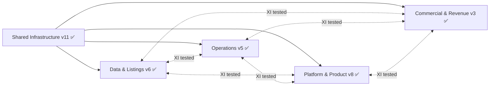
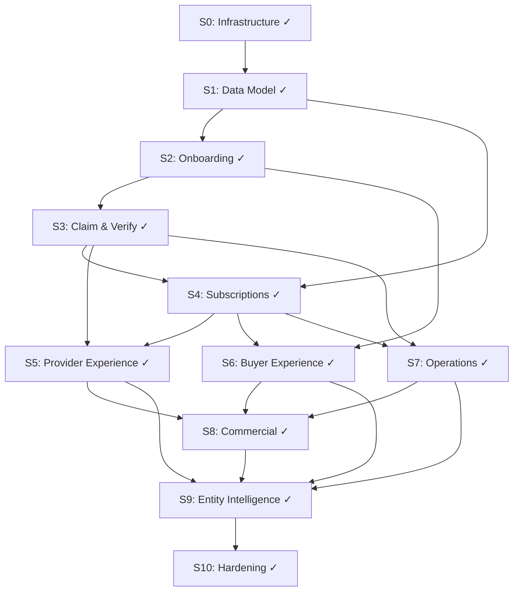

# Requirements Phase — Tracker

**Status:** ACTIVE
**Started:** 2026-02-12
**Last updated:** 2026-02-23
**Upstream:** `README.md` (structure sketch v4), `2-concept-design/DESIGN-TRACKER.md` (COMPLETE)

---

## Interface Spec Status

| # | Interface Spec | Version | Status | Key Contents |
|---|---|---|---|---|
| 1 | `shared-infrastructure.md` | v11 | **COMMS P1 UPDATED** | v10 contents + Communications Phase 1: §2.1 +`retry_bounced_email` (34→35 deferred actions), §5.1 +correspondence logging via `LoggingEmailService` decorator + system-level suppression, §9.2 +`email_suppressed` decision type (27→28). Total: 35 deferred actions, 30 templates, 19 notification types, 28 decision types. |
| 2 | `data-and-listings.md` | v6 | **S9 UPDATED** | v5 contents + S9 fix: §2 P1 fields table +`viewerAccountId` for `profile_viewed` (S9-ST-2). |
| 3 | `operations.md` | v5 | **S10 UPDATED** | v4 contents + S10 fix: §3.6 `closeDSARCase` mutation interface (S10-ST-5). Total: 5 query interfaces + 1 mutation interface. |
| 4 | `platform-and-product.md` | v8 | **S10 UPDATED** | v7 contents + S10 fix: §6 Autonomy Graduation Admin Surface — 5 `admin.graduation.*` routes (S10-ST-10). |
| 5 | `commercial-and-revenue.md` | v3 | **S6 UPDATED** | v2 contents + S6 fix: `buyerVisibleEngagementStats: boolean` added to `TierLimits` §4.1 (S6-ST-2). |

### Change Log

| Date | Spec | Change | Version |
|---|---|---|---|
| 2026-02-12 | `shared-infrastructure.md` | Initial draft. 13 sections covering 9 infrastructure concerns + 5 principles + NFRs + ordering constraints. | v1 |
| 2026-02-12 | `shared-infrastructure.md` | Stress test: 20 scenarios, 19 fixes. 3 High (EventPayloadMap, email preference enforcement, — SI-18 pass), 10 Medium, 5 Low. Key additions: typed EventPayloadMap, DeferredActionParamsMap, email unsubscribe enforcement, R2 public/private + bulk ops, orchestrator shared context, waitUntil constraints, 3 new notification types. | v2 |
| 2026-02-12 | `data-and-listings.md` | Initial draft. 9 emitted events, 4 consumed events, 2 query interfaces, shared types, P1 payload fields, NFRs. | v1 |
| 2026-02-12 | `operations.md` | Initial draft. 3 emitted events, 10 consumed events, 5 query interfaces, TaskSpec type, Paddle webhook integration, NFRs. | v1 |
| 2026-02-12 | `platform-and-product.md` | Initial draft. 9 emitted events, 12 consumed events (3 sync), 1 query interface, 22 email templates, account closure orchestration, NFRs. | v1 |
| 2026-02-12 | `commercial-and-revenue.md` | Initial draft. 4 emitted events, 8 consumed events, 3 exported configs, mapPaddleWebhook, shared types, NFRs. | v1 |
| 2026-02-12 | `data-and-listings.md` | Stress test: 20 scenarios, 14 fixes. 3 High (missing PP `claim_rejected` consumer, `ErasureCompletedEvent` payload insufficient for PP purge, D&L `subscription_ended` archival emission undocumented), 7 Medium, 4 Low. Key additions: `ErasureCompletedEvent` listing ID arrays, PP rejection notification consumer, §1.10 `subscription_ended` archival emission, `TaxonomyTag` type, `ListingArchivedEvent` payload expanded (`subscriptionTier`, `previousStatus`, nullable `accountId`), decay clearance condition tightened, `subscription_tier_changed` storage update documented, orchestrated flow dispatch clarified. Sibling spec updates: PP (P1 fields, `claim_rejected` consumer), CR (P1 fields, archival churn check), cross-domain-deps (3 payload schemas). | v2 |
| 2026-02-12 | `operations.md` | Stress test: 20 scenarios, 16 fixes. 2 High (missing `listing_created` + `contact_attempt` PP consumers), 8 Medium, 6 Low. Key additions: consumed events 10→13 (added 2 PP + fixed CR count), `WinbackDeliveryResultEvent.accountId` (P1 compliance), `winback` email template (23rd), pending cancellation registry docs, concurrent erasure/closure interaction on `checkComplianceHold`, DSAR lifecycle vs orchestrated flow clarification, `YearMonth` type for friction summary, `waitUntil()` for Paddle webhook, closure-path `subscription_ended` emission resolved (flows through Paddle webhook with attribution). Sibling spec updates: PP (`accountId` in P1, `winback` template, 23 template count), CR (`accountId` in P1), shared-infrastructure (23 templates), cross-domain-deps (`WinbackDeliveryResultEvent.accountId`). | v2 |
| 2026-02-12 | `platform-and-product.md` | Stress test: 20 scenarios, 15 fixes. 2 High (`ClaimRejectedEvent` missing `claimantAccountId` — P1 violation for rejection email, `ErasureCompletedEvent` missing `senderAccountId` — PP cannot anonymise outbound buyer enquiries), 8 Medium, 5 Low. Key additions: consumer tables decomposed to one-row-per-action (3 sync events each split from compound rows), `ClaimRejectedEvent.claimantAccountId`, `ErasureCompletedEvent.senderAccountId`, PP `erasure_completed` consumer adds "anonymise outbound enquiries", `SearchPerformedEvent.filters` typed as `SearchFilters`, `EnquirySubmittedEvent` PII removed + `enquiryId` added (data minimisation), `listing_live` reclassified transactional/non-unsubscribable, closure step 2 corrected from "deferred actions" to direct Paddle API call, consumed event count corrected 12→13, `subscription_ended` P1 adds `accountId`. Sibling spec updates: D&L (`ClaimRejectedEvent.claimantAccountId`, `ErasureCompletedEvent.senderAccountId`, new PP `erasure_completed` consumer row), cross-domain-deps (4 payload schemas updated, consumer matrix updated for `claim_rejected` PP consumer + `erasure_completed` PP consumer + `enquiry_submitted` description). | v2 |
| 2026-02-12 | `commercial-and-revenue.md` | Stress test: 20 scenarios, 18 fixes. 3 High (`subscription_ended` P1 missing `accountId` for win-back deferred action, `SubscriptionEvent`→domain event mapping undocumented, `EnquiryResponseInsights` data source path missing), 10 Medium, 5 Low. Key additions: `accountId` in `subscription_ended` P1, §4.5 SubscriptionEvent→domain event mapping table (6 variants → 2 domain events + 2 internal-only + 2 no-ops), `EnquiryResponseInsights` data source documented (D&L counters + PP analytics queries), `ConversionMilestoneId` typed union + `milestoneLabel`, `ChurnRiskFactor` typed union, `CancellationReason` typed on `pending_cancellation_created`, `winback_eligible.emailContent` → `mergeFields` with expanded fields, `computeFeatureAccess` signature simplified to `(tier: SubscriptionTier)`, `subscription_ended` consumer origin-branched (P3: paddle→win-back, archival/closure→churn only), `enquiry_submitted` query-in-handler pattern documented, `erasure_completed` anonymisation by listing IDs not accountHash, `listing_archived` null-check for accountId, local state read exceptions to P1 documented, `prioritySupport` enforcement path documented, NFR note for `competitor_upgraded` trigger. Sibling spec updates: cross-domain-deps (4 Commercial event payload schemas updated), Ops (mergeFields in P1 + §7), PP (milestoneLabel in P1). | v2 |
| 2026-02-12 | Cross-interface stress test | 20 scenarios across 5 specs. 3 High, 9 Medium, 2 Low, 6 Pass. 14 fixes applied. **High:** XI-1 (archival-path Paddle cancellation undocumented — D&L now emits `pending_cancellation_created`), XI-7 (closure Paddle path SI/PP misaligned + pending_cancellation emitter gap — aligned to direct API call + PP creates records), XI-20 (D&L consumed events 4→9, 5 PP events missing). **Medium:** XI-2 (PP missing from `claim_rejected` matrix), XI-6 (win-back email lookup implicit), XI-8 (phantom D&L consumer on `getListingAnalytics`), XI-9 (multi-mode per domain in matrix), XI-11 (Ops DSAR step missing from erasure flow), XI-16–19 (4 individual PP events missing from D&L §2). **Low:** XI-12 (`disputed_resolved` missing from SI P3), XI-14 (PP cross-ref version stale). | SI v3, D&L v3, Ops v3, PP v3 |
| 2026-02-12 | `slice-00-infrastructure.md` | Initial draft. 12 components, 44 acceptance criteria, 3 open question resolutions (PP-Q2, PP-Q3, PP-Q4). | v1 |
| 2026-02-12 | `slice-00-infrastructure.md` | Stress test: 20 scenarios, 19 fixes. 2 High (`confidence` column int→real, retry backoff 25min→8min curve), 9 Medium, 8 Low. Key additions: pgEnum declarations extracted to named constants, `triggeredBy` uuid→text, `cancelDeferredAction` type-safe generics, recurring action self-perpetuating pattern, `emit()` contract divergence documented, Better Auth `additionalFields` extension specified, tRPC error handling §12.1 + service injection §12.2, batch limit on notification cleanup, P5 runtime enforcement AC. 3 downstream flags for S1/S7. 44→52 acceptance criteria. | v2 |
| 2026-02-12 | `slice-01-data-model.md` | Initial draft. 14 Drizzle tables (listings, verifications, quality_scores, quality_score_explanations, engagements, taxonomy 3-level, listing_taxonomy_tags, credits, media_items, social_profiles, accreditations, pending_enquiries, pre_claim_snapshots, additional_locations) + 5 account/buyer tables (account_profiles, shortlists, shortlist_items, saved_searches, enquiry_records) + controlled_vocabulary + search_synonyms. tsvector + pg_trgm search. 5 tRPC routers (listing, profile, taxonomy, media, engagement). 3 integrity rules. JSON-LD. 9 event consumers. 40 acceptance criteria. 8 downstream flags. Resolves D&L-Q1. | v1 |
| 2026-02-12 | `slice-01-data-model.md` | Stress test: 20 scenarios, 16 fixes. 3 High (pending enquiry delivery mechanism, P2 idempotency AC contradictory, account_closed consumer no-op), 8 Medium, 5 Low. Key additions: event emission ownership note (tRPC routes = PP surface), zero_result_queries table, 3 pgEnum extractions (shortlistItemStatus, mediaType, vocabularyCategory), listing_taxonomy_tags partial unique index for nullable specialisationId, archive/reactivate pre-conditions, two-phase listing creation pattern, TIER_LIMITS import for search ranking, tsvector custom type factory note, retroactive enquiry linking note. 3 downstream flags added (S1-9 cancellation deferred to S4, S1-10 pending enquiry delivery to S3/S6, S1-11 account_closed consumer to S9). 40→42 acceptance criteria. 8→11 downstream flags. | v2 |
| 2026-02-12 | `slice-02-onboarding.md` | Initial draft. 3 onboarding paths (freelancer 3–5min, company 8–15min, claim 2–3min). 4rfv seed data import (5-phase pipeline: automated cleaning, CH batch verification, manual cleaning export, removal, Article 14 GDPR notices). Profile strength meter (completeness 0–25 → 0–100% with fallback field-presence check pre-S9). Progressive disclosure (Day 1/3/7 emails + Day 0/14 in-app via deferred actions). Intelligent taxonomy suggestions (3 curated sectors + generic fallback). Image processing pipeline (3 WebP variants: 150px/400px/1200px). Retroactive anonymous enquiry linking. 2 schema additions (listings.source, listings.article14NoticeDisplayed, account_profiles.departments). 7 email templates registered. 3 deferred action handlers. 43 acceptance criteria. 7 downstream flags. S2/S3 boundary: claim stubs with `pending_review` — S3 provides full `evaluateClaim`. | v1 |
| 2026-02-12 | `slice-02-onboarding.md` | Stress test: 20 scenarios, 16 fixes. 3 High (`DeferredActionParamsMap` missing snapshot cleanup, Day 14 handler unimplemented, import pipeline `listing_created` type violation), 8 Medium, 5 Low. Key additions: `pre_claim_snapshot_cleanup` action + handler, `onboarding_day14_prompt` handler (§7.4) + scheduling, import two-phase pattern documented + no event emission, claim edits held in snapshot until approval (not applied immediately), flagged company listing created as suspended, claim progressive disclosure deferred to S3 `claim_approved`, Article 14 banner persists during `pending_review`, Resend Pro required for batch, sorted-neighbour dedup strategy, image variant fallback to original, profile strength weight units clarified (pp not %), `NotificationType` extension documented, `getClaimContext` uses fallback. 3 downstream flags added (S2-8 claim progressive to S3, S2-9 claim edits to S3, S2-10 `ListingCreatedEvent.accountId` nullable contract). 43→50 acceptance criteria. 7→10 downstream flags. | v2 |
| 2026-02-13 | `slice-03-claim-verify.md` | Initial draft. `evaluateClaim()` decision architecture (auto-approve/reject/manual-review/dispute), optimistic locking on `claimStatus`, `onClaimApproved` post-processing (snapshot edits, pending enquiry delivery, progressive disclosure, Article 14 banner, quality score recalc), `onClaimRejected` cleanup, competing claims (dispute state machine, 14-day escalation), `onManualReviewComplete` callback, `evaluateVerificationUpgrade` (claimed→verified, score≥6 threshold), TaskSpec generation (manual review + dispute + portfolio review), 4 email templates, 2 deferred action handlers, 3 notification types. 44 acceptance criteria. 7 downstream flags. Resolves S1-1, S1-10, S2-1, S2-2, S2-8, S2-9. | v1 |
| 2026-02-13 | `slice-03-claim-verify.md` | Stress test: 20 scenarios, 14 fixes. 5 High (CH dissolution order, enquiryId clarification reclassified to Low, claimantAccountId missing from snapshot, dispute rejection wrong status, 90-day cleanup vs manual review), 6 Medium, 6 Low. Key additions: CH dissolution precedes email domain match (reordered Steps 1–5), `onClaimRejected` status-branched (disputed→claimed, pending_review→unclaimed), snapshot cleanup cancelled at submission time (not resolution), `delete_claim_snapshot` deferred action removed (direct delete used), `evaluateVerificationUpgrade` reads verifications table, `deliverPendingEnquiries` N+1 fixed, helper function signatures added, `claim_post_processing` decision log type. Sibling spec update: SI §2.1/§2.2 `delete_claim_snapshot` removed. 44→48 acceptance criteria. | v2 |
| 2026-02-13 | `slice-04-subscriptions.md` | Initial draft. Paddle webhook handler (signature verify, idempotency, async dispatch via waitUntil), `mapPaddleWebhook` + `inferCancellationReason` (CR logic), `computeFeatureAccess` + `TIER_LIMITS` (CR exports), feature gate middleware, `applyDowngrade` (media/credit visibility), `restoreHiddenItems`, grace period management (14-day), pricing page (SSG), launch discount coupon, checkout initiation (tRPC), pending cancellation registry, archival-path subscription cancellation (resolves S1-9), Premium Verified gate (resolves S3-1), 8 event consumers, 2 deferred actions, 2 email templates. 45 acceptance criteria. 9 downstream flags. | v1 |
| 2026-02-13 | `slice-04-subscriptions.md` | Stress test: 17 scenarios (merged from 20 — 3 deduped), 16 fixes. 4 High (archival double-emission S4-ST-7, DeferredActionParamsMap S4-ST-1/2, reason mapping S4-ST-3), 7 Medium, 2 Low, 4 Pass. Key additions: removed direct `subscription_ended` from archival path (D&L emits `pending_cancellation_created` only; Ops emits `subscription_ended` after Paddle confirms), reason mapping inverted (`account_closed`→`"account_closure"`, all else→`"cancellation"`), `suppressNotification` on `applyDowngrade` (prevents double notification on grace period expiry), processedPaddleEvents inline cleanup, `subscription_confirmed` template added to SI/PP (total 23→24), `listing_decay_warning` removed from S4 (belongs to S7), `EVENT_CONSUMER_MATRIX` amendments documented, pending_cancellations ownership exception for closure path documented, `PaymentService.createCheckoutSession` optional params applied to SI §10.1, D&L §2 `restoreHiddenItems` documented. Sibling spec updates: SI v3→v4, D&L v3→v4, PP v3→v4. 45→50 acceptance criteria. | v2 |
| 2026-02-14 | `slice-05-provider-experience.md` | Initial draft. Provider dashboard (auth guard, listing context provider), multi-listing switcher (overview cards + detail), tier-gated analytics (free: all-time totals, standard: 30d trends + search terms, premium: 90d + demographics + benchmarking + enquiry insights), quality score transparency panel (5 dimensions + top 3 improvements + methodology page), enquiry inbox + response tracking (cursor pagination, `enquiry_responded` emission, 7-day stale reminder), notification centre (list/dismiss/mark-read, unread badge), subscription management (current tier, grace period, Paddle portal, upgrade CTA), profile editor enhancements (optimistic concurrency via version column, feature-gated sections), 90-day listing update reminder (self-perpetuating deferred action), account settings (email preferences, account closure initiation via orchestrated flow), `mapFeatureAccessToUI` pure function. 1 email template (`enquiry_response`), 2 deferred actions (`listing_update_reminder`, `enquiry_response_reminder`), 1 schema addition (listings.version). 44 acceptance criteria. 9 downstream flags. Partially resolves S1-4, S1-5, S4-2. Resolves S2-5, S4-1. | v1 |
| 2026-02-14 | `slice-05-provider-experience.md` | Stress test: 20 scenarios, 12 fixes. 6 High (DeferredActionParamsMap 3-part sync, enquiry_response template missing, notification schema mismatch read→readAt/dismissed, profile_edited P1 accountId, enquiry_records status column missing), 4 Medium, 2 Low. Key additions: notification table migration (readAt + dismissed + dismissedAt), enquiry status enum, prioritySupport UI mapping, profile_edited accountId in emission, N+1 join query fix, lifecycle guard on edit, senderEmail null guard, profile_edited consumer extension documented. Sibling spec updates: SI v4→v5, PP v4→v5, S0 notifications amended, S1 profile_edited + enquiry_records notes. 44→46 acceptance criteria. S5-9 resolved. | v2 |
| 2026-02-14 | `shared-infrastructure.md` | S5 stress test fixes: `DeferredActionParamsMap` +2 entries (S5-ST-1), registered actions +2 rows (S5-ST-2), `enquiry_response` template — total 24→25 (S5-ST-3), `PaymentService.getCustomerPortalUrl` (S5-ST-4), Notification type `read`→`readAt`/`dismissed`/`dismissedAt` (S5-ST-5). | v5 |
| 2026-02-14 | `platform-and-product.md` | S5 stress test fix: `enquiry_response` template added — total 24→25 (S5-ST-3). | v5 |
| 2026-02-14 | `slice-06-buyer-experience/` | **Multi-file format (8 files).** index.md + 00-schema + 00-router-plan + 5 content sections. Search (SSR, ranking, facets, sponsored, autocomplete, zero-result, `search_performed`), listing profile (SSG+ISR, CTA branching, JSON-LD, `profile_viewed`, contact attempt feedback), enquiry submission (4 branches, anonymous support, `enquiry_submitted`), shortlist management (CRUD, listing state via join, `shortlist_added`), buyer dashboard (enquiries sent, shortlists, recent searches), cross-role nudge (`evaluateCrossRoleNudge`), feature gating display. 1 new deferred action (`search_history_cleanup`). 52 acceptance criteria. 5 downstream flags. Resolves S1-6, S5-8. Validation: 8 pass, 2 fail (fixed). | v1 |
| 2026-02-14 | `slice-06-buyer-experience/` | Stress test: 20 scenarios, 12 fixes. 1 High (shortlist lifecycle display contradiction — consumer-written model authoritative), 6 Medium, 5 Low. Key additions: shortlist lifecycle display corrected to consumer-written `shortlist_items.status` model (S6-ST-1), `buyerVisibleEngagementStats` CR field replaces hardcoded tier check (S6-ST-2), `DeferredActionParamsMap` + SI §2.2 column naming aligned (S6-ST-3), `sessionId` corrected to `ctx.session?.accountId` (S6-ST-4), downstream flag S6-2 narrowed to correct consumer attribution (S6-ST-5), `enquiry_submitted` consumer table expanded with CR conversion trigger (S6-ST-6), empty-filters semantics documented (S6-ST-7), SI §10 reference corrected to SI §12.1 (S6-ST-9), notification path documented (S6-ST-10), `forwardedAt` null semantics documented (S6-ST-12). 5 downstream flags (0 added, S6-2 amended). 52 acceptance criteria. | v2 |
| 2026-02-14 | `commercial-and-revenue.md` | S6 stress test fix: `buyerVisibleEngagementStats: boolean` added to `TierLimits` §4.1 (S6-ST-2). `free: false`, `standard/premium/partner: true`. `FeatureAccess` inherits via `TierLimits &`. | v3 |
| 2026-02-14 | `shared-infrastructure.md` | S6 stress test fixes: `DeferredActionParamsMap` +1 entry `search_history_cleanup` (S6-ST-3), §2.2 registered actions +1 row (S6-ST-3). | v6 |
| 2026-02-14 | `data-and-listings.md` | S6 stress test fix: §3.2 `getEngagementCounters` unclaimed-listing return behaviour documented (S6-ST-11). | v5 |
| 2026-02-14 | `slice-07-operations/` | Initial draft (multi-file, 16 files). 34 admin tRPC routes, 13 event consumers, 4 new deferred actions + 2 existing handler implementations, 5 query interface implementations, 7 new tables + 2 amendments + 7 pgEnums, 3 notification types, 100 acceptance criteria. 5 downstream flags. Resolves S0-3, S0-11, R3, R11, S2-6, S3-2, S3-3, S3-6, S4-6, S4-7, S4-8, Ops-Q2, Ops-Q4, Ops-Q5. | v1 |
| 2026-02-14 | `slice-07-operations/` | Stress test: 17 scenarios (20 raw, 3 deduped), 11 fixes. 4 High (DeferredActionParamsMap missing 4 actions — S7-ST-1, EmailCategory invalid value — S7-ST-2, SubscriptionEndedEvent.reason missing paddle_reconciliation — S7-ST-3, NotificationType missing 3 types — S7-ST-4), 4 Medium, 3 Low. Key additions: `refund_request` category + classifyTicket pattern + base priority (S7-ST-8), decay warning email category corrected to `listing_status` (S7-ST-2), friction tracking gate names corrected to TIER_LIMITS keys (S7-ST-10), `applyVerificationUpgrade` reads newTier from TaskSpec context (S7-ST-11). 11 sibling spec changes: SI (DeferredActionParamsMap +4, compliance_schedule_check params fix, registered actions +4 and 1 update, template inventory +1 support_acknowledgment 25→26, NotificationType +3), Ops (SubscriptionEndedEvent.reason +1, WinbackDeliveryResultEvent.status -bounced, FeatureGateFrictionSummary V1 type), PP (support_acknowledgment template), S3 (buildPortfolioReviewTaskSpec context +newTier). 0 downstream flags changed. 100 acceptance criteria. | v2 |
| 2026-02-14 | `shared-infrastructure.md` | S7 stress test fixes: `DeferredActionParamsMap` +4 entries (S7-ST-1), `compliance_schedule_check` params `{ quarter: string }` → `Record<string, never>` (S7-ST-5), §2.2 +4 rows and 1 row updated (S7-ST-1, S7-ST-5), §5.2 +1 `support_acknowledgment` template 25→26 (S7-ST-7), §8.1 +3 notification types (S7-ST-4). | v7 |
| 2026-02-14 | `operations.md` | S7 stress test fixes: §1.2 `SubscriptionEndedEvent.reason` +`"paddle_reconciliation"` (S7-ST-3), §1.3 `WinbackDeliveryResultEvent.status` -`"bounced"` + V2 note (S7-ST-9), §3.4 `FeatureGateFrictionSummary` type updated to V1 implementation (S7-ST-6). | v4 |
| 2026-02-14 | `platform-and-product.md` | S7 stress test fix: §4.2 +`support_acknowledgment` template row, total 25→26 (S7-ST-7). | v6 |
| 2026-02-14 | `slices/slice-03-claim-verify.md` | S7 stress test fix: §7.1 `buildPortfolioReviewTaskSpec` context +`newTier: "verified"` (S7-ST-11). | v2 (amended) |
| 2026-02-15 | `slice-08-commercial/` (multi-file) | Stress test: 19 scenarios, 13 fixes. 3 High (evaluateChurnIntervention return type mismatch + incomplete inputs, computeTaxonomyOverlap calling convention mismatch, check_quality_improvement missing from SI §2.1/§2.2), 6 Medium, 4 Low. Key additions: reason pre-check before evaluateChurnIntervention, first_upgrade once-only guard, shortlistCount→searchAppearanceCount rename, quality_declining detection in §10.5, P2 idempotency AC qualified. SI v7→v8 (+1 deferred action, +2 decision types). 0 downstream flags added. 81 AC (unchanged). | v2 |
| 2026-02-15 | `shared-infrastructure.md` | S8 stress test: §2.1 +1 DeferredActionParamsMap entry (check_quality_improvement), §2.2 +1 registered action row, §9.2 +2 Commercial decision types (refund_evaluation, feature_gate_friction_evaluation). Total: 17 deferred actions, 6 Commercial decision types. | v8 |
| 2026-02-15 | `slice-09-entity-intelligence/` (multi-file) | Stress test: 19 scenarios (20 raw, 1 dedup), 13 fixes. 4 High (17 deferred actions missing from SI §2.1/§2.2 — S9-ST-1, profile_viewed dedup field absent — S9-ST-2, 7 decision types missing from SI §9.2 — S9-ST-3, 4 email templates missing from SI §5.2 — S9-ST-4), 8 Medium, 1 Low. Key additions: SI +17 DeferredActionParamsMap entries + 17 registered actions, SI +4 templates (26→30), SI +2 notification types (17→19), SI +7 decision types (19→26), PP +viewerAccountId on ProfileViewedEvent, D&L +viewerAccountId in P1 fields, decay_final_notice/principal_briefing category corrected to transactional, low severity added to decay_signal_severity enum, P1 violation in account_closed handler fixed, conversion gate attribution correlation logic. 0 downstream flags changed. 101 acceptance criteria. | v2 |
| 2026-02-15 | `shared-infrastructure.md` | S9 stress test: §2.1 +17 DeferredActionParamsMap entries (S9-ST-1), §2.2 +17 registered action rows (S9-ST-1), §5.2 +4 email templates 26→30 (S9-ST-4), §8.1 +2 notification types 17→19 (S9-ST-15), §9.2 +7 decision types 19→26 (S9-ST-3). Total: 34 deferred actions, 30 templates, 19 notification types, 26 decision types. | v9 |
| 2026-02-15 | `platform-and-product.md` | S9 stress test fix: §1.2 `ProfileViewedEvent` +`viewerAccountId?: UUID` (S9-ST-2). | v7 |
| 2026-02-15 | `data-and-listings.md` | S9 stress test fix: §2 P1 fields table +`viewerAccountId` for `profile_viewed` (S9-ST-2). | v6 |
| 2026-02-15 | `slice-10-hardening/` (multi-file) | Initial draft. 7 files. GDPR erasure flow (6 steps, processErasure transaction + R2 cleanup, D2 sub-step pattern), account closure flow (6 steps, SQ-3 Paddle retry), concurrent flow interaction (erasure + closure coexistence, compliance_hold_recheck lifecycle), end-to-end validation (R12), autonomy graduation (S9-1/S9-2/S9-3), algorithm versioning. 0 new tables, +1 decision type (graduation_evaluation). 72 acceptance criteria. 7 upstream flags resolved. SQ-3 resolved. Validation: 7/10 pass, 3 fail (fixed: prose-code, N+1, AC numbering). | v1 |
| 2026-02-15 | `slice-10-hardening/` (multi-file) | Stress test: 19 scenarios (20 raw, 1 deduped), 12 fixes. 2 High (compliance_hold_recheck params missing flowId — S10-ST-2, processErasureR2Cleanup call signature contradiction — S10-ST-3), 7 Medium, 3 Low. Key additions: flowId added to compliance_hold_recheck scheduling, stale R2 cleanup call site replaced with cross-ref to authoritative §2.7, hasComplianceHold→checkComplianceHold name alignment, auto_escalation_check params +flowType, AC-42 email_preferences removed from deletion set, compliance_hold_recheck handler §4.3 delegated to §5.4 as authoritative, erasure_completed CR consumer scope clarified. 0 downstream flags. 72 acceptance criteria. | v2 |
| 2026-02-15 | `shared-infrastructure.md` | S10 stress test: §9.2 +`graduation_evaluation` decision type to Cross-domain row 26→27 (S10-ST-1), §9.2 +telemetry types note for `algorithm_comparison` (S10-ST-12). Total: 27 decision types. | v10 |
| 2026-02-15 | `operations.md` | S10 stress test fix: §3.6 `closeDSARCase` mutation interface added (S10-ST-5). Total: 5 query interfaces + 1 mutation interface. | v5 |
| 2026-02-15 | `platform-and-product.md` | S10 stress test fix: §6 Autonomy Graduation Admin Surface — 5 `admin.graduation.*` routes (S10-ST-10). | v8 |
| 2026-02-22 | `shared-infrastructure.md` | Communications Phase 1: §2.1 +`retry_bounced_email` DeferredActionParamsMap entry (34→35 deferred actions), §2.2 +1 registered action row, §5.1 +correspondence logging via `LoggingEmailService` decorator + system-level suppression (account + email level), §9.2 +`email_suppressed` decision type (27→28). Total: 35 deferred actions, 30 templates, 19 notification types, 28 decision types. | v11 |

---

## Slice Status

| Slice | Primary Owner | Status | Dependencies | Key Deliverables |
|---|---|---|---|---|
| S0 Infrastructure | Shared | **DRAFT v2 (STRESS TESTED)** | — | Event bus, scheduler, auth, email transport, R2, SSG/ISR, notifications, decision logging, orchestrated flow engine, EVENT_CONSUMER_MATRIX, service abstraction layer, scaling monitoring, tRPC error handling, service injection. 52 acceptance criteria. Resolves PP-Q2, PP-Q3, PP-Q4. |
| S1 Data Model | D&L | **DRAFT v2 (STRESS TESTED)** | S0 | Drizzle schema (Listing, Account profile, Taxonomy, QualityScore, Engagement, Enquiry, Credits, Media, Verification, zero_result_queries), tsvector + pg_trgm search, CRUD tRPC routes, image pipeline via R2, integrity rules (3), JSON-LD, email preference storage, engagement query interface, 9 event consumers. 42 acceptance criteria. 11 downstream flags. Resolves D&L-Q1. |
| S2 Onboarding | PP | **DRAFT v2 (STRESS TESTED)** | S0, S1 | 3 onboarding paths (freelancer, company, claim), 4rfv seed data import (5-phase pipeline), Article 14 GDPR batch, profile strength meter, progressive disclosure (Day 0–30), intelligent taxonomy suggestions, image processing pipeline (3 WebP variants), retroactive enquiry linking. 50 acceptance criteria. 10 downstream flags. |
| S3 Claim & Verify | D&L | **DRAFT v2 (STRESS TESTED)** | S0, S1, S2 | `evaluateClaim()` decision architecture (auto/reject/manual/dispute), optimistic locking, `onClaimApproved` pipeline (edits, enquiries, progressive disclosure, Article 14), `onClaimRejected` cleanup (status-branched), competing claims (dispute state machine, 14-day escalation), `evaluateVerificationUpgrade` (claimed→verified, reads verifications table), TaskSpec generation, 4 email templates, 1 deferred action. 48 acceptance criteria. 7 downstream flags. Resolves S1-1, S1-10, S2-1, S2-2, S2-8, S2-9. |
| S4 Subscriptions | Ops/CR/PP | **DRAFT v2 (STRESS TESTED)** | S0, S1, S3 | Paddle webhook handler (Ops), `mapPaddleWebhook` + `computeFeatureAccess` + `TIER_LIMITS` (CR), feature gate middleware (PP), `applyDowngrade` + `restoreHiddenItems`, grace period (14-day), pricing page (SSG), launch discount, pending cancellation registry, archival-path cancellation, checkout initiation, `isPremiumVerificationEligible`. 50 acceptance criteria. 9 downstream flags. Resolves S1-9, S3-1. |
| S5 Provider Exp | PP | **DRAFT v2 (STRESS TESTED)** | S0, S1, S3, S4 | Provider dashboard (auth guard + listing context), multi-listing switcher (overview cards + detail view), tier-gated analytics display (free: totals, standard: 30d trends, premium: 90d + demographics + benchmarking), quality score transparency (5 dimensions + top 3 improvements), enquiry inbox + response tracking, notification centre (readAt/dismissed lifecycle), subscription management panel (Paddle portal link), profile editor enhancements (optimistic concurrency, lifecycle guard, feature-gated sections), 90-day listing update reminder, account settings (email preferences, closure initiation), `mapFeatureAccessToUI` (incl. prioritySupport), quality methodology page. 1 email template, 2 deferred actions. 46 acceptance criteria. 8 downstream flags (S5-9 resolved). Partially resolves S1-4, S1-5, S4-2. Resolves S2-5, S4-1. |
| S6 Buyer Exp | PP | **DRAFT v2 (STRESS TESTED)** | S0, S1, S2, S4 | **Multi-file format** (`slices/slice-06-buyer-experience/` — 8 files). Search (SSR, ranking, facets, sponsored, autocomplete, zero-result), listing profile (SSG+ISR, CTA branching, JSON-LD, contact attempt feedback), enquiry submission (4 branches: claimed/unclaimed+email/unclaimed-no-email/disputed, anonymous support, spam prevention), shortlist management (CRUD, consumer-written `shortlist_items.status` for lifecycle display), saved searches + search history (12-month retention, `search_history_cleanup` deferred action), buyer dashboard (enquiries sent, shortlists, recent searches), cross-role nudge (`evaluateCrossRoleNudge` pure function), feature gating display (`buyerVisibleEngagementStats` via CR `FeatureAccess`). 5 events emitted. 1 new deferred action. 0 new templates. 52 acceptance criteria. 5 downstream flags (S6-2 amended). Resolves S1-6, S5-8. |
| S7 Operations | Ops | **DRAFT v2 (STRESS TESTED)** | S0, S1, S3, S4 | **Multi-file format** (`slices/slice-07-operations/` — 16 files). Admin dashboard (auth guard, 8-nav sidebar, 7-panel overview), support triage (keyword classification, churn-risk priority elevation, SLA deadlines, KB deflection, `support_acknowledgment` email, `refund_request` category), TaskSpec queue (list/detail, completion callbacks incl. S3 verification upgrade, re-route, escalation, timeout, external contractor routing interface), billing reconciliation (daily Paddle comparison, 48h holds, anomaly threshold, `subscription_ended` with `"paddle_reconciliation"`), compliance management (DSAR 30-day tracking, obligation calendar, audit trail, `compliance_self_audit` daily), orchestrated flow admin (retry/skip/escalate, skip constraint enforcement per SI §3.5), failed event admin (grouped by consumerId, resolve/retry), platform health (5 signals, three-level severity, friction summary), 13 event consumers (all P1/P4 verified), win-back + decay warning email delivery, friction tracking (`getFeatureGateFrictionSummary` V1 implementation), refund processing (ticket-driven, 30-day policy). 7 new tables, 2 amendments, 7 pgEnums. 4 new deferred actions, 2 existing handler implementations. 5 query interface implementations. 3 new notification types. 1 new email template. 101 acceptance criteria. 5 downstream flags. Resolves S0-3, S0-11, R3, R11, S2-6, S3-2, S3-3, S3-6, S4-6, S4-7, S4-8. Resolves Ops-Q2, Ops-Q4, Ops-Q5. |
| S8 Commercial | CR | **DRAFT v2 (STRESS TESTED)** | S5, S6, S7 | **Multi-file format** (`slices/slice-08-commercial/` — 8 files). Conversion triggers (6 types, cooldown/maxFiring enforcement), churn intervention (`evaluateChurnIntervention` decision architecture, 5 churn risk factors — 3 V1 produced), win-back (60-day evaluation, merge field composition), sponsored placement (fairness cap, probabilistic cleanup), revenue perception (`computeRevenuePerception` — MRR, churn rate, conversion rate, NRR, health evaluation), feature gate friction (ticket-denominated V1), refund processing (`evaluateRefund` decision architecture, 30-day policy), pricing/config exports. 3 new tables, 0 amendments, 0 new pgEnums. 1 new deferred action (`check_quality_improvement`). 8 event consumers. 7 decision types. 81 acceptance criteria. 5 downstream flags. 13 fixes applied. Resolves CR-Q2 (monthly pricing £19/£39/£69). |
| S9 Entity Intel | All | **DRAFT v2 (STRESS TESTED)** | S5, S6, S7, S8 | **Multi-file format** (`slices/slice-09-entity-intelligence/` — 9 files). Quality scoring (5-dimension calibrated, band evaluation, `quality_score_changed` emission), decay detection (liveness checks, severity escalation, enrichment tiered cadence), analytics pipeline (search terms, viewer demographics, competitor benchmarking, enquiry response insights), ceremony automation (12 ceremonies, self-perpetuating scheduling, principal briefings), entity learning (L1-L7 hypothesis measurement, proactive churn detection, sponsored placement learning, friction ratios, revenue health extended), 15 event consumers (all async). 6 new tables, 4 new pgEnums, 2 column amendments. 17 new deferred actions, 4 new email templates, 2 new notification types, 7 new decision types. 101 acceptance criteria. 3 downstream flags (S10). 23 upstream flags resolved. PP-Q5 resolved. |
| S10 Hardening | All | **DRAFT v2 (STRESS TESTED)** | S9 | **Multi-file format** (`slices/slice-10-hardening/` — 7 files). GDPR erasure flow wiring (6 steps, processErasure DB transaction + R2 cleanup with D2 sub-step pattern), account closure flow wiring (6 steps, SQ-3 Paddle retry policy), closure data operations (enquiry anonymisation, buyer data deletion with compliance hold deferral), concurrent flow interaction (erasure + closure coexistence, compliance_hold_recheck lifecycle), end-to-end validation & failure injection (R12: per-step failure, retry, auto-escalation, skip constraints, context persistence), autonomy graduation (S9-1 enrichment cadence, S9-2 ceremony auto-apply), algorithm versioning & controlled rollout (S9-3, deterministic hash, A/B comparison, rollback). 0 new tables, 0 new deferred actions, 0 new templates, +1 decision type (graduation_evaluation → 27 total). 72 acceptance criteria. 7 upstream flags resolved (S9-1, S9-2, S9-3, R2, R12, S0-11, SQ-3). 0 downstream flags. Resolves SQ-3. Stress test: 19 scenarios, 2H/7M/3L/7P, 12 fixes. SI v9→v10, Ops v4→v5, PP v7→v8. |

---

## Decisions Log

Resolved trade-off evaluations and sub-questions. Each links to its source document.

| # | Decision | Status | Document | Date |
|---|---|---|---|---|
| OQ-1 | Event transport: in-process TypeScript module | **Resolved** | `decisions/interface-questions-trade-off-evaluation.md` | 2026-02-12 |
| OQ-2 | Schema versioning: TypeScript const exports, compiler enforces | **Resolved** | `decisions/interface-questions-trade-off-evaluation.md` | 2026-02-12 |
| OQ-3 | Transaction boundaries: orchestrated flows + reactive flows | **Resolved** | `decisions/interface-questions-trade-off-evaluation.md` | 2026-02-12 |
| OQ-4 | Consumer monitoring: try/catch + startup check + integration tests | **Resolved** | `decisions/interface-questions-trade-off-evaluation.md` | 2026-02-12 |
| SQ-1 | Sync/async classification: 3 sync, ~48 async, 1 orchestrated | **Resolved** | `decisions/sq-1.md` | 2026-02-12 |
| SQ-2 | Orchestrated flow recovery: retry/skip/escalate, auto-escalation, skip constraints | **Resolved** | `decisions/sq-2.md` | 2026-02-12 |

---

## Requirements Log (R1–R12)

Requirements surfaced during interface question evaluation and SQ-2. All assigned to target specs/slices.

| # | Requirement | Target | Source | Status |
|---|---|---|---|---|
| R1 | `OrchestratedFlowProgress` type (expanded: status, attempt, deadline, escalation, retryable) | S0, shared-infrastructure spec | ST-8, SQ-2 (amended) | **Specified** in shared-infrastructure.md §3.2 |
| R2 | Paddle cancellation during closure uses orchestrator step retry (not deferred action), `pending_cancellation` local state | S4, S10 | ST-9 | **Specified** in S10 §3 (step 2: cancelPaddleSubscriptions) |
| R3 | Failed event admin view with aggregation by event type/consumer/error/time range | S7 | ST-10 | **Specified** in S7 §7 (AC-7.1 through AC-7.6) |
| R4 | `EVENT_CONSUMER_MATRIX` typed const — startup validation of consumer registration | S0, shared-infrastructure spec | ST-11 | **Specified** in shared-infrastructure.md §1.5 |
| R5 | Service abstraction layer (Resend, Paddle, CH API). Production = real, test = in-memory mocks. | S0, shared-infrastructure spec | ST-12 | **Specified** in shared-infrastructure.md §10 |
| R6 | TaskSpec instances snapshot field values at creation. Immutable post-creation. | S7 | ST-6 | **Specified** in S7 §2.2 (task_specs schema) + §3.1/§3.4 (4 mutable columns only) |
| R7 | Consumer sync/async classification column in all interface specs | All interface specs | ST-4 | **Specified** in shared-infrastructure.md §1.3 + all 4 domain interface specs. |
| R8 | Generic orchestrator function (step list, sequential execution, progress logging, failure handling) | S0, shared-infrastructure spec | SQ-2 | **Specified** in shared-infrastructure.md §3.3 |
| R9 | `orchestrated_flows` table — single table, `flowType` discriminator | S0, shared-infrastructure spec | SQ-2 | **Specified** in shared-infrastructure.md §3.2 |
| R10 | Auto-escalation deferred actions (deadline proximity, retry exhaustion) | S0, shared-infrastructure spec | SQ-2 | **Specified** in shared-infrastructure.md §3.4 |
| R11 | Skip constraint matrix — per step per flow type, enforced in admin UI | S7, shared-infrastructure spec | SQ-2 | **Specified** in shared-infrastructure.md §3.5. Admin enforcement in S7. |
| R12 | End-to-end failure injection tests (per-step failure, retry, escalation, skip constraints) | S10 | SQ-2 | **Specified** in S10 §6 (12 AC: AC-46 through AC-57) |

---

## Architectural Principles (P1–P5)

Governing all event-driven coordination. Specified in shared-infrastructure.md §1.4.

| # | Principle | Enforcement | Status |
|---|---|---|---|
| P1 | Payload self-containment — consumers use payload, not DB reads in handler | Code review + interface spec payload field documentation | **Specified** |
| P2 | Consumer idempotency — emitters emit unconditionally, consumers handle duplicates | Integration tests emit duplicates, assert no side-effect duplication | **Specified** |
| P3 | Context defensiveness — events say *what*, not *why*; branch on origin/reason fields | Event schema includes origin/reason where multi-context exists | **Specified** |
| P4 | Import, never copy — no domain reimplements another domain's logic | TypeScript imports, compiler enforces at build time | **Specified** |
| P5 | Explicit dispatch mode — every consumer declares sync/async, bus enforces | `EventHandler.mode` field + startup matrix validation | **Specified** |

---

## Open Questions

### Sub-Questions (from interface stress test)

| # | Question | Status | Resolve Before | Notes |
|---|---|---|---|---|
| SQ-3 | Deferred action retry policy for Paddle cancellations during account closure | **Resolved** | S10 | Orchestrator step (not deferred action) calls `PaymentService.cancelSubscription` per subscription. `retry_3` with exponential backoff (1s, 2s, 4s). Step is skippable (SI §3.5). |

### Domain Open Questions (carried from concept design)

| # | Domain | Question | Status | Resolve Before | Notes |
|---|---|---|---|---|---|
| D&L-Q1 | D&L | Drizzle schema patterns (exact column types, index strategy) | **Resolved** | S1 | Separate tables with FK. One-to-one via PK=FK. JSONB for opaque blobs. S1 §11. |
| D&L-Q2 | D&L | Public API for external consumers (V2?) | **Open** | S1 or defer | Scope boundary decision |
| Ops-Q2 | Operations | Marketplace selection for human procurement | **Resolved** | S7 | Interface contract, not vendor. TaskSpec queue, external routing fields, webhook callback. Vendor = deployment-time decision. |
| Ops-Q4 | Operations | Regulatory monitoring approach | **Resolved** | S7 | Compliance calendar (`compliance_register` + `compliance_schedule_check`). Feed source = pre-launch governance. |
| Ops-Q5 | Operations | Contractor onboarding process | **Resolved** | S7 | Lifecycle specified: procurement → quality gate → briefing → DPA → access → assignment. Implementation = pre-launch governance. |
| PP-Q1 | Platform | Component library / design system choice | **Open** | S1 or S2 | Implementation-level |
| PP-Q2 | Platform | Testing strategy (unit, integration, E2E mix) | **Resolved** | S0 | Vitest (unit/integration) + Playwright (E2E). S0 §12. |
| PP-Q3 | Platform | Error monitoring / logging service | **Resolved** | S0 | Structured logging + `event_consumer_errors` table. No external service at V1. S0 §12. |
| PP-Q4 | Platform | CI/CD pipeline configuration | **Resolved** | S0 | GitHub Actions. Lint → type-check → unit → integration → E2E (PR) → Vercel deploy. S0 §12. |
| PP-Q5 | Platform | Analytics / product metrics tooling | **Resolved** | S9 | In-database aggregation via `perception_aggregates` + deferred actions. No external analytics at V1. |
| CR-Q2 | Commercial | Monthly price display (round up to clean number in 15–20% band — exact values) | **Resolved** | S8 | £19/£39/£69 monthly pricing confirmed in S8 §9 |

**Summary:** 2 open questions remaining (2 domain-specific: PP-Q1, D&L-Q2). 4 cross-domain + SQ-1 + SQ-2 + SQ-3 + PP-Q2 + PP-Q3 + PP-Q4 + PP-Q5 + D&L-Q1 + Ops-Q2 + Ops-Q4 + Ops-Q5 + CR-Q2 resolved.

### Pre-Launch / Post-Launch Questions (not in requirements scope)

| # | Domain | Question | When |
|---|---|---|---|
| D&L-Q4 | D&L | Cross-role reputation scoring | Post-launch (requires usage data) |
| D&L-Q5 | D&L | VAT handling specifics | Pre-launch governance |
| Ops-Q1 | Operations | Budget limit calibration | Pre-launch governance (requires principal input) |
| CR-Q1 | Commercial | Launch discount final value | Pre-launch |
| CR-Q3 | Commercial | Sponsored placement pricing | Post-launch |
| CR-Q4 | Commercial | Bundle discount thresholds | Post-launch (V2) |
| CR-Q5 | Commercial | Annual renewal incentive mechanism | Post-launch |

---

## Phase Progress Summary

| Category | Total | Complete | In Progress | Not Started |
|---|---|---|---|---|
| Interface specs | 5 | 5 (5 stress tested + cross-interface tested) | 0 | 0 |
| Slices | 11 | 11 (S0–S10 all v2 stress tested) | 0 | 0 |
| Decisions (OQ + SQ) | 7 | 7 (OQ-1–4, SQ-1–3 all resolved) | 0 | 0 |
| Requirements (R1–R12) | 12 | 12 (R3 in S7 §7, R6 in S7 §2.2/§3) | 0 | 0 |
| Principles (P1–P5) | 5 | 5 | 0 | 0 |
| Open questions | 12 | 10 (D&L-Q1, Ops-Q2, Ops-Q4, Ops-Q5, PP-Q2, PP-Q3, PP-Q4, PP-Q5, CR-Q2, SQ-3) | 0 | 2 |

**Requirements phase complete.** All 11 slices at v2 (stress tested). All 5 interface specs current (SI v11, D&L v6, Ops v5, PP v8, CR v3). All 12 requirements specified. 2 open questions remain (PP-Q1, D&L-Q2 — both implementation-level, deferred to Phase 4). **Next phase:** Phase 4 (Work Management). S6+ use multi-file format (`slices/slice-{NN}-{name}/` directory). S0–S5 remain single-file.
