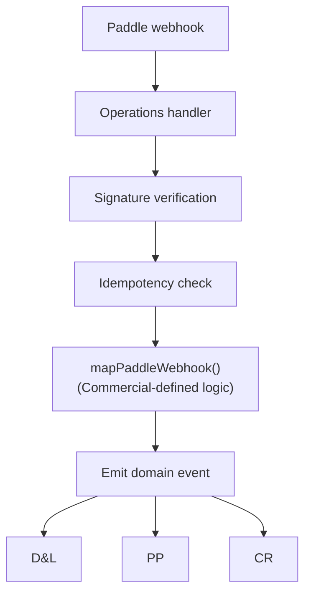

# Operations — Interface Specification

**Status:** Draft v5 — v4 + S10 stress test fix: §3.6 `closeDSARCase` mutation interface added (S10-ST-5). Total: 5 query interfaces + 1 mutation interface.
**Domain:** Operations
**Last updated:** 2026-02-15
**Inputs:** `operations.md` (v6), `cross-domain-dependencies.md` (v3 §2–§4), `decisions/sq-1.md`, `decisions/sq-2.md`, `shared-infrastructure.md` (v2), `data-and-listings.md` (v2)
**Downstream:** `slices/slice-04-subscriptions.md`, `slices/slice-07-operations.md`

---

## Summary

This document specifies the boundary surface of the Operations sub-entity. Operations is the entity's operational backbone — it receives external inputs (Paddle webhooks), coordinates human procurement, maintains compliance, and monitors platform health. Interface: 3 emitted events, 13 consumed events, 5 query interfaces + 1 mutation interface, plus the `TaskSpec` type consumed by D&L and Platform.

---

## 1. Events Emitted (3)

### 1.1 subscription_tier_changed

Operations is the **sole emitter** for subscription tier changes. [Source: CR-X-2]

```typescript
type SubscriptionTierChangedEvent = {
  type: "subscription_tier_changed"
  listingId: UUID
  accountId: UUID
  previousTier: SubscriptionTier
  newTier: SubscriptionTier
  timestamp: ISO8601
}
```

**Emission triggers:**
- Paddle webhook processed via `mapPaddleWebhook()` (checkout, upgrade, downgrade)
- Billing reconciliation detects new subscription creation (`previousTier: "free"`) [XP-14]
- Refund processing via `applyDowngrade` [CR-X-15]

| Consumer | Domain | Action | Sync/Async |
|---|---|---|---|
| Recalculate enrichment cadence | D&L | Update `scheduleEnrichment()` for listing [X-18] | Async |
| Update feature access | PP | Update feature gates for listing (high-priority async) | Async |
| Notify provider | PP | Dashboard notification + email | Async |
| Update revenue metrics | CR | Log conversion/downgrade, update MRR | Async |

### 1.2 subscription_ended

Operations is the primary emitter for Paddle-originated endings. D&L also emits for the archival path (D&L §1.10, `origin: "archival"`). [Source: CD-ST-21]

**Closure path emission [OPS-ST-14]:** Account closure does not emit `subscription_ended` directly. Instead, closure step 2 queues Paddle cancellations via deferred actions. When Paddle confirms cancellation via webhook, Operations processes the webhook and emits `subscription_ended` with `origin: "paddle"`. The `pending_cancellation` registry (§5) attributes the reason as `"account_closure"` via `inferCancellationReason`. This means closure-path subscription endings flow through the standard Paddle webhook path with enhanced attribution, not through a separate emitter.

```typescript
type SubscriptionEndedEvent = {
  type: "subscription_ended"
  listingId: UUID
  accountId: UUID
  previousTier: SubscriptionTier
  reason: "cancellation" | "grace_period_expired" | "account_closure" | "paddle_reconciliation"
  origin: "paddle" | "archival" | "closure"
  timestamp: ISO8601
}
```

| Consumer | Domain | Action | Sync/Async |
|---|---|---|---|
| Downgrade feature access | PP | Set feature access to free tier | Async |
| Show re-subscribe CTA | PP | Display upgrade prompt on dashboard | Async |
| Churn event logging | CR | Log churn event with reason | Async |
| Schedule win-back (60d) | CR | Register deferred action for win-back evaluation | Async |

### 1.3 winback_delivery_result

```typescript
type WinbackDeliveryResultEvent = {
  type: "winback_delivery_result"
  listingId: UUID
  accountId: UUID                   // carried through from winback_eligible.cancelledAccountId [OPS-ST-13]
  status: "delivered" | "failed"        // V2: add "bounced" when Resend delivery webhooks are integrated
  timestamp: ISO8601
}
```

| Consumer | Domain | Action | Sync/Async |
|---|---|---|---|
| Update churn analysis log | CR | Record delivery status for win-back effectiveness [CR-X-7] | Async |

---

## 2. Events Consumed (13)

### From D&L (7 events)

| Event | Ops Consumer Action | Sync/Async |
|---|---|---|
| `claim_approved` | Claim volume tracking, learning hypothesis L2/L3 | Async |
| `claim_rejected` | Claim volume tracking | Async |
| `listing_archived` | Close active support tickets for listing | Async |
| `listing_suspended` | Close/update relevant tickets | Async |
| `listing_reactivated` | Resume outreach, re-enable enrichment cadence [XP-3] | Async |
| `decay_signal_detected` | Cross-ref active tickets, suppress duplicate outreach if `activeSupportTicket` present [X-6] | Async |
| `erasure_completed` | Close DSAR case, create compliance audit record | Orchestrated |

### From Platform (3 events)

| Event | Ops Consumer Action | Sync/Async |
|---|---|---|
| `account_closed` | Close active tickets for account, update compliance register, create compliance hold monitor if `complianceHoldActive` [XP-2] | Async |
| `listing_created` | Onboarding volume tracking [Source: cross-domain-deps §2.2] [OPS-ST-11] | Async |
| `contact_attempt` | Outreach prioritisation for unreachable listings [Source: cross-domain-deps §2.2] [OPS-ST-12] | Async |

### From Commercial (3 events)

| Event | Ops Consumer Action | Sync/Async |
|---|---|---|
| `churn_risk_detected` | Upsert `ChurnRiskRegistry` entry, elevate ticket priority for at-risk subscribers [CR-X-20] | Async |
| `winback_eligible` | Send win-back email via Resend, emit `winback_delivery_result` [CR-35] | Async |
| `pending_cancellation_created` | Store pending cancellation record for Paddle webhook attribution [CR-X-4] | Async |

**Payload fields consumed per P1:**

| Event | Fields Used by Ops |
|---|---|
| `claim_approved` | `listingId`, `method`, `timestamp` |
| `claim_rejected` | `listingId`, `timestamp` |
| `listing_archived` | `listingId` |
| `listing_suspended` | `listingId` |
| `listing_reactivated` | `listingId` |
| `decay_signal_detected` | `listingId`, `signal.severity`, `activeSupportTicket` |
| `erasure_completed` | `accountHash`, `listingIdsAnonymised`, `listingIdsDeleted`, `freelancerListingsDeleted`, `timestamp` |
| `account_closed` | `accountId`, `listingsArchived`, `complianceHoldActive` |
| `listing_created` | `listingId`, `entityType`, `timestamp` |
| `contact_attempt` | `listingId`, `result` |
| `churn_risk_detected` | `listingId`, `accountId`, `riskFactors` |
| `winback_eligible` | `listingId`, `cancelledAccountId`, `mergeFields` |
| `pending_cancellation_created` | `paddleSubscriptionId`, `listingId`, `reason` |

---

## 3. Query Interfaces Exposed (5)

### 3.1 hasActiveTicket

Read-only. D&L calls before suspension and decay signal emission. [Source: X-20]

```typescript
function hasActiveTicket(listingId: UUID): ActiveTicketRecord | null

type ActiveTicketRecord = {
  ticketId: UUID
  category: string
  openedAt: ISO8601
}
```

**Consumer:** D&L — checks before emitting `listing_suspended` and annotates `decay_signal_detected` events.

### 3.2 checkComplianceHold

Read-only. Platform calls during account closure. [Source: XP-20]

```typescript
function checkComplianceHold(accountId: UUID): ComplianceHoldResult

type ComplianceHoldResult = {
  holdExists: boolean
  reason?: string
  holdType?: "open_dsar" | "pending_complaint" | "active_investigation"
}
```

**Consumer:** PP — if hold exists, buyer data deletion is deferred during account closure.

**Concurrent erasure and closure [OPS-ST-8]:** If a user requests both account closure and GDPR erasure, both flows target the same account. Erasure is the more restrictive operation (30-day statutory deadline). Expected behaviour: `checkComplianceHold` returns `holdType: "open_dsar"`, blocking the closure flow's buyer data deletion step. After erasure completes, the DSAR case closes, the hold clears, and the closure flow's `compliance_hold_recheck` deferred action detects the cleared hold and resumes closure. No manual intervention required for this interaction.

### 3.3 getDSARStatus

Read-only. Platform admin dashboard polls for DSAR lifecycle. [Source: XP-12]

```typescript
function getDSARStatus(): DSARDashboardView

type DSARDashboardView = {
  openDSARs: {
    id: UUID
    receivedAt: ISO8601
    daysRemaining: number
    status: "identity_verification" | "data_compilation" | "principal_review"
    accountId: UUID
  }[]
  recentErasures: { id: UUID; completedAt: ISO8601 }[]
  complianceCalendarStatus: string
  upcomingDeadlines: { obligation: string; dueDate: ISO8601 }[]
}
```

**Consumer:** PP (admin dashboard) — read-only display.

**Lifecycle stage clarification [OPS-ST-9]:** The `status` field in `DSARDashboardView.openDSARs` tracks the **compliance lifecycle** (pre-erasure): `"identity_verification"` = 72h acknowledgment + identity check, `"data_compilation"` = preparing the data inventory and response, `"principal_review"` = escalated DSARs requiring principal sign-off. This is distinct from the orchestrated erasure flow (`OrchestratedFlowProgress` in shared-infrastructure §3.2), which tracks execution of the erasure itself after the DSAR is accepted. A DSAR transitions from this lifecycle into the orchestrated flow when the compliance team (or entity) accepts the request and initiates erasure.

### 3.4 getFeatureGateFrictionSummary

Read-only. Commercial consumes during monthly Conversion Funnel Analysis ceremony. [Source: CR-X-6]

```typescript
function getFeatureGateFrictionSummary(period: YearMonth): FeatureGateFrictionSummary

type YearMonth = string  // format: "YYYY-MM", e.g. "2026-01". Matches monthly ceremony cadence. [OPS-ST-10]

type FeatureGateFrictionSummary = {
  period: string
  gates: {
    gateName: string
    ticketCount: number
    totalTickets: number
    frictionRatio: number       // ticketCount / totalTickets (V1 — conversions denominator deferred to S9)
  }[]
}
```

**Consumer:** CR — evaluates friction ratio per gate. Ratio >5:1 (complaints:conversions) triggers principal review.

### 3.5 getBillingReconciliationStatus

Read-only. Platform admin dashboard displays billing health. [Source: CD-8]

```typescript
function getBillingReconciliationStatus(): BillingReconciliationStatus

type BillingReconciliationStatus = {
  lastRunAt: ISO8601
  status: "healthy" | "anomaly_detected" | "failed"
  activeHolds: number
  lastAnomalyAt?: ISO8601
  lastAnomalyDescription?: string
}
```

**Consumer:** PP (admin dashboard) — read-only display.

### 3.6 closeDSARCase

Mutation. Called by the erasure flow orchestrator (step 5) — not via event bus [XI-11].

```typescript
function closeDSARCase(params: {
  dsarCaseId: UUID
  accountId: UUID
  auditData: {
    listingIdsDeleted: UUID[]
    listingIdsAnonymised: UUID[]
    freelancerListingsDeleted: number
    companyListingsAnonymised: number
    accountHash: string
  }
}): Promise<{ completed: boolean }>
```

**Consumer:** Erasure flow orchestrator (SI §13.1 step 5). Updates `compliance_register` status to `'completed'`. Inserts `erasure_audit` compliance record. Clears DSAR compliance hold.

---

## 4. Shared Types Exported

### 4.1 TaskSpec

The interface between the entity's decision engine and the human resource layer. Consumed by D&L (manual review task specs) and PP (admin queue display). [Source: Ops §2]

```typescript
type TaskSpec = {
  id: UUID
  domain: "verification" | "support" | "moderation" | "compliance" | "data_maintenance" | "outreach"
  priority: "critical" | "high" | "normal" | "low"
  task: string
  context: Record<string, any>
  checklist: string[]
  acceptanceCriteria: string
  estimatedTime: string
  deadline?: ISO8601
  timeout: number
  escalation: string
  requiredSkills: string[]
  dataAccessScope: DataAccessScope
  learningCapture: LearningCapture
}

type TaskStatus = "pending" | "assigned" | "in_progress" | "completed" | "timed_out" | "re_routed"

type DataAccessScope = {
  entities: string[]
  fields: string[]
  excludeFields: string[]
  personalDataAccess: boolean
  justification: string
}

type LearningCapture = {
  outcomeCategories: string[]
  hypothesisToTest?: string
  feedbackFields: Record<string, string>
}
```

**Immutability constraint (R6):** TaskSpec instances snapshot field values at creation time. Instances are immutable post-creation. If the underlying data changes (e.g., D&L listing fields), the TaskSpec retains the values as they were when the task was generated.

---

## 5. Paddle Webhook Integration

Operations is the sole Paddle webhook receiver. [Source: CR-X-14]



`mapPaddleWebhook` is defined by Commercial, imported by Operations (P4). Signature verification and idempotency are Ops responsibilities. Webhook handler returns 200 immediately after signature + dedup check, then processes asynchronously via `waitUntil()` (same mechanism as the event bus async consumers — see shared-infrastructure §1.6). [OPS-ST-16]

**Pending cancellation lookup [OPS-ST-5]:** Within `mapPaddleWebhook`, CR's `inferCancellationReason` checks the `pending_cancellation` registry (populated by Ops' `pending_cancellation_created` consumer) for a matching `paddleSubscriptionId`. If found, uses the stored `reason` for attribution (e.g., `"account_closed"`, `"listing_archived"`). If not found, infers reason from Paddle event data. The registry is a simple key-value store: `paddleSubscriptionId → { listingId, reason, createdAt }`. Entries are cleaned up after successful webhook processing.

---

## 6. Non-Functional Requirements

| Requirement | Target | Rationale |
|---|---|---|
| Paddle webhook response | <500ms p95 (ack) | Paddle retries on non-2xx after 30s |
| `hasActiveTicket` query | <50ms p95 | Called synchronously before D&L suspension decision |
| `checkComplianceHold` query | <100ms p95 | Called during account closure orchestrated flow |
| `getDSARStatus` query | <200ms p95 | Admin dashboard, no user waiting |
| `getFeatureGateFrictionSummary` query | <500ms p95 | Monthly ceremony, batch aggregation |
| `getBillingReconciliationStatus` query | <100ms p95 | Admin dashboard |
| TaskSpec creation | <200ms p95 | Generated during claim evaluation or support triage |

---

## 7. Win-Back Email Delivery

**Resolution [OPS-ST-4]:** The win-back email uses a `winback` template registered in the email template inventory. CR provides merge field values (`mergeFields.subject`, `mergeFields.body`, `mergeFields.listingName`, optional `mergeFields.enquiryCount`/`mergeFields.viewCount`) via the `winback_eligible` event payload [CR-ST-5]. Operations resolves `accountEmail` from `event.cancelledAccountId` via the account data store (auth/session infrastructure — not a cross-domain read) [XI-6]. Operations calls `EmailService.send({ to: accountEmail, template: "winback", data: event.mergeFields, category: "conversion_marketing", accountId: event.cancelledAccountId })`. The email service checks unsubscribe preferences (shared-infrastructure §5.1) — if the account has unsubscribed from `conversion_marketing`, the win-back is suppressed and Ops emits `winback_delivery_result` with `status: "failed"`.

This adds a 23rd email template to the inventory. PP's template table (PP §4) must be updated to include `winback`.

---

## 8. Stress Test Resolution Log (v2)

20 scenarios targeting boundary surface. 2 High, 8 Medium, 6 Low, 4 Pass. 16 fixes applied.

| # | Scenario | Severity | Resolution |
|---|---|---|---|
| OPS-ST-1 | `subscription_tier_changed` payload has `accountId` but no consumer's P1 table declares it. PP needs it for email/notification routing. CR needs it for MRR per-account tracking. | **Medium** | Consumer P1 tables in PP and CR specs updated (sibling fix). Payload is correct. |
| OPS-ST-2 | Events Consumed "From Commercial" header count (2) doesn't match row count (3). Also confirms Ops is emitter not consumer of `subscription_ended`. | **Low** | Fixed header count. No other change needed. |
| OPS-ST-3 | "From Commercial (2 events)" header but 3 events listed. | **Medium** | Fixed to "From Commercial (3 events)". |
| OPS-ST-4 | Win-back email: `winback_eligible.emailContent` provides subject+body, but `EmailService.send()` takes a `template` ID, not raw content. | **Medium** | Added §7: `winback` template ID added to inventory. CR provides merge fields. PP template table updated. |
| OPS-ST-5 | Pending cancellation storage and lookup path undocumented in Paddle webhook flow. | **Medium** | Added pending cancellation registry documentation to §5. Key-value store: `paddleSubscriptionId → { listingId, reason, createdAt }`. |
| OPS-ST-6 | `decay_signal_detected.activeSupportTicket` is UUID, not boolean. P1 lists it correctly. | **Low** | Pass. UUID used for both presence check and cross-reference. |
| OPS-ST-7 | `hasActiveTicket.category` string convention — does D&L's deferral check care about Ops-created categories? | **Low** | Pass. D&L limits deferral to two named categories. Other categories don't block suspension. |
| OPS-ST-8 | Concurrent erasure and closure flows for same account — interaction undocumented. | **Medium** | Added concurrent flow interaction note to `checkComplianceHold` (§3.2). DSAR hold blocks closure; erasure completes first; hold clears; closure resumes. |
| OPS-ST-9 | `getDSARStatus` lifecycle statuses don't map to orchestrated flow steps. | **Medium** | Added lifecycle stage clarification note to §3.3. DSAR lifecycle (pre-erasure) is distinct from orchestrated flow progress (erasure execution). |
| OPS-ST-10 | `getFeatureGateFrictionSummary(period: string)` — period format unspecified. | **Low** | Typed as `YearMonth` (format: `"YYYY-MM"`). Matches monthly ceremony cadence. |
| OPS-ST-11 | Ops consumes `listing_created` (PP) for onboarding tracking — missing from spec. | **High** | Added to "From Platform" section. Total consumed events updated to 13. |
| OPS-ST-12 | Ops consumes `contact_attempt` (PP) for outreach prioritisation — missing from spec. | **High** | Added to "From Platform" section. "From Platform" updated from 1 to 3 events. |
| OPS-ST-13 | `winback_delivery_result` payload missing `accountId`. CR must DB-read to find account — P1 violation. | **Medium** | Added `accountId: UUID` to `WinbackDeliveryResultEvent`. Carried through from `winback_eligible.cancelledAccountId`. |
| OPS-ST-14 | `subscription_ended` emitter for closure path: PP spec doesn't list it as an emitted event. Ambiguous emission path. | **Medium** | Resolved. Closure path does not emit `subscription_ended` directly. Closure queues Paddle cancellation via deferred action; Paddle webhook confirmation triggers Ops to emit with `origin: "paddle"` + `reason: "account_closure"` via pending cancellation attribution. |
| OPS-ST-15 | TaskSpec `domain` enum — which events trigger TaskSpec creation undocumented. | **Low** | Pass. TaskSpec creation triggers are internal Ops implementation detail, not contract surface. Slice-level (S7). |
| OPS-ST-16 | Paddle webhook async processing mechanism unspecified. | **Low** | Added: `waitUntil()` consistent with event bus async model. |
| OPS-ST-17 | Paddle webhook <500ms NFR with DB read for idempotency. | **Low** | Pass. Signature (<10ms) + indexed DB read (<50ms) = well within budget at V1 scale. |
| OPS-ST-18 | `getBillingReconciliationStatus.lastAnomalyDescription` — anomaly types undocumented. | **Low** | Pass. Implementation detail for S7. Interface type is correct. |
| OPS-ST-19 | Cross-references cite `shared-infrastructure.md (v1)` — now v2. | **Low** | Updated to v2. |
| OPS-ST-20 | Inputs header missing `data-and-listings.md` dependency. `shared-infrastructure.md` version stale. | **Low** | Added `data-and-listings.md (v2)` to inputs. Updated `shared-infrastructure.md` to v2. |

---

## Cross-References

| Document | Relationship |
|---|---|
| `operations.md` (v6) | TaskSpec standard (§2), billing reconciliation (§7), compliance queries (§5), active ticket registry (§4), feature gate friction interface (§4) |
| `cross-domain-dependencies.md` (v3) | Event payloads (§2.3), consumer matrix (§2.2), query interfaces (§2.4), Paddle integration (§3.3) |
| `data-and-listings.md` (v2) | 7 consumed D&L events, `hasActiveTicket` pre-emission check (D&L §1.4), shared types |
| `platform-and-product.md` (v1) | 3 consumed PP events (`account_closed`, `listing_created`, `contact_attempt`), email delivery pipeline |
| `commercial-and-revenue.md` (v1) | 3 consumed CR events, `mapPaddleWebhook` (CR §4.4), `inferCancellationReason` |
| `decisions/sq-1.md` | Sync/async classification for all consumers |
| `decisions/sq-2.md` | Orchestrated flow recovery model |
| `shared-infrastructure.md` (v2) | Event bus contract (§1), orchestrated flow engine (§3), deferred action scheduler (§2), `waitUntil()` constraints (§1.6) |
