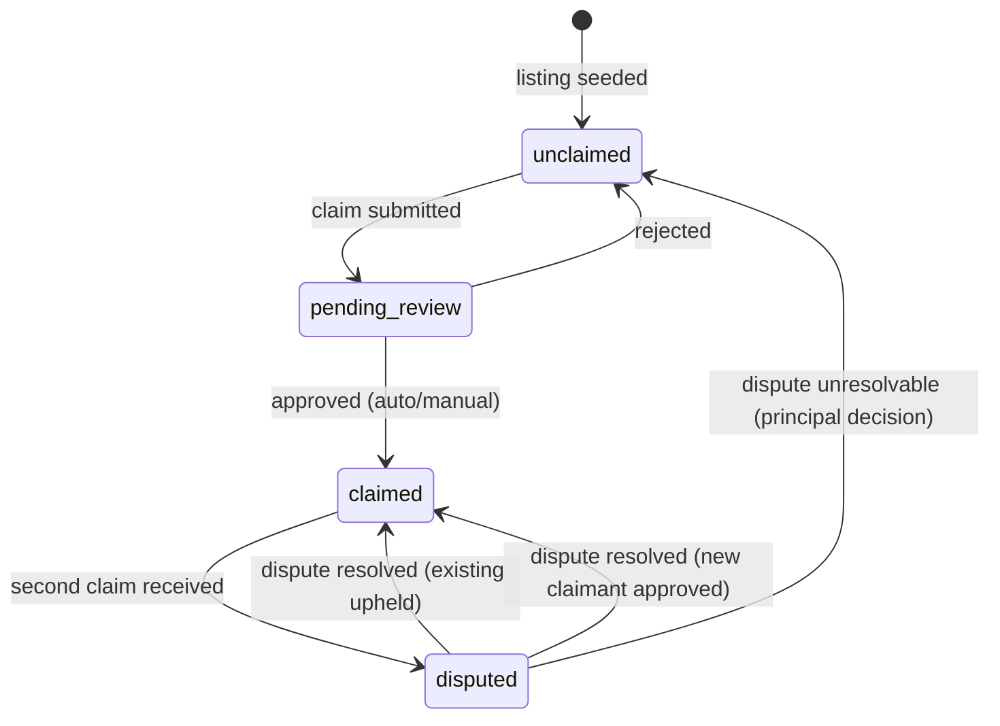

# Slice 3: Claim & Verify

**Status:** Draft v2 — v1 + 14 stress test fixes (5 High, 6 Medium, 6 Low). 48 acceptance criteria.
**Primary Owner:** Data & Listings
**Last updated:** 2026-02-13
**Dependencies:** S0 (event bus, scheduler, auth, email transport, service abstraction, tRPC, decision logging), S1 (Listing schema, Verification table, pre_claim_snapshots, pending_enquiries, integrity rules), S2 (claim form, pre-claim snapshot creation, deliverPendingEnquiries stub, scheduleClaimProgressiveDisclosure, enquiry_forwarded template)
**Inputs:** `interfaces/data-and-listings.md` (v5), `interfaces/operations.md` (v4), `interfaces/platform-and-product.md` (v6), `interfaces/shared-infrastructure.md` (v8), `2-concept-design/data-and-listings.md` (v6 §4), `slices/slice-00-infrastructure.md` (v2), `slices/slice-01-data-model.md` (v2), `slices/slice-02-onboarding.md` (v2) [spec versions current as of S8 v2]
**Downstream:** S4 (Subscriptions), S5 (Provider Experience), S7 (Operations)

---

## Summary

S3 replaces S2's claim stub (`claimStatus = "pending_review"` for all claims) with the full `evaluateClaim()` decision architecture: auto-approve, auto-reject, manual review routing, and competing claim handling. S3 also implements the `claim_approved` post-processing pipeline (snapshot edits application, pending enquiry delivery, progressive disclosure scheduling, Article 14 banner removal), the `claim_rejected` cleanup pipeline, the verification upgrade path (claimed → verified), and the `verification_tier_changed` event emission. This is D&L's primary decision architecture — every claim produces a structured decision log entry.

**Event emission ownership:** S3 follows S1's established pattern — tRPC routes are Platform's surface. The claim evaluation tRPC route calls D&L domain logic (`evaluateClaim`), then Platform emits `claim_approved` or `claim_rejected` from the route handler. `verification_tier_changed` is emitted from D&L domain logic directly (no tRPC surface — triggered by async processes). [Source: S1 Summary]

## V1 Scope Boundary

**In scope:** `evaluateClaim()` with Companies House API integration, email domain matching, auto-approve/reject/manual-review routing, competing claim detection and dispute creation, `onManualReviewComplete` callback, `claim_approved` post-processing (snapshot edit application, enquiry delivery, progressive disclosure, Article 14 banner, quality score recalculation), `claim_rejected` cleanup, optimistic locking on `claimStatus`, verification upgrade evaluation (`evaluateVerificationUpgrade`), decision logging for all claim and verification decisions, 3 email templates, 2 deferred action handlers, 2 notification types.

**Deferred to later slices:** Admin claim review UI (S7 — S3 creates TaskSpecs, S7 displays them). Subscription-gated verification features like Premium Verified (S4). Verification calibration ceremony automation (S9). Client credit confirmation outreach (S9).

---

## 1. Claim Evaluation — `evaluateClaim()`

The core D&L decision architecture. Replaces S2's stub. [Source: D&L concept design §4]

### 1.1 Module Layout

```
src/domains/data-and-listings/
├── claim/
│   ├── evaluate-claim.ts          ← evaluateClaim() + lock management
│   ├── claim-approved.ts          ← onClaimApproved() post-processing
│   ├── claim-rejected.ts          ← onClaimRejected() cleanup
│   ├── competing-claim.ts         ← dispute creation + notification
│   ├── manual-review.ts           ← TaskSpec generation + onManualReviewComplete()
│   └── types.ts                   ← ClaimDecision, ClaimRequest (local, not exported)
├── verification/
│   ├── evaluate-upgrade.ts        ← evaluateVerificationUpgrade()
│   └── types.ts                   ← UpgradeDecision (local)
```

### 1.2 Claim Decision Types

```typescript
// src/domains/data-and-listings/claim/types.ts

type ClaimDecision =
  | { action: "auto_approve"; confidence: number; tier: "claimed"; verificationPoints: number }
  | { action: "auto_reject"; confidence: number; reasons: string[] }
  | { action: "queue_manual_review"; confidence: number; reasons: string[]; taskSpec: TaskSpec }
  | { action: "queue_dispute_resolution"; confidence: 0; reasons: string[]; taskSpec: TaskSpec }
  | { action: "retry"; reasons: string[] }

type ClaimRequest = {
  listingId: UUID
  accountId: UUID
  companiesHouseNumber?: string
  claimEmail: string
  evidenceUrls: string[]
}
```

### 1.3 Evaluation Logic

Contract: `data-and-listings.md` (v6 §4), D&L interface spec §1.1, §1.2. S3 replaces the S2 stub in the `submitClaim` tRPC route.

```typescript
// src/domains/data-and-listings/claim/evaluate-claim.ts

async function evaluateClaim(
  request: ClaimRequest,
  listing: Listing,
  services: { companiesHouse: CompaniesHouseService }
): Promise<ClaimDecision> {

  // Optimistic lock on listing.claimStatus [Source: D&L concept design §4]
  // Uses Drizzle's WHERE clause: UPDATE listings SET claim_status = $new
  //   WHERE id = $id AND claim_status = $expected
  // Returns 0 rows affected if concurrent modification detected.

  // Guard: pending_review blocks concurrent claims
  if (listing.claimStatus === "pending_review") {
    return { action: "retry", reasons: ["claim already under manual review"] }
  }

  // Step 0: Competing claim detection
  if (listing.claimStatus === "claimed") {
    // Set claimStatus = "disputed" via optimistic lock
    // Create TaskSpec for dispute resolution
    // Notify existing claimant (email + in-app notification)
    return {
      action: "queue_dispute_resolution",
      confidence: 0,
      reasons: ["listing already claimed — competing claim received"],
      taskSpec: buildDisputeTaskSpec(listing, request),
    }
  }

  // Step 1: CH dissolution guard (must precede email domain match) [S3-ST-1]
  // A dissolved company with a matching email domain must NOT auto-approve.
  // Concept design §4 checks CH dissolution before domain match for non-freelancers.
  if (request.companiesHouseNumber) {
    const chResult = await services.companiesHouse.lookup(request.companiesHouseNumber)

    if (chResult.found && chResult.status === "dissolved") {
      return {
        action: "auto_reject",
        confidence: 0.95,
        reasons: ["entity dissolved per Companies House"],
      }
    }

    // CH active paths handled in Step 3 below
    if (chResult.found && chResult.status === "active") {
      // Step 2: Email domain match (with active CH confirmation)
      if (listing.websiteUrl && emailDomainMatches(request.claimEmail, listing.websiteUrl)) {
        return { action: "auto_approve", confidence: 0.95, tier: "claimed", verificationPoints: 5 }
      }
      // CH active but no domain match → manual review
      return {
        action: "queue_manual_review",
        confidence: 0.5,
        reasons: ["CH match but no domain confirmation"],
        taskSpec: buildManualReviewTaskSpec(listing, request, "partial_match"),
      }
    }

    // CH number provided but not found or unrecognised status → manual review
    return {
      action: "queue_manual_review",
      confidence: 0.4,
      reasons: ["CH number provided but lookup inconclusive"],
      taskSpec: buildManualReviewTaskSpec(listing, request, "insufficient_evidence"),
    }
  }

  // Step 3: No CH number — email domain match (freelancers + companies without CH)
  if (listing.websiteUrl && emailDomainMatches(request.claimEmail, listing.websiteUrl)) {
    return { action: "auto_approve", confidence: 0.9, tier: "claimed", verificationPoints: 5 }
  }

  // Step 4: No CH number + freelancer → manual review
  if (listing.entityType === "freelancer") {
    return {
      action: "queue_manual_review",
      confidence: 0.4,
      reasons: ["sole trader — no CH record, need alternative verification"],
      taskSpec: buildManualReviewTaskSpec(listing, request, "sole_trader"),
    }
  }

  // Step 5: Fallback — queue for manual review
  return {
    action: "queue_manual_review",
    confidence: 0.5,
    reasons: ["insufficient automated verification evidence"],
    taskSpec: buildManualReviewTaskSpec(listing, request, "insufficient_evidence"),
  }
}
```

**`emailDomainMatches` [Source: D&L concept design §4 Step 1]:** Extracts the domain from `claimEmail` and compares against the domain parsed from `websiteUrl`. Comparison is case-insensitive. Supports `www.` prefix stripping. Does not follow redirects or resolve DNS — static string comparison only. Used in two contexts: (a) with active CH confirmation (Step 2, confidence 0.95), (b) without CH for freelancers/companies without CH number (Step 3, confidence 0.9). [S3-ST-1, S3-ST-8]

### 1.4 Optimistic Locking

```typescript
async function acquireClaimLock(
  listingId: UUID,
  expectedStatus: ClaimStatus,
  newStatus: ClaimStatus
): Promise<boolean> {
  const result = await db.update(listings)
    .set({ claimStatus: newStatus, updatedAt: new Date() })
    .where(
      and(
        eq(listings.id, listingId),
        eq(listings.claimStatus, expectedStatus),
      )
    )
  return result.rowCount > 0
}
```

Lock lifecycle: held only during synchronous evaluation phase (milliseconds). When routed to manual review, lock is released but `claimStatus` is set to `"pending_review"` — blocks concurrent claims at application level without holding a database lock. [Source: D&L concept design §4 X-2]

---

## 2. tRPC Route — Claim Submission

S3 replaces S2's claim stub in the `submitClaim` mutation. S2's snapshot creation and integrity checks remain. S3 amends S2's step 2/3 to include `claimantAccountId: ctx.session.userId` in the snapshot JSONB alongside `pendingEdits` [S3-ST-5]. S3 also cancels S2's 90-day `pre_claim_snapshot_cleanup` when the claim enters `pending_review` or `disputed` state [S3-ST-20]. S3 inserts the `evaluateClaim` call after S2's steps 1–4.

```typescript
// src/server/routers/claim.ts (S3 replaces S2 stub logic)
export const claimRouter = router({
  submitClaim: protectedProcedure
    .input(/* S2's existing input schema — unchanged */)
    .mutation(async ({ ctx, input }) => {
      // Steps 1–4: S2's existing logic (snapshot, edits, integrity)
      // S3 AMENDS S2 step 2/3: snapshot JSONB now includes claimantAccountId [S3-ST-5]:
      //   snapshot = { claimantAccountId: ctx.session.userId, pendingEdits: edits }
      // S3 AMENDS S2 step 6: cancel pre_claim_snapshot_cleanup before evaluation [S3-ST-20]:
      //   await cancelDeferredAction<"pre_claim_snapshot_cleanup">({
      //     action: "pre_claim_snapshot_cleanup", params: { listingId: input.listingId }
      //   })

      // Step 5: S3 replaces S2 stub with full evaluation
      const listing = await getListing(input.listingId)
      const decision = await evaluateClaim(
        {
          listingId: input.listingId,
          accountId: ctx.session.userId,
          companiesHouseNumber: input.companiesHouseNumber,
          claimEmail: input.claimEmail ?? ctx.session.user.email,
          evidenceUrls: input.evidenceUrls ?? [],
        },
        listing,
        { companiesHouse: ctx.services.companiesHouse },
      )

      // Step 6: Log decision [Source: SI §9]
      await logDecision({
        domain: "data-and-listings",
        decisionType: "claim_evaluation",
        inputs: { listingId: input.listingId, entityType: listing.entityType, hasChNumber: !!input.companiesHouseNumber },
        output: { action: decision.action, confidence: "confidence" in decision ? decision.confidence : null },
        confidence: "confidence" in decision ? decision.confidence : undefined,
        entityContext: { listingId: input.listingId, accountId: ctx.session.userId },
      })

      // Step 7: Execute decision
      switch (decision.action) {
        case "auto_approve":
          await onClaimApproved(listing, ctx.session.userId, "auto")
          // Platform emits claim_approved (S1 pattern: tRPC = PP surface)
          await emit({ type: "claim_approved", listingId: input.listingId, accountId: ctx.session.userId, method: "auto", timestamp: new Date().toISOString() })
          return { status: "approved" as const }

        case "auto_reject":
          await onClaimRejected(listing, ctx.session.userId, decision.reasons)
          // Platform emits claim_rejected
          await emit({ type: "claim_rejected", listingId: input.listingId, claimantAccountId: ctx.session.userId, reason: decision.reasons.join("; "), timestamp: new Date().toISOString() })
          return { status: "rejected" as const, reasons: decision.reasons }

        case "queue_manual_review":
          // claimStatus already set to "pending_review" by acquireClaimLock
          await createTaskSpec(decision.taskSpec)
          await createNotification({
            accountId: ctx.session.userId,
            type: "claim_pending_review",
            title: "Claim under review",
            body: "We're verifying your claim. You'll hear back within 48 hours.",
          })
          await sendEmail("claim_pending_review", ctx.session.userId, { listingName: listing.name })
          // Schedule 90-day snapshot cleanup (S2's deferred action — already scheduled by S2 step 6)
          return { status: "pending_review" as const }

        case "queue_dispute_resolution":
          // claimStatus set to "disputed" within evaluateClaim
          await createTaskSpec(decision.taskSpec)
          // Notify existing claimant
          await createNotification({
            accountId: listing.accountId!,
            type: "claim_pending_review",
            title: "Your listing claim is being reviewed",
            body: "Another party has submitted a claim for this listing. We're investigating.",
          })
          await sendEmail("claim_dispute_notification", listing.accountId!, {
            listingName: listing.name,
            disputeContext: "Another party has submitted a claim for this listing. We're investigating.",
          }) // [S3-ST-19]
          return { status: "disputed" as const }

        case "retry":
          // Concurrent modification — return 409 equivalent
          throw new TRPCError({ code: "CONFLICT", message: decision.reasons.join("; ") })
      }
    }),

  // Admin callback: manual review complete
  resolveManualReview: adminProcedure
    .input(z.object({
      listingId: z.string().uuid(),
      decision: z.enum(["approve", "reject"]),
      reviewNotes: z.string().optional(),
    }))
    .mutation(async ({ ctx, input }) => {
      await onManualReviewComplete(input.listingId, input.decision, input.reviewNotes, ctx.session.userId)
    }),
})
```

---

## 3. Post-Approval Pipeline — `onClaimApproved()`

Runs after any successful claim (auto, manual, or dispute resolution). [Source: D&L concept design §4 `onClaimApproved`]

```typescript
// src/domains/data-and-listings/claim/claim-approved.ts

async function onClaimApproved(
  listing: Listing,
  accountId: UUID,
  method: "auto" | "manual" | "disputed_resolved"
): Promise<void> {
  // 1. Apply edits from pre-claim snapshot [S2-9]
  const snapshot = await db.select().from(preClaimSnapshots).where(eq(preClaimSnapshots.listingId, listing.id)).limit(1)
  if (snapshot.length > 0 && snapshot[0].snapshot.pendingEdits) {
    await applySnapshotEdits(listing.id, snapshot[0].snapshot.pendingEdits)
  }

  // 2. Update listing ownership + clear Article 14 banner (single UPDATE) [S3-ST-2]
  await db.update(listings).set({
    accountId,
    claimStatus: "claimed",
    article14NoticeDisplayed: false, // [S2-ST-6]
    updatedAt: new Date(),
  }).where(eq(listings.id, listing.id))

  // 3. Update verification
  await db.update(verifications).set({
    tier: "claimed",
    claimedAt: new Date(),
  }).where(eq(verifications.listingId, listing.id))

  // 4. Deliver pending enquiries [S1-10, S2 §5.3]
  const pendingEnquiries = await db.select()
    .from(pendingEnquiriesTable)
    .where(
      and(
        eq(pendingEnquiriesTable.listingId, listing.id),
        isNull(pendingEnquiriesTable.forwardedAt),
        gt(pendingEnquiriesTable.expiresAt, new Date()),
      )
    )
  if (pendingEnquiries.length > 0) {
    const enquiryIds = pendingEnquiries.map(e => e.enquiryId)
    await deliverPendingEnquiries(listing.id, enquiryIds)  // S2's stub, now fully implemented
  }

  // 5. Schedule claim-path progressive disclosure [S2-8]
  await scheduleClaimProgressiveDisclosure(listing.id, accountId)  // S2 §7.2

  // 6. Recalculate quality score (verification dimension changes)
  await recalculateQualityScore(listing.id)  // S1 §10 two-phase: triggers quality_score_changed event

  // 7. Delete snapshot (claim resolved, edits applied or N/A)
  await db.delete(preClaimSnapshots).where(eq(preClaimSnapshots.listingId, listing.id))

  // 8. Log decision [Source: SI §9] [S3-ST-10]
  await logDecision({
    domain: "data-and-listings",
    decisionType: "claim_post_processing",
    inputs: { listingId: listing.id, method },
    output: { action: "approved", pendingEnquiriesDelivered: pendingEnquiries.length },
    entityContext: { listingId: listing.id, accountId },
  })
}
```

**Note [S3-ST-20]:** S2's `pre_claim_snapshot_cleanup` (90-day) is cancelled at claim submission time (§2 S2 amendment), not at resolution time. This prevents the cleanup from deleting snapshot data needed by `onManualReviewComplete` for claims pending >90 days. `onClaimApproved` and `onClaimRejected` delete the snapshot directly — no deferred action cancel needed at resolution time.

### 3.1 Snapshot Edit Application

Edits stored in `pre_claim_snapshots.snapshot.pendingEdits` during S2's `submitClaim`. [S2-ST-14, S2-9]

```typescript
async function applySnapshotEdits(listingId: UUID, edits: Record<string, unknown>): Promise<void> {
  // Edits are a partial Listing update object — field names match Drizzle columns
  // Validated at S2 submission time; S3 applies without re-validation
  await db.update(listings).set({
    ...edits,
    updatedAt: new Date(),
  }).where(eq(listings.id, listingId))
}
```

### 3.2 `deliverPendingEnquiries` Implementation

S2 provided the function signature and stub (S2 §5.3). S3 implements the full delivery.

```typescript
// src/domains/platform/enquiry-delivery.ts (S3 completes the S2 stub)

async function deliverPendingEnquiries(listingId: UUID, enquiryIds: UUID[]): Promise<number> {
  let delivered = 0
  // Fetch listing once — avoids N+1 getListing calls per batch [S3-ST-3]
  const listing = await getListing(listingId)
  const batches = chunk(enquiryIds, 5) // Batch enquiries into groups of 5 for email [S2 §5.3]

  // Note: enquiryIds are from pending_enquiries.enquiryId, which stores enquiry_records.id
  // (both PP-owned UUIDs). The inArray lookup column is enquiry_records.id. [S3-ST-4]

  for (const batch of batches) {
    const enquiries = await db.select()
      .from(enquiryRecords)
      .where(inArray(enquiryRecords.id, batch))

    for (const enquiry of enquiries) {
      await createNotification({
        accountId: listing.accountId!,
        type: "enquiry_received",
        title: "New enquiry",
        body: `You have a new enquiry for your listing`,
        link: `/dashboard/enquiries/${enquiry.id}`,
      })
    }

    // Send batched enquiry_forwarded email (registered in S2 §10)
    await sendEmail("enquiry_forwarded", listing.accountId!, {
      listingName: listing.name,
      enquiryCount: batch.length,
    })

    // Mark as forwarded
    await db.update(pendingEnquiriesTable).set({
      forwardedAt: new Date(),
    }).where(inArray(pendingEnquiriesTable.enquiryId, batch))

    delivered += enquiries.length
  }

  return delivered
}
```

---

## 4. Rejection Pipeline — `onClaimRejected()`

```typescript
// src/domains/data-and-listings/claim/claim-rejected.ts

async function onClaimRejected(
  listing: Listing,
  claimantAccountId: UUID,
  reasons: string[]
): Promise<void> {
  // 1. Reset claimStatus — branch on current state [S3-ST-14]
  // disputed → "claimed" (existing claimant upheld, new claimant rejected)
  // pending_review → "unclaimed" (releases for future claims)
  const newClaimStatus = listing.claimStatus === "disputed" ? "claimed" : "unclaimed"
  await db.update(listings).set({
    claimStatus: newClaimStatus,
    updatedAt: new Date(),
  }).where(eq(listings.id, listing.id))

  // 2. Discard snapshot edits [S2-9] — delete snapshot, edits are NOT applied
  await db.delete(preClaimSnapshots).where(eq(preClaimSnapshots.listingId, listing.id))
}
```

---

## 5. Manual Review — TaskSpec Generation

### 5.1 Review TaskSpec Builder

Contract: `operations.md` §4.1 (`TaskSpec` type). D&L generates TaskSpecs; S7 displays them in admin UI.

```typescript
// src/domains/data-and-listings/claim/manual-review.ts

function buildManualReviewTaskSpec(
  listing: Listing,
  request: ClaimRequest,
  reason: "sole_trader" | "partial_match" | "insufficient_evidence"
): TaskSpec {
  return {
    id: crypto.randomUUID(),
    domain: "verification",
    priority: "normal",
    task: `Verify claim authenticity for listing: ${listing.name}`,
    context: {
      listingId: listing.id,
      listingName: listing.name,
      entityType: listing.entityType,
      companiesHouseNumber: listing.companiesHouseNumber,
      claimantAccountId: request.accountId,
      claimEmail: request.claimEmail,
      evidenceUrls: request.evidenceUrls,
      reason,
    },
    checklist: [
      "Verify claimant is a director, partner, or authorised representative",
      "If CH number provided: cross-reference claimant name against CH director list",
      "If sole trader: check VAT registration, trade body membership, or portfolio evidence",
      "If partial match: verify domain ownership via WHOIS or request authorisation letter on company letterhead",
      "Check for red flags: Gmail/Hotmail claiming a corporate listing, mismatched location, no professional presence",
    ],
    acceptanceCriteria: "Approve only if claimant demonstrates legitimate authority over the business entity",
    estimatedTime: "10–15 minutes",
    timeout: 48 * 60 * 60 * 1000, // 48 hours
    escalation: "If evidence is ambiguous, reject claim with explanation and invite resubmission with additional evidence",
    requiredSkills: ["identity_verification", "companies_house"],
    dataAccessScope: {
      entities: ["listing", "account"],
      fields: ["name", "companiesHouseNumber", "contactEmail", "websiteUrl", "entityType"],
      excludeFields: [],
      personalDataAccess: true,
      justification: "Claim verification requires cross-referencing claimant identity with listing data",
    },
    learningCapture: {
      outcomeCategories: ["approved", "rejected", "escalated"],
      hypothesisToTest: "Email domain match + CH director match predicts legitimate claim",
      feedbackFields: {
        reviewerConfidence: "How confident are you in this decision? (1–5)",
        evidenceQuality: "Was the submitted evidence sufficient? (yes/partial/no)",
        redFlags: "Any red flags observed?",
      },
    },
  }
}
```

### 5.2 Dispute TaskSpec Builder

```typescript
function buildDisputeTaskSpec(listing: Listing, request: ClaimRequest): TaskSpec {
  return {
    id: crypto.randomUUID(),
    domain: "verification",
    priority: "high",
    task: `Resolve competing claim for listing: ${listing.name}`,
    context: {
      listingId: listing.id,
      existingClaimantAccountId: listing.accountId,
      newClaimantAccountId: request.accountId,
      newClaimEmail: request.claimEmail,
      evidenceUrls: request.evidenceUrls,
    },
    checklist: [
      "Verify which claimant is the authorised representative",
      "Cross-reference both claimants against CH director list (if available)",
      "Check domain ownership for both parties",
      "If both legitimate (e.g., business partners): offer designation of primary contact or separate listings",
      "Request authorisation letter if evidence is ambiguous",
    ],
    acceptanceCriteria: "Determine which claimant has legitimate authority. If unresolvable, escalate to principal.",
    estimatedTime: "20–30 minutes",
    timeout: 14 * 24 * 60 * 60 * 1000, // 14 days
    escalation: "If unresolvable within 14 days, escalate to principal. Freeze listing visibility until resolved.", // [S3-ST-13] deferred action (§10) is the enforcement mechanism; this timeout is informational
    requiredSkills: ["identity_verification", "dispute_resolution", "companies_house"],
    dataAccessScope: {
      entities: ["listing", "account"],
      fields: ["name", "companiesHouseNumber", "contactEmail", "websiteUrl", "entityType"],
      excludeFields: [],
      personalDataAccess: true,
      justification: "Dispute resolution requires cross-referencing both claimant identities",
    },
    learningCapture: {
      outcomeCategories: ["existing_claimant_upheld", "new_claimant_approved", "both_legitimate", "escalated_to_principal"],
      hypothesisToTest: "Competing claims correlate with high-value listings",
      feedbackFields: {
        resolutionMethod: "How was the dispute resolved?",
        timeToResolve: "Days from dispute creation to resolution",
      },
    },
  }
}
```

### 5.3 Manual Review Completion Callback

Invoked by admin (S7 UI) or programmatically when Operations completes a TaskSpec. [Source: D&L concept design §4 `onManualReviewComplete`]

```typescript
async function onManualReviewComplete(
  listingId: UUID,
  decision: "approve" | "reject",
  reviewNotes: string | undefined,
  reviewerAccountId: UUID
): Promise<void> {
  const listing = await getListing(listingId)

  // Guard: listing must be in pending_review or disputed state
  if (listing.claimStatus !== "pending_review" && listing.claimStatus !== "disputed") {
    throw new TRPCError({ code: "BAD_REQUEST", message: `listing claimStatus is ${listing.claimStatus}, expected pending_review or disputed` })
  }

  // Determine the claimant accountId
  // For pending_review: stored in pre_claim_snapshots.snapshot.claimantAccountId
  // For disputed: the new claimant is in the TaskSpec context
  const snapshot = await db.select().from(preClaimSnapshots).where(eq(preClaimSnapshots.listingId, listingId)).limit(1)
  const claimantAccountId = snapshot[0]?.snapshot?.claimantAccountId

  if (!claimantAccountId) {
    throw new TRPCError({ code: "INTERNAL_SERVER_ERROR", message: "no claimant accountId in snapshot" })
  }

  const method: "manual" | "disputed_resolved" = listing.claimStatus === "disputed" ? "disputed_resolved" : "manual"

  if (decision === "approve") {
    await onClaimApproved(listing, claimantAccountId, method)
    await emit({
      type: "claim_approved",
      listingId,
      accountId: claimantAccountId,
      method,
      timestamp: new Date().toISOString(),
    })
    // Send approval email
    await sendEmail("claim_approved", claimantAccountId, { listingName: listing.name })
    await createNotification({
      accountId: claimantAccountId,
      type: "claim_approved",
      title: "Claim approved",
      body: `Your claim for ${listing.name} has been approved. You can now manage your listing.`,
      link: `/dashboard/listings/${listingId}`,
    })
  } else {
    await onClaimRejected(listing, claimantAccountId, [reviewNotes ?? "Manual review rejection"])
    await emit({
      type: "claim_rejected",
      listingId,
      claimantAccountId,
      reason: reviewNotes ?? "Manual review rejection",
      timestamp: new Date().toISOString(),
    })
    // Send rejection email
    await sendEmail("claim_rejected", claimantAccountId, {
      listingName: listing.name,
      reason: reviewNotes ?? "Unable to verify your authority over this business",
    })
    await createNotification({
      accountId: claimantAccountId,
      type: "claim_rejected",
      title: "Claim not approved",
      body: `Your claim for ${listing.name} was not approved. You may resubmit with additional evidence.`,
    })
  }

  // Log the manual review decision
  await logDecision({
    domain: "data-and-listings",
    decisionType: "claim_evaluation",
    inputs: { listingId, decision, reviewNotes, reviewerAccountId, method },
    output: { action: decision === "approve" ? "approved" : "rejected" },
    entityContext: { listingId, accountId: claimantAccountId },
  })
}
```

---

## 6. Competing Claims

### 6.1 Dispute State Machine



### 6.2 Dispute Resolution Outcomes

When the admin resolves a dispute via `resolveManualReview`:

**Existing claimant upheld:** `claimStatus` reverts from `"disputed"` to `"claimed"`. New claimant notified with rejection reason. Existing claimant notified that their claim is confirmed.

**New claimant approved:** Listing ownership transfers. Old `accountId` replaced. Pre-claim snapshot of the *original* state preserved. `claimStatus` set to `"claimed"`. Old claimant notified. New claimant receives full `onClaimApproved` pipeline.

**Both legitimate (business partners):** Admin contacts both parties via TaskSpec escalation. Options: designate primary contact, or admin creates separate listings. This path is handled within the TaskSpec workflow (S7), not S3 domain logic.

**Unresolvable → principal escalation:** After 14 days, the dispute TaskSpec times out. Auto-escalation deferred action (S0 §3.4) fires. Listing visibility frozen (`lifecycleStatus = "suspended"`) until resolution. [Source: D&L concept design §4, escalation topology cross-domain-deps §4]

### 6.3 Schema Addition — Dispute Tracking

```typescript
// Migration: add claim_dispute columns to pre_claim_snapshots
// The pre_claim_snapshots table gains a claimantAccountId column
// for tracking which account submitted the claim (needed for manual review callback)

// S3 extends pre_claim_snapshots snapshot JSONB with:
// snapshot.claimantAccountId: UUID — the account that submitted this claim
// snapshot.pendingEdits: Record<string, unknown> | null — edits held until approval (S2-9)
// snapshot.disputeContext?: { existingClaimantAccountId: UUID } — present for disputes only
```

**Note:** No new Drizzle table. The existing `pre_claim_snapshots.snapshot` JSONB field is extended with structured properties. S2 established the snapshot pattern; S3 enriches the stored data.

---

## 7. Verification Upgrade — `evaluateVerificationUpgrade()`

Evaluation path: claimed → verified. [Source: D&L concept design §4 `evaluateVerificationUpgrade`]

### 7.1 Upgrade Evaluation

```typescript
// src/domains/data-and-listings/verification/evaluate-upgrade.ts

type UpgradeDecision =
  | { eligible: true; newTier: "verified"; score: number }
  | { eligible: "pending_human_review"; taskSpec: TaskSpec }
  | { eligible: false; score: number; threshold: number; guidance: string[] }

async function evaluateVerificationUpgrade(
  listing: Listing,
  verification: Verification, // read from verifications table, not listing [S3-ST-16]
  services: { companiesHouse: CompaniesHouseService }
): Promise<UpgradeDecision> {

  if (verification.tier !== "claimed") {
    return { eligible: false, score: 0, threshold: 6, guidance: ["listing must be claimed first"] }
  }

  const checks = {
    chDeep: listing.companiesHouseNumber
      ? await services.companiesHouse.lookup(listing.companiesHouseNumber)
      : null,
    tradeBody: await checkTradeBodyMembership(listing.id),
    clientCredits: await countClientConfirmedCredits(listing.id),
    portfolioReview: null as "pass" | "fail" | null,
  }

  let score = 0
  if (checks.chDeep?.found && checks.chDeep.status === "active") score += 1
  if (checks.tradeBody) score += 1
  score += Math.min(checks.clientCredits * 2, 4) // max 4 points from credits

  if (score >= 6 && checks.portfolioReview === null) {
    return {
      eligible: "pending_human_review",
      taskSpec: buildPortfolioReviewTaskSpec(listing, score),
    }
  }

  if (score >= 6 && checks.portfolioReview === "pass") {
    return { eligible: true, newTier: "verified", score: score + 1 }
  }

  return {
    eligible: false,
    score,
    threshold: 6,
    guidance: missingChecks(checks),
  }
}

function missingChecks(checks: Record<string, unknown>): string[] {
  const missing: string[] = []
  if (!checks.chDeep) missing.push("Add Companies House number for +1 point")
  if (!checks.tradeBody) missing.push("Add trade body membership for +1 point")
  if ((checks.clientCredits as number) < 2) missing.push("Get client-confirmed credits for up to +4 points")
  return missing
}
```

**Helper function signatures [S3-ST-11]:** `checkTradeBodyMembership` and `countClientConfirmedCredits` are simple query functions over S1 tables. Defined in S3; full scoring calibration deferred to S9.

```typescript
// src/domains/data-and-listings/verification/evaluate-upgrade.ts

/** Checks accreditations table (S1 §1.11) for any active trade body membership. */
async function checkTradeBodyMembership(listingId: UUID): Promise<boolean> {
  const count = await db.select({ count: sql<number>`count(*)` })
    .from(accreditations)
    .where(eq(accreditations.listingId, listingId))
  return count[0].count > 0
}

/** Counts credits (S1 §1.8) where sourcingMethod = "client_confirmed". */
async function countClientConfirmedCredits(listingId: UUID): Promise<number> {
  const result = await db.select({ count: sql<number>`count(*)` })
    .from(credits)
    .where(and(eq(credits.listingId, listingId), eq(credits.sourcingMethod, "client_confirmed")))
  return result[0].count
}
```

**`buildPortfolioReviewTaskSpec` context [S7-ST-11]:** The TaskSpec context includes `listingId`, `score`, `callbackType: "verification_upgrade"`, and `newTier: "verified"`. S7's completion callback reads `task.context.newTier` to pass to `applyVerificationUpgrade`, avoiding a hardcoded tier value.

```typescript
function buildPortfolioReviewTaskSpec(listing: Listing, score: number): TaskSpec {
  return {
    id: crypto.randomUUID(),
    domain: "verification",
    priority: "normal",
    task: `Portfolio review for verification upgrade: ${listing.name}`,
    context: {
      listingId: listing.id,
      score,
      callbackType: "verification_upgrade",
      newTier: "verified",                    // [S7-ST-11] consumed by S7 completion callback
    },
    // ... remaining TaskSpec fields (checklist, acceptance criteria, etc.)
  }
}
```

### 7.2 Upgrade Application

```typescript
async function applyVerificationUpgrade(
  listingId: UUID,
  newTier: VerificationTier,
  score: number
): Promise<void> {
  const current = await db.select().from(verifications).where(eq(verifications.listingId, listingId)).limit(1)
  const previousTier = current[0].tier

  await db.update(verifications).set({
    tier: newTier,
    verifiedAt: new Date(),
    verificationScore: score,
    lastVerificationCheck: new Date(),
  }).where(eq(verifications.listingId, listingId))

  // Emit verification_tier_changed [D&L interface spec §1.6]
  await emit({
    type: "verification_tier_changed",
    listingId,
    previousTier,
    newTier,
  })

  // Recalculate quality score (verification dimension changes)
  await recalculateQualityScore(listingId)

  await logDecision({
    domain: "data-and-listings",
    decisionType: "claim_evaluation",
    inputs: { listingId, previousTier, score },
    output: { action: "verification_upgrade", newTier },
    entityContext: { listingId },
  })
}
```

### 7.3 tRPC Route — Request Verification Upgrade

```typescript
// src/server/routers/verification.ts
export const verificationRouter = router({
  requestUpgrade: protectedProcedure
    .input(z.object({ listingId: z.string().uuid() }))
    .mutation(async ({ ctx, input }) => {
      const listing = await getListing(input.listingId)

      // Guard: caller must own this listing
      if (listing.accountId !== ctx.session.userId) {
        throw new TRPCError({ code: "FORBIDDEN", message: "you do not own this listing" })
      }

      // Read verification from verifications table [S3-ST-16]
      const verification = await db.select().from(verifications)
        .where(eq(verifications.listingId, input.listingId)).limit(1)
        .then(rows => rows[0])

      const decision = await evaluateVerificationUpgrade(listing, verification, {
        companiesHouse: ctx.services.companiesHouse,
      })

      if (decision.eligible === true) {
        await applyVerificationUpgrade(input.listingId, decision.newTier, decision.score)
        return { status: "upgraded" as const, newTier: decision.newTier }
      }

      if (decision.eligible === "pending_human_review") {
        await createTaskSpec(decision.taskSpec)
        return { status: "pending_review" as const }
      }

      return {
        status: "not_eligible" as const,
        score: decision.score,
        threshold: decision.threshold,
        guidance: decision.guidance,
      }
    }),
})
```

---

## 8. Premium Verified Path

`verified → premium_verified` requires a paid subscription (S4) and enhanced credentials. S3 provides the evaluation framework; S4 gates the subscription prerequisite.

```typescript
// Deferred to S4. S3 documents the interface only:
// evaluatePremiumVerification(listing: Listing): PremiumVerificationDecision
// Prerequisite: listing.subscriptionTier !== "free" (S4 provides)
// Evidence: enhanced credentials per D&L concept design §4
// Result: { eligible: true, newTier: "premium_verified" } | { eligible: false, reason: string }
```

---

## 9. Email Templates Registered in S3

S3 registers 3 email templates with S0's email template registry. [Source: S2 §10 note about S3 templates]

| Template ID | Trigger | Category | Unsubscribable | Owner |
|---|---|---|---|---|
| `claim_approved` | Claim approved (auto, manual, or disputed) | Transactional | No | PP |
| `claim_rejected` | Claim rejected (auto or manual) | Transactional | No | PP |
| `claim_pending_review` | Claim routed to manual review | Transactional | No | PP |

**Dispute-specific template:** `claim_dispute_notification` is sent to the existing claimant when a competing claim arrives. This is a variant of `claim_pending_review` with dispute-specific messaging. Implemented as template ID `claim_dispute_notification`.

Total email templates registered after S3: S0 (2) + S2 (7) + S3 (4) = 13 of 23.

---

## 10. Deferred Actions Registered in S3

S3 registers 1 action handler with S0's deferred action scheduler. [S3-ST-6: `delete_claim_snapshot` removed — S3 uses direct `db.delete()` in `onClaimApproved` and `onClaimRejected`. S2's `pre_claim_snapshot_cleanup` handles the TTL fallback case where S3 fails mid-flow.]

| Action | Handler | Retry | On Failure | Schedule |
|---|---|---|---|---|
| `dispute_escalation_check` | Check if dispute exceeds 14-day window, escalate if unresolved | `retry_3` | `alert_principal` | 14 days after dispute creation |

**`DeferredActionParamsMap` extension:**

```typescript
// Added to S0's DeferredActionParamsMap
dispute_escalation_check: {
  listingId: UUID
  disputeTaskSpecId: UUID
}
```

**`dispute_escalation_check` handler:**

```typescript
registerActionHandler("dispute_escalation_check", async (params) => {
  const { listingId, disputeTaskSpecId } = params
  const listing = await getListing(listingId)

  if (listing.claimStatus !== "disputed") {
    return // Already resolved, no-op
  }

  // Check if TaskSpec is still pending/in_progress
  const taskSpec = await getTaskSpec(disputeTaskSpecId)
  if (taskSpec.status === "completed") {
    return // Resolved during the 14-day window
  }

  // Escalate: suspend listing + notify principal [S3-ST-12]
  const previousStatus = listing.lifecycleStatus  // read actual value, don't hardcode
  await db.update(listings).set({
    lifecycleStatus: "suspended",
    updatedAt: new Date(),
  }).where(eq(listings.id, listingId))

  await emit({
    type: "listing_suspended",
    listingId,
    reason: "unresolved competing claim — escalated to principal",
    previousStatus,
  })

  // Principal escalation via Operations escalation topology [cross-domain-deps §4]
  await createTaskSpec({
    id: crypto.randomUUID(),
    domain: "compliance",
    priority: "critical",
    task: `Principal escalation: unresolved competing claim for ${listing.name}`,
    context: { listingId, originalDisputeTaskSpecId: disputeTaskSpecId },
    checklist: ["Review dispute evidence", "Contact both parties", "Make final determination"],
    acceptanceCriteria: "Listing ownership determined and claimStatus resolved",
    estimatedTime: "30–60 minutes",
    timeout: 72 * 60 * 60 * 1000, // 72 hours
    escalation: "If principal unresponsive after 72h, compliance advisor resolves",
    requiredSkills: ["dispute_resolution"],
    dataAccessScope: {
      entities: ["listing", "account"],
      fields: ["*"],
      excludeFields: [],
      personalDataAccess: true,
      justification: "Principal-level dispute resolution",
    },
    learningCapture: {
      outcomeCategories: ["resolved_existing", "resolved_new", "split_listings", "removed"],
      feedbackFields: {},
    },
  })
})
```

---

## 11. Notification Types Used in S3

S3 uses 3 notification types from SI §8.1:

| Type | Trigger | Recipient |
|---|---|---|
| `claim_approved` | Claim approved (any method) | Claimant |
| `claim_rejected` | Claim rejected (any method) | Claimant |
| `claim_pending_review` | Claim routed to manual review / dispute notification to existing claimant | Claimant or existing claimant |

All types already defined in SI §8.1 `NotificationType` union. No extension needed.

---

## 12. Admin-Suspended Listing Guard

S1 established that admin-suspended listings cannot be provider-reactivated (requires FORBIDDEN guard). S3 adds the claim-specific corollary: suspended listings cannot be claimed.

```typescript
// Added to evaluateClaim guard (before optimistic lock):
if (listing.lifecycleStatus === "suspended") {
  return { action: "auto_reject", confidence: 1.0, reasons: ["listing is suspended — cannot be claimed"] }
}
```

This also covers the case where a listing is suspended due to an unresolved dispute (§10 `dispute_escalation_check`). The listing must be unsuspended before a new claim attempt.

---

## 13. Downstream Flags

| # | Flag | Target Slice | Source |
|---|---|---|---|
| S3-1 | Premium Verified evaluation requires `listing.subscriptionTier !== "free"` gate — S4 provides subscription data and tier management | S4 | §8 |
| S3-2 | Admin claim review UI (TaskSpec queue with listing context, evidence summary, confidence score, checklist) — S3 creates TaskSpecs, S7 displays and manages them | S7 | §5.1, §5.2 |
| S3-3 | Dispute resolution admin UI (display both claimants, evidence, timeline, escalation status) — S7 provides the admin interface for dispute TaskSpecs | S7 | §6.2 |
| S3-4 | Verification calibration ceremony (quarterly: auto-approve accuracy, false positive/negative rates, threshold adjustments) — requires operational data. S9 provides ceremony automation | S9 | D&L concept design §4 learning table |
| S3-5 | Client credit confirmation outreach (automated request for client verification of claimed credits) — S9 provides outreach scheduling | S9 | D&L concept design §4 `evaluateVerificationUpgrade` |
| S3-6 | `evaluateVerificationUpgrade` portfolio review TaskSpec completion callback — S7 provides the admin completion handler that calls back into S3's `applyVerificationUpgrade` | S7 | §7.1 |
| S3-7 | Claim abandonment detection: listings with `claimStatus = "pending_review"` for >90 days should revert to `"unclaimed"`. S2's `pre_claim_snapshot_cleanup` deletes the snapshot; S3 should also reset `claimStatus`. Deferred to S9 (data health). | S9 | D&L concept design §4 state machine |

---

## 14. Acceptance Criteria

### Claim Evaluation (12)

| # | Criterion | Test |
|---|---|---|
| AC-1 | `evaluateClaim` auto-approves when `claimEmail` domain matches listing `websiteUrl` domain (no CH number) | Integration |
| AC-2 | `evaluateClaim` auto-rejects when CH number maps to dissolved entity — even if email domain matches [S3-ST-1] | Integration |
| AC-3 | `evaluateClaim` routes to manual review when CH active but no domain match | Integration |
| AC-4 | `evaluateClaim` routes to manual review for freelancer without CH number | Integration |
| AC-5 | Optimistic lock prevents concurrent claim evaluation on same listing (second caller gets CONFLICT) | Integration |
| AC-6 | Claim on `pending_review` listing returns CONFLICT | Integration |
| AC-7 | Claim on `claimed` listing transitions to `disputed` and creates dispute TaskSpec | Integration |
| AC-8 | Claim on `suspended` listing is auto-rejected | Integration |
| AC-9 | Every `evaluateClaim` invocation produces a `decision_logs` row with `decisionType = "claim_evaluation"` | Integration |
| AC-10 | `evaluateClaim` calls `CompaniesHouseService.lookup` (not a direct HTTP call) — testable via mock | Integration |
| AC-45 | CH dissolution check precedes email domain match — dissolved company with matching domain is rejected [S3-ST-1] | Integration |
| AC-46 | `submitClaim` stores `claimantAccountId` in snapshot JSONB [S3-ST-5] and cancels `pre_claim_snapshot_cleanup` [S3-ST-20] | Integration |

### Post-Approval Pipeline (10)

| # | Criterion | Test |
|---|---|---|
| AC-11 | On approval: `claimStatus` set to `"claimed"`, `accountId` set to claimant, `verification.tier` set to `"claimed"` | Integration |
| AC-12 | On approval: pre-claim snapshot edits applied to listing [S2-9] | Integration |
| AC-13 | On approval: pending enquiries delivered to claimant (notification + email) [S1-10] | Integration |
| AC-14 | On approval: progressive disclosure scheduled for claim path [S2-8] | Integration |
| AC-15 | On approval: Article 14 banner cleared (`article14NoticeDisplayed = false`) [S2-ST-6] | Integration |
| AC-16 | On approval: quality score recalculated (verification dimension) | Integration |
| AC-17 | On approval: pre-claim snapshot deleted (S2's cleanup already cancelled at submission time per AC-46) | Integration |
| AC-18 | On approval: `claim_approved` event emitted with correct `method` field | Integration |
| AC-19 | On approval: approval email and in-app notification sent to claimant | Integration |
| AC-20 | Pending enquiries past `expiresAt` are NOT delivered (filtered out) | Integration |

### Rejection Pipeline (5)

| # | Criterion | Test |
|---|---|---|
| AC-21 | On rejection: `claimStatus` reset — `pending_review` → `"unclaimed"`, `disputed` → `"claimed"` [S3-ST-14] | Integration |
| AC-22 | On rejection: pre-claim snapshot deleted, edits discarded [S2-9] | Integration |
| AC-23 | On rejection: `claim_rejected` event emitted with `claimantAccountId` and reason | Integration |
| AC-24 | On rejection: rejection email sent to claimant with reason | Integration |
| AC-25 | Dispute rejection restores existing claimant's `"claimed"` status, does NOT reset to `"unclaimed"` [S3-ST-14] | Integration |

### Manual Review (5)

| # | Criterion | Test |
|---|---|---|
| AC-26 | Manual review TaskSpec includes all 5 checklist items | Unit |
| AC-27 | `resolveManualReview("approve")` triggers full `onClaimApproved` pipeline | Integration |
| AC-28 | `resolveManualReview("reject")` triggers full `onClaimRejected` pipeline | Integration |
| AC-29 | `resolveManualReview` on listing not in `pending_review`/`disputed` throws BAD_REQUEST | Integration |
| AC-30 | Manual review decision logged in `decision_logs` with reviewer's accountId | Integration |

### Competing Claims (6)

| # | Criterion | Test |
|---|---|---|
| AC-31 | Competing claim sets `claimStatus = "disputed"` and creates high-priority dispute TaskSpec | Integration |
| AC-32 | Existing claimant receives dispute notification (email + in-app) | Integration |
| AC-33 | `dispute_escalation_check` fires after 14 days if dispute unresolved | Integration |
| AC-34 | Unresolved dispute after 14 days suspends listing and creates principal escalation TaskSpec | Integration |
| AC-35 | Dispute resolved in favour of new claimant transfers ownership (full `onClaimApproved` pipeline) | Integration |
| AC-36 | Dispute resolved in favour of existing claimant restores `claimStatus = "claimed"`, notifies new claimant | Integration |

### Verification Upgrade (5)

| # | Criterion | Test |
|---|---|---|
| AC-37 | `evaluateVerificationUpgrade` reads from `verifications` table (not Listing) and returns `eligible: false` for non-claimed [S3-ST-16] | Unit |
| AC-38 | Score computation: CH active = +1, trade body = +1, client credits (max +4), threshold = 6 | Unit |
| AC-39 | Score ≥ 6 without portfolio review returns `pending_human_review` with TaskSpec | Integration |
| AC-40 | `applyVerificationUpgrade` emits `verification_tier_changed` event | Integration |
| AC-41 | Upgrade decision logged in `decision_logs` | Integration |

### Email, Notifications & Infrastructure (5)

| # | Criterion | Test |
|---|---|---|
| AC-42 | S3 registers 4 email templates at module init (`claim_approved`, `claim_rejected`, `claim_pending_review`, `claim_dispute_notification`) | Unit |
| AC-43 | `claim_approved` and `claim_rejected` emails are transactional (not unsubscribable) | Unit |
| AC-44 | S3 registers 1 deferred action handler (`dispute_escalation_check`) [S3-ST-6] | Unit |
| AC-47 | `dispute_escalation_check` reads actual `lifecycleStatus` (not hardcoded "active") for `listing_suspended` event [S3-ST-12] | Integration |
| AC-48 | `deliverPendingEnquiries` fetches listing once before loop (no N+1) [S3-ST-3] | Unit |

**Total: 48 acceptance criteria.**

---

## 15. Stress Test Resolution Log (v2)

20 scenarios targeting S3's implementation delta against upstream interface specs (SI v3, D&L v3, Ops v3, PP v3), prior slices (S0 v2, S1 v2, S2 v2), and D&L concept design (v6 §4). 5 High, 6 Medium, 6 Low, 3 Pass. 14 fixes applied.

| # | Scenario | Severity | Resolution |
|---|---|---|---|
| S3-ST-1 | `evaluateClaim` checks email domain match (Step 1) before CH dissolution (Step 2). Dissolved company with matching domain auto-approves instead of auto-rejecting. Concept design §4 checks dissolution first. | **High** | Fixed. Reordered: CH dissolution guard precedes email domain match. If `companiesHouseNumber` provided, CH lookup runs first; dissolved → auto-reject regardless of email domain. Email domain match now Step 3 (no CH path). |
| S3-ST-2 | `onClaimApproved` steps 2 and 4 both UPDATE the same listings row separately (ownership + Article 14 banner). | Low | Fixed. Combined into single UPDATE in step 2. Steps renumbered 1–8 (was 1–10). |
| S3-ST-3 | `deliverPendingEnquiries` calls `getListing(listingId)` 3 times per batch iteration — N+1 query. | Medium | Fixed. Listing fetched once before the loop. All 3 references now use the local variable. |
| S3-ST-4 | `deliverPendingEnquiries` uses `inArray(enquiryRecords.id, batch)` where batch contains `pending_enquiries.enquiryId` values. S1-ST-3 says "enquiryId is PP's ID, not D&L's enquiry_records.id" — confusing documentation. | **High** → Low | Reclassified to Low after analysis: `enquiry_records` IS PP's table (S1 §2.2), so `.id` is correct. Added clarifying comment. |
| S3-ST-5 | `onManualReviewComplete` reads `snapshot.claimantAccountId` but S2's `submitClaim` never stores it. S3 §6.3 documents the extension but S2's code doesn't populate it. | **High** | Fixed. S3 documents amendment to S2's `submitClaim` step 2/3: snapshot JSONB now includes `claimantAccountId: ctx.session.userId`. AC-46 added. |
| S3-ST-6 | `delete_claim_snapshot` deferred action (§10) is never scheduled by S3 code — direct `db.delete()` used in `onClaimApproved` and `onClaimRejected`. Redundant with direct delete. | Medium | Fixed. `delete_claim_snapshot` removed from §10 and SI §2.1/§2.2. S2's `pre_claim_snapshot_cleanup` (90-day) handles the fallback case. 2→1 deferred action handler. AC-44 updated. |
| S3-ST-7 | SI §2.1 `delete_claim_snapshot` params use `claimId` but schema uses `listingId` (pre_claim_snapshots PK). | Medium | Resolved by S3-ST-6: `delete_claim_snapshot` removed entirely from SI. |
| S3-ST-8 | `evaluateClaim` Step 2 inner `emailDomainMatches` re-checks `listing.websiteUrl` — already failed in Step 1. Redundant. Concept design checks CH registered domain instead. | Medium | Resolved by S3-ST-1 restructure. CH paths now precede email domain match. When CH number is provided, email domain match only runs with active CH confirmation (different confidence). When no CH, email domain match runs as Step 3. No redundant check. |
| S3-ST-9 | `evaluateClaim` has no guard for `listing.accountId !== null` when `claimStatus === "unclaimed"`. | Low | No fix needed. Edge case prevented by S1 schema integrity. Defensive guard adds complexity for scenario already blocked. |
| S3-ST-10 | `onClaimApproved` logs with `decisionType = "claim_evaluation"` — same as the evaluation decision in the tRPC route. Two decision logs per approval indistinguishable. | Low | Fixed. `onClaimApproved` now uses `decisionType = "claim_post_processing"`. Evaluation vs execution now distinct. |
| S3-ST-11 | `checkTradeBodyMembership` and `countClientConfirmedCredits` referenced in `evaluateVerificationUpgrade` but not defined in S3 or upstream. | Medium | Fixed. Function signatures added to §7.1 with queries over S1 tables (accreditations §1.11, credits §1.8). Calibration deferred to S9. |
| S3-ST-12 | `dispute_escalation_check` hardcodes `previousStatus: "active"` in `listing_suspended` event. Actual status may differ. | Medium | Fixed. Reads `listing.lifecycleStatus` before suspension. AC-47 added. |
| S3-ST-13 | `dispute_escalation_check` deferred action and dispute TaskSpec both use 14-day timeout independently. No synchronisation. | Low | No code fix. Documented that deferred action is enforcement mechanism; TaskSpec timeout is informational. Comment added to `buildDisputeTaskSpec`. |
| S3-ST-14 | `onClaimRejected` unconditionally sets `claimStatus = "unclaimed"`. Dispute rejection should restore to `"claimed"` (existing claimant upheld). | **High** | Fixed. `onClaimRejected` now branches: `disputed` → `"claimed"`, `pending_review` → `"unclaimed"`. AC-21 and AC-25 updated. |
| S3-ST-15 | Email template count: S0 (2) + S2 (7) + S3 (4) = 13 of 23. | Pass | Correct. |
| S3-ST-16 | `evaluateVerificationUpgrade` checks `listing.verificationTier` but this property is on the `verifications` table, not `listings`. | Medium | Fixed. Function signature changed to accept `Verification` parameter. tRPC route reads from verifications table before calling. AC-37 updated. |
| S3-ST-17 | `applyVerificationUpgrade` emits `verification_tier_changed` — payload matches D&L interface spec §1.6. | Pass | Correct. No fix needed. |
| S3-ST-18 | Downstream flag resolution list (S1-1, S1-10, S2-1, S2-2, S2-8, S2-9) is accurate. | Pass | Correct. |
| S3-ST-19 | `claim_dispute_notification` email merge fields only include `{ listingName }` — missing dispute-specific context. | Low | Fixed. Added `disputeContext` merge field to `sendEmail` call for dispute notifications. |
| S3-ST-20 | S2's `pre_claim_snapshot_cleanup` (90-day TTL) could fire before manual review completes, deleting data needed by `onManualReviewComplete`. | **High** | Fixed. S3 amends S2's `submitClaim` to cancel `pre_claim_snapshot_cleanup` at claim submission time (when `claimStatus` transitions to `pending_review`). Cancel calls removed from `onClaimApproved`/`onClaimRejected` (snapshot deleted directly). AC-46 added. |

---

## Cross-References

| Document | Relationship |
|---|---|
| `interfaces/data-and-listings.md` (v3) | Emitted events: `claim_approved` §1.1, `claim_rejected` §1.2, `verification_tier_changed` §1.6. Shared types: `ClaimStatus`, `VerificationTier` §4. |
| `interfaces/operations.md` (v3) | `TaskSpec` type §4.1. Claim volume tracking consumers §2. Dispute escalation topology §4 (via cross-domain-deps). |
| `interfaces/platform-and-product.md` (v3) | Sync consumer for `claim_approved` (dashboard access + search index). Async consumer for `claim_rejected` (rejection email). ISR revalidation on tier change. |
| `interfaces/shared-infrastructure.md` (v3) | Decision logging §9. Deferred action scheduler §2. Notification types §8.1. Service abstraction §10 (`CompaniesHouseService`). Email transport §5. |
| `2-concept-design/data-and-listings.md` (v6 §4) | `evaluateClaim` pseudocode, `evaluateVerificationUpgrade`, competing claims flowchart, manual review TaskSpec, entity learning table. |
| `2-concept-design/cross-domain-dependencies.md` (v3) | Escalation topology §4 (competing claim → Ops → principal). Lifecycle flow §6.2 (claim → verify → subscribe). |
| `slices/slice-00-infrastructure.md` (v2) | Event bus §2, scheduler §3, auth §5, email transport §6, decision logging §11, service injection §12.2. |
| `slices/slice-01-data-model.md` (v2) | Listings schema §1.2, verifications §1.3, pre_claim_snapshots §1.13, pending_enquiries §1.12. Downstream flags: S1-1 (claim logic), S1-10 (pending enquiry delivery). |
| `slices/slice-02-onboarding.md` (v2) | Claim form §5.1, snapshot creation, `deliverPendingEnquiries` stub §5.3, `scheduleClaimProgressiveDisclosure` §7.2, Article 14 banner §11.2. Downstream flags: S2-1 (claim logic), S2-2 (enquiry delivery), S2-8 (progressive disclosure), S2-9 (snapshot edits). |
