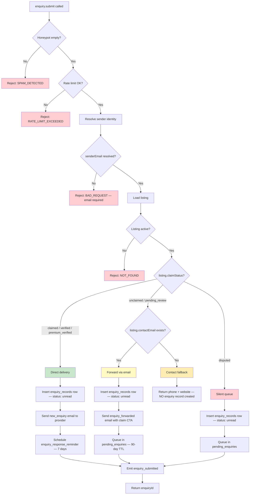

<!-- Part of slice-06-buyer-experience v2 -->

# §3. Enquiry Submission

S6 owns buyer-side enquiry submission. S5 owns provider-side inbox (read, respond, stale marking). S3 owns pending enquiry delivery on claim approval. S6 inserts `enquiry_records` rows and triggers emails; it does not transition enquiry status after submission.

---

## 3.1 Enquiry Form

Fields match PP concept design §5.2. Schema maps to router plan §2.3 `enquirySubmitInput`.

```typescript
const enquirySubmitInput = z.object({
  listingId: z.string().uuid(),
  senderName: z.string().min(1).max(100),              // required
  senderEmail: z.string().email().optional(),           // required if anonymous, pre-filled if authenticated
  senderCompany: z.string().max(200).optional(),        // optional context
  projectType: z.enum([
    "feature", "tv_series", "tv_one_off", "short", "commercial",
    "corporate", "music_video", "digital_social", "live_event",
  ]).optional(),                                         // CreditFormat values [S1 §1.1]
  message: z.string().min(20).max(2000),                 // min 20 chars prevents spam [PP §5.2]
  budget: z.enum(["low", "medium", "high", "undisclosed"]).optional(),
  timeline: z.string().max(200).optional(),              // free text: "March 2026", "ASAP"
  honeypot: z.string().max(0).optional(),                // spam prevention — must be empty
})
```

| Field | Required | Source |
|-------|----------|--------|
| `senderName` | Yes | Identity — pre-filled from session if authenticated |
| `senderEmail` | Yes (anonymous) / pre-filled (authenticated) | Response channel |
| `senderCompany` | No | Context for provider prioritisation |
| `projectType` | No | Dropdown from `CreditFormat` enum |
| `message` | Yes (min 20 chars) | Prevents spam, ensures meaningful contact |
| `budget` | No | Dropdown: low / medium / high / undisclosed |
| `timeline` | No | Free text |
| `honeypot` | Hidden | Must be empty — spam trap |

---

## 3.2 Authentication

The enquiry form is accessible without login. [Source: PP concept design §5.2]

**Authenticated users:** `senderName` and `senderEmail` pre-filled from `ctx.session`. The `senderEmail` input field is optional in the schema because authenticated users do not need to supply it — the handler resolves email from the session.

**Anonymous users:** Must provide `senderEmail` in the form. `senderAccountId` is set to `null` on the `enquiry_records` row. Data stored against `senderEmail` only. Lawful basis: legitimate interest (facilitating a business enquiry the sender initiated). [Source: PP concept design §5.2, PP-7]

**Privacy policy link:** Displayed on the form below the submit button. Required for anonymous enquiry data collection.

---

## 3.3 Spam Prevention

Three mechanisms at V1. No CAPTCHA — implement if spam rate exceeds 5%. [Source: PP concept design §5.2]

| Mechanism | Implementation |
|-----------|---------------|
| **Honeypot field** | Hidden `honeypot` input. If non-empty, reject immediately (`SPAM_DETECTED`). |
| **Rate limiting** | 10 enquiries per email address per hour. Uses sender email (session email or form input). |
| **Message minimum** | 20-character minimum on `message` field. Enforced in Zod schema (`z.string().min(20)`). |

---

## 3.4 Routing Decision Tree

The core routing logic. Four branches based on listing claim status. [Source: PP concept design §5.3]



**Pseudocode — must match flowchart above and router plan §2.3:**

```
enquiry.submit(input):
  // 0. Spam prevention [PP concept design §5.2]
  if input.honeypot: throw SPAM_DETECTED
  rateLimitCheck(senderEmail, 10, "1h")

  // 1. Resolve sender identity
  senderEmail = ctx.session?.email ?? input.senderEmail
  senderAccountId = ctx.session?.userId ?? null
  if !senderEmail: throw BAD_REQUEST("Email required for anonymous enquiries")

  // 2. Load listing + validate
  listing = getListing(input.listingId)
  if !listing || listing.lifecycleStatus !== "active": throw NOT_FOUND

  // 3. Route by claim status [PP concept design §5.3]
  match listing.claimStatus:

    "claimed" | "verified" | "premium_verified":
      // Branch A: Direct delivery
      enquiryId = insertEnquiryRecord({
        senderAccountId,
        senderEmail,
        senderName: input.senderName,
        senderCompany: input.senderCompany,
        listingId: input.listingId,
        projectType: input.projectType,
        message: input.message,
        budget: input.budget,
        timeline: input.timeline,
        status: "unread",
      })
      sendEmail("new_enquiry", {
        to: listing.accountEmail,
        enquiryId,
        listingName: listing.name,
      })
      // Schedule S5's deferred action — S6 calls, S5 handles [S5 §5.3]
      scheduleDeferredAction("enquiry_response_reminder", {
        enquiryId,
        listingId: input.listingId,
      }, 7 * 24 * 60 * 60 * 1000)  // 7 days in ms

    "unclaimed" | "pending_review":
      if listing.contactEmail:
        // Branch B: Forward via email + queue
        enquiryId = insertEnquiryRecord({
          senderAccountId,
          senderEmail,
          senderName: input.senderName,
          senderCompany: input.senderCompany,
          listingId: input.listingId,
          projectType: input.projectType,
          message: input.message,
          budget: input.budget,
          timeline: input.timeline,
          status: "unread",
        })
        sendEmail("enquiry_forwarded", {
          to: listing.contactEmail,
          enquiryId,
          claimCTA: generateClaimCTA(listing.id),
        })
        queuePendingEnquiry(listing.id, enquiryId)  // D&L pending_enquiries — 90-day TTL
      else:
        // Branch C: No email — return contact fallback, do NOT create enquiry record
        return {
          code: "NO_EMAIL",
          contactMethods: { phone: listing.phone, website: listing.website },
        }

    "disputed":
      // Branch D: Silent queue — buyer sees normal confirmation
      enquiryId = insertEnquiryRecord({
        senderAccountId,
        senderEmail,
        senderName: input.senderName,
        senderCompany: input.senderCompany,
        listingId: input.listingId,
        projectType: input.projectType,
        message: input.message,
        budget: input.budget,
        timeline: input.timeline,
        status: "unread",
      })
      queuePendingEnquiry(listing.id, enquiryId)

  // 4. Emit enquiry_submitted [PP §1.3 — P1 compliant, no PII per PP-ST-12]
  emit({
    type: "enquiry_submitted",
    enquiryId: enquiryId,
    listingId: input.listingId,
    timestamp: new Date().toISOString(),
  })

  return { enquiryId }
```

**Branch summary:**

| Branch | Claim Status | Has Email? | Actions | Enquiry Record? | Pending Queue? |
|--------|-------------|------------|---------|-----------------|----------------|
| A — Direct delivery | claimed / verified / premium_verified | N/A (provider has account) | Insert record → email provider → schedule reminder | Yes | No |
| B — Forward | unclaimed / pending_review | Yes | Insert record → email contact → queue | Yes | Yes (90-day TTL) |
| C — Contact fallback | unclaimed / pending_review | No | Return phone/website | No | No |
| D — Silent queue | disputed | N/A | Insert record → queue (no email) | Yes | Yes |

**Branch C note:** The `NO_EMAIL` response returns available contact methods to the UI. The listing profile page renders "Contact them directly" with phone/website, plus feedback buttons ("I reached them" / "I couldn't reach them") covered in §7. No `enquiry_submitted` event is emitted for Branch C because no enquiry record exists.

**Branch D note:** The buyer sees a standard "Enquiry sent" confirmation. No indication that the listing is disputed. The enquiry is queued but not forwarded — delivery occurs only when the dispute resolves in favour of a claimant (S3's `onClaimApproved` pipeline).

---

## 3.5 `enquiry_submitted` Event Emission

P1-compliant. No PII. [Source: PP §1.3, PP-ST-12]

```typescript
// Authoritative in shared-infrastructure.md §1.2 — summary only
type EnquirySubmittedEvent = {
  type: "enquiry_submitted"
  enquiryId: UUID              // reference to PP's enquiry record
  listingId: UUID
  timestamp: ISO8601
}
```

**Critical data minimisation requirement:** `senderEmail` and `senderAccountId` are excluded from the event payload. PP-ST-12 established this: no cross-domain consumer needs PII. D&L's `pending_enquiries` table stores the `enquiryId` as a reference — full enquiry content is delivered by PP's `deliverPendingEnquiries` callback on claim approval (S3 §3.2).

**Emission scope:** Branches A, B, and D emit `enquiry_submitted`. Branch C (contact fallback) does not — no enquiry record exists, so no `enquiryId` to emit.

**Consumers** (registered in PP §1.3, D&L §2, CR §2):

| Consumer | Domain | Action | Sync/Async |
|----------|--------|--------|------------|
| Engagement metric update | D&L | Increment `listing.engagement.enquiriesReceived` | Async |
| Unclaimed enquiry queue | D&L | If listing unclaimed: queue `enquiryId` reference for delivery on claim | Async |
| first_enquiry conversion trigger | CR | Evaluate `first_enquiry` conversion trigger [CR-X-10] | Async |

**Notification path [S6-ST-10]:** The `enquiry_received` in-app notification is created by S5's async consumer of `enquiry_submitted` (PP §2). S6 emits the event; S5's handler creates the notification. No inline notification creation in `enquiry.submit`.

---

## 3.6 Anonymous Enquiry Handling

Anonymous enquiries (no authenticated session) are stored with `senderEmail` only. `senderAccountId` is `null`.

**Data storage:** The `enquiry_records` row has `senderAccountId = null` and `senderEmail` populated. The partial index on `enquiry_records(sender_email) WHERE sender_email IS NOT NULL AND sender_account_id IS NULL` (S1 §2.2) supports efficient lookup for retroactive linking.

**Retroactive linking on account creation:** When a user creates an account with an email matching existing anonymous enquiries, S2 §2.3 (`linkAnonymousEnquiries`) updates `sender_account_id` on all matching rows. After linking, these enquiries appear in the buyer's "Enquiries Sent" dashboard view (`enquiry.listSent` filters by `senderAccountId`).

**Privacy policy:** Link displayed on the enquiry form. Covers lawful basis (legitimate interest), retention (12 months or until resolved), and right to erasure. [Source: PP concept design §5.2, PP-7]

---

## 3.7 Email Templates Triggered

S6 triggers two existing email templates. Both registered in SI §5.2 (Platform Transactional). S6 does not define new templates — current count remains 25.

| Template ID | Trigger Condition | Recipient | Category |
|-------------|-------------------|-----------|----------|
| `new_enquiry` | Branch A — direct delivery to claimed listing | Provider (listing account email) | Platform Transactional |
| `enquiry_forwarded` | Branch B — forward to unclaimed listing with contact email | Listing's `contactEmail` (not an account) | Platform Transactional |

**`new_enquiry` context data:** `enquiryId`, `listingName`, sender name, message preview (truncated). Delivered to the provider's authenticated account email.

**`enquiry_forwarded` context data:** `enquiryId`, `listingName`, sender name, message preview, `claimCTA` (link to claim this listing). Delivered to the listing's seeded `contactEmail`. Includes claim call-to-action — this is the primary conversion mechanism for unclaimed listing owners.

---

## 3.8 Deferred Action Scheduling

On Branch A (direct delivery to claimed listing), S6 schedules S5's `enquiry_response_reminder` deferred action. S6 does not register a new deferred action — it calls `scheduleDeferredAction` with an existing action type.

```
scheduleDeferredAction("enquiry_response_reminder", {
  enquiryId: enquiryId,
  listingId: input.listingId,
}, 7 * 24 * 60 * 60 * 1000)  // 7 days
```

**Action handler:** Registered by S5 §5.3. At 7 days, checks `enquiry_records.status`. If still `"unread"`, marks as `"stale"` and sends `enquiry_reminder` email to provider. If already `"responded"`, no-op. [Source: slice-05-provider-experience.md — §5.3, AC-20, AC-21]

**Params type** (authoritative in SI §2.1):
```typescript
enquiry_response_reminder: { enquiryId: UUID; listingId: UUID }
```

**Branches B and D do not schedule this action.** Unclaimed/disputed listings have no provider account to remind. When these enquiries are delivered on claim approval, S3's `deliverPendingEnquiries` (S3 §3.2) is responsible for scheduling reminders for the newly delivered batch.

**D1 resolution applied:** The concept design's 14-day stale marking (PP §5.2) is superseded by S5's 7-day implementation. S6 adds no new deferred actions. Current total: 11 deferred actions (SI §2.2, unchanged). [Source: 01-decisions.md — D1]

---

## 3.9 Pending Enquiry Queue

Branches B (unclaimed + email) and D (disputed) queue enquiries in D&L's `pending_enquiries` table (S1 §1.12).

```
queuePendingEnquiry(listingId, enquiryId):
  await db.insert(pendingEnquiries).values({
    listingId: listingId,
    enquiryId: enquiryId,                              // PP's enquiry_records.id [S1-ST-3]
    forwardedAt: hasContactEmail ? new Date() : null,  // Branch B: forwarded; Branch D: null
    expiresAt: addDays(new Date(), 90),                // 90-day TTL
  })
```

**`forwardedAt` semantics [S6-ST-12]:** `forwardedAt` is non-null for Branch B (email forwarded to listing's `contactEmail`) and null for Branch D (disputed — no forward sent). S3's `deliverPendingEnquiries` can use this to distinguish forwarded-and-queued from silently-queued enquiries.

**TTL enforcement:** The `expire_enquiry_queue` deferred action (registered by D&L, SI §2.2) handles 90-day expiry. S6 does not implement expiry logic.

**Delivery on claim approval:** Handled by S3 §3.2 (`onClaimApproved` step 4 → `deliverPendingEnquiries`). S3 reads `pending_enquiries` for the listing, fetches matching `enquiry_records`, sends notifications, and emails the batch to the new claimant. S6 does not implement delivery — it only queues.

**`enquiryId` semantics [S1-ST-3]:** The `enquiryId` stored in `pending_enquiries` is PP's `enquiry_records.id`, not a D&L-internal ID. S3's `deliverPendingEnquiries` uses this to look up the full enquiry content from `enquiry_records`.

---

## 3.10 Buyer Confirmation UX

| Branch | Buyer Sees | Rationale |
|--------|-----------|-----------|
| A — Direct delivery | "Your enquiry has been sent to {listingName}." | Provider will see it in their inbox immediately. |
| B — Forward | "Your enquiry has been forwarded to this provider. They haven't claimed their CALLSHEET listing yet, so we've sent your message directly." | Transparent about claim status; manages expectations. [Source: PP §5.3] |
| C — Contact fallback | Contact methods (phone, website) + "I reached them" / "I couldn't reach them" feedback buttons (§7) | No enquiry record created. Buyer contacts directly. |
| D — Silent queue | "Your enquiry has been sent to {listingName}." | Identical to Branch A. No exposure of dispute status. [Source: PP §5.3] |

---

## 3.11 Acceptance Criteria (§3)

| # | Criterion | Test |
|---|-----------|------|
| AC-3.1 | Enquiry form submits successfully for claimed listing — creates `enquiry_records` row with `status = "unread"` | Integration |
| AC-3.2 | `new_enquiry` email sent to provider on Branch A (claimed/verified/premium_verified) | Integration |
| AC-3.3 | `enquiry_response_reminder` scheduled at 7 days on Branch A | Integration |
| AC-3.4 | Unclaimed listing with `contactEmail` → `enquiry_forwarded` email sent with claim CTA (Branch B) | Integration |
| AC-3.5 | Unclaimed listing with `contactEmail` → enquiry queued in `pending_enquiries` with 90-day TTL (Branch B) | Integration |
| AC-3.6 | Unclaimed listing without `contactEmail` → returns `NO_EMAIL` with contact methods, no `enquiry_records` row created (Branch C) | Integration |
| AC-3.7 | Disputed listing → enquiry queued silently, buyer sees normal confirmation (Branch D) | Integration |
| AC-3.8 | `enquiry_submitted` event emitted for Branches A, B, D — NOT Branch C | Integration |
| AC-3.9 | `enquiry_submitted` payload contains only `enquiryId`, `listingId`, `timestamp` — no PII (no `senderEmail`, no `senderAccountId`) | Unit |
| AC-3.10 | Honeypot non-empty → rejected with `SPAM_DETECTED` | Unit |
| AC-3.11 | Rate limit: 11th enquiry from same email within 1 hour → rejected with `RATE_LIMIT_EXCEEDED` | Integration |
| AC-3.12 | Message under 20 characters → Zod validation rejects | Unit |
| AC-3.13 | Anonymous user (no session) must provide `senderEmail`; missing email → `BAD_REQUEST` | Unit |
| AC-3.14 | Authenticated user — `senderEmail` resolved from session, form `senderEmail` input ignored | Unit |
| AC-3.15 | Anonymous enquiry stored with `senderAccountId = null`, `senderEmail` populated | Integration |
| AC-3.16 | Inactive listing (`lifecycleStatus !== "active"`) → `NOT_FOUND` | Unit |
| AC-3.17 | Branch D confirmation message identical to Branch A — no dispute status exposure | E2E |
