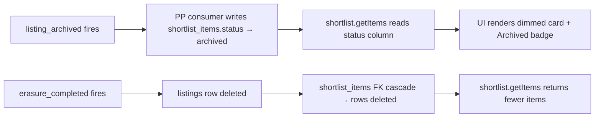
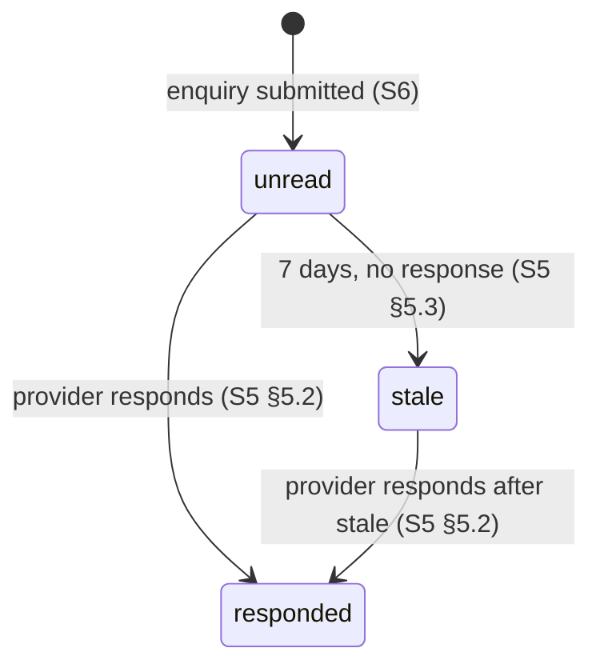

<!-- Part of slice-06-buyer-experience v2 -->

# S6 §4 Shortlist Management + §6 Buyer Dashboard

---

## 4. Shortlist Management

### 4.1 Data Model

S6 uses the existing `shortlists` and `shortlist_items` tables from S1 §2.2 without amendment. No `displayStatus` column (Decision D2). The listing's current lifecycle state is derived at read time by joining `shortlist_items` to `listings` — the join reads `listings.lifecycleStatus` directly. This avoids sync risk from a denormalised column and keeps `listings` as the single source of truth for listing state.

The `shortlist_items.status` column tracks both the item's own lifecycle (`active` -> `removed` by buyer) and the listing's lifecycle state (`active` -> `archived`/`suspended` by PP event consumers [XP-15]). S6 reads `shortlist_items.status` to render the correct display state — PP consumers registered in PP §2 update this column asynchronously on `listing_archived`, `listing_suspended`, and `listing_reactivated` events.

**Tables used (authoritative in S1 §2.2):**

| Table | S6 Role | S6 Writes |
|-------|---------|-----------|
| `shortlists` | Parent container for named lists | Create, rename, delete |
| `shortlist_items` | Item membership + buyer removal state | Insert (add item), update `status` to `"removed"` (remove item) |
| `listings` | Display data + lifecycle state via join | None — read only |

### 4.2 CRUD Operations

Seven routes on the `shortlist` router. All require authentication (`protectedProcedure`). [Source: router plan §2.2]

**Limits:** Maximum 10 shortlists per account. Maximum 50 active items per shortlist. [Source: platform-and-product.md — §7.2]

```
shortlist.create({ name }):
  // Ownership: implicit — uses session.userId as accountId
  count = SELECT COUNT(*) FROM shortlists WHERE account_id = session.userId
  if count >= 10: throw BAD_REQUEST("Maximum 10 shortlists per account")

  INSERT INTO shortlists (account_id, name) VALUES (session.userId, name)
  return shortlist

shortlist.rename({ shortlistId, name }):
  shortlist = SELECT * FROM shortlists WHERE id = shortlistId
  if !shortlist || shortlist.accountId !== session.userId: throw NOT_FOUND

  UPDATE shortlists SET name = name WHERE id = shortlistId

shortlist.delete({ shortlistId }):
  shortlist = SELECT * FROM shortlists WHERE id = shortlistId
  if !shortlist || shortlist.accountId !== session.userId: throw NOT_FOUND

  DELETE FROM shortlists WHERE id = shortlistId
  // shortlist_items cascade-deleted via FK (onDelete: "cascade")

shortlist.list():
  // All shortlists for current account with active item counts
  SELECT s.id, s.name, s.created_at,
         COUNT(si.id) FILTER (WHERE si.status = 'active') AS item_count
  FROM shortlists s
  LEFT JOIN shortlist_items si ON si.shortlist_id = s.id
  WHERE s.account_id = session.userId
  GROUP BY s.id
  ORDER BY s.created_at DESC
```

### 4.3 Item Management

```
shortlist.addItem({ shortlistId, listingId }):
  // 1. Ownership check
  shortlist = SELECT * FROM shortlists WHERE id = shortlistId
  if !shortlist || shortlist.accountId !== session.userId: throw NOT_FOUND

  // 2. Capacity check
  activeCount = SELECT COUNT(*) FROM shortlist_items
    WHERE shortlist_id = shortlistId AND status = 'active'
  if activeCount >= 50: throw BAD_REQUEST("Maximum 50 items per shortlist")

  // 3. Insert — unique(shortlist_id, listing_id) constraint prevents duplicates
  INSERT INTO shortlist_items (shortlist_id, listing_id, status)
    VALUES (shortlistId, listingId, 'active')
  // ON CONFLICT: throw BAD_REQUEST("Listing already in shortlist")

  // 4. Emit shortlist_added [PP §1.5 — P1 compliant]
  emit({
    type: "shortlist_added",
    listingId: listingId,
    accountId: session.userId,
    timestamp: new Date().toISOString(),
  })

shortlist.removeItem({ shortlistId, listingId }):
  // Ownership check via shortlist
  shortlist = SELECT * FROM shortlists WHERE id = shortlistId
  if !shortlist || shortlist.accountId !== session.userId: throw NOT_FOUND

  // Soft delete — preserves the record for potential analytics
  UPDATE shortlist_items
    SET status = 'removed'
    WHERE shortlist_id = shortlistId AND listing_id = listingId AND status = 'active'
  // If no rows affected: throw NOT_FOUND
```

### 4.4 Display with Listing State

`shortlist.getItems` resolves listing display data and lifecycle state in a single JOIN query. No N+1: all listing data comes from the same query that fetches shortlist items.

```
shortlist.getItems({ shortlistId, cursor }):
  // Ownership check
  shortlist = SELECT * FROM shortlists WHERE id = shortlistId
  if !shortlist || shortlist.accountId !== session.userId: throw NOT_FOUND

  // Single JOIN query — listing state derived at read time (Decision D2)
  items = SELECT
    si.id          AS shortlist_item_id,
    si.listing_id,
    si.added_at,
    si.status,                                    -- shortlist_items.status (consumer-written) [S6-ST-1]
    l.slug,
    l.name,
    l.headline,
    l.entity_type,
    l.base_region,
    v.tier         AS verification_tier,
    mi.url         AS headshot_url
  FROM shortlist_items si
  INNER JOIN listings l ON l.id = si.listing_id
  LEFT JOIN verifications v ON v.listing_id = l.id
  LEFT JOIN media_items mi ON mi.listing_id = l.id AND mi.type = 'headshot'
  WHERE si.shortlist_id = shortlistId
    AND si.status != 'removed'
  ORDER BY si.added_at DESC
  LIMIT 20
  -- Cursor pagination: AND si.added_at < :cursor

  return {
    items: items.map(row => ({
      shortlistItemId: row.shortlist_item_id,
      listingId: row.listing_id,
      addedAt: row.added_at,
      status: row.status,                            // from shortlist_items.status [S6-ST-1]
      listing: {
        slug: row.slug,
        name: row.name,
        headline: row.headline,
        entityType: row.entity_type,
        verificationTier: row.verification_tier,
        baseRegion: row.base_region,
        headshotUrl: row.headshot_url,
      },
    })),
    nextCursor: items.length === 20 ? items[19].added_at : undefined,
  }
```

**Return type:**

```typescript
type ShortlistItemWithListing = {
  shortlistItemId: number
  listingId: UUID
  addedAt: ISO8601
  status: "active" | "archived" | "suspended" | "removed"  // from shortlist_items.status — consumer-written [S6-ST-1]
  listing: {
    slug: string
    name: string
    headline?: string
    entityType: EntityType
    verificationTier: VerificationTier
    baseRegion?: string
    headshotUrl?: string
  }
}
```

**UI rendering rules for shortlist item state [S6-ST-1]:**

| `shortlist_items.status` | Display Treatment |
|--------------------------|-------------------|
| `active` | Normal card rendering |
| `archived` | Dimmed card, "Archived" badge, enquiry CTA disabled |
| `suspended` | Dimmed card, "Unavailable" badge, enquiry CTA disabled |

### 4.5 Listing Lifecycle in Shortlists [S6-ST-1]

PP consumers (registered in PP §2, tagged [XP-15]) update `shortlist_items.status` on listing lifecycle events. S6 reads the status column directly. The join to `listings` is retained for display data (name, slug, headline) but lifecycle state comes from `shortlist_items.status`, not `listings.lifecycleStatus`.

**`listing_archived` / `listing_suspended`:** PP consumers write `shortlist_items.status` from `active` to `archived` or `suspended`. S6's `shortlist.getItems` query (§4.4, `WHERE si.status != 'removed'`) returns these items — the UI renders them dimmed with lifecycle badges. When `listing_reactivated` fires, the PP consumer restores `shortlist_items.status` to `active`.

**`erasure_completed`:** `shortlist_items` rows cascade-delete via the FK constraint `listings.id -> onDelete: "cascade"` (S1 §2.2). The buyer's next `shortlist.getItems` call returns fewer results — no stale references remain.



### 4.6 `shortlist_added` Emission

Emitted by `shortlist.addItem` (§4.3). Payload matches `ShortlistAddedEvent` in PP §1.5.

| Field | Value | Source |
|-------|-------|--------|
| `type` | `"shortlist_added"` | PP §1.5 |
| `listingId` | UUID of the shortlisted listing | Route input |
| `accountId` | UUID of the buyer account | Session |
| `timestamp` | ISO8601 | Server clock |

No cross-domain consumers at V1 (PP §1.5 confirms "domain-internal signal only"). S9 may add a perception consumer to track shortlist-to-enquiry conversion gaps. [Source: platform-and-product.md — §7.2]

---

## 6. Buyer Dashboard

### 6.1 Dashboard Structure

Buyer sections live within the unified `/dashboard` layout established by S5. S5's `layout.tsx` provides the auth guard (`protectedProcedure` — any authenticated user). Buyer sections are accessible to ALL authenticated users, not just providers — every account has buyer capabilities.

```
/dashboard/
├── layout.tsx                    ← S5 auth guard (shared)
│
├── [S5 Provider Sections]
│   ├── listings/                 ← Provider listing management
│   ├── enquiries/                ← Provider enquiry inbox
│   └── analytics/                ← Provider analytics (tier-gated)
│
├── [S6 Buyer Sections]
│   ├── enquiries-sent/           ← Sent enquiries + response status
│   ├── shortlists/               ← Shortlist management
│   └── searches/                 ← Saved searches + recent history
│
└── [S5 Shared Sections]
    ├── profile/                  ← Account profile
    └── settings/                 ← Account settings
```

The dashboard sidebar renders both provider and buyer section links. Provider sections appear only if the account has at least one listing (checked via session context). Buyer sections appear for all authenticated accounts.

### 6.2 "Enquiries Sent" Section

`/dashboard/enquiries-sent` displays the buyer's sent enquiries with response status. Data comes from `enquiry.listSent` (router plan §2.3). Response status is read directly from `enquiry_records.status`, which S5 already maintains (Decision D3 — no new consumer needed).

**Query — single JOIN, cursor-paginated:**

```
enquiry.listSent({ cursor, limit = 20 }):
  rows = SELECT
    er.id            AS enquiry_id,
    er.status,                                    -- "unread" | "responded" | "stale"
    er.sent_at,
    er.responded_at,
    LEFT(er.body, 200)  AS message_preview,       -- truncated for list view
    l.slug           AS listing_slug,
    l.name           AS listing_name
  FROM enquiry_records er
  INNER JOIN listings l ON l.id = er.listing_id
  WHERE er.sender_account_id = session.userId
  ORDER BY er.sent_at DESC
  LIMIT limit
  -- Cursor: AND er.sent_at < :cursor

  return {
    enquiries: rows.map(row => ({
      enquiryId: row.enquiry_id,
      listingSlug: row.listing_slug,
      listingName: row.listing_name,
      messagePreview: row.message_preview,
      status: row.status,
      submittedAt: row.sent_at,
      respondedAt: row.responded_at,
    })),
    nextCursor: rows.length === limit ? rows[rows.length - 1].sent_at : undefined,
  }
```

**Status display mapping:**

| `enquiry_records.status` | Visual Indicator | Label |
|--------------------------|-----------------|-------|
| `unread` | Grey dot | "Awaiting response" |
| `responded` | Green dot | "Responded" + `respondedAt` timestamp |
| `stale` | Amber dot | "No response after 7 days" |

The 7-day stale threshold is authoritative per S5 §5.3 (supersedes concept design's 14-day figure — see Decision D1). The `enquiry_response_reminder` deferred action in S5 sets `status = "stale"` at 7 days if the provider has not responded.

**Enquiry status lifecycle (S5 authoritative, S6 reads only):**



### 6.3 "Your Shortlists" Section

`/dashboard/shortlists` displays summary cards for each shortlist. Data comes from `shortlist.list` (§4.2).

Each summary card shows:

| Field | Source |
|-------|--------|
| Shortlist name | `shortlists.name` |
| Active item count | `COUNT(shortlist_items) WHERE status = 'active'` |
| Most recent addition | `MAX(shortlist_items.added_at) WHERE status = 'active'` |

Click-through navigates to the full shortlist view (`shortlist.getItems`, §4.4) showing all items with listing display data and lifecycle state indicators.

**`shortlist.list` query (amended from §4.2 to include most recent addition):**

```
shortlist.list():
  SELECT
    s.id,
    s.name,
    s.created_at,
    COUNT(si.id) FILTER (WHERE si.status = 'active')      AS item_count,
    MAX(si.added_at) FILTER (WHERE si.status = 'active')   AS last_added_at
  FROM shortlists s
  LEFT JOIN shortlist_items si ON si.shortlist_id = s.id
  WHERE s.account_id = session.userId
  GROUP BY s.id
  ORDER BY s.created_at DESC
```

### 6.4 "Recent Searches" Section

`/dashboard/searches` includes the last 5 entries from `search_history` (new table, schema §1.1). Data comes from `searchHistory.list` (router plan §2.4).

Each entry displays:

| Field | Source | Display |
|-------|--------|---------|
| Query text | `search_history.query` | Shown if present; "Filter-only search" if null |
| Filter summary | `search_history.filters` | Formatted as comma-separated: "Drama, London, Camera Department" |
| Result count | `search_history.result_count` | "24 results" |
| Timestamp | `search_history.created_at` | Relative: "2 hours ago", "Yesterday" |

**"Re-run" button:** Navigates to `/search?q={query}&sectors={...}&serviceAreas={...}&location={...}`, reconstructing the URL from stored `query` and `filters` fields. No new tRPC call — client-side navigation to the search page with pre-populated parameters.

### 6.5 "Saved Searches" Section

Same `/dashboard/searches` page, below recent history. Data comes from `search.getSavedSearches` (router plan §2.1). Reads from `saved_searches` table (S1 §2.2, no amendment).

Each entry displays:

| Field | Source |
|-------|--------|
| Name | `saved_searches.name` |
| Filter summary | `saved_searches.filters`, formatted as §6.4 |
| "Run" button | Navigates to `/search?q={query}&sectors={...}` |
| Delete button | Calls `search.deleteSavedSearch({ savedSearchId })` |

### 6.6 Dashboard Data Loading

A single page load fetches all buyer dashboard sections in parallel. No waterfall — all queries fire simultaneously via `Promise.all`.

```typescript
// /dashboard page component (or layout-level data fetch)
async function loadBuyerDashboard(session: Session) {
  const [
    enquiriesSent,
    shortlists,
    recentSearches,
    savedSearches,
  ] = await Promise.all([
    trpc.enquiry.listSent({ limit: 5 }),           // 5 most recent for dashboard summary
    trpc.shortlist.list(),                          // all shortlists with counts
    trpc.searchHistory.list({ limit: 5 }),          // last 5 searches
    trpc.search.getSavedSearches({ limit: 10 }),    // all saved searches
  ])

  return { enquiriesSent, shortlists, recentSearches, savedSearches }
}
```

Four parallel queries, each hitting an indexed column (`sender_account_id`, `account_id`, `account_id`, `account_id`). At V1 scale (~200 accounts), each query returns at most 5–10 rows. Total dashboard load target: <200ms server-side. [Source: SI §10 — <500ms TTFB p95 for authenticated pages]

### 6.7 Cross-Role Display

If the user is both provider and buyer (has at least one listing), the dashboard displays both sets of sections. No conflict — provider sections scope data by `listingId` (the user's listings), buyer sections scope by `accountId` (the user's sent enquiries, shortlists, search history). Different data, different routes, same layout.

```
Dashboard Layout
├── Provider Sections (S5) — shown if account.listings.length > 0
│   ├── Your Listings        ← listing.listOwned (S5)
│   ├── Enquiry Inbox        ← enquiry.listReceived (S5)
│   └── Analytics            ← listing.getAnalytics (S5, tier-gated)
│
├── Buyer Sections (S6) — shown for ALL authenticated accounts
│   ├── Enquiries Sent       ← enquiry.listSent (S6)
│   ├── Your Shortlists      ← shortlist.list (S6)
│   └── Searches             ← searchHistory.list + search.getSavedSearches (S6)
│
└── Account Sections (S5) — shown for ALL authenticated accounts
    ├── Profile               ← account.getProfile (S5)
    └── Settings              ← account.getSettings (S5)
```

The sidebar navigation groups sections by role. Provider sections use a "Provider" heading. Buyer sections use a "Discovery" or similar heading. Account sections appear at the bottom. The heading and section visibility are determined client-side from the session context — no separate API call to check provider status.
