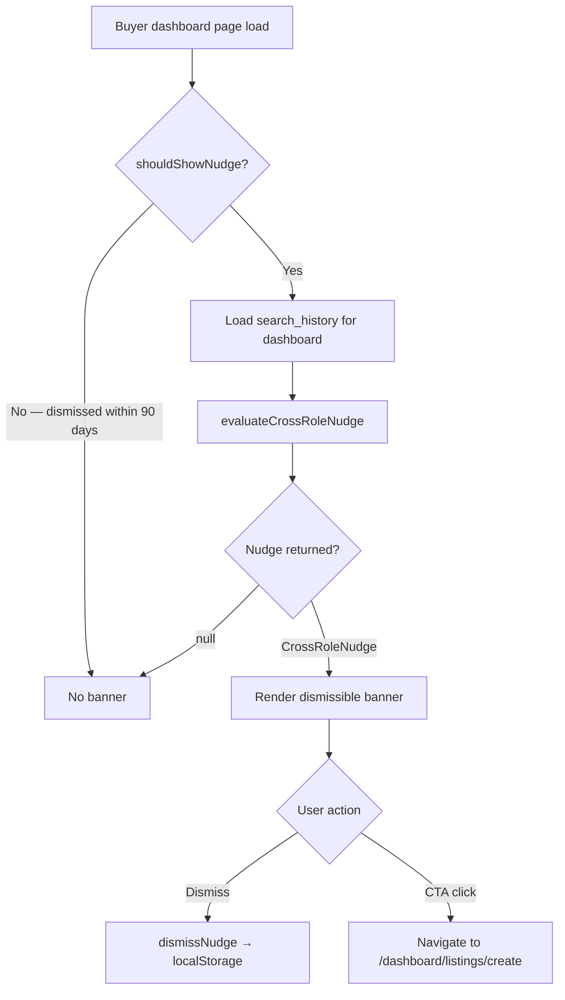

<!-- Part of slice-06-buyer-experience v2 -->

# S6 §8–§9: Cross-Role Nudge & Feature Gating

---

## 8. Cross-Role Nudge

### 8.1 Purpose

`evaluateCrossRoleNudge` encourages buyer-only accounts to become providers when search behaviour signals they offer services in searched categories. The unified account model means every user is both buyer and provider — the nudge bridges the gap for accounts that have not yet activated the provider facet. [Source: platform-and-product.md — §7.3]

### 8.2 Function Specification

`evaluateCrossRoleNudge` is a **pure function** — no tRPC route, no DB writes, no event emissions. Called on buyer dashboard page load (`/dashboard/searches/page.tsx`). The function receives search history entries already loaded for the dashboard display and returns a nudge object or null.

```typescript
// src/domains/platform/buyer/cross-role-nudge.ts

type CrossRoleNudge = {
  type: "category_concentration" | "engagement_threshold"
  message: string
  action: { label: string; target: string }
}

function evaluateCrossRoleNudge(
  searchHistory: SearchHistoryEntry[],
  accountListingCount: number,
  accountCreatedAt: ISO8601,
): CrossRoleNudge | null {

  // Guard: only for accounts with zero listings (including archived)
  if (accountListingCount > 0) return null

  // Frequency cap: check localStorage for recent dismissal
  // Caller checks localStorage before invoking — if dismissed within 14 days, skip call.
  // 90-day dismissal persistence also enforced by caller via localStorage timestamp.

  // --- Trigger 1: Category concentration ---
  // 5+ searches in the same service area within 30 days
  const thirtyDaysAgo = new Date(Date.now() - 30 * 24 * 60 * 60 * 1000)
  const recentSearches = searchHistory.filter(s =>
    new Date(s.createdAt) > thirtyDaysAgo
  )

  // Group by first service area in filters (primary intent signal)
  const serviceAreaCounts = new Map<string, number>()
  for (const entry of recentSearches) {
    const area = entry.filters?.serviceAreas?.[0]
    if (area) {
      serviceAreaCounts.set(area, (serviceAreaCounts.get(area) ?? 0) + 1)
    }
  }

  // Find highest-frequency service area
  let topArea: { slug: string; count: number } | null = null
  for (const [slug, count] of serviceAreaCounts) {
    if (!topArea || count > topArea.count) {
      topArea = { slug, count }
    }
  }

  if (topArea && topArea.count >= 5) {
    return {
      type: "category_concentration",
      message: `You've searched for ${topArea.slug} ${topArea.count} times recently. Do you offer this service?`,
      action: { label: "Create your listing", target: "/dashboard/listings/create" },
    }
  }

  // --- Trigger 2: Engagement threshold ---
  // 20+ total searches, no listings, account older than 14 days
  const fourteenDaysAgo = new Date(Date.now() - 14 * 24 * 60 * 60 * 1000)
  const accountOldEnough = new Date(accountCreatedAt) < fourteenDaysAgo

  if (searchHistory.length >= 20 && accountOldEnough) {
    return {
      type: "engagement_threshold",
      message: "You've been actively searching CALLSHEET. Are you also a provider?",
      action: { label: "Create your listing", target: "/dashboard/listings/create" },
    }
  }

  return null
}
```

### 8.3 Trigger Definitions

| # | Trigger | Condition | Signal |
|---|---------|-----------|--------|
| 1 | Category concentration | 5+ searches with the same `filters.serviceAreas[0]` within 30 days | Buyer repeatedly searches a specific service area — likely works in that domain |
| 2 | Engagement threshold | 20+ total `search_history` entries AND 0 listings AND account created >14 days ago | Heavy platform usage without provider activation — industry professional browsing competitors |

Trigger evaluation is ordered: category concentration takes priority (more specific signal). If trigger 1 fires, trigger 2 is not evaluated.

### 8.4 Frequency Cap & Dismissal

Nudge display is rate-limited to reduce irritation:

- **Maximum frequency:** 1 nudge per 14 days.
- **Dismissal persistence:** 90 days. Dismiss timestamp stored in `localStorage` under key `callsheet:crossRoleNudgeDismissedAt`.
- **Storage choice:** localStorage, not database. Rationale: nudge dismissal is a UI preference, not business-critical state. localStorage avoids a DB write on a cosmetic interaction, respects privacy (no server-side tracking of nudge fatigue), and is cleared on browser data reset (acceptable — nudge reappears, low-cost re-dismiss).

```typescript
// src/domains/platform/buyer/cross-role-nudge-client.ts

const NUDGE_STORAGE_KEY = "callsheet:crossRoleNudgeDismissedAt"
const NUDGE_COOLDOWN_DAYS = 14
const NUDGE_DISMISS_PERSIST_DAYS = 90

function shouldShowNudge(): boolean {
  const dismissed = localStorage.getItem(NUDGE_STORAGE_KEY)
  if (!dismissed) return true
  const dismissedAt = new Date(dismissed)
  const daysSince = (Date.now() - dismissedAt.getTime()) / (1000 * 60 * 60 * 24)
  return daysSince >= NUDGE_DISMISS_PERSIST_DAYS
}

function dismissNudge(): void {
  localStorage.setItem(NUDGE_STORAGE_KEY, new Date().toISOString())
}
```

The caller (buyer dashboard page component) checks `shouldShowNudge()` before calling `evaluateCrossRoleNudge()`. If the function returns a nudge, the dashboard renders the banner. On dismiss, `dismissNudge()` writes the timestamp.

### 8.5 UI Component

Dismissible banner rendered at the top of the buyer dashboard (above "Recent Searches" section). Not intrusive — collapses on dismiss with no animation delay.

```
┌──────────────────────────────────────────────────────────────────┐
│  💡 {nudge.message}                                        [✕]  │
│     [ Create your listing → ]                                   │
└──────────────────────────────────────────────────────────────────┘
```

- CTA button links to `/dashboard/listings/create` (S5 listing creation flow).
- Dismiss button (`[✕]`) calls `dismissNudge()` and removes the banner from the DOM.
- Banner does not render for accounts with any listing (guard in `evaluateCrossRoleNudge`), including archived listings — if a user previously created and archived a listing, they already know the provider flow.
- The `message` field uses the service area slug for trigger 1. At implementation time, resolve the slug to the human-readable label via the taxonomy tables (join `taxonomyServiceAreas` on slug). The function signature uses slug for simplicity; the UI component performs the label lookup.

### 8.6 Data Flow



No events emitted. No DB writes. No server-side state change. The nudge is entirely a client-side presentation concern driven by server-loaded search history data.

---

## 9. Feature Gating & Tier-Restricted Display

### 9.1 Context

S4 implements `computeFeatureAccess(tier: SubscriptionTier): FeatureAccess` (CR export, P4 compliance) and feature gate middleware (`enforceFeatureGate`, `checkFeatureAccess`). S5 §11 defines `mapFeatureAccessToUI(access: FeatureAccess): UIFeatureMap` for provider dashboard rendering. S6 applies feature gating to **buyer-visible surfaces** — the listing profile page and search results. [Source: slice-04-subscriptions.md — §4.1, slice-05-provider-experience.md — §11]

### 9.2 Contact Visibility on Profile Pages

Contact details on claimed listings are **not tier-gated**. `directContactVisible: true` is always returned by `computeFeatureAccess` regardless of tier. [Source: commercial-and-revenue.md — §4.1, §4.3; PP-5 resolution]

This is the governing constraint: claiming a listing must never reduce reachability compared to the unclaimed state. Unclaimed listings show seed data (phone, website) publicly. Claimed listings — at every tier including free — show the provider's contact details (phone, email, website, social links) on the profile page. The enquiry form is an *additional* structured contact channel, not a replacement for direct contact visibility.

```typescript
// Contact visibility rules — profile page rendering
// Source: PP-5, CR §4.1 (directContactVisible: true), CR §4.3 (all tiers: ✓)

type ProfileContactDisplay = {
  showPhone: boolean
  showEmail: boolean
  showWebsite: boolean
  showSocialLinks: boolean
  showEnquiryForm: boolean
}

function resolveContactDisplay(listing: ListingProfileData): ProfileContactDisplay {
  // Unclaimed listings: show seed data directly (public data, not gated)
  if (listing.claimStatus === "unclaimed" || listing.claimStatus === "pending_review") {
    return {
      showPhone: !!listing.phone,
      showEmail: false,                    // unclaimed listings: no verified email to show
      showWebsite: !!listing.website,
      showSocialLinks: false,              // seed data does not include social profiles
      showEnquiryForm: false,              // unclaimed without email → contact fallback, not enquiry form
                                           // unclaimed with email → enquiry form (forwarded)
    }
  }

  // Disputed listings: enquiry form only (queued silently — see §3)
  if (listing.claimStatus === "disputed") {
    return {
      showPhone: false,
      showEmail: false,
      showWebsite: false,
      showSocialLinks: false,
      showEnquiryForm: true,
    }
  }

  // Claimed / verified / premium_verified: full contact details + enquiry form [PP-5]
  // Contact details are NOT tier-gated. All claimed tiers show everything the provider has set.
  return {
    showPhone: !!listing.phone,
    showEmail: !!listing.contactEmail,
    showWebsite: !!listing.website,
    showSocialLinks: listing.socialProfiles.length > 0,
    showEnquiryForm: true,                 // always available on claimed listings
  }
}
```

**Unclaimed listing contact override:** When a listing is unclaimed and has no email (`listing.contactEmail === null`), the profile page shows available seed data (phone, website) with the contact attempt feedback buttons ("I reached them" / "I couldn't reach them") instead of an enquiry form. See §7 for the feedback flow. When unclaimed but has email, the enquiry form is shown (enquiry is forwarded to the seed email with a claim CTA). [Source: router plan §2.3, §2.6]

### 9.3 Tier-Gated Profile Sections

While contact details are universally visible, other profile page sections are gated by the listing's subscription tier. These gates control what *buyers see* on the listing's public profile, based on the listing owner's tier.

| Profile Section | Free | Standard | Premium/Partner | Rationale |
|---|---|---|---|---|
| Contact details (phone, email, website, social) | Visible [PP-5] | Visible | Visible | Never gated — settled decision |
| Enquiry form | Available | Available | Available | `enquiriesEnabled: true` at all tiers |
| Portfolio/credits | Visible (up to tier media/credit limits) | Visible | Visible | Public profile content — buyers need this to evaluate providers |
| Taxonomy tags | Visible | Visible | Visible | Core directory data |
| Verification badge | Visible | Visible | Visible | Trust signal, not a paid feature |
| Quality score | Visible | Visible | Visible | Entity perception signal |
| Engagement stats ("X profile views", "Y enquiries received") | Hidden | Visible | Visible | Social proof signal — conversion lever for free→standard upgrade |

**Engagement stats gating** is the primary buyer-facing tier differentiation on the profile page. Free-tier listings do not display engagement counters (profile views, enquiries received) to buyers. Standard and above display them. This serves two purposes: (1) social proof for buyers evaluating established providers, and (2) conversion trigger — free-tier providers see their own engagement stats in the provider dashboard (S5) but know buyers cannot see them, motivating upgrade.

```typescript
function shouldShowEngagementStats(listing: ListingProfileData): boolean {
  if (listing.claimStatus === "unclaimed") return false    // no engagement data for unclaimed
  const access = computeFeatureAccess(listing.subscriptionTier)
  return access.buyerVisibleEngagementStats === true       // [S6-ST-2] CR-owned gate, not hardcoded tier check
}
```

**Implementation note [S6-ST-2]:** `buyerVisibleEngagementStats` was added to `TierLimits` (CR §4.1) to give CR ownership of this gate. `free: false`, `standard: true`, `premium: true`, `partner: true`. `basicAnalytics: true` in `FeatureAccess` controls the *provider's* access to their own analytics in S5 dashboard. `buyerVisibleEngagementStats` controls whether social proof is visible to *other users* on the public profile page. Both are CR-owned fields consumed via P4 import.

### 9.4 Search Result Display

Tier does **not** affect search result card content. All results display the same fields regardless of the listing's subscription tier:

```typescript
// ListingSummary — returned per search result (from router plan §2.1)
// Authoritative in 01-router-plan.md §2.1 — summary only
type ListingSummary = {
  slug: string
  name: string
  headline?: string
  entityType: EntityType
  baseRegion?: string
  verificationTier: VerificationTier
  isSponsored: boolean
  qualityScore: number
  taxonomyTags: string[]
  headshotUrl?: string
  logoUrl?: string
  lifecycleStatus: LifecycleStatus
}
```

Tier affects search ranking via `paid_boost` (additive component from `TIER_LIMITS[tier].rankingBoost` — 0/15/25/25 for free/standard/premium/partner). Tier also determines sponsored section eligibility (premium/partner only, max 3 results). But the card layout, visible fields, and information density are identical across tiers. No "premium badge" or tier indicator on search results — quality and verification badges are the trust signals, not payment status. `isSponsored` labels sponsored results transparently. [Source: commercial-and-revenue.md — §4.1, PP concept design §2.3]

### 9.5 `mapFeatureAccessToUI` Reference

S5 §11 defines `mapFeatureAccessToUI(access: FeatureAccess): UIFeatureMap` as a pure function mapping CR's `FeatureAccess` output to UI rendering decisions. S6 imports this function for profile page rendering where tier-dependent sections need gate state resolution. [Source: slice-05-provider-experience.md — §11]

S6 does not redefine `mapFeatureAccessToUI` (P4 compliance). S6 uses the existing `UIFeatureMap` fields:

| `UIFeatureMap` Field | S6 Usage |
|---|---|
| `profileEditor.mediaLimit` | Profile page: render up to N media items (excess items hidden per S4 §5.1 downgrade rules) |
| `profileEditor.creditLimit` | Profile page: render up to N credits |
| `searchVisibility.rankingBoost` | Search ranking formula input (§1) |
| `searchVisibility.sponsoredPlacementEligible` | Sponsored section inclusion (§1) |

The `analyticsPanel` and `support` fields are provider-dashboard concerns (S5). S6 does not consume them on buyer-facing pages.

### 9.6 Profile Page CTA Logic

Profile page CTAs vary by listing state. This logic is part of the profile page rendering (§2), consolidated here for feature-gating completeness.

```typescript
type ProfileCTA =
  | { type: "enquiry_form" }                          // claimed listings — all tiers
  | { type: "enquiry_forward"; claimCTA: boolean }     // unclaimed + has email
  | { type: "contact_fallback"; phone?: string; website?: string }  // unclaimed + no email
  | { type: "enquiry_queued" }                         // disputed — silent queue

function resolveProfileCTA(listing: ListingProfileData): ProfileCTA {
  switch (listing.claimStatus) {
    case "claimed":
    case "verified":
    case "premium_verified":
      return { type: "enquiry_form" }

    case "unclaimed":
    case "pending_review":
      if (listing.contactEmail) {
        return { type: "enquiry_forward", claimCTA: true }
      }
      return {
        type: "contact_fallback",
        phone: listing.phone ?? undefined,
        website: listing.website ?? undefined,
      }

    case "disputed":
      return { type: "enquiry_queued" }
  }
}
```

**Upgrade CTAs** appear alongside the primary CTA in two cases:

1. **Unclaimed listing profile:** "Claim this listing" CTA displayed prominently. Links to `/claim/[listingId]` (S3 claim flow). This is not a feature gate — it is a conversion prompt for the listing's potential owner visiting their own unclaimed profile.

2. **Claimed free-tier listing profile (visible to the listing owner only):** "Upgrade to show engagement stats" CTA on the profile page when viewed by the listing's own account. Links to `/dashboard/listings/[listingId]/subscription` (S4 pricing). This CTA is **not visible to other buyers** — it renders only when `ctx.session?.userId === listing.accountId`. Buyer visitors see no upgrade prompts.

```typescript
function resolveUpgradeCTA(
  listing: ListingProfileData,
  viewerAccountId?: UUID,
): UpgradeCTA | null {
  // Unclaimed → "Claim this listing" (visible to everyone)
  if (listing.claimStatus === "unclaimed") {
    return {
      type: "claim_prompt",
      label: "Claim this listing",
      target: `/claim/${listing.id}`,
    }
  }

  // Claimed free-tier → "Upgrade" (visible to listing owner only)
  if (
    listing.subscriptionTier === "free" &&
    viewerAccountId &&
    viewerAccountId === listing.accountId
  ) {
    return {
      type: "upgrade_prompt",
      label: "Upgrade to show engagement stats to buyers",
      target: `/dashboard/listings/${listing.id}/subscription`,
    }
  }

  return null
}
```

### 9.7 Acceptance Criteria (§8–§9)

| # | Criterion | Test |
|---|-----------|------|
| AC-{8.1} | `evaluateCrossRoleNudge` returns `category_concentration` nudge when account has 5+ searches in same service area within 30 days and 0 listings | Unit |
| AC-{8.2} | `evaluateCrossRoleNudge` returns `engagement_threshold` nudge when account has 20+ total searches, 0 listings, and account is older than 14 days | Unit |
| AC-{8.3} | `evaluateCrossRoleNudge` returns `null` when account has any listing (including archived) | Unit |
| AC-{8.4} | Category concentration trigger takes priority over engagement threshold (trigger 1 checked first) | Unit |
| AC-{8.5} | Nudge banner does not render when localStorage dismissal timestamp is within 90 days | Integration |
| AC-{8.6} | Nudge banner dismiss writes timestamp to localStorage and removes banner from DOM | Integration |
| AC-{8.7} | Nudge CTA links to `/dashboard/listings/create` | Integration |
| AC-{9.1} | Claimed listing profile page shows phone, email, website, social links regardless of subscription tier (free, standard, premium, partner) [PP-5] | Integration |
| AC-{9.2} | Unclaimed listing profile page shows seed data (phone, website) without tier gating | Integration |
| AC-{9.3} | Unclaimed listing without email shows contact fallback (phone/website) + contact attempt feedback buttons, not enquiry form | Integration |
| AC-{9.4} | Disputed listing profile page shows enquiry form only (no contact details, no claim CTA) | Integration |
| AC-{9.5} | Engagement stats (profile views, enquiries received) hidden on buyer-facing profile page for free-tier listings | Integration |
| AC-{9.6} | Engagement stats visible on buyer-facing profile page for standard/premium/partner-tier listings | Integration |
| AC-{9.7} | Search result cards display identical fields regardless of listing tier (no tier badge, no premium indicator except `isSponsored` label) | Integration |
| AC-{9.8} | `computeFeatureAccess` imported from CR domain, not redefined (P4) | Code review |
| AC-{9.9} | `mapFeatureAccessToUI` imported from S5 §11, not redefined (P4) | Code review |
| AC-{9.10} | "Claim this listing" CTA appears on unclaimed listing profiles | Integration |
| AC-{9.11} | "Upgrade" CTA on free-tier listing profile visible only to the listing's own account, not to other buyers | Integration |
| AC-{9.12} | Profile page media/credit display respects tier limits (excess items hidden per S4 §5.1 downgrade rules) | Integration |
