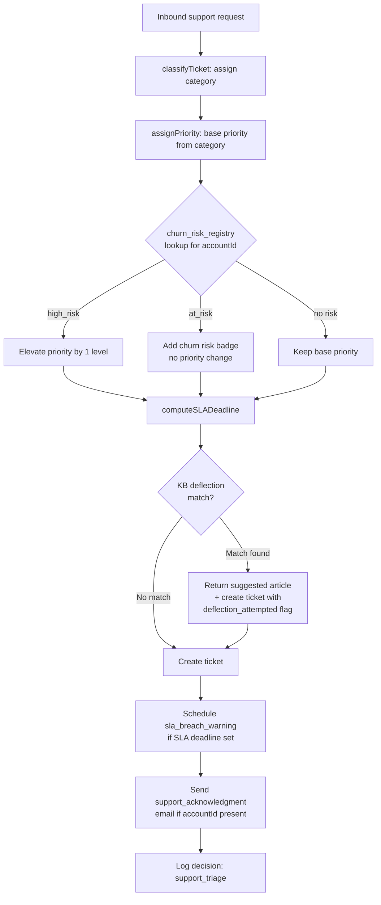

<!-- Part of slice-07-operations v2 -->

# S7 §2 — Support Triage & Ticket Management

---

Support triage is an entity decision architecture: inbound requests are classified, prioritised, checked against churn risk, evaluated for KB deflection, assigned SLA deadlines, and persisted as tickets — all before a human sees the queue. The entity acts as first-line triage; humans handle what the entity cannot resolve autonomously.

## 2.1 Triage Decision Flow

Every inbound support request passes through a 6-step pipeline before ticket creation.



## 2.2 Ticket Classification

`classifyTicket` assigns a category from a fixed set based on request metadata and keyword matching. The category determines base priority and SLA deadline computation.

```typescript
type TicketCategory =
  | "billing_support"
  | "profile_support"
  | "claim_dispute"
  | "feature_gating_confusion"
  | "account_access"
  | "data_request"
  | "refund_request"
  | "other"
```

```
classifyTicket(request: { subject: string; body: string; accountId?: UUID; listingId?: UUID }): TicketCategory

  subjectAndBody = (request.subject + " " + request.body).toLowerCase()

  // Keyword-based classification — ordered by specificity
  if matches(subjectAndBody, ["dsar", "data request", "erasure", "delete my data", "gdpr"]):
    return "data_request"

  if matches(subjectAndBody, ["claim", "dispute", "already own", "my company"]):
    return "claim_dispute"

  if matches(subjectAndBody, ["refund", "money back", "cancel and refund"]):
    return "refund_request"

  if matches(subjectAndBody, ["invoice", "billing", "payment", "charge", "subscription"]):
    return "billing_support"

  if matches(subjectAndBody, ["login", "password", "access", "locked out", "can't sign in"]):
    return "account_access"

  if matches(subjectAndBody, ["can't see who", "upgrade", "tier", "feature", "gated", "locked"]):
    return "feature_gating_confusion"

  if matches(subjectAndBody, ["profile", "listing", "edit", "update", "photo", "description"]):
    return "profile_support"

  return "other"
```

V1 uses keyword matching. S9 (Entity Intelligence) may replace this with a learned classifier trained on the `decision_logs` produced by this triage path.

## 2.3 Priority Assignment & Churn Risk Elevation

Base priority is determined by category. Churn risk elevates priority for at-risk accounts.

```
assignPriority(category: TicketCategory, accountId?: UUID): { priority: TicketPriority; churnRiskLevel: ChurnRiskLevel | null }

  // Base priority by category
  basePriority = match category:
    "data_request"              -> "high"      // GDPR statutory deadlines
    "claim_dispute"             -> "high"      // time-sensitive, two parties affected
    "refund_request"            -> "high"      // 30-day policy window creates urgency
    "billing_support"           -> "normal"
    "account_access"            -> "normal"
    "feature_gating_confusion"  -> "low"       // informational, no urgency
    "profile_support"           -> "low"
    "other"                     -> "normal"

  // Churn risk elevation [Source: operations.md — §4, CR-X-20]
  if accountId:
    riskEntry = db.select().from(churnRiskRegistry)
      .where(and(
        eq(churnRiskRegistry.accountId, accountId),
        gt(churnRiskRegistry.expiresAt, now())
      ))
      .limit(1)

    if riskEntry?.riskLevel === "high_risk":
      // Elevate by one level: low→normal, normal→high, high→critical
      priority = elevatePriority(basePriority)
      return { priority, churnRiskLevel: "high_risk" }

    if riskEntry?.riskLevel === "at_risk":
      // Badge only, no elevation
      return { priority: basePriority, churnRiskLevel: "at_risk" }

  return { priority: basePriority, churnRiskLevel: null }


elevatePriority(current: TicketPriority): TicketPriority
  match current:
    "low"      -> "normal"
    "normal"   -> "high"
    "high"     -> "critical"
    "critical" -> "critical"   // already at ceiling
```

## 2.4 SLA Deadline Computation

SLA deadlines are category-dependent. Not all categories carry deadlines — informational categories (`feature_gating_confusion`, `other` at `low` priority) receive no SLA. [Source: `operations.md` — §4 Support SLA Tiers]

```
computeSLADeadline(priority: TicketPriority): ISO8601 | null

  slaDuration = match priority:
    "critical" -> 4 hours
    "high"     -> 24 hours
    "normal"   -> 72 hours
    "low"      -> 7 days         // 168 hours

  return now() + slaDuration
```

All SLA durations are calendar time (not business hours) at V1. The concept design specifies business hours for human-involved responses, but V1 does not implement a business hours calculator. This is a known simplification — calendar SLA is stricter than business-hours SLA, which is acceptable for a platform prioritising responsiveness. Business hours computation deferred to S10 (Hardening) if needed.

## 2.5 KB Deflection Stub

V1 KB deflection checks inbound requests against a static FAQ pattern list. Returns a suggested article link if a match is found. The ticket is still created (the deflection is a suggestion, not a gate), but the ticket includes a `deflection_attempted` indicator for friction tracking.

```
checkKBDeflection(category: TicketCategory, subject: string): { matched: boolean; articleUrl?: string }

  // V1: static pattern list — S9 adds intelligent routing
  const faqPatterns: Record<string, string> = {
    "account_access":           "/help/account-access",
    "billing_support":          "/help/billing-faq",
    "feature_gating_confusion": "/help/tier-comparison",
    "profile_support":          "/help/editing-your-listing",
    "refund_request":           "/help/refund-policy",
  }

  articleUrl = faqPatterns[category]
  if articleUrl:
    return { matched: true, articleUrl }

  return { matched: false }
```

The deflection rate (percentage of tickets where KB was suggested before creation) is tracked in `decision_logs` as an input field for S9 perception signals.

## 2.6 `hasActiveTicket(listingId)` Query Implementation

Contract: `operations.md` (interface spec) — §3.1. D&L calls this before suspension and decay signal emission.

```typescript
// Authoritative type in operations.md §3.1 — summary only
type ActiveTicketRecord = { ticketId: UUID; category: string; openedAt: ISO8601 }
```

```
hasActiveTicket(listingId: UUID): ActiveTicketRecord | null

  result = db.select({
    ticketId: supportTickets.id,
    category: supportTickets.category,
    openedAt: supportTickets.createdAt,
  })
  .from(supportTickets)
  .where(and(
    eq(supportTickets.listingId, listingId),
    inArray(supportTickets.status, ["open", "assigned"])
  ))
  .orderBy(desc(supportTickets.createdAt))
  .limit(1)

  return result ?? null
```

**Performance:** <50ms p95. Uses the `(listing_id)` index on `support_tickets`. Returns the most recent active ticket if multiple exist. [Source: `operations.md` — §3.1]

## 2.7 SLA Breach Warning Scheduling

On ticket creation with a non-null SLA deadline, a `sla_breach_warning` deferred action is scheduled at 80% of the SLA duration. The action fires an admin notification and principal email when the SLA is approaching breach. On ticket resolution, the action is cancelled. [Source: `01-decisions.md` — D1]

```
scheduleSLABreachWarning(ticketId: UUID, slaDeadline: ISO8601):
  slaDuration = slaDeadline - now()
  warningAt = now() + (slaDuration * 0.8)

  scheduleAction("sla_breach_warning", { ticketId, slaDeadline }, warningAt)
```

**Handler implementation** (deferred action executor):

```
handleSLABreachWarning(params: { ticketId: UUID; slaDeadline: ISO8601 }):
  ticket = db.select().from(supportTickets).where(eq(supportTickets.id, params.ticketId)).limit(1)

  // Guard: ticket may have been resolved between scheduling and execution
  if !ticket || ticket.status === "resolved" || ticket.status === "closed":
    return    // no-op — ticket already handled

  // Create admin notification [D4]
  createNotification({
    accountId: ADMIN_ACCOUNT_ID,
    type: "task_overdue",
    title: "SLA breach approaching",
    body: `Ticket ${ticket.subject} — SLA deadline ${params.slaDeadline}`,
    link: `/admin/support/${params.ticketId}`,
  })
```

**Cancel on resolution:** When `admin.support.updateStatus` transitions a ticket to `"resolved"` or `"closed"`, the handler calls `cancelAction("sla_breach_warning", { ticketId })`. [Source: `01-router-plan.md` — §3.2]

## 2.8 Ticket Creation Flow

`admin.support.create` executes the full triage pipeline and persists the ticket. Side effects: SLA breach warning scheduling, acknowledgment email, decision logging.

```
admin.support.create(input: CreateTicketInput):
  // 1. Classify (if admin overrides category, use provided; otherwise auto-classify)
  category = input.category

  // 2. Priority assignment with churn risk check
  { priority, churnRiskLevel } = assignPriority(category, input.accountId)
  // Admin can override priority — if provided in input, use it
  effectivePriority = input.priority ?? priority

  // 3. SLA deadline computation
  slaDeadline = input.slaDeadline ?? computeSLADeadline(effectivePriority)

  // 4. KB deflection check (for tracking only — ticket is always created)
  deflection = checkKBDeflection(category, input.subject)

  // 5. Insert ticket
  ticketId = db.insert(supportTickets).values({
    accountId: input.accountId ?? null,
    listingId: input.listingId ?? null,
    category,
    priority: effectivePriority,
    status: "open",
    subject: input.subject,
    slaDeadline,
  }).returning({ id: supportTickets.id })

  // 6. Schedule SLA breach warning [D1]
  if slaDeadline:
    scheduleSLABreachWarning(ticketId, slaDeadline)

  // 7. Send acknowledgment email [SI §5.2: support_acknowledgment]
  if input.accountId:
    account = getAccount(input.accountId)
    if account?.email:
      sendEmail("support_acknowledgment", {
        to: account.email,
        ticketId,
        subject: input.subject,
        deflectionArticle: deflection.matched ? deflection.articleUrl : null,
      })

  // 8. Decision log [SI §9]
  logDecision({
    domain: "operations",
    decisionType: "support_triage",
    inputs: {
      category,
      hasAccount: !!input.accountId,
      churnRiskLevel,
      kbDeflectionMatched: deflection.matched,
    },
    output: {
      priority: effectivePriority,
      slaDeadline,
      priorityElevated: effectivePriority !== priority,
    },
    entityContext: {
      accountId: input.accountId,
      listingId: input.listingId,
      additionalContext: { ticketId },
    },
  })

  return { ticketId }
```

## 2.9 Ticket Status Transitions & Resolution

`admin.support.updateStatus` transitions ticket status. Resolution cancels the SLA breach warning. Each transition logs a decision. [Source: `01-router-plan.md` — §3.2]

```
admin.support.updateStatus({ ticketId, status, resolution }):
  ticket = getTicket(ticketId)
  if ticket.status === status: return         // idempotent

  // Build update payload
  updates = { status }
  if status === "resolved":
    updates.resolvedAt = now()
  if status === "closed":
    updates.closedAt = now()

  db.update(supportTickets).set(updates).where(eq(supportTickets.id, ticketId))

  // Cancel SLA breach warning on resolution [D1]
  if status === "resolved" || status === "closed":
    cancelAction("sla_breach_warning", { ticketId })

  // Decision log [SI §9]
  logDecision({
    domain: "operations",
    decisionType: "support_triage",
    inputs: { ticketId, previousStatus: ticket.status },
    output: { newStatus: status, resolution },
    entityContext: {
      accountId: ticket.accountId,
      listingId: ticket.listingId,
      additionalContext: { ticketId },
    },
  })
```

`admin.support.updatePriority` escalates or de-escalates ticket priority. Reason is mandatory for audit trail.

```
admin.support.updatePriority({ ticketId, priority, reason }):
  ticket = getTicket(ticketId)
  if ticket.priority === priority: return     // idempotent

  previousPriority = ticket.priority
  db.update(supportTickets).set({ priority }).where(eq(supportTickets.id, ticketId))

  // Recompute SLA deadline if priority changed and ticket is still active
  if inArray(ticket.status, ["open", "assigned"]):
    newSlaDeadline = computeSLADeadline(priority)
    db.update(supportTickets).set({ slaDeadline: newSlaDeadline }).where(eq(supportTickets.id, ticketId))

    // Reschedule SLA breach warning
    cancelAction("sla_breach_warning", { ticketId })
    if newSlaDeadline:
      scheduleSLABreachWarning(ticketId, newSlaDeadline)

  logDecision({
    domain: "operations",
    decisionType: "support_triage",
    inputs: { ticketId, previousPriority, reason },
    output: { newPriority: priority },
    entityContext: { accountId: ticket.accountId, listingId: ticket.listingId, additionalContext: { ticketId } },
  })
```

## 2.10 Admin Support List & Detail Routes

Route types are authoritative in `01-router-plan.md` — §3.2. This section documents query behaviour, not type redefinition.

**`admin.support.list`** returns paginated tickets with cursor-based pagination. Default sort: `sla_deadline ASC NULLS LAST` (tickets closest to SLA breach appear first). The `hasChurnRisk` boolean is derived from a LEFT JOIN to `churn_risk_registry` on `accountId`, filtered by `expiresAt > now()`. `slaRemainingHours` is computed as `EXTRACT(EPOCH FROM (sla_deadline - now())) / 3600`.

```
admin.support.list(input: SupportListInput):
  query = db.select({
    ...supportTicketColumns,
    slaRemainingHours: sql`EXTRACT(EPOCH FROM (sla_deadline - now())) / 3600`,
    hasChurnRisk: sql`EXISTS (
      SELECT 1 FROM churn_risk_registry
      WHERE churn_risk_registry.account_id = support_tickets.account_id
        AND churn_risk_registry.expires_at > now()
    )`,
  })
  .from(supportTickets)
  .where(buildFilters(input))
  .orderBy(buildSort(input.sort))
  .limit(input.limit + 1)               // fetch limit+1 for cursor detection

  // Cursor pagination: if results.length > limit, nextCursor = last row ID
  return { tickets: results.slice(0, input.limit), nextCursor }
```

**`admin.support.getDetail`** returns full ticket detail with account context, listing context, and churn risk level. Single query with LEFT JOINs — no N+1.

```
admin.support.getDetail({ ticketId }):
  result = db.select({
    ...supportTicketColumns,
    slaRemainingHours: sql`EXTRACT(EPOCH FROM (sla_deadline - now())) / 3600`,
    accountEmail: users.email,
    listingName: listings.name,
    churnRiskLevel: churnRiskRegistry.riskLevel,
  })
  .from(supportTickets)
  .leftJoin(users, eq(supportTickets.accountId, users.id))
  .leftJoin(listings, eq(supportTickets.listingId, listings.id))
  .leftJoin(churnRiskRegistry, and(
    eq(supportTickets.accountId, churnRiskRegistry.accountId),
    gt(churnRiskRegistry.expiresAt, now())
  ))
  .where(eq(supportTickets.id, ticketId))
  .limit(1)

  if !result: throw TRPCError({ code: "NOT_FOUND" })
  return result
```

## 2.11 Acceptance Criteria (§2)

| # | Criterion |
|---|-----------|
| AC-2.1 | `classifyTicket` assigns one of 8 categories based on keyword matching against subject + body [S7-ST-8] |
| AC-2.2 | Base priority is deterministic per category: `data_request`, `claim_dispute`, and `refund_request` = high; `billing_support` and `account_access` = normal; `feature_gating_confusion` and `profile_support` = low; `other` = normal [S7-ST-8] |
| AC-2.3 | Churn risk elevation: `high_risk` accounts have priority elevated by one level; `at_risk` accounts receive badge only (no elevation); expired entries (expiresAt < now()) are ignored |
| AC-2.4 | SLA deadline is computed from priority: critical=4h, high=24h, normal=72h, low=7d (calendar time) |
| AC-2.5 | `sla_breach_warning` deferred action is scheduled at 80% of SLA duration on ticket creation with non-null `slaDeadline` |
| AC-2.6 | `sla_breach_warning` deferred action is cancelled when ticket status transitions to `"resolved"` or `"closed"` |
| AC-2.7 | `support_acknowledgment` email is sent on ticket creation when `accountId` is present and has an email address |
| AC-2.8 | KB deflection returns a suggested article URL for `account_access`, `billing_support`, `feature_gating_confusion`, `profile_support`, and `refund_request` categories [S7-ST-8] |
| AC-2.9 | `hasActiveTicket(listingId)` returns `ActiveTicketRecord | null` with <50ms p95 performance |
| AC-2.10 | `hasActiveTicket` returns null when no tickets exist with `status IN ('open', 'assigned')` for the given `listingId` |
| AC-2.11 | Every ticket creation and status change produces a `decision_logs` entry with `domain: "operations"` and `decisionType: "support_triage"` |
| AC-2.12 | `admin.support.list` supports cursor-based pagination with filters for status, priority, category; default sort is `sla_deadline ASC NULLS LAST` |
| AC-2.13 | `admin.support.getDetail` returns ticket with account email, listing name, and churn risk level via LEFT JOINs (no N+1 queries) |
| AC-2.14 | Priority change via `admin.support.updatePriority` recomputes SLA deadline and reschedules `sla_breach_warning` for active tickets |
| AC-2.15 | `admin.support.updateStatus` is idempotent — transitioning to the current status is a no-op |
