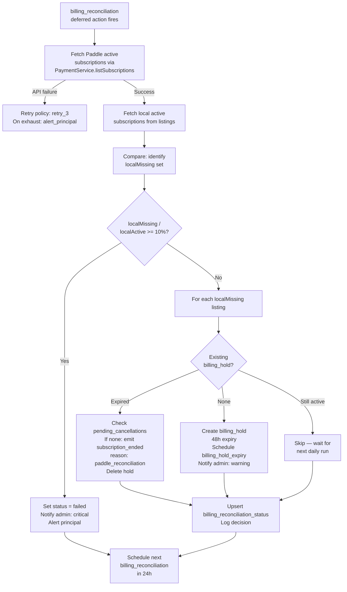

<!-- Part of slice-07-operations v2 -->

# §4 Billing Reconciliation

---

Billing reconciliation is a self-perpetuating daily deferred action that detects divergence between Paddle's subscription state and the local database. It creates 48-hour billing holds for investigation, emits `subscription_ended` with `reason: "paddle_reconciliation"` [D3] for confirmed cancellations, and upserts a single-row status table [D6] consumed by the admin dashboard and platform health monitoring. Billing holds are separate from compliance holds [D7].

## 4.1 Daily Reconciliation Handler

The `billing_reconciliation` deferred action is already registered in SI §2.2 (Operations domain, 24h recurring, `retry_3`, `alert_principal` on failure). S7 implements the handler. The handler self-perpetuates: on completion (success or failure), it schedules the next `billing_reconciliation` execution at `now() + 24h`.

```
handleBillingReconciliation():
  // Step 0: Paddle API health check [Ops concept design ST-22]
  subscriptions = PaymentService.listSubscriptions({ status: "active" })
    // P4: imported from SI §10.1. Returns PaddleSubscription[].
    // If the API call fails (timeout, 5xx), the handler throws.
    // Retry policy (retry_3) handles transient failures.
    // After 3 retries exhausted: alert_principal. Manual intervention required.

  // Step 1: Fetch local subscription state
  localActive = db.select()
    .from(listings)
    .where(
      and(
        ne(listings.subscriptionTier, "free"),
        isNotNull(listings.paddleSubscriptionId)
      )
    )

  // Step 2: Identify mismatches
  paddleIds = new Set(subscriptions.map(s => s.id))
  localMissing = localActive.filter(ls => !paddleIds.has(ls.paddleSubscriptionId))
    // localMissing: locally active subscriptions not found in Paddle → candidates for downgrade

  // Step 3: Anomaly detection — halt if ≥10% would be affected
  if localActive.length > 0 && localMissing.length / localActive.length >= 0.10:
    upsertReconciliationStatus({
      lastRunAt: now(),
      status: "failed",
      activeHolds: countActiveHolds(),
      lastAnomalyAt: now(),
      lastAnomalyDescription:
        `Reconciliation halted: ${localMissing.length} of ${localActive.length} subscriptions ` +
        `(${((localMissing.length / localActive.length) * 100).toFixed(1)}%) missing from Paddle.`
    })
    createNotification({
      accountId: ADMIN_ACCOUNT_ID,
      type: "billing_anomaly",
      data: {
        severity: "critical",
        missingCount: localMissing.length,
        totalCount: localActive.length,
      },
    })
    logDecision({
      domain: "operations",
      decisionType: "billing_reconciliation",
      inputs: { totalLocal: localActive.length, totalPaddle: subscriptions.length, missingCount: localMissing.length },
      output: { action: "halted", reason: "anomaly_threshold_exceeded" },
    })
    scheduleAction("billing_reconciliation", {}, now() + 24h)  // self-perpetuate despite halt
    return

  // Step 4: Process each mismatch
  holdsCreated = 0
  holdsExpired = 0

  for ls in localMissing:
    existingHold = db.select().from(billingHolds).where(eq(billingHolds.listingId, ls.id)).limit(1)

    if existingHold == null:
      // First detection — create 48h hold, do NOT emit subscription_ended yet
      holdId = db.insert(billingHolds).values({
        listingId: ls.id,
        reason: `Paddle subscription ${ls.paddleSubscriptionId} not found in active subscriptions`,
        expiresAt: now() + 48h,
      }).returning({ id: billingHolds.id })

      // Schedule hold expiry deferred action
      scheduleAction("billing_hold_expiry", { listingId: ls.id, holdId }, now() + 48h)

      createNotification({
        accountId: ADMIN_ACCOUNT_ID,
        type: "billing_anomaly",
        data: { severity: "warning", listingId: ls.id, paddleSubscriptionId: ls.paddleSubscriptionId },
      })
      holdsCreated++

    else if existingHold.expiresAt <= now():
      // Hold expired — confirmed cancellation. Check pending_cancellation registry.
      pendingRecord = db.select().from(pendingCancellations)
        .where(eq(pendingCancellations.paddleSubscriptionId, ls.paddleSubscriptionId))
        .limit(1)

      if pendingRecord == null:
        // No pending_cancellation record — this is a reconciliation-discovered cancellation [D3]
        emit("subscription_ended", {
          type: "subscription_ended",
          listingId: ls.id,
          accountId: ls.accountId,
          previousTier: ls.subscriptionTier,
          reason: "paddle_reconciliation",   // D3: distinct causal path
          origin: "paddle",
          timestamp: now(),
        })
      // else: pending_cancellation exists — the normal webhook path will handle it.
      // Clean up: remove the expired hold.
      db.delete(billingHolds).where(eq(billingHolds.id, existingHold.id))
      holdsExpired++

    // else: hold still active (< 48h) — skip, next daily run re-evaluates

  // Step 5: Check for reverse mismatches (Paddle active, local free/missing)
  for ps in subscriptions:
    local = localActive.find(l => l.paddleSubscriptionId === ps.id)
    if local == null:
      // Paddle has an active subscription with no local match.
      // Log as discrepancy. Do not auto-create local record at V1 — admin investigates.
      createNotification({
        accountId: ADMIN_ACCOUNT_ID,
        type: "billing_anomaly",
        data: { severity: "warning", paddleSubscriptionId: ps.id, direction: "paddle_only" },
      })

  // Step 6: Upsert reconciliation status [D6]
  upsertReconciliationStatus({
    lastRunAt: now(),
    status: holdsCreated > 0 ? "anomaly_detected" : "healthy",
    activeHolds: countActiveHolds(),
    lastAnomalyAt: holdsCreated > 0 ? now() : undefined,  // preserve previous if no new anomalies
    lastAnomalyDescription: holdsCreated > 0
      ? `${holdsCreated} new holds created, ${holdsExpired} holds expired`
      : undefined,
  })

  // Step 7: Decision log [SI §9]
  logDecision({
    domain: "operations",
    decisionType: "billing_reconciliation",
    inputs: { totalLocal: localActive.length, totalPaddle: subscriptions.length },
    output: {
      action: "completed",
      holdsCreated,
      holdsExpired,
      mismatches: localMissing.length,
    },
  })

  // Step 8: Self-perpetuate
  scheduleAction("billing_reconciliation", {}, now() + 24h)
```

**P1 compliance note:** The `subscription_ended` emission in Step 4 includes all fields required by Ops §1.2: `listingId`, `accountId`, `previousTier`, `reason`, `origin`, `timestamp`. The `accountId` is read from the local `listings` table — this is acceptable because the reconciliation handler is a scheduled job, not an event consumer (P1 applies to event consumer handlers, not scheduled reconciliation jobs).

**`PaymentService.listSubscriptions` — P4 import:** The handler imports `listSubscriptions` from `PaymentService` (SI §10.1). It does not call the Paddle API directly. The service abstraction enables test implementations to return controlled subscription lists.

## 4.2 Reconciliation Flow Diagram



## 4.3 Billing Hold Expiry Handler

The `billing_hold_expiry` deferred action fires 48 hours after hold creation. It handles the case where the daily reconciliation has not yet processed the expired hold (timing gap between hold expiry and next daily run).

```
handleBillingHoldExpiry({ listingId, holdId }):
  hold = db.select().from(billingHolds).where(eq(billingHolds.id, holdId)).limit(1)

  if hold == null:
    // Hold was already released (manually or by daily reconciliation). No-op.
    return

  // Hold still exists at 48h — auto-release with log entry.
  // The next daily reconciliation run will re-evaluate the listing.
  // The hold expiry handler does NOT emit subscription_ended — that is the
  // daily reconciliation handler's responsibility (Step 4, expired hold branch).
  db.delete(billingHolds).where(eq(billingHolds.id, holdId))

  logDecision({
    domain: "operations",
    decisionType: "billing_reconciliation",
    inputs: { holdId, listingId },
    output: { action: "hold_auto_expired", reason: "48h_elapsed_no_manual_release" },
  })
```

**Separation of concerns:** The expiry handler cleans up the hold row. The reconciliation handler decides whether to emit `subscription_ended`. This avoids duplicate emissions — if the reconciliation ran during the hold period and already processed the expired hold, the expiry handler finds nothing and no-ops.

## 4.4 getBillingReconciliationStatus Query

Contract: `operations.md` (interface) §3.5. Implementation target: <100ms p95.

```
getBillingReconciliationStatus(): BillingReconciliationStatus
  // Single-row table [D6]. SELECT returns at most 1 row.
  row = db.select().from(billingReconciliationStatus).limit(1)

  if row == null:
    // No reconciliation has run yet (fresh deployment)
    return {
      lastRunAt: null,
      status: "healthy",
      activeHolds: 0,
      lastAnomalyAt: null,
      lastAnomalyDescription: null,
    }

  return row
```

**Consumer:** PP admin dashboard (read-only display). Also consumed by `admin.health.getStatus` as one of 5 health signal sources (router plan §3.8).

## 4.5 Admin Billing Routes

Four routes. Type definitions and signatures in router plan §3.4 — referenced, not restated.

**`admin.billing.getStatus`** — calls `getBillingReconciliationStatus()`. Thin pass-through.

**`admin.billing.triggerReconciliation`** — schedules immediate `billing_reconciliation` deferred action (`executeAt: now()`). Does not execute reconciliation inline — the deferred action scheduler picks it up within 60 seconds (SI §2.3 polling interval). Decision log records manual trigger with `ctx.session.accountId` as actor.

```
admin.billing.triggerReconciliation():
  scheduleAction("billing_reconciliation", {}, now())
  logDecision({
    domain: "operations",
    decisionType: "billing_reconciliation",
    inputs: { trigger: "manual_admin", triggeredBy: ctx.session.accountId },
    output: { action: "scheduled" },
  })
  return { scheduled: true }
```

**`admin.billing.listHolds`** — paginated query on `billing_holds` joined with `listings` for `listingName`. Returns `BillingHoldRow[]` with computed `remainingHours`.

**`admin.billing.releaseHold`** — deletes the hold row. The admin has investigated the anomaly and determined the hold is no longer needed (e.g., Paddle API returned stale data, subscription confirmed active). Decision log records release reason and admin identity.

```
admin.billing.releaseHold({ holdId, reason }):
  hold = db.select().from(billingHolds).where(eq(billingHolds.id, holdId)).limit(1)
  if hold == null:
    throw TRPCError({ code: "NOT_FOUND", message: "Hold not found or already released" })

  db.delete(billingHolds).where(eq(billingHolds.id, holdId))

  // Cancel the billing_hold_expiry deferred action — hold was manually released
  cancelAction("billing_hold_expiry", { holdId })

  logDecision({
    domain: "operations",
    decisionType: "billing_reconciliation",
    inputs: { holdId, listingId: hold.listingId },
    output: { action: "hold_released", reason, releasedBy: ctx.session.accountId },
  })
```

## 4.6 Upstream Flag Resolution: S4-6

S4-6 flagged: "Billing reconciliation monitoring UI and failed event admin view — S7 provides the admin interface for billing health and subscription anomalies."

**Resolved.** §4 implements:
- `getBillingReconciliationStatus()` query backed by single-row table [D6]
- Admin billing status page at `/admin/billing` displaying last run time, status badge, active hold count, anomaly description
- Hold list with remaining time, listing context, and manual release action
- Manual reconciliation trigger for ad-hoc runs
- Health monitoring integration via `admin.health.getStatus` (router plan §3.8)

The failed event admin view is covered in §7 (separate section).

## 4.7 Acceptance Criteria

| # | Criterion |
|---|-----------|
| S7-AC-BR-1 | `billing_reconciliation` deferred action handler fetches active subscriptions via `PaymentService.listSubscriptions` and compares with local `listings` table |
| S7-AC-BR-2 | If mismatch count / total >= 10%, handler sets `billing_reconciliation_status.status = "failed"`, creates `billing_anomaly` notification with `severity: "critical"`, and does NOT create holds or emit events |
| S7-AC-BR-3 | For each mismatch below 10% threshold: if no existing `billing_holds` record, handler creates one with `expiresAt = now() + 48h` and schedules `billing_hold_expiry` deferred action |
| S7-AC-BR-4 | For each mismatch with expired hold (and no `pending_cancellations` record): handler emits `subscription_ended` with `reason: "paddle_reconciliation"`, `origin: "paddle"`, and all Ops §1.2 payload fields |
| S7-AC-BR-5 | Handler upserts `billing_reconciliation_status` on every run with current status, hold count, and anomaly details [D6] |
| S7-AC-BR-6 | Handler self-perpetuates by scheduling next `billing_reconciliation` at `now() + 24h` |
| S7-AC-BR-7 | `billing_hold_expiry` handler deletes expired hold row; does NOT emit `subscription_ended` (reconciliation handler owns emission) |
| S7-AC-BR-8 | `admin.billing.getStatus` returns current `BillingReconciliationStatus` from single-row table; <100ms p95 |
| S7-AC-BR-9 | `admin.billing.triggerReconciliation` schedules immediate `billing_reconciliation` deferred action and logs decision |
| S7-AC-BR-10 | `admin.billing.releaseHold` deletes hold row, cancels `billing_hold_expiry` deferred action, and logs decision with admin identity and reason |
| S7-AC-BR-11 | `admin.billing.listHolds` returns paginated holds joined with listing name and computed `remainingHours` |
| S7-AC-BR-12 | Every reconciliation run, hold creation, and hold release produces a `decision_logs` entry [SI §9] |
| S7-AC-BR-13 | `checkComplianceHold` does NOT query `billing_holds` — billing holds and compliance holds are separate [D7] |

---

## Cross-References

| Document | Relationship |
|----------|-------------|
| `shared-infrastructure.md` (v6) | §2.1 `DeferredActionParamsMap` (billing_reconciliation, billing_hold_expiry), §2.2 registered actions, §9 decision logging, §10.1 `PaymentService.listSubscriptions` |
| `operations.md` (v3 interface) | §1.2 `SubscriptionEndedEvent` (reason union extended with `"paddle_reconciliation"` per D3), §3.5 `getBillingReconciliationStatus`, §5 pending cancellation registry |
| `operations.md` (v6 concept design) | §7 Billing Reconciliation (reconciliation algorithm, safeguards, grace period) |
| `01-schema.md` | §2.5 `billing_holds`, §2.7 `billing_reconciliation_status` |
| `01-router-plan.md` | §3.4 `admin.billing.*` (4 routes) |
| `01-decisions.md` | D3 (`paddle_reconciliation` reason), D6 (single-row status table), D7 (separate hold queries) |
| `commercial-and-revenue.md` (v3) | §4.5 `SubscriptionEvent` → domain event mapping, `inferCancellationReason` |
