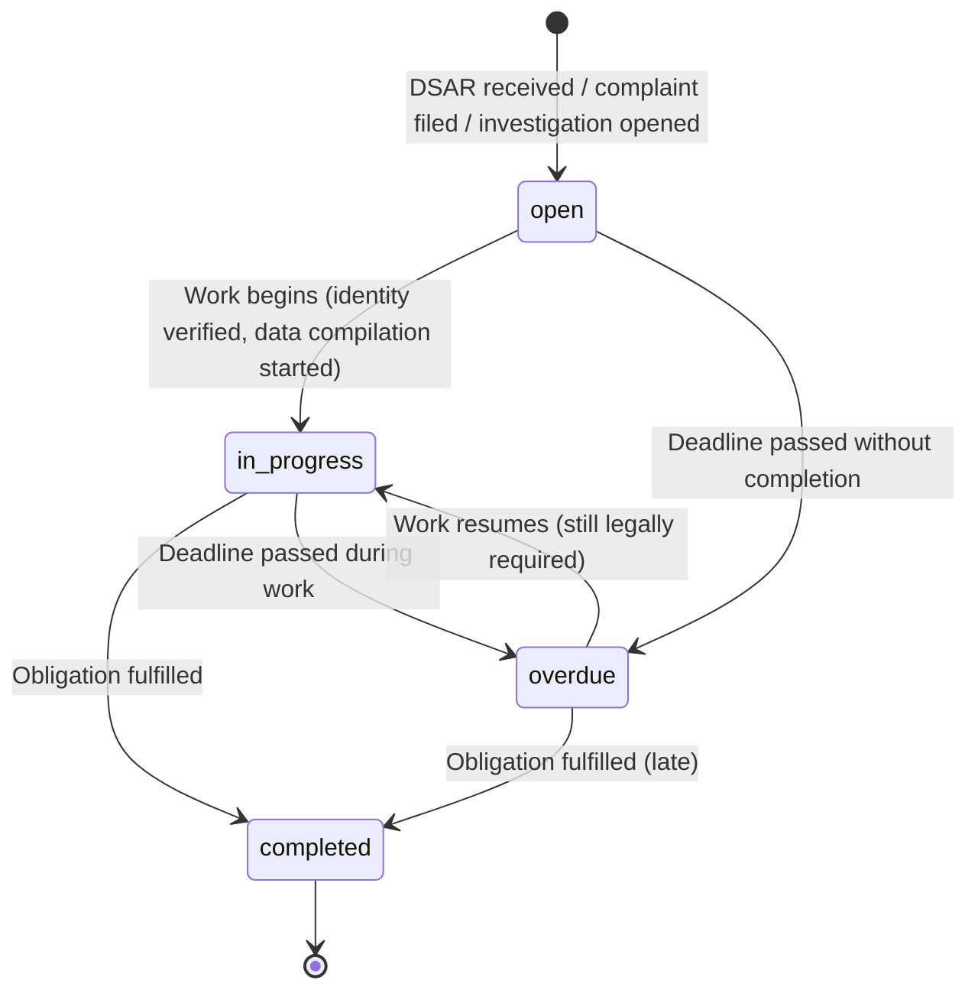

<!-- Part of slice-07-operations v2 -->

# S7 §5 — Compliance Management

---

The compliance register is a single table serving three purposes: DSAR case management with statutory deadlines, a compliance obligation calendar for scheduled self-audit, and an immutable audit trail for completed compliance actions. Six entry types cover the full compliance surface at V1. `checkComplianceHold` and `getDSARStatus` are the two query interfaces exposed to Platform. Both are read-only — Platform never modifies compliance data.

## 5.1 Compliance Register — Entry Types and Lifecycle

Schema: `compliance_register` table. [Source: `01-schema.md` §2.6]

Six entry types partition the register by compliance function:

| Type | Purpose | Status Lifecycle | Deadline | Creates Hold? |
|------|---------|-----------------|----------|---------------|
| `dsar` | Data Subject Access Request case | `open` → `in_progress` → `completed` | 30 calendar days from `receivedAt` (statutory) | Yes — blocks account closure via `checkComplianceHold` |
| `erasure` | Audit record of completed erasure | Created as `completed` | None (retroactive record) | No |
| `article_14` | Article 14 notice batch tracking | Created as `completed` | None (S2 import pipeline owns the deadline) | No |
| `complaint` | Regulatory or user complaint | `open` → `in_progress` → `completed` | Set per complaint; no statutory default | Yes, if `status = 'open'` |
| `investigation` | Regulatory investigation | `open` → `in_progress` → `completed` | Set per investigation | Yes, if `status = 'open'` |
| `obligation` | Compliance calendar entry | `open` → `completed` or `overdue` | Per obligation schedule | No |



**Hold-creating types:** Only `dsar`, `complaint`, and `investigation` create compliance holds. `erasure`, `article_14`, and `obligation` are audit records or calendar items — they do not block account closure. [Source: D7 — billing holds are separate from compliance holds.]

**FK semantics:** `accountId` uses `onDelete: "set null"`. Compliance records survive account deletion because they are legal audit records. A DSAR record must persist even after the account it references is erased — the record documents that the erasure was performed. [Source: `01-schema.md` §2.6]

**`erasure` entry creation:** The `erasure_completed` event consumer creates a `compliance_register` entry with `type: 'erasure'`, `status: 'completed'`, and `completedAt = event.timestamp`. This is a write-once audit record. [Source: Ops concept design §5 — "Operations consumes event and creates audit record."]

**`article_14` entry creation:** S2 import pipeline creates batch entries during the pre-launch Article 14 notice process. S7 provides read-only admin visibility. No S7 creation path — these are pre-launch compliance records. [Source: Ops concept design §5 — Pre-Launch Article 14 Obligation]

## 5.2 checkComplianceHold Query Implementation

Contract: `operations.md` §3.2. Consumer: PP (account closure flow).

```
checkComplianceHold(accountId: UUID): ComplianceHoldResult

  holdEntries = SELECT id, type, status, receivedAt, deadline
    FROM compliance_register
    WHERE account_id = accountId
      AND type IN ('dsar', 'complaint', 'investigation')
      AND status = 'open'

  if holdEntries.length === 0:
    return { holdExists: false }

  // Return first blocking entry (priority: dsar > investigation > complaint)
  entry = holdEntries.sort(byTypePriority).at(0)
  holdTypeMap = { dsar: "open_dsar", complaint: "pending_complaint", investigation: "active_investigation" }

  return {
    holdExists: true,
    reason: describeHold(entry),
    holdType: holdTypeMap[entry.type],
  }
```

**Performance:** Single indexed query on `(account_id)` with type/status filter. <100ms p95. [Source: Ops §3.2]

**Concurrent erasure and closure:** If both flows target the same account, `checkComplianceHold` returns `holdType: "open_dsar"`, deferring the closure flow's buyer data deletion step. After erasure completes, the DSAR case closes, the hold clears, and the `compliance_hold_recheck` deferred action resumes closure. No manual intervention for this interaction. [Source: Ops §3.2 OPS-ST-8]

## 5.3 getDSARStatus Query Implementation

Contract: `operations.md` §3.3. Consumer: PP (admin dashboard).

```
getDSARStatus(): DSARDashboardView

  openDSARs = SELECT id, received_at, status, account_id, deadline
    FROM compliance_register
    WHERE type = 'dsar' AND status IN ('open', 'in_progress')

  recentErasures = SELECT id, completed_at
    FROM compliance_register
    WHERE type = 'erasure' AND completed_at > now() - INTERVAL '90 days'

  upcomingDeadlines = SELECT type AS obligation, deadline AS dueDate
    FROM compliance_register
    WHERE status IN ('open', 'in_progress')
      AND deadline IS NOT NULL
      AND deadline > now()
      AND deadline < now() + INTERVAL '30 days'
    ORDER BY deadline ASC

  return {
    openDSARs: openDSARs.map(d => ({
      id: d.id,
      receivedAt: d.receivedAt,
      daysRemaining: Math.max(0, daysBetween(now(), d.deadline)),
      status: mapToLifecycleStatus(d.status),  // "identity_verification" | "data_compilation" | "principal_review"
      accountId: d.accountId,
    })),
    recentErasures: recentErasures.map(e => ({ id: e.id, completedAt: e.completedAt })),
    complianceCalendarStatus: evaluateCalendarStatus(),
    upcomingDeadlines,
  }
```

**Performance:** Three queries (open DSARs, recent erasures, upcoming deadlines) executed in parallel. <200ms p95. [Source: Ops §3.3]

**Lifecycle stage mapping [OPS-ST-9]:** The `status` field in `DSARDashboardView.openDSARs` tracks the compliance lifecycle (pre-erasure), not the orchestrated flow status. `"identity_verification"` = 72h acknowledgment + identity check. `"data_compilation"` = preparing data inventory. `"principal_review"` = escalated DSARs requiring principal sign-off. The orchestrated erasure flow (`OrchestratedFlowProgress` in SI §3.2) begins after the DSAR is accepted and erasure initiated. [Source: Ops §3.3 OPS-ST-9]

## 5.4 compliance_schedule_check Deferred Action Handler

Existing deferred action registered in SI §2.2. S7 implements the handler. Daily recurring cycle — scans the compliance register for entries approaching deadline.

```
handleComplianceScheduleCheck():

  // Entries approaching deadline within 7 days
  approachingEntries = SELECT id, type, status, deadline, account_id
    FROM compliance_register
    WHERE status IN ('open', 'in_progress')
      AND deadline IS NOT NULL
      AND deadline BETWEEN now() AND now() + INTERVAL '7 days'

  for entry in approachingEntries:
    // Create admin notification [D4]
    insertNotification({
      accountId: ADMIN_ACCOUNT_ID,
      type: "compliance_deadline",
      title: formatDeadlineTitle(entry),
      body: `${entry.type} entry ${entry.id} deadline in ${daysBetween(now(), entry.deadline)} days`,
      metadata: { entryId: entry.id, entryType: entry.type, deadline: entry.deadline },
    })

  // Mark overdue entries
  overdueEntries = SELECT id FROM compliance_register
    WHERE status IN ('open', 'in_progress')
      AND deadline IS NOT NULL
      AND deadline < now()
  for entry in overdueEntries:
    UPDATE compliance_register SET status = 'overdue' WHERE id = entry.id

  // Self-perpetuate: schedule next check in 24h
  scheduleAction("compliance_schedule_check", {}, now() + 24h)

  logDecision({
    domain: "operations",
    decisionType: "compliance_scheduling",
    inputs: { approachingCount: approachingEntries.length, overdueCount: overdueEntries.length },
    output: { notificationsCreated: approachingEntries.length, overdueTransitions: overdueEntries.length },
  })
```

**Notification delivery:** Uses existing `Notification` table with `accountId` = admin account ID. New type: `compliance_deadline`. [Source: D4 — admin is a standard account with `role: "admin"`. No separate `admin_notifications` table.]

## 5.5 compliance_self_audit Deferred Action Handler

New deferred action registered in S7. [Source: checklist §1.1] 24h recurring cycle seeded on application startup. Runs automated compliance checks independent of the `compliance_schedule_check` deadline scanner.

```
handleComplianceSelfAudit():

  failures: string[] = []

  // 1. Data retention policy check
  //    Verify search_history cleanup ran within last 24h (S0 deferred action)
  lastCleanup = getLastDeferredActionExecution("search_history_cleanup")
  if lastCleanup is null OR hoursSince(lastCleanup) > 48:
    failures.push("search_history_cleanup has not run in 48h")

  // 2. GDPR register completeness
  //    Every active listing should have an Article 14 record if source = '4rfv_import'
  seededWithoutNotice = SELECT COUNT(*) FROM listings l
    WHERE l.source = '4rfv_import'
      AND l.lifecycle_status != 'archived'
      AND NOT EXISTS (
        SELECT 1 FROM compliance_register cr
        WHERE cr.type = 'article_14'
          AND cr.details->>'listingId' = l.id::text
      )
  if seededWithoutNotice > 0:
    failures.push(seededWithoutNotice + " seeded listings missing Article 14 records")

  // 3. Active DSAR deadline check
  //    Any DSAR with < 5 days remaining and no in_progress status = urgent gap
  urgentDSARs = SELECT id FROM compliance_register
    WHERE type = 'dsar'
      AND status = 'open'
      AND deadline < now() + INTERVAL '5 days'
  if urgentDSARs.length > 0:
    failures.push(urgentDSARs.length + " DSARs approaching deadline without in_progress status")

  // Log results
  logDecision({
    domain: "operations",
    decisionType: "compliance_self_audit",
    inputs: { checksRun: 3 },
    output: { failures, passed: failures.length === 0 },
  })

  // Escalate to principal on failure
  if failures.length > 0:
    insertNotification({
      accountId: ADMIN_ACCOUNT_ID,
      type: "compliance_deadline",
      title: "Compliance self-audit failures detected",
      body: failures.join("; "),
      metadata: { failures, auditTimestamp: now() },
    })

  // Self-perpetuate
  scheduleAction("compliance_self_audit", {}, now() + 24h)
```

**Startup seeding:** On application startup, if no `compliance_self_audit` deferred action exists with status `"pending"`, the application seeds one with `executeAt = now()`. This ensures the cycle starts without manual intervention and resumes after deployments.

## 5.6 DSAR Email Triggers

Two existing email templates are triggered from the compliance management admin flow.

**DSAR acknowledgment (`dsar_acknowledgment`):** Sent on DSAR entry creation when `type = 'dsar'` and `accountId` resolves to an email address. Template exists in SI §5.2. Content: acknowledgment of receipt, 30-day deadline notice, next steps (identity verification if needed). [Source: Ops concept design §5 — "Entity acknowledges within 72 hours."]

**DSAR completion (`dsar_completion`):** Sent when a DSAR entry transitions to `status = 'completed'`. Triggered from `admin.compliance.updateStatus`. Template exists in SI §5.2. Content: confirmation that the request has been fulfilled, summary of actions taken.

```
// Triggered within admin.compliance.create when type = 'dsar'
onDSARCreated(entry):
  if entry.accountId:
    account = getAccount(entry.accountId)
    if account?.email:
      sendEmail("dsar_acknowledgment", {
        to: account.email,
        dsarId: entry.id,
        receivedAt: entry.receivedAt,
        deadline: entry.deadline,
      })

// Triggered within admin.compliance.updateStatus when type = 'dsar' and status = 'completed'
// See router plan §3.5 admin.compliance.updateStatus for full pseudocode
```

## 5.7 Admin Compliance Routes

Four routes in `admin.compliance.*`. Full type signatures, input schemas, and pseudocode in router plan §3.5. Summary:

| Route | Purpose | Side Effects |
|-------|---------|-------------|
| `admin.compliance.list` | Paginated register view. Filter by `type`, `status`. Sort by `deadline`, `created_at`, `status`. | None |
| `admin.compliance.getDetail` | Entry detail with account context and `hasComplianceHold` derivation. | None |
| `admin.compliance.create` | Create entry (DSAR, complaint, investigation, obligation). | DSAR: sends `dsar_acknowledgment` email. All types: decision log. |
| `admin.compliance.updateStatus` | Transition status. | DSAR completion: sends `dsar_completion` email. All transitions: decision log. |

**`admin.compliance.create` — DSAR defaults:** When `type = 'dsar'`, `receivedAt` defaults to `now()` if omitted, and `deadline` defaults to `receivedAt + 30 days`. The 30-day deadline is statutory (UK GDPR Art 12(3)). Admin can override if the clock was paused for identity verification.

**Decision logging:** Every entry creation and status change produces a `decision_logs` row. [Source: SI §9] Decision types: `"compliance_scheduling"` for status transitions, `"compliance_scheduling"` for new entries. Entity context includes `accountId` when present.

## 5.8 Acceptance Criteria (§5)

- **AC-5.1:** `checkComplianceHold(accountId)` returns `{ holdExists: true, holdType: "open_dsar" }` when an open DSAR exists for the account, and `{ holdExists: false }` when no open compliance entries exist. <100ms p95.
- **AC-5.2:** `getDSARStatus()` returns open DSAR count, approaching deadline count, recent erasure count, and upcoming deadlines. `daysRemaining` is computed from deadline. <200ms p95.
- **AC-5.3:** `compliance_schedule_check` deferred action creates `compliance_deadline` notification for entries within 7 days of deadline. Marks overdue entries. Self-perpetuates with 24h delay.
- **AC-5.4:** `compliance_self_audit` deferred action checks data retention policy, GDPR register completeness, and active DSAR status. Escalates to principal on failure. Self-perpetuates with 24h delay.
- **AC-5.5:** Creating a DSAR entry sends `dsar_acknowledgment` email to the associated account email.
- **AC-5.6:** Transitioning a DSAR entry to `completed` sends `dsar_completion` email to the associated account email.
- **AC-5.7:** `admin.compliance.create` with `type = 'dsar'` defaults `deadline` to `receivedAt + 30 days` when no explicit deadline is provided.
- **AC-5.8:** `compliance_register` entries with `type IN ('dsar', 'complaint', 'investigation')` and `status = 'open'` create compliance holds. Entries with `type IN ('erasure', 'article_14', 'obligation')` never create holds.
- **AC-5.9:** Billing holds (§4) are NOT checked by `checkComplianceHold`. Separate queries, separate purposes. [Source: D7]
- **AC-5.10:** Every `admin.compliance.create` and `admin.compliance.updateStatus` call produces a `decision_logs` entry.

---

## Cross-References

| Document | Relationship |
|----------|-------------|
| `operations.md` (interface spec v3) §3.2 | `checkComplianceHold` contract — authoritative type definition |
| `operations.md` (interface spec v3) §3.3 | `getDSARStatus` contract — authoritative type definition |
| `operations.md` (concept design v6) §5 | Compliance calendar, DSAR processing, self-audit — implementation source |
| `shared-infrastructure.md` (v6) §2.1–§2.2 | `compliance_schedule_check` deferred action registration |
| `shared-infrastructure.md` (v6) §5.2 | `dsar_acknowledgment`, `dsar_completion` email templates |
| `shared-infrastructure.md` (v6) §8.1 | `compliance_deadline` notification type [D4] |
| `shared-infrastructure.md` (v6) §9 | Decision logging contract |
| `01-schema.md` §2.6 | `compliance_register` table definition — authoritative schema |
| `01-router-plan.md` §3.5 | `admin.compliance.*` route signatures and pseudocode |
| `01-decisions.md` D4 | Admin notifications via existing `Notification` table |
| `01-decisions.md` D5b | Ops-Q4 deferred to pre-launch governance |
| `01-decisions.md` D7 | Billing holds separate from compliance holds |
