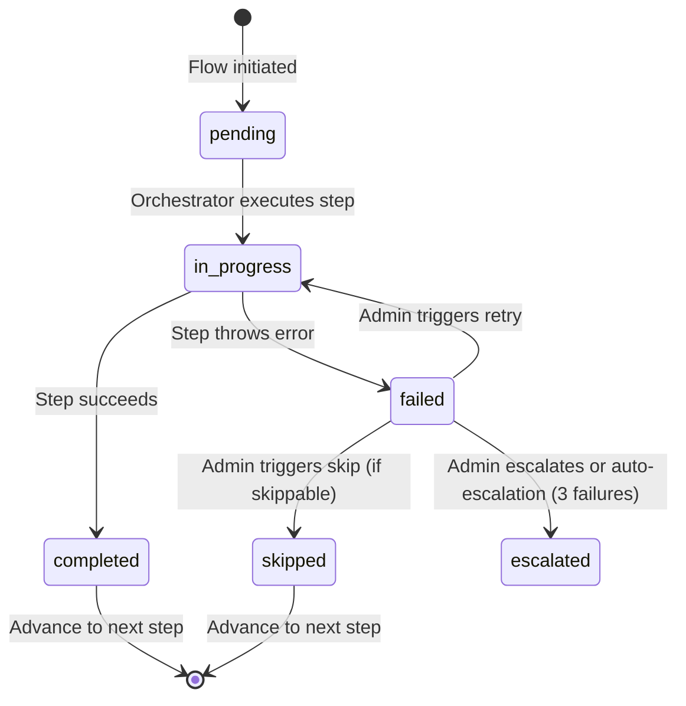

<!-- Part of slice-07-operations v2 -->

# S7 §6 — Orchestrated Flow Admin View

---

The orchestrated flow admin view provides read-only monitoring and three recovery actions (retry, skip, escalate) for erasure and closure flows. Skip constraints are enforced both client-side (disabled buttons) and server-side (FORBIDDEN rejection). The view surfaces step-level progress, attempt counts, and deadline countdowns. All flow data reads from the `orchestrated_flows` table defined in S0 §4, with the `updatedAt` column added in S7 (resolves S0-3).

## 6.1 Flow List View

Admin navigates to `/admin/flows`. Route: `admin.flows.list`. [Source: router plan §3.6]

**Filters:** `flowType` (`erasure` | `closure`), `status` (`initiated` | `in_progress` | `completed` | `failed` | `escalated`). **Sort options:** `deadline` (erasure flows first by urgency), `started_at`, `updated_at` (last activity). Cursor-based pagination, 20 per page.

```typescript
// Return type per row — authoritative in router plan §3.6
type FlowRow = {
  flowId: UUID
  flowType: "erasure" | "closure"
  status: "initiated" | "in_progress" | "completed" | "failed" | "escalated"
  currentStep: number
  totalSteps: number
  startedAt: ISO8601
  updatedAt: ISO8601              // S0-3 amendment — last step activity
  deadline: ISO8601 | null        // erasure: 30 days from DSAR. closure: null.
  daysRemaining: number | null    // computed: deadline - now(). Null if no deadline.
}
```

**Deadline display:** Erasure flows show the 30-day DSAR statutory deadline with a countdown (`daysRemaining`). Visual indicators: green (>7 days), amber (3–7 days), red (<3 days or overdue). Closure flows show no statutory deadline — `deadline` and `daysRemaining` are `null`. The `updatedAt` column (S0-3 resolution) provides "last activity" sorting without scanning the JSONB `steps` array.

**Query:**

```
admin.flows.list(input):
  SELECT
    id AS flowId,
    flow_type AS flowType,
    status,
    current_step AS currentStep,
    jsonb_array_length(steps) AS totalSteps,
    started_at AS startedAt,
    updated_at AS updatedAt,
    deadline,
    CASE WHEN deadline IS NOT NULL
      THEN EXTRACT(EPOCH FROM (deadline - now())) / 86400
      ELSE NULL
    END AS daysRemaining
  FROM orchestrated_flows
  WHERE ($1::text IS NULL OR flow_type = $1)
    AND ($2::text IS NULL OR status = $2)
  ORDER BY {sort} {direction}
  LIMIT $3
```

## 6.2 Flow Detail View

Admin navigates to `/admin/flows/[flowId]`. Route: `admin.flows.getDetail`. [Source: router plan §3.6]

```typescript
// Return type — authoritative in router plan §3.6
type FlowDetail = FlowRow & {
  triggeredBy: UUID
  completedAt: ISO8601 | null
  escalatedAt: ISO8601 | null
  escalationReason: string | null
  steps: FlowStepView[]
}

// Per-step view — mirrors OrchestratedFlowStep (SI §3.2) with admin-facing additions
type FlowStepView = {
  name: string
  domain: string                  // owning domain for display and routing [SI §3.2]
  status: "pending" | "in_progress" | "completed" | "failed" | "skipped"
  attempt: number
  completedAt: ISO8601 | null
  error: string | null
  retryable: boolean              // always true at V1 [SI §3.2]
  skippable: boolean              // from skip constraint matrix [SI §3.5]
  skipReason: string | null
  skippedBy: string | null        // admin accountId who skipped
}
```

**Step progress display:** Each step renders as a row in a vertical timeline. Completed steps show a checkmark, failed steps show an error badge with the error message, skipped steps show a skip badge with reason, pending steps are greyed out. The current step is highlighted.



## 6.3 Recovery Actions

Three recovery actions per SI §3.3. Each operates on the current failed step of the flow.

### Retry

Re-executes the current failed step. Route: `admin.flows.retryStep`.

```
admin.flows.retryStep({ flowId }):
  flow = getFlow(flowId)
  if flow.status !== "failed":
    throw TRPCError({ code: "PRECONDITION_FAILED", message: "Flow is not in failed state" })

  currentStep = flow.steps[flow.currentStep]

  // Increment attempt counter
  currentStep.attempt += 1
  currentStep.status = "in_progress"
  flow.status = "in_progress"

  // Persist state, then execute
  updateFlow(flow)

  // Re-execute the step using the persisted context
  // executeOrchestratedFlow resumes from currentStep [SI §3.3]
  resumeOrchestratedFlow(flowId)

  // updatedAt updated by executeOrchestratedFlow on step completion/failure
  logDecision({
    domain: "operations",
    decisionType: "flow_step_retry",
    inputs: { flowId, stepName: currentStep.name, attempt: currentStep.attempt },
    output: { action: "retry_initiated" },
  })
```

**No hard retry limit:** After auto-escalation (3 consecutive failures), the principal can trigger retry indefinitely. The attempt counter is unbounded. [Source: SI §3.3 — SI-9]

### Skip

Advance past the current step. Route: `admin.flows.skipStep`. Enforces skip constraint matrix.

```
admin.flows.skipStep({ flowId, reason }):
  flow = getFlow(flowId)
  currentStep = flow.steps[flow.currentStep]

  // Server-side skip constraint enforcement [SI §3.5, R11]
  if !currentStep.skippable:
    throw TRPCError({
      code: "FORBIDDEN",
      message: "Step cannot be skipped: " + currentStep.name
    })

  // Reason is mandatory [SI §3.5]
  if !reason || reason.trim().length === 0:
    throw TRPCError({ code: "BAD_REQUEST", message: "Skip reason is required" })

  // Apply skip
  currentStep.status = "skipped"
  currentStep.skipReason = reason
  currentStep.skippedBy = ctx.session.accountId    // NOT ctx.session.id

  // Advance flow
  if flow.currentStep === flow.steps.length - 1:
    flow.status = "completed"
    flow.completedAt = now()
  else:
    flow.currentStep += 1
    flow.status = "in_progress"

  flow.updatedAt = now()
  updateFlow(flow)

  logDecision({
    domain: "operations",
    decisionType: "flow_step_skip",
    inputs: { flowId, stepName: currentStep.name, flowType: flow.flowType },
    output: { action: "skipped", reason, skippedBy: ctx.session.accountId },
  })
```

### Escalate

Mark the flow as escalated. Route: `admin.flows.escalate`. Creates a notification for the principal.

```
admin.flows.escalate({ flowId, reason }):
  flow = getFlow(flowId)

  flow.status = "escalated"
  flow.escalatedAt = now()
  flow.escalationReason = reason
  flow.updatedAt = now()
  updateFlow(flow)

  // Notify principal
  insertNotification({
    accountId: ADMIN_ACCOUNT_ID,
    type: "compliance_deadline",      // reuses compliance_deadline type for flow escalations [D4]
    title: "Orchestrated flow escalated: " + flow.flowType,
    body: reason,
    metadata: { flowId, flowType: flow.flowType, stepName: flow.steps[flow.currentStep].name },
  })

  logDecision({
    domain: "operations",
    decisionType: "flow_escalation",
    inputs: { flowId, flowType: flow.flowType },
    output: { action: "escalated", reason, escalatedBy: ctx.session.accountId },
  })
```

## 6.4 Skip Constraint Enforcement

Two enforcement layers prevent skipping non-skippable steps. [Source: SI §3.5, R11]

**Client-side:** The admin UI disables skip buttons for steps where `skippable = false`. The `FlowStepView.skippable` field drives button state. Non-skippable steps display a lock icon with tooltip explaining the constraint rationale.

**Server-side:** `admin.flows.skipStep` rejects non-skippable steps with `TRPCError({ code: "FORBIDDEN" })`. This is the authoritative enforcement — client-side disabling is a UX convenience, not a security boundary.

**Skip constraint matrix (reproduced from SI §3.5 for admin UI labelling):**

| Flow | Step | Skippable | Admin UI Label |
|------|------|-----------|---------------|
| **Erasure** | 1. Verify identity | No | "Legal requirement — identity must be verified" |
| **Erasure** | 2. Extract account data | Yes | "Warning: no audit record of erased data" |
| **Erasure** | 3. Close support tickets | Yes | "Tickets remain open for manual cleanup" |
| **Erasure** | 4. Execute processErasure | No | "Core operation — cannot skip" |
| **Erasure** | 5. Close DSAR case + audit record | No | "Compliance audit record is legally required" |
| **Erasure** | 6. Emit erasure_completed | Yes | "Downstream cleanup required manually" |
| **Closure** | 1. Archive listings | No | "Listings must be removed from search" |
| **Closure** | 2. Cancel subscriptions | Yes | "Admin confirms Paddle handled manually" |
| **Closure** | 3. Anonymise buyer enquiry data | Yes | "Privacy risk accepted by admin" |
| **Closure** | 4. Delete/defer buyer data | Yes | "Data retained longer than expected" |
| **Closure** | 5. Deactivate account | No | "Account must be disabled" |
| **Closure** | 6. Emit account_closed | Yes | "Downstream cleanup required manually" |

**CANNOT SKIP summary (5 steps):** Verify identity, processErasure, close DSAR case, archive listings, deactivate account. These five steps have hard legal or operational requirements that an admin skip cannot satisfy. [Source: SQ-2]

## 6.5 updatedAt Column Usage

`orchestrated_flows.updatedAt` is added in S7. [Source: `01-schema.md` §3.1, resolves S0-3]

**Updated on:** Each step completion, skip, retry, or escalation. The `executeOrchestratedFlow` function sets `updatedAt = now()` after every step state change.

**Not `.notNull()`:** Existing rows from before the S7 migration have `updatedAt = null`. Application code treats `null` as "no activity since migration" — the list view falls back to `startedAt` for sorting when `updatedAt` is null.

**Sort usage:** Admin flow list supports `sort: "updated_at"` which orders by last activity. Combined with status filters, this surfaces recently-active failed flows at the top.

## 6.6 Upstream Flag Resolutions

| Flag | Source | Resolution |
|------|--------|-----------|
| S0-3 | S0 downstream flags | `orchestrated_flows.updatedAt` column added. Updated on each step completion/skip/retry. Used for admin "last activity" display and sort. |
| R11 | SQ-2 | Skip constraint enforcement implemented: client-side disabled buttons + server-side FORBIDDEN rejection. Skip requires free-text reason + admin `accountId`. Matrix per SI §3.5. |

## 6.7 Acceptance Criteria (§6)

- **AC-6.1:** Admin flow list view displays flows filtered by `flowType` and `status`, sorted by `deadline`, `started_at`, or `updated_at`. Cursor-based pagination, 20 per page.
- **AC-6.2:** Erasure flows display 30-day deadline countdown with colour-coded urgency (green >7d, amber 3–7d, red <3d). Closure flows display no deadline.
- **AC-6.3:** Flow detail view displays each step with status, attempt count, completion time, and error message (if failed).
- **AC-6.4:** Retry action on a failed step increments `attempt`, sets step to `in_progress`, and resumes flow execution. Decision log entry created.
- **AC-6.5:** Skip action on a skippable failed step sets step to `skipped`, records `skipReason` and `skippedBy = ctx.session.accountId`, advances flow to next step. Decision log entry created.
- **AC-6.6:** Skip action on a non-skippable step is rejected server-side with `FORBIDDEN` error code. Client UI disables skip button for non-skippable steps.
- **AC-6.7:** Skip requires non-empty free-text reason. Empty reason rejected with `BAD_REQUEST`.
- **AC-6.8:** Escalate action sets flow status to `escalated`, records reason and timestamp, creates notification for principal.
- **AC-6.9:** `orchestrated_flows.updatedAt` is updated on every step state change (completion, skip, retry, escalation). Null for pre-migration rows.
- **AC-6.10:** All recovery actions (`retryStep`, `skipStep`, `escalate`) require `adminProcedure` (role guard). Each produces a `decision_logs` entry.

---

## Cross-References

| Document | Relationship |
|----------|-------------|
| `shared-infrastructure.md` (v6) §3.2 | `OrchestratedFlowProgress`, `OrchestratedFlowStep` — authoritative type definitions |
| `shared-infrastructure.md` (v6) §3.3 | `executeOrchestratedFlow` — generic orchestrator function contract |
| `shared-infrastructure.md` (v6) §3.4 | Auto-escalation rules — deadline proximity + retry exhaustion |
| `shared-infrastructure.md` (v6) §3.5 | Skip constraint matrix — authoritative per-step skippability |
| `decisions/sq-2.md` | Partial-failure recovery model — R11 (skip constraints), R8 (generic orchestrator), R9 (single table) |
| `01-schema.md` §3.1 | `orchestrated_flows.updatedAt` migration — S0-3 resolution |
| `01-router-plan.md` §3.6 | `admin.flows.*` route signatures and type definitions |
| `shared-infrastructure.md` (v6) §9 | Decision logging contract — all recovery actions produce entries |
