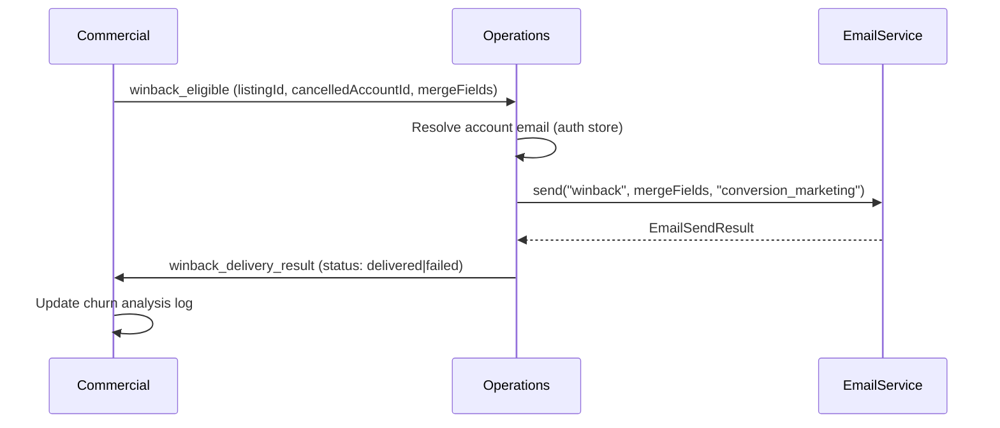
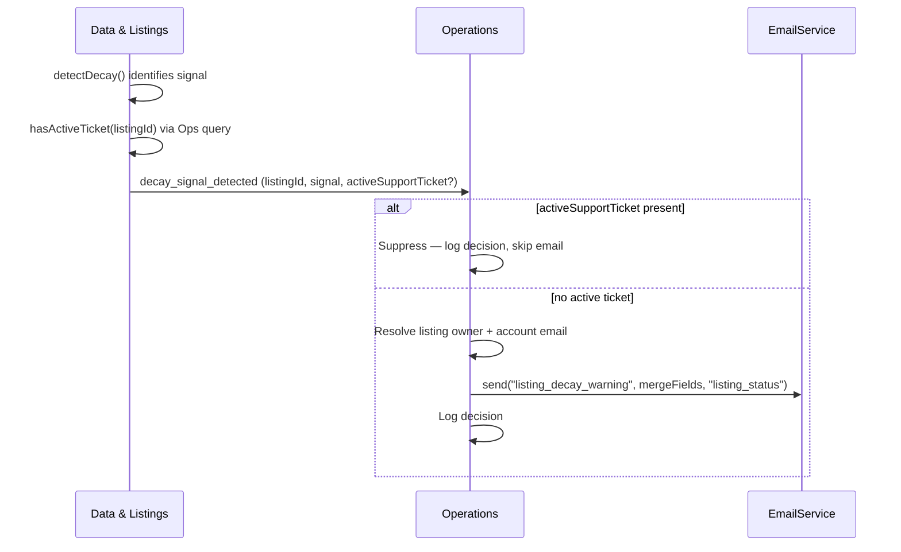

<!-- Part of slice-07-operations v2 -->

# §11 Win-Back & Decay Warning Email Delivery

---

Two backend-only email delivery handlers triggered by async event consumers registered in §9. No schema changes — both handlers use existing tables (`support_tickets` for duplicate suppression) and existing service abstractions (`EmailService` from SI §10). No dedicated admin routes — delivery status surfaces in TaskSpec detail views [Source: `01-router-plan.md` §11].

---

## 11.1 Win-Back Email Delivery

Triggered by `winback_eligible` from CR (async consumer, §9). Ops is a delivery conduit: CR evaluates eligibility and constructs merge fields (S8), Ops resolves the recipient email address and calls the email service, then emits `winback_delivery_result` so CR can close its feedback loop. [Source: Ops interface spec §7, CR-X-7]

### Payload consumed (P1)

From `WinbackEligibleEvent` [Source: CR §1.3]:

| Field | Type | Usage |
|-------|------|-------|
| `listingId` | `UUID` | Carried through to `winback_delivery_result` |
| `cancelledAccountId` | `UUID` | Account email lookup + carried through to `winback_delivery_result` as `accountId` [OPS-ST-13] |
| `mergeFields` | `{ subject, body, listingName, enquiryCount?, viewCount? }` | Passed to `EmailService.send()` as template data |

### Handler pseudocode

```
handleWinbackEligible(event: WinbackEligibleEvent):
  // 1. Resolve account email — justified P1 exception [Ops §7, XI-6]
  //    Email is PII that does not belong in event payloads.
  //    Single-row auth table read, not a cross-domain query.
  account = getAccount(event.cancelledAccountId)
  if !account?.email:
    emit("winback_delivery_result", {
      listingId: event.listingId,
      accountId: event.cancelledAccountId,
      status: "failed",
      timestamp: now(),
    })
    return

  // 2. Send via EmailService [P4: import from SI §10]
  //    EmailService checks unsubscribe preferences for "conversion_marketing"
  //    category — if unsubscribed, returns { status: "suppressed" } [SI §5.1]
  try:
    result = EmailService.send({
      to: account.email,
      template: "winback",                    // SI §5.2 — Commercial Conversion category
      data: event.mergeFields,
      category: "conversion_marketing",
      accountId: event.cancelledAccountId,
    })

    deliveryStatus = match result.status:
      "sent" | "queued" → "delivered"
      "suppressed"      → "failed"            // unsubscribed — still report as failed to CR
      "failed"          → "failed"

  catch error:
    log.error("winback_email_send_failed", { listingId: event.listingId, error })
    deliveryStatus = "failed"

  // 3. Emit result for CR feedback loop [Source: Ops §1.3]
  emit("winback_delivery_result", {
    listingId: event.listingId,
    accountId: event.cancelledAccountId,      // [OPS-ST-13]: carried through, not looked up
    status: deliveryStatus,
    timestamp: now(),
  })
```

**`winback_delivery_result` event type:** `{ listingId: UUID, accountId: UUID, status: "delivered" | "bounced" | "failed", timestamp: ISO8601 }`. Authoritative in Ops interface spec §1.3. CR consumes this async to update its churn analysis log with actual delivery status [CR-X-7].

**No retry:** CR's win-back scheduler owns retry eligibility. If the email fails, Ops reports `"failed"` — CR decides whether to re-evaluate or abandon. Ops does not re-attempt delivery.

**Template:** `winback` (SI §5.2, Commercial Conversion category, unsubscribable). Merge fields provided by CR: `subject`, `body`, `listingName`, optional `enquiryCount`/`viewCount` for engagement-triggered win-backs. [Source: CR-ST-5]

---

## 11.2 Decay Warning Email Delivery

Triggered by `decay_signal_detected` from D&L (async consumer, §9). Ops suppresses duplicate outreach when the provider already has an active support ticket, then sends a decay warning email for the remaining cases. [Source: Ops concept design §4, X-6]

### Payload consumed (P1)

From `DecaySignalDetectedEvent` [Source: D&L §1.7]:

| Field | Type | Usage |
|-------|------|-------|
| `listingId` | `UUID` | Active ticket suppression check + email context |
| `signal.severity` | `"low" \| "medium" \| "high" \| "critical"` | Passed to template as merge field |
| `activeSupportTicket` | `UUID \| undefined` | Primary suppression signal — if present, skip email |

**Missing `accountId`:** The `DecaySignalDetectedEvent` payload does not carry `accountId`. To send the email, the handler must resolve the listing's owning account. This is a second justified DB read beyond the auth table email lookup — a listing→account join. At V1 scale this is a single indexed read (`listings.accountId` WHERE `id = listingId`). If the listing is unclaimed (`accountId` is null), no email is sent.

### Handler pseudocode

```
handleDecaySignalDetected(event: DecaySignalDetectedEvent):
  // 1. Suppression check: activeSupportTicket in payload [X-6]
  //    D&L annotates the event via hasActiveTicket() before emission.
  //    If present, the provider is already engaged with support — skip email.
  if event.activeSupportTicket:
    logDecision({
      domain: "operations",
      decisionType: "support_triage",
      inputs: { listingId: event.listingId, signalSeverity: event.signal.severity },
      output: { action: "decay_warning_suppressed", reason: "active_support_ticket",
                ticketId: event.activeSupportTicket },
    })
    return

  // 2. Resolve listing owner
  listing = getListing(event.listingId)       // single indexed read
  if !listing?.accountId:
    // Unclaimed listing — no recipient for the warning email
    return

  // 3. Resolve account email — same P1 exception as win-back [XI-6]
  account = getAccount(listing.accountId)
  if !account?.email:
    return

  // 4. Send via EmailService [P4: import from SI §10]
  try:
    EmailService.send({
      to: account.email,
      template: "listing_decay_warning",      // SI §5.2 — Operations Compliance category
      data: {
        listingId: event.listingId,
        signalType: event.signal.type,
        signalSeverity: event.signal.severity,
        listingName: listing.name,            // included for provider context
      },
      category: "listing_status",
      accountId: listing.accountId,
    })
  catch error:
    log.error("decay_warning_email_failed", { listingId: event.listingId, error })

  // 5. Decision log [SI §9]
  logDecision({
    domain: "operations",
    decisionType: "support_triage",
    inputs: { listingId: event.listingId, signalSeverity: event.signal.severity },
    output: { action: "decay_warning_sent", recipientAccountId: listing.accountId },
  })
```

**Suppression rationale [X-6]:** Sending a "your listing needs updating" email while the provider has an open support ticket creates a poor experience. The `activeSupportTicket` field in the event payload provides the suppression signal without requiring Ops to query its own `support_tickets` table — D&L already called `hasActiveTicket(listingId)` before emission. This is the correct suppression path: the event producer annotates, the consumer branches on the annotation.

**Template:** `listing_decay_warning` (SI §5.2, Operations Compliance category, unsubscribable). S4-ST-9 confirmed ownership as S7. Merge fields constructed by the handler: `listingId`, `signalType`, `signalSeverity`, `listingName`.

**No `winback_delivery_result` equivalent:** Decay warnings are informational — no downstream consumer tracks their delivery status. Failures are logged via standard application logging, not via event emission.

---

## 11.3 Email Send Failure Handling

Both handlers use try/catch around `EmailService.send()`. Failure semantics differ:

| Handler | On failure | Retry | Event emission | Error destination |
|---------|-----------|-------|----------------|-------------------|
| Win-back | Emit `winback_delivery_result` with `status: "failed"` | None — CR owns retry eligibility | Yes (`winback_delivery_result`) | Application log |
| Decay warning | Log error, continue | None — decay warnings are advisory | No event emission | Application log |

Email send errors do NOT write to `event_consumer_errors`. The consumer itself succeeded — it received the event, processed it, and attempted the email. The email service failure is a downstream service error, not a consumer processing failure. The consumer's try/catch prevents the error from propagating to the event bus error handler.

---

## 11.4 Upstream Context

**Win-back delivery** resolves the Ops leg of the CR→Ops win-back pipeline:



CR evaluates eligibility at 60 days post-cancellation via `win_back_evaluation` deferred action (S8). Ops delivers the email (S7). CR closes the feedback loop by consuming `winback_delivery_result` [CR-X-7].

**Decay warning delivery** resolves S4-ST-9 (decay warning email ownership confirmed as S7):



D&L detects decay (S9). D&L annotates the event with active ticket status via `hasActiveTicket()` query (Ops §3.1). Ops delivers the warning or suppresses it (S7).

---

## 11.5 Acceptance Criteria

| # | Criterion |
|---|-----------|
| AC-11.1 | `winback_eligible` consumer resolves account email from `cancelledAccountId` via auth data store and calls `EmailService.send("winback", ...)` with CR-provided `mergeFields` |
| AC-11.2 | `winback_delivery_result` emitted after every `winback_eligible` processing — `status: "delivered"` on success, `status: "failed"` on email failure or missing account |
| AC-11.3 | `winback_delivery_result.accountId` carries through `cancelledAccountId` from the triggering event (not looked up separately) [OPS-ST-13] |
| AC-11.4 | `decay_signal_detected` consumer skips email send when `activeSupportTicket` is present in the event payload [X-6] |
| AC-11.5 | Suppressed decay warnings produce a decision log entry with `action: "decay_warning_suppressed"` and the `ticketId` |
| AC-11.6 | Decay warning handler resolves listing owner via `listings.accountId` — skips email for unclaimed listings (`accountId` is null) |
| AC-11.7 | Decay warning email includes `signalType`, `signalSeverity`, and `listingName` as template merge fields |
| AC-11.7a | Decay warning email uses `category: "listing_status"` — `EmailService` suppresses send if account has unsubscribed from this category [S7-ST-2] |
| AC-11.8 | Email send failures in both handlers are caught via try/catch and do NOT propagate to `event_consumer_errors` |
| AC-11.9 | Win-back email uses `category: "conversion_marketing"` — `EmailService` suppresses send if account has unsubscribed from this category [SI §5.1] |
| AC-11.10 | Suppressed win-back (unsubscribed account) emits `winback_delivery_result` with `status: "failed"` — CR still receives the feedback |
