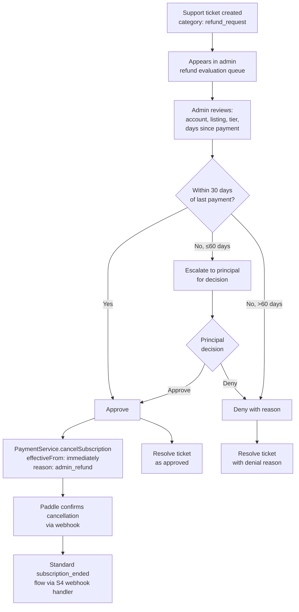

<!-- Part of slice-07-operations v2 -->

# §13 Refund Processing

---

Refund processing is a support-ticket-driven admin workflow. Refund requests arrive as support tickets with `category = "refund_request"`, admin evaluates against the 30-day policy, and approved refunds trigger Paddle cancellation via `PaymentService.cancelSubscription` with `effectiveFrom: "immediately"` [P4 import from SI §10.1]. Paddle handles the actual refund — CALLSHEET does not process payments directly. The cancellation triggers a Paddle webhook that flows through the standard `subscription_ended` path (S4).

## 13.1 Refund Request Lifecycle



**Refund policy (entity decision architecture):**
- Within 30 days of last payment: approve. The entity honours refund requests without friction within this window.
- 31–60 days: escalate to principal. The entity does not have autonomous authority to approve refunds beyond the 30-day window.
- Beyond 60 days: deny. Document the reason in the decision log.

These thresholds are the entity's standing policy. The principal can override in either direction. The admin UI enforces nothing — it provides the policy as guidance text. The `admin.refunds.evaluate` mutation accepts any decision.

## 13.2 Refund Evaluation Route

Two routes. Signatures and types in router plan §3.10 — referenced, not restated.

**`admin.refunds.list`** — queries `support_tickets` with `category = "refund_request"`. Joins `accounts` for email and `listings` for name and subscription tier. The `status` filter maps to ticket status: `"pending"` = tickets with `status = "open"`, `"approved"` = resolved tickets where the decision log records `decision: "approve"`, `"denied"` = resolved tickets where the decision log records `decision: "deny"`.

```
admin.refunds.list({ status, cursor }):
  // Base query: support tickets with refund category
  query = db.select({
      ticketId: supportTickets.id,
      accountEmail: accounts.email,
      listingName: listings.name,
      subscriptionTier: listings.subscriptionTier,
      requestedAt: supportTickets.createdAt,
    })
    .from(supportTickets)
    .leftJoin(accounts, eq(supportTickets.accountId, accounts.id))
    .leftJoin(listings, eq(supportTickets.listingId, listings.id))
    .where(eq(supportTickets.category, "refund_request"))

  // Status filter
  if status === "pending":
    query = query.where(eq(supportTickets.status, "open"))
  else if status === "approved":
    query = query.where(eq(supportTickets.status, "resolved"))
    // Post-filter: only tickets with approve decision log (or store decision on ticket)
  else if status === "denied":
    query = query.where(eq(supportTickets.status, "resolved"))
    // Post-filter: only tickets with deny decision log

  return paginate(query, cursor)
```

**Implementation note:** At V1 scale (~5 refund requests/month), post-filtering resolved tickets against the decision log is acceptable. If refund volume grows, add a `refundDecision` column to `support_tickets` to avoid the join.

**`admin.refunds.evaluate`** — the core mutation. Approval triggers Paddle cancellation; denial resolves the ticket without API calls.

```
admin.refunds.evaluate({ ticketId, decision, reason }):
  ticket = db.select()
    .from(supportTickets)
    .where(
      and(
        eq(supportTickets.id, ticketId),
        eq(supportTickets.category, "refund_request"),
      )
    )
    .limit(1)

  if ticket == null:
    throw TRPCError({ code: "NOT_FOUND", message: "Refund ticket not found" })

  if ticket.status !== "open":
    throw TRPCError({ code: "BAD_REQUEST", message: "Ticket already resolved" })

  if decision === "approve":
    // Look up active subscription for the listing
    listing = db.select()
      .from(listings)
      .where(eq(listings.id, ticket.listingId))
      .limit(1)

    if listing == null || listing.paddleSubscriptionId == null:
      throw TRPCError({ code: "BAD_REQUEST", message: "No active subscription for listing" })

    // Create pending_cancellation record BEFORE calling Paddle.
    // Paddle may webhook immediately — the record must exist for attribution.
    db.insert(pendingCancellations).values({
      paddleSubscriptionId: listing.paddleSubscriptionId,
      listingId: listing.id,
      reason: "voluntary",  // Refund-initiated cancellation attributed as voluntary
    })

    // Cancel via Paddle API — P4 import from SI §10.1
    PaymentService.cancelSubscription({
      paddleSubscriptionId: listing.paddleSubscriptionId,
      reason: "admin_refund: " + reason,
      effectiveFrom: "immediately",
    })
    // Paddle webhook → mapPaddleWebhook → subscription_cancelled → subscription_ended
    // Normal S4 flow handles downstream consumers (PP feature downgrade, CR churn log, etc.)

  // Resolve ticket regardless of decision
  db.update(supportTickets)
    .set({
      status: "resolved",
      resolvedAt: now(),
    })
    .where(eq(supportTickets.id, ticketId))

  // Cancel SLA breach warning if one was scheduled [D1 — router plan §3.2]
  cancelAction("sla_breach_warning", { ticketId })

  // Decision log [SI §9]
  logDecision({
    domain: "operations",
    decisionType: "refund_evaluation",
    inputs: {
      ticketId,
      listingId: ticket.listingId,
      subscriptionTier: listing?.subscriptionTier,
      daysSincePayment: computeDaysSinceLastPayment(listing),
    },
    output: {
      decision,
      reason,
      evaluatedBy: ctx.session.accountId,
    },
    entityContext: {
      accountId: ticket.accountId,
      listingId: ticket.listingId,
    },
  })
```

**Pending cancellation record:** The approval path creates a `pending_cancellations` record with `reason: "voluntary"` before calling `PaymentService.cancelSubscription`. This ensures the Paddle webhook handler (S4) can attribute the `subscription_ended` event correctly via `inferCancellationReason` [CR §4.5, Ops §5]. The reason is `"voluntary"` (not `"paddle_reconciliation"`) because the refund was an explicit admin action, not a reconciliation discovery.

**No direct `subscription_ended` emission:** The refund approval path does NOT emit `subscription_ended` directly. It delegates to Paddle via `cancelSubscription`, and the resulting Paddle webhook triggers the standard emission path through S4's webhook handler. This avoids duplicate emissions and ensures all downstream consumers (PP, CR) receive the event through the established channel.

## 13.3 Upstream Flag Resolution: S4-8

S4-8 flagged: "Refund processing UI — S7 admin interface for evaluating and executing refunds via Paddle API."

**Resolved.** §13 implements:
- Admin refund queue at `/admin/billing/refunds` listing open refund request tickets with account, listing, and tier context
- Evaluate mutation with approve/deny paths
- Approval calls `PaymentService.cancelSubscription` with `effectiveFrom: "immediately"` [P4]
- Denial resolves ticket without Paddle API call
- Decision log entry per evaluation [SI §9]
- 30-day policy guidance surfaced in admin UI (not enforced — admin and principal retain override authority)

## 13.4 Acceptance Criteria

| # | Criterion |
|---|-----------|
| S7-AC-RF-1 | `admin.refunds.list` returns support tickets with `category = "refund_request"`, joined with account email, listing name, and subscription tier |
| S7-AC-RF-2 | `admin.refunds.evaluate` with `decision: "approve"` creates `pending_cancellations` record and calls `PaymentService.cancelSubscription({ effectiveFrom: "immediately" })` [P4] |
| S7-AC-RF-3 | `admin.refunds.evaluate` with `decision: "deny"` resolves ticket without calling Paddle API |
| S7-AC-RF-4 | Both approve and deny paths resolve the ticket (`status = "resolved"`, `resolvedAt = now()`) and cancel any `sla_breach_warning` deferred action |
| S7-AC-RF-5 | Every refund evaluation produces a `decision_logs` entry with `decisionType: "refund_evaluation"`, including ticket ID, decision, reason, and admin identity [SI §9] |
| S7-AC-RF-6 | Approval path does NOT emit `subscription_ended` directly — Paddle webhook triggers the standard S4 emission path |
| S7-AC-RF-7 | Approval path creates `pending_cancellations` record with `reason: "voluntary"` BEFORE calling `PaymentService.cancelSubscription` (webhook may arrive immediately) |
| S7-AC-RF-8 | Evaluate mutation rejects tickets that are not `status: "open"` (idempotency guard) |
| S7-AC-RF-9 | Evaluate mutation rejects tickets with no active subscription on the associated listing |

---

## Cross-References

| Document | Relationship |
|----------|-------------|
| `shared-infrastructure.md` (v6) | §9 decision logging (`refund_evaluation`), §10.1 `PaymentService.cancelSubscription` (P4 import) |
| `operations.md` (v3 interface) | §1.2 `subscription_ended` (downstream from Paddle webhook after refund cancellation), §5 pending cancellation registry |
| `commercial-and-revenue.md` (v3) | §4.5 `subscription_cancelled` → `subscription_ended` mapping, `inferCancellationReason` (uses `pending_cancellations` record) |
| `01-schema.md` | §2.1 `support_tickets` (refund tickets), §2.4 `pending_cancellations` (attribution record) |
| `01-router-plan.md` | §3.10 `admin.refunds.*` (2 routes, type definitions) |
| `01-decisions.md` | D1 (SLA breach warning cancellation on ticket resolve) |
| `slices/slice-04-subscriptions.md` (v2) | S4-8 upstream flag, Paddle webhook handler, `subscription_ended` emission path |
