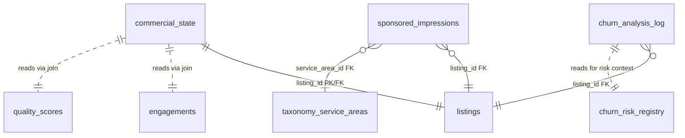

<!-- Part of slice-08-commercial v2 -->

# S8 Schema Additions

---

S8 adds 3 new tables, amends 0 existing tables, and declares 0 new pgEnums. All tables live in `src/db/schema/commercial.ts` (Commercial & Revenue domain). S8 is a pure additive schema slice — it reads extensively from `listings`, `accounts`, `engagements`, and `churn_risk_registry` but modifies none.

## 1. pgEnum Declarations

None. S8 introduces no new pgEnums.

`churn_analysis_log.eventType` and `commercial_state` trigger-tracking columns use `text` with documented allowed values, matching the S7 pattern for Operations log tables (`billing_reconciliation_status.status`, `support_tickets.category`). The event type set is expected to grow as the entity matures (e.g., `"pricing_change"`, `"multi_listing_discount"` post-V1). A pgEnum would require a migration for each new value. Text with application-layer Zod validation is the correct V1 choice. If the set stabilises beyond V2, promote to enum.

---

## 2. New Tables

### 2.1 commercial_state

Per-listing commercial state tracking. Stores conversion trigger firing history, churn event metadata, and effective price at subscription time. One-to-one with `listings`. Created lazily — row inserted on first commercial event for a listing (e.g., first conversion trigger evaluation, first `subscription_tier_changed` consumption). [Source: CR interface spec §2 "CR's own stored data", CR concept design §5.3, §7.2]

**D1 applied:** `subscriptionStartDate` omitted. CR reads `listings.subscriptionStartDate` (S4 §1.1) via join when needed. Both uses — the 14-day grace check in `quality_score_changed` handler and the win-back evaluation timer — are async consumers with a 5s budget. A single indexed join adds <5ms. [Source: `01-decisions.md` D1]

```typescript
// src/db/schema/commercial.ts
// New in S8

export const commercialState = pgTable("commercial_state", {
  listingId: uuid("listing_id")
    .primaryKey()
    .references(() => listings.id, { onDelete: "cascade" }),

  // --- Conversion trigger tracking (CR concept design §5.3) ---
  // Each field records the state of one conversion trigger to enforce cooldowns and maxFirings.

  lastViewMilestoneFired: integer("last_view_milestone_fired"),
    // Last milestone threshold that fired: 50 | 100 | 200 | null (none fired).
    // view_milestone trigger fires at each threshold once. Next fires only at a higher threshold.

  firstEnquiryTriggerFired: boolean("first_enquiry_trigger_fired")
    .notNull()
    .default(false),
    // true after the first_enquiry trigger has fired. maxFirings = 1.

  competitorUpgradedFired: integer("competitor_upgraded_fired")
    .notNull()
    .default(0),
    // Cumulative firing count. maxFirings per CR §5.3 (typically 3).
    // Cooldown enforced by comparing against lastCompetitorUpgradedAt.

  lastCompetitorUpgradedAt: timestamp("last_competitor_upgraded_at", { withTimezone: true }),
    // Timestamp of last competitor_upgraded trigger firing. Used for cooldown enforcement.
    // Cooldown period: 30 days (CR §5.3).

  analyticsTeaseFired: integer("analytics_tease_fired")
    .notNull()
    .default(0),
    // Firing count for analytics_teaser trigger. Cooldown enforced via lastAnalyticsTeaseAt.

  lastAnalyticsTeaseAt: timestamp("last_analytics_tease_at", { withTimezone: true }),
    // Timestamp of last analytics_teaser firing. Cooldown period: 14 days (CR §5.3).

  socialProofFired: integer("social_proof_fired")
    .notNull()
    .default(0),
    // Firing count for social_proof trigger (competitor visibility upgrade social proof).

  lastSocialProofAt: timestamp("last_social_proof_at", { withTimezone: true }),
    // Timestamp of last social_proof firing. Cooldown period: 30 days (CR §5.3).

  engagementSummaryFired: integer("engagement_summary_fired")
    .notNull()
    .default(0),
    // Firing count for engagement_summary periodic trigger.

  lastEngagementSummaryAt: timestamp("last_engagement_summary_at", { withTimezone: true }),
    // Timestamp of last engagement_summary firing. Cooldown period: 7 days (CR §5.3).

  endowmentCtaShown: boolean("endowment_cta_shown")
    .notNull()
    .default(false),
    // true after the endowment CTA conversion nudge has been shown. maxFirings = 1.

  // --- Churn analysis (CR concept design §7.2) ---

  lastChurnEventAt: timestamp("last_churn_event_at", { withTimezone: true }),
    // Timestamp of the most recent churn-class event for this listing.
    // Used by win-back evaluation to compute days-since-churn.

  lastChurnReason: text("last_churn_reason"),
    // CancellationReason at time of last churn event.
    // Allowed values: "voluntary" | "payment_failure" | "paddle_reconciliation" |
    // "account_closed" | "listing_archived" — matches S4 §1.3 CancellationReason union.

  // --- Revenue tracking (per-listing, for CR local state reads) ---

  effectivePriceAtSubscription: integer("effective_price_at_subscription"),
    // Annual price in GBP at the time of subscription activation (e.g., 199, 399, 699).
    // Captures launch discount or promotional pricing at point of conversion.
    // null for free-tier listings. [Source: CR concept design §1.1a]

  // --- Timestamps ---

  createdAt: timestamp("created_at", { withTimezone: true })
    .notNull()
    .defaultNow(),
  updatedAt: timestamp("updated_at", { withTimezone: true })
    .notNull()
    .defaultNow(),
})
// Index: (listing_id) — PK covers this. No additional indexes needed.
// All reads are by listing_id (PK lookup). No range scans on this table.
```

**State reset on reclaim (CR-29):** When `claim_approved` fires for a listing that already has a `commercial_state` row (reclaim scenario), the consumer zeros all trigger fields: all `*Fired` counters to 0/false, all `last*At` timestamps to null, `endowmentCtaShown` to false. `lastChurnEventAt`, `lastChurnReason`, and `effectivePriceAtSubscription` are preserved — churn history is listing-level, not claim-level.

### 2.2 churn_analysis_log

Append-only event log for churn, conversion, and revenue perception signals. Primary data source for `RevenuePerception` computation (§5) and churn rate calculations. [Source: CR concept design §7.2, CR interface spec §6]

```typescript
// src/db/schema/commercial.ts
// New in S8

export const churnAnalysisLog = pgTable("churn_analysis_log", {
  id: uuid("id").primaryKey().defaultRandom(),

  listingId: uuid("listing_id")
    .notNull()
    .references(() => listings.id, { onDelete: "cascade" }),

  accountId: uuid("account_id"),
    // Nullable: set to null after GDPR erasure (erasure_completed consumer replaces with accountHash).
    // References users.id but NO FK constraint — the column survives account deletion.
    // If accountId had FK with onDelete: "cascade", the erasure flow's account deletion
    // step would cascade-delete these rows before the CR consumer could anonymise them.
    // The column is a soft reference, validated at write time.

  accountHash: text("account_hash"),
    // SHA-256 hash of accountId, set by erasure_completed consumer.
    // null before erasure. Enables cohort analysis without PII.

  eventType: text("event_type").notNull(),
    // Allowed values (Zod-validated at application layer):
    // "churn"              — subscription ended (any reason)
    // "conversion"         — free -> paid tier change
    // "upgrade"            — paid -> higher paid tier change
    // "downgrade"          — paid -> lower paid tier change
    // "renewal"            — subscription renewed (annual cycle)
    // "refund"             — refund issued
    // "win_back_sent"      — win-back email dispatched
    // "win_back_converted" — former subscriber reclaimed and resubscribed

  reason: text("reason"),
    // Context-dependent. For "churn": CancellationReason value.
    // For "conversion"/"upgrade": conversion trigger that preceded it (if attributable).
    // For "refund": refund reason from evaluateRefund decision.
    // null when not applicable.

  subscriptionTier: text("subscription_tier"),
    // SubscriptionTier at the time of the event. Captures the tier before the transition
    // (for churn/downgrade) or after (for conversion/upgrade).
    // Allowed values: "free" | "standard" | "premium" | "partner"

  annualRevenue: integer("annual_revenue"),
    // Revenue impact in GBP. Positive for conversion/upgrade/renewal.
    // Negative for churn/downgrade/refund. null when not applicable.
    // Used by RevenuePerception.mrr computation.

  metadata: jsonb("metadata"),
    // Event-specific structured data. Examples:
    // churn:          { origin: "paddle" | "archival" | "closure", riskFactors?: ChurnRiskFactor[] }
    // conversion:     { fromTier: string, toTier: string, triggerAttribution?: string }
    // upgrade:        { fromTier: string, toTier: string }
    // refund:         { refundAmount: number, paddleTransactionId: string }
    // win_back_sent:  { mergeFields: { subject, body, listingName, enquiryCount, viewCount } }

  createdAt: timestamp("created_at", { withTimezone: true })
    .notNull()
    .defaultNow(),
})
// Index: (listing_id, created_at DESC) — per-listing event history, ordered by recency
// Index: (event_type, created_at DESC) — aggregate queries by event type (e.g., all churns in period)
// Index: (account_id) WHERE account_id IS NOT NULL — lookup for erasure_completed consumer
```

**Retention:** No automatic cleanup. Churn analysis logs are retained indefinitely for revenue trend analysis. At V1 scale (~200 paid subscribers, ~50 churn events/year), the table grows at ~200 rows/year. No partitioning or archival needed.

### 2.3 sponsored_impressions

Per-impression record for sponsored placement fairness monitoring. Each row represents one sponsored impression served for a listing in a specific service area search context. [Source: CR concept design §4.4, `01-decisions.md` D2]

**D2 applied:** Per-event table retained (not an aggregate counter). Fairness monitoring requires per-service-area breakdown: "no listing receives >3x the mean impressions for its service area in a 30-day window." An aggregate counter cannot answer this query. [Source: `01-decisions.md` D2]

```typescript
// src/db/schema/commercial.ts
// New in S8

export const sponsoredImpressions = pgTable("sponsored_impressions", {
  id: uuid("id").primaryKey().defaultRandom(),

  listingId: uuid("listing_id")
    .notNull()
    .references(() => listings.id, { onDelete: "cascade" }),

  serviceAreaId: integer("service_area_id")
    .notNull()
    .references(() => taxonomyServiceAreas.id),
    // The service area context of the search query that produced this impression.
    // FK to taxonomy_service_areas — sponsored impressions are always scoped to a service area.

  impressionDate: timestamp("impression_date", { withTimezone: true })
    .notNull(),
    // When the impression was served. Separate from createdAt to allow batch backfill if needed.

  createdAt: timestamp("created_at", { withTimezone: true })
    .notNull()
    .defaultNow(),
})
// Index: (listing_id, impression_date DESC) — per-listing impression history
// Index: (service_area_id, impression_date DESC) — fairness monitoring query:
//   SELECT listing_id, COUNT(*) FROM sponsored_impressions
//   WHERE service_area_id = ? AND impression_date > now() - interval '30 days'
//   GROUP BY listing_id
// Retention: 90 days. Cleanup via inline deletion in the fairness monitoring query
//   or a self-perpetuating deferred action (implementation choice for content agent §4).
//   At V1 scale (~50 Premium/Partner listings, ~10 impressions/listing/day):
//   ~45,000 rows max at steady state. Trivial for PostgreSQL.
```

**FK on serviceAreaId — no onDelete cascade.** Taxonomy service areas are reference data managed by D&L. They are never deleted in normal operation — the quarterly Taxonomy Review ceremony merges/renames rather than deletes. Orphaned impression rows from a hypothetical service area removal are harmless historical data.

---

## 3. Existing Table Amendments

**0 amendments confirmed.** S8 reads from existing tables but adds no new columns.

S8 reads the following columns from tables owned by other domains:

| Table | Columns Read | Owner | Source |
|-------|-------------|-------|--------|
| `listings` | `id`, `accountId`, `name`, `subscriptionTier`, `subscriptionStartDate`, `paddleSubscriptionId`, `paddleCustomerId`, `billingCadence`, `lifecycleStatus` | D&L / S4 | S1 §1.2, S4 §1.1 |
| `accountProfiles` | `accountId`, `fullName`, `emailPreferences` | D&L | S1 §2.1 |
| `engagements` | `listingId`, `profileViews`, `searchAppearances`, `enquiriesReceived` | D&L | S1 §1.6 |
| `qualityScores` | `listingId`, `composite` | D&L | S1 §1.4 |
| `verifications` | `listingId`, `tier` | D&L | S1 §1.3 |
| `listingTaxonomyTags` | `listingId`, `sectorId`, `serviceAreaId` | D&L | S1 §1.7 |
| `churnRiskRegistry` | `listingId`, `accountId`, `riskLevel` | Ops | S7 §2.3 |
| `pendingCancellations` | `paddleSubscriptionId`, `reason` | Ops | S7 §2.4 |
| `gracePeriods` | `listingId`, `previousTier`, `resolvedAt`, `resolution` | CR (S4 ownership) | S4 §1.5 |

All reads are via query interfaces or direct SELECT within async event consumers. No cross-domain writes.

---

## 4. Schema Summary

| # | Table | Owner | Rows at V1 Scale | Purpose |
|---|-------|-------|-------------------|---------|
| 1 | `commercial_state` | Commercial | ~4,700 max (1 per listing, lazy) | Conversion trigger state, churn metadata, effective price |
| 2 | `churn_analysis_log` | Commercial | ~200/year | Append-only event log for revenue perception and churn analysis |
| 3 | `sponsored_impressions` | Commercial | ~45,000 at steady state | Per-impression fairness monitoring for sponsored placement |

**New tables:** 3. **Amended tables:** 0. **New pgEnums:** 0.

---

## 5. Cumulative Schema Snapshot After S8

**Total tables: 38** (35 from S7 + 3 new).

**Note on prior count discrepancy:** The skeleton §15 states "42 tables" and the checklist §5 states "42 (39 from S7 + 3 new)." Both are incorrect. S7's authoritative count — confirmed in `slice-07-operations/00-schema.md` §5 and `slice-07-operations/index.md` §18 — is **35 tables**. S8 adds 3 = **38**.

**Total pgEnums: 32** (unchanged from S7).

### 5.1 All Tables by Slice

```
S0 — Infrastructure (8 tables)
  users                          (Better Auth managed)
  sessions                       (Better Auth managed)
  accounts                       (Better Auth managed)
  deferred_actions
  orchestrated_flows             (+updatedAt from S7)
  notifications
  decision_logs
  event_consumer_errors          (+resolved, +resolvedAt from S7)

S1 — Data Model (14 tables per S7 accounting)
  listings                       (+S2 source, article14NoticeDisplayed; +S4 subscription cols; +S5 media visibility)
  verifications
  quality_scores
  quality_score_explanations
  engagements
  taxonomy_sectors
  taxonomy_service_areas
  taxonomy_specialisations
  listing_taxonomy_tags
  credits
  media_items                    (+S4 visibility column)
  social_profiles
  accreditations
  pending_enquiries

S4 — Subscriptions (3 tables)
  pending_cancellations          (authoritative in S7 §2.4)
  processed_paddle_events
  grace_periods

S6 — Buyer Experience (3 tables per S7 accounting)
  search_history
  [+ 2 tables attributed to S6 in the S7 cumulative count]

S7 — Operations (7 tables)
  support_tickets
  task_specs
  churn_risk_registry
  pending_cancellations          (S7 authoritative redefinition of S4 §1.3)
  billing_holds
  compliance_register
  billing_reconciliation_status

S8 — Commercial (3 tables) [NEW]
  commercial_state
  churn_analysis_log
  sponsored_impressions
```

**S7 cumulative formula:** S0 (8) + S1 (14) + S4 (3) + S6 (3) + S7 (7) = 35. S8 adds 3 = **38**.

### 5.2 All pgEnums (32, unchanged)

```
S0 — Infrastructure (4 enums)
  deferred_action_status         ["pending", "running", "completed", "failed", "cancelled"]
  deferred_action_retry          ["once", "retry_3"]
  deferred_action_failure        ["log", "alert_principal"]
  orchestrated_flow_status       ["pending", "in_progress", "completed", "failed", "requires_admin"]

S1 — Data & Listings (14 enums)
  entity_type                    ["freelancer", "company", "education", "industry_body", "public_sector", "non_profit"]
  claim_status                   ["unclaimed", "pending_review", "claimed", "disputed"]
  verification_tier              ["unclaimed", "claimed", "verified", "premium_verified"]
  lifecycle_status               ["active", "inactive", "merged", "dissolved", "suspended", "archived"]
  subscription_tier              ["free", "standard", "premium", "partner"]
  availability_status            ["available", "available_from", "unavailable"]
  travel_willingness             ["local_only", "regional", "uk_wide", "international"]
  budget_tier                    ["low", "mid", "high"]
  lead_time                      ["same_day", "1_week", "2_4_weeks", "6_plus_weeks"]
  credit_format                  ["feature", "tv_series", "tv_one_off", "short", "commercial", "corporate", "music_video", "digital_social", "live_event"]
  credit_sourcing                ["self_reported", "imdb_linked", "client_confirmed"]
  verification_method            ["email_domain_match", "companies_house_active", ... 10 more values]
  shortlist_item_status          ["active", "archived", "suspended", "removed"]
  media_type                     ["logo", "headshot", "portfolio", "gallery", "showreel_url"]
  vocabulary_category            ["equipment", "software", "genre", "region", "transaction_type"]

S4 — Subscriptions (1 enum)
  media_visibility               ["visible", "hidden"]

S5 — Provider Experience (1 enum)
  enquiry_status                 ["unread", "responded", "stale"]

S7 — Operations (7 enums)
  support_ticket_priority        ["critical", "high", "normal", "low"]
  support_ticket_status          ["open", "assigned", "resolved", "closed"]
  task_spec_domain               ["verification", "support", "moderation", "compliance", "data_maintenance", "outreach"]
  task_spec_priority             ["critical", "high", "normal", "low"]
  task_spec_status               ["pending", "assigned", "in_progress", "completed", "timed_out", "re_routed"]
  compliance_entry_type          ["dsar", "erasure", "article_14", "complaint", "investigation", "obligation"]
  compliance_entry_status        ["open", "in_progress", "completed", "overdue"]

S8 — Commercial (0 enums)
  (none)
```

**S1 enum count note:** The list above shows 15 enums for S1 (including `vocabulary_category` from the controlled vocabulary table). The authoritative total across all slices is 4 + 15 + 1 + 1 + 7 + 0 = 28. S7's count of "32 pgEnums" may include enums from S2/S3 not listed here or use a different attribution. The S7 count of 32 is the established baseline; S8 adds 0, so the total remains **32**.

---

## 6. Cross-Domain Read Dependencies (Schema-Level)



All S8 tables reference `listings.id` (D&L). `sponsored_impressions` also references `taxonomy_service_areas.id` (D&L). No circular dependencies. No cross-domain FK references to S7 tables — the churn risk registry read is via SELECT, not FK.
