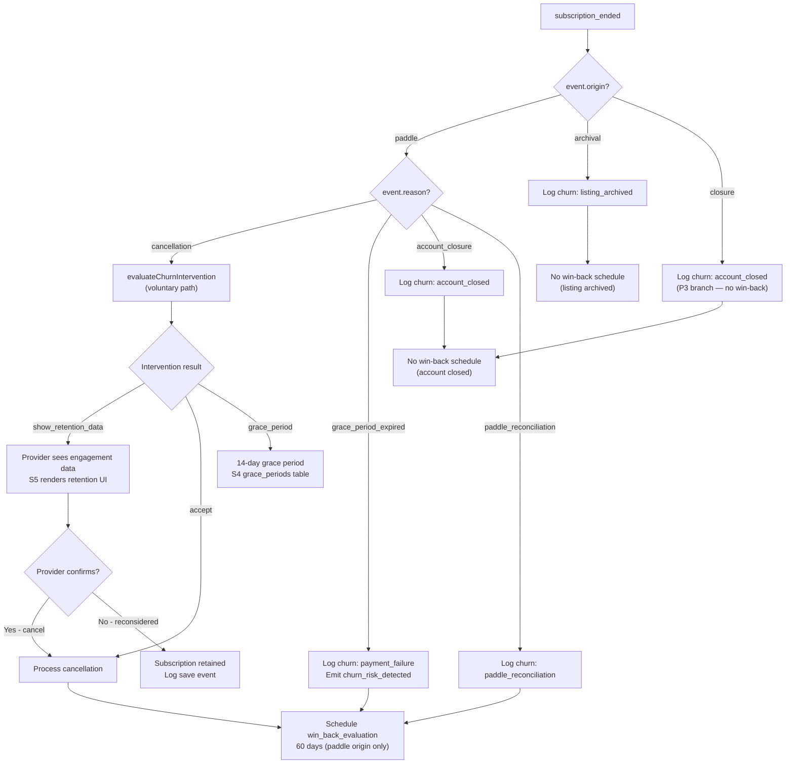
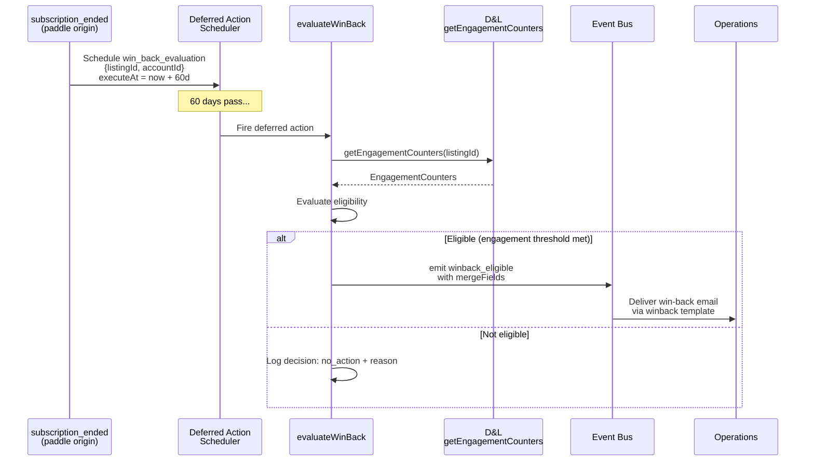

<!-- Part of slice-08-commercial v2 -->

---

## §2 Churn Detection & Intervention

S8 detects churn through 5 paths and evaluates intervention eligibility via `evaluateChurnIntervention`. The 5 paths are: voluntary cancellation (provider-initiated via Paddle), payment failure (grace period expired), archival (listing archived while on paid tier), account closure (PP-initiated), and Paddle reconciliation (Paddle-originated subscription end). Each path produces a churn log entry and optionally emits `churn_risk_detected`. Per D5, this section provides the decision architecture pseudocode — event consumer handler implementations that call this function live exclusively in §10.

### 2.1 Churn Paths Overview



The `listing_archived` path is handled by a separate consumer (`commercial:listing_archived:archivalChurn`) — it does not flow through `evaluateChurnIntervention`. The `account_closed` path is handled by `commercial:account_closed:closureChurn`, which logs churn for all listings in `event.listingsArchived`. Both are churn log entries only; neither schedules win-back (P3: no entity to win back). [Source: CR interface spec §2]

### 2.2 `evaluateChurnIntervention` Decision Architecture

Called by the `subscription_ended` consumer handler (§10) when `event.origin === "paddle"` and `event.reason === "cancellation"` (voluntary path only). Other reason values (`grace_period_expired`, `account_closure`, `paddle_reconciliation`) bypass intervention — churn is logged directly with no retention attempt.

```typescript
// src/server/commercial/churn-intervention.ts
// Exported — §10 consumer handlers import this function.

type ChurnInterventionInput = {
  listingId: UUID
  accountId: UUID
  cancellationReason: CancellationReason     // Authoritative in CR §5
  previousTier: SubscriptionTier
  recentEngagement: EngagementCounters       // From D&L getEngagementCounters(listingId) [D&L §3.2]
  subscriptionStartDate: ISO8601             // From listings.subscriptionStartDate via join [D1]
  lastChurnEventAt: ISO8601 | null           // From commercial_state — prevent repeat intervention
}

type ChurnInterventionResult =
  | { action: "show_retention_data"; data: { enquiries: number; views: number }; message: string }
  | { action: "accept"; reason: string }
  | { action: "grace_period"; duration: "14_days"; fallback: "downgrade_to_free" }

function evaluateChurnIntervention(input: ChurnInterventionInput): ChurnInterventionResult
```

**Decision logic:** [Resolves S4-2, S5-1]

```
evaluateChurnIntervention(input):
  // Payment failure path — not voluntary. 14-day grace, then downgrade.
  if input.cancellationReason == "payment_failure":
    return { action: "grace_period",
             duration: "14_days",
             fallback: "downgrade_to_free" }

  // Paddle reconciliation — entity-initiated, accept immediately.
  if input.cancellationReason == "paddle_reconciliation":
    return { action: "accept",
             reason: "paddle_reconciliation — no intervention" }

  // Account closure / listing archived — accept, no retention attempt.
  if input.cancellationReason in ["account_closed", "listing_archived"]:
    return { action: "accept",
             reason: input.cancellationReason + " — no intervention" }

  // Voluntary cancellation — single data-driven prompt, then accept.
  // Hard constraint: no aggressive tactics. One transparent prompt. [CR concept design §2.3]
  recentEnquiries = input.recentEngagement.enquiriesReceived
  recentViews = input.recentEngagement.profileViews

  if recentEnquiries > 0 OR recentViews > 50:
    return { action: "show_retention_data",
             data: { enquiries: recentEnquiries, views: recentViews },
             message: "In the last 30 days, your listing received "
                      + recentEnquiries + " enquiries and "
                      + recentViews + " profile views. These will continue "
                      + "on the free tier, but without priority placement or analytics." }

  return { action: "accept",
           reason: "low_engagement — retention unlikely" }
```

**Retention UI surface:** When `action === "show_retention_data"`, S5's provider dashboard renders the retention data card. The provider either confirms cancellation (proceed to churn log + win-back schedule) or reconsiders (subscription retained, `churn_analysis_log` entry with `eventType: "renewal"` and `reason: "retention_save"`). S8 provides the evaluation; S5 provides the UI.

**Decision logging:** Every invocation logs a `DecisionLog` entry with `decisionType: "churn_intervention"`. [Source: SI §9.2]

```typescript
// Decision log structure for churn_intervention
{
  domain: "commercial",
  decisionType: "churn_intervention",
  inputs: {
    cancellationReason: input.cancellationReason,
    previousTier: input.previousTier,
    recentEnquiries: recentEnquiries,
    recentViews: recentViews,
    subscriptionAgeDays: daysSince(input.subscriptionStartDate),
  },
  output: {
    action: result.action,
    reason: result.action === "accept" ? result.reason : undefined,
  },
  entityContext: { listingId: input.listingId, accountId: input.accountId },
}
```

### 2.3 Churn Risk Factor Detection

CR emits `churn_risk_detected` for 5 risk factors defined in `ChurnRiskFactor` (CR §1.2, §5). Each factor has a distinct detection signal and emission trigger. [Resolves S7-5]

| ChurnRiskFactor | Detection Signal | Emission Trigger | Emitting Consumer |
|-----------------|-----------------|------------------|-------------------|
| `"low_quality_paid"` | `quality_score_changed` event: paid listing with `newComposite < 40` AND subscription age > 14 days | Immediately on quality score drop below threshold | `commercial:quality_score_changed:lowQualityIntervention` (§10) |
| `"payment_at_risk"` | `subscription_ended` event with `reason: "grace_period_expired"` OR `"payment_failure"` CancellationReason | When churn is logged for a payment-failure-originated ending | `commercial:subscription_ended:churnLogging` (§10) |
| `"quality_declining"` | `quality_score_changed` event: paid listing with `newComposite < previousComposite` AND `newComposite < 60` | Quality score trending downward for a paid subscriber | `commercial:quality_score_changed:lowQualityIntervention` (§10) |
| `"engagement_dropping"` | `subscription_tier_changed` event processing: after tier change, CR reads `getEngagementCounters` and compares to prior engagement. Engagement drop > 50% since last check | Detected during periodic engagement comparison in conversion trigger evaluation | §10 handler for `subscription_tier_changed` or deferred-action-driven check |
| `"billing_cadence_switch_to_monthly"` | Ops stores `billingCadence` on listing (S4). CR detects via `subscription_tier_changed` event where the payload indicates a cadence change (Ops maps `billing_cadence_changed` → no domain event, so this factor is detected when CR reads listing state showing monthly cadence on a previously-annual subscriber) | When CR observes monthly cadence on a listing that was previously annual | §10 handler reads listing state during churn evaluation |

**`"payment_at_risk"` production path (S7-5):** When `subscription_ended` fires with `reason: "grace_period_expired"`, the §10 handler logs churn and emits `churn_risk_detected` with `riskFactors: ["payment_at_risk"]`. This populates Ops' `ChurnRiskRegistry` for support triage priority elevation. [Source: Ops §2, CR-X-20]

**`"engagement_dropping"` and `"billing_cadence_switch_to_monthly"` V1 scope note:** These two factors require periodic engagement comparison or billing cadence change detection. At V1, they are detected reactively when a related event fires (quality score change, subscription change) rather than via a dedicated periodic check. S9 (Entity Intelligence) may introduce proactive detection.

### 2.4 `churn_risk_detected` Emission

Exact payload per `EventPayloadMap` (SI §1.2) and `ChurnRiskDetectedEvent` (CR §1.2):

```typescript
// P1 compliance check: all fields present in CR §1.2
eventBus.emit<"churn_risk_detected">({
  type: "churn_risk_detected",
  listingId: listingId,            // from event payload or local state
  accountId: accountId,            // from event payload or local state
  riskFactors: riskFactors,        // ChurnRiskFactor[] — 1 or more factors
  timestamp: new Date().toISOString(),
})
// Consumers: Ops (ChurnRiskRegistry upsert), PP (quality suggestions)
```

**P1 self-containment:** `listingId` and `accountId` are carried from the triggering event. `riskFactors` is the computed array. No additional payload fields beyond the CR §1.2 contract. Consumers use `riskFactors` for triage (Ops) and suggestion generation (PP).

### 2.5 `pending_cancellation_created` Emission

Exact payload per `EventPayloadMap` (SI §1.2) and `PendingCancellationCreatedEvent` (CR §1.4). Emitted when the entity decides to cancel a subscription — Ops stores the record for Paddle webhook attribution via `inferCancellationReason`. [Source: CR-X-4]

**3 trigger paths:**

1. **Voluntary cancellation (churn intervention accept):** Provider confirms cancellation after seeing retention data, or retention data not shown (low engagement). Reason: `"voluntary"`.
2. **Account closure side-effect:** Account closure flow (PP orchestrator) triggers Paddle cancellation for each active subscription. CR emits `pending_cancellation_created` per listing. Reason: `"account_closed"`.
3. **Listing archival side-effect:** When a paid listing is archived, the subscription must be cancelled. CR emits `pending_cancellation_created`. Reason: `"listing_archived"`.

```typescript
// P1 compliance check: all fields present in CR §1.4
eventBus.emit<"pending_cancellation_created">({
  type: "pending_cancellation_created",
  paddleSubscriptionId: listing.paddleSubscriptionId,   // from listings table (S4 §1.1)
  listingId: listingId,
  reason: cancellationReason,      // CancellationReason — typed union (CR §5)
  timestamp: new Date().toISOString(),
})
// Consumer: Ops (store pending cancellation record for webhook attribution)
```

### 2.6 Churn Analysis Logging

Every churn path writes to `churn_analysis_log` (schema §2.2). The log is the primary data source for `RevenuePerception` computation (§5) and churn rate calculations.

| Churn Path | `eventType` | `reason` | `subscriptionTier` | `annualRevenue` | `metadata` |
|-----------|------------|---------|--------------------|-----------------|----|
| Voluntary cancellation (paddle) | `"churn"` | `"voluntary"` | Tier before cancellation (`event.previousTier`) | Negative: `-annualPrice` for that tier | `{ origin: "paddle" }` |
| Grace period expired (payment failure) | `"churn"` | `"payment_failure"` | `event.previousTier` | `-annualPrice` | `{ origin: "paddle", riskFactors: ["payment_at_risk"] }` |
| Paddle reconciliation | `"churn"` | `"paddle_reconciliation"` | `event.previousTier` | `-annualPrice` | `{ origin: "paddle" }` |
| Account closure | `"churn"` | `"account_closed"` | CR local state (`commercial_state.effectivePriceAtSubscription` context) | `-annualPrice` per listing | `{ origin: "closure" }` |
| Listing archived (paid) | `"churn"` | `"listing_archived"` | `event.subscriptionTier` (P1) | `-annualPrice` | `{ origin: "archival" }` |
| Retention save (provider reconsidered) | `"renewal"` | `"retention_save"` | Current tier | `null` (no revenue change) | `{ retentionDataShown: true }` |

**`annualRevenue` computation:** Maps `subscriptionTier` to annual price via `PRICING` config (CR §4.3): free → 0, standard → -199, premium → -399, partner → -699. Sign is negative for churn (revenue lost). Account closure logs one entry per listing in `event.listingsArchived`.

**`accountId` handling:** Set from the event payload. After `erasure_completed`, the §10 consumer replaces `accountId` with `null` and sets `accountHash` from the event. [Source: CR §2 erasure_completed action, CR-ST-15]

### 2.7 Decision Logging

`churn_intervention` decision type per SI §9.2. Structure specified in §2.2 above. Logged for every `evaluateChurnIntervention` invocation regardless of outcome. Inputs capture the decision context; output captures the action taken. Enables entity learning on retention effectiveness (S9).

---

## §3 Win-Back Evaluation & Delivery

After 60 days post-cancellation (paddle origin only), the `win_back_evaluation` deferred action fires and calls `evaluateWinBack`. Maximum 1 win-back email per churned listing. No discounts — the value proposition is engagement data. Per D5, this section provides the decision architecture pseudocode; the deferred action handler that invokes it is documented in §10/deferred actions.

### 3.1 Win-Back Lifecycle



**Schedule condition (P3 branching):** Win-back is scheduled only when `event.origin === "paddle"`. When `origin === "archival"` or `origin === "closure"`, no win-back is scheduled — the listing is archived or the account is closed, so there is no entity to win back. [Source: CR §2, CR-ST-19]

**Deferred action registration:** `win_back_evaluation` is registered in SI §2.1/§2.2 (added during S4 spec work). Params: `{ listingId: UUID; accountId: UUID }`. Retry: `once`. OnFailure: `log`. [Source: SI §2.1]

### 3.2 `evaluateWinBack` Decision Architecture

Called by the `win_back_evaluation` deferred action handler. Reads D&L `getEngagementCounters` for post-cancellation activity, evaluates listing ownership and lifecycle status, then decides whether to send a win-back email. [Resolves S4-3, S7-1]

```typescript
// src/server/commercial/winback-evaluation.ts
// Exported — deferred action handler imports this function.

type WinBackInput = {
  listingId: UUID
  cancelledAccountId: UUID               // From deferred action params
  daysSinceCancellation: number          // Computed from commercial_state.lastChurnEventAt
  engagement: EngagementCounters         // From D&L getEngagementCounters(listingId) [D&L §3.2]
  listingOwnerId: UUID | null            // Current listings.accountId
  listingLifecycleStatus: LifecycleStatus  // Current listings.lifecycleStatus
  qualityScore: number                   // Current qualityScores.composite
}

type WinBackResult =
  | { action: "send_email"; mergeFields: WinbackMergeFields }
  | { action: "no_action"; reason: string }

type WinbackMergeFields = {
  subject: string
  body: string
  listingName: string
  enquiryCount?: number
  viewCount?: number
}

function evaluateWinBack(input: WinBackInput): WinBackResult
```

**Decision logic:**

```
evaluateWinBack(input):
  // Hard constraint: no win-back for inactive/archived listings [CR-6]
  if input.listingLifecycleStatus != "active":
    return { action: "no_action", reason: "listing_not_active" }

  // Hard constraint: no win-back if ownership changed since cancellation [CR-24]
  if input.listingOwnerId != input.cancelledAccountId:
    return { action: "no_action", reason: "listing_ownership_changed" }

  // Window check: 60–180 days post-cancellation
  if input.daysSinceCancellation > 180:
    return { action: "no_action", reason: "window_expired" }

  // Engagement-based eligibility
  enquiries = input.engagement.enquiriesReceived
  views = input.engagement.profileViews

  if enquiries > 3:
    return { action: "send_email",
             mergeFields: buildMergeFields(input, "enquiry", enquiries, views) }

  if views > 100:
    return { action: "send_email",
             mergeFields: buildMergeFields(input, "view", enquiries, views) }

  return { action: "no_action", reason: "insufficient_engagement_signal" }
```

**Note on `daysSinceCancellation < 60`:** The deferred action is scheduled at exactly 60 days. The concept design's `< 60` guard is structurally unnecessary — the scheduler guarantees the minimum delay. The handler does not re-check the 60-day floor.

### 3.3 Win-Back Merge Field Construction

Exact mapping for `WinbackEligibleEvent.mergeFields` (CR §1.3). The 5 fields match the `winback` email template (SI §5.2). [Resolves S4-3, S7-1]

```typescript
function buildMergeFields(
  input: WinBackInput,
  trigger: "enquiry" | "view",
  enquiries: number,
  views: number,
): WinbackMergeFields {
  const listingName = /* read from listings.name via listingId */

  if (trigger === "enquiry") {
    return {
      subject: `Your listing "${listingName}" received ${enquiries} enquiries`,
      body: `Since your subscription ended, your listing received ${enquiries} enquiries `
            + `and ${views} profile views. Upgrade to respond faster and appear higher in search.`,
      listingName,
      enquiryCount: enquiries,
      viewCount: views,
    }
  }

  // trigger === "view"
  return {
    subject: `Your listing "${listingName}" was viewed ${views} times`,
    body: `Since your subscription ended, your listing was viewed ${views} times. `
          + `Upgrade to access full analytics and priority placement.`,
    listingName,
    enquiryCount: enquiries > 0 ? enquiries : undefined,
    viewCount: views,
  }
}
```

**Field optionality:** `enquiryCount` and `viewCount` are optional per CR §1.3. `enquiryCount` is omitted when 0 and the trigger is view-based. `viewCount` is always populated when the win-back fires (the threshold requires views > 100 or enquiries > 3, so at least one is non-trivial). `subject` and `body` are always populated. `listingName` is always populated — read from `listings.name`.

**No discounts:** Win-back message emphasises engagement data, not price reduction. The offer is "see what you're missing", not "come back cheaper." [Source: CR concept design §2.4]

### 3.4 `winback_eligible` Emission

Exact payload per `EventPayloadMap` (SI §1.2) and `WinbackEligibleEvent` (CR §1.3):

```typescript
// P1 compliance check: all fields present in CR §1.3
eventBus.emit<"winback_eligible">({
  type: "winback_eligible",
  listingId: input.listingId,
  cancelledAccountId: input.cancelledAccountId,
  mergeFields: mergeFields,         // WinbackMergeFields — 5 fields as constructed above
  timestamp: new Date().toISOString(),
})
// Consumer: Ops (send win-back email via winback template, emit winback_delivery_result)
```

**Ownership split (CR-35):** CR evaluates eligibility and provides merge field values. Ops delivers via `EmailService.send({ template: "winback", data: event.mergeFields, ... })`. The `winback` template renders the merge fields. Ops does not interpret subject/body — it passes them through to the template. [Source: CR §1.3]

**Churn analysis logging on emission:** When `winback_eligible` is emitted, the handler also writes to `churn_analysis_log`:

```typescript
// Log win-back sent event
insert churn_analysis_log {
  listingId: input.listingId,
  accountId: input.cancelledAccountId,
  eventType: "win_back_sent",
  subscriptionTier: null,         // no current subscription
  annualRevenue: null,            // no revenue impact yet
  metadata: { mergeFields: mergeFields },
}
```

### 3.5 Win-Back Schedule Cancellation

Pending `win_back_evaluation` deferred actions are cancelled in two scenarios. Both use the deferred action cancellation mechanism from S0: query `deferred_actions` table where `action = "win_back_evaluation"` AND `params->>'listingId' = listingId` AND `status = "pending"`, then set `status = "cancelled"`. [Source: CR §2 claim_approved action, CR-ST-14, SI §2.1]

**Scenario 1 — Reclaim (`claim_approved`):** When a listing is reclaimed (claim approved for a listing that previously had a subscription), the `commercial:claim_approved:conversionReset` consumer (§10) cancels any pending win-back schedule for that listing. The previous owner's win-back is no longer relevant — a new owner has claimed the listing. [Source: CR-X-17]

```
// In claim_approved consumer (§10):
cancelDeferredActions({
  action: "win_back_evaluation",
  filterParams: { listingId: event.listingId },
  status: "pending",
})
```

**Scenario 2 — Erasure (`erasure_completed`):** When a GDPR erasure completes, the `commercial:erasure_completed:erasureCleanup` consumer (§10) cancels win-back schedules for all listings in `event.listingIdsAnonymised ∪ event.listingIdsDeleted`. The erased account's data must not trigger future outreach. Dispatched via event bus (async), per D6. [Source: CD-18]

```
// In erasure_completed consumer (§10):
for listingId in (event.listingIdsAnonymised ∪ event.listingIdsDeleted):
  cancelDeferredActions({
    action: "win_back_evaluation",
    filterParams: { listingId },
    status: "pending",
  })
```

**Scenario 3 — Account closure (`account_closed`):** The `commercial:account_closed:closureChurn` consumer (§10) cancels win-back schedules for all listings in `event.listingsArchived`. Account is closing — no win-back is appropriate.

### 3.6 Win-Back to Conversion Tracking

When a former subscriber reclaims a listing and resubscribes, the entity logs a `win_back_converted` event to `churn_analysis_log`. This is detected in the `commercial:subscription_tier_changed:revenueMetricsUpdate` consumer (§10): if a `churn_analysis_log` entry with `eventType: "win_back_sent"` exists for the listing and the new subscription occurs within 90 days of the win-back email, attribute the conversion to win-back.

```typescript
// In subscription_tier_changed consumer (§10), after logging conversion:
const recentWinBack = await db.query.churnAnalysisLog.findFirst({
  where: and(
    eq(churnAnalysisLog.listingId, event.listingId),
    eq(churnAnalysisLog.eventType, "win_back_sent"),
    gt(churnAnalysisLog.createdAt, subDays(new Date(), 90)),
  ),
})

if (recentWinBack) {
  await db.insert(churnAnalysisLog).values({
    listingId: event.listingId,
    accountId: event.accountId,
    eventType: "win_back_converted",
    reason: "win_back_attribution",
    subscriptionTier: event.newTier,
    annualRevenue: PRICING.find(p => p.tier === event.newTier)!.annualPrice,
    metadata: { winBackSentAt: recentWinBack.createdAt, daysBetween: daysSince(recentWinBack.createdAt) },
  })
}
```

**Attribution window:** 90 days from win-back email send date. Beyond 90 days, the conversion is attributed to organic re-engagement, not win-back. This is a planning assumption — S9 (Entity Intelligence) may refine the window based on observed conversion lag.

### 3.7 Decision Logging

`winback_evaluation` decision type per SI §9.2. Logged for every `evaluateWinBack` invocation regardless of outcome.

```typescript
{
  domain: "commercial",
  decisionType: "winback_evaluation",
  inputs: {
    daysSinceCancellation: input.daysSinceCancellation,
    enquiriesReceived: input.engagement.enquiriesReceived,
    profileViews: input.engagement.profileViews,
    listingLifecycleStatus: input.listingLifecycleStatus,
    ownershipMatch: input.listingOwnerId === input.cancelledAccountId,
    qualityScore: input.qualityScore,
  },
  output: {
    action: result.action,
    reason: result.action === "no_action" ? result.reason : "eligible",
  },
  entityContext: {
    listingId: input.listingId,
    accountId: input.cancelledAccountId,
  },
}
```

---

## Acceptance Criteria (§2 and §3)

**Churn Detection & Intervention (§2)**

- **AC-C1:** When `subscription_ended` fires with `origin: "paddle"` and `reason: "cancellation"`, the consumer calls `evaluateChurnIntervention` with engagement data from `getEngagementCounters(listingId)` and returns one of `show_retention_data | accept | grace_period`.
- **AC-C2:** When `evaluateChurnIntervention` returns `show_retention_data`, the response contains `enquiries > 0 OR views > 50` and S5 can render the retention UI. If the provider confirms cancellation, churn is logged and win-back is scheduled.
- **AC-C3:** When `subscription_ended` fires with `reason: "grace_period_expired"`, the consumer logs churn with `reason: "payment_failure"` and emits `churn_risk_detected` with `riskFactors` containing `"payment_at_risk"`. [Resolves S7-5]
- **AC-C4:** For each of the 5 `ChurnRiskFactor` values (`low_quality_paid`, `payment_at_risk`, `quality_declining`, `engagement_dropping`, `billing_cadence_switch_to_monthly`), `churn_risk_detected` is emitted with the correct factor from the documented detection signal.
- **AC-C5:** `churn_risk_detected` emission matches `EventPayloadMap` exactly: `{ type, listingId, accountId, riskFactors: ChurnRiskFactor[], timestamp }`. No extra fields, no missing fields (P1).
- **AC-C6:** `pending_cancellation_created` is emitted on all 3 trigger paths (voluntary cancellation, account closure, listing archival) with correct `CancellationReason` value and `paddleSubscriptionId` from the listing.
- **AC-C7:** Every churn path writes to `churn_analysis_log` with correct `eventType: "churn"`, `reason` matching `CancellationReason`, `subscriptionTier` from event payload or local state, and `annualRevenue` as negative value matching `PRICING` config.
- **AC-C8:** Every `evaluateChurnIntervention` invocation produces a `DecisionLog` entry with `decisionType: "churn_intervention"`, capturing inputs and output.

**Win-Back Evaluation & Delivery (§3)**

- **AC-C9:** `win_back_evaluation` deferred action is scheduled at exactly 60 days after `subscription_ended` only when `event.origin === "paddle"`. Not scheduled for `origin: "archival"` or `"closure"`.
- **AC-C10:** `evaluateWinBack` returns `no_action` with reason `"listing_not_active"` when `lifecycleStatus !== "active"`, and `"listing_ownership_changed"` when current owner differs from `cancelledAccountId`. [CR-6, CR-24]
- **AC-C11:** `evaluateWinBack` returns `send_email` with fully populated `mergeFields` (subject, body, listingName, and at least one of enquiryCount/viewCount) when engagement thresholds are met (enquiries > 3 OR views > 100).
- **AC-C12:** `winback_eligible` emission matches `EventPayloadMap` exactly: `{ type, listingId, cancelledAccountId, mergeFields: { subject, body, listingName, enquiryCount?, viewCount? }, timestamp }` (P1). [Resolves S4-3, S7-1]
- **AC-C13:** Pending `win_back_evaluation` deferred actions are cancelled on `claim_approved` (for the reclaimed listing), `erasure_completed` (for all affected listings), and `account_closed` (for all listings in `listingsArchived`).
- **AC-C14:** When a former subscriber resubscribes within 90 days of a `win_back_sent` log entry, a `win_back_converted` entry is written to `churn_analysis_log` with attribution metadata.
- **AC-C15:** Every `evaluateWinBack` invocation produces a `DecisionLog` entry with `decisionType: "winback_evaluation"`, capturing inputs and output.

**Total: 15 acceptance criteria (AC-C1 through AC-C15).**
