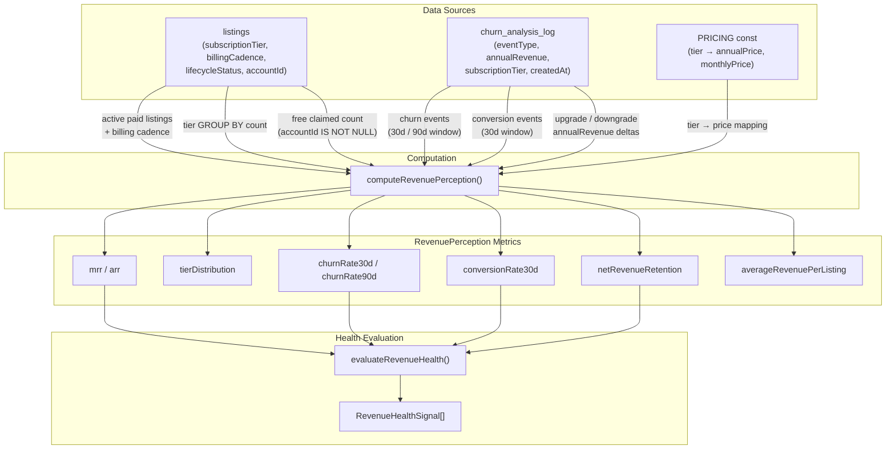

<!-- Part of slice-08-commercial v2 -->

# §5 Revenue Perception & Metrics

---

## 5.1 Overview

Revenue perception is the entity's real-time understanding of its revenue health. [Resolves S4-5] All metrics are computed on-demand from `churn_analysis_log` + aggregate `listings` subscription data via a single `commercial.getRevenuePerception` admin route (CSR, `adminProcedure`). No caching or materialised views at V1 — ~200 paid subscribers makes the aggregate query trivial (<100ms p95). [Source: CR interface spec §6 NFR]

The `RevenuePerception` type captures eight metrics: MRR, ARR, tier distribution, 30-day and 90-day churn rates, 30-day conversion rate, net revenue retention (NRR), and average revenue per listing. `evaluateRevenueHealth` interprets these metrics against thresholds to produce health signals for the admin dashboard.

The concept design `RevenuePerception` type (§6.1) is comprehensive — 20+ fields including LTV, CAC, discount cohort divergence, and per-tier churn breakdown. V1 implements the 8-field subset that can be computed from available data sources without external attribution. The remaining fields are deferred to S9 (Entity Intelligence) where the entity gains richer analytical capabilities.

---

## 5.2 `RevenuePerception` Type

```typescript
// Authoritative definition for V1. Concept design §6.1 defines the full type — this is the V1 subset.
// src/server/commercial/revenue-perception.ts

type RevenuePerception = {
  mrr: number                                    // Monthly Recurring Revenue (GBP)
  arr: number                                    // Annual Recurring Revenue (GBP)
  tierDistribution: Record<SubscriptionTier, number>  // listing count per tier
  churnRate30d: number                           // % churned in last 30 days
  churnRate90d: number                           // % churned in last 90 days
  conversionRate30d: number                      // free→paid conversion rate, last 30 days
  netRevenueRetention: number                    // NRR percentage (rolling 30d)
  averageRevenuePerListing: number               // MRR / paid listing count (GBP)
}
```

This matches the return type of `commercial.getRevenuePerception` [Source: `01-router-plan.md` §2.2]. The admin dashboard revenue panel renders all 8 fields.

---

## 5.3 `computeRevenuePerception` Implementation

```typescript
function computeRevenuePerception(): RevenuePerception
```

On-demand aggregate query. No parameters — computes current-state perception across the entire platform.

### Data Source Queries

```
computeRevenuePerception():

  // --- MRR ---
  // Sum of monthly revenue contribution per active paid listing.
  // Annual subscribers contribute annualPrice / 12.
  // Monthly subscribers contribute monthlyPrice directly.
  // PRICING const provides the mapping: tier → { annualPrice, monthlyPrice }.
  // [Source: CR §4.3 PRICING]

  activePaidListings = SELECT id, subscriptionTier, billingCadence
                       FROM listings
                       WHERE subscriptionTier IN ('standard', 'premium', 'partner')
                       AND lifecycleStatus = 'active'

  mrr = 0
  for listing in activePaidListings:
    tierPricing = PRICING.find(p => p.tier === listing.subscriptionTier)
    if listing.billingCadence === 'monthly':
      mrr += tierPricing.monthlyPrice
    else:
      mrr += tierPricing.annualPrice / 12

  // --- ARR ---
  arr = mrr * 12

  // --- Tier Distribution ---
  tierDistribution = SELECT subscriptionTier, COUNT(*) as count
                     FROM listings
                     WHERE lifecycleStatus = 'active'
                     GROUP BY subscriptionTier
  // Returns Record<SubscriptionTier, number> including free tier.

  // --- Churn Rate (30d and 90d) ---
  // Denominator: paid listings active at start of period.
  // Numerator: churn events logged in churn_analysis_log during period.

  churnRate30d = computeChurnRate(30)
  churnRate90d = computeChurnRate(90)

  // --- Conversion Rate (30d) ---
  // Numerator: "conversion" events in churn_analysis_log in last 30 days.
  // Denominator: free-tier listings with an accountId (claimed free listings)
  //   at start of 30-day window. Unclaimed listings are excluded — they have
  //   no account to convert.

  conversions30d = SELECT COUNT(*)
                   FROM churn_analysis_log
                   WHERE eventType = 'conversion'
                   AND createdAt > now() - interval '30 days'

  freeClaimedAtPeriodStart = SELECT COUNT(*)
                             FROM listings
                             WHERE subscriptionTier = 'free'
                             AND accountId IS NOT NULL
                             AND lifecycleStatus = 'active'
  // Note: this is a point-in-time approximation — it uses current free count,
  // not a snapshot from 30 days ago. Acceptable at V1 scale. S9 may introduce
  // historical snapshots for precise cohort analysis.

  conversionRate30d = freeClaimedAtPeriodStart > 0
    ? (conversions30d / freeClaimedAtPeriodStart) * 100
    : 0

  // --- Net Revenue Retention (NRR) ---
  // Rolling 30d NRR: (startMRR + upgrades - downgrades - churn) / startMRR
  // All values sourced from churn_analysis_log.annualRevenue field.

  startMRR = mrr  // approximation at V1: current MRR as baseline
  // For precise NRR, use churn_analysis_log events in the 30d window:

  upgrades30d = SELECT COALESCE(SUM(annualRevenue), 0)
                FROM churn_analysis_log
                WHERE eventType = 'upgrade'
                AND createdAt > now() - interval '30 days'
  // annualRevenue is positive for upgrades (revenue gained)

  downgrades30d = SELECT COALESCE(SUM(ABS(annualRevenue)), 0)
                  FROM churn_analysis_log
                  WHERE eventType = 'downgrade'
                  AND createdAt > now() - interval '30 days'
  // annualRevenue is negative for downgrades; ABS for subtraction clarity

  churnRevenue30d = SELECT COALESCE(SUM(ABS(annualRevenue)), 0)
                    FROM churn_analysis_log
                    WHERE eventType = 'churn'
                    AND createdAt > now() - interval '30 days'

  // NRR formula: convert annualRevenue deltas to monthly equivalents
  monthlyUpgrades = upgrades30d / 12
  monthlyDowngrades = downgrades30d / 12
  monthlyChurnRevenue = churnRevenue30d / 12

  netRevenueRetention = startMRR > 0
    ? ((startMRR + monthlyUpgrades - monthlyDowngrades - monthlyChurnRevenue) / startMRR) * 100
    : 0
  // Result is a percentage: 100 = no net change, >100 = expansion, <100 = contraction.

  // --- Average Revenue Per Listing ---
  paidCount = activePaidListings.length
  averageRevenuePerListing = paidCount > 0 ? mrr / paidCount : 0

  return { mrr, arr, tierDistribution, churnRate30d, churnRate90d,
           conversionRate30d, netRevenueRetention, averageRevenuePerListing }
```

### Churn Rate Computation

```
computeChurnRate(periodDays: number): number

  churnsInPeriod = SELECT COUNT(*)
                   FROM churn_analysis_log
                   WHERE eventType = 'churn'
                   AND createdAt > now() - interval periodDays days

  // Denominator: paid listings that were active at the start of the period.
  // V1 approximation: current paid count + churns in period = paid at start.
  currentPaid = SELECT COUNT(*)
                FROM listings
                WHERE subscriptionTier IN ('standard', 'premium', 'partner')
                AND lifecycleStatus = 'active'

  paidAtPeriodStart = currentPaid + churnsInPeriod

  return paidAtPeriodStart > 0
    ? (churnsInPeriod / paidAtPeriodStart) * 100
    : 0
  // Result is a percentage.
```

**V1 approximation note:** Both conversion rate and churn rate denominators use current-state counts rather than historical snapshots. At ~200 paid subscribers with <5% monthly churn, the error margin is <10 listings. S9 may introduce point-in-time snapshots via periodic `churn_analysis_log` entries of type `"snapshot"` if precision becomes necessary.

---

## 5.4 `evaluateRevenueHealth` Thresholds

Revenue health evaluation interprets the `RevenuePerception` into actionable signals. V1 thresholds are initial defaults calibrated to the concept design §6.2 decision architecture, simplified to the three-band model (Healthy / Warning / Critical).

```typescript
type RevenueHealthStatus = "healthy" | "warning" | "critical"

type RevenueHealthSignal = {
  metric: string
  status: RevenueHealthStatus
  value: number
  threshold: number
  recommendation: string
}

function evaluateRevenueHealth(perception: RevenuePerception): RevenueHealthSignal[]
```

### Threshold Decision Architecture

```
evaluateRevenueHealth(perception: RevenuePerception): RevenueHealthSignal[]

  signals = []

  // --- Churn Rate (30d) ---
  if perception.churnRate30d > 8:
    signals.push({
      metric: "churnRate30d",
      status: "critical",
      value: perception.churnRate30d,
      threshold: 8,
      recommendation: "Monthly churn >8%. Investigate exit reasons, tier distribution of churners, billing cadence concentration. Escalate to principal."
    })
  else if perception.churnRate30d >= 3:
    signals.push({
      metric: "churnRate30d",
      status: "warning",
      value: perception.churnRate30d,
      threshold: 3,
      recommendation: "Monthly churn 3-8%. Monitor churn-by-tier breakdown and payment failure rate. Review §2 churn intervention effectiveness."
    })
  else:
    signals.push({
      metric: "churnRate30d",
      status: "healthy",
      value: perception.churnRate30d,
      threshold: 3,
      recommendation: "Churn below 3%. No action needed."
    })

  // --- Conversion Rate (30d) ---
  if perception.conversionRate30d > 2:
    signals.push({
      metric: "conversionRate30d",
      status: "healthy",
      value: perception.conversionRate30d,
      threshold: 2,
      recommendation: "Conversion rate above 2%. Conversion triggers functioning."
    })
  else:
    signals.push({
      metric: "conversionRate30d",
      status: "warning",
      value: perception.conversionRate30d,
      threshold: 2,
      recommendation: "Conversion rate below 2%. Review conversion trigger firing rates, analytics teaser engagement, and pricing page visit-to-checkout ratio."
    })

  // --- Net Revenue Retention ---
  if perception.netRevenueRetention < 90:
    signals.push({
      metric: "netRevenueRetention",
      status: "critical",
      value: perception.netRevenueRetention,
      threshold: 90,
      recommendation: "NRR below 90%. Revenue contracting — downgrades and churn exceed expansion. Escalate to principal for strategic review."
    })
  else if perception.netRevenueRetention < 100:
    signals.push({
      metric: "netRevenueRetention",
      status: "warning",
      value: perception.netRevenueRetention,
      threshold: 100,
      recommendation: "NRR between 90-100%. Revenue stable but not expanding. Review upgrade conversion paths and premium feature engagement."
    })
  else:
    signals.push({
      metric: "netRevenueRetention",
      status: "healthy",
      value: perception.netRevenueRetention,
      threshold: 100,
      recommendation: "NRR above 100%. Net revenue expanding from existing base."
    })

  return signals
```

**Threshold tuning:** V1 defaults. After 6 months of data (~Month 7 post-launch), review thresholds against observed distributions. The concept design §6.2 thresholds are more granular (per-tier churn, annual renewal rate, discount cohort divergence) — those require S9 entity intelligence capabilities to evaluate. V1 provides the foundation signals; S9 extends to the full `evaluateRevenueHealth` decision architecture from concept design.

**Decision logging:** Every `evaluateRevenueHealth` invocation writes to the decision log. [Source: SI §9.2, decision type `revenue_health_evaluation`] The logged output includes all signals with their status, enabling trend analysis of health transitions.

---

## 5.5 Multi-Listing Pricing — V1 Stance

V1: no multi-listing discount. Each listing is independently priced per the `PRICING` const. [Source: CR concept design §3.1]

**Rationale:** Multi-listing accounts are projected at <10% of V1 paid base. Per-listing pricing matches Paddle's native model (1 subscription per product) and requires no custom billing logic. The entity learns actual multi-listing demand before designing discounts.

**Deferred implementation path:** The concept design §3.2 specifies `evaluateMultiListingPricing` — a quarterly ceremony that monitors multi-listing behaviour signals:

1. **Secondary listing churn rate** — if >30% of multi-listing accounts churn their secondary listings, price sensitivity is indicated. Recommendation: 15–25% discount on 2nd+ listing.
2. **Support ticket volume** — if >10 tickets reference multi-listing pricing, demand signal is present.
3. **Minimum sample size** — evaluation returns `insufficient_data` until 20+ multi-listing paid accounts exist.

V1 does not implement this evaluation. The `churn_analysis_log` captures all per-listing churn events, and `listings.accountId` enables grouping by account — so the data foundation for V2 multi-listing analysis exists. S9 (Entity Intelligence) is the natural home for the quarterly evaluation ceremony.

---

## 5.6 Data Sources Diagram



---

## 5.7 Acceptance Criteria

| # | Criterion | Verification |
|---|-----------|-------------|
| AC-1 | `computeRevenuePerception` returns MRR calculated as SUM of (annualPrice / 12) for annual subscribers and monthlyPrice for monthly subscribers, using the `PRICING` const for tier-to-price mapping. | Unit test: 3 Standard annual + 1 Premium monthly listings → MRR = (3 × 199/12) + 39 = 88.75. |
| AC-2 | `computeRevenuePerception` returns ARR = MRR × 12. | Unit test: derived from AC-1 MRR. |
| AC-3 | `tierDistribution` returns a `Record<SubscriptionTier, number>` with counts for all 4 tiers (including free), summing to total active listings. | Unit test: 100 free + 10 standard + 5 premium + 2 partner = correct distribution. |
| AC-4 | `churnRate30d` and `churnRate90d` compute as (churns in period / paid at start of period) × 100, where paid-at-start is approximated as current paid + churns in period. Returns 0 when no paid listings exist. | Unit test: 5 churns in 30 days, 95 current paid → churnRate30d = 5%. |
| AC-5 | `conversionRate30d` computes as (conversion events in 30 days / free claimed listings) × 100. Excludes unclaimed listings (accountId IS NULL) from denominator. Returns 0 when no free claimed listings exist. | Unit test: 3 conversions, 150 free claimed → conversionRate30d = 2%. |
| AC-6 | `netRevenueRetention` computes as ((startMRR + monthly upgrades − monthly downgrades − monthly churn revenue) / startMRR) × 100, with annual revenue deltas from `churn_analysis_log` divided by 12. Returns 0 when MRR is 0. | Unit test: MRR 1000, upgrades +2400 annual (+200/mo), downgrades −1200 annual (−100/mo), churn 0 → NRR = 110%. |
| AC-7 | `evaluateRevenueHealth` returns `"critical"` when churnRate30d > 8% or NRR < 90%; `"warning"` when churnRate30d is 3–8%, NRR is 90–100%, or conversionRate30d < 2%; `"healthy"` otherwise. Each metric produces an independent signal. | Unit test: churnRate30d = 10%, NRR = 95% → signals include critical (churn) + warning (NRR). |
| AC-8 | `commercial.getRevenuePerception` route is `adminProcedure` (returns 403 for non-admin sessions). Returns the full `RevenuePerception` type. | Integration test: non-admin call returns 403. Admin call returns all 8 fields with correct types. |

---

## Cross-References

| Document | Relationship |
|----------|-------------|
| `commercial-and-revenue.md` (v4 concept design) §6 | Full `RevenuePerception` type (V1 implements 8-field subset), `evaluateRevenueHealth` thresholds, feature gate friction evaluation |
| `commercial-and-revenue.md` (v3 interface) §6 | NFR: revenue perception update <100ms p95 |
| `commercial-and-revenue.md` (v3 interface) §4.3 | `PRICING` const — tier-to-price mapping |
| `commercial-and-revenue.md` (v4 concept design) §3 | Multi-listing pricing: V1 per-listing, no discount. §3.2 defines V2 evaluation ceremony. |
| `operations.md` (v4 interface) §3.4 | `getFeatureGateFrictionSummary` — consumed by §6 (Feature Gate Friction), not §5. Listed for completeness as friction signals feed concept design §6.3. |
| `platform-and-product.md` (v6 interface) §3.1 | `getListingAnalytics` — not consumed by §5 directly (§5 uses aggregate queries, not per-listing analytics). |
| `s8-drafting/01-schema.md` §2.2 | `churn_analysis_log` table — primary data source for churn/conversion/NRR computation |
| `s8-drafting/01-router-plan.md` §2.2 | `commercial.getRevenuePerception` route specification |
| `s8-drafting/01-decisions.md` D4 | Monthly pricing: £19/£39/£69. Settled. |
