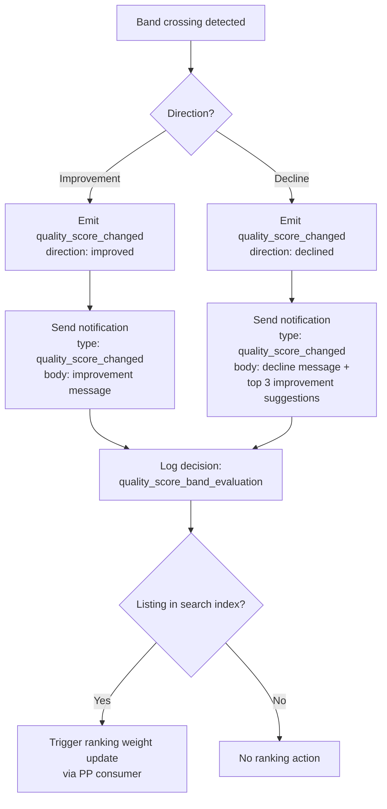

<!-- Part of slice-09-entity-intelligence v2 -->

# Slice 9: Entity Intelligence — Quality Scoring & Data Health

---

## 1.1 `computeQualityScore` Implementation

`computeQualityScore` replaces S1's zero-initialised stubs with calibrated scoring across five additive dimensions. The function is a pure computation — it reads listing state and related data, returns a `QualityScore` [Source: D&L interface §4], and has no side effects. Callers (the `quality_score_recalculation` deferred action handler in §1.2 and the nightly batch) are responsible for persistence and event emission.

**Function signature:**

```typescript
// src/server/intelligence/quality-scoring.ts
function computeQualityScore(listingId: UUID): Promise<QualityScore>
// Returns QualityScore per D&L §4 — authoritative type, not redefined here.
```

**Data loaded by caller before invocation:**

```typescript
type QualityScoreInput = {
  listing: Listing                          // core listing record
  taxonomyTags: TaxonomyTag[]              // listing_taxonomy_tags join
  credits: Credit[]                         // credits table join
  mediaItems: MediaItem[]                   // media_items table join
  socialProfiles: SocialProfile[]           // social_profiles table join
  accreditations: Accreditation[]           // accreditations table join
  verification: Verification                // verifications table join
  engagements: EngagementCounters           // engagements table join
  activeDecaySignals: DecaySignal[]         // decay_signals WHERE resolvedAt IS NULL
}
```

### Dimension 1: Completeness (0–25)

Completeness measures filled profile fields weighted by importance. [Source: D&L CD §3]

```
scoreCompleteness(input: QualityScoreInput): number
  let score = 0

  // Mandatory fields — 3 points each (max 15)
  if input.listing.name:                  score += 3
  if input.listing.description:           score += 3
  if input.listing.location:              score += 3
  if input.taxonomyTags.length >= 1:      score += 3
  if input.credits.length >= 1:           score += 3

  // Important fields — 2 points each (max 6)
  if input.listing.headline:              score += 2
  if input.listing.contactEmail:          score += 2
  if input.listing.websiteUrl:            score += 2

  // Enriching fields — 1 point each (max 4)
  if input.listing.bio:                   score += 1
  if input.listing.phoneNumber:           score += 1
  if input.taxonomyTags.length >= 2:      score += 1
  if input.credits.length >= 3:           score += 1

  return min(score, 25)
```

A listing with no name, no description, no location, no taxonomy tag, and no credit scores 0 completeness.

### Dimension 2: Freshness (0–25)

Freshness decays over time from the most recent edit or engagement event. [Source: D&L CD §3]

```
scoreFreshness(input: QualityScoreInput): number
  const lastEditDays = daysSince(input.listing.lastEditedAt)
  const lastEngagementDays = daysSince(
    max(input.engagements.lastProfileViewAt, input.engagements.lastEnquiryAt) ?? input.listing.createdAt
  )

  // Use the more recent of edit or engagement
  const daysSinceActivity = min(lastEditDays, lastEngagementDays)

  if daysSinceActivity <= 30:     return 25   // maximum freshness
  if daysSinceActivity <= 60:     return 20
  if daysSinceActivity <= 90:     return 13   // halved at 90 days per spec
  if daysSinceActivity <= 120:    return 8
  if daysSinceActivity <= 180:    return 4
  return 2                                     // minimum at 180+ days, floor > 0

  // Unclaimed listing exception [D&L CD §3]:
  // A successful enrichment liveness check resets the freshness clock
  // even for unclaimed listings with no provider activity.
  // The caller (§1.2 handler) updates listing.lastEditedAt on liveness confirmation
  // before invoking computeQualityScore.
```

The step function provides predictable decay. Continuous decay (e.g., exponential) would create floating-point instability in band-crossing evaluations.

### Dimension 3: Accuracy (0–20)

Accuracy combines verification tier contribution with decay signal penalties. [Source: D&L CD §3]

```
scoreAccuracy(input: QualityScoreInput): number
  // Verification tier base
  const tierBase = {
    unclaimed:         0,
    claimed:           5,
    verified:         12,
    premium_verified: 20,
  }[input.verification.tier]

  // Decay signal deductions: -3 per active signal, floor 0
  const deductions = input.activeDecaySignals.length * 3

  return max(tierBase - deductions, 0)
```

An unclaimed listing always scores 0 accuracy regardless of decay signals. A verified listing with 4+ active decay signals drops to 0.

### Dimension 4: Richness (0–15)

Richness rewards media, credits, social links, and accreditations with diminishing returns after 5 items per category. [Source: D&L CD §3]

```
scoreRichness(input: QualityScoreInput): number
  let score = 0

  // Media (photos + videos): 1 point each, max 4
  const mediaCount = input.mediaItems.length
  score += min(mediaCount, 4)

  // Credits: 1 point each, max 4
  const creditCount = input.credits.length
  score += min(creditCount, 4)

  // Social profile links: 1 point each, max 3
  const socialCount = input.socialProfiles.length
  score += min(socialCount, 3)

  // Accreditations: 1 point each, max 2
  const accreditationCount = input.accreditations.length
  score += min(accreditationCount, 2)

  // Perception signal weighting (S6-5): engagement as calibration input.
  // Listings with above-median profile views get +1 richness (cap 15).
  // This is a calibration input, not a direct score component — prevents gaming.
  if input.engagements.profileViews > siteMedianProfileViews():
    score += 1

  // Diminishing returns: 5+ items in any single category adds no further points.
  // Enforced by the min() caps above.

  return min(score, 15)
```

The perception signal weighting (+1 for above-median views) introduces a self-reinforcing loop that is intentionally weak: a single point out of 15 is not gameable. The `siteMedianProfileViews()` value is computed by the §3 analytics pipeline and cached in `perception_aggregates`.

### Dimension 5: Verification (0–15)

Verification is a direct map from verification tier. Separate from Accuracy's verification component because this dimension measures pure tier status, while Accuracy also factors decay signal impact. [Source: D&L CD §3]

```
scoreVerification(input: QualityScoreInput): number
  return {
    unclaimed:         0,
    claimed:           5,
    verified:         10,
    premium_verified: 15,
  }[input.verification.tier]
```

### Composite Score and Band Assignment

```typescript
// Composite computation
const completeness = scoreCompleteness(input)
const freshness = scoreFreshness(input)
const accuracy = scoreAccuracy(input)
const richness = scoreRichness(input)
const verification = scoreVerification(input)
const composite = completeness + freshness + accuracy + richness + verification
// composite range: 0–100

// Band boundaries
type QualityBand = "poor" | "fair" | "good" | "excellent"

function assignBand(composite: number): QualityBand {
  if (composite >= 80) return "excellent"
  if (composite >= 60) return "good"
  if (composite >= 40) return "fair"
  return "poor"
}
```

**After computation:** Set `calculatedBy = "calibrated"` and `algorithmVersion = 1`. Update all 7 columns on the `quality_scores` table: `completeness`, `freshness`, `accuracy`, `richness`, `verification`, `composite`, `lastCalculated`. Also update `quality_score_explanations` with a `QualityScoreExplanation` [Source: D&L §4] containing per-dimension factor breakdowns and `topImprovements` (§1.6).

---

## 1.2 `quality_score_recalculation` Deferred Action Handler

The `quality_score_recalculation` handler is the primary entry point for quality score computation. It is triggered by events (via consumer → `scheduleDeferred`) and by the nightly batch. Handler location: `src/server/actions/intelligence/quality-score-recalculation.ts`.

**Trigger sources:**

| Source | Mechanism | Schedule |
|--------|-----------|----------|
| `profile_edited` event | Consumer schedules `quality_score_recalculation` via `scheduleDeferred` | On event |
| `claim_approved` event | Consumer schedules immediately | On event |
| Enrichment cycle completion | `enrichment_full_cycle` handler schedules after completion | On enrichment |
| Nightly batch | Cron-triggered batch schedules one action per active listing | Daily 02:00 UTC |

**Deferred action registration:** `DeferredActionParamsMap` entry: `quality_score_recalculation: { listingId: UUID }`. Retry: `retry_3`. On failure: `log`. [Source: SI §2.1]

**Handler pseudocode:**

```
handleQualityScoreRecalculation({ listingId }: { listingId: UUID }):
  // 1. Load listing + all related data
  const input = await loadQualityScoreInput(listingId)
  if !input:
    return  // listing may have been deleted/archived between scheduling and execution

  // 2. Load previous score for comparison
  const previousRow = await db.select().from(qualityScores).where(eq(qualityScores.listingId, listingId))
  const previousScore = previousRow?.composite ?? 0
  const previousBand = assignBand(previousScore)

  // 3. Compute new score
  const newScore = computeQualityScore(input)
  const newBand = assignBand(newScore.composite)

  // 4. Persist to quality_scores table
  await db.update(qualityScores)
    .set({
      completeness: newScore.completeness,
      freshness: newScore.freshness,
      accuracy: newScore.accuracy,
      richness: newScore.richness,
      verification: newScore.verification,
      composite: newScore.composite,
      lastCalculated: now(),
      calculatedBy: "calibrated",
      algorithmVersion: 1,
    })
    .where(eq(qualityScores.listingId, listingId))

  // 5. Update quality_score_explanations
  const explanation = buildExplanation(input, newScore)
  await db.update(qualityScoreExplanations)
    .set({ explanation, updatedAt: now() })
    .where(eq(qualityScoreExplanations.listingId, listingId))

  // 6. Evaluate band crossing
  if previousBand !== newBand:
    await evaluateQualityScoreBand({
      listingId,
      accountId: input.listing.accountId,
      previousScore,
      newScore: newScore.composite,
      previousBand,
      newBand,
      dimensions: newScore,
    })
```

**Nightly batch scheduling:**

```
scheduleNightlyQualityRecalculation():
  const activeListings = await db.select({ id: listings.id })
    .from(listings)
    .where(eq(listings.lifecycleStatus, "active"))

  for (const listing of activeListings):
    await scheduleDeferred("quality_score_recalculation", { listingId: listing.id })
```

The nightly batch ensures all listings — including those with no recent events — receive freshness decay updates. Listings that were already recalculated during the day via event triggers will be recalculated again; this is idempotent and costs only the computation time.

---

## 1.3 `evaluateQualityScoreBand` Decision Architecture

`evaluateQualityScoreBand` executes when a listing's quality score crosses a band boundary (Poor/Fair/Good/Excellent). It logs the decision, emits the `quality_score_changed` event, and triggers notifications. Decision type: `quality_score_band_evaluation` [Source: SI §9.2].



**Decision architecture pseudocode:**

```
evaluateQualityScoreBand(params: {
  listingId: UUID,
  accountId: UUID | null,
  previousScore: number,
  newScore: number,
  previousBand: QualityBand,
  newBand: QualityBand,
  dimensions: QualityScore,
}):
  const direction = params.newBand > params.previousBand ? "improved" : "declined"
  // Band ordering: poor < fair < good < excellent

  // 1. Emit quality_score_changed event — exact payload per D&L §1.8
  emit("quality_score_changed", {
    type: "quality_score_changed",
    listingId: params.listingId,
    previousComposite: params.previousScore,
    newComposite: params.newScore,
    changedDimensions: identifyChangedDimensions(params.dimensions, previousDimensions),
    // changedDimensions: string[] — names of dimensions that changed value
  })

  // 2. Send notification (uses existing quality_score_changed type — D7)
  if params.accountId:
    if direction === "improved":
      await createNotification({
        accountId: params.accountId,
        type: "quality_score_changed",
        body: {
          direction: "improved",
          previousBand: params.previousBand,
          newBand: params.newBand,
          score: params.newScore,
        },
      })
    else:  // declined
      const topImprovements = computeTopImprovements(params.dimensions, 3)
      await createNotification({
        accountId: params.accountId,
        type: "quality_score_changed",
        body: {
          direction: "declined",
          previousBand: params.previousBand,
          newBand: params.newBand,
          score: params.newScore,
          improvements: topImprovements,
        },
      })

  // 3. Log decision via SI §9.2
  await logDecision("quality_score_band_evaluation", {
    listingId: params.listingId,
    accountId: params.accountId,
    previousScore: params.previousScore,
    newScore: params.newScore,
    previousBand: params.previousBand,
    newBand: params.newBand,
    direction,
    algorithmVersion: 1,
  })
```

**`quality_score_changed` event payload:** Conforms to `QualityScoreChangedEvent` [Source: D&L §1.8]. Fields: `listingId`, `previousComposite`, `newComposite`, `changedDimensions`. The event is consumed by PP (ranking recalculation, decay indicator clearance), CR (conversion triggers, low-quality intervention). No new consumers added by S9 — existing consumer registrations handle all downstream effects.

**Notification type reuse (D7):** The existing `quality_score_changed` notification type conveys directionality through the `body` content (`direction: "improved" | "declined"`), not through separate notification types. This avoids type proliferation for what is a single semantic event with two outcome branches.

---

## 1.4 `profile_viewed` P2 Deduplication (S1-8)

`profile_viewed` events require deduplication to prevent inflated engagement counters from repeated views by the same viewer. [Source: S1 §13 flag S1-8]

**Deduplication rule:** Same `viewerAccountId` + same `listingId` within a 1-hour window = single count. Subsequent views within the window are discarded for engagement counting purposes (but still processed for analytics aggregation in §3).

**Implementation:** Database-level deduplication using a time-window check against the `engagements` table. No in-memory cache required — the dedup check is a single indexed query.

```
handleProfileViewedDedup(event: ProfileViewedEvent):
  // Check for duplicate within 1-hour window
  const existingView = await db.select()
    .from(engagements)
    .where(
      and(
        eq(engagements.listingId, event.listingId),
        eq(engagements.lastViewerAccountId, event.viewerAccountId),
        gte(engagements.lastProfileViewAt, subtractHours(now(), 1))
      )
    )
    .limit(1)

  if existingView.length > 0:
    return  // duplicate — skip engagement increment

  // Not a duplicate — increment counter
  await db.update(engagements)
    .set({
      profileViews: sql`profile_views + 1`,
      lastProfileViewAt: now(),
      lastViewerAccountId: event.viewerAccountId,
    })
    .where(eq(engagements.listingId, event.listingId))
```

**Schema note:** The `engagements` table requires a `lastViewerAccountId` column (UUID, nullable) and a `lastProfileViewAt` column (timestamp) for the dedup check. If these are not present in S1's schema, they are added as column amendments in S9's migration. The `lastProfileViewAt` field also feeds into the freshness dimension (§1.1).

**Anonymous viewers:** When `viewerAccountId` is null (unauthenticated user), deduplication uses IP-based hashing via a `viewerHash` field on the event. If neither is available, the view is always counted (no dedup possible). The consumer in §6 handles this branching.

---

## 1.5 `claim_abandonment_check` Deferred Action Handler (S3-7)

The `claim_abandonment_check` handler runs as a daily batch, identifying listings stuck in `pending_review` for more than 90 days and reverting them to `unclaimed`. [Source: S3 §13 flag S3-7]

**Deferred action registration:** `DeferredActionParamsMap` entry: `claim_abandonment_check: Record<string, never>`. Retry: `once`. On failure: `log`. [Source: SI §2.1]

```
handleClaimAbandonmentCheck():
  // Scan for abandoned claims: pending_review > 90 days
  const abandonedListings = await db.select()
    .from(listings)
    .where(
      and(
        eq(listings.claimStatus, "pending_review"),
        lte(listings.claimSubmittedAt, subtractDays(now(), 90))
      )
    )

  let abandonedCount = 0

  for (const listing of abandonedListings):
    // Reset claim status to unclaimed
    await db.update(listings)
      .set({
        claimStatus: "unclaimed",
        accountId: null,
      })
      .where(eq(listings.id, listing.id))

    // Coordinate with S2's pre_claim_snapshot_cleanup
    // Schedule cleanup of the pre-claim snapshot if one exists
    await scheduleDeferred("pre_claim_snapshot_cleanup", { listingId: listing.id })

    // Recalculate quality score (verification dimension drops to unclaimed = 0)
    await scheduleDeferred("quality_score_recalculation", { listingId: listing.id })

    abandonedCount++

  // Log count for operational visibility — no event emission needed (internal D&L housekeeping)
  console.info(`[claim_abandonment_check] Reverted ${abandonedCount} abandoned claims to unclaimed`)

  // Self-perpetuating: schedule next daily run
  await scheduleDeferred("claim_abandonment_check", {}, addDays(now(), 1))
```

**No event emission:** Claim abandonment is internal D&L housekeeping. The reversion to `unclaimed` does not emit `claim_rejected` (no claimant action triggered this) or `listing_archived` (the listing remains active). The quality score recalculation handles downstream effects through the normal scoring pipeline.

---

## 1.6 Profile Strength Meter Wiring (S2-3)

S9 replaces S2's fallback field-presence check with `quality_score_explanations`-driven recommendations. [Source: S2 §8.2 dependency note, S2 §15 flag S2-3]

**S2 fallback pattern (replaced):**

S2 implemented `identifyMissingFieldsFallback` as a direct field-presence check on the listing record because quality scoring algorithms were not yet available. S9 provides the real implementation.

**S9 replacement:**

```
identifyMissingFields(listingId: UUID): MissingField[]
  // Read quality_score_explanations (populated by §1.2 handler)
  const explanation = await db.select()
    .from(qualityScoreExplanations)
    .where(eq(qualityScoreExplanations.listingId, listingId))

  if !explanation || explanation.explanation.composite === 0:
    // Quality score not yet calibrated — use S2 fallback
    return identifyMissingFieldsFallback(listingId)

  // Extract top 3 improvement recommendations from the dimension
  // with the lowest proportional contribution
  return computeTopImprovements(explanation.explanation, 3)
    .map(improvement => ({
      fieldId: improvement.factor,
      displayName: IMPROVEMENT_DISPLAY_MAP[improvement.factor] ?? improvement.factor,
      completenessWeight: improvement.potentialGain,
      estimatedTime: FIELD_TIME_MAP[improvement.factor] ?? "~2 minutes",
    }))
```

**`computeTopImprovements` logic:**

```
computeTopImprovements(explanation: QualityScoreExplanation, count: number): Improvement[]
  // 1. For each dimension, compute gap = maxScore - currentScore
  const gaps = explanation.dimensions.map(dim => ({
    dimension: dim.name,
    gap: dim.maxScore - dim.score,
    factors: dim.factors.filter(f => f.impact === "negative" || f.impact === "neutral"),
  }))

  // 2. Sort dimensions by gap (largest first)
  gaps.sort((a, b) => b.gap - a.gap)

  // 3. From the top dimensions, extract actionable factors
  const improvements: Improvement[] = []
  for (const dimGap of gaps):
    for (const factor of dimGap.factors):
      if improvements.length >= count: break
      improvements.push({
        factor: factor.factor,
        dimension: dimGap.dimension,
        potentialGain: estimateGain(factor),
        detail: factor.detail,
      })
    if improvements.length >= count: break

  return improvements
```

The profile strength meter (S5 provider dashboard) renders these recommendations. S9 provides the computation; S5 provides the UI surface.

---

## 1.7 Perception Signal Integration (S6-5)

`profile_viewed` and `shortlist_added` events feed into quality score calibration as perception signals. [Source: S6 §16 flag S6-5]

This integration operates through two pathways:

**1. Richness dimension weighting (§1.1):** Listings with above-median profile views receive a +1 richness bonus (capped at 15). The median is computed by the §3 analytics pipeline and stored in `perception_aggregates`. This is a calibration input — it cannot be gamed because a single point has negligible ranking impact, and the threshold is relative (above-median), not absolute.

**2. Shortlist signal as engagement freshness proxy:** When a listing receives a `shortlist_added` event, the consumer (§6) updates the engagement recency timestamp. This feeds into the freshness dimension's `lastEngagementDays` calculation. Shortlisting demonstrates active buyer interest, which is a legitimate freshness signal distinct from provider-initiated edits.

Neither pathway creates a direct score component. Both are calibration inputs that adjust existing dimension computations. This prevents gaming: a listing cannot increase its score simply by being viewed or shortlisted. The impact is bounded (1 point maximum for richness, freshness clock reset for shortlist) and relative to the population.

---

## 1.8 `buildExplanation` Helper

The `buildExplanation` function constructs a `QualityScoreExplanation` [Source: D&L §4] from the scoring input and computed score. This is written to `quality_score_explanations` on every recalculation.

```
buildExplanation(input: QualityScoreInput, score: QualityScore): QualityScoreExplanation
  return {
    composite: score.composite,
    dimensions: [
      {
        name: "completeness",
        score: score.completeness,
        maxScore: 25,
        factors: buildCompletenessFactors(input),
        // factors include: each field check with "positive" (present) or "negative" (missing)
      },
      {
        name: "freshness",
        score: score.freshness,
        maxScore: 25,
        factors: [
          { factor: "last_edit_recency", impact: classifyFreshness(input.listing.lastEditedAt), detail: `${daysSince(input.listing.lastEditedAt)} days since last edit` },
          { factor: "engagement_recency", impact: classifyFreshness(latestEngagement(input)), detail: `${daysSince(latestEngagement(input))} days since last engagement` },
        ],
      },
      {
        name: "accuracy",
        score: score.accuracy,
        maxScore: 20,
        factors: [
          { factor: "verification_tier", impact: "positive", detail: `Tier: ${input.verification.tier}` },
          ...input.activeDecaySignals.map(s => ({
            factor: `decay_signal_${s.signalType}`,
            impact: "negative" as const,
            detail: `Active decay signal: ${s.signalType} (-3)`,
          })),
        ],
      },
      {
        name: "richness",
        score: score.richness,
        maxScore: 15,
        factors: buildRichnessFactors(input),
      },
      {
        name: "verification",
        score: score.verification,
        maxScore: 15,
        factors: [
          { factor: "verification_tier", impact: input.verification.tier === "unclaimed" ? "negative" : "positive", detail: `Tier: ${input.verification.tier}` },
        ],
      },
    ],
    topImprovements: computeTopImprovements({ composite: score.composite, dimensions: /* as above */ }, 3)
      .map(i => i.detail),
  }
```

---

## 1.9 Edge Cases

**Listing with no credits:** Completeness scores 0 for the "at least 1 credit" check (-3 points). Richness scores 0 for credits category. No other dimensions affected. Minimum composite is non-zero if other fields are populated.

**Listing with no taxonomy tags:** Completeness scores 0 for the "at least 1 taxonomy tag" check (-3 points) and 0 for the "2+ tags" bonus (-1 point). No other dimensions affected. A listing with a name, description, location, and 1 credit but no tags scores 12 completeness.

**Unclaimed listing quality score:** Verification dimension = 0 (unclaimed maps to 0). Accuracy dimension = 0 (unclaimed tier base = 0). Completeness and Richness score normally from seed data. Freshness resets on successful liveness check [Source: D&L CD §3]. An unclaimed listing with complete seed data, fresh liveness check, and rich media can reach composite ~52 (25 completeness + 25 freshness + 0 accuracy + 2 richness + 0 verification) — band "fair". Band "good" (60+) is unreachable for realistic unclaimed seed data because accuracy + verification = 0 caps the composite at ~52. **Note:** the theoretical maximum for an unclaimed listing with maximum richness (14/15 at V1) is ~63, which would technically cross into "good" — but this requires unrealistic field population for an unclaimed listing. AC-S9-19 tests against realistic seed data, not theoretical max.

**`calculatedBy` transition:** S1 initialises all `quality_scores` rows with `calculatedBy = "zero_init"`. The first `quality_score_recalculation` execution for a listing sets `calculatedBy = "calibrated"`. This transition is one-way — once calibrated, the field never reverts to `"zero_init"`. The `admin.intelligence.qualityDistribution` route filters by `calculatedBy = "calibrated"` to exclude stubs from distribution statistics.

**Algorithm version migration:** When the scoring algorithm changes (e.g., dimension weight adjustments in S10), `algorithmVersion` increments. The nightly batch recalculates all listings, which transitions them to the new version. Decision logs include `algorithmVersion` for retroactive analysis.

---

## Acceptance Criteria

| # | Criterion | Test Type |
|---|-----------|-----------|
| AC-S9-1 | `computeQualityScore` returns a `QualityScore` with all 5 dimensions summing to `composite` (0–100) | Unit |
| AC-S9-2 | Completeness dimension scores 0 when listing has no name, no description, no location, no taxonomy tag, and no credit | Unit |
| AC-S9-3 | Completeness dimension scores 25 (maximum) when all mandatory, important, and enriching fields are populated | Unit |
| AC-S9-4 | Freshness dimension returns 25 for edits within 30 days, 13 at 90 days, and 2 at 180+ days | Unit |
| AC-S9-5 | Accuracy dimension returns verification tier base minus 3 per active decay signal, floor 0 | Unit |
| AC-S9-6 | Richness dimension applies diminishing returns (min() cap) per category and returns max 15 | Unit |
| AC-S9-7 | Verification dimension maps directly from verification tier: unclaimed=0, claimed=5, verified=10, premium_verified=15 | Unit |
| AC-S9-8 | Band boundary crossing from Fair to Good (composite rises from 59 to 60) triggers `evaluateQualityScoreBand` with direction "improved" | Integration |
| AC-S9-9 | Band boundary crossing from Good to Fair (composite drops from 60 to 59) triggers `evaluateQualityScoreBand` with direction "declined" and notification includes top 3 improvement suggestions | Integration |
| AC-S9-10 | `quality_score_changed` event payload includes `listingId`, `previousComposite`, `newComposite`, `changedDimensions` per D&L §1.8 `QualityScoreChangedEvent` | Integration |
| AC-S9-11 | `profile_viewed` deduplication: same `viewerAccountId` + same `listingId` within 1 hour increments counter only once | Integration |
| AC-S9-12 | `claim_abandonment_check` reverts listings with `claimStatus = "pending_review"` older than 90 days to `claimStatus = "unclaimed"` | Integration |
| AC-S9-13 | `claim_abandonment_check` schedules `pre_claim_snapshot_cleanup` for each reverted listing | Integration |
| AC-S9-14 | Profile strength meter returns `quality_score_explanations`-driven recommendations when `calculatedBy = "calibrated"`, falls back to S2 field-presence check when `calculatedBy = "zero_init"` | Integration |
| AC-S9-15 | `computeTopImprovements` returns factors from the dimension with the largest gap (maxScore - currentScore) first | Unit |
| AC-S9-16 | `logDecision("quality_score_band_evaluation", ...)` creates a `decision_logs` entry with `listingId`, `previousBand`, `newBand`, `direction`, and `algorithmVersion` on every band crossing | Integration |
| AC-S9-17 | Nightly batch schedules `quality_score_recalculation` for every listing with `lifecycleStatus = "active"` | Integration |
| AC-S9-18 | `calculatedBy` transitions from `"zero_init"` to `"calibrated"` on first recalculation and never reverts | Integration |
| AC-S9-19 | Unclaimed listing with complete seed data and fresh liveness check scores band "fair" (composite 40–59); band "good" is unreachable without claiming (accuracy + verification = 0) | Unit |
| AC-S9-20 | `quality_score_changed` event is NOT emitted when score changes within the same band (e.g., 45→48, both "fair") | Integration |
| AC-S9-21 | `claim_abandonment_check` self-perpetuates by scheduling its next run 24 hours after completion | Integration |

---

## Cross-References

| Document | Relationship |
|----------|-------------|
| `data-and-listings.md` (v5 interface) | §1.8 `QualityScoreChangedEvent` payload (authoritative), §4 `QualityScore` and `QualityScoreExplanation` types (authoritative), §3.2 `getEngagementCounters` (consumed for freshness) |
| `data-and-listings.md` (v6 concept design) | §3 scoring dimensions, band boundaries, freshness unclaimed exception, decay detection |
| `shared-infrastructure.md` (v8) | §2.1 `DeferredActionParamsMap` (2 entries: `quality_score_recalculation`, `claim_abandonment_check`), §9.2 `DecisionLog` (1 type: `quality_score_band_evaluation`), §8.1 notification type `quality_score_changed` (reused, D7) |
| `slices/slice-01-data-model.md` (v2) | §1.4 `quality_scores` table (S9 amends with `calculatedBy`, `algorithmVersion`), §1.5 `quality_score_explanations` table, §10 consumer registrations (S1 zero-init consumers replaced by S9 calibrated handlers) |
| `slices/slice-02-onboarding.md` (v2) | §8.2 profile strength meter fallback (replaced by S9 §1.6), §6.7 import two-phase pattern |
| `slices/slice-03-claim-verify.md` (v2) | §13 flag S3-7 (claim abandonment — resolved), `pre_claim_snapshot_cleanup` coordination |
| `s9-drafting/01-decisions.md` | D7 (notification type reuse), D8 (decision type `quality_score_band_evaluation`) |
| `s9-drafting/01-schema.md` | §3.1 `quality_scores` column amendments (`calculatedBy`, `algorithmVersion`) |
