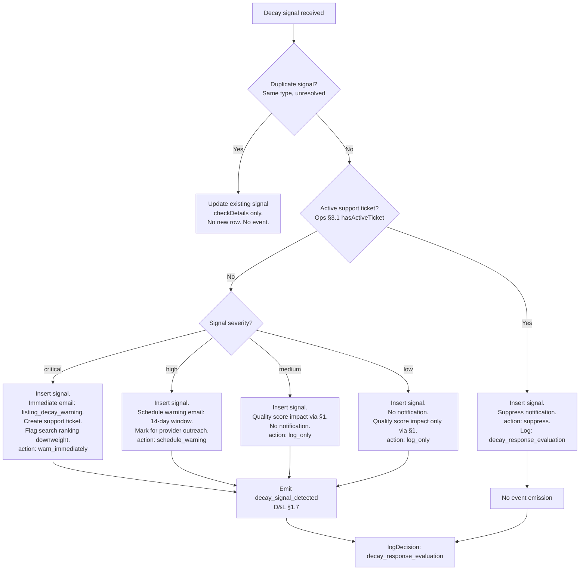

<!-- Part of slice-09-entity-intelligence v2 -->

# Slice 9: Entity Intelligence — Decay Detection & Enrichment


## 2.1 `detectDecay` Pipeline

`detectDecay` performs a single liveness check against one check type for one listing. Returns a `DecaySignal` on failure, `null` on pass. [Source: D&L CD §3 — decay detection as entity sensory loop]

```typescript
function detectDecay(listingId: UUID, checkType: EnrichmentCheckType): DecaySignal | null
// Authoritative type: enrichment_check_type pgEnum in 01-schema.md §1

type DecaySignal = {
  signalType: DecaySignalType          // decay_signal_type pgEnum
  severity: DecaySignalSeverity        // decay_signal_severity pgEnum
  checkDetails: Record<string, unknown>  // check-specific diagnostic data (JSONB)
}
```

### Per-Check-Type Logic

**website** — HTTP HEAD with GET fallback. Timeout: 10 seconds. DNS resolution failure is a distinct signal.

```
detectDecay(listingId, "website"):
  listing = getListing(listingId)
  url = listing.websiteUrl
  if url == null: return null  // no website to check

  try:
    response = httpHead(url, { timeout: 10_000 })
    if response.status >= 400:
      return {
        signalType: "website_dead",
        severity: computeWebsiteSeverity(listing),
        checkDetails: { httpStatus: response.status, url, checkedAt: now() }
      }
    return null  // 2xx/3xx = alive

  catch DnsResolutionError:
    return {
      signalType: "domain_expired",
      severity: "medium",
      checkDetails: { error: "DNS_RESOLUTION_FAILED", url, checkedAt: now() }
    }

  catch TimeoutError:
    return {
      signalType: "website_dead",
      severity: computeWebsiteSeverity(listing),
      checkDetails: { error: "TIMEOUT", url, timeoutMs: 10_000, checkedAt: now() }
    }
```

**email** — MX record lookup + SMTP mailbox probe. No actual email sent.

```
detectDecay(listingId, "email"):
  listing = getListing(listingId)
  email = listing.contactEmail
  if email == null: return null

  mxRecords = dnsLookupMX(emailDomain(email))
  if mxRecords.length == 0:
    return {
      signalType: "email_bounced",
      severity: computeEmailSeverity(listing),
      checkDetails: { error: "NO_MX_RECORDS", domain: emailDomain(email), checkedAt: now() }
    }

  smtpResult = smtpMailboxProbe(email, mxRecords[0])
  if smtpResult.status == "invalid":
    return {
      signalType: "email_bounced",
      severity: computeEmailSeverity(listing),
      checkDetails: { smtpCode: smtpResult.code, domain: emailDomain(email), checkedAt: now() }
    }

  return null  // mailbox valid
```

**ch** — Companies House API status lookup. Non-`"active"` status is a signal.

```
detectDecay(listingId, "ch"):
  listing = getListing(listingId)
  chNumber = listing.companiesHouseNumber
  if chNumber == null: return null

  chRecord = companiesHouseApi.getCompany(chNumber)
  if chRecord.status != "active":
    return {
      signalType: "ch_not_active",
      severity: "high",
      checkDetails: { chStatus: chRecord.status, chNumber, companyName: chRecord.name, checkedAt: now() }
    }

  return null
```

**social** — URL liveness for stored social profile links (LinkedIn, IMDb, etc). HTTP GET with redirect following.

```
detectDecay(listingId, "social"):
  listing = getListing(listingId)
  socialProfiles = getSocialProfiles(listingId)
  if socialProfiles.length == 0: return null

  for profile in socialProfiles:
    response = httpGet(profile.url, { timeout: 10_000, followRedirects: true })
    if response.status == 404 OR response.status >= 500:
      return {
        signalType: "social_dead",
        severity: "medium",
        checkDetails: { platform: profile.platform, url: profile.url, httpStatus: response.status, checkedAt: now() }
      }

  return null  // all social profiles alive
```

**postcode** — Postcode validation API. Checks postcode is still active/valid.

```
detectDecay(listingId, "postcode"):
  listing = getListing(listingId)
  postcode = listing.postcode
  if postcode == null: return null

  result = postcodeApi.validate(postcode)
  if result.status == "terminated" OR result.status == "invalid":
    return {
      signalType: "postcode_invalid",
      severity: computePostcodeSeverity(listing),
      checkDetails: { postcode, validationStatus: result.status, checkedAt: now() }
    }

  return null
```

**imdb** — IMDb profile URL liveness. Identical pattern to social but for dedicated IMDb profile link.

```
detectDecay(listingId, "imdb"):
  listing = getListing(listingId)
  imdbUrl = listing.imdbProfileUrl
  if imdbUrl == null: return null

  response = httpGet(imdbUrl, { timeout: 10_000, followRedirects: true })
  if response.status == 404 OR response.status >= 500:
    return {
      signalType: "social_dead",
      severity: "medium",
      checkDetails: { platform: "imdb", url: imdbUrl, httpStatus: response.status, checkedAt: now() }
    }

  return null
```

### Severity Assignment

Severity is computed from signal type and listing context. Two signals in combination escalate severity.

```typescript
function computeWebsiteSeverity(listing: Listing): DecaySignalSeverity {
  // website_dead + email_bounced together = critical (both contact paths dead)
  const hasEmailBounce = await hasActiveUnresolvedSignal(listing.id, "email_bounced")
  if (hasEmailBounce) return "critical"
  return "high"
}

function computeEmailSeverity(listing: Listing): DecaySignalSeverity {
  const hasWebsiteDead = await hasActiveUnresolvedSignal(listing.id, "website_dead")
  if (hasWebsiteDead) return "critical"
  return "high"
}

function computePostcodeSeverity(listing: Listing): DecaySignalSeverity {
  // context-dependent: critical if only address-based listing (no website/email), medium otherwise
  if (!listing.websiteUrl && !listing.contactEmail) return "high"
  return "medium"
}
```

Severity rules (summary):

| Signal Type | Base Severity | Escalation |
|-------------|---------------|------------|
| `website_dead` | `high` | `critical` if `email_bounced` also active |
| `email_bounced` | `high` | `critical` if `website_dead` also active |
| `ch_not_active` | `high` | (no escalation — CH status is binary) |
| `stale_listing` | `medium` | (no escalation — time-based decay) |
| `social_dead` | `medium` | (no escalation) |
| `postcode_invalid` | `medium` | `high` if no website/email present |
| `domain_expired` | `medium` | (distinct from `website_dead` — DNS-level failure) |

[Source: D&L CD §3 — decay severity escalation thresholds]

---

## 2.2 `evaluateDecayResponse` Decision Architecture

`evaluateDecayResponse` determines the entity's response to a detected decay signal. Inserts into `decay_signals` table, conditionally emits `decay_signal_detected` event, and logs the decision. [Source: D&L CD §3 — decay response decision architecture]

Decision type: `decay_response_evaluation` [Source: SI §9.2]

```typescript
function evaluateDecayResponse(
  listingId: UUID,
  signal: DecaySignal,
  existingSignals: DecaySignalRow[],  // active (unresolved) signals for this listing
  hasActiveSupportTicket: ActiveTicketRecord | null  // Ops §3.1 query result
): DecayResponseDecision

type DecayResponseDecision = {
  action: "warn_immediately" | "schedule_warning" | "log_only" | "suppress"
  notificationSent: boolean
  supportTicketCreated: boolean
  searchRankingDownweight: boolean
  reason: string
}
```



### Handler Pseudocode

```
evaluateDecayResponse(listingId, signal, existingSignals, activeSupportTicket):
  // 1. Duplicate check — prevent duplicate rows for same signal type
  existingOfType = existingSignals.filter(s => s.signalType == signal.signalType AND s.resolvedAt == null)
  if existingOfType.length > 0:
    // Update checkDetails on existing signal, do not insert new row
    await updateDecaySignal(existingOfType[0].id, { checkDetails: signal.checkDetails })
    logDecision("decay_response_evaluation", {
      listingId,
      signal,
      action: "duplicate_update",
      existingSignalId: existingOfType[0].id,
      reason: "Unresolved signal of same type already exists"
    })
    return { action: "suppress", notificationSent: false, supportTicketCreated: false,
             searchRankingDownweight: false, reason: "duplicate signal" }

  // 2. Insert new decay signal row
  const signalRow = await insertDecaySignal({
    listingId,
    signalType: signal.signalType,
    severity: signal.severity,
    checkDetails: signal.checkDetails,
  })

  // 3. Support ticket suppression — prevent duplicate outreach
  if activeSupportTicket != null:
    logDecision("decay_response_evaluation", {
      listingId,
      signal,
      action: "suppress",
      activeSupportTicket: activeSupportTicket.ticketId,
      reason: "Active support ticket exists — suppressing notification"
    })
    // No event emission when suppressed
    return { action: "suppress", notificationSent: false, supportTicketCreated: false,
             searchRankingDownweight: false, reason: "active support ticket" }

  // 4. Severity-based response
  let decision: DecayResponseDecision

  if signal.severity == "critical":
    // Immediate email warning via S7's listing_decay_warning template
    await sendEmail("listing_decay_warning", { listingId, signalType: signal.signalType, severity: "critical" })
    // Create support ticket if none exists
    await createSupportTicket({ listingId, category: "decay_critical", priority: "high" })
    decision = {
      action: "warn_immediately",
      notificationSent: true,
      supportTicketCreated: true,
      searchRankingDownweight: true,
      reason: "Critical decay signal — immediate outreach + ranking downweight"
    }

  else if signal.severity == "high":
    // Schedule warning email with 14-day window
    await scheduleDeferred("decay_liveness_check", { listingId, checkType: signal.signalType }, addDays(now(), 14))
    // Mark for provider outreach (quality score recalculation will apply impact)
    decision = {
      action: "schedule_warning",
      notificationSent: false,
      supportTicketCreated: false,
      searchRankingDownweight: false,
      reason: "High severity — 14-day resolution window before escalation"
    }

  else:  // medium or low
    // Log only — quality score degradation happens via §1 recalculation
    // "low" severity: minor data quality concern, no notification, quality score only
    decision = {
      action: "log_only",
      notificationSent: false,
      supportTicketCreated: false,
      searchRankingDownweight: false,
      reason: signal.severity == "low"
        ? "Low severity — minor data quality concern, quality score impact only"
        : "Medium severity — quality score impact, no notification"
    }

  // 5. Emit decay_signal_detected event (P1 compliant)
  // Authoritative payload: D&L §1.7 DecaySignalDetectedEvent
  const ticketRecord = activeSupportTicket  // already null here (suppression exits above)
  emit("decay_signal_detected", {
    type: "decay_signal_detected",
    listingId,
    signal: { type: signal.signalType, severity: signal.severity },
    activeSupportTicket: undefined,  // no active ticket (suppression path exits earlier)
  })

  // 6. Log decision
  logDecision("decay_response_evaluation", {
    listingId,
    signal,
    action: decision.action,
    notificationSent: decision.notificationSent,
    supportTicketCreated: decision.supportTicketCreated,
    searchRankingDownweight: decision.searchRankingDownweight,
    reason: decision.reason,
  })

  return decision
```

**P1 compliance note:** The emitted `decay_signal_detected` payload uses `signal` (singular object with `type` and `severity` fields) per D&L §1.7 — not `signals[]` (array). The `activeSupportTicket` field is `undefined` in the non-suppressed path (suppression exits before emission). [Source: D&L §1.7 `DecaySignalDetectedEvent`]

**Naming note:** The outer `type` field is the event discriminator (`"decay_signal_detected"`). The inner `signal.type` field is the decay signal type (e.g., `"website_dead"`, `"email_bounced"`). Both are named `type` per the D&L §1.7 contract. Implementers must reference the nested path `event.signal.type` for the decay signal type, not the outer `event.type`. [S9-ST-11]

---

## 2.3 Enrichment Scheduling

`scheduleEnrichment` creates or updates rows in `enrichment_schedules` (one per check type per listing). Cadence tier determines which check types are scheduled and at what frequency. [Source: D&L CD §3 — enrichment as entity self-maintenance]

```typescript
function scheduleEnrichment(listingId: UUID, cadenceTier: "paid" | "claimed" | "unclaimed"): void
```

### Cadence Tiers

| Check Type | Paid (liveness) | Paid (full cycle) | Claimed (liveness) | Claimed (full cycle) | Unclaimed (liveness) | Unclaimed (full cycle) |
|------------|-----------------|-------------------|--------------------|----------------------|----------------------|------------------------|
| `website` | weekly | quarterly | fortnightly | semi-annual | monthly | annual |
| `email` | weekly | quarterly | fortnightly | semi-annual | monthly | annual |
| `ch` | quarterly | quarterly | semi-annual | semi-annual | annual | annual |
| `social` | weekly | quarterly | fortnightly | semi-annual | -- | -- |
| `postcode` | annual | annual | annual | annual | -- | -- |
| `imdb` | monthly | quarterly | quarterly | semi-annual | -- | -- |

`--` = not scheduled. Unclaimed listings do not receive social/postcode/IMDb checks (no provider to respond to findings). [Source: D&L CD §3 — enrichment cadence tiers]

### Handler Pseudocode

```
scheduleEnrichment(listingId, cadenceTier):
  const cadenceMap = getCadenceMap(cadenceTier)
  // cadenceMap: Record<EnrichmentCheckType, { liveness: Duration, fullCycle: Duration } | null>

  for [checkType, cadence] of cadenceMap.entries():
    if cadence == null:
      // This check type not applicable for this tier — remove any existing schedule
      await deleteEnrichmentSchedule(listingId, checkType)
      // Cancel any pending deferred actions for this check type
      await cancelPendingDeferred("decay_liveness_check", { listingId, checkType })
      continue

    // Upsert enrichment schedule row (composite unique: listingId + checkType)
    await upsertEnrichmentSchedule({
      listingId,
      checkType,
      nextCheckAt: addDuration(now(), cadence.liveness),
      cadenceTier,
    })

    // Schedule first liveness check (self-perpetuating — handler schedules next)
    await scheduleDeferred("decay_liveness_check", { listingId, checkType }, addDuration(now(), cadence.liveness))

  // Schedule first full cycle (self-perpetuating)
  const fullCycleDuration = getFullCycleDuration(cadenceTier)
  await scheduleDeferred("enrichment_full_cycle", { listingId }, addDuration(now(), fullCycleDuration))

function getCadenceMap(tier: "paid" | "claimed" | "unclaimed"):
  if tier == "paid":
    return {
      website:  { liveness: "7d",  fullCycle: "90d" },
      email:    { liveness: "7d",  fullCycle: "90d" },
      ch:       { liveness: "90d", fullCycle: "90d" },
      social:   { liveness: "7d",  fullCycle: "90d" },
      postcode: { liveness: "365d", fullCycle: "365d" },
      imdb:     { liveness: "30d", fullCycle: "90d" },
    }
  if tier == "claimed":
    return {
      website:  { liveness: "14d",  fullCycle: "180d" },
      email:    { liveness: "14d",  fullCycle: "180d" },
      ch:       { liveness: "180d", fullCycle: "180d" },
      social:   { liveness: "14d",  fullCycle: "180d" },
      postcode: { liveness: "365d", fullCycle: "365d" },
      imdb:     { liveness: "90d",  fullCycle: "180d" },
    }
  // unclaimed
  return {
    website:  { liveness: "30d", fullCycle: "365d" },
    email:    { liveness: "30d", fullCycle: "365d" },
    ch:       { liveness: "365d", fullCycle: "365d" },
    social:   null,   // not scheduled for unclaimed
    postcode: null,   // not scheduled for unclaimed
    imdb:     null,   // not scheduled for unclaimed
  }

function getFullCycleDuration(tier: "paid" | "claimed" | "unclaimed"): Duration:
  if tier == "paid": return "90d"      // quarterly
  if tier == "claimed": return "180d"  // semi-annual
  return "365d"                        // annual
```

**Tier transitions:** When `subscription_tier_changed` fires (consumed by §6), the consumer calls `scheduleEnrichment` with the new cadence tier. The upsert overwrites existing schedule rows. Pending deferred actions for the old cadence are not explicitly cancelled — the self-perpetuating handler reads the current `enrichment_schedules.cadenceTier` at execution time and schedules the next check at the current tier's interval. Stale deferred actions execute harmlessly (the check runs, the next check is scheduled at the correct interval).

---

## 2.4 `decay_liveness_check` Deferred Action Handler

Self-perpetuating handler. Runs one check type for one listing, evaluates the result, updates the schedule, and schedules its next run. [Source: `01-router-plan.md` §3]

**Params:** `{ listingId: UUID, checkType: EnrichmentCheckType }` [Source: SI §2.1]
**Retry:** `retry_3`
**On Failure:** `log`
**Module:** `src/server/actions/intelligence/decay-liveness-check.ts`

```
handleDecayLivenessCheck({ listingId, checkType }):
  // 1. Load listing — exit early if archived/suspended
  const listing = await getListing(listingId)
  if listing == null OR listing.lifecycleStatus IN ("archived", "suspended"):
    // Listing no longer active — do not reschedule
    await deleteEnrichmentSchedule(listingId, checkType)
    return

  // 2. Run check
  const signal = await detectDecay(listingId, checkType)

  // 3. If signal detected, evaluate response
  if signal != null:
    const existingSignals = await getActiveDecaySignals(listingId)
    const activeSupportTicket = await hasActiveTicket(listingId)  // Ops §3.1
    await evaluateDecayResponse(listingId, signal, existingSignals, activeSupportTicket)

  // 4. Update enrichment schedule
  await updateEnrichmentSchedule(listingId, checkType, {
    lastCheckAt: now(),
  })

  // 5. Self-perpetuating: schedule next liveness check
  const schedule = await getEnrichmentSchedule(listingId, checkType)
  if schedule != null:
    const cadence = getCadenceMap(schedule.cadenceTier)
    const interval = cadence[checkType]?.liveness
    if interval != null:
      const nextCheckAt = addDuration(now(), interval)
      await updateEnrichmentSchedule(listingId, checkType, { nextCheckAt })
      await scheduleDeferred("decay_liveness_check", { listingId, checkType }, nextCheckAt)
```

**Error handling:** External API failures (HTTP timeout, DNS failure, Companies House API downtime) are caught by the deferred action retry policy (`retry_3`). After 3 retries, failure is logged to `event_consumer_errors` and the check is not rescheduled until the next full cycle. The `checkDetails` JSONB on `decay_signals` captures the error type for diagnostic purposes.

**Freshness reset:** A successful liveness check (signal == null) resets the Freshness clock for the listing, counting as a Freshness event for unclaimed listings. [Source: D&L CD §3 — "A successful enrichment liveness check counts as a Freshness event"]

---

## 2.5 `enrichment_full_cycle` Deferred Action Handler

Runs all applicable check types for a listing's cadence tier in sequence, then schedules its next full cycle. [Source: `01-router-plan.md` §3]

**Params:** `{ listingId: UUID }` [Source: SI §2.1]
**Retry:** `retry_3`
**On Failure:** `alert_principal` (cost-bearing external API calls)
**Module:** `src/server/actions/intelligence/enrichment-full-cycle.ts`

```
handleEnrichmentFullCycle({ listingId }):
  // 1. Load listing — exit early if archived/suspended
  const listing = await getListing(listingId)
  if listing == null OR listing.lifecycleStatus IN ("archived", "suspended"):
    await deleteAllEnrichmentSchedules(listingId)
    return

  // 2. Determine applicable check types for this listing's cadence tier
  const schedule = await getEnrichmentSchedules(listingId)
  if schedule.length == 0: return  // no enrichment schedules — listing not enrolled

  const cadenceTier = schedule[0].cadenceTier
  const cadenceMap = getCadenceMap(cadenceTier)
  const applicableCheckTypes = Object.entries(cadenceMap)
    .filter(([_, cadence]) => cadence != null)
    .map(([checkType, _]) => checkType)

  // 3. Run all applicable checks
  const signals: DecaySignal[] = []
  for checkType of applicableCheckTypes:
    try:
      const signal = await detectDecay(listingId, checkType)
      if signal != null:
        signals.push(signal)
    catch error:
      // Log error but continue with remaining checks
      logError("enrichment_full_cycle", { listingId, checkType, error: error.message })

  // 4. Evaluate each detected signal
  const existingSignals = await getActiveDecaySignals(listingId)
  const activeSupportTicket = await hasActiveTicket(listingId)  // Ops §3.1
  for signal of signals:
    await evaluateDecayResponse(listingId, signal, existingSignals, activeSupportTicket)

  // 5. Update schedule timestamps
  for checkType of applicableCheckTypes:
    await updateEnrichmentSchedule(listingId, checkType, {
      lastCheckAt: now(),
      lastFullCycleAt: now(),
    })

  // 6. Self-perpetuating: schedule next full cycle
  const fullCycleDuration = getFullCycleDuration(cadenceTier)
  await scheduleDeferred("enrichment_full_cycle", { listingId }, addDuration(now(), fullCycleDuration))
```

**Failure escalation:** `alert_principal` on failure because full cycles invoke multiple cost-bearing external API calls (Companies House API, postcode validation). A systematic failure (e.g., Companies House API key expired) would silently burn through retries across all listings. Principal escalation surfaces the issue. [Source: `01-router-plan.md` §3, D&L CD §3 — "any entity decision that changes aggregate operational cost by >10% triggers principal escalation"]

---

## 2.6 `account_closed` Enrichment Suspension (S1-11)

Resolves upstream flag S1-11: the `account_closed` consumer for enrichment suspension. [Source: `s9-pre-draft-checklist.md` §6]

When an account is closed, all enrichment activity for that account's listings must stop immediately. Enrichment schedules are deleted and pending deferred actions cancelled.

**Consumer registration:** `intelligence:account_closed:enrichmentSuspension` (async). Registered in §6 event consumers.

```
handleAccountClosedEnrichmentSuspension(event: AccountClosedEvent):
  // 1. Use P1-compliant listing IDs from event payload
  const listingIds = event.listingsArchived
  if listingIds.length == 0: return

  // 2. Cancel all pending decay_liveness_check deferred actions for these listings
  await cancelPendingDeferredActions({
    action: "decay_liveness_check",
    paramsFilter: (params) => listingIds.includes(params.listingId),
    status: "pending",
  })

  // 3. Cancel all pending enrichment_full_cycle deferred actions for these listings
  await cancelPendingDeferredActions({
    action: "enrichment_full_cycle",
    paramsFilter: (params) => listingIds.includes(params.listingId),
    status: "pending",
  })

  // 4. Delete enrichment schedule rows — no future enrichment needed
  for listingId of listingIds:
    await deleteAllEnrichmentSchedules(listingId)
```

**SQL implementation for deferred action cancellation:**

```sql
UPDATE deferred_actions
SET status = 'cancelled', updated_at = NOW()
WHERE action IN ('decay_liveness_check', 'enrichment_full_cycle')
  AND status = 'pending'
  AND params->>'listingId' = ANY($1::text[])
-- $1 = array of listing IDs for the closed account
```

**Edge case:** If a listing is unclaimed (no account), enrichment continues normally. Account closure only affects enrichment for listings owned by the closed account. Unclaimed listings have no `accountId` and are not affected.

---

## 2.7 `decay_final_notice` Email (90-day no-response)

New email template for the 90-day escalation when a decay signal remains unresolved after the initial warning. [Source: `01-decisions.md` D6 — S7's `listing_decay_warning` covers initial warning; S9 adds `decay_final_notice` for 90-day no-response]

**Template ID:** `decay_final_notice`
**Category:** `transactional`
**Unsubscribable:** No
**Owner:** D&L

**Trigger condition:** A decay signal exists WHERE:
- `resolvedAt IS NULL` (unresolved)
- `severity IN ("critical", "high")`
- `detectedAt <= NOW() - INTERVAL '90 days'`
- The provider was previously warned (S7's `listing_decay_warning` was sent)

**Content:** Final notice that listing may be archived if decay is not resolved within 14 days. Includes: listing name, signal type, original detection date, number of days unresolved.

**Merge fields:**

```typescript
type DecayFinalNoticeMergeFields = {
  listingName: string
  signalType: DecaySignalType
  detectedAt: ISO8601
  daysUnresolved: number
  resolutionDeadline: ISO8601  // detectedAt + 104 days (90 + 14)
  listingUrl: string
}
```

**Implementation:** The `data_health_review` ceremony (§4) scans for unresolved high/critical signals older than 90 days and triggers `decay_final_notice` for each. This avoids adding a dedicated deferred action — the monthly ceremony is the appropriate cadence for escalation checks.

**Post-deadline action:** If a signal remains unresolved at 104 days (90 + 14), the next `data_health_review` run flags the listing for suspension via `listing_suspended` emission. The decision is logged as `decay_response_evaluation` with `action: "escalate_to_suspension"`.

---

## 2.8 `enrichment_cadence_adjustment` Decision Architecture

Decision type: `enrichment_cadence_adjustment` [Source: SI §9.2]

Invoked by the `data_health_review` ceremony (§4) when aggregate enrichment metrics indicate a cadence change is warranted for a tier.

```typescript
function evaluateEnrichmentCadenceAdjustment(
  tier: "paid" | "claimed" | "unclaimed",
  metrics: {
    falsePositiveRate: number       // % of decay signals resolved as auto_healed within 24h
    signalDetectionRate: number     // signals per check as a percentage
    averageCheckLatency: number     // ms — external API response time trend
    costPerCheckBatch: number       // aggregate cost for this tier's checks
  }
): EnrichmentCadenceDecision

type EnrichmentCadenceDecision = {
  action: "increase_frequency" | "decrease_frequency" | "maintain" | "escalate_to_principal"
  reason: string
  currentCadence: Record<EnrichmentCheckType, Duration>
  recommendedCadence?: Record<EnrichmentCheckType, Duration>
}
```

```
evaluateEnrichmentCadenceAdjustment(tier, metrics):
  // High false positive rate suggests over-checking
  if metrics.falsePositiveRate > 0.30:
    logDecision("enrichment_cadence_adjustment", {
      tier, action: "decrease_frequency",
      reason: "False positive rate >30% — checks too frequent",
      metrics
    })
    return { action: "decrease_frequency", reason: "False positive rate >30%", ... }

  // High signal detection rate suggests under-checking
  if metrics.signalDetectionRate > 0.15:
    logDecision("enrichment_cadence_adjustment", {
      tier, action: "increase_frequency",
      reason: "Signal detection rate >15% — checks too infrequent",
      metrics
    })
    return { action: "increase_frequency", reason: "Signal detection rate >15%", ... }

  // Cost escalation triggers principal review
  if metrics.costPerCheckBatch > COST_THRESHOLD:
    logDecision("enrichment_cadence_adjustment", {
      tier, action: "escalate_to_principal",
      reason: "Aggregate enrichment cost exceeds threshold",
      metrics
    })
    return { action: "escalate_to_principal", reason: "Cost threshold exceeded", ... }

  logDecision("enrichment_cadence_adjustment", {
    tier, action: "maintain",
    reason: "Metrics within tolerance",
    metrics
  })
  return { action: "maintain", reason: "Metrics within tolerance", ... }
```

**V1 scope:** Cadence adjustment recommendations are logged as decisions and surfaced in the admin intelligence panel (`admin.intelligence.ceremonies` route). Automatic cadence changes are deferred to S10 (Hardening) — V1 requires principal review before cadence modifications take effect. [Source: downstream flag for S10]

---

## 2.9 Admin Routes

§2 contributes to 2 admin routes defined in `01-router-plan.md` §2.1:

- `admin.intelligence.decaySignals` — paginated list of active/resolved decay signals with listing context, severity filtering, and support ticket annotation. Contract: `01-router-plan.md` §2.2.
- `admin.intelligence.enrichmentStatus` — enrichment coverage by tier, next check dates, failure counts. Contract: `01-router-plan.md` §2.2.

No additional route specification needed — `01-router-plan.md` is authoritative.

---

## Acceptance Criteria

| # | Criterion | Test Type |
|---|-----------|-----------|
| AC-S9-2-01 | `detectDecay(listingId, "website")` returns `{ signalType: "website_dead", severity: "high" }` when HTTP HEAD returns 4xx/5xx, and returns `{ signalType: "domain_expired", severity: "medium" }` when DNS resolution fails. | integration |
| AC-S9-2-02 | `detectDecay(listingId, "email")` returns `{ signalType: "email_bounced" }` when MX lookup returns zero records or SMTP mailbox probe returns invalid. | integration |
| AC-S9-2-03 | `detectDecay(listingId, "ch")` returns `{ signalType: "ch_not_active", severity: "high" }` when Companies House API returns status !== "active". Returns `null` when status === "active". | integration |
| AC-S9-2-04 | `detectDecay(listingId, "social")` returns `{ signalType: "social_dead", severity: "medium" }` when any stored social profile URL returns 404 or 5xx. Returns `null` when all profiles respond 2xx/3xx. | integration |
| AC-S9-2-05 | `detectDecay(listingId, "postcode")` returns `{ signalType: "postcode_invalid", severity: "medium" }` when postcode validation returns terminated/invalid. Returns `null` for valid postcodes. | integration |
| AC-S9-2-06 | When `website_dead` and `email_bounced` signals are both active (unresolved), severity escalates to `"critical"` for whichever signal is detected second. | unit |
| AC-S9-2-07 | `evaluateDecayResponse` does not insert a new `decay_signals` row when an unresolved signal of the same type already exists for the listing. Instead, updates `checkDetails` on the existing row. | unit |
| AC-S9-2-08 | `evaluateDecayResponse` suppresses notification and does not emit `decay_signal_detected` when `hasActiveTicket` returns a non-null record for the listing. | unit |
| AC-S9-2-09 | `scheduleEnrichment` creates the correct number of `enrichment_schedules` rows per tier: 6 for paid, 6 for claimed, 3 for unclaimed (website, email, ch only). | unit |
| AC-S9-2-10 | `decay_liveness_check` handler schedules its next run after each execution at the interval matching the listing's current `cadenceTier` (self-perpetuating pattern). | integration |
| AC-S9-2-11 | `account_closed` consumer cancels all pending `decay_liveness_check` and `enrichment_full_cycle` deferred actions for the closed account's listings and deletes all `enrichment_schedules` rows for those listings. | integration |
| AC-S9-2-12 | `decay_signal_detected` event emission payload matches D&L §1.7 `DecaySignalDetectedEvent` type: `{ type, listingId, signal: { type, severity }, activeSupportTicket? }`. | unit |
| AC-S9-2-13 | Every `evaluateDecayResponse` invocation logs a decision of type `"decay_response_evaluation"` via `logDecision` (SI §9.2), including the action taken, signal details, and reason. | unit |
| AC-S9-2-14 | `enrichment_full_cycle` handler runs all applicable check types for the listing's cadence tier and schedules its next full cycle at the correct interval (quarterly/semi-annual/annual). | integration |
| AC-S9-2-15 | Every `evaluateEnrichmentCadenceAdjustment` invocation logs a decision of type `"enrichment_cadence_adjustment"` via `logDecision` (SI §9.2), including the tier, action, metrics, and reason. | unit |

**Total: 15 acceptance criteria.**
