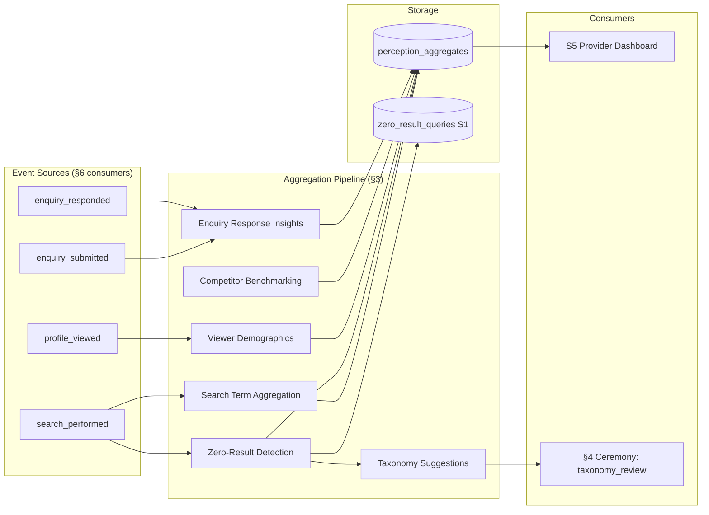

<!-- Part of slice-09-entity-intelligence v2 -->

# Slice 9: Entity Intelligence — Analytics Pipeline

---

## 3.0 Section Overview

The analytics pipeline aggregates raw engagement events into actionable intelligence stored in `perception_aggregates`. Four aggregate types (search_terms, viewer_demographics, competitor_benchmarking, enquiry_response) share a single table with `aggregateType` discriminator + JSONB `data` column [Source: `01-decisions.md` — D1]. All aggregation is in-database — no external analytics service at V1 [Source: `01-decisions.md` — OQ-1]. This section is authoritative for aggregation logic and JSONB data shapes. §6 (Event Consumers) is authoritative for consumer handler code that invokes these functions.

Premium feature gating uses `computeFeatureAccess(tier)` from CR §4.2 (P4 import, never copy). Gating per aggregate type:

| Aggregate Type | Gate Field | Tiers With Access |
|----------------|-----------|-------------------|
| `search_terms` (top terms) | `topSearchTerms` | standard, premium, partner |
| `viewer_demographics` | `viewerDemographics` | premium, partner |
| `competitor_benchmarking` | `competitorBenchmarking` | premium, partner |
| `enquiry_response` | `enquiryResponseInsights` | premium, partner |

[Source: CR §4.1 `TIER_LIMITS`]



---

## 3.1 Search Term Aggregation

**Resolves:** S1-4 (search terms + trend data), S5-6 (top search terms per listing), S6-3 (search analytics pipeline).

The search term aggregation pipeline consumes `search_performed` events via the §6 consumer (`intelligence:search_performed:searchAnalytics`). Per-event processing identifies which listings appeared in the result set and associates the search query term with each listing.

**Per-listing aggregation function:**

```typescript
// src/server/intelligence/analytics-pipeline.ts

async function aggregateSearchTerm(
  listingId: UUID,
  term: string,
  periodStart: Date,
  periodEnd: Date,
): Promise<void>
```

**Aggregation logic:**

```
aggregateSearchTerm(listingId, term, periodStart, periodEnd):
  existing = db.select(perception_aggregates)
    .where({ listingId, aggregateType: "search_terms", periodStart })

  if existing:
    data = existing.data as SearchTermsData
    match = data.terms.find(t => t.term === term)
    if match:
      match.count += 1
      match.lastSeen = now()
    else:
      data.terms.push({ term, count: 1, lastSeen: now() })

    db.update(perception_aggregates)
      .set({ data, computedAt: now(), sampleSize: existing.sampleSize + 1 })
      .where({ id: existing.id })
  else:
    db.insert(perception_aggregates).values({
      listingId,
      aggregateType: "search_terms",
      periodStart,
      periodEnd,
      data: { terms: [{ term, count: 1, lastSeen: now() }], zeroResultTerms: [], taxonomyGaps: [] },
      sampleSize: 1,
    })
```

**JSONB data shape for `aggregateType = "search_terms"`:**

```typescript
type SearchTermsData = {
  terms: {
    term: string
    count: number
    lastSeen: ISO8601
  }[]
  zeroResultTerms: string[]          // terms that produced 0 results globally
  taxonomyGaps: UnmatchedTerm[]      // populated by §3.2 taxonomy gap identification
}
```

**Period:** Weekly aggregation cycle. The `search_performed` consumer writes to the current week's aggregate row. Period boundaries: Monday 00:00 UTC to Sunday 23:59 UTC.

**Surface:** S5 provider dashboard reads the most recent `search_terms` aggregate for the listing and displays the top N terms sorted by `count` descending. Gated by `computeFeatureAccess(tier).topSearchTerms` — available to standard, premium, partner tiers. [Source: CR §4.1]

---

## 3.2 Zero-Result Detection & Taxonomy Gap Identification

**Resolves:** S6-3 (search analytics pipeline — zero-result detection, taxonomy gap identification).

Zero-result detection identifies search queries that returned `resultCount = 0` from `SearchPerformedEvent`. [Source: PP §1.1 `SearchPerformedEvent`]

**Detection pipeline:**

```
handleSearchPerformedForZeroResult(event: SearchPerformedEvent):
  if event.resultCount === 0:
    // Write to zero_result_queries table (S1 schema)
    db.insert(zero_result_queries).values({
      query: event.query,
      filters: event.filters,
      timestamp: event.timestamp,
    }).onConflictDoNothing()

    // Append to current week's search_terms aggregate (global aggregate — no listingId)
    // Zero-result terms tracked in a dedicated aggregate row with a sentinel listingId
    appendZeroResultTerm(event.query, currentPeriod())
```

**Taxonomy gap identification:**

```typescript
type UnmatchedTerm = {
  term: string
  frequency: number
  potentialSector?: string         // inferred from term analysis (keyword matching)
  potentialServiceArea?: string    // inferred from term analysis
}
```

Taxonomy gap identification runs as part of the weekly aggregation cycle. It aggregates `zero_result_queries` by frequency and identifies common search terms not covered by existing taxonomy entries in `taxonomy_sectors`, `taxonomy_service_areas`, `taxonomy_specialisations`.

```
identifyTaxonomyGaps(period: DateRange): UnmatchedTerm[]
  zeroResultTerms = db.select(zero_result_queries)
    .where({ timestamp: between(period.start, period.end) })
    .groupBy("query")
    .having(count("*") >= 3)       // frequency threshold: 3+ occurrences in period
    .orderBy(desc(count("*")))

  existingTerms = db.select(taxonomy_service_areas).map(sa => sa.name.toLowerCase())
    .concat(db.select(taxonomy_specialisations).map(s => s.name.toLowerCase()))

  return zeroResultTerms
    .filter(t => !existingTerms.includes(t.query.toLowerCase()))
    .map(t => ({
      term: t.query,
      frequency: t.count,
      potentialSector: inferSector(t.query),       // simple keyword-to-sector mapping
      potentialServiceArea: inferServiceArea(t.query),
    }))
```

**Output:** `taxonomyGaps` field appended to the global `search_terms` aggregate data. Consumed by §4 `taxonomy_review_preparation` ceremony — no direct user surface. Admin-only via §4 ceremony outputs.

---

## 3.3 Viewer Demographics Bucketing

**Resolves:** S5-4 (viewer demographics).

Viewer demographics bucketing aggregates deduplicated `profile_viewed` events per listing. §1 implements P2 deduplication (same viewer + same listing within 1 hour = single count) [Source: `00-skeleton.md` §1]. This section consumes only deduplicated events — the §6 consumer (`intelligence:profile_viewed:engagement`) invokes deduplication first, then calls viewer demographics aggregation.

**Aggregation function:**

```typescript
async function aggregateViewerDemographic(
  listingId: UUID,
  viewerProfile: { entityType?: EntityType; sector?: string; region?: string },
  period: DateRange,
): Promise<void>
```

The function reads the viewer's account profile (if authenticated) to extract entity type, primary sector, and location region. Anonymous viewers (no session) contribute to `totalUniqueViewers` but are excluded from demographic buckets.

**Aggregation logic:**

```
aggregateViewerDemographic(listingId, viewerProfile, period):
  existing = db.select(perception_aggregates)
    .where({ listingId, aggregateType: "viewer_demographics", periodStart: period.start })

  if !existing:
    create new row with initial demographic buckets

  data = existing.data as ViewerDemographicsData
  data.totalUniqueViewers += 1

  if viewerProfile.entityType:
    bucket = data.entityTypes.find(b => b.type === viewerProfile.entityType)
    if bucket: bucket.count += 1
    else: data.entityTypes.push({ type: viewerProfile.entityType, count: 1 })

  // Same pattern for sector and region buckets
  // ...

  // Recompute percentages from raw counts
  total = data.entityTypes.reduce((sum, b) => sum + b.count, 0)
  data.entityTypes.forEach(b => { b.pct = round(b.count / total, 2) })
  // Same for sectors, regions

  db.update(perception_aggregates)
    .set({ data, computedAt: now(), sampleSize: existing.sampleSize + 1 })
    .where({ id: existing.id })
```

**JSONB data shape for `aggregateType = "viewer_demographics"`:**

```typescript
type ViewerDemographicsData = {
  entityTypes: { type: EntityType; count: number; pct: number }[]
  sectors: { sector: string; count: number; pct: number }[]
  regions: { region: string; count: number; pct: number }[]
  totalUniqueViewers: number
}
// Authoritative type reference: EntityType in D&L §4
```

**Period:** Weekly aggregation cycle, matching search term aggregation cadence. Percentages recomputed on every increment from raw counts (not running averages — avoids floating point drift).

**Gating:** Premium tier only. `computeFeatureAccess(tier).viewerDemographics` must return `true`. [Source: CR §4.1 `TIER_LIMITS` — `viewerDemographics: true` for premium/partner only]

---

## 3.4 Competitor Benchmarking

**Resolves:** S5-3 (competitor benchmarking).

Competitor benchmarking computes anonymised performance comparison for a listing against taxonomy-overlapping competitors. Computed on-demand (not scheduled) — triggered when a provider views their analytics dashboard. Cached in `perception_aggregates` with a 7-day TTL.

**Function signature:**

```typescript
async function computeCompetitorBenchmark(
  listingId: UUID,
  taxonomyTags: TaxonomyTag[],    // the listing's tags — NOT listing IDs
): Promise<CompetitorBenchmark>
// Authoritative type reference: TaxonomyTag in D&L §4
```

**IMPORTANT:** `computeTaxonomyOverlap` expects `TaxonomyTag[]` arrays, NOT listing IDs [Source: D&L §3.1, S8-ST-3 fix]. The caller must pass the listing's taxonomy tags extracted from `listing_taxonomy_tags`.

**Computation logic:**

```
computeCompetitorBenchmark(listingId, taxonomyTags):
  // Check cache first — 7-day TTL
  cached = db.select(perception_aggregates)
    .where({
      listingId,
      aggregateType: "competitor_benchmarking",
      computedAt: gte(now() - 7 days),
    })
    .orderBy(desc("computedAt"))
    .limit(1)

  if cached:
    return cached.data as CompetitorBenchmark

  // Identify competitors: listings sharing >= 2 taxonomy tags at Service Area level
  // Batch fetch all active listings with overlapping taxonomy
  candidateListings = db.select(listing_taxonomy_tags)
    .innerJoin(listings, eq(listings.id, listing_taxonomy_tags.listingId))
    .where(
      and(
        ne(listing_taxonomy_tags.listingId, listingId),
        eq(listings.lifecycleStatus, "active"),
        inArray(listing_taxonomy_tags.serviceArea, taxonomyTags.map(t => t.serviceArea)),
      )
    )
    .groupBy(listing_taxonomy_tags.listingId)
    .having(countDistinct(listing_taxonomy_tags.serviceArea) >= 2)

  competitorIds = candidateListings.map(c => c.listingId)

  if competitorIds.length < 3:
    // Insufficient sample — return insufficient_data indicator
    return {
      medianViews: null,
      medianEnquiries: null,
      medianQualityScore: null,
      sampleSize: competitorIds.length,
      taxonomyOverlapCount: competitorIds.length,
      insufficientData: true,
    }

  // Batch fetch engagement counters — N+1 avoidance
  // Single query for all competitor engagement data
  competitorEngagement = db.select({
    listingId: engagements.listingId,
    profileViews: engagements.profileViews,
    enquiriesReceived: engagements.enquiriesReceived,
  })
    .from(engagements)
    .where(inArray(engagements.listingId, competitorIds))

  competitorScores = db.select({
    listingId: quality_scores.listingId,
    composite: quality_scores.composite,
  })
    .from(quality_scores)
    .where(inArray(quality_scores.listingId, competitorIds))

  // Compute anonymised medians
  benchmark = {
    medianViews: median(competitorEngagement.map(c => c.profileViews)),
    medianEnquiries: median(competitorEngagement.map(c => c.enquiriesReceived)),
    medianQualityScore: median(competitorScores.map(c => c.composite)),
    sampleSize: competitorIds.length,
    taxonomyOverlapCount: competitorIds.length,
    insufficientData: false,
  }

  // Cache result in perception_aggregates
  db.insert(perception_aggregates).values({
    listingId,
    aggregateType: "competitor_benchmarking",
    periodStart: startOfWeek(now()),
    periodEnd: endOfWeek(now()),
    data: benchmark,
    sampleSize: competitorIds.length,
  }).onConflictDoUpdate({
    target: [perception_aggregates.listingId, perception_aggregates.aggregateType, perception_aggregates.periodStart],
    set: { data: benchmark, computedAt: now(), sampleSize: competitorIds.length },
  })

  return benchmark
```

**JSONB data shape for `aggregateType = "competitor_benchmarking"`:**

```typescript
type CompetitorBenchmark = {
  medianViews: number | null
  medianEnquiries: number | null
  medianQualityScore: number | null
  sampleSize: number
  taxonomyOverlapCount: number
  insufficientData: boolean
}
```

**N+1 avoidance:** Engagement counters and quality scores for the competitor set are fetched in two batch queries (`WHERE listingId IN (...)`) rather than per-competitor calls to `getEngagementCounters`. This avoids N+1 for competitor sets that may reach 50-100 listings in common sectors.

**Gating:** Premium tier only. `computeFeatureAccess(tier).competitorBenchmarking` must return `true`. [Source: CR §4.1 `TIER_LIMITS`]

---

## 3.5 Enquiry Response Insights

**Resolves:** S5-5 (enquiry response insights).

Enquiry response insights compute response rate, median response time, and a conversion-to-booking estimate per listing. Updated incrementally by the `enquiry_submitted` and `enquiry_responded` event consumers.

**Function signature:**

```typescript
async function computeEnquiryResponseInsights(
  listingId: UUID,
): Promise<EnquiryResponseInsights>
```

**Computation logic:**

```
computeEnquiryResponseInsights(listingId):
  counters = getEngagementCounters(listingId)
  // [Source: D&L §3.2] — returns profileViews, searchAppearances,
  // enquiriesReceived, enquiryResponseRate, enquiryResponseTime

  // Fetch detailed response time distribution from enquiry_records
  responseRecords = db.select({
    responseTimeMinutes: enquiry_records.responseTimeMinutes,
    respondedAt: enquiry_records.respondedAt,
  })
    .from(enquiry_records)
    .where(
      and(
        eq(enquiry_records.listingId, listingId),
        isNotNull(enquiry_records.respondedAt),
      )
    )

  totalEnquiries = counters.enquiriesReceived
  respondedEnquiries = responseRecords.length
  responseRate = totalEnquiries > 0 ? respondedEnquiries / totalEnquiries : 0

  responseTimes = responseRecords.map(r => r.responseTimeMinutes)
  medianResponseTimeHours = responseTimes.length > 0
    ? median(responseTimes) / 60
    : null

  // Conversion estimate: proportion of responded enquiries with
  // follow-up contact (simplified proxy — responded within 24 hours)
  fastResponses = responseRecords.filter(r => r.responseTimeMinutes <= 1440)
  conversionEstimate = respondedEnquiries > 0
    ? fastResponses.length / respondedEnquiries
    : 0

  insights = {
    responseRate: round(responseRate, 3),
    medianResponseTimeHours: medianResponseTimeHours !== null
      ? round(medianResponseTimeHours, 1)
      : null,
    conversionEstimate: round(conversionEstimate, 3),
    totalEnquiries,
    respondedEnquiries,
  }

  // Upsert to perception_aggregates
  db.insert(perception_aggregates).values({
    listingId,
    aggregateType: "enquiry_response",
    periodStart: startOfDay(now()),
    periodEnd: endOfDay(now()),
    data: insights,
    sampleSize: totalEnquiries,
  }).onConflictDoUpdate({
    target: [perception_aggregates.listingId, perception_aggregates.aggregateType, perception_aggregates.periodStart],
    set: { data: insights, computedAt: now(), sampleSize: totalEnquiries },
  })

  return insights
```

**JSONB data shape for `aggregateType = "enquiry_response"`:**

```typescript
type EnquiryResponseInsights = {
  responseRate: number               // 0.0–1.0 (responded / total)
  medianResponseTimeHours: number | null  // null if no responses
  conversionEstimate: number         // 0.0–1.0 (fast responses / total responded)
  totalEnquiries: number
  respondedEnquiries: number
}
```

**Schedule:** Updated on each `enquiry_responded` event (via §6 consumer). Daily batch recomputation ensures consistency even if individual event processing was delayed.

**Gating:** Premium tier only. `computeFeatureAccess(tier).enquiryResponseInsights` must return `true`. [Source: CR §4.1 `TIER_LIMITS` — `enquiryResponseInsights: true` for premium/partner only]

---

## 3.6 Generic Taxonomy Suggestions

**Resolves:** S2-4 (data-driven taxonomy suggestions from listing sector distribution), D9 (assignment to §3).

Taxonomy suggestions complement S2's 3 curated sector selections during onboarding with data-driven recommendations. No separate table — computed on-demand from existing data.

**Function signature:**

```typescript
async function computeTaxonomySuggestions(
  primarySector: string,
): Promise<TaxonomySuggestion[]>
```

**Computation logic:**

```
computeTaxonomySuggestions(primarySector):
  // Find the most common additional service areas claimed by listings
  // in the same primary sector
  coOccurrences = db.select({
    serviceArea: listing_taxonomy_tags.serviceArea,
    count: count("*"),
  })
    .from(listing_taxonomy_tags)
    .innerJoin(listing_taxonomy_tags as sectorTag,
      and(
        eq(sectorTag.listingId, listing_taxonomy_tags.listingId),
        eq(sectorTag.sector, primarySector),
      )
    )
    .where(ne(listing_taxonomy_tags.serviceArea, ""))  // exclude empty
    .groupBy(listing_taxonomy_tags.serviceArea)
    .orderBy(desc(count("*")))
    .limit(10)

  return coOccurrences.map(c => ({
    serviceArea: c.serviceArea,
    frequency: c.count,
    source: "data_driven" as const,
  }))
```

```typescript
type TaxonomySuggestion = {
  serviceArea: string
  frequency: number                   // how many listings in the sector have this service area
  source: "data_driven"              // distinguishes from S2's "curated" suggestions
}
```

**Consumer:** S2 onboarding flow imports `computeTaxonomySuggestions` to supplement its curated suggestions. The S2 taxonomy selection UI displays both curated (first) and data-driven (second, labelled "Popular in your sector") suggestions.

**Data requirement:** Produces meaningful suggestions only when the platform has sufficient listings per sector. Returns empty array when fewer than 10 listings exist in the requested sector.

---

## 3.7 Aggregation Scheduling

Periodic aggregation piggybacks on two mechanisms: event-driven incremental updates and the `data_health_review` monthly ceremony.

| Aggregate Type | Incremental Trigger | Batch Rollup | Schedule |
|----------------|--------------------|--------------|---------:|
| `search_terms` | Every `search_performed` event (§6 consumer) | `data_health_review` ceremony (§4) | Weekly period, event-driven writes |
| `viewer_demographics` | Every deduplicated `profile_viewed` event (§6 consumer) | `data_health_review` ceremony (§4) | Weekly period, event-driven writes |
| `enquiry_response` | Every `enquiry_responded` event (§6 consumer) | `data_health_review` ceremony (§4) | Daily period, event-driven writes |
| `competitor_benchmarking` | On-demand (provider dashboard view) | None — TTL-based cache invalidation | 7-day TTL, on-demand computation |

No separate deferred actions for analytics aggregation. The event consumers (§6) handle incremental writes. The `data_health_review` monthly ceremony (§4) produces the periodic rollup summary (quality score distribution, decay trends, enrichment coverage, and aggregation health metrics). The taxonomy gap identification feeds into the `taxonomy_review_preparation` quarterly ceremony (§4).

**Aggregation period boundaries:**

- Weekly: Monday 00:00 UTC to Sunday 23:59 UTC. New period row created on first event after boundary.
- Daily: 00:00 UTC to 23:59 UTC (enquiry_response only — response time freshness requires shorter periods).
- On-demand: competitor benchmarking has no fixed period — `periodStart`/`periodEnd` reflect the week of computation for cache keying.

---

## 3.8 Acceptance Criteria

| # | Criterion | Test Type |
|---|-----------|-----------|
| AC-S9-3-01 | `search_performed` event consumer writes per-listing search term frequency to `perception_aggregates` with `aggregateType = "search_terms"` and JSONB data matching `SearchTermsData` shape. | Integration |
| AC-S9-3-02 | Zero-result queries (`resultCount = 0`) are written to `zero_result_queries` table and appended to the global `search_terms` aggregate `zeroResultTerms` array. | Integration |
| AC-S9-3-03 | Taxonomy gap identification produces `UnmatchedTerm[]` for zero-result terms with frequency >= 3 that do not match existing taxonomy entries. Output stored in `taxonomyGaps` field of `search_terms` aggregate. | Integration |
| AC-S9-3-04 | `perception_aggregates` rows with `aggregateType = "viewer_demographics"` contain JSONB data matching `ViewerDemographicsData` shape: `entityTypes[]`, `sectors[]`, `regions[]` each with `type/sector/region`, `count`, and `pct` fields. `pct` values sum to 1.0 per bucket category. | Unit |
| AC-S9-3-05 | Viewer demographics aggregation consumes only deduplicated `profile_viewed` events (same viewer + same listing within 1 hour = single count). Deduplication is performed by §1 before demographics bucketing. | Integration |
| AC-S9-3-06 | `computeCompetitorBenchmark` calls competitor identification using `TaxonomyTag[]` arrays (not listing IDs) and a >= 2 service area overlap threshold. [Source: D&L §3.1, S8-ST-3] | Unit |
| AC-S9-3-07 | `computeCompetitorBenchmark` produces anonymised median comparison (`medianViews`, `medianEnquiries`, `medianQualityScore`) from a batch-fetched competitor set. Returns `insufficientData: true` when fewer than 3 competitors found. | Unit |
| AC-S9-3-08 | Competitor benchmark engagement counters and quality scores are fetched in batch queries (`WHERE listingId IN (...)`) — not per-competitor calls to `getEngagementCounters`. | Unit |
| AC-S9-3-09 | Competitor benchmark result is cached in `perception_aggregates` with `aggregateType = "competitor_benchmarking"`. Cache is valid for 7 days (`computedAt` + 7 days). Subsequent calls within TTL return cached result without recomputation. | Integration |
| AC-S9-3-10 | `computeFeatureAccess(tier).competitorBenchmarking` returns `false` for free and standard tiers. Competitor benchmarking endpoint returns HTTP 403 or omits data for non-premium accounts. [Source: CR §4.1] | Integration |
| AC-S9-3-11 | `computeFeatureAccess(tier).viewerDemographics` returns `false` for free and standard tiers. Viewer demographics data is not returned to non-premium accounts. [Source: CR §4.1] | Integration |
| AC-S9-3-12 | `computeFeatureAccess(tier).topSearchTerms` returns `true` for standard, premium, and partner tiers. Top search terms are visible to standard+ accounts. [Source: CR §4.1] | Integration |
| AC-S9-3-13 | `computeFeatureAccess(tier).enquiryResponseInsights` returns `false` for free and standard tiers. Enquiry response insights are restricted to premium and partner accounts. [Source: CR §4.1] | Integration |
| AC-S9-3-14 | `perception_aggregates` rows with `aggregateType = "search_terms"` contain JSONB data matching `SearchTermsData` shape: `terms[]` with `term`, `count`, `lastSeen`; `zeroResultTerms` string array; `taxonomyGaps` `UnmatchedTerm[]`. | Unit |
| AC-S9-3-15 | `perception_aggregates` rows with `aggregateType = "competitor_benchmarking"` contain JSONB data matching `CompetitorBenchmark` shape: `medianViews`, `medianEnquiries`, `medianQualityScore` (nullable), `sampleSize`, `taxonomyOverlapCount`, `insufficientData`. | Unit |
| AC-S9-3-16 | `perception_aggregates` rows with `aggregateType = "enquiry_response"` contain JSONB data matching `EnquiryResponseInsights` shape: `responseRate`, `medianResponseTimeHours` (nullable), `conversionEstimate`, `totalEnquiries`, `respondedEnquiries`. | Unit |
| AC-S9-3-17 | `computeEnquiryResponseInsights` computes `responseRate` as `respondedEnquiries / totalEnquiries` and `medianResponseTimeHours` from `enquiry_responded` event timestamps. Returns `medianResponseTimeHours: null` when no responses exist. | Unit |
| AC-S9-3-18 | `computeTaxonomySuggestions(primarySector)` returns data-driven service area suggestions from co-occurrence analysis of `listing_taxonomy_tags`. Returns empty array when fewer than 10 listings exist in the sector. S2 onboarding flow consumes this output. | Integration |

**Total: 18 acceptance criteria.**

---

## Cross-References

| Document | Relationship |
|----------|-------------|
| `data-and-listings.md` (v5 interface) | §3.1 `computeTaxonomyOverlap` (competitor identification — expects `TaxonomyTag[]`), §3.2 `getEngagementCounters` (engagement data source), §4 `TaxonomyTag` type, `EntityType` type |
| `commercial-and-revenue.md` (v3 interface) | §4.1 `TIER_LIMITS` (feature gating fields), §4.2 `computeFeatureAccess` (canonical gate computation) |
| `platform-and-product.md` (v6 interface) | §1.1 `SearchPerformedEvent` payload (consumed by search term aggregation), §1.2 `ProfileViewedEvent` (consumed by viewer demographics), §1.3 `EnquirySubmittedEvent`, §1.4 `EnquiryRespondedEvent` (consumed by response insights) |
| `00-schema.md` | §2.3 `perception_aggregates` table (D1 single-table design, composite unique on `listingId + aggregateType + periodStart`) |
| `01-decisions.md` | D1 (single table + discriminator), D9 (taxonomy suggestions in §3), OQ-1 (in-database aggregation) |
| `01-quality-scoring.md` (§1) | `profile_viewed` P2 deduplication — §3.3 consumes deduplicated events only |
| `06-event-consumers.md` (§6) | Authoritative for consumer handler code. §3 provides exported aggregation functions that §6 consumers invoke. |
| `04-ceremony-automation.md` (§4) | `taxonomy_review_preparation` consumes §3.2 taxonomy gap output. `data_health_review` produces monthly aggregation rollup. |
| `slices/slice-02-onboarding.md` (v2) | S2-4 taxonomy suggestion infrastructure — §3.6 provides data-driven complement. |
| `slices/slice-05-provider-experience.md` (v2) | Provider dashboard surfaces for search terms, viewer demographics, competitor benchmarking, enquiry response insights. S5 renders; S9 computes. |
