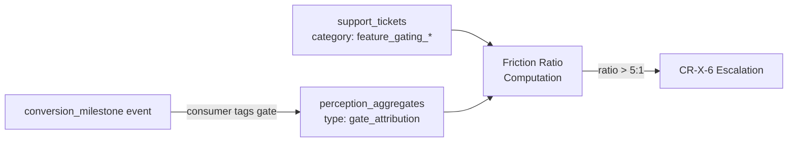

<!-- Part of slice-09-entity-intelligence v2 -->

# Slice 9: Entity Intelligence — Entity Learning & Commercial Intelligence

---

## 5.1 Learning Hypothesis Analysis

Handler: `learning_hypothesis_analysis` deferred action (monthly, self-perpetuating). Queries `decision_logs` by domain and computes measurements for all 7 static hypotheses (L1-L7) in the `learning_hypotheses` table. [Source: Ops CD SS8, `01-schema.md` SS2.5 for table definition, D4 for static-row decision]

### 5.1.1 L1-L7 Measurement Logic

Each hypothesis maps to a specific `decision_logs` query and aggregation. The handler iterates all 7 rows, computes `currentValue`, compares with `previousValue`, and determines `trend`.

```typescript
function analyseLearningHypotheses(): LearningHypothesisAnalysisResult

type LearningHypothesisAnalysisResult = {
  measurements: HypothesisMeasurement[]
  ceremonyRunId: UUID
}

type HypothesisMeasurement = {
  hypothesisId: "L1" | "L2" | "L3" | "L4" | "L5" | "L6" | "L7"
  currentValue: number | null
  previousValue: number | null
  trend: "improving" | "stable" | "declining" | "insufficient_data"
  confoundWarning: string | null
  sampleSize: number
}
```

```
analyseLearningHypotheses():
  measurements = []

  for hypothesis in SELECT * FROM learning_hypotheses:
    measurement = computeMeasurement(hypothesis)
    measurements.push(measurement)

    // Update learning_hypotheses table
    UPDATE learning_hypotheses
    SET previousValue = hypothesis.currentValue,
        currentValue = measurement.currentValue,
        trend = measurement.trend,
        confoundWarning = measurement.confoundWarning,
        lastMeasuredAt = now(),
        updatedAt = now()
    WHERE id = hypothesis.id

  // Log ceremony run
  ceremonyRunId = INSERT INTO ceremony_runs {
    ceremonyType: "learning_hypothesis_analysis",
    startedAt: now(),
    completedAt: now(),
    status: "completed",
    inputsHash: hash(measurements.map(m => m.hypothesisId + m.sampleSize)),
    outputs: { measurements },
    decisionsLogged: 0
  }

  // Self-perpetuating: schedule next monthly run
  scheduleDeferred("learning_hypothesis_analysis", {}, addMonths(now(), 1))

  return { measurements, ceremonyRunId }
```

### 5.1.2 Per-Hypothesis Measurement Queries

| Hypothesis | Query | Computation | Trend Direction |
|------------|-------|-------------|-----------------|
| L1 | `decision_logs WHERE decisionType = "claim_evaluation"` | `(rejections / total)` compared with `decision_logs WHERE decisionType = "onboarding_friction"` count | Improving = rejection rate falls as friction decisions increase |
| L2 | `decision_logs WHERE decisionType = "claim_evaluation" AND outcome = "auto_approve"` vs `decision_logs WHERE decisionType = "onboarding_taxonomy_suggestion"` | Auto-approve rate correlated with taxonomy suggestion count per period | Improving = auto-approve rate rises with suggestion count |
| L3 | `decision_logs WHERE decisionType = "verification_upgrade"` cross-referenced with `credits WHERE sourcingMethod = "client_confirmed"` per listing | Upgrade rate for listings with >2 client-confirmed credits vs those without | Improving = upgrade rate gap widens (confirmed credits predict upgrades) |
| L4 | `support_tickets WHERE category = "feature_gating_confusion"` count per month vs `decision_logs WHERE decisionType = "feature_gate_nudge"` count | Ticket count correlated with education delivery count | Improving = ticket count declines as nudge count increases |
| L5 | `conversion_milestone` events WHERE `trigger = "analytics_tease"` partitioned by view count at time of firing | Conversion rate for fires at <50 views vs >=50 views | Improving = early-fire conversion rate exceeds late-fire |
| L6 | `churn_analysis_log` cross-referenced with `verifications.tier` | Churn rate for `claimed` (unverified) vs `verified` listings | Improving = gap narrows (claimed churn approaches verified) |
| L7 | `task_specs` WHERE `status = "completed"` | Completion time (created to completed) correlated with clarity score (computed from `checklist` length + `acceptanceCriteria` word count) | Improving = completion time falls as clarity score rises |

### 5.1.3 Trend Determination

```
computeTrend(currentValue, previousValue):
  if currentValue is null OR previousValue is null:
    return "insufficient_data"

  delta = currentValue - previousValue
  relativeDelta = abs(delta) / max(abs(previousValue), 0.001)

  if relativeDelta < 0.05:       // <5% change
    return "stable"
  if delta > 0 AND hypothesis.improvingDirection === "up":
    return "improving"
  if delta < 0 AND hypothesis.improvingDirection === "down":
    return "improving"
  return "declining"
```

### 5.1.4 Confound Detection

Confound warnings are populated when external factors may invalidate a measurement.

```
computeConfoundWarning(hypothesis, sampleSize, measurementPeriod):
  // Pattern #15: insufficient sample size
  if sampleSize < 10:
    return "Sample size < 10"

  // Pricing change during measurement period
  // Check decision_logs for pricing_configuration changes within the period
  pricingChanges = SELECT COUNT(*)
                   FROM decision_logs
                   WHERE decisionType IN ("pricing_configuration", "launch_discount_evaluation")
                   AND createdAt BETWEEN measurementPeriod.start AND measurementPeriod.end
  if pricingChanges > 0:
    return "Pricing change during measurement period — correlation may be spurious"

  // Seasonal detection: if measurement period spans December or August
  // (UK broadcast industry low seasons), flag potential seasonal confound
  if measurementPeriod overlaps December OR August:
    return "Seasonal low period — baseline may be depressed"

  return null
```

**Pattern #15 compliance:** When fewer than 10 decision log entries exist for a hypothesis's measurement query, `trend` is set to `"insufficient_data"` and `confoundWarning` is set to `"Sample size < 10"`. The handler never returns empty results or null trends without explanation.

---

## 5.2 Proactive Churn Detection

Handler: `proactive_churn_detection` deferred action (weekly, self-perpetuating). Scans for 2 proactive churn risk signals that S8 deferred. S8 produces 3/5 `ChurnRiskFactor` values reactively (`quality_declining`, `payment_at_risk`, `low_quality_paid`). S9 produces the remaining 2/5 proactively: `engagement_dropping` and `billing_cadence_switch_to_monthly`. [Source: CR SS1.2 for `ChurnRiskDetectedEvent` type, `01-decisions.md` D8 for separate decision type]

```typescript
function proactiveChurnDetection(): ProactiveChurnDetectionResult

type ProactiveChurnDetectionResult = {
  signalsDetected: DetectedChurnSignal[]
  eventsEmitted: number
  decisionsLogged: number
}

type DetectedChurnSignal = {
  listingId: UUID
  accountId: UUID
  factor: "engagement_dropping" | "billing_cadence_switch_to_monthly"
  overallRisk: "low" | "medium" | "high"
  recommendedAction: "none" | "monitor" | "retention_outreach"
  existingFactors: ChurnRiskFactor[]   // from S8's reactive detection
}
```

### 5.2.1 Signal Detection Logic

```
proactiveChurnDetection():
  signalsDetected = []
  eventsEmitted = 0
  decisionsLogged = 0

  // --- Signal 1: engagement_dropping ---
  // Query perception_aggregates for listings with >30% decline in
  // profile views over the last 30 days compared to previous 30 days.
  // Threshold is configurable (default 30%).

  ENGAGEMENT_DROP_THRESHOLD = 0.30  // configurable

  droppingListings = SELECT pa_current.listingId, pa_current.data, pa_previous.data
    FROM perception_aggregates pa_current
    JOIN perception_aggregates pa_previous
      ON pa_current.listingId = pa_previous.listingId
      AND pa_previous.aggregateType = 'viewer_demographics'
      AND pa_previous.periodEnd = pa_current.periodStart
    WHERE pa_current.aggregateType = 'viewer_demographics'
    AND pa_current.periodEnd >= now() - interval '30 days'

  for listing in droppingListings:
    currentViews = listing.pa_current.data.totalViews ?? 0
    previousViews = listing.pa_previous.data.totalViews ?? 0

    if previousViews > 0 AND (previousViews - currentViews) / previousViews > ENGAGEMENT_DROP_THRESHOLD:
      signalsDetected.push({ listingId: listing.listingId, factor: "engagement_dropping" })

  // --- Signal 2: billing_cadence_switch_to_monthly ---
  // Query listings that switched from annual to monthly billing
  // within the last 7 days. Source: billingCadence field on listings table.
  // Cross-reference with churn_analysis_log for recent cadence-change events.

  cadenceSwitchers = SELECT cal.listingId, cal.accountId
    FROM churn_analysis_log cal
    WHERE cal.eventType = 'cadence_change'
    AND cal.createdAt > now() - interval '7 days'
    AND cal.metadata->>'previousCadence' = 'annual'
    AND cal.metadata->>'newCadence' = 'monthly'

  for switcher in cadenceSwitchers:
    signalsDetected.push({ listingId: switcher.listingId, factor: "billing_cadence_switch_to_monthly" })

  // --- Process detected signals ---
  for signal in signalsDetected:
    // Combine with existing S8 reactive factors from churn_risk_registry
    existingEntry = SELECT riskFactors FROM churn_risk_registry
                    WHERE listingId = signal.listingId
                    AND resolvedAt IS NULL

    allFactors = existingEntry
      ? [...existingEntry.riskFactors, signal.factor]
      : [signal.factor]

    // Compute overall risk
    overallRisk = computeOverallRisk(allFactors)

    // Determine recommended action
    recommendedAction = overallRisk === "high"  ? "retention_outreach"
                      : overallRisk === "medium" ? "monitor"
                      : "none"

    signal.overallRisk = overallRisk
    signal.recommendedAction = recommendedAction
    signal.existingFactors = existingEntry?.riskFactors ?? []

    // Log decision for every scan iteration
    logDecision("proactive_churn_detection", {
      listingId: signal.listingId,
      factor: signal.factor,
      overallRisk,
      recommendedAction,
      existingFactors: signal.existingFactors,
      signalDetected: true
    })
    decisionsLogged++

    // Emit churn_risk_detected if risk >= medium
    if overallRisk === "high" OR overallRisk === "medium":
      emit("churn_risk_detected", {
        type: "churn_risk_detected",
        listingId: signal.listingId,
        accountId: signal.accountId,
        riskFactors: allFactors,          // ChurnRiskFactor[] — CR §1.2
        timestamp: now()
      })
      // Note: ChurnRiskDetectedEvent payload per CR §1.2. P1 compliant.
      // accountId and listingId always present (proactive scan targets claimed paid listings only).
      eventsEmitted++

  // Log decision for clean scan (no signals detected)
  if signalsDetected.length === 0:
    logDecision("proactive_churn_detection", {
      factor: null,
      overallRisk: "low",
      recommendedAction: "none",
      signalDetected: false,
      scannedListings: droppingListings.length + cadenceSwitchers.length
    })
    decisionsLogged++

  // Self-perpetuating: schedule next weekly run
  scheduleDeferred("proactive_churn_detection", {}, addDays(now(), 7))

  return { signalsDetected, eventsEmitted, decisionsLogged }
```

### 5.2.2 Overall Risk Computation

```
computeOverallRisk(factors: ChurnRiskFactor[]): "low" | "medium" | "high"
  // Risk escalation: more factors = higher risk.
  // Single signal = medium. Two or more signals = high.
  // Exception: billing_cadence_switch_to_monthly alone = medium (reduced commitment
  // is a leading indicator but not immediately actionable).

  if factors.length === 0:
    return "low"
  if factors.length >= 2:
    return "high"
  // Single factor
  if factors.includes("payment_at_risk"):
    return "high"           // payment risk alone is immediately critical
  return "medium"
```

### 5.2.3 `churn_risk_detected` Emission

Event emission follows CR SS1.2 `ChurnRiskDetectedEvent` payload. [Source: CR interface spec SS1.2, SI SS1 `EventPayloadMap`]

```typescript
// Authoritative in CR §1.2 — summary only
type ChurnRiskDetectedEvent = {
  type: "churn_risk_detected"
  listingId: UUID
  accountId: UUID
  riskFactors: ChurnRiskFactor[]
  timestamp: ISO8601
}
```

**P1 compliance:** All required fields are present. `accountId` is always populated because proactive scanning targets claimed paid listings (which always have an associated account). `riskFactors` combines S8's reactive factors (from `churn_risk_registry`) with S9's proactive detection.

**Consumer chain:** `churn_risk_detected` -> Ops upserts `ChurnRiskRegistry`, elevates ticket priority [CR-X-20]. PP displays proactive quality suggestions on dashboard. [Source: CR SS1.2 consumer table]

---

## 5.3 Sponsored Placement Learning

Handler: `sponsored_placement_learning` deferred action (monthly, self-perpetuating). Analyses decision logs from S8's `sponsored_placement_selection` decisions to calibrate the quality floor and fairness cap parameters. [Resolves S8-5]

```typescript
function sponsoredPlacementLearning(): SponsoredPlacementLearningResult

type SponsoredPlacementLearningResult = {
  qualityFloorAnalysis: {
    totalEligibleListings: number
    excludedByFloor: number
    floorHitRate: number          // excludedByFloor / totalEligibleListings
    recommendation: "lower" | "maintain" | "raise" | "insufficient_data"
  }
  fairnessCapAnalysis: {
    totalServiceAreas: number
    capsActivated: number
    capActivationRate: number     // capsActivated / totalServiceAreas
    recommendation: "tighten" | "maintain" | "loosen" | "insufficient_data"
  }
  ceremonyRunId: UUID
}
```

```
sponsoredPlacementLearning():

  // Query decision logs for sponsored placement decisions in last 30 days
  placementDecisions = SELECT * FROM decision_logs
    WHERE decisionType = "sponsored_placement_selection"
    AND createdAt > now() - interval '30 days'

  // Pattern #15: insufficient data check
  if placementDecisions.length === 0:
    result = {
      qualityFloorAnalysis: { totalEligibleListings: 0, excludedByFloor: 0, floorHitRate: 0, recommendation: "insufficient_data" },
      fairnessCapAnalysis: { totalServiceAreas: 0, capsActivated: 0, capActivationRate: 0, recommendation: "insufficient_data" }
    }
    ceremonyRunId = logCeremonyRun("sponsored_placement_learning", result)
    scheduleDeferred("sponsored_placement_learning", {}, addMonths(now(), 1))
    return { ...result, ceremonyRunId }

  // --- Quality Floor Analysis ---
  // S8 §4 quality floor: composite quality score >= 50 for sponsored eligibility.
  // Count how often the floor excluded otherwise-eligible (paid premium/partner) listings.

  totalEligible = placementDecisions.filter(d => d.context.paidAndEligible).length
  excludedByFloor = placementDecisions.filter(d =>
    d.context.paidAndEligible AND d.context.excludedReason === "quality_below_floor"
  ).length

  floorHitRate = totalEligible > 0 ? excludedByFloor / totalEligible : 0

  // Recommendation: if floor excludes >50% of eligible listings, quality floor is too aggressive
  // If floor excludes <10%, floor may be too lenient (not differentiating quality)
  qualityFloorRecommendation =
    floorHitRate > 0.50 ? "lower" :
    floorHitRate < 0.10 ? "raise" :
    "maintain"

  // --- Fairness Cap Analysis ---
  // S8 §4 fairness cap: max 3x mean impressions per service area.
  // How often was the cap reached?

  serviceAreaDecisions = groupBy(placementDecisions, d => d.context.serviceArea)
  capsActivated = 0

  for [serviceArea, decisions] in serviceAreaDecisions:
    capHits = decisions.filter(d => d.context.fairnessCapReached).length
    if capHits > 0:
      capsActivated++

  capActivationRate = serviceAreaDecisions.size > 0
    ? capsActivated / serviceAreaDecisions.size
    : 0

  // Recommendation: if cap never activates, it may be too generous (no fairness constraint)
  // If cap activates in >80% of service areas, listings are hitting the ceiling too often
  fairnessCapRecommendation =
    capActivationRate === 0   ? "tighten" :
    capActivationRate > 0.80  ? "loosen" :
    "maintain"

  result = {
    qualityFloorAnalysis: { totalEligible, excludedByFloor, floorHitRate, recommendation: qualityFloorRecommendation },
    fairnessCapAnalysis: { totalServiceAreas: serviceAreaDecisions.size, capsActivated, capActivationRate, recommendation: fairnessCapRecommendation }
  }

  // Log ceremony run
  ceremonyRunId = logCeremonyRun("sponsored_placement_learning", result)

  // Self-perpetuating
  scheduleDeferred("sponsored_placement_learning", {}, addMonths(now(), 1))

  return { ...result, ceremonyRunId }
```

**Calibration action:** Recommendations are logged to `ceremony_runs.outputs` and surfaced in the principal briefing (SS4). No auto-application at V1 — the principal reviews recommendations and adjusts thresholds manually. The `ceremony_outcome_evaluation` decision type governs this escalation. [Source: `01-decisions.md` D8]

---

## 5.4 Conversion-Denominated Friction Ratios

Conversion-denominated friction ratios replace S7's V1 total-ticket-based friction calculation with per-gate conversion attribution. [Resolves S7-2/S8-2, enables CR-X-6 5:1 escalation threshold]

### 5.4.1 Per-Gate Conversion Attribution

The `conversion_milestone` event consumer (SS6) tags each conversion with the feature gate that triggered it. This produces a per-gate conversion count that serves as the denominator for friction ratio computation.

```typescript
type GateConversionAttribution = {
  gate: string                    // feature gate name (e.g., "trendAnalytics", "viewerDemographics")
  conversions: number             // conversion_milestone events where this gate was the trigger
  complaints: number              // support tickets with category matching this gate
  frictionRatio: number           // complaints / conversions (0 if conversions === 0)
}
```

**Data flow:**



### 5.4.2 Computation

Friction ratio computation is part of the `conversion_funnel_analysis` ceremony (SS4) — not a separate deferred action. The ceremony calls Ops `getFeatureGateFrictionSummary(period)` [Source: Ops interface SS3.4] for ticket counts and combines with conversion attribution from `perception_aggregates`.

```
computeFrictionRatios(period: YearMonth):
  // Get ticket-based friction from Ops
  frictionSummary = getFeatureGateFrictionSummary(period)
  // Returns FeatureGateFrictionSummary with per-gate ticketCount [Source: Ops §3.4]

  // Get per-gate conversion attribution from perception_aggregates
  conversionData = SELECT data FROM perception_aggregates
    WHERE aggregateType = 'gate_attribution'
    AND periodStart <= period.start AND periodEnd >= period.end

  ratios: GateConversionAttribution[] = []

  for gate in frictionSummary.gates:
    gateConversions = conversionData?.data?.gates?.[gate.gateName]?.conversions ?? 0
    frictionRatio = gateConversions > 0
      ? gate.ticketCount / gateConversions
      : gate.ticketCount > 0 ? Infinity : 0

    ratios.push({
      gate: gate.gateName,
      conversions: gateConversions,
      complaints: gate.ticketCount,
      frictionRatio
    })

  // CR-X-6 escalation check: 5:1 ratio triggers principal review
  for ratio in ratios:
    if ratio.frictionRatio > 5.0:
      logDecision("conversion_threshold_adjustment", {
        gate: ratio.gate,
        frictionRatio: ratio.frictionRatio,
        conversions: ratio.conversions,
        complaints: ratio.complaints,
        recommendation: "escalate_to_principal",
        reason: "Friction ratio exceeds 5:1 threshold"
      })

  return ratios
```

### 5.4.3 `conversion_milestone` Consumer Attribution

The `conversion_milestone` event consumer (SS6) extracts the triggering gate from the event payload and writes attribution data to `perception_aggregates`.

```
// In conversion_milestone consumer handler (§6 is authoritative for handler code)
onConversionMilestone(event: ConversionMilestoneEvent):
  // ... other consumer logic (trigger effectiveness, etc.)

  // Extract triggering gate from event context
  // The conversion_milestone event is emitted by S8's trigger engine.
  // S8 §1 trigger evaluation includes the gate name in the emission context.
  // The conversion milestone event does not carry the triggering feature gate.
  // Gate-level conversion attribution requires correlating the milestone with
  // the conversion trigger that fired before it (from conversion_trigger_evaluation
  // decision logs). [S9-ST-7]
  triggerDecision = SELECT * FROM decision_logs
    WHERE decisionType = "conversion_trigger_evaluation"
    AND inputs->>'listingId' = event.listingId
    AND created_at < event.timestamp
    ORDER BY created_at DESC LIMIT 1

  triggerGate = triggerDecision?.inputs?.triggerType ?? "organic"

  // Upsert gate attribution aggregate for current period
  UPSERT perception_aggregates
    SET data = jsonb_set(data, ['gates', triggerGate, 'conversions'], COALESCE(data->'gates'->triggerGate->'conversions', '0')::int + 1)
    WHERE listingId = event.listingId
    AND aggregateType = 'gate_attribution'
    AND periodStart = currentMonthStart()

  // Note: §6 (event consumers) is authoritative for this handler code.
  // This section describes the business logic the consumer invokes.
```

---

## 5.5 Revenue Health Extended

Handler: `revenue_health_extended` deferred action (monthly, self-perpetuating). Extends S8's V1 `RevenuePerception` type (8 fields) with 8 additional fields that require richer analytical computation. [Resolves S8-1]

Per D5: single `RevenuePerception` type with optional fields. S9 populates the fields S8 left null. No type versioning. [Source: `01-decisions.md` D5, CR interface SS6, S8 SS5.2 for V1 type]

### 5.5.1 Extended Fields

```typescript
// S9 extension fields — optional on RevenuePerception until first revenue_health_extended run.
// Authoritative base type: S8 §5.2 (8 V1 fields). S9 adds:

type RevenuePerceptionS9Extensions = {
  churnByTier: Record<SubscriptionTier, number>       // per-tier churn rate (%)
  annualRenewalRate: number                            // annual subscriptions renewed / eligible (%)
  ltv: number                                          // avg revenue per account × (1 / monthly churn rate) (GBP)
  cac: number                                          // £0 at V1 (organic only, no paid acquisition)
  discountCohortDivergence: number                     // churn rate divergence: discounted vs full-price (%)
  downgradeToPaidChurnRatio: number                    // downgrade rate vs full churn rate (ratio)
  averageSubscriptionLifetimeDays: number              // median days from subscription start to end
  secondaryListingChurnRate: number                    // churn rate for 2nd+ listings on same account (%)
}
```

### 5.5.2 Computation

```
revenueHealthExtended():

  // --- churnByTier ---
  // Per-tier churn rate from churn_analysis_log grouped by subscription_tier.
  churnByTier = {}
  for tier in ["standard", "premium", "partner"]:
    churnEvents = SELECT COUNT(*) FROM churn_analysis_log
      WHERE eventType = 'churn'
      AND subscriptionTier = tier
      AND createdAt > now() - interval '30 days'

    activeAtPeriodStart = SELECT COUNT(*) FROM listings
      WHERE subscriptionTier = tier
      AND lifecycleStatus = 'active'

    churnByTier[tier] = activeAtPeriodStart > 0
      ? (churnEvents / activeAtPeriodStart) * 100
      : 0
  churnByTier["free"] = 0  // free tier has no churn by definition

  // --- annualRenewalRate ---
  // Annual subscriptions renewed / annual subscriptions eligible for renewal.
  // "Eligible" = annual subscriptions whose anniversary date fell within the last 30 days.
  // "Renewed" = eligible that are still active (not in churn_analysis_log with eventType = 'churn').

  eligibleForRenewal = SELECT COUNT(*) FROM listings
    WHERE billingCadence = 'annual'
    AND subscriptionTier != 'free'
    AND subscriptionStartDate IS NOT NULL
    AND date_part('month', subscriptionStartDate) = date_part('month', now() - interval '30 days')
    AND date_part('day', subscriptionStartDate) <= date_part('day', now())

  renewedCount = eligibleForRenewal - (
    SELECT COUNT(*) FROM churn_analysis_log
    WHERE eventType = 'churn'
    AND metadata->>'billingCadence' = 'annual'
    AND createdAt > now() - interval '30 days'
  )

  annualRenewalRate = eligibleForRenewal > 0
    ? (renewedCount / eligibleForRenewal) * 100
    : 0  // no eligible renewals this period

  // --- ltv ---
  // Average revenue per account x (1 / monthly churn rate).
  // Uses S8's V1 averageRevenuePerListing and churnRate30d from commercial_state.

  commercialState = SELECT * FROM commercial_state ORDER BY updatedAt DESC LIMIT 1
  monthlyChurnRate = commercialState.churnRate30d / 100  // convert percentage to decimal
  avgRevenue = commercialState.averageRevenuePerListing

  ltv = monthlyChurnRate > 0
    ? avgRevenue * (1 / monthlyChurnRate)
    : avgRevenue * 120  // cap at 10 years if churn rate is 0

  // --- cac ---
  // £0 at V1 (organic only, no paid acquisition). Placeholder for post-launch.
  cac = 0

  // --- discountCohortDivergence ---
  // Churn rate of discounted accounts vs full-price accounts.
  // Discounted accounts identified by launch_discount flag on commercial_state or listings.

  discountedChurn = SELECT COUNT(*) FROM churn_analysis_log
    WHERE eventType = 'churn'
    AND metadata->>'launchDiscount' = 'true'
    AND createdAt > now() - interval '90 days'

  discountedActive = SELECT COUNT(*) FROM listings
    WHERE metadata->>'launchDiscount' = 'true'
    AND subscriptionTier != 'free'
    AND lifecycleStatus = 'active'

  fullPriceChurn = SELECT COUNT(*) FROM churn_analysis_log
    WHERE eventType = 'churn'
    AND (metadata->>'launchDiscount' IS NULL OR metadata->>'launchDiscount' = 'false')
    AND createdAt > now() - interval '90 days'

  fullPriceActive = SELECT COUNT(*) FROM listings
    WHERE (metadata->>'launchDiscount' IS NULL OR metadata->>'launchDiscount' = 'false')
    AND subscriptionTier != 'free'
    AND lifecycleStatus = 'active'

  discountedChurnRate = discountedActive > 0 ? discountedChurn / discountedActive : 0
  fullPriceChurnRate = fullPriceActive > 0 ? fullPriceChurn / fullPriceActive : 0
  discountCohortDivergence = (discountedChurnRate - fullPriceChurnRate) * 100

  // --- downgradeToPaidChurnRatio ---
  // Downgrade rate vs full churn rate.
  // "Soft churn" indicator: how many leave by downgrading vs cancelling entirely.

  downgrades90d = SELECT COUNT(*) FROM churn_analysis_log
    WHERE eventType = 'downgrade'
    AND createdAt > now() - interval '90 days'

  fullChurn90d = SELECT COUNT(*) FROM churn_analysis_log
    WHERE eventType = 'churn'
    AND createdAt > now() - interval '90 days'

  downgradeToPaidChurnRatio = fullChurn90d > 0
    ? downgrades90d / fullChurn90d
    : 0

  // --- averageSubscriptionLifetimeDays ---
  // Median days from subscription start to end, computed from churn_analysis_log.

  lifetimes = SELECT EXTRACT(EPOCH FROM (createdAt - metadata->>'subscriptionStartDate'::timestamp)) / 86400 as days
    FROM churn_analysis_log
    WHERE eventType = 'churn'
    AND metadata->>'subscriptionStartDate' IS NOT NULL
    ORDER BY days

  averageSubscriptionLifetimeDays = lifetimes.length > 0
    ? median(lifetimes)
    : 0

  // --- secondaryListingChurnRate ---
  // Churn rate for 2nd+ listings on the same account.
  // Identifies multi-listing accounts and their secondary listing churn.

  multiListingAccounts = SELECT accountId, COUNT(*) as listingCount
    FROM listings
    WHERE accountId IS NOT NULL AND subscriptionTier != 'free'
    GROUP BY accountId
    HAVING COUNT(*) > 1

  secondaryChurnEvents = SELECT COUNT(*) FROM churn_analysis_log cal
    WHERE cal.eventType = 'churn'
    AND cal.accountId IN (SELECT accountId FROM multiListingAccounts)
    AND cal.createdAt > now() - interval '90 days'

  totalSecondaryListings = SELECT SUM(listingCount - 1)
    FROM multiListingAccounts

  secondaryListingChurnRate = totalSecondaryListings > 0
    ? (secondaryChurnEvents / totalSecondaryListings) * 100
    : 0

  // --- Write extended fields ---
  // Per D5: update the same commercial_state / RevenuePerception store that S8 writes.
  // S9 populates the optional fields. S8's V1 fields remain authoritative for their values.

  UPDATE commercial_state
  SET churnByTier = churnByTier,
      annualRenewalRate = annualRenewalRate,
      ltv = ltv,
      cac = cac,
      discountCohortDivergence = discountCohortDivergence,
      downgradeToPaidChurnRatio = downgradeToPaidChurnRatio,
      averageSubscriptionLifetimeDays = averageSubscriptionLifetimeDays,
      secondaryListingChurnRate = secondaryListingChurnRate,
      updatedAt = now()

  // Log ceremony run
  ceremonyRunId = logCeremonyRun("revenue_review", {
    churnByTier, annualRenewalRate, ltv, cac,
    discountCohortDivergence, downgradeToPaidChurnRatio,
    averageSubscriptionLifetimeDays, secondaryListingChurnRate
  })

  // Self-perpetuating
  scheduleDeferred("revenue_health_extended", {}, addMonths(now(), 1))
```

### 5.5.3 Admin Route Surface

The `admin.intelligence.revenueHealth` route (router plan SS2.1) computes S8's V1 fields on-demand and reads S9's extended fields from `commercial_state`. S9 fields are `null` until the first `revenue_health_extended` run completes. The extended `RevenuePerception` type is documented in router plan SS2.2.

---

## 5.6 Operational Health Review

Handler: `operational_health_review` deferred action (monthly, self-perpetuating). Aggregates cross-domain operational signals into an `OperationalHealthReport` consumed by the principal briefing generation ceremony (SS4).

```typescript
type OperationalHealthReport = {
  hypotheses: {
    id: string
    trend: string
    confoundWarning: string | null
  }[]
  supportTicketTrends: {
    openCount: number
    closedCount: number
    avgResolutionDays: number
    topCategories: { category: string; count: number }[]
  }
  taskCompletionRates: {
    totalTasks: number
    completedTasks: number
    completionRate: number
    avgCompletionDays: number
  }
  signalSummary: {
    decisionLogsThisPeriod: number
    escalationsThisPeriod: number
    ceremonyRunsThisPeriod: number
  }
}
```

```
operationalHealthReview():

  // L1-L7 hypothesis summary from learning_hypotheses table
  hypotheses = SELECT id, trend, confoundWarning FROM learning_hypotheses

  // Support ticket trends from support_tickets (S7 schema)
  supportTicketTrends = {
    openCount: SELECT COUNT(*) FROM support_tickets WHERE status = 'open',
    closedCount: SELECT COUNT(*) FROM support_tickets
      WHERE status = 'closed' AND closedAt > now() - interval '30 days',
    avgResolutionDays: SELECT AVG(EXTRACT(EPOCH FROM (closedAt - createdAt)) / 86400)
      FROM support_tickets WHERE status = 'closed' AND closedAt > now() - interval '30 days',
    topCategories: SELECT category, COUNT(*) as count FROM support_tickets
      WHERE createdAt > now() - interval '30 days'
      GROUP BY category ORDER BY count DESC LIMIT 5
  }

  // Task completion rates from task_specs (S7 schema)
  taskCompletionRates = {
    totalTasks: SELECT COUNT(*) FROM task_specs
      WHERE createdAt > now() - interval '30 days',
    completedTasks: SELECT COUNT(*) FROM task_specs
      WHERE status = 'completed' AND completedAt > now() - interval '30 days',
    completionRate: completedTasks / max(totalTasks, 1),
    avgCompletionDays: SELECT AVG(EXTRACT(EPOCH FROM (completedAt - createdAt)) / 86400)
      FROM task_specs WHERE status = 'completed' AND completedAt > now() - interval '30 days'
  }

  // Signal history from decision_logs
  signalSummary = {
    decisionLogsThisPeriod: SELECT COUNT(*) FROM decision_logs
      WHERE createdAt > now() - interval '30 days',
    escalationsThisPeriod: SELECT COUNT(*) FROM decision_logs
      WHERE createdAt > now() - interval '30 days'
      AND outcome LIKE '%escalat%',
    ceremonyRunsThisPeriod: SELECT COUNT(*) FROM ceremony_runs
      WHERE startedAt > now() - interval '30 days'
  }

  report: OperationalHealthReport = {
    hypotheses, supportTicketTrends, taskCompletionRates, signalSummary
  }

  // Log ceremony run
  logCeremonyRun("operational_health_review", report)

  // Self-perpetuating
  scheduleDeferred("operational_health_review", {}, addMonths(now(), 1))

  return report
```

**Consumer:** Principal briefing generation ceremony (SS4) reads the most recent `ceremony_runs` entry for `"operational_health_review"` and incorporates it into the `PrincipalBriefing.operationalHealth` section.

---

## 5.7 Contractor Performance Review

Handler: `contractor_performance_review` deferred action (quarterly, self-perpetuating). Computes per-contractor performance metrics from `task_specs` (S7 schema). [Source: Ops CD SS9]

```typescript
type ContractorPerformanceReport = {
  contractors: ContractorMetrics[]
  periodStart: ISO8601
  periodEnd: ISO8601
  insufficientData: boolean
}

type ContractorMetrics = {
  contractorId: string
  tasksAssigned: number
  tasksCompleted: number
  completionRate: number
  avgCompletionDays: number
  qualityScore: number            // AC pass rate: acceptance criteria met / total AC
  avgCostPerTask: number          // from task_specs.cost field
}
```

```
contractorPerformanceReview():

  completedTasks = SELECT * FROM task_specs
    WHERE status = 'completed'
    AND completedAt > now() - interval '90 days'

  // Pattern #15: insufficient data check
  if completedTasks.length === 0:
    result = { contractors: [], periodStart: now() - 90d, periodEnd: now(), insufficientData: true }
    logCeremonyRun("contractor_performance_review", result)
    scheduleDeferred("contractor_performance_review", {}, addMonths(now(), 3))
    return result

  // Group by assignee (contractor identifier)
  grouped = groupBy(completedTasks, t => t.assigneeId)

  contractors: ContractorMetrics[] = []
  for [contractorId, tasks] in grouped:
    totalAssigned = SELECT COUNT(*) FROM task_specs
      WHERE assigneeId = contractorId
      AND createdAt > now() - interval '90 days'

    completed = tasks.length
    completionRate = completed / max(totalAssigned, 1)
    avgCompletionDays = avg(tasks.map(t =>
      (t.completedAt - t.createdAt) / 86400000
    ))
    // Quality score: ratio of acceptance criteria passed
    qualityScore = avg(tasks.map(t =>
      t.acceptanceCriteriaMet / max(t.acceptanceCriteriaTotal, 1)
    ))
    avgCostPerTask = avg(tasks.map(t => t.cost ?? 0))

    contractors.push({
      contractorId,
      tasksAssigned: totalAssigned,
      tasksCompleted: completed,
      completionRate,
      avgCompletionDays,
      qualityScore,
      avgCostPerTask
    })

  result = {
    contractors,
    periodStart: now() - 90 days,
    periodEnd: now(),
    insufficientData: false
  }

  // Log ceremony run
  logCeremonyRun("contractor_performance_review", result)

  // Self-perpetuating: next quarterly run
  scheduleDeferred("contractor_performance_review", {}, addMonths(now(), 3))

  return result
```

**Consumer:** Principal briefing generation ceremony (SS4) incorporates contractor performance into the briefing's operational section.

---

## 5.8 Acceptance Criteria

| # | Criterion | Test Type |
|---|-----------|-----------|
| AC-1 | `learning_hypothesis_analysis` handler updates all 7 rows (`L1`-`L7`) in `learning_hypotheses` table with `currentValue`, `previousValue`, `trend`, and `lastMeasuredAt`. | Integration test: seed 7 rows with known `currentValue`, run handler, verify `previousValue` = old `currentValue` and new `currentValue` is computed. |
| AC-2 | `learning_hypothesis_analysis` sets `trend = "insufficient_data"` and `confoundWarning = "Sample size < 10"` when fewer than 10 `decision_logs` entries exist for a hypothesis's measurement query. (Pattern #15) | Unit test: seed 5 decision log entries for L1. Run handler. Verify L1.trend = "insufficient_data" and L1.confoundWarning = "Sample size < 10". |
| AC-3 | `proactive_churn_detection` detects `engagement_dropping` signal when a listing's profile views decline by >30% over 30 days compared to previous 30 days. | Integration test: seed perception_aggregates with 100 views (previous period) and 60 views (current period). Run handler. Verify signal detected for that listing. |
| AC-4 | `proactive_churn_detection` detects `billing_cadence_switch_to_monthly` signal when an account switches from annual to monthly billing within the last 7 days. | Integration test: insert churn_analysis_log entry with eventType = "cadence_change", previousCadence = "annual", newCadence = "monthly", createdAt = 3 days ago. Run handler. Verify signal detected. |
| AC-5 | `proactive_churn_detection` emits `churn_risk_detected` event with payload conforming to CR SS1.2 (`listingId`, `accountId`, `riskFactors: ChurnRiskFactor[]`, `timestamp`) when computed `overallRisk >= "medium"`. | Integration test: trigger engagement_dropping signal. Verify emitted event has all required fields and `riskFactors` includes `"engagement_dropping"`. |
| AC-6 | `proactive_churn_detection` does NOT emit `churn_risk_detected` when `overallRisk === "low"`. | Unit test: single factor detection with overallRisk = "low". Verify no event emission. |
| AC-7 | `proactive_churn_detection` logs decision via `logDecision("proactive_churn_detection", ...)` for every handler invocation (both signal-detected and clean-scan cases). | Integration test: run handler with 0 signals detected. Verify decision_logs entry with `decisionType = "proactive_churn_detection"` and `signalDetected = false`. Run again with 1 signal. Verify entry with `signalDetected = true`. |
| AC-8 | `conversion_funnel_analysis` computes per-gate friction ratio as `(complaints per gate) / (conversions per gate)` using Ops `getFeatureGateFrictionSummary` ticket counts and `perception_aggregates` conversion attribution. | Unit test: seed 10 tickets and 2 conversions for gate "trendAnalytics". Verify friction ratio = 5.0. |
| AC-9 | Friction ratio exceeding 5:1 threshold triggers `logDecision("conversion_threshold_adjustment", ...)` with escalation recommendation. (CR-X-6) | Unit test: gate with 6 complaints and 1 conversion (ratio 6.0). Verify decision log entry with `recommendation = "escalate_to_principal"`. |
| AC-10 | `revenue_health_extended` computes all 8 S9 extension fields (`churnByTier`, `annualRenewalRate`, `ltv`, `cac`, `discountCohortDivergence`, `downgradeToPaidChurnRatio`, `averageSubscriptionLifetimeDays`, `secondaryListingChurnRate`) and writes them to `commercial_state`. | Integration test: seed churn_analysis_log and listings with known data. Run handler. Verify all 8 fields populated in commercial_state with correct values. |
| AC-11 | `revenue_health_extended` sets `cac = 0` (V1 placeholder — organic only, no paid acquisition). | Unit test: verify cac field is always 0 regardless of input data. |
| AC-12 | `sponsored_placement_learning` returns `recommendation: "insufficient_data"` for both analyses when no `sponsored_placement_selection` decision logs exist. (Pattern #15) | Unit test: empty decision_logs table. Run handler. Verify both qualityFloorAnalysis.recommendation and fairnessCapAnalysis.recommendation = "insufficient_data". |
| AC-13 | `operational_health_review` aggregates L1-L7 hypothesis summary, support ticket trends (open/closed/avg resolution/top categories), and task completion rates into `OperationalHealthReport`. | Integration test: seed learning_hypotheses, support_tickets, task_specs. Run handler. Verify report contains non-null values for all sections. |
| AC-14 | `contractor_performance_review` returns `insufficientData: true` when no completed task_specs exist in the quarter. (Pattern #15) | Unit test: empty task_specs table. Run handler. Verify result.insufficientData = true and result.contractors = []. |
| AC-15 | `learning_hypothesis_analysis` logs ceremony run to `ceremony_runs` table with `ceremonyType = "learning_hypothesis_analysis"`, full measurement output in `outputs` JSONB, and correct `inputsHash`. | Integration test: run handler. Verify ceremony_runs row exists with correct ceremonyType and outputs containing all 7 hypothesis measurements. |

**Total: 15 acceptance criteria.**

---

## Cross-References

| Document | Relationship |
|----------|-------------|
| `commercial-and-revenue.md` (v3 interface) SS1.2 | `ChurnRiskDetectedEvent` payload type — authoritative for proactive emission (SS5.2) |
| `commercial-and-revenue.md` (v3 interface) SS4.1 | `TierLimits` — consumed by conversion attribution for gate identification |
| `commercial-and-revenue.md` (v3 interface) SS5 | `ChurnRiskFactor` type — S9 produces 2/5 values proactively |
| `operations.md` (v4 interface) SS3.4 | `getFeatureGateFrictionSummary` — consumed by friction ratio computation (SS5.4) |
| `shared-infrastructure.md` (v8) SS9.2 | `logDecision()` — 2 decision types: `proactive_churn_detection`, `conversion_threshold_adjustment` |
| `shared-infrastructure.md` (v8) SS2.1 | `DeferredActionParamsMap` — 5 handlers in this section (`learning_hypothesis_analysis`, `proactive_churn_detection`, `sponsored_placement_learning`, `revenue_health_extended`, `operational_health_review`, `contractor_performance_review`) |
| `01-schema.md` SS2.4 | `ceremony_runs` table — all handlers log ceremony execution |
| `01-schema.md` SS2.5 | `learning_hypotheses` table — 7 static rows updated by SS5.1 |
| `01-decisions.md` D4 | Static row decision for `learning_hypotheses` |
| `01-decisions.md` D5 | Single `RevenuePerception` type with optional fields |
| `01-decisions.md` D8 | `proactive_churn_detection` separate from `churn_intervention` |
| `slices/slice-08-commercial/04-revenue-perception.md` SS5.2 | S8 V1 `RevenuePerception` type (8 fields) — S9 extends with 8 optional fields |
| `slices/slice-08-commercial/index.md` SS11-SS12 | S8 event consumers and deferred actions — context for S9's incremental additions |
