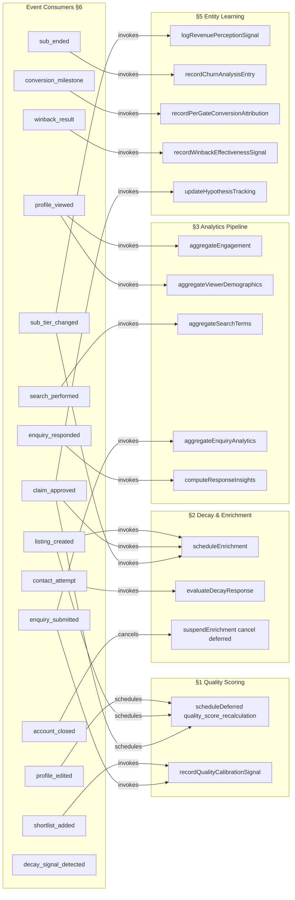

<!-- Part of slice-09-entity-intelligence v2 -->

# Slice 9: Entity Intelligence — Event Consumer Implementations

---

## Overview

S9 registers 15 new async consumer handlers in `EVENT_CONSUMER_MATRIX`. These consumers ingest perception signals from D&L, CR, and Ops events, routing them to §1–§5 decision architectures for quality scoring, decay detection, analytics aggregation, ceremony data, and entity learning. All 15 are `mode: "async"` — S9 performs no action a user waits on within their HTTP response.

Every handler follows SI §1.5 error capture: try/catch wrapping, structured `EventConsumerError` logging on failure, no exception propagation to emitter. [Source: shared-infrastructure.md — §1.5]

Handler code lives in `src/server/consumers/intelligence/*.ts` — one file per event. [Source: 01-router-plan.md — §4]

---

## 6.1 D&L Intelligence Consumers (8)

### 6.1.1 `profile_edited` → Quality Score Recalculation

| Field | Value |
|-------|-------|
| **Event** | `profile_edited` |
| **Consumer ID** | `intelligence:profile_edited:qualityRecalc` |
| **Mode** | `async` |
| **Domain** | D&L (S9) |
| **Handler module** | `src/server/consumers/intelligence/profile-edited.ts` |

**Handler pseudocode:**

```typescript
// Authoritative payload: PP §1.7 ProfileEditedEvent
// Authoritative function: §1 scheduleDeferred, §1 freshness reset

async function handleProfileEditedQualityRecalc(
  event: ProfileEditedEvent
): Promise<void> {
  try {
    // Schedule quality recalculation via deferred action (§1 owns scoring logic)
    await scheduleDeferred("quality_score_recalculation", {
      listingId: event.listingId,
    })

    // Reset freshness timestamp — profile edit proves active maintenance
    await db.update(qualityScores)
      .set({ lastCalculated: new Date().toISOString() })
      .where(eq(qualityScores.listingId, event.listingId))
  } catch (error) {
    logConsumerError({
      eventType: "profile_edited",
      consumerId: "intelligence:profile_edited:qualityRecalc",
      payload: event,
      error: error.message,
      stack: error.stack,
      mode: "async",
    })
  }
}
```

**Cross-domain reads:** None.

**Event emissions:** None (deferred action handler in §1 emits `quality_score_changed` if band boundary crossed).

---

### 6.1.2 `listing_created` → Initial Quality + Enrichment

| Field | Value |
|-------|-------|
| **Event** | `listing_created` |
| **Consumer ID** | `intelligence:listing_created:initialQuality` |
| **Mode** | `async` |
| **Domain** | D&L (S9) |
| **Handler module** | `src/server/consumers/intelligence/listing-created.ts` |

**Handler pseudocode:**

```typescript
// Authoritative payload: PP §1.6 ListingCreatedEvent
// Authoritative functions: §1 scheduleDeferred (quality), §2 scheduleEnrichment + computeCadenceTier

async function handleListingCreatedInitialQuality(
  event: ListingCreatedEvent
): Promise<void> {
  try {
    // Schedule initial quality score computation (§1)
    // First run sets calculatedBy = "calibrated" on quality_scores row
    await scheduleDeferred("quality_score_recalculation", {
      listingId: event.listingId,
    })

    // Determine enrichment cadence from subscription tier
    // New listings start at free tier → cadenceTier = "unclaimed"
    const cadenceTier = computeCadenceTier("free") // §2 — new listing defaults to free tier

    // Schedule enrichment checks for all check types (§2)
    await scheduleEnrichment(event.listingId, cadenceTier)
  } catch (error) {
    logConsumerError({
      eventType: "listing_created",
      consumerId: "intelligence:listing_created:initialQuality",
      payload: event,
      error: error.message,
      stack: error.stack,
      mode: "async",
    })
  }
}
```

**Cross-domain reads:** None.

**Event emissions:** None directly. Deferred action handler (§1) emits `quality_score_changed` after initial score computation.

---

### 6.1.3 `claim_approved` → Quality Upgrade + Enrichment + Hypothesis Tracking

| Field | Value |
|-------|-------|
| **Event** | `claim_approved` |
| **Consumer ID** | `intelligence:claim_approved:qualityUpgrade` |
| **Mode** | `async` |
| **Domain** | D&L (S9) |
| **Handler module** | `src/server/consumers/intelligence/claim-approved.ts` |

**Handler pseudocode:**

```typescript
// Authoritative payload: D&L §1.1 ClaimApprovedEvent
// Authoritative functions: §1 scheduleDeferred (quality), §2 scheduleEnrichment, §5 updateHypothesisTracking

async function handleClaimApprovedQualityUpgrade(
  event: ClaimApprovedEvent
): Promise<void> {
  try {
    // Trigger quality recalculation — §1 scoring adds +5 for verification dimension
    // when verification tier transitions from unclaimed to claimed
    await scheduleDeferred("quality_score_recalculation", {
      listingId: event.listingId,
    })

    // Upgrade enrichment cadence to "claimed" tier (§2)
    // Replaces "unclaimed" schedule with fortnightly liveness, semi-annual full cycle
    await scheduleEnrichment(event.listingId, "claimed")

    // Update L2/L3 hypothesis tracking data (§5)
    // L2: claim approval rate vs taxonomy suggestion quality
    // L3: verification upgrade rate vs client-confirmed credits
    await updateHypothesisTracking(event.listingId, event.method, {
      hypothesisIds: ["L2", "L3"],
      eventType: "claim_approved",
      timestamp: event.timestamp,
    })
  } catch (error) {
    logConsumerError({
      eventType: "claim_approved",
      consumerId: "intelligence:claim_approved:qualityUpgrade",
      payload: event,
      error: error.message,
      stack: error.stack,
      mode: "async",
    })
  }
}
```

**Cross-domain reads:** None. `event.method` provides claim context (P1).

**Event emissions:** None directly. §1 deferred action emits `quality_score_changed` if band boundary crossed.

---

### 6.1.4 `profile_viewed` → Engagement Aggregation

| Field | Value |
|-------|-------|
| **Event** | `profile_viewed` |
| **Consumer ID** | `intelligence:profile_viewed:engagement` |
| **Mode** | `async` |
| **Domain** | D&L (S9) |
| **Handler module** | `src/server/consumers/intelligence/profile-viewed.ts` |

**Handler pseudocode:**

```typescript
// Authoritative payload: PP §1.2 ProfileViewedEvent
// Authoritative functions: §1 deduplication check, §3 aggregateEngagement, §3 aggregateViewerDemographics

async function handleProfileViewedEngagement(
  event: ProfileViewedEvent
): Promise<void> {
  try {
    // P2 deduplication: same viewer + same listing within 1 hour = single count
    // Check perception_aggregates or use time-window dedup
    // ProfileViewedEvent has: listingId, source, timestamp, viewerAccountId? [S9-ST-2]
    // Dedup key: hash(event.listingId + event.viewerAccountId + hourBucket(event.timestamp))
    // viewerAccountId is optional on the payload — when absent, skip dedup (anonymous views)
    const isDuplicate = event.viewerAccountId
      ? await checkViewDeduplication(
          event.listingId,
          event.viewerAccountId,
          event.timestamp // §1 — 1-hour window
        )
      : false

    if (isDuplicate) return

    // Record dedup marker for future checks
    if (event.viewerAccountId) {
      await recordViewDeduplicationMarker(
        event.listingId,
        event.viewerAccountId,
        event.timestamp
      )
    }

    // §3: Update engagement trend in perception_aggregates
    await aggregateEngagement(event.listingId, {
      type: "profile_view",
      source: event.source,
      timestamp: event.timestamp,
    })

    // §3: Update viewer demographics aggregation (entity type, sector, location distribution)
    await aggregateViewerDemographics(event.listingId, event.timestamp)
  } catch (error) {
    logConsumerError({
      eventType: "profile_viewed",
      consumerId: "intelligence:profile_viewed:engagement",
      payload: event,
      error: error.message,
      stack: error.stack,
      mode: "async",
    })
  }
}
```

**Cross-domain reads:** None. Viewer demographics are bucketed from event metadata, not cross-domain queries.

**Event emissions:** None.

**P2 note:** Deduplication uses a time-window check against previously recorded view markers. The marker storage is an implementation detail (in-memory cache with TTL or lightweight DB check against a recent-views index). At V1 scale (~200 events/day), a simple DB check on `(listingId, viewerAccountId, timestamp > now - 1h)` is adequate. [S9-ST-2]

---

### 6.1.5 `search_performed` → Search Analytics

| Field | Value |
|-------|-------|
| **Event** | `search_performed` |
| **Consumer ID** | `intelligence:search_performed:searchAnalytics` |
| **Mode** | `async` |
| **Domain** | D&L (S9) |
| **Handler module** | `src/server/consumers/intelligence/search-performed.ts` |

**Handler pseudocode:**

```typescript
// Authoritative payload: PP §1.1 SearchPerformedEvent
// Authoritative functions: §3 aggregateSearchTerms, §3 detectZeroResults, §3 checkTaxonomyGap

async function handleSearchPerformedAnalytics(
  event: SearchPerformedEvent
): Promise<void> {
  try {
    // §3: Update search term frequency aggregates in perception_aggregates
    await aggregateSearchTerms(event.query, event.filters, event.timestamp)

    // §3: Zero-result detection — flag queries that returned no results
    if (event.resultCount === 0) {
      await detectZeroResults(event.query, event.filters, event.timestamp)
    }

    // §3: Taxonomy gap identification — common search terms not covered by taxonomy
    await checkTaxonomyGap(event.query, event.filters)
  } catch (error) {
    logConsumerError({
      eventType: "search_performed",
      consumerId: "intelligence:search_performed:searchAnalytics",
      payload: event,
      error: error.message,
      stack: error.stack,
      mode: "async",
    })
  }
}
```

**Cross-domain reads:** None. Event payload provides `query`, `filters`, `resultCount` (P1).

**Event emissions:** None. Aggregated data surfaces via `perception_aggregates` table reads.

---

### 6.1.6 `shortlist_added` → Quality Calibration Signal

| Field | Value |
|-------|-------|
| **Event** | `shortlist_added` |
| **Consumer ID** | `intelligence:shortlist_added:qualitySignal` |
| **Mode** | `async` |
| **Domain** | D&L (S9) |
| **Handler module** | `src/server/consumers/intelligence/shortlist-added.ts` |

**Handler pseudocode:**

```typescript
// Authoritative payload: PP §1.5 ShortlistAddedEvent
// Authoritative function: §1 recordQualityCalibrationSignal

async function handleShortlistAddedQualitySignal(
  event: ShortlistAddedEvent
): Promise<void> {
  try {
    // §1: Record shortlist as positive perception signal for quality calibration
    // Shortlisting indicates buyer considers this listing relevant — feeds into
    // richness/engagement weighting in computeQualityScore
    await recordQualityCalibrationSignal(event.listingId, {
      signalType: "shortlist_added",
      timestamp: event.timestamp,
    })
  } catch (error) {
    logConsumerError({
      eventType: "shortlist_added",
      consumerId: "intelligence:shortlist_added:qualitySignal",
      payload: event,
      error: error.message,
      stack: error.stack,
      mode: "async",
    })
  }
}
```

**Cross-domain reads:** None.

**Event emissions:** None. Signal is stored for next quality score recalculation cycle.

**Note:** `shortlist_added` had no cross-domain consumers prior to S9 (PP §1.5: "No cross-domain consumers. Domain-internal signal only."). S9 adds the first intelligence consumer.

---

### 6.1.7 `contact_attempt` → Unreachable Detection

| Field | Value |
|-------|-------|
| **Event** | `contact_attempt` |
| **Consumer ID** | `intelligence:contact_attempt:unreachableDetection` |
| **Mode** | `async` |
| **Domain** | D&L (S9) |
| **Handler module** | `src/server/consumers/intelligence/contact-attempt.ts` |

**Handler pseudocode:**

```typescript
// Authoritative payload: PP §1.8 ContactAttemptEvent
// Authoritative function: §2 evaluateDecayResponse

async function handleContactAttemptUnreachableDetection(
  event: ContactAttemptEvent
): Promise<void> {
  try {
    // Only process unreachable results — "reached" is a no-op for decay detection
    if (event.result !== "unreachable") return

    // §2: Create decay signal based on contact method
    // ContactAttemptEvent does not carry contact method — infer from context:
    // buyer-reported unreachable maps to "website_dead" or "email_bounced"
    // At V1, treat buyer-reported unreachable as "website_dead" (most common contact path)
    const decaySignal = {
      listingId: event.listingId,
      signalType: "website_dead" as const,
      severity: "high" as const, // buyer-reported unreachable warrants high severity
      detectedAt: event.timestamp,
      checkDetails: {
        source: "buyer_contact_attempt",
        reporterAccountId: event.reporterAccountId ?? null,
      },
    }

    // §2: Evaluate decay response — decide warn/outreach/suspend
    await evaluateDecayResponse(decaySignal)
  } catch (error) {
    logConsumerError({
      eventType: "contact_attempt",
      consumerId: "intelligence:contact_attempt:unreachableDetection",
      payload: event,
      error: error.message,
      stack: error.stack,
      mode: "async",
    })
  }
}
```

**Cross-domain reads:** None. Event payload provides `result` and `listingId` (P1).

**Event emissions:** `evaluateDecayResponse` (§2) may emit `decay_signal_detected` [Source: D&L §1.7] if the signal meets emission threshold.

---

### 6.1.8 `account_closed` → Enrichment Suspension

| Field | Value |
|-------|-------|
| **Event** | `account_closed` |
| **Consumer ID** | `intelligence:account_closed:enrichmentSuspension` |
| **Mode** | `async` |
| **Domain** | D&L (S9) |
| **Handler module** | `src/server/consumers/intelligence/account-closed.ts` |

**Handler pseudocode:**

```typescript
// Authoritative payload: PP §1.9 AccountClosedEvent
// Authoritative function: §2 suspendEnrichment

async function handleAccountClosedEnrichmentSuspension(
  event: AccountClosedEvent
): Promise<void> {
  try {
    // §2: Cancel all pending enrichment deferred actions for archived listings
    for (const listingId of event.listingsArchived) {
      // Cancel pending decay_liveness_check actions
      await db.update(deferredActions)
        .set({ status: "cancelled", cancelledAt: new Date().toISOString(), cancelledBy: "intelligence" })
        .where(
          and(
            eq(deferredActions.action, "decay_liveness_check"),
            sql`${deferredActions.params}->>'listingId' = ${listingId}`,
            eq(deferredActions.status, "pending")
          )
        )

      // Cancel pending enrichment_full_cycle actions
      await db.update(deferredActions)
        .set({ status: "cancelled", cancelledAt: new Date().toISOString(), cancelledBy: "intelligence" })
        .where(
          and(
            eq(deferredActions.action, "enrichment_full_cycle"),
            sql`${deferredActions.params}->>'listingId' = ${listingId}`,
            eq(deferredActions.status, "pending")
          )
        )

      // Delete enrichment_schedules rows for this listing
      await db.delete(enrichmentSchedules)
        .where(eq(enrichmentSchedules.listingId, listingId))
    }
  } catch (error) {
    logConsumerError({
      eventType: "account_closed",
      consumerId: "intelligence:account_closed:enrichmentSuspension",
      payload: event,
      error: error.message,
      stack: error.stack,
      mode: "async",
    })
  }
}
```

**Cross-domain reads:** None. `event.listingsArchived` provides listing IDs (P1).

**Event emissions:** None.

**Note:** Cancellation uses the same deferred action status mechanism as CR's win-back cancellation on `claim_approved`. [Source: SI §2.1 — `"cancelled"` status]

---

## 6.2 CR Intelligence Consumers (4)

### 6.2.1 `subscription_tier_changed` → Revenue Perception + Enrichment Cadence

| Field | Value |
|-------|-------|
| **Event** | `subscription_tier_changed` |
| **Consumer ID** | `intelligence:subscription_tier_changed:revenuePerception` |
| **Mode** | `async` |
| **Domain** | CR (S9) |
| **Handler module** | `src/server/consumers/intelligence/subscription-tier-changed.ts` |

**Handler pseudocode:**

```typescript
// Authoritative payload: Ops §1.1 SubscriptionTierChangedEvent
// Authoritative functions: §5 logRevenuePerceptionSignal, §5 trackConversionTriggerEffectiveness, §2 scheduleEnrichment

async function handleSubscriptionTierChangedRevenuePerception(
  event: SubscriptionTierChangedEvent
): Promise<void> {
  try {
    // §5: Log tier change for NRR computation in revenue perception
    await logRevenuePerceptionSignal({
      listingId: event.listingId,
      accountId: event.accountId,
      previousTier: event.previousTier,
      newTier: event.newTier,
      timestamp: event.timestamp,
    })

    // §5: Track conversion trigger effectiveness
    // Which triggers fired before this tier change? Log attribution.
    await trackConversionTriggerEffectiveness(
      event.listingId,
      event.previousTier,
      event.newTier,
      event.timestamp
    )

    // Determine direction: upgrade vs downgrade
    const tierRank = { free: 0, standard: 1, premium: 2, partner: 3 }
    const isUpgrade = tierRank[event.newTier] > tierRank[event.previousTier]

    if (isUpgrade) {
      // §2: Upgrade enrichment cadence to "paid" tier
      // Paid tier: weekly liveness, quarterly full cycle
      await scheduleEnrichment(event.listingId, "paid")
    }

    if (!isUpgrade) {
      // §5: Check for billing_cadence_switch_to_monthly signal
      // Downgrade may indicate churn risk — flag for proactive detection
      await flagPotentialChurnSignal(event.listingId, event.accountId, {
        signalType: "downgrade",
        previousTier: event.previousTier,
        newTier: event.newTier,
      })
    }
  } catch (error) {
    logConsumerError({
      eventType: "subscription_tier_changed",
      consumerId: "intelligence:subscription_tier_changed:revenuePerception",
      payload: event,
      error: error.message,
      stack: error.stack,
      mode: "async",
    })
  }
}
```

**Cross-domain reads:** None. All required fields carried in event payload (P1).

**Event emissions:** None. Revenue perception and enrichment cadence are internal state updates.

---

### 6.2.2 `subscription_ended` → Churn Analysis

| Field | Value |
|-------|-------|
| **Event** | `subscription_ended` |
| **Consumer ID** | `intelligence:subscription_ended:churnAnalysis` |
| **Mode** | `async` |
| **Domain** | CR (S9) |
| **Handler module** | `src/server/consumers/intelligence/subscription-ended.ts` |

**Handler pseudocode:**

```typescript
// Authoritative payload: Ops §1.2 SubscriptionEndedEvent
// Authoritative functions: §5 recordChurnAnalysisEntry, §5 refineWinbackAttributionWindow

async function handleSubscriptionEndedChurnAnalysis(
  event: SubscriptionEndedEvent
): Promise<void> {
  try {
    // §5: Record churn analysis entry for revenue health computation
    // Note: Records churn for ALL origins (paddle, archival, closure) intentionally.
    // S9 analytics needs complete churn data regardless of origin.
    // This differs from CR's reactive consumer (S8) which branches on origin for win-back scheduling.
    // [S9-ST-8]
    await recordChurnAnalysisEntry({
      listingId: event.listingId,
      accountId: event.accountId,
      previousTier: event.previousTier,
      reason: event.reason,
      origin: event.origin,
      timestamp: event.timestamp,
    })

    // §5: Win-back attribution window refinement data point
    // Only relevant for Paddle-originated endings (archival/closure have no win-back path)
    if (event.origin === "paddle") {
      await refineWinbackAttributionWindow({
        listingId: event.listingId,
        accountId: event.accountId,
        reason: event.reason,
        timestamp: event.timestamp,
      })
    }
  } catch (error) {
    logConsumerError({
      eventType: "subscription_ended",
      consumerId: "intelligence:subscription_ended:churnAnalysis",
      payload: event,
      error: error.message,
      stack: error.stack,
      mode: "async",
    })
  }
}
```

**Cross-domain reads:** None. Event carries `reason`, `origin`, `previousTier` (P1).

**Event emissions:** None.

---

### 6.2.3 `conversion_milestone` → Per-Gate Attribution

| Field | Value |
|-------|-------|
| **Event** | `conversion_milestone` |
| **Consumer ID** | `intelligence:conversion_milestone:attribution` |
| **Mode** | `async` |
| **Domain** | CR (S9) |
| **Handler module** | `src/server/consumers/intelligence/conversion-milestone.ts` |

**Handler pseudocode:**

```typescript
// Authoritative payload: CR §1.1 ConversionMilestoneEvent
// Authoritative functions: §5 recordPerGateConversionAttribution, §5 updateConversionCounts

async function handleConversionMilestoneAttribution(
  event: ConversionMilestoneEvent
): Promise<void> {
  try {
    // §5: Per-gate conversion attribution
    // Tag this conversion with the milestone that triggered it
    // ConversionMilestoneEvent.milestone is the gate identifier
    // (first_subscription | first_upgrade | premium_reached | partner_reached)
    const triggerDecision = await getMostRecentConversionTrigger(event.listingId, event.timestamp)
    await recordPerGateConversionAttribution({
      listingId: event.listingId,
      accountId: event.accountId,
      gate: triggerDecision?.inputs?.triggerType ?? "organic",
      milestone: event.milestone,
      timestamp: event.timestamp,
    })

    // §5: Update per-gate conversion counts for friction ratio computation
    // Enables CR-X-6 escalation threshold: (complaints per gate) / (conversions per gate) > 5:1
    await updateConversionCounts(event.milestone, event.timestamp)
  } catch (error) {
    logConsumerError({
      eventType: "conversion_milestone",
      consumerId: "intelligence:conversion_milestone:attribution",
      payload: event,
      error: error.message,
      stack: error.stack,
      mode: "async",
    })
  }
}
```

**Cross-domain reads:** None. Event payload provides `milestone`, `listingId`, `accountId` (P1).

**Event emissions:** None.

**Note on gate attribution:** The `ConversionMilestoneEvent` type [Source: CR §1.1] uses `milestone: ConversionMilestoneId` which carries milestone identifiers (`first_subscription`, `first_upgrade`, etc.), not feature gate names. Per-gate conversion attribution requires correlating the milestone with the most recent `conversion_trigger_evaluation` decision log for the listing to extract the triggering feature gate name (e.g., `"analytics_teaser"`, `"social_proof_tease"`). If no trigger decision log exists, the attribution falls back to `"organic"`. [S9-ST-7]

---

### 6.2.4 `winback_delivery_result` → Effectiveness Learning

| Field | Value |
|-------|-------|
| **Event** | `winback_delivery_result` |
| **Consumer ID** | `intelligence:winback_delivery_result:effectiveness` |
| **Mode** | `async` |
| **Domain** | CR (S9) |
| **Handler module** | `src/server/consumers/intelligence/winback-delivery-result.ts` |

**Handler pseudocode:**

```typescript
// Authoritative payload: Ops §1.3 WinbackDeliveryResultEvent
// Authoritative function: §5 recordWinbackEffectivenessSignal

async function handleWinbackDeliveryResultEffectiveness(
  event: WinbackDeliveryResultEvent
): Promise<void> {
  try {
    // §5: Record win-back delivery outcome for effectiveness learning
    // Tracks delivered vs failed to refine win-back attribution and timing
    await recordWinbackEffectivenessSignal({
      listingId: event.listingId,
      accountId: event.accountId,
      status: event.status, // "delivered" | "failed"
      timestamp: event.timestamp,
    })
  } catch (error) {
    logConsumerError({
      eventType: "winback_delivery_result",
      consumerId: "intelligence:winback_delivery_result:effectiveness",
      payload: event,
      error: error.message,
      stack: error.stack,
      mode: "async",
    })
  }
}
```

**Cross-domain reads:** None. Event carries `status`, `listingId`, `accountId` (P1).

**Event emissions:** None.

---

## 6.3 Cross-Domain Intelligence Consumers (3)

### 6.3.1 `enquiry_submitted` → Enquiry Analytics

| Field | Value |
|-------|-------|
| **Event** | `enquiry_submitted` |
| **Consumer ID** | `intelligence:enquiry_submitted:enquiryAnalytics` |
| **Mode** | `async` |
| **Domain** | D&L (S9) |
| **Handler module** | `src/server/consumers/intelligence/enquiry-submitted.ts` |

**Handler pseudocode:**

```typescript
// Authoritative payload: PP §1.3 EnquirySubmittedEvent
// Authoritative functions: §3 aggregateEnquiryAnalytics, §1 recordQualityCalibrationSignal, §4 updateProviderOutreachPrioritisation

async function handleEnquirySubmittedAnalytics(
  event: EnquirySubmittedEvent
): Promise<void> {
  try {
    // §3: Update enquiry analytics aggregation in perception_aggregates
    await aggregateEnquiryAnalytics(event.listingId, event.timestamp)

    // §1: Record enquiry as positive quality signal
    // Receiving enquiries indicates market relevance — feeds engagement weighting
    await recordQualityCalibrationSignal(event.listingId, {
      signalType: "enquiry_received",
      timestamp: event.timestamp,
    })

    // §4: Update provider outreach prioritisation data
    // Listings receiving enquiries while unclaimed are high-value outreach targets
    await updateProviderOutreachPrioritisation(event.listingId, {
      signalType: "enquiry_received",
      timestamp: event.timestamp,
    })
  } catch (error) {
    logConsumerError({
      eventType: "enquiry_submitted",
      consumerId: "intelligence:enquiry_submitted:enquiryAnalytics",
      payload: event,
      error: error.message,
      stack: error.stack,
      mode: "async",
    })
  }
}
```

**Cross-domain reads:** None. Event provides `enquiryId`, `listingId`, `timestamp` (P1).

**Event emissions:** None.

**Note on existing consumers:** `enquiry_submitted` already has D&L consumers (engagement counter increment, unclaimed queue) and a CR consumer (first_enquiry trigger). [Source: PP §1.3] S9's consumer is a distinct registration for intelligence purposes.

---

### 6.3.2 `enquiry_responded` → Response Insights

| Field | Value |
|-------|-------|
| **Event** | `enquiry_responded` |
| **Consumer ID** | `intelligence:enquiry_responded:responseInsights` |
| **Mode** | `async` |
| **Domain** | D&L (S9) |
| **Handler module** | `src/server/consumers/intelligence/enquiry-responded.ts` |

**Handler pseudocode:**

```typescript
// Authoritative payload: PP §1.4 EnquiryRespondedEvent
// Authoritative function: §3 computeResponseInsights

async function handleEnquiryRespondedInsights(
  event: EnquiryRespondedEvent
): Promise<void> {
  try {
    // §3: Compute and update response insights in perception_aggregates
    // Response time is carried in event payload (P1): event.responseTimeMinutes
    await computeResponseInsights(event.listingId, {
      enquiryId: event.enquiryId,
      responseTimeMinutes: event.responseTimeMinutes,
      timestamp: event.timestamp,
    })
  } catch (error) {
    logConsumerError({
      eventType: "enquiry_responded",
      consumerId: "intelligence:enquiry_responded:responseInsights",
      payload: event,
      error: error.message,
      stack: error.stack,
      mode: "async",
    })
  }
}
```

**Cross-domain reads:** None. `event.responseTimeMinutes` provides the response time directly (P1). No need to compute from `respondedAt - submittedAt` — the payload carries the pre-computed value.

**Event emissions:** None.

---

### 6.3.3 `decay_signal_detected` → Support Ticket Check (Ops Consumer)

| Field | Value |
|-------|-------|
| **Event** | `decay_signal_detected` |
| **Consumer ID** | `intelligence:decay_signal_detected:supportCheck` |
| **Mode** | `async` |
| **Domain** | Ops (S9) |
| **Handler module** | `src/server/consumers/intelligence/decay-signal-detected.ts` |

**Handler pseudocode:**

```typescript
// Authoritative payload: D&L §1.7 DecaySignalDetectedEvent
// Cross-domain query: Ops §3.1 hasActiveTicket

async function handleDecaySignalDetectedSupportCheck(
  event: DecaySignalDetectedEvent
): Promise<void> {
  try {
    // Check if there is already an active support ticket for this listing
    // [Source: Ops §3.1 hasActiveTicket query interface]
    const activeTicket = await hasActiveTicket(event.listingId)

    if (activeTicket) {
      // Annotate decay signal as "under investigation" — suppresses duplicate outreach
      await db.update(decaySignals)
        .set({
          checkDetails: sql`jsonb_set(
            COALESCE(${decaySignals.checkDetails}, '{}'),
            '{supportAnnotation}',
            ${JSON.stringify({
              status: "under_investigation",
              ticketId: activeTicket.ticketId,
              annotatedAt: new Date().toISOString(),
            })}
          )`,
        })
        .where(
          and(
            eq(decaySignals.listingId, event.listingId),
            isNull(decaySignals.resolvedAt),
            eq(decaySignals.signalType, event.signal.type)
          )
        )
    }
    // If no active ticket: no action — §2 decay response already handled the signal
  } catch (error) {
    logConsumerError({
      eventType: "decay_signal_detected",
      consumerId: "intelligence:decay_signal_detected:supportCheck",
      payload: event,
      error: error.message,
      stack: error.stack,
      mode: "async",
    })
  }
}
```

**Cross-domain reads:** Ops `hasActiveTicket(listingId)` [Source: Ops §3.1]. Returns `ActiveTicketRecord | null`.

**Event emissions:** None.

**Note on existing consumers:** `decay_signal_detected` already has an Ops consumer (cross-ref active tickets, suppress duplicate outreach) [Source: D&L §1.7, Ops §2]. S9's Ops consumer adds the intelligence layer: annotating decay signals with support context for the admin decay signals dashboard. The existing Ops consumer (S7) handles the operational response (ticket creation, outreach suppression); S9's consumer handles the intelligence annotation.

---

## 6.4 EVENT_CONSUMER_MATRIX Delta Table

15 new consumer entries added by S9. Prior count: ~50 consumers (S0–S8). After S9: ~65 consumers.

| Event | Consumer ID | Domain | Mode | New? |
|-------|------------|--------|------|------|
| `profile_edited` | `intelligence:profile_edited:qualityRecalc` | D&L (S9) | async | Yes |
| `listing_created` | `intelligence:listing_created:initialQuality` | D&L (S9) | async | Yes |
| `claim_approved` | `intelligence:claim_approved:qualityUpgrade` | D&L (S9) | async | Yes |
| `profile_viewed` | `intelligence:profile_viewed:engagement` | D&L (S9) | async | Yes |
| `search_performed` | `intelligence:search_performed:searchAnalytics` | D&L (S9) | async | Yes |
| `shortlist_added` | `intelligence:shortlist_added:qualitySignal` | D&L (S9) | async | Yes |
| `contact_attempt` | `intelligence:contact_attempt:unreachableDetection` | D&L (S9) | async | Yes |
| `account_closed` | `intelligence:account_closed:enrichmentSuspension` | D&L (S9) | async | Yes |
| `subscription_tier_changed` | `intelligence:subscription_tier_changed:revenuePerception` | CR (S9) | async | Yes |
| `subscription_ended` | `intelligence:subscription_ended:churnAnalysis` | CR (S9) | async | Yes |
| `conversion_milestone` | `intelligence:conversion_milestone:attribution` | CR (S9) | async | Yes |
| `winback_delivery_result` | `intelligence:winback_delivery_result:effectiveness` | CR (S9) | async | Yes |
| `enquiry_submitted` | `intelligence:enquiry_submitted:enquiryAnalytics` | D&L (S9) | async | Yes |
| `enquiry_responded` | `intelligence:enquiry_responded:responseInsights` | D&L (S9) | async | Yes |
| `decay_signal_detected` | `intelligence:decay_signal_detected:supportCheck` | Ops (S9) | async | Yes |

**Consumer domain breakdown:** 10 D&L, 4 CR, 1 Ops. All async.

---

## 6.5 Consumer-to-Section Import Map



---

## 6.6 Cross-Domain Query Summary

Only 1 of 15 consumers performs a cross-domain read:

| Consumer | Query | Interface Source | Rationale |
|----------|-------|-----------------|-----------|
| `intelligence:decay_signal_detected:supportCheck` | `hasActiveTicket(event.listingId)` | Ops §3.1 | Annotate decay signal with support context. Not a P1 violation — the event tells the consumer *what happened* (decay detected), the query provides *current state* (active support ticket). |

All other consumers use event payload fields exclusively (P1 compliant).

---

## 6.7 Acceptance Criteria

| # | Criterion | Test Type |
|---|-----------|-----------|
| AC-6-01 | All 15 consumer handlers are registered in `EVENT_CONSUMER_MATRIX` with correct consumer IDs (format `intelligence:{event}:{purpose}`), mode `async`, and matching domain. Startup registration check (SI §1.5 Layer 2) passes. | Integration |
| AC-6-02 | `profile_viewed` consumer deduplicates events: same `viewerAccountId` + same `listingId` within 1 hour produces a single engagement record. Duplicate event within window produces no additional aggregation. [S9-ST-2] | Unit |
| AC-6-03 | `account_closed` consumer cancels all pending `decay_liveness_check` and `enrichment_full_cycle` deferred actions for every listing in `event.listingsArchived`. After handler: zero pending enrichment actions remain for those listings. `enrichment_schedules` rows deleted. | Integration |
| AC-6-04 | `subscription_tier_changed` consumer with upgrade (`newTier` rank > `previousTier` rank) triggers `scheduleEnrichment` with `"paid"` cadence tier. | Unit |
| AC-6-05 | `contact_attempt` consumer with `result === "unreachable"` creates a decay signal via `evaluateDecayResponse`. `result === "reached"` produces no decay signal. | Unit |
| AC-6-06 | `conversion_milestone` consumer records per-gate conversion attribution by correlating `event.milestone` with the most recent `conversion_trigger_evaluation` decision log for the listing. `updateConversionCounts` increments the correct trigger-type bucket. [S9-ST-7] | Unit |
| AC-6-07 | `decay_signal_detected` consumer calls Ops `hasActiveTicket(event.listingId)`. If active ticket: annotates the unresolved decay signal's `checkDetails` with `supportAnnotation` including `ticketId`. If no active ticket: no mutation. | Integration |
| AC-6-08 | `listing_created` consumer schedules both `quality_score_recalculation` deferred action and enrichment schedule creation via `scheduleEnrichment`. | Unit |
| AC-6-09 | All 15 consumer handlers wrap their entire body in try/catch per SI §1.3. On error: `logConsumerError` is called with correct `consumerId`, `eventType`, `mode`, and error details. No exception propagates to the emitter. | Unit |
| AC-6-10 | `EVENT_CONSUMER_MATRIX` contains exactly 15 new entries after S9 registration, each with `domain` matching the handler module's domain declaration and `mode: "async"`. | Integration |
