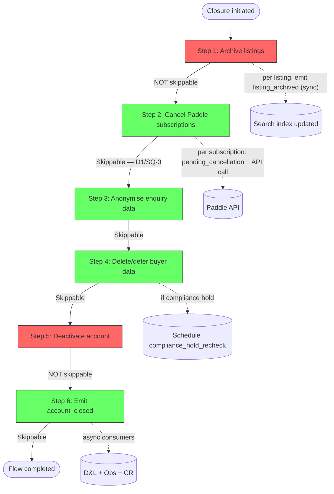

<!-- Part of slice-10-hardening v2 -->

# S10 §3–§4: Account Closure Flow Wiring + Closure Data Operations

**Sections:** §3 Account Closure Flow Wiring, §4 Closure Data Operations
**Generated:** 2026-02-15
**Binding decisions:** D1 (SQ-3 — orchestrator step retry), D4 (closure step ordering + skip constraints)
**Authoritative sources:** SI §3 (orchestrator engine), SI §13.2 (closure step sequence), PP §5 (closure orchestration), Ops §3.2 (`checkComplianceHold`), S4 §1.3 (pending_cancellation schema), S4 §3.2 (`PaymentService.cancelSubscription`)

---

## §3 Account Closure Flow Wiring

Platform orchestrates account closure as a 6-step `executeOrchestratedFlow` sequence. The flow uses 0 new tables, 0 new deferred action types, and 0 new event types — every infrastructure element already exists. The novel contributions are: step 2 (Paddle cancellation with SQ-3 retry policy), step 3 (enquiry anonymisation), step 4 (buyer data deletion with compliance hold deferral), and the `ClosureContext` type that accumulates state across steps.

### 3.1 ClosureContext

The orchestrator's shared context tracks cumulative progress across all 6 steps. Persisted as JSON with the `orchestrated_flows` progress record. [Source: shared-infrastructure.md — §3.3, SI-8]

```typescript
type ClosureContext = {
  accountId: UUID
  listingsArchived: UUID[]
  subscriptionsCancelled: number
  subscriptionsFailed: string[]        // paddleSubscriptionIds that failed cancel API call
  enquiriesAnonymised: number
  buyerDataDeleted: boolean
  buyerDataDeferred: boolean           // true if compliance hold active at step 4
  complianceHoldCheckAt?: ISO8601      // when checkComplianceHold was last called
  accountDeactivated: boolean
  accountClosedEmitted: boolean
}
```

Initial state passed to `executeOrchestratedFlow`:

```typescript
const initialContext: ClosureContext = {
  accountId,
  listingsArchived: [],
  subscriptionsCancelled: 0,
  subscriptionsFailed: [],
  enquiriesAnonymised: 0,
  buyerDataDeleted: false,
  buyerDataDeferred: false,
  accountDeactivated: false,
  accountClosedEmitted: false,
}
```

### 3.2 CLOSURE_FLOW_STEPS

Six steps. Ordering per SI §13.2 and D4. Skip constraints per SI §3.5.

```typescript
// src/server/flows/closure.ts

const CLOSURE_FLOW_STEPS: OrchestratorStepDef<ClosureContext>[] = [
  {
    name: "archive_listings",
    domain: "platform",
    execute: archiveAllListings,
    skippable: false,
  },
  {
    name: "cancel_paddle_subscriptions",
    domain: "platform",
    execute: cancelPaddleSubscriptions,
    skippable: true,   // SI §3.5: Paddle webhook may handle independently
  },
  {
    name: "anonymise_enquiry_data",
    domain: "platform",
    execute: anonymiseBuyerEnquiryData,
    skippable: true,   // SI §3.5: privacy risk accepted, admin handles manually
  },
  {
    name: "delete_defer_buyer_data",
    domain: "platform",
    execute: deleteBuyerData,
    skippable: true,   // SI §3.5: data retained longer, no legal violation
  },
  {
    name: "deactivate_account",
    domain: "platform",
    execute: deactivateAccount,
    skippable: false,   // SI §3.5: account must be disabled
  },
  {
    name: "emit_account_closed",
    domain: "platform",
    execute: emitAccountClosed,
    skippable: true,   // SI §3.5: legally compliant but operationally inconsistent
  },
]
```

Flow invocation:

```typescript
async function initiateAccountClosure(accountId: UUID): Promise<OrchestratedFlowProgress> {
  const initialContext: ClosureContext = {
    accountId,
    listingsArchived: [],
    subscriptionsCancelled: 0,
    subscriptionsFailed: [],
    enquiriesAnonymised: 0,
    buyerDataDeleted: false,
    buyerDataDeferred: false,
    accountDeactivated: false,
    accountClosedEmitted: false,
  }

  return executeOrchestratedFlow<ClosureContext>(
    "closure",
    accountId,
    CLOSURE_FLOW_STEPS,
    initialContext,
    // No deadline — closure has no statutory time limit (SI §3.4)
  )
}
```

### 3.3 Closure Flow Sequence



Red = NOT skippable. Green = skippable.

### 3.4 Step Implementations

**Step 1: archiveAllListings(context)**

PP orchestrates; D&L executes per listing. Queries all active listings for the account, archives each, and accumulates archived IDs in context.

```typescript
async function archiveAllListings(context: ClosureContext): Promise<void> {
  const activeListings = await db.select({ id: listings.id })
    .from(listings)
    .where(and(
      eq(listings.accountId, context.accountId),
      eq(listings.lifecycleStatus, "active"),
    ))

  for (const listing of activeListings) {
    // D&L archive function — sets lifecycleStatus = "archived",
    // emits listing_archived (sync consumer updates search index)
    // [Source: S1 §4.2, S4 §7.1 archive amendment]
    await archiveListing(listing.id)
    context.listingsArchived.push(listing.id)
  }
}
```

Each `listing_archived` emission triggers 3 consumers: search index removal (sync), ISR revalidation (async), shortlist update (async). [Source: platform-and-product.md — §1.3 consumer table] Context accumulates across retries — if step fails mid-iteration, already-archived listings remain archived (idempotent). On retry, the query returns only remaining active listings.

**Step 2: cancelPaddleSubscriptions(context)**

Resolves SQ-3 and R2. Per D1: orchestrator step handles retry, not separate deferred action. `retry_3` exponential backoff (1s, 2s, 4s).

```typescript
async function cancelPaddleSubscriptions(context: ClosureContext): Promise<void> {
  // Query listings with active Paddle subscriptions for this account
  const paidListings = await db.select({
    id: listings.id,
    paddleSubscriptionId: listings.paddleSubscriptionId,
  })
    .from(listings)
    .where(and(
      eq(listings.accountId, context.accountId),
      isNotNull(listings.paddleSubscriptionId),
      ne(listings.subscriptionTier, "free"),
    ))

  // Batch-insert all pending_cancellation records before API calls (N+1 prevention)
  // PP writes directly to Ops-owned table (closure path exception) [S4-ST-16]
  const pendingRecords = paidListings.map(l => ({
    paddleSubscriptionId: l.paddleSubscriptionId!,
    listingId: l.id,
    reason: "account_closed" as const,
  }))
  if (pendingRecords.length > 0) {
    await db.insert(pendingCancellations).values(pendingRecords).onConflictDoNothing()
  }

  // Call Paddle cancel API per subscription (external API — unavoidable per-call)
  for (const listing of paidListings) {
    // Skip if already processed in prior attempt (idempotent on retry)
    const existing = await db.select()
      .from(pendingCancellations)
      .where(and(
        eq(pendingCancellations.paddleSubscriptionId, listing.paddleSubscriptionId!),
        eq(pendingCancellations.reason, "account_closed"),
        isNotNull(pendingCancellations.cancelledAt),  // Paddle confirmed cancellation
      ))
      .limit(1)
    if (existing.length > 0) continue  // already handled in prior step execution

    // retry_3 exponential backoff (1s, 2s, 4s) handled by orchestrator step retry [D1]
    const result = await services.payment.cancelSubscription({
      paddleSubscriptionId: listing.paddleSubscriptionId!,
      reason: "account_closed",
      effectiveFrom: "immediately",
    })
    // [Source: S4 §3.2 PaymentService.cancelSubscription]

    context.subscriptionsCancelled++
  }
}
```

**Failure path:** If `cancelSubscription` throws for any subscription, the orchestrator step fails. Admin sees error in S7 flow admin UI with context showing which subscriptions succeeded and which failed. Admin retries step 2. Prior pending_cancellation records exist (idempotent insert). Prior API calls succeeded (Paddle returns success for already-cancelled subscriptions). Remaining subscriptions are cancelled on retry.

**Skip safety (D1):** Skipping step 2 means subscriptions remain active in Paddle. SI §3.5 warning: "Skipping = admin confirms Paddle cancellations handled manually." Acceptable — closure is not a billing requirement. Account is deactivated (step 5), listings are archived (step 1). Paddle webhook may arrive independently regardless; pending_cancellation records (if created before skip) enable correct attribution via `inferCancellationReason`. [Source: S4 §2.7]

**Step 5: deactivateAccount(context)**

```typescript
async function deactivateAccount(context: ClosureContext): Promise<void> {
  await db.update(accounts)
    .set({
      lifecycleStatus: "closed",
      updatedAt: new Date(),
    })
    .where(eq(accounts.id, context.accountId))

  context.accountDeactivated = true
}
```

NOT skippable. The account must be disabled regardless of prior step outcomes.

**Step 6: emitAccountClosed(context)**

```typescript
async function emitAccountClosed(context: ClosureContext): Promise<void> {
  // Payload per PP §1.9 AccountClosedEvent
  await emit(
    "account_closed",
    {
      type: "account_closed",
      accountId: context.accountId,
      listingsArchived: context.listingsArchived,
      buyerDataDeleted: context.buyerDataDeleted,
      complianceHoldActive: context.buyerDataDeferred,
      paddleCancellationsPending: context.subscriptionsFailed.length > 0,
      timestamp: new Date().toISOString(),
    },
    waitUntilFn,
  )

  context.accountClosedEmitted = true
}
```

Three async consumers fire: D&L (suspend enrichment for archived listings), Ops (close active support tickets), CR (log churn, clear conversion state). [Source: platform-and-product.md — §1.9 consumer table] All registered in prior slices (S7, S8, S9). No new EVENT_CONSUMER_MATRIX entries.

Steps 3 and 4 are specified in §4 below.

---

## §4 Closure Data Operations

Steps 3 and 4 are the novel data operations in the closure flow. Step 3 anonymises buyer enquiry data visible to providers. Step 4 deletes or defers buyer-owned data depending on compliance hold status.

### 4.1 Step 3: anonymiseBuyerEnquiryData

Provider-visible enquiry records retain message content but lose sender identity. The buyer's outbound enquiry records are deleted in step 4.

```typescript
// src/server/flows/closure-data-ops.ts

async function anonymiseBuyerEnquiryData(context: ClosureContext): Promise<void> {
  // Anonymise provider-visible enquiry records: remove sender identity,
  // preserve message content (providers keep their enquiry history)
  const result = await db.update(enquiryRecords)
    .set({
      senderAccountId: null,
      senderDisplayName: "[Account closed]",
      updatedAt: new Date(),
    })
    .where(eq(enquiryRecords.senderAccountId, context.accountId))
    .returning({ id: enquiryRecords.id })

  context.enquiriesAnonymised = result.length
}
```

**Design rationale:** Providers need to see past enquiry messages for their business records. The enquiry content is the provider's data (they received it). The sender identity is the buyer's data (it identifies them). Anonymisation removes the link without destroying provider records. This differs from GDPR erasure (processErasure), which deletes more aggressively — closure is voluntary, not a legal mandate.

**Idempotency:** If step 3 is retried after partial completion, `senderAccountId` is already null for previously anonymised records. The update is a no-op for those rows. The `WHERE` clause matches only records still linked to the account.

### 4.2 Step 4: deleteBuyerData

Buyer-owned data (shortlists, saved searches, buyer-side enquiry records, search history) is deleted unless a compliance hold blocks it. If a hold exists, deletion is deferred via `compliance_hold_recheck` deferred action.

```typescript
async function deleteBuyerData(context: ClosureContext): Promise<void> {
  // 1. Check compliance hold [Source: operations.md — §3.2 checkComplianceHold]
  const holdResult = await checkComplianceHold(context.accountId)
  context.complianceHoldCheckAt = new Date().toISOString()

  if (holdResult.holdExists) {
    // Defer deletion — schedule recheck in 7 days
    context.buyerDataDeferred = true

    await scheduleDeferredAction({
      action: "compliance_hold_recheck",
      params: { accountId: context.accountId, flowId: flow.flowId },
      executeAt: new Date(Date.now() + 7 * 24 * 60 * 60 * 1000),  // 7 days
      retryPolicy: "retry_3",
      createdBy: "platform",
    })
    // [Source: shared-infrastructure.md — §2.1 DeferredActionParamsMap, already registered]

    // Step succeeds with deferred status — not a failure
    return
  }

  // 2. No hold — delete buyer data
  await executeBuyerDataDeletion(context)
}
```

**Deletion logic (no hold path):**

```typescript
async function executeBuyerDataDeletion(context: ClosureContext): Promise<void> {
  // Each deletion is individually transactional (per-table).
  // Failure on one table does not roll back others.
  // Step retries from context state — already-deleted tables are no-ops.

  // a. Delete shortlists (cascade deletes shortlist_items via FK onDelete: "cascade")
  await db.delete(shortlists)
    .where(eq(shortlists.accountId, context.accountId))

  // b. Delete saved searches
  await db.delete(savedSearches)
    .where(eq(savedSearches.accountId, context.accountId))

  // c. Delete buyer-side enquiry records (no-op after step 3 anonymisation)
  // Step 3 already anonymised all enquiry records by setting senderAccountId = null.
  // This DELETE WHERE senderAccountId = accountId finds zero rows.
  // Kept for explicitness and step 4 standalone retries (if step 3 was skipped).
  await db.delete(enquiryRecords)
    .where(eq(enquiryRecords.senderAccountId, context.accountId))

  // d. Delete search history
  await db.delete(searchHistory)
    .where(eq(searchHistory.accountId, context.accountId))

  context.buyerDataDeleted = true
}
```

**Per-table transaction rationale:** A single cross-table transaction risks locking contention on large accounts with many shortlists and enquiries. Individual deletes are independently retryable — if `savedSearches` deletion fails, `shortlists` are already gone and the retry only needs to re-attempt `savedSearches` onwards. Context tracks `buyerDataDeleted` as a boolean; if the step fails mid-deletion, the retry re-runs all deletes (each is idempotent — deleting already-deleted rows is a no-op).

### 4.3 compliance_hold_recheck Handler

Handler implementation: see §5.4 (05-concurrent-flows.md). §5.4 is authoritative — it covers both the standalone recheck case and the concurrent erasure+closure case. [S10-ST-9]

**Lifecycle:** The compliance_hold_recheck cycle repeats indefinitely until the hold clears. Expected scenario: DSAR erasure in progress blocks closure buyer data deletion. Erasure completes (7-30 days per statutory deadline). DSAR case closes. Compliance hold clears. Next recheck finds no hold and executes deletion. Worst case: active investigation blocks deletion for months — recheck runs weekly, admin monitors via S7 flow admin UI. [Source: operations.md — §3.2 OPS-ST-8]

### 4.4 Closure Step 3/4 Interaction

Step 3 anonymises `senderAccountId` on provider-visible enquiry records. Step 4 deletes buyer-side enquiry records. The two operations do not conflict because they target different record sets:

- Step 3: `UPDATE enquiry_records SET senderAccountId = null WHERE senderAccountId = :accountId` (all records where this account is the sender — provider sees anonymised message)
- Step 4: `DELETE FROM enquiry_records WHERE senderAccountId = :accountId` (remaining records — but step 3 already nulled `senderAccountId`)

After step 3, no enquiry records have `senderAccountId = :accountId`. Step 4's delete on `enquiry_records` finds zero rows. This is correct — step 3 anonymises provider-visible records (preserving content), and no separate buyer-side enquiry copy exists in the schema. The buyer's enquiry history is the same records as the provider's inbox entries, linked by `senderAccountId`. Step 3 is sufficient for enquiry cleanup.

Step 4's buyer data deletion therefore covers: shortlists, saved searches, and search history. Not enquiry records (already handled by step 3's anonymisation).

---

## §3/§4 Acceptance Criteria

### §3 Account Closure Flow Wiring (8 AC)

| # | Criterion | Test Type |
|---|-----------|-----------|
| AC-23 | `CLOSURE_FLOW_STEPS` registers 6 steps in order: archive_listings, cancel_paddle_subscriptions, anonymise_enquiry_data, delete_defer_buyer_data, deactivate_account, emit_account_closed | Unit |
| AC-24 | `executeOrchestratedFlow("closure", accountId, CLOSURE_FLOW_STEPS, initialContext)` creates an `orchestrated_flows` record with `flowType = "closure"` and `status = "initiated"` | Integration |
| AC-25 | Step 1 archives all active listings for the account — each emits `listing_archived` (sync: search index removal) — and accumulates archived IDs in `context.listingsArchived` | Integration |
| AC-26 | Step 2 creates `pending_cancellation` record with `reason: "account_closed"` BEFORE calling `PaymentService.cancelSubscription` for each paid listing | Integration |
| AC-27 | Step 2 failure (Paddle API throws) halts the flow at step 2 with `status: "failed"` and preserves context showing which subscriptions succeeded and which failed | Integration |
| AC-28 | Step 2 retry after partial completion skips already-cancelled subscriptions (idempotent: pending_cancellation record exists, Paddle returns success for already-cancelled) | Integration |
| AC-29 | Step 5 sets `account.lifecycleStatus = "closed"` — server rejects admin skip attempt (step 5 is NOT skippable per SI §3.5) | Integration |
| AC-30 | Step 6 emits `account_closed` with payload matching PP §1.9 `AccountClosedEvent`: `accountId`, `listingsArchived` (from context), `buyerDataDeleted`, `complianceHoldActive`, `paddleCancellationsPending`, `timestamp` | Integration |

### §4 Closure Data Operations (9 AC)

| # | Criterion | Test Type |
|---|-----------|-----------|
| AC-31 | Step 3 sets `senderAccountId = null` and `senderDisplayName = "[Account closed]"` on all `enquiry_records` where `senderAccountId = :accountId` | Integration |
| AC-32 | Step 3 preserves `messageContent` on provider-visible enquiry records (providers retain enquiry history without sender identity) | Integration |
| AC-33 | Step 4 calls `checkComplianceHold(accountId)` before any deletion — if hold exists, schedules `compliance_hold_recheck` deferred action with `{ accountId, flowId }` for 7 days and sets `context.buyerDataDeferred = true` [S10-ST-2] | Integration |
| AC-34 | Step 4 with no compliance hold deletes: `shortlists` (cascade deletes `shortlist_items`), `saved_searches`, `search_history` for the account | Integration |
| AC-35 | Step 4 per-table deletion — failure deleting `saved_searches` does not roll back prior `shortlists` deletion; retry re-attempts remaining tables | Integration |
| AC-36 | `compliance_hold_recheck` handler re-checks hold after 7 days — if hold cleared, executes `executeBuyerDataDeletion` and updates flow context | Integration |
| AC-37 | `compliance_hold_recheck` handler reschedules for another 7 days if hold still active (repeating cycle) | Integration |
| AC-38 | `compliance_hold_recheck` handler after hold clears updates `context.buyerDataDeleted = true` in the `orchestrated_flows` record | Integration |
| AC-39 | Step 6 `AccountClosedEvent.complianceHoldActive` reflects `context.buyerDataDeferred` — consumers know whether buyer data was fully deleted or deferred | Integration |

**Total:** 17 AC (8 for §3, 9 for §4).
