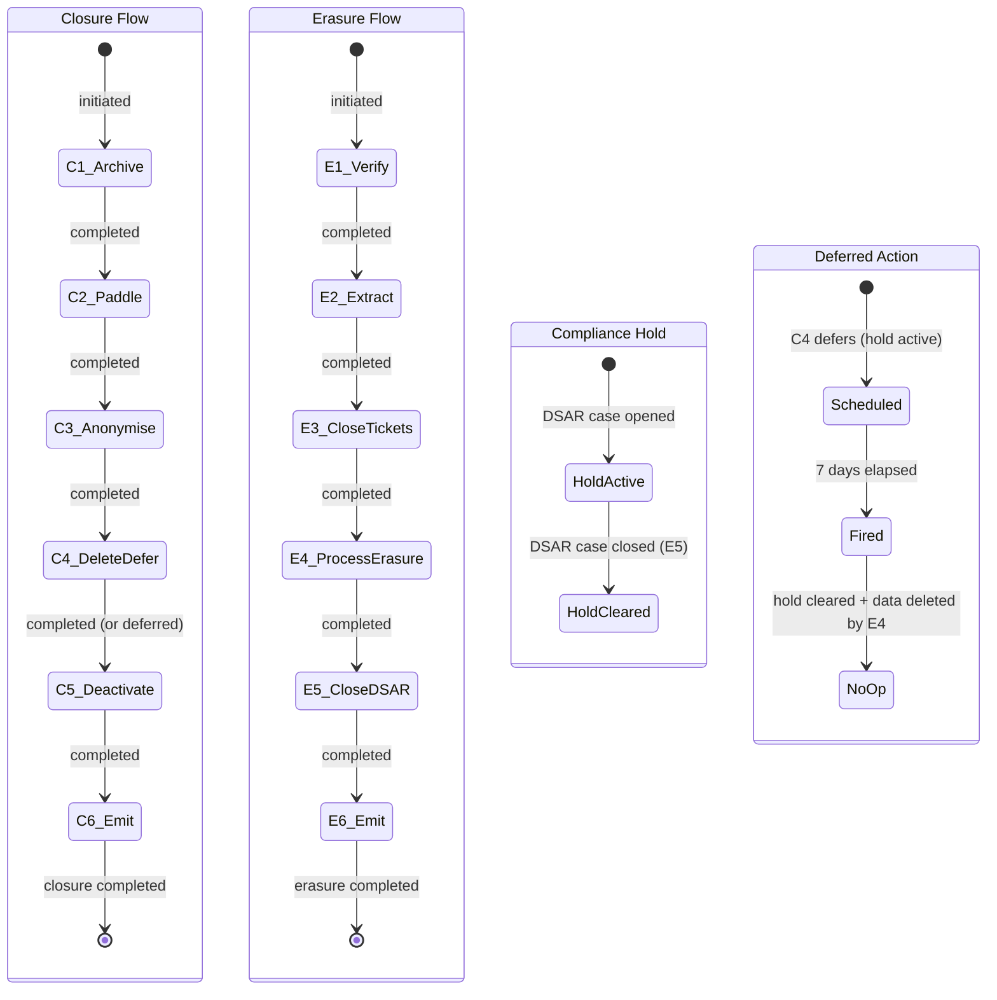

<!-- Part of slice-10-hardening v2 -->

# S10 §5–§6: Concurrent Flow Interaction & End-to-End Validation

**Sections:** §5 Concurrent Flow Interaction, §6 End-to-End Validation & Failure Injection (R12)
**Generated:** 2026-02-15
**Binding decisions:** D1 (SQ-3: orchestrator step handles Paddle retry), D2 (processErasure sub-step split), D4 (closure step ordering), D5 (erasure step ordering)

---

## §5 Concurrent Flow Interaction

Erasure and closure can run simultaneously for the same account. The two flows are independent `orchestrated_flows` rows with no shared mutable state. Compliance hold is the sole synchronisation point: erasure creates a DSAR-triggered hold, closure step 4 checks for it.

### 5.1 Scenario A: Erasure Initiated During Closure

Closure is in progress. A DSAR arrives for the same account, triggering an erasure flow.

**Sequence:**

1. Closure step 1 (archive listings) completes. Listings removed from search.
2. Closure step 2 (cancel Paddle subscriptions) completes. Pending cancellation records created, API calls succeed.
3. Closure step 3 (anonymise buyer enquiry data) completes. Enquiry sender references anonymised in provider inboxes.
4. **DSAR received.** Ops creates DSAR case. Compliance hold set on account. Erasure flow initiated — separate `orchestrated_flows` row, `flowType: "erasure"`.
5. Closure step 4 (delete/defer buyer data) begins. Calls `checkComplianceHold(accountId)` [Source: Ops §3.2]. Hold is active (DSAR open). Buyer data deletion **deferred**. `compliance_hold_recheck` deferred action scheduled for 7 days. Closure step 4 marked `"completed"` with context `{ buyerDataDeferred: true, complianceHoldRecheckScheduled: ISO8601 }`.
6. Closure step 5 (deactivate account) completes. `lifecycleStatus = "closed"`.
7. Closure step 6 (emit `account_closed`) completes. Downstream consumers fire.
8. Closure flow status → `"completed"`. Account is closed but buyer data persists (deferred).
9. Erasure flow runs independently: steps 1–3 (verify identity, extract data, close tickets).
10. Erasure step 4 (processErasure) executes. DB transaction deletes freelancer listings, anonymises company listings, deletes account personal data (including buyer data — shortlists, saved searches, enquiry records). R2 cleanup runs. Buyer data that closure deferred is now deleted by processErasure.
11. Erasure step 5 closes DSAR case + creates compliance audit record. Compliance hold clears.
12. Erasure step 6 emits `erasure_completed`. Downstream consumers fire.
13. `compliance_hold_recheck` deferred action fires (7 days later or earlier if hold already cleared). Checks `checkComplianceHold(accountId)` → **holdExists: false** (DSAR closed). Buyer data already deleted by processErasure → no-op. Deferred action completes.

**Key property:** Closure completes without waiting for erasure. Buyer data deletion is deferred, not blocked. processErasure subsumes the deferred deletion — when erasure runs, it deletes all account data including the buyer data closure deferred. The `compliance_hold_recheck` becomes a no-op because the data no longer exists.

### 5.2 Scenario B: Closure Initiated During Erasure

Erasure is in progress. Account owner initiates closure (or admin triggers it).

**Sequence:**

1. Erasure step 1 (verify identity) completes.
2. Erasure step 2 (extract data) completes.
3. **Closure initiated.** Separate `orchestrated_flows` row, `flowType: "closure"`.
4. Closure step 1 (archive listings) runs. Listings archived.
5. Erasure step 3 (close tickets) runs concurrently — no conflict (different table, different domain).
6. Erasure step 4 (processErasure) runs. Finds listings already archived. Company listing anonymisation: `accountId` set to null, `claimStatus` set to `"unclaimed"`, contact data removed. Archiving an already-archived listing is a no-op for company listings. Freelancer listings are fully deleted regardless of archive status. processErasure operates on account-level data, not flow-level state.
7. Closure step 2 (cancel Paddle subscriptions) runs. Subscriptions may already be in `pending_cancellation` state from erasure-side effects — `PaymentService.cancelSubscription` is idempotent (Paddle API returns success for already-cancelled subscriptions).
8. Closure step 3 (anonymise buyer enquiry data) runs. Enquiry records may already be deleted by processErasure — anonymisation of non-existent records is a no-op.
9. Closure step 4 (delete/defer buyer data) runs. Calls `checkComplianceHold(accountId)`. If DSAR case still open → holdExists: true → defer. If DSAR closed (erasure completed) → holdExists: false → delete. Either path is correct: processErasure already deleted the data, so deletion is a no-op.
10. Both flows complete independently.

**Key property:** processErasure is idempotent with respect to closure operations. Archiving, anonymising, and deleting data that has already been archived, anonymised, or deleted produces no errors and no side effects. Both flows write their own `orchestrated_flows` row — no cross-flow state mutation.

### 5.3 Concurrent Flow State Diagram



**Reading the diagram:** Closure and erasure run as independent state machines. The compliance hold (centre) is the synchronisation point. When closure step 4 encounters an active hold, it defers buyer data deletion and schedules `compliance_hold_recheck`. Erasure step 4 (processErasure) deletes the data. Erasure step 5 clears the hold. The deferred action fires and finds nothing to do.

### 5.4 `compliance_hold_recheck` Handler Logic

The `compliance_hold_recheck` deferred action fires when its scheduled time arrives. It is not specific to the concurrent flow scenario — it also fires when closure step 4 defers without any erasure flow in progress (hold may clear for other reasons, e.g., DSAR withdrawn).

```typescript
// Handler: compliance_hold_recheck deferred action
// Params: { accountId: UUID, flowId: UUID }
// Registered in: SI §2.1/§2.2 (S0)
async function handleComplianceHoldRecheck(
  params: { accountId: UUID; flowId: UUID }
): Promise<void> {
  const holdResult = await checkComplianceHold(params.accountId)
  // [Source: Ops §3.2 — checkComplianceHold query]

  if (holdResult.holdExists) {
    // Hold still active. Reschedule for another 7 days.
    await scheduleDeferredAction("compliance_hold_recheck", {
      accountId: params.accountId,
      flowId: params.flowId
    }, { delayDays: 7 })
    return
  }

  // Hold cleared. Check if buyer data still exists.
  const closureFlow = await db.select()
    .from(orchestratedFlows)
    .where(eq(orchestratedFlows.id, params.flowId))
    .limit(1)
  if (!closureFlow[0]) return
  // No closure flow found — nothing to resume. [S10-ST-2: lookup by flowId, S10-ST-9: removed status filter]

  const context = closureFlow[0].context as ClosureContext
  if (!context.buyerDataDeferred) return
  // Buyer data was not deferred — nothing to do.

  // Check if data already deleted (by processErasure or prior recheck).
  const buyerDataExists = await hasBuyerData(params.accountId)
  if (!buyerDataExists) {
    // processErasure already deleted it. No-op.
    return
  }

  // Delete buyer data now that hold is cleared.
  await deleteBuyerData(params.accountId)
  // deleteBuyerData: delete shortlists, shortlist_items, saved_searches, search_history.
  // [Source: §4 closure data operations] [S10-ST-8]
}
```

**Rescheduling:** If the hold is still active when the recheck fires, it reschedules for another 7 days. This continues until the hold clears. At V1 scale (1–2 DSARs/month), unbounded rescheduling is acceptable. If a hold persists for >30 days, the weekly Operations Health Review ceremony surfaces it. [Source: Ops §6.2]

**Idempotency:** `deleteBuyerData` is idempotent — deleting records that do not exist returns success (SQL `DELETE WHERE accountId = ?` affects 0 rows). If processErasure already deleted the data, the recheck handler detects this via `hasBuyerData` and exits early.

### 5.5 Invariants

Five invariants govern concurrent flow interaction:

1. **Independent flow rows.** Each flow creates its own `orchestrated_flows` row with a unique `flowId`. `flowType` discriminates erasure from closure. No foreign key between flow rows.

2. **No shared mutable state.** Each flow writes its own `context: TContext` object. Closure context contains `{ buyerDataDeferred, complianceHoldRecheckScheduled, listingsArchived, ... }`. Erasure context contains `{ dbTransactionCompleted, listingIdsDeleted, listingIdsAnonymised, ... }`. No context field is read by the other flow.

3. **Single synchronisation point.** Compliance hold is the ONLY mechanism by which one flow's progress affects the other. Erasure creates the hold (DSAR case open). Closure checks the hold (step 4). Erasure clears the hold (step 5, close DSAR case). No direct flow-to-flow communication.

4. **Flow isolation.** Flow A cannot modify Flow B's `orchestrated_flows` row. Admin actions (retry, skip, escalate) target a specific `flowId`. Retrying erasure step 4 does not affect closure step 4.

5. **processErasure handles pre-existing state.** processErasure must handle listings that are already archived (company listing anonymisation proceeds regardless of archive status), buyer data that is already deleted (SQL delete of non-existent rows is a no-op), and enrichment schedules that are already cancelled (S9 `account_closed` consumer may have cancelled them). Every processErasure sub-operation is idempotent with respect to prior closure or reactive consumer execution.

### 5.6 Edge Cases

**Both flows initiated simultaneously.** Each creates its own `orchestrated_flows` row. No lock contention — `INSERT` on `orchestrated_flows` is per-flow, no unique constraint on `(triggeredBy, flowType)` prevents concurrent creation. Both flows execute step 1 concurrently. Listing archival (closure step 1) and identity verification (erasure step 1) are orthogonal operations.

**Admin escalates one flow while other is running.** Escalation sets `status: "escalated"` on the escalated flow's row. The other flow continues unaffected. Admin can retry the escalated flow independently after investigation.

**Account has no listings.** Both flows still run. Closure step 1 (archive listings) finds 0 listings — completes immediately. processErasure finds 0 listings to delete/anonymise — deletes account-level data only (profiles, shortlists, saved searches, enquiry records). R2 cleanup finds no listing image prefixes — completes immediately.

**DSAR withdrawn mid-closure.** If the DSAR case is closed before closure step 4 runs, `checkComplianceHold` returns `holdExists: false`. Closure step 4 deletes buyer data immediately (no deferral). If the erasure flow was already initiated but DSAR is withdrawn, the erasure flow should be cancelled via admin action (skip remaining steps or escalate for principal decision). The compliance hold clears on DSAR case closure regardless of erasure flow status.

**processErasure fails mid-transaction.** DB transaction rolls back — no data modified. Closure flow is unaffected (closure step 4 may have already deferred). Erasure flow step 4 retries. The `dbTransactionCompleted` context flag is `false`, so retry executes the full transaction. [Source: 01-decisions.md — D2]

---

## §5 Acceptance Criteria

| # | Criterion | Test Type |
|---|-----------|-----------|
| AC-40 | Erasure and closure flows for the same account each create independent `orchestrated_flows` rows with separate `flowId` values | Integration |
| AC-41 | Closure step 4, when `checkComplianceHold` returns `holdExists: true`, sets `buyerDataDeferred: true` in context and schedules `compliance_hold_recheck` deferred action with `{ accountId, flowId }` for 7 days [S10-ST-2, S10-ST-6] | Integration |
| AC-42 | `compliance_hold_recheck` handler, when hold cleared and buyer data exists, deletes buyer data (shortlists, shortlist_items, saved_searches, search_history) [S10-ST-8] | Integration |
| AC-43 | `compliance_hold_recheck` handler, when hold cleared and buyer data already deleted by processErasure, completes as no-op | Integration |
| AC-44 | `compliance_hold_recheck` handler, when hold still active, reschedules for another 7 days | Integration |
| AC-45 | processErasure succeeds when listings are already archived by a prior closure flow (idempotent anonymisation/deletion) | Integration |

---

## §6 End-to-End Validation & Failure Injection (R12)

R12 requires end-to-end failure injection tests covering both orchestrated flows. [Source: sq-2.md — R12, shared-infrastructure.md §3] The validation suite is structured as integration tests that exercise the generic orchestrator against mock infrastructure (Paddle API, R2, DB transaction failures).

### 6.1 Per-Step Failure Injection (12 Tests)

Each test injects a failure at a specific step, then verifies the orchestrator's recovery behaviour. The pattern is identical for all 12 steps:

```typescript
// Test pattern for step N failure injection
async function testStepFailure(
  flowType: "erasure" | "closure",
  stepIndex: number,
  failureAdapter: MockAdapter
): Promise<void> {
  // 1. Configure mock to fail at step N
  failureAdapter.failOnNextCall()

  // 2. Execute flow — halts at step N
  const flow = await executeOrchestratedFlow(flowType, accountId, steps, context)
  expect(flow.status).toBe("failed")
  expect(flow.currentStep).toBe(stepIndex)

  // 3. Verify step state
  const failedStep = flow.steps[stepIndex]
  expect(failedStep.status).toBe("failed")
  expect(failedStep.attempt).toBe(1)
  expect(failedStep.error).toBeDefined()

  // 4. Verify prior steps untouched
  for (let i = 0; i < stepIndex; i++) {
    expect(flow.steps[i].status).toBe("completed")
  }

  // 5. Verify subsequent steps still pending
  for (let i = stepIndex + 1; i < flow.steps.length; i++) {
    expect(flow.steps[i].status).toBe("pending")
  }

  // 6. Fix mock, retry
  failureAdapter.succeedOnNextCall()
  const retried = await adminRetryStep(flow.flowId, stepIndex)
  expect(retried.steps[stepIndex].status).toBe("completed")
  expect(retried.steps[stepIndex].attempt).toBe(2)
}
```

**Erasure step tests (6):**

| Test ID | Step | Failure Injected | Mock Adapter |
|---------|------|------------------|--------------|
| R12-E1 | 1: Verify identity | Ops identity verification service timeout | `MockOpsVerification` |
| R12-E2 | 2: Extract data | Ops data extraction query failure | `MockOpsExtraction` |
| R12-E3 | 3: Close tickets | Ops ticket close partial failure (2 of 3 tickets closed) | `MockOpsTickets` |
| R12-E4 | 4: processErasure (DB) | DB transaction rollback (`SERIALIZATION_FAILURE`) | `MockDBTransaction` |
| R12-E5 | 4: processErasure (R2) | R2 `deleteByPrefix` timeout after DB commit | `MockR2Client` |
| R12-E6 | 5: Close DSAR case | Ops DSAR case update constraint violation | `MockOpsDSAR` |

R12-E5 exercises D2 (processErasure sub-step split). After R2 failure, context has `dbTransactionCompleted: true`. On retry, DB sub-step is skipped, R2 cleanup retries. [Source: 01-decisions.md — D2]

Erasure step 6 (emit event) is not failure-injected — event emission is a local function call (in-process event bus). If it fails, the step fails normally. No external dependency to mock.

**Closure step tests (6):**

| Test ID | Step | Failure Injected | Mock Adapter |
|---------|------|------------------|--------------|
| R12-C1 | 1: Archive listings | D&L listing archive FK constraint failure | `MockListingArchive` |
| R12-C2 | 2: Cancel Paddle | Paddle API 503 Service Unavailable | `MockPaddleAPI` |
| R12-C3 | 3: Anonymise enquiries | DB update deadlock on `enquiry_records` | `MockDBTransaction` |
| R12-C4 | 4: Delete buyer data | `checkComplianceHold` query timeout (Ops service) | `MockOpsCompliance` |
| R12-C5 | 5: Deactivate account | DB update failure on `accounts.lifecycleStatus` | `MockDBTransaction` |
| R12-C6 | 6: Emit event | Event bus consumer throws (async consumer failure — does not block step) | `MockEventBus` |

R12-C2 exercises D1 (SQ-3 resolution). Paddle API fails, step fails. Admin retries. Paddle API succeeds on retry. Attempt counter = 2. [Source: 01-decisions.md — D1]

### 6.2 Retry Verification (4 Tests)

| Test ID | Scenario | Verification |
|---------|----------|-------------|
| R12-R1 | Attempt counter increments | Fail step, retry, fail again, retry again. `attempt` goes 1 → 2 → 3. |
| R12-R2 | Context preserved across retries | Erasure step 4 fails after DB commit. `dbTransactionCompleted: true` persisted to `orchestrated_flows.context`. On retry, step reads context, skips DB sub-step. Verify via `JSON.parse(flow.context)`. |
| R12-R3 | Prior steps not re-executed | Fail at step 4. Retry. Mock adapters for steps 1–3 have call counters — verify they are NOT called during retry. Orchestrator resumes from `currentStep`. |
| R12-R4 | D2 sub-step skip on retry | processErasure with `dbTransactionCompleted = true` in context. Verify DB transaction function NOT called. Verify R2 cleanup IS called. [Source: 01-decisions.md — D2] |

### 6.3 Auto-Escalation Trigger (2 Tests)

| Test ID | Scenario | Verification |
|---------|----------|-------------|
| R12-A1 | Retry exhaustion (3 consecutive failures) | Fail erasure step 4 three times. After 3rd failure, verify `auto_escalation_check` deferred action scheduled with `{ flowId }`. Verify flow status remains `"failed"` (auto-escalation is a deferred action, not immediate state change). When deferred action fires, verify `compliance_deadline` notification emitted to admin. [Source: shared-infrastructure.md §3.4] |
| R12-A2 | Erasure deadline proximity | Create erasure flow with `deadline = now() + 6 days`. Verify 7-day proximity alert fires. Advance clock to `deadline - 3 days`. Verify auto-escalation to principal (flow status → `"escalated"`). Advance clock past deadline. Verify CRITICAL alert. [Source: shared-infrastructure.md §3.4] |

### 6.4 Skip Constraint Enforcement (4 Tests)

| Test ID | Steps Tested | Expected Behaviour |
|---------|-------------|-------------------|
| R12-S1 | Erasure steps 1, 4, 5 (NOT skippable) | `adminSkipStep(flowId, stepIndex)` returns error. Step status unchanged. Error message identifies the constraint. [Source: shared-infrastructure.md §3.5] |
| R12-S2 | Closure steps 1, 5 (NOT skippable) | Same as R12-S1. Skip rejected server-side. |
| R12-S3 | Erasure steps 2, 3, 6 (skippable) | `adminSkipStep(flowId, stepIndex, { reason, adminId })` succeeds. Step status → `"skipped"`. `skipReason` and `skippedBy` populated. Flow advances to next step. |
| R12-S4 | Closure steps 2, 3, 4, 6 (skippable) | Same as R12-S3. Verify skip requires non-empty `reason` (empty reason rejected). |

### 6.5 Context Persistence (2 Tests)

| Test ID | Scenario | Verification |
|---------|----------|-------------|
| R12-P1 | TContext JSON round-trip | Create erasure flow. Execute steps 1–3 (each writes to context). Fail step 4. Read `orchestrated_flows.context` from DB. `JSON.parse` produces object with correct types: UUID arrays (`listingIdsDeleted: UUID[]`), ISO8601 timestamps (`extractedAt: ISO8601`), booleans (`dbTransactionCompleted: boolean`), nested objects. Verify each field survives serialisation. |
| R12-P2 | Context restored after process restart | Simulate process restart by creating a new orchestrator instance. Load flow from DB by `flowId`. Resume from `currentStep`. Verify context object matches pre-restart state. Verify step execution uses restored context (e.g., `dbTransactionCompleted = true` → skip DB sub-step). |

### 6.6 Concurrent Flow Interaction (3 Tests)

| Test ID | Scenario | Verification |
|---------|----------|-------------|
| R12-CF1 | Scenario A (§5.1): erasure during closure | Create closure flow. Complete steps 1–3. Create erasure flow (DSAR). Run closure step 4 — verify `buyerDataDeferred: true`. Complete closure steps 5–6. Complete erasure steps 1–5. Verify buyer data deleted by processErasure. Fire `compliance_hold_recheck` — verify no-op (data gone). |
| R12-CF2 | Compliance hold lifecycle | Set compliance hold via DSAR case. Closure step 4 defers. Close DSAR case (erasure step 5). Verify `checkComplianceHold` returns `holdExists: false`. Fire `compliance_hold_recheck`. Verify buyer data deleted (processErasure did not run in this test — hold cleared by DSAR withdrawal, not erasure completion). |
| R12-CF3 | `compliance_hold_recheck` reschedule | Set compliance hold. Schedule `compliance_hold_recheck`. Fire it — hold still active. Verify new `compliance_hold_recheck` scheduled for 7 days later. Fire again — hold cleared. Verify buyer data deleted. |

### 6.7 Test Infrastructure

**File tree:**

```
tests/integration/flows/
├── erasure/
│   ├── erasure-flow.test.ts           -- R12-E1 through R12-E6
│   ├── erasure-retry.test.ts          -- R12-R1 through R12-R4 (erasure variants)
│   └── erasure-escalation.test.ts     -- R12-A1, R12-A2
├── closure/
│   ├── closure-flow.test.ts           -- R12-C1 through R12-C6
│   ├── closure-retry.test.ts          -- R12-R1 through R12-R4 (closure variants)
│   └── closure-skip.test.ts           -- R12-S1 through R12-S4
├── concurrent/
│   ├── concurrent-flows.test.ts       -- R12-CF1 through R12-CF3
│   └── compliance-hold.test.ts        -- compliance hold lifecycle
├── context/
│   └── context-persistence.test.ts    -- R12-P1, R12-P2
└── mocks/
    ├── mock-paddle-api.ts             -- Configurable Paddle API mock (success, 503, timeout)
    ├── mock-r2-client.ts              -- Configurable R2 mock (success, timeout, partial failure)
    ├── mock-db-transaction.ts         -- Configurable DB mock (success, rollback, deadlock)
    ├── mock-ops-services.ts           -- Ops verification, extraction, tickets, DSAR, compliance hold
    └── test-data-factory.ts           -- Account, listings, subscriptions, shortlists, enquiries
```

**Mock adapter pattern:**

```typescript
// All mocks follow this interface
interface MockAdapter<TInput, TOutput> {
  // Configure behaviour
  succeedOnNextCall(): void
  failOnNextCall(error?: Error): void
  failForNCalls(n: number, error?: Error): void

  // Call tracking
  callCount: number
  lastCalledWith: TInput | null
  reset(): void
}

// Example: MockPaddleAPI
const mockPaddle = createMockAdapter<
  { paddleSubscriptionId: string; reason: string },
  { success: boolean }
>({
  defaultResponse: { success: true },
  defaultError: new Error("503 Service Unavailable")
})
```

**Test data factory:**

```typescript
// Factory creates a complete account with all related entities
async function createTestAccount(options?: {
  listingCount?: number           // default: 2 (1 company, 1 freelancer)
  subscriptionTier?: TierName     // default: "professional"
  shortlistCount?: number         // default: 1
  savedSearchCount?: number       // default: 1
  enquiryCount?: number           // default: 2 (1 sent, 1 received)
  hasActiveDSAR?: boolean         // default: false
  hasComplianceHold?: boolean     // default: false
}): Promise<TestAccountFixture>

type TestAccountFixture = {
  accountId: UUID
  listings: { id: UUID; entityType: "company" | "freelancer" }[]
  subscriptions: { id: UUID; paddleSubscriptionId: string }[]
  shortlists: { id: UUID }[]
  savedSearches: { id: UUID }[]
  enquiries: { id: UUID; direction: "sent" | "received" }[]
  dsarCase?: { id: UUID }
}
```

The factory creates real DB rows (not mocks) for the account and all related entities. External services (Paddle, R2) are mocked. DB operations are real — tests run against a test database with transaction rollback after each test.

---

## §6 Acceptance Criteria

| # | Criterion | Test Type |
|---|-----------|-----------|
| AC-46 | Per-step failure injection for all 6 erasure steps: injected failure halts flow, sets step status to `"failed"`, preserves context, admin retry succeeds | Integration |
| AC-47 | Per-step failure injection for all 6 closure steps: same verification as AC-46 | Integration |
| AC-48 | Attempt counter increments on each retry and is persisted to `orchestrated_flows` | Integration |
| AC-49 | Context JSON serialisation round-trip preserves UUID arrays, ISO8601 timestamps, booleans, and nested objects | Integration |
| AC-50 | Prior completed steps are NOT re-executed when admin retries a failed step (orchestrator resumes from `currentStep`) | Integration |
| AC-51 | processErasure retry with `dbTransactionCompleted: true` in context skips DB transaction and retries R2 cleanup only | Integration |
| AC-52 | After 3 consecutive failures on the same step, `auto_escalation_check` deferred action is scheduled | Integration |
| AC-53 | Erasure deadline proximity triggers escalation: 7-day alert, 3-day auto-escalate, deadline-passed critical alert | Integration |
| AC-54 | Skip attempt on non-skippable steps (erasure 1/4/5, closure 1/5) is rejected server-side with error message | Integration |
| AC-55 | Skip attempt on skippable steps succeeds, sets step status to `"skipped"`, requires non-empty `reason` and `adminId` | Integration |
| AC-56 | Concurrent erasure + closure flows for the same account coexist: closure defers buyer data on compliance hold, processErasure deletes it, `compliance_hold_recheck` is no-op | Integration |
| AC-57 | `compliance_hold_recheck` reschedules when hold still active, deletes buyer data when hold cleared | Integration |
