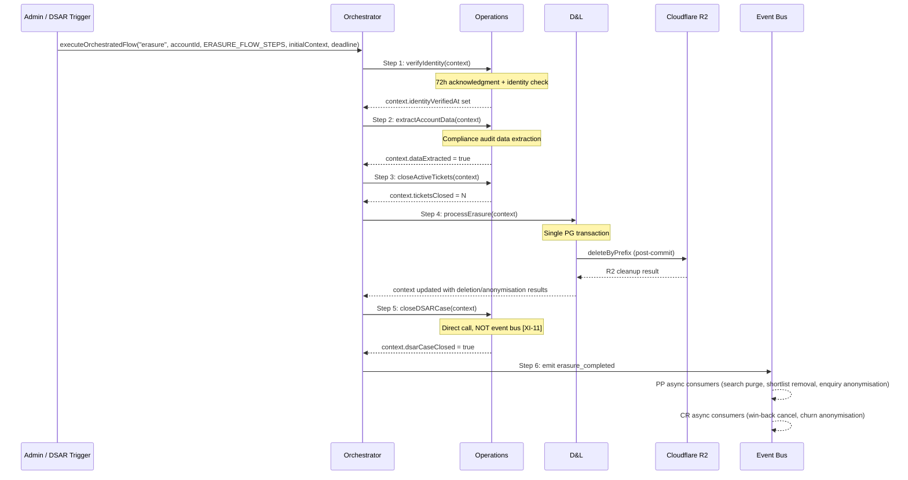

# S10 §1–§2: GDPR Erasure Flow Wiring + processErasure Implementation

**Status:** Phase 2 content output
**Agent:** A (Erasure flow)
**Sections:** §1, §2
**Generated:** 2026-02-15
**Upstream:** SI §3 (orchestrated flow engine), SI §3.5 (skip constraints), SI §13.1 (erasure step spec), D&L §1.9 (`erasure_completed` payload), D&L CD §6 (processErasure), Ops §3.2 (`checkComplianceHold`), S3 §6 (dispute tracking), S7 §5 (compliance register), S1 schema (listings, accounts, child tables), S9 schema (enrichment, decay, perception), 01-decisions.md (D1, D2, D5)

---

## §1 GDPR Erasure Flow Wiring

The erasure flow is a 6-step orchestrated sequence owned by Operations, connecting DSAR fulfilment to D&L's `processErasure` transaction. All steps execute sequentially via `executeOrchestratedFlow`. Steps 1, 4, and 5 are non-skippable (legal requirements). Step 5 is called directly by the orchestrator, not via the event bus, because the compliance audit record must exist before downstream consumers react to `erasure_completed`. [Source: SI §13.1, SI §3.5, D&L §1.9 DL-ST-6]

### 1.1 Erasure Flow Sequence



### 1.2 ErasureContext Type

The orchestrator creates a mutable context object, passed to each step sequentially. Steps write intermediate results; later steps read them. Context is serialised to JSON with the `OrchestratedFlowProgress` record and restored on resume after failure. [Source: SI §3.3 SI-8]

```typescript
type ErasureContext = {
  // Identifiers (set at flow initiation)
  accountId: UUID
  dsarCaseId: UUID

  // Step 1: Identity verification
  identityVerifiedAt?: ISO8601

  // Step 2: Data extraction
  dataExtracted?: boolean

  // Step 3: Ticket closure
  ticketsClosed?: number

  // Step 4: processErasure results
  dbTransactionCompleted?: boolean       // D2: sub-step tracking for idempotent retry
  listingIdsDeleted: UUID[]              // freelancer listings — fully removed
  listingIdsAnonymised: UUID[]           // company listings — unlinked, reverted to unclaimed
  freelancerListingsDeleted: number
  companyListingsAnonymised: number
  r2CleanupCompleted?: boolean           // D2: set after R2 sub-step succeeds
  r2ObjectsDeleted?: number
  qualityRecalcScheduled?: number        // count of company listings scheduled for recalc

  // Step 5: DSAR case closure
  dsarCaseClosed?: boolean
  auditRecordCreated?: boolean

  // Step 6: Event emission
  erasureCompletedEmitted?: boolean
}
```

### 1.3 ERASURE_FLOW_STEPS Definition

```typescript
// src/server/flows/erasure.ts

import { OrchestratorStepDef } from "@/server/flows/types"
// Authoritative type: shared-infrastructure.md §3.3

const ERASURE_FLOW_STEPS: OrchestratorStepDef<ErasureContext>[] = [
  {
    name: "verify_identity",
    domain: "operations",
    execute: verifyIdentityStep,
    skippable: false,           // Legal requirement — SI §3.5 step 1
  },
  {
    name: "extract_account_data",
    domain: "operations",
    execute: extractAccountDataStep,
    skippable: true,            // Data loss for audit trail — admin accepts accountability
  },
  {
    name: "close_active_tickets",
    domain: "operations",
    execute: closeActiveTicketsStep,
    skippable: true,            // Tickets remain open — Ops cleans up manually
  },
  {
    name: "process_erasure",
    domain: "data-and-listings",
    execute: processErasureStep,
    skippable: false,           // The entire point of the flow — SI §3.5 step 4
  },
  {
    name: "close_dsar_case",
    domain: "operations",
    execute: closeDSARCaseStep,
    skippable: false,           // Compliance audit record legally required — SI §3.5 step 5 [XI-11]
  },
  {
    name: "emit_erasure_completed",
    domain: "data-and-listings",
    execute: emitErasureCompletedStep,
    skippable: true,            // Legally compliant (data erased). Operationally inconsistent.
  },
]
```

### 1.4 Step Handler Specifications

**Step 1 — verifyIdentityStep:** Reads DSAR case from `compliance_register` WHERE `id = context.dsarCaseId`. Validates that identity verification is complete (DSAR lifecycle status past `"identity_verification"`). If verification not yet complete, step fails — admin must complete identity check via S7 compliance UI before retrying. On success, writes `context.identityVerifiedAt = now()`. [Source: Ops §3.3 lifecycle stages]

**Step 2 — extractAccountDataStep:** Extracts all personal data associated with `context.accountId` into a structured compliance record. Queries: listings, account_profiles, shortlists, saved_searches, enquiry_records (buyer-side). Output stored in `compliance_register.details` JSONB for the DSAR case entry. Writes `context.dataExtracted = true`. Skippable — if skipped, admin accepts that no pre-erasure data snapshot exists. [Source: SI §3.5 step 2]

**Step 3 — closeActiveTicketsStep:** Queries Ops `hasActiveTicket` for each listing owned by `context.accountId`. Closes all open support tickets referencing the account or its listings. Writes `context.ticketsClosed = count`. Skippable — orphan tickets handled manually. [Source: SI §3.5 step 3]

**Step 4 — processErasureStep:** Calls `processErasure(context.accountId, context)`. The implementation is §2 of this document. This step contains two sub-steps per D2: (1) DB transaction, (2) R2 cleanup. If DB succeeds but R2 fails, the step fails with `context.dbTransactionCompleted = true`. On retry, the DB sub-step is skipped; only R2 retries. Not skippable. [Source: 01-decisions.md D2, SI §3.5 step 4]

**Step 5 — closeDSARCaseStep:** Called directly by the orchestrator, not via the event bus. Updates `compliance_register` SET `status = 'completed'`, `completedAt = now()` WHERE `id = context.dsarCaseId`. Inserts a new `compliance_register` row with `type = 'erasure_audit'` containing: `accountHash`, listing IDs deleted/anonymised, counts, timestamp. Sends `dsar_completion` email template to the data subject (if email was captured pre-erasure). Writes `context.dsarCaseClosed = true`, `context.auditRecordCreated = true`. Not skippable — compliance audit record is legally required, and DSAR case closure clears the compliance hold that may be blocking a concurrent closure flow. [Source: SI §3.5 step 5, XI-11, Ops §3.2 OPS-ST-8]

**Step 6 — emitErasureCompletedStep:** Emits `erasure_completed` event to the event bus with the exact payload from D&L §1.9:

```typescript
emitErasureCompletedStep(context: ErasureContext):
  emit("erasure_completed", {
    type: "erasure_completed",
    accountHash: hash(context.accountId),
    senderAccountId: context.accountId,
    listingIdsAnonymised: context.listingIdsAnonymised,
    listingIdsDeleted: context.listingIdsDeleted,
    freelancerListingsDeleted: context.freelancerListingsDeleted,
    timestamp: new Date().toISOString(),
  })
  context.erasureCompletedEmitted = true
```

PP async consumers: purge from search index, ISR revalidation, remove from shortlists, notify shortlist owners, anonymise outbound enquiries. CR async consumers: cancel win-back schedules, anonymise churn log entries, clear conversion trigger state. [Source: D&L §1.9 consumer table]

Skippable — the erasure is legally complete after step 5. Skipping step 6 leaves operational inconsistencies (search index, shortlists, win-back schedules) that the admin must resolve manually.

### 1.5 Flow Initiation Wiring

```typescript
// Initiated by admin via S7 compliance UI when DSAR is accepted and erasure begins
async function initiateErasureFlow(dsarCaseId: UUID, accountId: UUID): Promise<OrchestratedFlowProgress> {
  const deadline = addDays(new Date(), 30)  // 30-day statutory deadline
  const initialContext: ErasureContext = {
    accountId,
    dsarCaseId,
    listingIdsDeleted: [],
    listingIdsAnonymised: [],
    freelancerListingsDeleted: 0,
    companyListingsAnonymised: 0,
  }
  return executeOrchestratedFlow<ErasureContext>(
    "erasure",
    accountId,
    ERASURE_FLOW_STEPS,
    initialContext,
    deadline.toISOString()
  )
}
```

The `deadline` parameter triggers auto-escalation rules from SI §3.4: alert at 7 days remaining, auto-escalate at 3 days, critical alert if passed. The `triggeredBy` parameter is `accountId` (the data subject).

### 1.6 Admin UI Integration

All 6 steps are visible in the S7 flow admin UI via existing `admin.flows.*` routes. [Source: S7 §6, 01-router-plan.md §1]

- `admin.flows.list` — erasure flows appear with `flowType: "erasure"`, sortable by deadline proximity
- `admin.flows.get` — per-step status, attempt counts, error context (including D2's `"db_complete_r2_failed"` for step 4)
- `admin.flows.retryStep` — retries a failed step. Step 4 retry checks `context.dbTransactionCompleted` and skips DB sub-step if already committed
- `admin.flows.skipStep` — enforces skip constraint matrix. Server rejects skip attempts on steps 1, 4, 5. Steps 2, 3, 6 accept skip with mandatory reason text
- `admin.flows.escalate` — escalates entire flow to principal

Auto-escalation fires via `auto_escalation_check` deferred action (already registered, SI §2.1) after 3 consecutive failures on any step. Erasure flows additionally trigger deadline proximity alerts (SI §3.4).

### 1.7 Acceptance Criteria — §1

| # | Criterion | Test Type |
|---|-----------|-----------|
| AC-1 | `ERASURE_FLOW_STEPS` contains exactly 6 steps in order: verify_identity, extract_account_data, close_active_tickets, process_erasure, close_dsar_case, emit_erasure_completed. | Unit |
| AC-2 | `executeOrchestratedFlow("erasure", ...)` creates an `OrchestratedFlowProgress` record with `flowType: "erasure"`, `status: "initiated"`, and a 30-day deadline. | Integration |
| AC-3 | Steps 1 (verify_identity), 4 (process_erasure), and 5 (close_dsar_case) have `skippable: false`. `admin.flows.skipStep` returns an error when invoked for these steps. | Integration |
| AC-4 | Steps 2 (extract_account_data), 3 (close_active_tickets), and 6 (emit_erasure_completed) have `skippable: true`. `admin.flows.skipStep` succeeds with mandatory `skipReason` text. | Integration |
| AC-5 | Step 5 (close_dsar_case) calls Operations' `closeDSARCase` directly — not dispatched via the event bus. No `EVENT_CONSUMER_MATRIX` entry exists for Ops handling of `erasure_completed`. | Unit |
| AC-6 | Step 6 emits `erasure_completed` event with payload matching `ErasureCompletedEvent` type: `accountHash` (string), `senderAccountId` (UUID), `listingIdsAnonymised` (UUID[]), `listingIdsDeleted` (UUID[]), `freelancerListingsDeleted` (number), `timestamp` (ISO8601). | Integration |
| AC-7 | `ErasureContext` is serialised to JSON with the `OrchestratedFlowProgress` record. After step failure and admin retry, the context is restored with all previously written fields intact (UUID arrays, timestamps, booleans). | Integration |
| AC-8 | Auto-escalation fires after 3 consecutive failures on any step. For erasure flows, deadline proximity alerts fire at 7 days and 3 days remaining. | Integration |
| AC-9 | Step 5 updates `compliance_register` to `status: 'completed'` for the DSAR case and inserts a new `compliance_register` row with `type: 'erasure_audit'` containing deletion/anonymisation counts and listing IDs. | Integration |
| AC-10 | After step 5 completes, `checkComplianceHold(accountId)` returns `holdExists: false` for the DSAR-related hold (clearing the hold for any concurrent closure flow). | Integration |

---

## §2 processErasure Implementation

`processErasure` is the largest novel function in S10. It executes a single PostgreSQL transaction covering dispute resolution, freelancer listing deletion (cascade across 16 child tables), company listing anonymisation, and account personal data deletion. R2 object cleanup runs post-transaction as an idempotent external operation. The function is called by erasure flow step 4 and is wrapped in the D2 sub-step pattern for idempotent retry. [Source: D&L CD §6, 01-decisions.md D2, checklist §10]

### 2.1 Function Signature

```typescript
// src/domains/data-and-listings/erasure/process-erasure.ts

type ProcessErasureResult = {
  listingIdsDeleted: UUID[]          // freelancer listings fully removed
  listingIdsAnonymised: UUID[]       // company listings unlinked + anonymised
  freelancerListingsDeleted: number
  companyListingsAnonymised: number
  r2ObjectsDeleted: number           // total R2 objects cleaned up
  qualityRecalcScheduled: number     // company listings with quality recalc scheduled
}

async function processErasure(
  accountId: UUID,
  context: ErasureContext
): Promise<ProcessErasureResult>
```

### 2.2 Step Wrapper (D2 Sub-Step Pattern)

The orchestrator step wraps `processErasure` in the D2 idempotent retry pattern. If the DB transaction commits but R2 cleanup fails, context tracks the partial completion. On retry, the DB sub-step is skipped entirely. [Source: 01-decisions.md D2]

```typescript
async function processErasureStep(context: ErasureContext): Promise<void> {
  // Sub-step 1: DB transaction (skip if already committed)
  if (!context.dbTransactionCompleted) {
    const dbResult = await processErasureTransaction(context.accountId)
    context.dbTransactionCompleted = true
    context.listingIdsDeleted = dbResult.listingIdsDeleted
    context.listingIdsAnonymised = dbResult.listingIdsAnonymised
    context.freelancerListingsDeleted = dbResult.freelancerListingsDeleted
    context.companyListingsAnonymised = dbResult.companyListingsAnonymised
  }

  // Sub-step 2: R2 cleanup (idempotent — safe to retry)
  const r2Result = await processErasureR2Cleanup(
    context.listingIdsDeleted,
    context.accountId
  )
  context.r2CleanupCompleted = true
  context.r2ObjectsDeleted = r2Result.objectsDeleted

  // Sub-step 3: Schedule quality recalculation for anonymised company listings
  const recalcCount = await scheduleQualityRecalculations(context.listingIdsAnonymised)
  context.qualityRecalcScheduled = recalcCount
}
```

If R2 cleanup throws, the step fails. The orchestrator persists context (with `dbTransactionCompleted = true`). Admin retries via `admin.flows.retryStep`. On retry, the step reads `context.dbTransactionCompleted`, skips the DB transaction, and retries R2 cleanup. R2 `deleteByPrefix` is idempotent — deleting an already-empty prefix returns success.

### 2.3 Transaction Scope

A single PostgreSQL transaction covers all database mutations. No partial commits. If any operation within the transaction fails, the entire transaction rolls back and no data is modified.

```typescript
async function processErasureTransaction(accountId: UUID): Promise<{
  listingIdsDeleted: UUID[]
  listingIdsAnonymised: UUID[]
  freelancerListingsDeleted: number
  companyListingsAnonymised: number
}> {
  return db.transaction(async (tx) => {
    // ── Phase A: Resolve active disputes ──
    const disputeResults = await resolveDisputes(tx, accountId)

    // ── Phase B: Process owned listings ──
    const listingResults = await processListings(tx, accountId)

    // ── Phase C: Delete account personal data ──
    await deleteAccountData(tx, accountId)

    return {
      listingIdsDeleted: listingResults.deleted,
      listingIdsAnonymised: listingResults.anonymised,
      freelancerListingsDeleted: listingResults.deleted.length,
      companyListingsAnonymised: listingResults.anonymised.length,
    }
  })
}
```

### 2.4 Phase A: Dispute Resolution

Two dispute scenarios must be handled within the transaction. [Source: D&L CD §6 stress test #28, S3 §6]

```
resolveDisputes(tx, accountId):

  // A1: Listings owned by erasing account that are currently disputed
  //     (someone is challenging the erasing account's ownership)
  disputedOwned = tx.select(listings)
    .where(accountId = accountId AND claimStatus = "disputed")

  for listing in disputedOwned:
    // Find the competing claimant from pre_claim_snapshots
    snapshot = tx.select(pre_claim_snapshots)
      .where(listingId = listing.id)
    competingClaimantId = snapshot.snapshot.disputeContext.existingClaimantAccountId
      ?? snapshot.snapshot.claimantAccountId

    // Auto-resolve in favour of competing claimant
    // If the competing claimant's claim is ALSO disputed, terminate the chain:
    // resolve in competitor's favour, do NOT cascade
    tx.update(listings)
      .set({ claimStatus: "claimed", accountId: competingClaimantId })
      .where(id = listing.id)

    // The listing will be processed as NOT owned by erasing account
    // (accountId just changed to competitor), so it won't enter Phase B

  // A2: Listings where erasing account is the competing claimant
  //     (erasing account filed a dispute against someone else's listing)
  competingSnapshots = tx.select(pre_claim_snapshots)
    .where(snapshot->>'claimantAccountId' = accountId
      AND snapshot->>'disputeContext' IS NOT NULL)

  for snapshot in competingSnapshots:
    listing = tx.select(listings).where(id = snapshot.listingId)

    // Withdraw the competing claim — restore listing to "claimed" for existing owner
    tx.update(listings)
      .set({ claimStatus: "claimed" })
      .where(id = listing.id)

    // Delete the pre_claim_snapshot for this withdrawn claim
    tx.delete(pre_claim_snapshots).where(id = snapshot.id)
```

**Chain termination rule:** If the competing claimant's own claim is also disputed (a three-way dispute), the resolution resolves only the immediate dispute. The erasing account is removed; the competing claimant's separate dispute continues independently. No cascading dispute resolution.

### 2.5 Phase B: Process Owned Listings

After dispute resolution, query all listings still owned by the erasing account. Split by `entityType`. [Source: D&L CD §6, S1 §1.2]

```
processListings(tx, accountId):
  ownedListings = tx.select(listings).where(accountId = accountId)

  deleted: UUID[] = []
  anonymised: UUID[] = []

  for listing in ownedListings:
    if listing.entityType == "freelancer":
      await deleteFreelancerListing(tx, listing.id)
      deleted.push(listing.id)
    else:
      await anonymiseCompanyListing(tx, listing.id)
      anonymised.push(listing.id)

  return { deleted, anonymised }
```

#### 2.5.1 Freelancer Listing Deletion

Freelancer listings are personal data — full delete required. The `listings` row deletion cascades to child tables with `onDelete: "cascade"`. Tables without FK cascade require explicit deletion before the parent row. [Source: S1 schema, S9 schema]

```
deleteFreelancerListing(tx, listingId):
  // Tables with onDelete: "cascade" from listings (auto-deleted on parent deletion):
  //   listing_taxonomy_tags     [S1 §1.7]
  //   verifications             [S1 §1.3]
  //   quality_scores            [S1 §1.4]
  //   quality_score_explanations [S1 §1.5]
  //   engagements               [S1 §1.6]
  //   credits                   [S1 §1.8]
  //   media_items               [S1 §1.9]
  //   social_profiles           [S1 §1.10]
  //   accreditations            [S1 §1.11]
  //   pending_enquiries         [S1 §1.12]
  //   pre_claim_snapshots       [S1 §1.13]
  //   enquiry_records (by listingId) [S1 §2.2]
  //   shortlist_items (by listingId) [S1 §2.2]
  //   enrichment_schedules      [S9 §2.1]
  //   decay_signals             [S9 §2.2]
  //   perception_aggregates     [S9 §2.3]

  // Delete the listing row — FK cascades handle all child rows above
  tx.delete(listings).where(id = listingId)
```

**Cascade verification:** All 16 child tables listed above have `onDelete: "cascade"` on their `listingId` FK referencing `listings.id`. The single `DELETE FROM listings WHERE id = ?` cascades to all child rows. No manual child deletion is needed for freelancer listings.

#### 2.5.2 Company Listing Anonymisation

Company listings represent business entities that exist independently of any individual. They are anonymised and reverted to unclaimed, not deleted. Personal identifiers (contact email, contact phone) are removed. The listing remains in the directory as an unclaimed record. [Source: D&L CD §6]

```
anonymiseCompanyListing(tx, listingId):
  // Anonymise the listing — remove personal data, revert ownership
  tx.update(listings).set({
    accountId: null,
    claimStatus: "unclaimed",
    contactEmail: null,
    contactPhone: null,
  }).where(id = listingId)

  // Revert verification tier to unclaimed
  tx.update(verifications).set({
    tier: "unclaimed",
    verifiedAt: null,
    verificationMethod: null,
  }).where(listingId = listingId)

  // Delete pre_claim_snapshots — no longer relevant for unclaimed listing
  tx.delete(pre_claim_snapshots).where(listingId = listingId)

  // Delete intelligence data tied to the previous owner's engagement patterns
  // These tables have onDelete: "cascade" from listings, but the listing is NOT deleted —
  // explicit deletion required for company listings
  tx.delete(enrichment_schedules).where(listingId = listingId)
  tx.delete(decay_signals).where(listingId = listingId)
  tx.delete(perception_aggregates).where(listingId = listingId)
```

**Why delete intelligence data for company listings:** Enrichment schedules, decay signals, and perception aggregates contain engagement patterns tied to the previous owner's activity. After anonymisation, the listing reverts to an unclaimed baseline. New enrichment schedules will be created when (if) a new owner claims the listing. Quality score recalculation is scheduled post-transaction (§2.7) because the verification dimension drops ~10 points when reverting to "unclaimed".

### 2.6 Phase C: Account Personal Data Deletion

Deletes all personal data associated with the account, independent of listings. [Source: D&L CD §6, S1 §2]

```
deleteAccountData(tx, accountId):
  // C1: Anonymise account profile (preserve row for FK integrity)
  tx.update(account_profiles).set({
    fullName: "Deleted User",
    emailPreferences: { enquiry_notification: false, listing_status: false,
                        profile_nudge: false, conversion_marketing: false },
  }).where(accountId = accountId)

  // C2: Delete buyer-side enquiry records
  //     enquiry_records.senderAccountId has onDelete: "set null" (not cascade),
  //     so we must explicitly delete buyer-originated records
  tx.delete(enquiry_records).where(senderAccountId = accountId)

  // C3: Delete shortlists + shortlist_items
  //     shortlists.accountId has onDelete: "cascade" from users,
  //     but we are NOT deleting the auth user row yet (Better Auth handles that).
  //     Explicit deletion within this transaction ensures atomicity.
  const shortlistIds = tx.select(shortlists.id).where(accountId = accountId)
  tx.delete(shortlist_items).where(shortlistId IN shortlistIds)
  tx.delete(shortlists).where(accountId = accountId)

  // C4: Delete saved searches
  tx.delete(saved_searches).where(accountId = accountId)

  // C5: Delete search history
  tx.delete(search_history).where(accountId = accountId)

  // C6: Delete auth sessions and tokens (Better Auth)
  //     Better Auth stores sessions in its own tables.
  //     Call BetterAuth's session invalidation API within the transaction context.
  await auth.revokeAllSessions(accountId)
```

**Why explicit deletion instead of relying on cascades:** The auth user row is not deleted within this transaction. GDPR erasure anonymises the account but may preserve the row for FK integrity (compliance records in `compliance_register` reference `accountId` with `onDelete: "set null"`). Explicit deletion of shortlists, saved searches, search history, and enquiry records within the same transaction guarantees atomicity — either all personal data is removed or none is.

### 2.7 R2 Cleanup (Post-Transaction)

R2 operations are external to PostgreSQL and cannot participate in the DB transaction. They run after the transaction commits. [Source: 01-decisions.md D2]

```typescript
async function processErasureR2Cleanup(
  listingIdsDeleted: UUID[],
  accountId: UUID
): Promise<{ objectsDeleted: number }> {
  let totalDeleted = 0

  // R2-1: Delete images for freelancer listings
  for (const listingId of listingIdsDeleted) {
    const result = await r2.deleteByPrefix(`listings/${listingId}/images/`)
    totalDeleted += result.deletedCount
  }

  // R2-2: Delete claim evidence for any claims filed by this account
  //       (evidence uploaded during claim submission — S3 §2)
  const claimIds = await getClaimIdsForAccount(accountId)
  for (const claimId of claimIds) {
    const result = await r2.deleteByPrefix(`claims/${claimId}/evidence/`)
    totalDeleted += result.deletedCount
  }

  return { objectsDeleted: totalDeleted }
}
```

**Idempotency:** `r2.deleteByPrefix` returns success when the prefix contains no objects. Retrying R2 cleanup after a previous successful run is a no-op. This property is critical for the D2 pattern — if the step fails during R2 cleanup and the admin retries, some prefixes may already be empty from the prior attempt.

**`getClaimIdsForAccount`:** Queries `pre_claim_snapshots` WHERE `snapshot->>'claimantAccountId' = accountId`. This query runs AFTER the DB transaction committed, so some snapshots may already be deleted (freelancer listing cascades, explicit company listing deletions). The query returns only surviving claim references, which is correct — deleted snapshots have no R2 evidence to clean up.

**Note:** `getClaimIdsForAccount` must be computed BEFORE the DB transaction (within processErasureStep) and stored in context, because post-transaction the snapshots are deleted. Revised step wrapper:

```typescript
async function processErasureStep(context: ErasureContext): Promise<void> {
  if (!context.dbTransactionCompleted) {
    // Capture claim IDs before the transaction deletes snapshots
    context.claimIdsForR2Cleanup = await getClaimIdsForAccount(context.accountId)

    const dbResult = await processErasureTransaction(context.accountId)
    context.dbTransactionCompleted = true
    context.listingIdsDeleted = dbResult.listingIdsDeleted
    context.listingIdsAnonymised = dbResult.listingIdsAnonymised
    context.freelancerListingsDeleted = dbResult.freelancerListingsDeleted
    context.companyListingsAnonymised = dbResult.companyListingsAnonymised
  }

  const r2Result = await processErasureR2Cleanup(
    context.listingIdsDeleted,
    context.claimIdsForR2Cleanup ?? []
  )
  context.r2CleanupCompleted = true
  context.r2ObjectsDeleted = r2Result.objectsDeleted

  const recalcCount = await scheduleQualityRecalculations(context.listingIdsAnonymised)
  context.qualityRecalcScheduled = recalcCount
}
```

This adds `claimIdsForR2Cleanup: UUID[]` to `ErasureContext`:

```typescript
// Addition to ErasureContext type (§1.2)
claimIdsForR2Cleanup?: UUID[]          // captured pre-transaction for R2 evidence cleanup
```

### 2.8 Post-Transaction: Quality Score Recalculation

Anonymised company listings lose their verification tier (reverted to "unclaimed"), which drops the verification dimension by ~10 points. Quality scores must be recalculated. [Source: D&L §4 quality scoring, S9 §1]

```typescript
async function scheduleQualityRecalculations(
  listingIdsAnonymised: UUID[]
): Promise<number> {
  for (const listingId of listingIdsAnonymised) {
    await scheduleDeferredAction<"quality_score_recalculation">({
      action: "quality_score_recalculation",
      params: { listingId },
      executeAt: new Date(),  // immediate
    })
  }
  return listingIdsAnonymised.length
}
```

`quality_score_recalculation` is already registered in SI §2.1/§2.2 (S9). No new deferred action entry.

### 2.9 Complete Transaction Table Inventory

Every table touched by the `processErasureTransaction`, with the operation and cascade behaviour.

| Table | Operation | Cascade | Phase |
|-------|-----------|---------|-------|
| `listings` (disputed, owned by erasing account) | UPDATE (accountId, claimStatus) | — | A1 |
| `listings` (disputed, competing claim by erasing account) | UPDATE (claimStatus) | — | A2 |
| `pre_claim_snapshots` (competing claim withdrawn) | DELETE | — | A2 |
| `listings` (freelancer, owned) | DELETE | Cascades to 16 child tables | B1 |
| `listing_taxonomy_tags` | CASCADE from listings DELETE | auto | B1 |
| `verifications` | CASCADE from listings DELETE | auto | B1 |
| `quality_scores` | CASCADE from listings DELETE | auto | B1 |
| `quality_score_explanations` | CASCADE from listings DELETE | auto | B1 |
| `engagements` | CASCADE from listings DELETE | auto | B1 |
| `credits` | CASCADE from listings DELETE | auto | B1 |
| `media_items` | CASCADE from listings DELETE | auto | B1 |
| `social_profiles` | CASCADE from listings DELETE | auto | B1 |
| `accreditations` | CASCADE from listings DELETE | auto | B1 |
| `pending_enquiries` | CASCADE from listings DELETE | auto | B1 |
| `pre_claim_snapshots` | CASCADE from listings DELETE | auto | B1 |
| `enquiry_records` (by listingId) | CASCADE from listings DELETE | auto | B1 |
| `shortlist_items` (by listingId) | CASCADE from listings DELETE | auto | B1 |
| `enrichment_schedules` | CASCADE from listings DELETE | auto | B1 |
| `decay_signals` | CASCADE from listings DELETE | auto | B1 |
| `perception_aggregates` | CASCADE from listings DELETE | auto | B1 |
| `listings` (company, owned) | UPDATE (anonymise) | — | B2 |
| `verifications` (company) | UPDATE (revert tier) | — | B2 |
| `pre_claim_snapshots` (company) | DELETE | — | B2 |
| `enrichment_schedules` (company) | DELETE | explicit | B2 |
| `decay_signals` (company) | DELETE | explicit | B2 |
| `perception_aggregates` (company) | DELETE | explicit | B2 |
| `account_profiles` | UPDATE (anonymise) | — | C1 |
| `enquiry_records` (by senderAccountId) | DELETE | explicit | C2 |
| `shortlist_items` (by shortlistId) | DELETE | explicit | C3 |
| `shortlists` | DELETE | explicit | C3 |
| `saved_searches` | DELETE | explicit | C4 |
| `search_history` | DELETE | explicit | C5 |
| auth sessions/tokens | REVOKE | Better Auth API | C6 |

**Total unique tables in transaction:** 20 (listings, verifications, quality_scores, quality_score_explanations, engagements, credits, media_items, social_profiles, accreditations, pending_enquiries, pre_claim_snapshots, enquiry_records, shortlist_items, shortlists, saved_searches, search_history, enrichment_schedules, decay_signals, perception_aggregates, account_profiles). Plus listing_taxonomy_tags (cascade only) and auth session tables (API call).

### 2.10 Error Handling

**Transaction rollback:** If any operation within the `db.transaction()` block throws, the entire transaction rolls back. No partial data modification. The step fails, and the orchestrator records the error. Admin retries the step. The `context.dbTransactionCompleted` flag remains `false`, so the full transaction re-executes.

**R2 failure after DB commit:** Context records `dbTransactionCompleted = true`. Step fails with error message: `"R2 cleanup failed after DB transaction committed. DB state: N deleted, M anonymised. R2 state: pending cleanup."` Admin sees this in `admin.flows.get` error context. On retry, DB sub-step skipped, R2 cleanup retries.

**Better Auth session revocation failure:** If `auth.revokeAllSessions` fails within the transaction, the entire transaction rolls back. This is acceptable — session revocation is an in-process call to Better Auth's session store, not an external API. If Better Auth's session store is PostgreSQL-backed (same database), the revocation participates in the same transaction.

### 2.11 Acceptance Criteria — §2

| # | Criterion | Test Type |
|---|-----------|-----------|
| AC-11 | `processErasure` resolves active disputes where the erasing account is the current owner: listing `claimStatus` changes to `"claimed"`, `accountId` changes to the competing claimant's ID. | Integration |
| AC-12 | `processErasure` withdraws competing claims filed by the erasing account: listing `claimStatus` restored to `"claimed"` for the existing owner, `pre_claim_snapshot` for the withdrawn claim is deleted. | Integration |
| AC-13 | Dispute chain termination: if the competing claimant's own claim is also disputed, only the immediate dispute is resolved. No cascading resolution. | Unit |
| AC-14 | Freelancer listings (`entityType = "freelancer"`) are fully deleted. After `processErasure`, `SELECT * FROM listings WHERE id = ?` returns zero rows. All 16 child tables (listing_taxonomy_tags through perception_aggregates) have zero rows referencing the deleted listing ID. | Integration |
| AC-15 | Company listings (`entityType != "freelancer"`) are anonymised: `accountId = null`, `claimStatus = "unclaimed"`, `contactEmail = null`, `contactPhone = null`. Verification tier reverted to `"unclaimed"`. Listing row persists (not deleted). | Integration |
| AC-16 | Company listing anonymisation deletes `pre_claim_snapshots`, `enrichment_schedules`, `decay_signals`, and `perception_aggregates` for that listing. | Integration |
| AC-17 | Account personal data deletion: `account_profiles.fullName` set to `"Deleted User"`, `emailPreferences` set to all-false. Buyer-side `enquiry_records` (WHERE `senderAccountId = accountId`) deleted. `shortlists`, `shortlist_items`, `saved_searches`, `search_history` deleted. Auth sessions revoked. | Integration |
| AC-18 | The entire DB operation executes in a single PostgreSQL transaction. If any step throws, the transaction rolls back and no tables are modified. | Integration |
| AC-19 | R2 cleanup deletes objects under `listings/{listingId}/images/` for each deleted freelancer listing and `claims/{claimId}/evidence/` for each claim filed by the erasing account. | Integration |
| AC-20 | D2 idempotent retry: if DB transaction succeeds but R2 cleanup fails, the step fails with `context.dbTransactionCompleted = true`. On retry, the DB transaction is skipped and only R2 cleanup executes. | Integration |
| AC-21 | `quality_score_recalculation` deferred action is scheduled for each anonymised company listing. Count matches `companyListingsAnonymised`. | Integration |
| AC-22 | `claimIdsForR2Cleanup` is captured from `pre_claim_snapshots` BEFORE the DB transaction executes (pre-transaction query), ensuring R2 evidence cleanup references survive snapshot deletion. | Unit |
