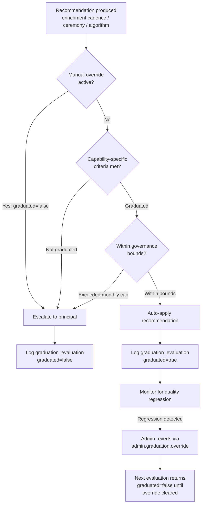
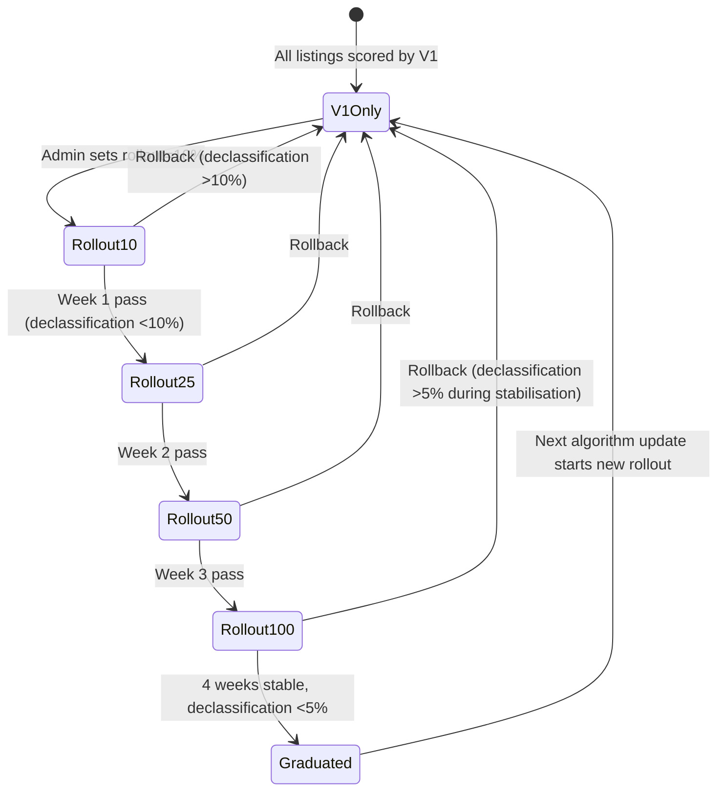

# S10 §7–§8: Autonomy Graduation & Algorithm Versioning

**Status:** Phase 2 content output
**Generated:** 2026-02-15
**Covers:** §7 Autonomy Graduation (S9-1, S9-2 resolution), §8 Algorithm Versioning & Controlled Rollout (S9-3 resolution)
**Binding decisions:** D3 (single graduation_evaluation type), D6 (deterministic hash), D7 (measurement frequency)
**Upstream:** `entity-architecture-frame.md` §Design Principle 5, SI §9.2, S9 §2/§4/§5, `01-decisions.md`, `01-schema.md`, `01-router-plan.md`

---

## §7 Autonomy Graduation

Graduation is the mechanism by which sub-entity capabilities move from principal-escalated to auto-applied. S10 resolves two S9 downstream flags: S9-1 (enrichment cadence auto-adjustment) and S9-2 (ceremony auto-apply). Both implement entity-architecture-frame Design Principle 5: autonomy is graduated per sub-entity, earned through track record, and subject to governance bounds that the sub-entity cannot relax. [Source: entity-architecture-frame.md — §Design Principle 5]

The design is a single dispatch function (`dispatchGraduatedDecision`) that evaluates graduation criteria, logs the evaluation via SI §9.2, and routes the recommendation to auto-apply or escalation. All three V1 capabilities (enrichment cadence, ceremony auto-apply, algorithm rollout) share this dispatch path. The `graduation_evaluation` decision type (D3) captures every evaluation. [Source: 01-decisions.md — D3]

### 7.1 Core Function: evaluateGraduationCriteria

```typescript
type GraduationDecision = {
  graduated: boolean
  reason: string
  currentMetrics: Record<string, number>
  thresholds: Record<string, number>
}

// Authoritative type: 01-schema.md §2 — GraduationEvaluationDecision (summary only)
type GraduationCapability =
  | "enrichment_cadence_adjustment"
  | "ceremony_auto_apply"
  | "algorithm_rollout"

async function evaluateGraduationCriteria(
  subEntity: "data-and-listings" | "operations" | "platform" | "commercial",
  capability: GraduationCapability
): Promise<GraduationDecision> {
  // 1. Check for manual override (most recent graduation_evaluation with reason = "manual_override")
  const override = await db.query(`
    SELECT output->>'graduated' AS graduated
    FROM decision_logs
    WHERE decision_type = 'graduation_evaluation'
      AND input->>'subEntity' = $1
      AND input->>'capability' = $2
      AND input->>'reason' = 'manual_override'
    ORDER BY created_at DESC LIMIT 1
  `, [subEntity, capability])

  if (override && override.graduated === "false") {
    return {
      graduated: false,
      reason: "Manual override: graduation reverted by admin",
      currentMetrics: {},
      thresholds: {}
    }
  }

  // 2. Dispatch to capability-specific evaluator
  switch (capability) {
    case "enrichment_cadence_adjustment":
      return evaluateEnrichmentCadenceGraduation()
    case "ceremony_auto_apply":
      // Per-ceremony evaluation — called with ceremony context, not here
      throw new Error("ceremony_auto_apply evaluated per-ceremony via evaluateCeremonyGraduation()")
    case "algorithm_rollout":
      return evaluateAlgorithmRolloutGraduation()
  }
}
```

Manual overrides take precedence. An admin who force-reverts graduation via `admin.graduation.override` (router plan §2) creates a `graduation_evaluation` log entry with `reason: "manual_override"` and `graduated: false`. The evaluator checks for this before computing metrics.

### 7.2 S9-1 Resolution: Enrichment Cadence Auto-Adjustment

S9 logs `enrichment_cadence_adjustment` decisions whenever cadence changes are recommended (S9 §2, AC-36). At V1, every recommendation escalates to the principal. Graduation enables auto-application when the sub-entity demonstrates sufficient accuracy. [Source: S9 §13 — S9-1 flag]

**Graduation criteria:**

| Metric | Threshold | Measurement Source |
|--------|-----------|-------------------|
| False positive rate | <2% over trailing 6 months | `decision_logs` WHERE `decisionType = 'enrichment_cadence_adjustment'` |
| Enrichment ROI | >1.0 (positive) | Quality score improvements / compute time proxy |

**False positive rate calculation:**

```typescript
async function evaluateEnrichmentCadenceGraduation(): Promise<GraduationDecision> {
  const sixMonthsAgo = new Date(Date.now() - 180 * 24 * 60 * 60 * 1000)

  // Count enrichment cadence adjustments in window
  const adjustments = await db.query(`
    SELECT id, input, output, created_at
    FROM decision_logs
    WHERE decision_type = 'enrichment_cadence_adjustment'
      AND created_at >= $1
  `, [sixMonthsAgo])

  if (adjustments.length < 12) {
    // Minimum sample: 12 adjustments (2 per month over 6 months)
    return {
      graduated: false,
      reason: "Insufficient data: fewer than 12 adjustments in 6-month window",
      currentMetrics: { sampleSize: adjustments.length },
      thresholds: { minSampleSize: 12 }
    }
  }

  // False positive: enrichment detected a signal but listing quality unchanged after 90 days.
  // For each adjustment, check whether quality score improved within 90 days of the adjustment.
  let falsePositives = 0
  for (const adj of adjustments) {
    const listingId = adj.input.entityContext?.listingId
    if (!listingId) continue
    const qualityChange = await db.query(`
      SELECT 1 FROM quality_scores
      WHERE listing_id = $1
        AND updated_at BETWEEN $2 AND $2 + interval '90 days'
        AND composite > (
          SELECT composite FROM quality_scores
          WHERE listing_id = $1 AND updated_at <= $2
          ORDER BY updated_at DESC LIMIT 1
        )
      LIMIT 1
    `, [listingId, adj.created_at])

    if (qualityChange.length === 0) falsePositives++
  }

  const falsePositiveRate = falsePositives / adjustments.length

  // ROI: aggregate quality improvements from enrichment / total enrichment actions
  const qualityImprovements = await db.query(`
    SELECT SUM(output->>'qualityDelta' :: numeric) AS total_delta
    FROM decision_logs
    WHERE decision_type = 'enrichment_cadence_adjustment'
      AND created_at >= $1
      AND output->>'qualityDelta' IS NOT NULL
  `, [sixMonthsAgo])

  const enrichmentROI = (qualityImprovements.total_delta || 0) / adjustments.length

  const thresholds = { falsePositiveRate: 0.02, enrichmentROI: 1.0 }
  const currentMetrics = { falsePositiveRate, enrichmentROI, sampleSize: adjustments.length }

  const graduated = falsePositiveRate < thresholds.falsePositiveRate
    && enrichmentROI > thresholds.enrichmentROI

  return {
    graduated,
    reason: graduated
      ? "All criteria met: FP rate and ROI within thresholds"
      : `Criteria not met: FP=${(falsePositiveRate * 100).toFixed(1)}% (threshold <2%), ROI=${enrichmentROI.toFixed(2)} (threshold >1.0)`,
    currentMetrics,
    thresholds
  }
}
```

**Measurement frequency:** Monthly (D7). A `data_health_review` ceremony run (S9 §4, self-perpetuating monthly) triggers the graduation check. The check reads 6 months of `enrichment_cadence_adjustment` decision logs and computes metrics. [Source: 01-decisions.md — D7]

**Pre-graduation behaviour:** Every enrichment cadence adjustment logs `enrichment_cadence_adjustment` decision and escalates to the principal for review. The principal approves, modifies, or rejects the recommendation. S9 already implements this path (S9 AC-36).

**Post-graduation behaviour:** Adjustments that match historical patterns auto-apply via `dispatchGraduatedDecision`. An adjustment "matches historical patterns" when the recommended cadence change direction (increase/decrease) and magnitude (within 1 tier of prior adjustments) have been seen in at least 3 previous principal-approved decisions. Adjustments outside precedent still escalate.

**Governance bound:** Maximum 10 cadence adjustments per month auto-applied. If exceeded, remaining adjustments escalate to the principal for the rest of the month. The bound resets on the 1st of each month.

```typescript
async function withinGovernanceBounds(capability: GraduationCapability): Promise<boolean> {
  const bounds: Record<GraduationCapability, { maxPerMonth: number }> = {
    enrichment_cadence_adjustment: { maxPerMonth: 10 },
    ceremony_auto_apply: { maxPerMonth: 5 },
    algorithm_rollout: { maxPerMonth: 1 }  // only one rollout active at a time
  }

  const monthStart = startOfMonth(new Date())
  const autoAppliedCount = await db.query(`
    SELECT COUNT(*) AS count
    FROM decision_logs
    WHERE decision_type = 'graduation_evaluation'
      AND input->>'capability' = $1
      AND output->>'graduated' = 'true'
      AND input->>'reason' != 'manual_override'
      AND created_at >= $2
  `, [capability, monthStart])

  return autoAppliedCount.count < bounds[capability].maxPerMonth
}
```

### 7.3 S9-2 Resolution: Ceremony Auto-Apply

S9 logs `ceremony_outcome_evaluation` decisions for every actionable ceremony recommendation (S9 AC-57). At V1, all recommendations with `disposition: "auto_apply"` are not auto-applied — they escalate to the principal. Graduation enables auto-application for precedented, non-financial, non-user-visible recommendations. [Source: S9 §13 — S9-2 flag]

**Graduation criteria:** Per-ceremony evaluation (D7). When a ceremony completes, each recommendation is evaluated against three conditions:

| Condition | Rule | Rationale |
|-----------|------|-----------|
| Precedented | Frequency >= 50 in `ceremony_runs` for same `ceremonyType` + same `disposition` | A recommendation seen 50+ times is a known pattern, not a novel decision |
| Non-financial | Recommendation does not affect pricing, tiers, subscription state, or billing | Financial decisions require principal review regardless of precedent |
| Non-user-visible | Recommendation does not change notification text, email templates, or user-facing content | User-visible changes require human judgement on tone and appropriateness |

**Constraint matrix:**

| Recommendation Category | Auto-Apply Eligible? | Rationale |
|------------------------|---------------------|-----------|
| Taxonomy promotion (clean mapping, no ambiguity) | Yes at V1 | Data-internal, non-financial, non-user-visible. Safest candidate. |
| Data health threshold adjustment (decay signal severity) | Yes after precedent | Non-financial, non-user-visible. Requires operational track record. |
| Verification calibration (confidence threshold tweaks) | No at V1 | Affects claim approval rates — user-visible consequence. |
| Conversion threshold adjustment | No | Financial impact — affects conversion trigger behaviour. |
| Pricing/tier recommendations (multi-listing pricing) | Never | Direct financial impact. Governance hard constraint. |
| Email template modifications | Never | User-visible content. |
| Notification text changes | Never | User-visible content. |

**Per-ceremony evaluation function:**

```typescript
type CeremonyRecommendation = {
  ceremonyType: string
  disposition: string
  recommendation: Record<string, unknown>
  isFinancial: boolean
  isUserVisible: boolean
}

async function evaluateCeremonyGraduation(
  rec: CeremonyRecommendation
): Promise<GraduationDecision> {
  // Hard constraints — never auto-apply
  if (rec.isFinancial) {
    return {
      graduated: false,
      reason: "Financial impact: never auto-applied",
      currentMetrics: { isFinancial: 1 },
      thresholds: { isFinancial: 0 }
    }
  }
  if (rec.isUserVisible) {
    return {
      graduated: false,
      reason: "User-visible impact: never auto-applied",
      currentMetrics: { isUserVisible: 1 },
      thresholds: { isUserVisible: 0 }
    }
  }

  // Precedent check
  const precedentCount = await db.query(`
    SELECT COUNT(*) AS count
    FROM ceremony_runs
    WHERE ceremony_type = $1
      AND outputs->>'disposition' = $2
      AND status = 'completed'
  `, [rec.ceremonyType, rec.disposition])

  const thresholds = { precedentCount: 50 }
  const currentMetrics = { precedentCount: precedentCount.count }
  const graduated = precedentCount.count >= 50

  return {
    graduated,
    reason: graduated
      ? `Precedent met: ${precedentCount.count} prior instances of same ceremonyType + disposition`
      : `Insufficient precedent: ${precedentCount.count}/50 required`,
    currentMetrics,
    thresholds
  }
}
```

**Governance bound:** Maximum 5 auto-applied ceremony outcomes per month. If exceeded, remaining escalate. The bound prevents a runaway ceremony from making dozens of changes in a single run without principal visibility.

**Rollback trigger:** If any auto-applied ceremony outcome is manually reversed by the principal within 7 days, the capability reverts to escalation mode. "Manually reversed" means the principal creates a `graduation_evaluation` override with `graduated: false` via `admin.graduation.override`. The 7-day window is advisory — the principal can revert at any time.

### 7.4 Graduated Decision Dispatch

The unified dispatch function routes recommendations through graduation evaluation, governance bounds checking, and decision logging.

```typescript
async function dispatchGraduatedDecision(
  subEntity: "data-and-listings" | "operations" | "platform" | "commercial",
  capability: GraduationCapability,
  recommendation: Recommendation
): Promise<"auto_applied" | "escalated"> {
  // 1. Evaluate graduation criteria
  const evaluation = capability === "ceremony_auto_apply"
    ? await evaluateCeremonyGraduation(recommendation as CeremonyRecommendation)
    : await evaluateGraduationCriteria(subEntity, capability)

  // 2. Log the evaluation (every evaluation, graduated or not)
  await logDecision("graduation_evaluation", {
    inputs: {
      subEntity,
      capability,
      currentMetrics: evaluation.currentMetrics,
      thresholds: evaluation.thresholds
    },
    output: {
      graduated: evaluation.graduated,
      reason: evaluation.reason
    },
    entityContext: recommendation.entityContext ?? {}
  })

  // 3. Check governance bounds (even if graduated)
  if (evaluation.graduated && await withinGovernanceBounds(capability)) {
    await applyRecommendation(recommendation)
    return "auto_applied"
  }

  // 4. Escalate to principal
  await escalateToPrincipal(recommendation)
  return "escalated"
}
```

`logDecision("graduation_evaluation", ...)` is called on every dispatch, regardless of outcome. This creates the audit trail the admin reviews via `admin.graduation.history`. [Source: shared-infrastructure.md — §9.2]

`applyRecommendation` is capability-specific: for enrichment cadence, it calls the same cadence adjustment function S9 §2 implements but skips the escalation step. For ceremony auto-apply, it executes the ceremony recommendation's action (e.g., promotes a taxonomy tag via D&L's taxonomy mutation).

`escalateToPrincipal` logs the recommendation and creates a notification (existing `compliance_deadline` notification type where applicable, or the principal briefing mechanism from S9 §4 AC-64/AC-65).

### 7.5 Graduation Decision Flow



### 7.6 Rollback Mechanism

Quality regression triggers reversion to escalation mode. The detection is capability-specific:

| Capability | Regression Signal | Detection |
|-----------|-------------------|-----------|
| Enrichment cadence | False positive rate rises above 5% (2.5x threshold) in any 30-day window | Monthly graduation check detects regression, returns `graduated: false` with reason |
| Ceremony auto-apply | Principal manually reverses any auto-applied outcome within 7 days | Admin creates override via `admin.graduation.override` |
| Algorithm rollout | Declassification rate >10% during rollout (see §8) | Weekly comparison check, rollback sets rollout to 0% |

When `evaluateGraduationCriteria` returns `graduated: false` after previously returning `graduated: true`, the dispatch function routes all subsequent recommendations to the principal. No separate "revert" action is needed — the criteria evaluation is the mechanism. The admin can also force-revert via `admin.graduation.override` at any time.

### 7.7 Acceptance Criteria

| # | Criterion | Test Type |
|---|-----------|-----------|
| AC-{N} | `evaluateGraduationCriteria("data-and-listings", "enrichment_cadence_adjustment")` returns `graduated: false` when fewer than 12 `enrichment_cadence_adjustment` decisions exist in the 6-month window (insufficient data) | Unit |
| AC-{N+1} | `evaluateGraduationCriteria("data-and-listings", "enrichment_cadence_adjustment")` returns `graduated: true` when false positive rate is 1.5% and enrichment ROI is 1.3 (both within thresholds) | Unit |
| AC-{N+2} | `evaluateCeremonyGraduation` returns `graduated: false` for any recommendation where `isFinancial = true`, regardless of precedent count | Unit |
| AC-{N+3} | `evaluateCeremonyGraduation` returns `graduated: true` when `precedentCount >= 50` AND `isFinancial = false` AND `isUserVisible = false` | Unit |
| AC-{N+4} | `dispatchGraduatedDecision` logs a `graduation_evaluation` decision via `logDecision` (SI §9.2) on every invocation, including both `graduated: true` and `graduated: false` outcomes | Integration |
| AC-{N+5} | `withinGovernanceBounds("enrichment_cadence_adjustment")` returns `false` after 10 auto-applied adjustments in the current calendar month, causing the 11th to escalate | Integration |
| AC-{N+6} | `admin.graduation.override` with `graduated: false` causes subsequent `evaluateGraduationCriteria` to return `graduated: false` (manual override takes precedence over computed metrics) | Integration |

---

## §8 Algorithm Versioning & Controlled Rollout

Resolves S9-3: `quality_scores.algorithmVersion` (S9 §1) enables A/B testing of scoring formula updates. S10 implements the traffic split, comparative scoring pipeline, rollout sequence, and rollback trigger. The mechanism reuses the graduation dispatch from §7 for governance integration. [Source: S9 §13 — S9-3 flag]

### 8.1 Algorithm Selection

```typescript
import { crc32 } from "crc"  // deterministic hash — D6

function selectAlgorithmVersion(
  listingId: UUID,
  rolloutPercentage: number  // 0-100
): 1 | 2 {
  const bucket = crc32(listingId) % 100  // 0-99
  return bucket < rolloutPercentage ? 2 : 1
}
```

Deterministic: the same listing always receives the same algorithm version for a given rollout percentage (D6). A listing in bucket 7 uses V2 at 10% rollout, and still uses V2 at 25%. Listings only cross the boundary when the rollout percentage passes their bucket. This eliminates noise from random reassignment. [Source: 01-decisions.md — D6]

`rolloutPercentage = 0` means all listings use V1. `rolloutPercentage = 100` means all listings use V2. The `quality_scores.algorithmVersion` column (integer, default 1) records which algorithm produced the current score. [Source: 01-schema.md — §3]

### 8.2 Comparative Scoring Pipeline

During rollout (0 < `rolloutPercentage` < 100), listings in the V2 cohort are scored by both algorithms. This enables direct band comparison.

```typescript
async function scoreListingDuringRollout(
  listingId: UUID,
  rolloutPercentage: number
): Promise<void> {
  const version = selectAlgorithmVersion(listingId, rolloutPercentage)

  if (version === 2) {
    // V2 cohort: run both algorithms
    const v2Score = await computeQualityScore(listingId, { algorithmVersion: 2 })
    const v1Score = await computeQualityScore(listingId, { algorithmVersion: 1 })

    // Store V2 as the active score
    await db.query(`
      UPDATE quality_scores
      SET composite = $1, quality_band = $2, algorithm_version = 2,
          completeness = $3, freshness = $4, accuracy = $5, richness = $6, verification = $7,
          updated_at = now()
      WHERE listing_id = $8
    `, [v2Score.composite, v2Score.band, v2Score.completeness, v2Score.freshness,
        v2Score.accuracy, v2Score.richness, v2Score.verification, listingId])

    // Log V1 result for offline comparison (not stored in quality_scores)
    await logDecision("algorithm_comparison", {
      inputs: {
        listingId,
        v1Score: {
          composite: v1Score.composite,
          band: v1Score.band,
          dimensions: { completeness: v1Score.completeness, freshness: v1Score.freshness,
            accuracy: v1Score.accuracy, richness: v1Score.richness, verification: v1Score.verification }
        },
        v2Score: {
          composite: v2Score.composite,
          band: v2Score.band,
          dimensions: { completeness: v2Score.completeness, freshness: v2Score.freshness,
            accuracy: v2Score.accuracy, richness: v2Score.richness, verification: v2Score.verification }
        }
      },
      output: {
        bandChanged: v1Score.band !== v2Score.band,
        direction: v2Score.composite > v1Score.composite ? "improved"
          : v2Score.composite < v1Score.composite ? "declined" : "unchanged",
        compositeDelta: v2Score.composite - v1Score.composite
      },
      entityContext: { listingId }
    })
  } else {
    // V1 cohort: score with V1 only (normal path)
    const v1Score = await computeQualityScore(listingId, { algorithmVersion: 1 })
    await db.query(`
      UPDATE quality_scores
      SET composite = $1, quality_band = $2, algorithm_version = 1,
          completeness = $3, freshness = $4, accuracy = $5, richness = $6, verification = $7,
          updated_at = now()
      WHERE listing_id = $8
    `, [v1Score.composite, v1Score.band, v1Score.completeness, v1Score.freshness,
        v1Score.accuracy, v1Score.richness, v1Score.verification, listingId])
  }
}
```

The `algorithm_comparison` decision log entry captures both V1 and V2 results for every V2-cohort listing. The `admin.graduation.algorithmComparison` route (router plan §2) queries these logs to compute band distribution comparisons and declassification rates.

Note: `algorithm_comparison` is not a new SI §9.2 decision type — it uses the existing `decision_logs` table with `decisionType = 'algorithm_comparison'` as a free-text value. The table's `decisionType` column is `text`, not an enum (settled decision: schema versioning via TypeScript const exports). This entry is operational telemetry for the rollout, not a new autonomous decision type. If future slices formalise it, it can be added to SI §9.2 at that time.

### 8.3 Rollout Sequence

Four stages over 4 weeks, one stage per week. Each stage is manually triggered by the admin via `admin.graduation.algorithmRollout`. [Source: 01-router-plan.md — §2]

| Week | Rollout % | V2 Cohort (buckets) | Action |
|------|-----------|---------------------|--------|
| 1 | 10% | 0–9 | Initial rollout. Monitor band distributions daily. |
| 2 | 25% | 0–24 | Expand if week 1 declassification rate <10%. |
| 3 | 50% | 0–49 | Expand if week 2 declassification rate <10%. |
| 4 | 100% | 0–99 | Full rollout if week 3 declassification rate <10%. |

**Rollout percentage change triggers re-scoring.** When the admin sets a new percentage via `admin.graduation.algorithmRollout`, the route identifies listings whose algorithm assignment changes (those whose bucket crosses the new threshold boundary) and schedules `quality_score_recalculation` deferred actions for each. [Source: 01-router-plan.md — §2]

```typescript
async function handleRolloutPercentageChange(
  previousPercentage: number,
  newPercentage: number
): Promise<{ affectedListings: number }> {
  // Listings crossing the boundary: bucket >= min(prev, new) AND bucket < max(prev, new)
  const lowerBound = Math.min(previousPercentage, newPercentage)
  const upperBound = Math.max(previousPercentage, newPercentage)

  // Fetch all active listings, compute bucket, filter those in the transition range
  const affected = await db.query(`
    SELECT id FROM listings
    WHERE lifecycle_status = 'active'
  `)

  const crossingListings = affected.filter(listing => {
    const bucket = crc32(listing.id) % 100
    return bucket >= lowerBound && bucket < upperBound
  })

  // Schedule re-scoring for each affected listing
  for (const listing of crossingListings) {
    await scheduleDeferred("quality_score_recalculation", {
      listingId: listing.id
    })
  }

  // Log the rollout change as a graduation evaluation
  await logDecision("graduation_evaluation", {
    inputs: {
      subEntity: "data-and-listings",
      capability: "algorithm_rollout",
      currentMetrics: {
        previousPercentage,
        newPercentage,
        affectedListings: crossingListings.length
      },
      thresholds: { declassificationRate: 0.10 }
    },
    output: {
      graduated: newPercentage === 100,
      reason: newPercentage === 100
        ? "Full rollout: algorithm V2 applied to all listings"
        : `Rollout adjusted: ${previousPercentage}% -> ${newPercentage}%`
    }
  })

  return { affectedListings: crossingListings.length }
}
```

### 8.4 Rollback Trigger

Weekly monitoring (D7) during active rollout. The admin runs `admin.graduation.algorithmComparison` to check band distributions. [Source: 01-decisions.md — D7]

**Declassification rate:** Percentage of V2-scored listings whose band is lower than their V1-equivalent band. Computed from `algorithm_comparison` decision logs where `output.bandChanged = true` AND `output.direction = "declined"`.

```typescript
async function checkAlgorithmRollbackTrigger(): Promise<{
  shouldRollback: boolean
  declassificationRate: number
}> {
  const comparisons = await db.query(`
    SELECT
      COUNT(*) FILTER (WHERE output->>'bandChanged' = 'true' AND output->>'direction' = 'declined')
        AS declassified,
      COUNT(*) AS total
    FROM decision_logs
    WHERE decision_type = 'algorithm_comparison'
      AND created_at >= now() - interval '7 days'
  `)

  if (comparisons.total === 0) {
    return { shouldRollback: false, declassificationRate: 0 }
  }

  const declassificationRate = comparisons.declassified / comparisons.total

  if (declassificationRate > 0.10) {
    // Log rollback decision
    await logDecision("graduation_evaluation", {
      inputs: {
        subEntity: "data-and-listings",
        capability: "algorithm_rollout",
        currentMetrics: { declassificationRate, sampleSize: comparisons.total },
        thresholds: { declassificationRate: 0.10 }
      },
      output: {
        graduated: false,
        reason: `Quality regression: ${(declassificationRate * 100).toFixed(1)}% declassification rate exceeds 10% threshold`
      }
    })

    return { shouldRollback: true, declassificationRate }
  }

  return { shouldRollback: false, declassificationRate }
}
```

**Rollback procedure:** Set rollout percentage to 0%. Re-score all V2 listings with V1 algorithm. This is equivalent to calling `handleRolloutPercentageChange(currentPercentage, 0)` — all V2-scored listings cross the boundary back to V1 and get `quality_score_recalculation` deferred actions scheduled.

### 8.5 Governance Integration

Algorithm rollout uses the same graduation pattern from §7. The "graduated" state for algorithm rollout means: V2 has been stable at 100% for 4 weeks with declassification rate <5%. Once graduated, future algorithm updates (V3, V4, etc.) can be rolled out without principal approval, up to the governance ceiling.

```typescript
async function evaluateAlgorithmRolloutGraduation(): Promise<GraduationDecision> {
  // Check: has V2 been at 100% for 4+ weeks with declassification <5%?
  const fourWeeksAgo = new Date(Date.now() - 28 * 24 * 60 * 60 * 1000)

  const recentEvaluations = await db.query(`
    SELECT input, output, created_at
    FROM decision_logs
    WHERE decision_type = 'graduation_evaluation'
      AND input->>'capability' = 'algorithm_rollout'
      AND created_at >= $1
    ORDER BY created_at DESC
  `, [fourWeeksAgo])

  // Must have at least 4 weekly checks (one per week for 4 weeks)
  if (recentEvaluations.length < 4) {
    return {
      graduated: false,
      reason: "Insufficient monitoring: fewer than 4 weekly checks in 4-week window",
      currentMetrics: { weeklyChecks: recentEvaluations.length },
      thresholds: { weeklyChecks: 4 }
    }
  }

  // All recent rollout evaluations must show 100% and declassification <5%
  const allStable = recentEvaluations.every(e => {
    const metrics = e.input.currentMetrics || {}
    return (metrics.newPercentage === 100 || metrics.rolloutPercentage === 100)
      && (metrics.declassificationRate ?? 0) < 0.05
  })

  const latestMetrics = recentEvaluations[0]?.input?.currentMetrics || {}

  return {
    graduated: allStable,
    reason: allStable
      ? "Algorithm V2 stable at 100% for 4 weeks with declassification <5%"
      : "Stability criteria not met: requires 4 consecutive weeks at 100% with declassification <5%",
    currentMetrics: {
      weeklyChecks: recentEvaluations.length,
      latestDeclassificationRate: latestMetrics.declassificationRate ?? 0,
      rolloutPercentage: latestMetrics.newPercentage ?? latestMetrics.rolloutPercentage ?? 0
    },
    thresholds: { weeklyChecks: 4, declassificationRate: 0.05, rolloutPercentage: 100 }
  }
}
```

**Governance ceiling:** Maximum 1 algorithm rollout active at a time. The `withinGovernanceBounds("algorithm_rollout")` check (§7.2) enforces this. A second rollout cannot begin while V2 is in progress.

### 8.6 Algorithm Versioning State Diagram



### 8.7 Acceptance Criteria

| # | Criterion | Test Type |
|---|-----------|-----------|
| AC-{M} | `selectAlgorithmVersion(listingId, 10)` returns `2` for a listing whose `crc32(listingId) % 100` is 7, and returns `1` for a listing whose bucket is 15 | Unit |
| AC-{M+1} | `selectAlgorithmVersion` is deterministic: same `listingId` and same `rolloutPercentage` always returns the same version across multiple invocations | Unit |
| AC-{M+2} | During rollout, `scoreListingDuringRollout` for a V2-cohort listing writes `algorithmVersion = 2` to `quality_scores` AND logs an `algorithm_comparison` entry in `decision_logs` containing both V1 and V2 scores | Integration |
| AC-{M+3} | `handleRolloutPercentageChange(10, 25)` schedules `quality_score_recalculation` deferred actions only for listings in buckets 10-24 (those crossing the boundary), not for buckets 0-9 (already V2) or 25-99 (still V1) | Integration |
| AC-{M+4} | `checkAlgorithmRollbackTrigger` returns `shouldRollback: true` when declassification rate exceeds 10% and logs a `graduation_evaluation` decision with `graduated: false` and `reason` containing "quality regression" | Integration |
| AC-{M+5} | `logDecision("graduation_evaluation", ...)` is called on every `handleRolloutPercentageChange` invocation, capturing `previousPercentage`, `newPercentage`, and `affectedListings` in the decision log | Integration |
| AC-{M+6} | Rollback (setting rollout to 0%) schedules `quality_score_recalculation` for all listings with `algorithmVersion = 2`, and after re-scoring, all listings have `algorithmVersion = 1` | Integration |
