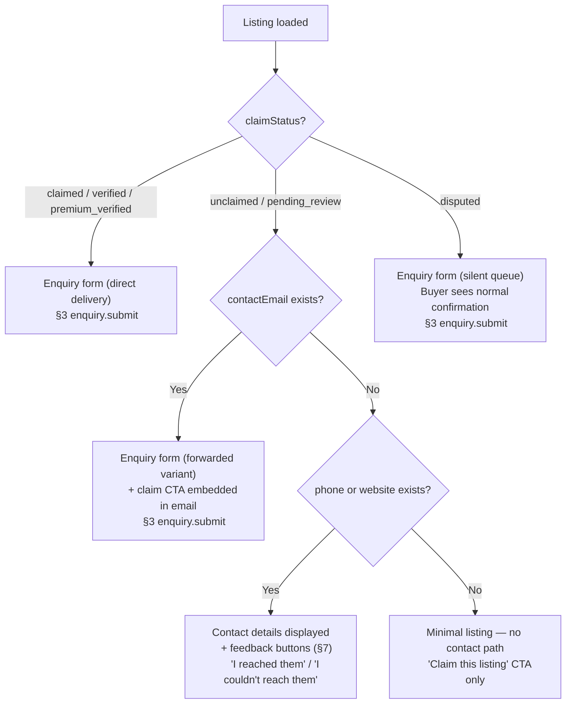

# S6 §2 Listing Profile Page + §7 Contact Attempt Feedback

**Phase:** 2 (Content)
**Agent:** Profile + Contact Feedback
**Written:** 2026-02-14
**Inputs:** `00-skeleton.md`, `01-schema.md`, `01-router-plan.md` (§2.5, §2.6), `01-decisions.md`, `s6-pre-draft-checklist.md`, `platform-and-product.md` (v5 §3, §5.3), `shared-infrastructure.md` (v5 §7)

---

## 2. Listing Profile Page

The listing profile (`/providers/[slug]`) is CALLSHEET's core content page. It renders listing data via SSG+ISR, emits `profile_viewed` for engagement tracking, and adapts its primary CTA based on claim status and available contact information.

### 2.1 Rendering Strategy

SSG with ISR at 15-minute revalidation. [Source: shared-infrastructure.md -- §7.1]

**Static generation:** `generateStaticParams` queries all listings where `lifecycleStatus = "active"` and returns their slugs. New listings not yet statically generated are served via on-demand SSR with ISR caching on first request.

**On-demand revalidation:** Five event-driven triggers invoke `revalidatePath('/providers/' + slug)` via async event consumers. [Source: shared-infrastructure.md -- §7.2]

| Event | Trigger Condition |
|-------|-------------------|
| `claim_approved` | Listing transitions from unclaimed to claimed -- CTA changes, badge appears |
| `listing_suspended` | Admin suspends listing -- page must return 404 or suspended state |
| `listing_archived` | Provider archives listing -- page must return 404 or archived state |
| `listing_reactivated` | Listing restored from archived/suspended -- page must render again |
| `erasure_completed` | Full data erasure -- page must return 404, slug freed |

A sixth event, `verification_tier_changed`, also triggers revalidation (badge update). `profile_edited` revalidation is handled inline during the save handler, not via event bus. [Source: shared-infrastructure.md -- §7.2, SI-19]

```typescript
// src/app/providers/[slug]/page.tsx

export async function generateStaticParams() {
  const slugs = await db.select({ slug: listings.slug })
    .from(listings)
    .where(eq(listings.lifecycleStatus, "active"))
  return slugs.map(s => ({ slug: s.slug }))
}

export const revalidate = 900 // 15 minutes [SI §7.1]
```

### 2.2 Profile Structure

Profile structure varies by `claimStatus` and `entityType`. The authoritative type is `ProfilePage` in `platform-and-product.md` §3.1 -- S6 renders it, does not redefine it.

**Sections rendered by S6:**

| Section | Source Fields | Visibility |
|---------|-------------|------------|
| Identity (name, headline, logo/headshot) | `listings.name`, `listings.headline`, `mediaItems` (type = logo/headshot) | Always |
| Verification badge | `verifications.tier` | Claimed+ only (unclaimed shows nothing) |
| Bio | `listings.bio` | If present (sparse for seeded unclaimed) |
| Taxonomy tags | `listingTaxonomyTags` joined to taxonomy tables | If present, grouped by sector > service area > specialisation |
| Location & availability | `listings.baseRegion`, `listings.serviceRegions`, `listings.travelWillingness`, `listings.availabilityStatus` | If present |
| Credits | `credits` table, sorted year DESC, grouped by format | Claimed+ (seeded data rarely has credits) |
| Accreditations | `accreditations` table | Claimed+ |
| Media gallery | `mediaItems` (portfolio type) | Claimed+ (see §2.7) |
| Social profiles | `socialProfiles` table | If present |
| Engagement signals | `engagements` table (response rate, profile views) | Verified+ listings only [PP concept §3.1] |
| Primary CTA | Computed from `claimStatus` + contact info (see §2.4) | Always |
| Quality score | `qualityScores.composite` | Verified+ listings only (see §2.6) |

Display rules per claim status follow the matrix in `platform-and-product.md` §3.2. S6 does not restate the matrix -- it implements it. Key behavioural difference: unclaimed listings show seeded data only (often sparse), with a "Claim this listing" CTA replacing the enquiry form.

### 2.3 Data Loading

S1's `listing.getBySlug` provides all data needed for the profile page in a single call: listing core fields + verification tier + quality score + taxonomy tags + credits + media items + social profiles + accreditations. [Source: slice-01-data-model.md -- §4.2]

S6 adds no new queries for the profile page. Engagement counters (profile views, enquiry response rate) are read via D&L's `getEngagementCounters(listingId)` query interface. [Source: data-and-listings.md -- §3.1]

```
// src/app/providers/[slug]/page.tsx (server component)
export default async function ListingProfilePage({ params }) {
  const listing = await trpc.listing.getBySlug({ slug: params.slug })
  if (!listing || listing.lifecycleStatus !== "active") notFound()

  const engagement = listing.verificationTier !== "unclaimed"
    ? await getEngagementCounters(listing.id)
    : null

  // Emit, resolve CTA, generate JSON-LD (see §2.4, §2.8, §2.10)
  // ...
}
```

### 2.4 CTA Decision Tree

The primary CTA adapts based on claim status and listing contact information. Four branches:



**CTA resolution pseudocode:**

```
resolveProfileCTA(listing): ProfileCTA
  match listing.claimStatus:
    "claimed" | "verified" | "premium_verified":
      return { type: "enquire", label: "Send Enquiry", target: "enquiry_form" }

    "unclaimed" | "pending_review":
      if listing.contactEmail:
        return { type: "enquire", label: "Send Enquiry", target: "enquiry_form",
                 variant: "forwarded" }
      if listing.phone || listing.website:
        return { type: "contact", label: "Contact Provider", target: "contact_details" }
      return { type: "claim", label: "Is this your business? Claim this listing",
               target: "claim_flow" }

    "disputed":
      return { type: "enquire", label: "Send Enquiry", target: "enquiry_form",
               variant: "silent_queue" }
```

The `ProfileCTA` type is authoritative in `platform-and-product.md` §3.1. S6 adds a `variant` discriminator (`"forwarded"` | `"silent_queue"`) used internally by the enquiry submission handler (§3) to route the enquiry. Buyers see the same "Send Enquiry" label regardless of variant.

**Targeted claim CTA [PP-18]:** When an authenticated user's email domain matches an unclaimed listing's website domain, the CTA upgrades from generic "Claim this listing" to "This looks like your business -- claim it in 2 minutes." This check runs server-side during profile render.

```
resolveClaimCTAVariant(listing, session): ProfileCTA
  if !session: return defaultClaimCTA(listing)
  userDomain = extractDomain(session.email)
  listingDomain = extractDomain(listing.websiteUrl)
  if userDomain && listingDomain && userDomain === listingDomain:
    return { type: "claim_targeted",
             label: "This looks like your business — claim it in 2 minutes",
             target: "claim_flow" }
  return defaultClaimCTA(listing)
```

### 2.5 Verification Badge Display

Visual badge rendered based on `verifications.tier`. Badge is a visual indicator (icon + colour), not text label. [Source: platform-and-product.md -- §3.1, `VerificationBadge` type]

| Tier | Display | Colour | Badge |
|------|---------|--------|-------|
| `unclaimed` | None | -- | No badge rendered |
| `claimed` | Claimed | Grey | Checkmark icon |
| `verified` | Verified | Blue | Shield icon |
| `premium_verified` | Premium Verified | Gold | Shield + star icon |

Badge component receives `verifications.tier` and renders the appropriate icon. No text fallback -- screen readers receive the tier name via `aria-label`.

### 2.6 Quality Score Display

Composite quality score (0-100) displayed only for verified and premium verified listings. Claimed and unclaimed listings do not show a score -- the score exists internally for ranking but is not surfaced to buyers until the listing has passed verification.

Display format: numeric score with a visual indicator (progress arc or bar). Methodology link points to a dedicated page. [Source: slice-05-provider-experience.md -- §4, quality score methodology]

```
renderQualityScore(listing): JSX | null
  if listing.verificationTier not in ["verified", "premium_verified"]:
    return null
  return <QualityScoreIndicator
    score={listing.qualityScore.composite}
    methodologyHref="/quality-score"          // S5 §4 methodology page
  />
```

### 2.7 Media Gallery

Profile page renders media from `mediaItems` table (S1 §1.9). Three variants generated at upload time (S2 §6). [Source: platform-and-product.md -- §4.3, PP-23]

| Variant | Max Width | Profile Page Usage |
|---------|-----------|-------------------|
| Thumbnail | 150px | Grid gallery thumbnails |
| Card | 400px | Inline portfolio display |
| Full | 1200px | Lightbox overlay on click |

Gallery renders as a responsive grid of card-variant images. Clicking any image opens a lightbox displaying the full variant. Images served from Cloudflare R2 via signed URLs (S0 storage abstraction). Lightbox is a client component (`"use client"`) -- the only interactive island on the otherwise server-rendered profile page.

Media items are filtered by `type = "portfolio"`. Logo and headshot are rendered in the identity section, not the gallery. Ordering follows `mediaItems.sortOrder` (provider-controlled via S5 editor).

### 2.8 JSON-LD Structured Data

Listing profiles carry JSON-LD structured data for search engine indexing. Schema type determined by `entityType`. [Source: shared-infrastructure.md -- §7.3]

| Entity Type | JSON-LD @type | Rationale |
|-------------|---------------|-----------|
| `company` | `LocalBusiness` | Standard schema for business entities |
| `freelancer` | `Person` | Standard schema for individual professionals |

No `aggregateRating` at V1 (no reviews system). [Source: shared-infrastructure.md -- §7.3]

```typescript
function generateJsonLd(listing: ListingProfile): JsonLdObject {
  // @type: "LocalBusiness" (company) | "Person" (freelancer) [SI §7.3]
  // Fields mapped: name, description (bio), url (canonical), address (baseRegion),
  //   image (logo/headshot full variant), telephone, sameAs (social profiles)
  // Company-specific: foundingDate (foundedYear), legalName
  // Freelancer-specific: jobTitle (headline), knowsAbout (taxonomy tags)
}
```

The function signature is shown above; field mapping follows schema.org conventions. Full implementation maps listing fields to the appropriate schema properties. The generated JSON-LD is injected into the page `<head>` via Next.js `metadata` or a `<script type="application/ld+json">` tag in the server component.

### 2.9 SEO Meta Tags

Each profile page generates unique meta tags for search engine visibility and social sharing.

```
generateProfileMeta(listing): Metadata
  title: "{listing.name} — {listing.headline} | CALLSHEET"
  description: truncate(listing.bio, 160)          // 160 chars for search snippets
  canonical: "https://callsheet.co.uk/providers/{listing.slug}"
  og:title: "{listing.name} — {listing.headline}"
  og:description: truncate(listing.bio, 200)
  og:image: listing.logo ?? listing.headshot ?? defaultOgImage
  og:type: "profile"
  og:url: canonical
  twitter:card: "summary_large_image"
```

Canonical URL uses the listing slug. If a listing is accessed via an old slug (post-rename), the server redirects 301 to the canonical slug. `og:image` falls back through logo, headshot, then a default CALLSHEET branded image.

### 2.10 `profile_viewed` Event Emission

Emitted server-side during page render (SSG revalidation or SSR fallback). Not client-side -- avoids double-counting on client navigation and bot inflation. [Source: platform-and-product.md -- §1.2]

```typescript
// Inside ListingProfilePage server component, after data load
await emit({
  type: "profile_viewed",
  listingId: listing.id,
  source: inferSource(headers),   // "search" | "direct" | "shortlist"
  timestamp: new Date().toISOString(),
})
```

**Payload matches `ProfileViewedEvent` exactly.** [Source: platform-and-product.md -- §1.2]

```typescript
// Authoritative in platform-and-product.md §1.2 — summary only
type ProfileViewedEvent = {
  type: "profile_viewed"
  listingId: UUID
  source: "search" | "direct" | "shortlist"
  timestamp: ISO8601
}
```

**Source inference:** `inferSource(headers)` reads the `Referer` header. If the referrer contains `/search`, source is `"search"`. If it contains `/dashboard/shortlists`, source is `"shortlist"`. All other referrers (including direct URL entry, external links, and bookmarks) map to `"direct"`.

```
inferSource(headers): "search" | "direct" | "shortlist"
  referer = headers.get("referer") ?? ""
  if referer.includes("/search"): return "search"
  if referer.includes("/dashboard/shortlists"): return "shortlist"
  return "direct"
```

**Consumer:** D&L increments `listing.engagement.profileViews` asynchronously. [Source: platform-and-product.md -- §1.2 consumer table]

**ISR caveat:** During static generation at build time, `profile_viewed` is NOT emitted -- build-time renders are not real user views. The emit executes only during on-demand revalidation (triggered by lifecycle events) and ISR background regeneration (triggered by 15-minute expiry with a real request). The `headers()` call in `inferSource` returns an empty referer during ISR background regeneration; this maps to `"direct"`, which is the correct default for a cache-refresh view.

### 2.11 Acceptance Criteria (§2)

| # | Criterion | Test |
|---|-----------|------|
| AC-2-1 | Profile page renders for any active listing slug via SSG+ISR with 15-minute revalidation | Load `/providers/{slug}` for an active listing; verify HTML response with `cache-control` indicating ISR. |
| AC-2-2 | `generateStaticParams` returns all active listing slugs at build time | Run build; verify static pages generated for all active listings. |
| AC-2-3 | On-demand revalidation fires for `claim_approved`, `listing_suspended`, `listing_archived`, `listing_reactivated`, `erasure_completed`, `verification_tier_changed` | Emit each event; verify `/providers/{slug}` returns updated content within one request. |
| AC-2-4 | Profile page returns 404 for non-existent slugs, archived listings, suspended listings, and erased listings | Request each state; verify 404 response. |
| AC-2-5 | CTA renders as "Send Enquiry" for claimed/verified/premium_verified listings | Load profile for claimed listing; verify enquiry form CTA present. |
| AC-2-6 | CTA renders as "Send Enquiry" (forwarded variant) for unclaimed listings with `contactEmail` | Load profile for unclaimed listing with email; verify enquiry form CTA present. |
| AC-2-7 | CTA renders as "Contact Provider" with phone/website and feedback buttons for unclaimed listings without email | Load profile for unclaimed listing without email but with phone; verify contact details + feedback buttons (§7) rendered. |
| AC-2-8 | CTA renders as "Send Enquiry" for disputed listings (silent queue -- no dispute status exposed) | Load profile for disputed listing; verify standard enquiry form CTA. No UI indication of dispute. |
| AC-2-9 | Targeted claim CTA shown when authenticated user's email domain matches listing website domain [PP-18] | Sign in with matching domain; load unclaimed listing profile; verify targeted CTA text. |
| AC-2-10 | Verification badge displays correct tier icon and colour; no badge for unclaimed | Load profiles at each verification tier; verify badge rendering. Unclaimed: no badge element in DOM. |
| AC-2-11 | Quality score displayed only for verified and premium_verified listings | Load verified listing: score visible. Load claimed listing: no score element. |
| AC-2-12 | Media gallery renders thumbnail grid; clicking opens lightbox with full-size image | Load profile with media items; verify grid. Click image; verify lightbox with full variant URL. |
| AC-2-13 | JSON-LD `<script>` tag present with `LocalBusiness` for companies and `Person` for freelancers | Parse page source for each entity type; validate JSON-LD against schema.org. |
| AC-2-14 | SEO meta tags include title, description, og:image, canonical URL | Parse `<head>` for meta tags; verify values match listing data. |
| AC-2-15 | `profile_viewed` event emitted server-side with P1-compliant payload (`listingId`, `source`, `timestamp`) | Emit captured in test; verify payload matches `ProfileViewedEvent` type exactly. |
| AC-2-16 | `profile_viewed` NOT emitted during build-time static generation | Run build; verify no `profile_viewed` events emitted. |
| AC-2-17 | `inferSource` correctly maps referer to `"search"`, `"shortlist"`, or `"direct"` | Unit test with referer header variations. |

---

## 7. Contact Attempt Feedback

Feedback buttons shown on unclaimed listing profiles where no email is available. Buyers report whether they successfully reached the provider via displayed contact methods (phone, website). This lightweight signal feeds D&L data quality assessment and Ops outreach prioritisation without requiring an enquiry form submission. [Source: platform-and-product.md -- §5.3 branch 2, PP-28]

### 7.1 Context and Visibility

Contact attempt feedback is visible only when the §2.4 CTA decision tree resolves to the "Contact Provider" branch: `claimStatus` is `unclaimed` (or `pending_review`) AND `contactEmail` is null AND at least one of `phone` or `website` exists.

When visible, two buttons render below the contact details section on the profile page:

- **"I reached them"** -- positive signal. Provider's contact details are working.
- **"I couldn't reach them"** -- negative signal. Contact information may be stale or incorrect.

Both buttons are mutually exclusive. After clicking either, buttons are replaced with a confirmation message ("Thanks for letting us know") and disabled for that session. No undo.

### 7.2 `listing.reportContactAttempt` Route

Route added to the existing listing router (S1). [Source: router plan §2.5]

```typescript
// src/server/routers/listing.ts — amendment
listing.reportContactAttempt: publicProcedure
  .input(z.object({
    listingId: z.string().uuid(),
    result: z.enum(["reached", "unreachable"]),
  }))
  .mutation(/* see implementation below */)
```

**Implementation:**

```
listing.reportContactAttempt({ listingId, result }):
  listing = getListing(listingId)
  if !listing: throw NOT_FOUND

  // Guard: only valid for unclaimed listings without email
  if listing.claimStatus !== "unclaimed" || listing.contactEmail:
    throw BAD_REQUEST("Feedback only available for unclaimed listings without email")

  // Rate limit: 1 report per IP per listing per 24 hours
  // Prevents ballot-stuffing. Session-based for authenticated users, IP-based for anonymous.
  rateLimitKey = ctx.session?.userId ?? ctx.ip
  rateLimitCheck(rateLimitKey, listingId, 1, "24h")

  // Emit contact_attempt [PP §1.8 — P1 compliant]
  await emit({
    type: "contact_attempt",
    listingId: listingId,
    result: result,                            // "reached" | "unreachable"
    reporterAccountId: ctx.session?.userId,     // optional — null for anonymous
    timestamp: new Date().toISOString(),
  })
```

No database write within S6. The event payload is the sole output. Consumers in D&L and Ops handle persistence and follow-up.

### 7.3 `contact_attempt` Event Emission

Payload matches `ContactAttemptEvent` exactly. [Source: platform-and-product.md -- §1.8]

```typescript
// Authoritative in platform-and-product.md §1.8 — summary only
type ContactAttemptEvent = {
  type: "contact_attempt"
  listingId: UUID
  result: "reached" | "unreachable"
  reporterAccountId?: UUID
  timestamp: ISO8601
}
```

**P1 compliance check:** All four fields present in `EventPayloadMap` (SI §1.2). `reporterAccountId` is optional (null for anonymous users). No PII beyond the account UUID reference.

### 7.4 Entity Perception

The `contact_attempt` event carries two signals with distinct downstream effects:

| Result | Consumer Domain | Action | Priority |
|--------|----------------|--------|----------|
| `"unreachable"` | D&L | Flag listing for data quality review -- contact info may be stale | High -- triggers quality assessment recalculation |
| `"unreachable"` | Ops | Prioritise listing for outreach -- entity may need to update or claim | Medium -- feeds outreach queue ranking |
| `"reached"` | D&L | Positive data quality signal -- contact info is current | Low -- confirms existing data, no action needed |

Multiple "unreachable" reports on the same listing within a short window (e.g., 3+ in 7 days) strengthen the signal. Aggregation and threshold logic lives in D&L's data quality assessment and Ops' outreach prioritisation -- S6 emits the raw signal only. [Source: platform-and-product.md -- §5.3]

### 7.5 UI Placement

```
┌─────────────────────────────────────────────┐
│  Listing Profile Page                       │
│  ┌─────────────────────────────────────────┐│
│  │  Identity / Verification Badge          ││
│  ├─────────────────────────────────────────┤│
│  │  Bio / Taxonomy / Location              ││
│  ├─────────────────────────────────────────┤│
│  │  Contact Details                        ││
│  │  📞 020 7946 0958                       ││
│  │  🌐 example-provider.co.uk             ││
│  ├─────────────────────────────────────────┤│
│  │  Were you able to reach them?           ││
│  │  [I reached them]  [I couldn't reach]   ││
│  ├─────────────────────────────────────────┤│
│  │  Credits / Media / ...                  ││
│  └─────────────────────────────────────────┘│
└─────────────────────────────────────────────┘
```

The feedback section sits directly below the contact details section, visually associated with the contact information it refers to. It does NOT appear when the CTA is an enquiry form (claimed listings, unclaimed with email, disputed listings).

### 7.6 Acceptance Criteria (§7)

| # | Criterion | Test |
|---|-----------|------|
| AC-7-1 | Feedback buttons visible only on unclaimed listings without `contactEmail` that have phone or website | Load profiles for each CTA branch; verify buttons present only for the correct branch. |
| AC-7-2 | Clicking "I reached them" emits `contact_attempt` with `result: "reached"` | Click button; capture emitted event; verify payload. |
| AC-7-3 | Clicking "I couldn't reach them" emits `contact_attempt` with `result: "unreachable"` | Click button; capture emitted event; verify payload. |
| AC-7-4 | Buttons disabled after click; confirmation message shown; no second submission in same session | Click button; verify UI state change. Attempt second click; verify rejection. |
| AC-7-5 | Rate limit: 1 report per user (or IP) per listing per 24 hours | Submit report; submit again within 24h for same listing; verify rate limit error. |
| AC-7-6 | `contact_attempt` payload matches `ContactAttemptEvent` exactly: `listingId`, `result`, `reporterAccountId?`, `timestamp` | Validate emitted payload against PP §1.8 type definition. |
| AC-7-7 | Route rejects requests for claimed listings or listings with `contactEmail` | Call `listing.reportContactAttempt` for a claimed listing; verify BAD_REQUEST error. |
| AC-7-8 | Anonymous users can submit feedback (`reporterAccountId` is null) | Submit without authentication; verify event emitted with `reporterAccountId: null`. |
