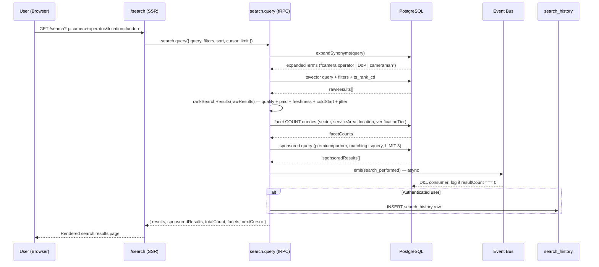

# S6 §1 Search Implementation + §5 Saved Searches & Search History

**Phase:** 2 (Content)
**Agent:** Search + Saved Searches
**Written:** 2026-02-14
**Inputs:** `s6-drafting/00-skeleton.md`, `s6-drafting/01-schema.md` (§1.1, §4.4), `s6-drafting/01-router-plan.md` (§2.1, §2.4), `s6-drafting/01-decisions.md` (D4), `s6-pre-draft-checklist.md` (§3, §5, §8), `platform-and-product.md` (v5 §2), `slice-01-data-model.md` (v2 §3), `shared-infrastructure.md` (v5 §1.2), `commercial-and-revenue.md` (v2 §4.1)

---

## 1. Search Implementation

S6 delivers the buyer-facing search experience: SSR results page, full-text query with ranking, faceted filtering, sponsored placement, autocomplete, zero-result handling, event emission, and authenticated search history recording. The search infrastructure (tsvector, pg_trgm, synonym table, zero_result_queries) is established by S1 §3. S6 adds the presentation layer, ranking composition, facet aggregation, sponsored section, and the `search_performed` event emission that connects search to entity perception.

### 1.1 Search Results Page

The search results page is served at `/search` via SSR. Query parameters encode the full search state, making every results page bookmarkable, shareable, and indexable.

**URL structure:**
```
/search?q={freeText}&sectors={slug}&serviceAreas={slug}&location={region}&sort={relevance|quality_score|recently_updated}&cursor={token}
```

All parameters are optional. An empty `/search` returns all active listings sorted by quality score. Multiple filter values use repeated keys: `?sectors=camera&sectors=lighting`.

**SSR rendering (`/search/page.tsx`):** The page is a server component that calls `search.query` via tRPC server-side. Target TTFB: <500ms p95. [Source: shared-infrastructure.md — §10]

```typescript
// src/app/search/page.tsx (server component)
export default async function SearchPage({ searchParams }) {
  const input = parseSearchParams(searchParams)  // validate + coerce to SearchQueryInput
  const results = await trpc.search.query(input)

  return (
    <SearchLayout>
      <SearchBar defaultQuery={input.query} />
      <ActiveFilters filters={input.filters} />
      <FacetSidebar facets={results.facets} activeFilters={input.filters} />
      <ResultCount total={results.totalCount} />
      <SortSelector current={input.sort} />
      {results.sponsoredResults.length > 0 && (
        <SponsoredSection listings={results.sponsoredResults} />
      )}
      <OrganicResults listings={results.results} />
      {results.totalCount === 0 && (
        <ZeroResultPanel
          suggestions={results.zeroResultSuggestions}
          broadenedFilters={results.suggestedFilters}
        />
      )}
      <CursorPagination nextCursor={results.nextCursor} />
    </SearchLayout>
  )
}
```

**Query parameter handling:** `parseSearchParams` validates all inputs via Zod (same schema as `searchQueryInput` in router plan §2.1). Invalid filter values are silently dropped — a malformed `sectors=xyz` that matches no taxonomy slug is ignored rather than returning an error. This prevents broken links from external referrers.

### 1.2 Full-Text Search

S1 §3 establishes the search infrastructure. S6 consumes it — S6 does not redefine tsvector composition, trigger functions, or index structures.

**What S1 provides** [Source: slice-01-data-model.md — §3.1–§3.3]:
- `search_vector` tsvector column on `listings` with weighted fields: name(A), headline(B), bio(C), base_region(D)
- GIN index on `search_vector` for full-text queries
- GiST trigram index on `listings.name` for fuzzy matching
- `search_synonyms` table for query-time expansion (term → synonym with relevance weight)
- `zero_result_queries` table for tracking failed searches

**What S6 adds:**
- `search.query` tRPC route: composes tsvector query, applies ranking formula, computes facets, fetches sponsored listings, emits `search_performed`, records history
- `search.suggest` tRPC route: autocomplete from taxonomy tables + synonym table
- Client-side search UI: filter bar, sort selector, result cards, pagination
- Sponsored section rendering (separated from organic results)

**Query construction:**

```
searchProviders(input: SearchQueryInput):
  // 1. Synonym expansion [S1 §3.3]
  expandedTerms = expandSynonyms(input.query)
  // "cameraman" → "cameraman | camera operator | DoP"
  // Weight-adjusted: high-weight synonyms boost ts_rank, low-weight dampen

  // 2. Build tsquery
  tsquery = plainto_tsquery('english', expandedTerms)

  // 3. Base filter: lifecycle_status = 'active' [PP-1]
  // Excludes archived, suspended, dissolved, merged listings from all search results

  // 4. Apply user filters as WHERE clauses via taxonomy joins
  // sectors → JOIN listing_taxonomy_tags → taxonomy_sectors WHERE slug IN (...)
  // serviceAreas → JOIN listing_taxonomy_tags → taxonomy_service_areas WHERE slug IN (...)
  // location → WHERE listings.base_region = :region
  // Each filter narrows the result set; empty filter arrays are ignored

  // 5. Execute query with ts_rank_cd [S1 §3.2]
  // SELECT ... ts_rank_cd(search_vector, tsquery) AS relevance FROM listings ...
```

### 1.3 Ranking Formula

Ranking composes five signals into a single score. Quality is earned; payment buys visibility, not credibility. [Source: platform-and-product.md — §2.3]

S1 §3.2 defines the base ranking mechanism (`ts_rank_cd` combined with quality_boost and paid_boost). S6 implements the full composite formula with all five signals:

```typescript
function rankSearchResults(query: SearchQueryInput, rawResults: ListingRow[]): RankedListing[]
  return rawResults.map(listing => {
    const relevance = listing.tsRankScore           // 0–1, from ts_rank_cd
    const quality = listing.qualityScore            // 0–100, from quality_scores.composite [D&L]
    const paidBoost = TIER_LIMITS[listing.subscriptionTier].rankingBoost
    // Authoritative in commercial-and-revenue.md §4.1 — imported via P4
    // free: 0, standard: 15, premium: 25, partner: 25
    const freshness = computeFreshnessBias(listing)
    const coldStart = computeColdStart(listing)

    const finalScore =
        (relevance * 30)            // 0–30: relevance to query terms
      + (quality * 0.45)            // 0–45: quality score contribution
      + paidBoost                   // 0/15/25: paid visibility boost
      + freshness                   // 0–5: recency of last update
      + coldStart                   // 0–5: new listing bonus (≤60 days)
      + jitter()                    // ±3: fair rotation within similar score bands

    return { ...summarise(listing), relevanceScore: relevance,
             qualityScore: quality, paidBoost, finalScore }
  }).sort((a, b) => b.finalScore - a.finalScore)

function computeFreshnessBias(listing: ListingRow): number
  const days = daysSince(listing.lastUpdated)
  if (days <= 7) return 5
  if (days <= 30) return 3
  if (days <= 90) return 1
  return 0

function computeColdStart(listing: ListingRow): number
  const days = daysSince(listing.createdAt)
  if (days <= 30) return 5
  if (days <= 60) return 2
  return 0

function jitter(): number
  return (Math.random() * 6) - 3   // uniform ±3
```

**Critical constraint:** A premium subscriber (boost +25) with quality 30 scores max ~68.5. A free listing with quality 85 scores min ~68.25 at high relevance. Payment cannot overcome poor quality. [Source: platform-and-product.md — §2.3]

**Sort alternatives:** When `sort !== "relevance"`, the ranking formula is bypassed:
- `quality_score`: ORDER BY `quality_scores.composite` DESC, `listings.name` ASC
- `recently_updated`: ORDER BY `listings.last_updated` DESC

Both alternatives still apply the base filter (`lifecycle_status = 'active'`) and user filters.

### 1.4 Facet Counts

Facet counts let buyers see result distribution before filtering. Four facet dimensions: sector, service area, location, verification tier.

```sql
-- Facet query: executed alongside the main search query
-- Uses the same base WHERE clause (lifecycle_status = 'active' + user filters)
-- but groups by each facet dimension independently

-- Sector facets
SELECT ts.slug, ts.name AS label, COUNT(DISTINCT l.id) AS count
FROM listings l
  JOIN listing_taxonomy_tags ltt ON ltt.listing_id = l.id
  JOIN taxonomy_sectors ts ON ts.id = ltt.sector_id
WHERE l.lifecycle_status = 'active'
  AND (search_vector @@ :tsquery OR :tsquery IS NULL)
  -- Apply all filters EXCEPT sector (so buyer sees counts for sectors they haven't selected)
GROUP BY ts.slug, ts.name
ORDER BY count DESC;

-- Service area facets (same pattern, grouped by taxonomy_service_areas)
-- Location facets (grouped by listings.base_region)
-- Verification tier facets (grouped by verifications.tier)
```

**Cross-filter exclusion:** Each facet dimension excludes its own filter from the WHERE clause. Sector facets show counts with all filters applied *except* sector. This prevents a selected sector filter from collapsing all other sector counts to zero — the standard faceted search pattern.

**Performance:** At V1 scale (~4,700 listings), four COUNT queries against indexed columns complete within the 500ms TTFB budget. All facet queries run in a single database round-trip via `Promise.all` or a single compound query. No N+1.

### 1.5 Sponsored Results

Premium and Partner tier listings matching the current query appear in a labelled "Sponsored" section above organic results. Maximum 3 per page. [Source: platform-and-product.md — §2.3]

```
fetchSponsoredResults(tsquery, filters):
  // Separate query — not interleaved with organic ranking
  SELECT l.*, ts_rank_cd(l.search_vector, :tsquery) AS relevance
  FROM listings l
    JOIN subscriptions s ON s.listing_id = l.id
  WHERE l.lifecycle_status = 'active'
    AND s.tier IN ('premium', 'partner')
    AND s.status = 'active'
    AND (l.search_vector @@ :tsquery OR :tsquery IS NULL)
    -- Apply same user filters as organic query
  ORDER BY ts_rank_cd(l.search_vector, :tsquery) DESC
  LIMIT 3
```

**Dual placement:** Sponsored listings also appear in their natural organic position. A premium-tier listing ranks organically (quality + paid_boost) and additionally appears in the sponsored section. This is not double-counting — the sponsored section is visual prominence, the organic position is earned rank. [Source: platform-and-product.md — §2.3]

**`sponsoredPlacement` gate:** Only tiers where `TIER_LIMITS[tier].sponsoredPlacement === true` qualify. Currently: premium and partner. [Source: commercial-and-revenue.md — §4.1]

**Display:** Each sponsored card is marked `isSponsored: true` in `ListingSummary`. The client renders a "Sponsored" label. `subscriptionTier` is never sent to the client — sponsorship is a boolean flag derived server-side. [PP-33]

### 1.6 Autocomplete

`search.suggest` provides prefix-based autocomplete from taxonomy terms and synonyms. Called client-side with debounce.

```
search.suggest({ prefix }):
  if prefix.length < 2: return []

  // Query taxonomy tables + synonym table in parallel
  const [taxonomyMatches, synonymMatches] = await Promise.all([
    db.select({ name: taxonomySectors.name })
      .from(taxonomySectors)
      .where(ilike(taxonomySectors.name, `${prefix}%`))
      .union(
        db.select({ name: taxonomyServiceAreas.name })
          .from(taxonomyServiceAreas)
          .where(ilike(taxonomyServiceAreas.name, `${prefix}%`))
      )
      .union(
        db.select({ name: taxonomySpecialisations.name })
          .from(taxonomySpecialisations)
          .where(ilike(taxonomySpecialisations.name, `${prefix}%`))
      )
      .limit(10),

    db.select({ synonym: searchSynonyms.synonym })
      .from(searchSynonyms)
      .where(ilike(searchSynonyms.term, `${prefix}%`))
      .limit(5),
  ])

  // Merge, deduplicate, rank by match quality
  return deduplicateAndRank([...taxonomyMatches, ...synonymMatches])
    .slice(0, 10)
```

**Client-side debounce:** 300ms delay after last keystroke before firing the request. No event emission — autocomplete is a lightweight lookup that does not warrant tracking. [Source: router plan §2.1]

**Access:** `publicProcedure` — available to anonymous users. No authentication required.

### 1.7 Zero-Result Handling

When a search returns zero organic results, the entity logs the failure and offers alternatives. [Source: platform-and-product.md — §2.2]

```
handleZeroResults(input: SearchQueryInput):
  // 1. Log to zero_result_queries [S1 §1.15, S1-ST-6]
  await db.insert(zeroResultQueries).values({
    query: input.query ?? "",
    filters: input.filters ?? {},
  })

  // 2. Broaden filters: remove the most restrictive filter
  const suggestedFilters = broadenFilters(input.filters)
  // Strategy: if specialisation is set, suggest removing it first.
  // Then service area. Then location. Each broadening re-queries for result count.

  // 3. Find nearest matches in adjacent service areas
  const zeroResultSuggestions = await findNearestMatches(input.filters)
  // Query listings in the parent sector of the selected service area,
  // or in the same location with different service areas.
  // Return up to 5 alternative query descriptions with result counts.

  return { suggestedFilters, zeroResultSuggestions }
```

**`broadenFilters` strategy:** Filters are ordered by specificity: specialisation > service area > location > sector. The function removes the most specific active filter and returns the broadened filter set with a preview count. Multiple broadenings may be suggested (e.g., "Try 'Camera Operator in Scotland' (14 results)" and "Try 'Camera Operator, any location' (47 results)").

**`findNearestMatches`:** Queries the taxonomy hierarchy. If the buyer searched for a specialisation with no results, suggest the parent service area. If the service area is empty in a region, suggest adjacent regions. Returns human-readable query descriptions, not raw SQL.

### 1.8 Event Emission

`search.query` emits `search_performed` with the exact P1-compliant payload from PP §1.1. [Source: platform-and-product.md — §1.1, shared-infrastructure.md — §1.2]

```typescript
// Inside search.query handler, after results computed
emit({
  type: "search_performed",
  query: input.query ?? "",
  filters: input.filters ?? {},             // SearchFilters type [PP-ST-10]
  resultCount: totalCount,
  sessionId: ctx.session?.id,               // optional — null for anonymous searches
  timestamp: new Date().toISOString(),
})
```

**Payload contract:** All fields match `SearchPerformedEvent` in `EventPayloadMap` (SI §1.2). `query` is `string` (empty string for filter-only searches, not `undefined`). `filters` is `SearchFilters` (typed subset: sectors, serviceAreas, specialisations, location). `sessionId` is optional — null for unauthenticated users. [Source: platform-and-product.md — §1.1]

**Consumer:** D&L consumes `search_performed` async for zero-result tracking (feeds quarterly Taxonomy Review ceremony). [Source: slice-01-data-model.md — §10]

### 1.9 Search History Recording

For authenticated users, every search execution writes to the `search_history` table. This happens inside `search.query`, not in a separate consumer.

```typescript
// Inside search.query handler, after event emission
if (ctx.session) {
  await db.insert(searchHistory).values({
    accountId: ctx.session.userId,
    query: input.query ?? null,
    filters: input.filters ?? null,
    resultCount: totalCount,
  })
}
```

**Schema:** `search_history` is defined in S6 schema §1.1. Index on `(account_id, created_at DESC)` supports dashboard queries. [Source: s6-drafting/01-schema.md — §1.1]

**Anonymous users:** No history recorded. The write is gated on `ctx.session` existence.

**Retention:** 12-month rolling. Batch delete via scheduled job (`DELETE FROM search_history WHERE created_at < NOW() - INTERVAL '12 months'`). Configurable via `SEARCH_HISTORY_RETENTION_DAYS = 365`. [Source: operations concept design §5 (SearchHistoryRetention), s6-drafting/01-schema.md — §1.1]

**Resolves upstream flag S1-6:** S1 deferred the `search_history` table and recording logic to S6 ("requires search UI"). S6 implements both.

### 1.10 End-to-End Search Flow



### 1.11 Acceptance Criteria (§1)

| # | Criterion | Test |
|---|-----------|------|
| AC-1 | `/search` renders SSR with TTFB <500ms p95 for queries against 4,700 listings | Performance |
| AC-2 | Query parameters (`q`, `sectors`, `serviceAreas`, `location`, `sort`, `cursor`) round-trip: page renders with correct results for any valid combination | Integration |
| AC-3 | Invalid filter values in query params are silently dropped, not error responses | Integration |
| AC-4 | Full-text search uses `ts_rank_cd` against S1's `search_vector` with synonym expansion from `search_synonyms` table | Integration |
| AC-5 | Ranking formula produces `finalScore = (relevance * 30) + (quality * 0.45) + paidBoost + freshness + coldStart + jitter(±3)` | Unit |
| AC-6 | `TIER_LIMITS[tier].rankingBoost` imported from CR §4.1 — not hardcoded locally (P4 compliance) | Code review |
| AC-7 | Facet counts for sectors, service areas, locations, and verification tiers returned with results; each facet excludes its own dimension from the filter | Integration |
| AC-8 | Sponsored section shows max 3 premium/partner listings matching query, labelled "Sponsored", separate from organic results | Integration |
| AC-9 | Sponsored listings also appear in organic results at their natural rank position (dual placement) | Integration |
| AC-10 | `search.suggest` returns max 10 autocomplete results from taxonomy + synonyms for prefixes ≥2 characters | Integration |
| AC-11 | Zero-result searches insert a row into `zero_result_queries` with query and filters | Integration |
| AC-12 | Zero-result response includes `suggestedFilters` (broadened) and `zeroResultSuggestions` (nearest matches) | Integration |
| AC-13 | `search_performed` event emitted with exact `SearchPerformedEvent` payload: `{ type, query, filters, resultCount, sessionId?, timestamp }` | Integration |
| AC-14 | `search_performed` event `query` field is empty string (not undefined) for filter-only searches | Unit |
| AC-15 | Authenticated searches insert `search_history` row with accountId, query, filters, resultCount | Integration |
| AC-16 | Anonymous searches do not insert `search_history` rows | Integration |
| AC-17 | Only listings with `lifecycle_status = 'active'` appear in search results [PP-1] | Integration |
| AC-18 | `subscriptionTier` is never included in client-side response payload [PP-33] | Unit |

---

## 5. Saved Searches & Search History

Saved searches and search history are complementary buyer features: history is automatic (every authenticated search recorded), saved searches are intentional (buyer explicitly names and persists a search). Both surface on the buyer dashboard at `/dashboard/searches`. Saved searches are stored in `saved_searches` (S1 §2.2), search history in `search_history` (S6 schema §1.1).

### 5.1 Saved Searches

Saved searches allow buyers to name, store, and re-execute search queries. Maximum 20 per account. The `saved_searches` table is defined in S1 §2.2. [Source: slice-01-data-model.md — §2.2]

**Save:**

```
search.saveSearch({ name, query, filters }):
  // Ownership: protectedProcedure — session.userId
  // Capacity check
  const count = await db.select({ count: count() })
    .from(savedSearches)
    .where(eq(savedSearches.accountId, ctx.session.userId))

  if (count >= 20) throw TRPCError("FORBIDDEN", "Maximum 20 saved searches")

  return await db.insert(savedSearches).values({
    accountId: ctx.session.userId,
    name: name.trim(),
    query: query ?? null,
    filters: filters ?? null,
  }).returning()
```

**List:**

```
search.getSavedSearches({ limit }):
  // protectedProcedure
  return await db.select()
    .from(savedSearches)
    .where(eq(savedSearches.accountId, ctx.session.userId))
    .orderBy(desc(savedSearches.createdAt))
    .limit(limit ?? 10)
```

**Delete:**

```
search.deleteSavedSearch({ savedSearchId }):
  // protectedProcedure
  const saved = await db.select()
    .from(savedSearches)
    .where(eq(savedSearches.id, savedSearchId))
    .limit(1)

  if (!saved || saved.accountId !== ctx.session.userId)
    throw TRPCError("NOT_FOUND")

  await db.delete(savedSearches)
    .where(eq(savedSearches.id, savedSearchId))
```

**Rename:** Not a separate route. Re-implemented as a client-side pattern: delete + re-save with new name. Alternatively, a `search.updateSavedSearch({ savedSearchId, name })` mutation can be added at implementation time if UX requires in-place rename. The schema supports either pattern — `name` is a mutable text column.

**Type alignment note:** S1 §2.2 types `saved_searches.filters` as `Record<string, unknown>`. S6's search implementation uses `SearchFilters` (PP §1.1). At implementation time, the column type annotation should be tightened to `$type<SearchFilters>()` for consistency with `search_history.filters`. This is a type annotation change, not a schema migration. [Source: s6-drafting/01-schema.md — §2.3]

### 5.2 Search History

Search history is recorded automatically by `search.query` for authenticated users (§1.9 above). The `searchHistory` router provides read and bulk-delete access.

**List recent:**

```
searchHistory.list({ limit }):
  // protectedProcedure
  // Default limit 10, max 50
  const effectiveLimit = Math.min(limit ?? 10, 50)

  return await db.select({
    id: searchHistory.id,
    query: searchHistory.query,
    filters: searchHistory.filters,
    resultCount: searchHistory.resultCount,
    createdAt: searchHistory.createdAt,
  })
    .from(searchHistory)
    .where(eq(searchHistory.accountId, ctx.session.userId))
    .orderBy(desc(searchHistory.createdAt))
    .limit(effectiveLimit)
```

**Clear all:**

```
searchHistory.clear():
  // protectedProcedure
  await db.delete(searchHistory)
    .where(eq(searchHistory.accountId, ctx.session.userId))
```

**Table:** `search_history` — new in S6. [Source: s6-drafting/01-schema.md — §1.1, §4.1]

**Retention:** 12-month rolling. Enforced via nightly batch delete job using the S0 §3 scheduler infrastructure. The self-perpetuating pattern (action handler schedules its own successor) applies. [Source: operations concept design §5 (SearchHistoryRetention)]

```
// Retention cleanup handler — registered during module init
registerActionHandler("search_history_cleanup", async () => {
  const cutoffDate = new Date()
  cutoffDate.setDate(cutoffDate.getDate() - SEARCH_HISTORY_RETENTION_DAYS)

  await db.delete(searchHistory)
    .where(lt(searchHistory.createdAt, cutoffDate))

  // Schedule next execution (self-perpetuating, S0 §3 pattern)
  await scheduleDeferredAction({
    action: "search_history_cleanup",
    params: {},
    executeAt: addDays(new Date(), 1),
  })
})
// Configurable constant
const SEARCH_HISTORY_RETENTION_DAYS = 365
```

**Correction to schema foundation §1.1:** The schema doc states "Batch delete via scheduled job (not deferred action)" and "not a per-record deferred action." However, the S0 scheduler *is* the mechanism for scheduled jobs — there is no separate cron system at V1. The cleanup uses a self-perpetuating deferred action with `schedule: 'daily'` semantics, consistent with S0's `notification_cleanup` pattern (S0 §3). This requires registering `search_history_cleanup` in `DeferredActionParamsMap` (SI §2.1) and the registered actions table (SI §2.2).

**SI §2.1 addition:**
```typescript
search_history_cleanup: Record<string, never>   // no params — bulk operation
```

**SI §2.2 row:**

| Owner | Action | Trigger | Schedule | Failure |
|-------|--------|---------|----------|---------|
| Platform | `search_history_cleanup` | Self-perpetuating, seeded on startup | `daily` (24h self-schedule) | `log` — retry next cycle |

### 5.3 Dashboard Integration

The buyer dashboard page at `/dashboard/searches` displays both recent searches (from history) and saved searches (from saved_searches). [Source: router plan §2.1, §2.4]

**Page structure:**

```
/dashboard/searches
├── "Recent Searches" section
│   ├── Last 5 entries from searchHistory.list({ limit: 5 })
│   ├── Each entry shows: query text, filter summary, result count, date
│   ├── Click → navigates to /search?q=...&sectors=...  (re-executes search)
│   └── "Clear history" button → searchHistory.clear()
└── "Saved Searches" section
    ├── All saved searches from search.getSavedSearches({})
    ├── Each entry shows: name, query summary, date saved
    ├── "Run" button → navigates to /search?q=...&sectors=...
    ├── "Delete" button → search.deleteSavedSearch({ savedSearchId })
    └── "Save current search" CTA (links to search page)
```

**Rendering:** CSR — authenticated, personalised, no SEO value. Inherits S5's `/dashboard/layout.tsx` auth guard. Uses `protectedProcedure` (any authenticated user), not `providerProcedure`. [Source: router plan §3]

### 5.4 Re-Run Saved Search

Re-running a saved search extracts `query` and `filters` from the saved record and constructs a `/search` URL with the appropriate query parameters.

```typescript
function buildSearchUrl(saved: SavedSearch): string {
  const params = new URLSearchParams()
  if (saved.query) params.set("q", saved.query)
  if (saved.filters) {
    const f = saved.filters as SearchFilters
    f.sectors?.forEach(s => params.append("sectors", s))
    f.serviceAreas?.forEach(s => params.append("serviceAreas", s))
    f.specialisations?.forEach(s => params.append("specialisations", s))
    if (f.location) params.set("location", f.location)
  }
  return `/search?${params.toString()}`
}
```

The re-run navigates to the search results page. The search executes normally via `search.query` — there is no special "re-run" code path. A re-run produces a new `search_history` entry (the search was executed again, potentially with different results).

Re-running from search history uses the same `buildSearchUrl` function, substituting `SearchHistoryEntry` fields for `SavedSearch` fields (both have `query` and `filters` with compatible shapes).

### 5.5 Acceptance Criteria (§5)

| # | Criterion | Test |
|---|-----------|------|
| AC-19 | `search.saveSearch` creates a `saved_searches` row with name, query, filters for the authenticated user | Integration |
| AC-20 | `search.saveSearch` rejects with error when account has 20 saved searches | Integration |
| AC-21 | `search.getSavedSearches` returns only searches belonging to the authenticated user, ordered by createdAt DESC | Integration |
| AC-22 | `search.deleteSavedSearch` deletes the search only if `savedSearch.accountId === session.userId`; returns NOT_FOUND otherwise | Integration |
| AC-23 | `searchHistory.list` returns at most `limit` entries (default 10, max 50), ordered by createdAt DESC, for the authenticated user only | Integration |
| AC-24 | `searchHistory.clear` deletes all `search_history` rows for the authenticated user and no other accounts | Integration |
| AC-25 | `/dashboard/searches` renders "Recent Searches" (last 5 from history) and "Saved Searches" list for authenticated users | E2E |
| AC-26 | Re-running a saved search navigates to `/search?q=...&sectors=...` with correct query parameters extracted from the saved record | E2E |
| AC-27 | Re-running a saved search produces a new `search_history` entry (distinct from the original execution) | Integration |
| AC-28 | `search_history_cleanup` deferred action deletes rows older than 365 days and self-schedules next execution | Integration |
| AC-29 | `search_history_cleanup` is registered in `DeferredActionParamsMap` and seeded on application startup if no pending instance exists | Code review |

---

## Cross-References

| Document | Relationship |
|----------|-------------|
| `slice-01-data-model.md` (v2) §3 | Provides tsvector composition (§3.1), ranking mechanism (§3.2), synonym table (§3.3), zero_result_queries table (§1.15), saved_searches table (§2.2). S6 consumes all. |
| `platform-and-product.md` (v5) §2 | Concept design for search architecture, ranking algorithm, search results page, zero-result handling, entity perception from search. S6 implements. |
| `platform-and-product.md` (v5) §1.1 | `SearchPerformedEvent` payload — authoritative for `search_performed` emission. |
| `commercial-and-revenue.md` (v2) §4.1 | `TIER_LIMITS` with `rankingBoost` values. S6 imports via P4. |
| `shared-infrastructure.md` (v5) §1.2 | `EventPayloadMap` — authoritative type registry for all event payloads. |
| `shared-infrastructure.md` (v5) §2.1–§2.2 | `DeferredActionParamsMap` and registered actions table. S6 adds `search_history_cleanup`. |
| `operations.md` (concept design) §5 | `SearchHistoryRetention`: 12-month rolling for raw records, indefinite for anonymised aggregates, until deletion for saved searches. |
| `s6-drafting/01-schema.md` §1.1, §4.1 | `search_history` table definition (new in S6). |
| `s6-drafting/01-schema.md` §2.3 | `saved_searches` type alignment note (`Record<string, unknown>` → `SearchFilters`). |
| `s6-drafting/01-router-plan.md` §2.1, §2.4 | `search` router and `searchHistory` router definitions. |
| `s6-drafting/01-decisions.md` D4 | PP-Q5 analytics partially addressed by S6 event emissions. Deferred to S9. |
