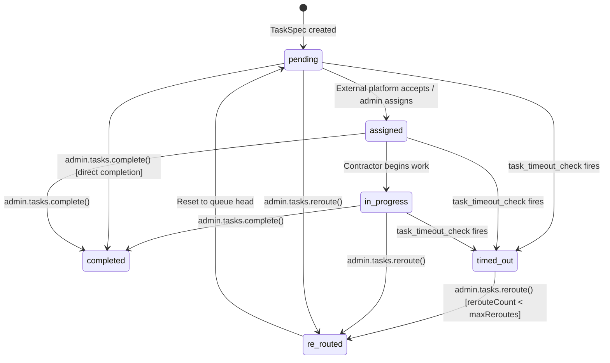
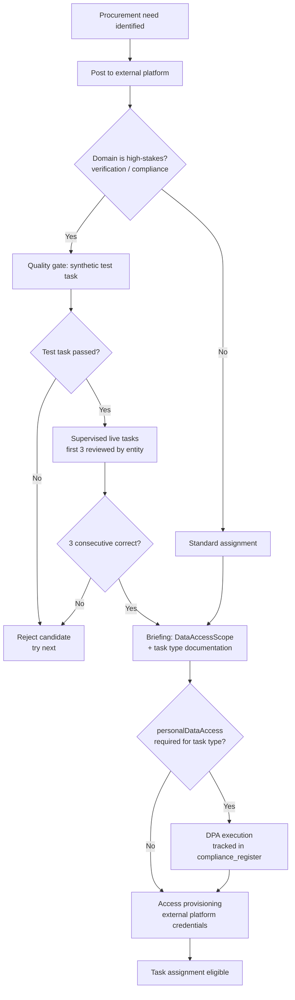

# §3 TaskSpec Queue & Contractor Management

S7 implements the admin-facing TaskSpec queue — the UI and mutation layer through which human procurement work is managed. TaskSpecs are created by upstream slices (S3 for verification, S2 for data cleaning); S7 provides the list view, detail view, lifecycle actions (complete, re-route, escalate), timeout enforcement, and the completion callback mechanism that connects task outcomes back to their originating domains.

---

## 3.1 TaskSpec Lifecycle State Machine

Six states, four admin-triggered transitions, one automated transition (timeout). The `pending` → `assigned` → `in_progress` transitions happen via external platform status updates or manual admin action. Only 4 columns are mutable post-creation: `status`, `rerouteCount`, `completedAt`, `result` (R6 immutability). [Source: `01-schema.md` §2.2, Ops interface spec §4.1]



**Terminal states:** `completed` and `timed_out` (when `rerouteCount >= maxReroutes`). A `timed_out` task that cannot be re-routed requires manual escalation via `admin.tasks.escalate`.

**`re_routed` is transient:** The re-route action increments `rerouteCount`, sets status to `re_routed`, then immediately transitions to `pending`. The `re_routed` status is recorded for audit but the task re-enters the queue within the same mutation.

---

## 3.2 TaskSpec Creation Patterns

TaskSpecs are created by domain-specific logic in upstream slices — S7 does not create TaskSpecs itself (except for manual data cleaning tasks spawned by the admin). The creation function follows the Ops interface spec §4.1 `TaskSpec` type.

### Creation Sites

| Creator | Domain | When | Callback | Source |
|---------|--------|------|----------|--------|
| S3 `evaluateClaim` | `verification` | Manual review queue — CH match ambiguous, sole trader, domain mismatch | None (admin resolves manually) | S3 §5.1 |
| S3 `evaluateClaim` | `verification` | Dispute resolution — competing claim detected | None (admin resolves manually) | S3 §6.2 |
| S3 `evaluateVerificationUpgrade` | `verification` | Portfolio review — score ≥ 6, human review required | `verification_upgrade` → `applyVerificationUpgrade(listingId)` | S3 §7.1, S3-6 |
| S3 `dispute_escalation_check` | `compliance` | Unresolved dispute after 14 days — principal escalation | None (principal determines outcome) | S3 §10 |
| S7 admin (manual) | `data_maintenance` | Phase 3 manual cleaning from 4rfv import pipeline | None (task completes on data fix) | S2-6 |
| S7 admin (manual) | `outreach` | Outreach tasks for unreachable unclaimed listings | None | Ops concept design §2 |
| S7 admin (manual) | `compliance` | Compliance obligations requiring human action | None | Ops concept design §5 |

### Creation Function Signature

```typescript
// Authoritative type: Ops interface spec §4.1 — summary only
async function createTaskSpec(spec: TaskSpec): Promise<{ taskId: UUID }> {
  const taskId = await db.insert(taskSpecs).values({
    ...spec,
    status: "pending",
    rerouteCount: 0,
    maxReroutes: DEFAULT_MAX_REROUTES[spec.domain],
  }).returning({ id: taskSpecs.id })

  // Schedule timeout check [checklist §1.1]
  await scheduleAction("task_timeout_check", { taskId: taskId[0].id },
    new Date(Date.now() + spec.timeout * 60 * 60 * 1000))

  // Decision log [SI §9]
  await logDecision({
    domain: "operations",
    decisionType: "task_routing",
    inputs: { domain: spec.domain, priority: spec.priority, requiredSkills: spec.requiredSkills },
    output: { action: "task_created", taskId: taskId[0].id },
    entityContext: { listingId: spec.context.listingId },
  })

  return { taskId: taskId[0].id }
}
```

**Default max re-routes by domain** (from Ops concept design §2):

| Domain | Default Timeout | Max Re-routes |
|--------|----------------|---------------|
| `verification` (manual review) | 24 hours | 2 |
| `verification` (dispute) | 7 days | 1 |
| `support` | 8 hours | 2 |
| `moderation` | 24 hours | 2 |
| `compliance` | 72 hours | 1 |
| `data_maintenance` | 48 hours | 3 |
| `outreach` | 5 days | 2 |

---

## 3.3 Admin TaskSpec Queue UI

Route: `/admin/tasks` — `admin.tasks.list`. [Source: `01-router-plan.md` §3.3]

The queue is the primary operational interface for managing human procurement work. All filtering, sorting, and pagination are server-side via cursor pagination.

### List View

```typescript
// Input: taskListInput (from 01-router-plan.md §3.3)
// Filters: domain, status, priority — all optional
// Sort: "deadline" | "priority" | "created_at" (default: "priority")
// Pagination: cursor-based, 20 per page (max 50)
```

**List row displays:** task ID, domain badge, task summary (first line of `task` field), priority badge, status badge, deadline (with countdown if approaching), estimated time, re-route count, created timestamp.

**Filter presets for upstream flag resolution:**
- S3-2 (admin claim review): `domain = "verification"`, `status IN ("pending", "assigned", "in_progress")` — surfaces all pending claim review TaskSpecs.
- S2-6 (manual data cleaning): `domain = "data_maintenance"` — surfaces Phase 3 4rfv import cleaning tasks.
- S3-3 (dispute resolution): `domain = "verification"` filtered client-side by `context.taskType === "dispute_resolution"` — the dispute context is inspectable in the detail view.

**Query strategy:** Single `SELECT` from `task_specs` with optional WHERE clauses per filter, ORDER BY per sort column, cursor-based pagination via `id` tiebreaker. Uses `(domain, status)` and `(status, priority)` indexes. No joins on the list view — listing context is displayed on the detail view only.

---

## 3.4 TaskSpec Detail View

Route: `/admin/tasks/[taskId]` — `admin.tasks.getDetail`. [Source: `01-router-plan.md` §3.3]

The detail view renders the immutable context snapshot, checklist, and provides action controls.

### Content Panels

**Context panel:** Renders the JSONB `context` field as structured key-value display. Context is immutable (R6) — captured at task creation, never updated. All data the contractor needs to complete the task is present in this snapshot regardless of subsequent changes to the source entities.

**Listing context panel:** Joined from `listings` table via `context->>'listingId'` (LEFT JOIN). Displays current listing name, entity type, verification tier. This is *live data* — distinct from the immutable snapshot in `context`. The juxtaposition lets the admin see both what the data looked like when the task was created and what it looks like now.

```
admin.tasks.getDetail({ taskId }):
  // Single query: LEFT JOIN task_specs → listings via context->>'listingId'
  // Extracts listingId from JSONB, joins in one round-trip [checklist §10.5]
  task = SELECT ts.*, l.name as listing_name, l.entity_type, v.tier as verification_tier
    FROM task_specs ts
    LEFT JOIN listings l ON l.id = (ts.context->>'listingId')::uuid
    LEFT JOIN verifications v ON v.listing_id = l.id
    WHERE ts.id = :taskId
```

**Checklist panel:** Renders `checklist: string[]` as an ordered checkbox list. Checkboxes are informational for the admin — they are not persisted to the database (contractors operate on external platforms at V1). The admin uses the checklist to verify work completeness before marking the task complete.

**Evidence panel:** For verification-domain tasks, the `context` snapshot contains `evidenceUrls`, `companiesHouseNumber`, `claimEmail`, and `confidenceScore`. The detail view renders these in a structured evidence summary. For dispute tasks, `context` contains both claimants' data for side-by-side comparison (S3-3).

**External routing panel:** If `externalRef` is populated, displays the external platform reference and a link to the external task (constructed from `externalPlatform` + `externalRef`). If null, the task is awaiting external assignment.

---

## 3.5 Completion Callback Mechanism

`admin.tasks.complete` checks the task's `context.callbackType` field to dispatch domain-specific callbacks after marking the task as completed. [Source: `01-router-plan.md` §3.3, S3-6]

```
admin.tasks.complete({ taskId, result }):
  task = getTask(taskId)
  if task.status === "completed": return            // idempotent

  // 1. Update task status
  update task_specs
    SET status = "completed", completedAt = now(), result = result
    WHERE id = taskId

  // 2. Cancel timeout deferred action
  cancelAction("task_timeout_check", { taskId })

  // 3. Domain-specific completion callback
  if task.context.callbackType:
    match task.context.callbackType:
      "verification_upgrade":
        // S3-6: portfolio review → apply verification upgrade
        // S3 §7.2 applyVerificationUpgrade updates verifications table,
        // emits verification_tier_changed, recalculates quality score
        await applyVerificationUpgrade(
          task.context.listingId,
          "verified",              // newTier — portfolio review always upgrades to Verified
          task.context.score + 1   // score incremented by portfolio pass
        )

  // 4. Decision log [SI §9]
  logDecision({
    domain: "operations",
    decisionType: "task_routing",
    inputs: { taskId, domain: task.domain, callbackType: task.context.callbackType },
    output: { action: "completed", result, callbackExecuted: !!task.context.callbackType },
    entityContext: { listingId: task.context.listingId },
  })
```

**Extensibility:** New callback types are added in S8/S9 by extending the `match` block. The handler does not change structurally — each new callback type maps to a single imported function call. No consumer registration needed; the dispatch is a simple pattern match on a string field within the immutable context.

**Callback types at V1:**

| `callbackType` | Created By | Handler | Import |
|----------------|-----------|---------|--------|
| `verification_upgrade` | S3 `buildPortfolioReviewTaskSpec` | `applyVerificationUpgrade(listingId, newTier, score)` | `src/domains/data-and-listings/verification/evaluate-upgrade.ts` (S3 §7.2) |

**Tasks without callbacks:** Most TaskSpecs (manual review, dispute resolution, data cleaning, outreach) have no `callbackType` in their context. Completion marks the task as done and logs the decision — no further side effects.

---

## 3.6 Re-Route Logic

`admin.tasks.reroute` resets a task to the queue head after a contractor fails to complete it. [Source: `01-router-plan.md` §3.3]

```
admin.tasks.reroute({ taskId, reason }):
  task = getTask(taskId)

  // Guard: re-route limit
  if task.rerouteCount >= task.maxReroutes:
    throw TRPCError({
      code: "PRECONDITION_FAILED",
      message: "Max re-routes (" + task.maxReroutes + ") reached. Use escalate instead."
    })

  // Guard: cannot re-route a completed task
  if task.status === "completed":
    throw TRPCError({ code: "BAD_REQUEST", message: "Cannot re-route a completed task" })

  // Apply re-route
  update task_specs
    SET status = "pending",                        // back to queue head
        rerouteCount = task.rerouteCount + 1,
        externalRef = null,                        // clear external assignment
        externalPlatform = null
    WHERE id = taskId

  // Re-schedule timeout from now
  cancelAction("task_timeout_check", { taskId })
  scheduleAction("task_timeout_check", { taskId },
    new Date(Date.now() + task.timeout * 60 * 60 * 1000))

  // Decision log [SI §9]
  logDecision({
    domain: "operations",
    decisionType: "task_routing",
    inputs: { taskId, domain: task.domain, rerouteCount: task.rerouteCount + 1 },
    output: { action: "re_routed", reason },
    entityContext: { listingId: task.context.listingId },
  })
```

**`externalRef`/`externalPlatform` reset:** On re-route, the external reference is cleared. The task returns to `pending` without an external assignment. A new contractor is assigned via the external platform or manually by the admin.

**Timeout restart:** The `task_timeout_check` deferred action is cancelled and re-scheduled from the re-route timestamp. The full timeout period resets — the new contractor gets the full allocation.

---

## 3.7 Escalation

`admin.tasks.escalate` elevates a task to the principal. Used when re-routes are exhausted, the task is blocked, or the admin cannot resolve it. [Source: `01-router-plan.md` §3.3]

```
admin.tasks.escalate({ taskId, reason }):
  task = getTask(taskId)

  // Set priority to critical
  update task_specs SET priority = "critical" WHERE id = taskId

  // Create admin notification [D4]
  createNotification({
    accountId: getAdminAccountId(),               // admin's own account
    type: "task_overdue",
    title: "Task escalated: " + task.task.substring(0, 80),
    body: reason,
    metadata: { taskId, domain: task.domain },
  })

  // Decision log [SI §9]
  logDecision({
    domain: "operations",
    decisionType: "task_routing",
    inputs: { taskId, domain: task.domain, previousPriority: task.priority },
    output: { action: "escalated", newPriority: "critical", reason },
    entityContext: { listingId: task.context.listingId },
  })
```

Escalation does not change the task status — the task remains in its current state but with `critical` priority, surfacing it at the top of the admin queue. The `task_overdue` notification alerts the admin (and by extension the principal, who monitors admin notifications).

---

## 3.8 Timeout Enforcement — `task_timeout_check` Deferred Action

Scheduled at task creation with delay = `timeout` hours. [Source: checklist §1.1, Ops concept design §2]

```
handleDeferredAction("task_timeout_check", { taskId }):
  task = getTask(taskId)

  // Only act on active tasks
  if task.status NOT IN ("pending", "assigned", "in_progress"):
    return                                          // already completed or re-routed — no-op

  // Timeout the task
  update task_specs SET status = "timed_out" WHERE id = taskId

  // Create admin notification [D4]
  createNotification({
    accountId: getAdminAccountId(),
    type: "task_overdue",
    title: "Task timed out: " + task.task.substring(0, 80),
    body: "Domain: " + task.domain + ", timeout: " + task.timeout + "h, re-routes: " + task.rerouteCount + "/" + task.maxReroutes,
    metadata: { taskId, domain: task.domain },
  })

  // Decision log [SI §9]
  logDecision({
    domain: "operations",
    decisionType: "task_routing",
    inputs: { taskId, domain: task.domain, timeout: task.timeout },
    output: { action: "timed_out", rerouteCount: task.rerouteCount, maxReroutes: task.maxReroutes },
    entityContext: { listingId: task.context.listingId },
  })
```

**Retry policy:** `once` — if the handler fails, it logs the failure but does not retry. The admin can manually re-route or escalate timed-out tasks via the queue UI. At V1 scale (~30 tasks/month), handler failures are rare enough that manual intervention is appropriate.

**Partial index usage:** The `(deadline) WHERE status IN ('pending', 'assigned', 'in_progress')` partial index on `task_specs` supports the timeout check query — only active tasks are candidates for timeout.

---

## 3.9 External Routing Interface Contract (D5a)

At V1, contractors are managed via external platforms (Upwork, PeoplePerHour, or similar). S7 specifies the interface contract; the specific marketplace is a deployment-time decision. [Source: `01-decisions.md` D5a]

**Fields on `task_specs`:**

| Field | Type | Purpose |
|-------|------|---------|
| `externalRef` | `text \| null` | External platform reference ID (e.g., Upwork job ID). Populated when the task is posted to an external platform. |
| `externalPlatform` | `text \| null` | Platform name (`"upwork"`, `"peopleperhour"`, etc.). Used to construct external links in the admin detail view. |

**Completion paths:**

1. **Manual admin completion:** Admin reviews contractor's work on the external platform, then calls `admin.tasks.complete` in CALLSHEET. This is the V1 primary path.
2. **Webhook callback (V2+):** External platform posts completion webhook to a CALLSHEET endpoint. The handler validates the webhook, extracts the result payload, and calls the internal completion flow. S7 reserves the webhook URL pattern (`/api/webhooks/tasks/:externalPlatform`) but does not implement the handler — deferred to V2 when external platform integration is built.

**Status polling (V2+):** A periodic job checks `externalRef` on active tasks against the external platform API to detect status changes. Deferred to V2.

---

## 3.10 Contractor Lifecycle (D5c)

Contractor lifecycle is specified at the interface level; implementation details (NDA templates, briefing documents, DPA text) are deferred to pre-launch governance. [Source: `01-decisions.md` D5c]



**DPA tracking:** When a contractor signs a DPA, a `compliance_register` entry is created with `type: "obligation"` and `details: { contractorId, dpaSignedAt, scope }`. The `checkComplianceHold` query does not inspect DPA entries — they are audit records, not blocking holds. [Source: Ops concept design §2, D7]

**Quality gate fallback:** If 3 consecutive marketplace candidates fail the test task and the queue is approaching SLA breach (>50% of timeout elapsed on oldest pending task), the entity activates supervised bypass: route to next candidate without test task, review every output, cap at 10 bypassed tasks before forcing principal action. [Source: Ops concept design §2]

---

## 3.11 Upstream Flag Resolutions

| Flag | Resolution |
|------|-----------|
| **S3-2** | Admin claim review UI: `admin.tasks.list` filtered by `domain = "verification"` displays all pending claim review TaskSpecs. Detail view renders listing context (name, entity type, verification tier), evidence URLs, confidence score, and the ordered checklist — all from the immutable `context` snapshot. |
| **S3-3** | Dispute resolution detail view: dispute TaskSpecs have `context.taskType === "dispute_resolution"` with both claimants' data in the `context` snapshot. The detail view renders a side-by-side comparison panel: original claimant vs. new claimant, evidence for each, timeline of claim events. Admin resolves by completing the task with `result: { winner: "original" | "new", reasoning: string }`. |
| **S3-6** | Completion callback for portfolio review: `admin.tasks.complete` detects `context.callbackType === "verification_upgrade"` and calls S3's `applyVerificationUpgrade(listingId, "verified", score + 1)`. This updates the `verifications` table, emits `verification_tier_changed`, recalculates quality score, and logs the decision. [Source: S3 §7.2] |
| **S2-6** | Manual cleaning TaskSpecs from 4rfv import pipeline: S2's Phase 3 export script identifies records requiring manual attention. Admin creates `data_maintenance` domain TaskSpecs via the queue UI (or a batch creation endpoint if volume warrants — V1 assumes manual creation). The TaskSpec `context` contains the listing ID, flagged fields, and the cleaning rationale from the export script output. |
