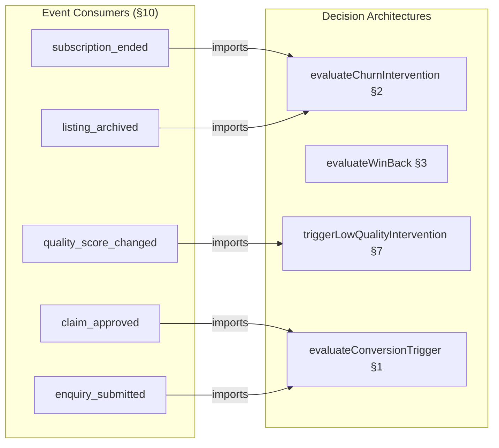

# S8 Router Plan — Commercial & Revenue

**Status:** Phase 1 output
**Slice:** `slices/slice-08-commercial/` (multi-file format)
**Skeleton sections covered:** §1 Conversion Trigger Engine, §2 Churn Detection & Intervention, §3 Win-Back Evaluation & Delivery, §4 Sponsored Placement, §5 Revenue Perception & Metrics, §6 Feature Gate Friction Evaluation, §7 Low-Quality Intervention, §8 Refund Evaluation, §9 Pricing Configuration, §10 Event Consumer Implementations

---

## 1. File Tree

S8 has a minimal route surface — 4 tRPC routes. The bulk of CR logic lives in event consumer handlers (8), deferred action handlers (2), and domain-internal decision architectures. No user-facing pages; CR owns the logic, PP owns the UI surface.

```
src/server/routers/
└── commercial.ts                          # tRPC router (4 routes)

src/server/commercial/
├── conversion-triggers.ts                 # 6 trigger evaluators, state tracking, cooldown (§1)
├── churn-intervention.ts                  # evaluateChurnIntervention decision architecture (§2)
├── winback-evaluation.ts                  # evaluateWinBack decision architecture (§3)
├── sponsored-placement.ts                 # selectSponsoredListings, rotation, fairness (§4)
├── revenue-perception.ts                  # RevenuePerception computation (§5)
├── feature-gate-friction.ts              # evaluateFeatureGateFriction monthly analysis (§6)
├── low-quality-intervention.ts           # triggerLowQualityIntervention + check_quality_improvement (§7)
├── refund-evaluation.ts                  # evaluateRefund decision architecture (§8)
└── pricing-config.ts                     # PRICING const + monthly display values (§9)

src/server/consumers/commercial/
├── subscription-tier-changed.ts          # Revenue metrics update, conversion/downgrade logging
├── subscription-ended.ts                 # Churn logging, win-back scheduling (P3 origin branch)
├── claim-approved.ts                     # Conversion funnel entry, trigger state reset, win-back cancel
├── listing-archived.ts                   # Paid archival churn logging
├── quality-score-changed.ts             # Low-quality intervention trigger
├── account-closed.ts                     # Closure churn logging, win-back cancel, revenue update
├── enquiry-submitted.ts                  # first_enquiry conversion trigger (query-in-handler)
└── erasure-completed.ts                  # Win-back cancel, churn log anonymisation, trigger state clear

src/server/actions/commercial/
├── win-back-evaluation.ts                # Deferred action handler: 60-day win-back evaluation
└── check-quality-improvement.ts          # Deferred action handler: 30-day quality re-check

src/db/schema/commercial.ts               # 3 tables: commercial_state, churn_analysis_log, sponsored_impressions
```

**Backend-only sections (no tRPC routes):**

| Section | Why No Route | Where Logic Lives |
|---------|-------------|-------------------|
| §1 Conversion Triggers | Event-driven. Triggers fire from consumer handlers (§10). `evaluateUpgradeSuggestion` is the only route surface. | `src/server/commercial/conversion-triggers.ts` — imported by consumers |
| §2 Churn Detection | Event-driven. `evaluateChurnIntervention` is called by `subscription_ended` and `listing_archived` consumer handlers. | `src/server/commercial/churn-intervention.ts` — imported by consumers |
| §3 Win-Back | Deferred-action-driven. `evaluateWinBack` fires 60 days after subscription end. | `src/server/commercial/winback-evaluation.ts` + `src/server/actions/commercial/win-back-evaluation.ts` |
| §6 Feature Gate Friction | Admin-only. Consumed via Ops `getFeatureGateFrictionSummary` query interface (Ops §3.4). S8 provides the evaluation logic; S7 exposes the admin route. | `src/server/commercial/feature-gate-friction.ts` |
| §7 Low-Quality Intervention | Event-driven. Fires from `quality_score_changed` consumer. Follow-up fires from `check_quality_improvement` deferred action. | `src/server/commercial/low-quality-intervention.ts` |
| §8 Refund Evaluation | Admin-driven. `evaluateRefund` provides the decision architecture; S7's `admin.refunds.evaluate` route calls it. | `src/server/commercial/refund-evaluation.ts` — imported by S7 refunds route |
| §9 Pricing Configuration | Static export. `PRICING` const imported by PP pricing page and CR internals. No route needed. | `src/server/commercial/pricing-config.ts` |
| §10 Event Consumers | Handler registrations in `EVENT_CONSUMER_MATRIX`. Code modules, not routes. | `src/server/consumers/commercial/*.ts` |

---

## 2. tRPC Router Inventory

### 2.1 commercial (`src/server/routers/commercial.ts`)

4 routes. 3 queries, 0 mutations. CR has no mutations — all state changes flow through event consumers or deferred actions, not user-initiated tRPC calls.

| Route | Procedure | Input | Return | SSR/CSR | Section | Description |
|-------|-----------|-------|--------|---------|---------|-------------|
| `commercial.getSponsoredListings` | `protectedProcedure` | `SponsoredListingsInput` | `SponsoredListingResult[]` | SSR | §4 | Called by PP search results page to inject 0-3 sponsored listings into results |
| `commercial.getRevenuePerception` | `adminProcedure` | `{}` | `RevenuePerception` | CSR | §5 | Admin dashboard revenue panel — MRR, tier distribution, churn rate, conversion rate |
| `commercial.evaluateUpgradeSuggestion` | `protectedProcedure` | `{ listingId: UUID }` | `UpgradeSuggestion \| null` | CSR | §1 | Provider dashboard upgrade CTA — checks trigger state and returns the highest-priority unfired trigger |
| `commercial.getConversionTriggerState` | `protectedProcedure` | `{ listingId: UUID }` | `ConversionTriggerState` | CSR | §1 | Internal: reads commercial_state trigger tracking fields for a listing |

```typescript
// src/server/routers/commercial.ts
export const commercialRouter = router({
  getSponsoredListings: protectedProcedure
    .input(sponsoredListingsInput)
    .query(/* §4 selectSponsoredListings */),
  getRevenuePerception: adminProcedure
    .query(/* §5 computeRevenuePerception */),
  evaluateUpgradeSuggestion: protectedProcedure
    .input(z.object({ listingId: z.string().uuid() }))
    .query(/* §1 evaluateUpgradeSuggestion */),
  getConversionTriggerState: protectedProcedure
    .input(z.object({ listingId: z.string().uuid() }))
    .query(/* §1 getConversionTriggerState */),
})
```

**Total routes:** 4 (3 query, 0 mutation). 1 `adminProcedure`, 3 `protectedProcedure`. No `publicProcedure` routes in S8.

---

### 2.2 Route Specifications

#### `commercial.getSponsoredListings`

Called server-side by PP's search results page during SSR. PP passes the current search query; CR returns 0-3 sponsored listing IDs with placement metadata.

```typescript
const sponsoredListingsInput = z.object({
  sectorId: z.number().int().optional(),
  serviceAreaIds: z.array(z.number().int()).optional(),
  locationSlug: z.string().optional(),
})

type SponsoredListingResult = {
  listingId: UUID
  position: number                         // 0-indexed slot within sponsored section
  isSponsored: true                        // constant — used by PP to render "Sponsored" badge
}
```

**Selection logic:** Delegates to `selectSponsoredListings` (§4) which reads Premium/Partner listings matching the query's taxonomy overlap, applies quality floor (composite >= 50), rotation offset, and fairness cap. Returns 0-3 results. [Source: CR concept design §4.4]

**Calling pattern:** PP search results page calls `commercial.getSponsoredListings` alongside the main search query during SSR. The two calls are independent — sponsored results are not mixed into organic results. PP renders the sponsored section above or alongside organic results with a "Sponsored" label. [Resolves S6-1]

**Access control:** `protectedProcedure` — requires authenticated session. Anonymous users see search results without sponsored listings (no upsell for anonymous browsing). The PP search page conditionally calls this route only when `ctx.session` exists.

#### `commercial.getRevenuePerception`

Admin-only. Returns the current revenue perception snapshot for the admin dashboard revenue panel.

```typescript
type RevenuePerception = {
  mrr: number                              // Monthly Recurring Revenue (GBP)
  arr: number                              // Annual Recurring Revenue (GBP)
  tierDistribution: Record<SubscriptionTier, number>  // count per tier
  churnRate30d: number                     // % churned in last 30 days
  churnRate90d: number                     // % churned in last 90 days
  conversionRate30d: number                // free→paid conversion rate, last 30 days
  netRevenueRetention: number              // NRR percentage
  averageRevenuePerListing: number         // MRR / paid listing count
}
```

**Computation:** On-demand aggregate query over `churn_analysis_log` + `listings` subscription data. No caching at V1 — ~200 paid subscribers makes this trivial. [Resolves S4-5]

#### `commercial.evaluateUpgradeSuggestion`

Provider dashboard upgrade CTA. Reads the listing's `commercial_state` and returns the highest-priority unfired conversion trigger as a suggestion, or `null` if no triggers are eligible.

```typescript
type UpgradeSuggestion = {
  triggerType: ConversionTriggerType
  headline: string                         // e.g., "Your listing was viewed 100 times this month"
  description: string                      // value proposition for upgrade
  upgradeUrl: string                       // pre-filled checkout URL
  dismissable: boolean                     // true — user can dismiss for cooldown period
}

type ConversionTriggerType =
  | "first_enquiry"
  | "competitor_upgraded"
  | "analytics_teaser"
  | "social_proof"
  | "view_milestone"
  | "engagement_summary"
```

**Access control:** `protectedProcedure`. The route verifies `ctx.session.accountId` owns the listing (via `listings.accountId` check) before evaluating. Returns `null` for listings the caller does not own.

#### `commercial.getConversionTriggerState`

Internal route for checking trigger state. Used by the provider dashboard to determine which conversion CTAs have already fired, which are on cooldown, and which are eligible.

```typescript
type ConversionTriggerState = {
  listingId: UUID
  lastViewMilestoneFired: number | null    // 50 | 100 | 200 | null
  firstEnquiryTriggerFired: boolean
  competitorUpgradedFired: number          // firing count
  searchTermTeaseFired: number             // firing count
  endowmentCtaShown: boolean
}
```

**Access control:** `protectedProcedure`. Same ownership check as `evaluateUpgradeSuggestion` — verifies `ctx.session.accountId` owns the listing.

---

## 3. Rendering Strategy

| Route | Strategy | Rationale |
|-------|----------|-----------|
| `commercial.getSponsoredListings` | **SSR** | Called during search results page SSR. Sponsored listings must render server-side alongside organic results for SEO and performance. No client-side fetch — injected into the initial page render. [Source: SI §7.1 — search results are SSR] |
| `commercial.getRevenuePerception` | **CSR** | Admin dashboard. Authenticated, role-guarded, no SEO value. Interactive. [Source: SI §7.1 — dashboard/admin is CSR] |
| `commercial.evaluateUpgradeSuggestion` | **CSR** | Provider dashboard. Authenticated, personalised. CTA renders client-side after dashboard shell loads. |
| `commercial.getConversionTriggerState` | **CSR** | Provider dashboard internal. Authenticated, personalised. |

S8 adds no SSG or ISR pages. All user-facing page shells (search results, provider dashboard, admin dashboard) are owned by prior slices (S5, S6, S7). S8 provides the data routes those pages consume.

---

## 4. Event Consumer Handlers

8 consumer handlers registered in `EVENT_CONSUMER_MATRIX`. All `domain: "commercial"`, all `mode: "async"`. All consumers already exist in the matrix (registered during CR interface spec drafting). S8 provides handler implementations.

| File | Consumer ID | Event | Signature |
|------|------------|-------|-----------|
| `subscription-tier-changed.ts` | `commercial:subscription_tier_changed:revenueMetricsUpdate` | `subscription_tier_changed` | `handleSubscriptionTierChanged(payload: SubscriptionTierChangedEvent): Promise<void>` |
| `subscription-ended.ts` | `commercial:subscription_ended:churnLogging` | `subscription_ended` | `handleSubscriptionEnded(payload: SubscriptionEndedEvent): Promise<void>` |
| `claim-approved.ts` | `commercial:claim_approved:conversionReset` | `claim_approved` | `handleClaimApproved(payload: ClaimApprovedEvent): Promise<void>` |
| `listing-archived.ts` | `commercial:listing_archived:archivalChurn` | `listing_archived` | `handleListingArchived(payload: ListingArchivedEvent): Promise<void>` |
| `quality-score-changed.ts` | `commercial:quality_score_changed:lowQualityIntervention` | `quality_score_changed` | `handleQualityScoreChanged(payload: QualityScoreChangedEvent): Promise<void>` |
| `account-closed.ts` | `commercial:account_closed:closureChurn` | `account_closed` | `handleAccountClosed(payload: AccountClosedEvent): Promise<void>` |
| `enquiry-submitted.ts` | `commercial:enquiry_submitted:firstEnquiryTrigger` | `enquiry_submitted` | `handleEnquirySubmitted(payload: EnquirySubmittedEvent): Promise<void>` |
| `erasure-completed.ts` | `commercial:erasure_completed:erasureCleanup` | `erasure_completed` | `handleErasureCompleted(payload: ErasureCompletedEvent): Promise<void>` |

**Consumer-to-domain-logic imports:**



Per D5: §10 (Event Consumers) is authoritative for handler implementation. §1/§2/§3/§7 provide exported decision architecture pseudocode that §10's handlers invoke. No handler body duplication across content files.

---

## 5. Deferred Action Handlers

2 deferred action handlers. Both `domain: "commercial"`, both `retryPolicy: "once"`, both `onFailure: "log"`.

| File | Action | Params Type | Signature |
|------|--------|-------------|-----------|
| `win-back-evaluation.ts` | `win_back_evaluation` | `{ listingId: UUID; accountId: UUID }` | `handleWinBackEvaluation(params: { listingId: UUID; accountId: UUID }): Promise<void>` |
| `check-quality-improvement.ts` | `check_quality_improvement` | `{ listingId: UUID; baselineScore: number }` | `handleCheckQualityImprovement(params: { listingId: UUID; baselineScore: number }): Promise<void>` |

**`win_back_evaluation`:** Already registered in SI §2.1/§2.2 (added during S4 spec work). Handler calls `evaluateWinBack` (§3) which reads D&L `getEngagementCounters` for post-cancellation activity, decides eligibility, and emits `winback_eligible` with merge fields if eligible. [Resolves S4-3, S7-1]

**`check_quality_improvement`:** NEW — must be added to SI §2.1 `DeferredActionParamsMap` and SI §2.2 registered actions table during S8. Handler reads current quality score for the listing, compares to `baselineScore`. If score improved above 40, no action. If still below 40, emits `churn_risk_detected` with `riskFactors: ["low_quality_paid"]`. [Source: CR concept design §4.6]

---

## 6. Route-to-Skeleton Section Mapping

| Skeleton Section | Primary Route / Handler | Backend-Only Notes |
|-----------------|------------------------|-------------------|
| §1 Conversion Triggers | `commercial.evaluateUpgradeSuggestion`, `commercial.getConversionTriggerState` | 6 trigger evaluators imported by consumer handlers in §10. `conversion_milestone` event emitted on trigger fire. |
| §2 Churn Detection | No route | `evaluateChurnIntervention` imported by §10 consumers. `churn_risk_detected` event emitted. |
| §3 Win-Back | No route | `evaluateWinBack` called by `win_back_evaluation` deferred action handler. `winback_eligible` event emitted. |
| §4 Sponsored Placement | `commercial.getSponsoredListings` | `sponsored_impressions` table written per search impression. Fairness monitoring via per-service-area aggregate query. |
| §5 Revenue Perception | `commercial.getRevenuePerception` | On-demand aggregate query. No caching at V1. |
| §6 Feature Gate Friction | No route | Evaluation logic called by Ops `getFeatureGateFrictionSummary` (Ops §3.4). S7 exposes the admin route. |
| §7 Low-Quality Intervention | No route | Fires from `quality_score_changed` consumer. Follow-up via `check_quality_improvement` deferred action. |
| §8 Refund Evaluation | No route | `evaluateRefund` imported by S7's `admin.refunds.evaluate` mutation. |
| §9 Pricing Configuration | No route | `PRICING` const export. PP imports for pricing page. |
| §10 Event Consumers | No routes | 8 handler registrations in `EVENT_CONSUMER_MATRIX` — code modules |

---

## 7. Cross-Domain Integration Surface

S8 provides domain logic that other slices' routes consume. The integration is via TypeScript imports (P4), not additional tRPC routes.

| Consuming Slice | Import | What It Gets |
|----------------|--------|-------------|
| S6 (search results SSR) | `commercial.getSponsoredListings` tRPC call | 0-3 sponsored listing IDs for the current query |
| S5 (provider dashboard) | `commercial.evaluateUpgradeSuggestion` tRPC call | Upgrade CTA data for free-tier listings |
| S7 (admin refunds) | `evaluateRefund` function import | Refund decision architecture for `admin.refunds.evaluate` |
| S7 (admin health) | `evaluateFeatureGateFriction` function import | Friction analysis for `admin.friction.getSummary` |
| PP (feature gating) | `computeFeatureAccess`, `TIER_LIMITS` const import | Feature access computation (P4 import, not route) |
| PP (pricing page) | `PRICING` const import | Tier pricing values (P4 import, not route) |
| Ops (webhook handler) | `mapPaddleWebhook` function import | Paddle event → internal event mapping (P4 import, not route) |

---

## Cross-References

| Document | Relationship |
|----------|-------------|
| `shared-infrastructure.md` (v7) | §1 event bus + P1-P5, §2 deferred actions (`win_back_evaluation` registered, `check_quality_improvement` NEW), §4.1 `AuthSession` type, §7.1 rendering modes (SSR for search, CSR for dashboard/admin), §9 decision logging |
| `commercial-and-revenue.md` (v3 interface) | §1 emitted events (4 types), §2 consumed events (8 consumers), §4 exports (`TIER_LIMITS`, `computeFeatureAccess`, `PRICING`, `mapPaddleWebhook`) |
| `operations.md` (v4 interface) | §3.4 `getFeatureGateFrictionSummary` — S8 provides evaluation logic |
| `data-and-listings.md` (v5 interface) | §3.2 `getEngagementCounters` — consumed by `enquiry_submitted` consumer and `evaluateWinBack` |
| `platform-and-product.md` (v6 interface) | §3.1 `getListingAnalytics` — consumed by `RevenuePerception` computation |
| `slices/slice-07-operations/00-router-plan.md` (v1) | Structural format reference. S7's `admin.refunds.evaluate` and `admin.friction.getSummary` import S8 decision logic. |
| `s8-drafting/01-decisions.md` | D5: §10 authoritative for handler code, §2/§3 for decision architecture pseudocode |
