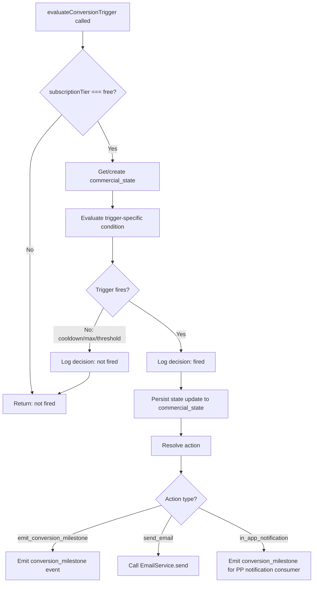

# §1 Conversion Trigger Engine

**Status:** Phase 2 content output
**Agent:** A (Conversion Triggers)
**Slice:** S8 Commercial & Revenue
**Written:** 2026-02-14
**Inputs:** `01-schema.md` (commercial_state), `01-router-plan.md` (§1 routes), `01-decisions.md` (D1, D3, D5), `s8-pre-draft-checklist.md` (§3, §7, §10), CR interface spec v3 §1.1/§2/§5, D&L interface spec v5 §3.2, SI v7 §1.2/§5/§9, CR concept design v4 §5.1–§5.4

---

## Overview

The conversion trigger engine evaluates 6 behavioural triggers that nudge free-tier providers toward upgrade. Each trigger has a typed condition, a cooldown period, a lifetime firing cap, and a defined action (emit `conversion_milestone`, send conversion email, or show in-app CTA). All trigger evaluations are event-driven — fired from consumer handlers in §10 or from the `evaluateUpgradeSuggestion` tRPC route on dashboard load. The engine writes firing state to `commercial_state` (schema: `01-schema.md` §2.1) and logs every evaluation via SI §9.2 `conversion_trigger_evaluation` decision type. A separate endowment CTA provides a cold-start nudge before behavioural data exists. [Resolves S4-4, S6-2]

Per D5: this section defines trigger evaluation pseudocode and the `evaluateUpgradeSuggestion` / `getConversionTriggerState` route implementations. §10 (Event Consumers) is authoritative for handler code that invokes these functions. [Source: `01-decisions.md` D5]

---

## 1.1 Trigger Catalogue

All 6 triggers target free-tier listings only. `subscriptionTier` is read from `listings.subscriptionTier` (S1 §1.2). Trigger state is tracked on `commercial_state` (schema: `01-schema.md` §2.1).

### 1.1.1 `view_milestone`

Fires when a free-tier listing crosses a profile view threshold: 50, 100, or 200.

| Property | Value |
|----------|-------|
| Condition | `listings.subscriptionTier === "free"` AND `engagements.profileViews >= nextMilestone` AND `nextMilestone > (commercial_state.lastViewMilestoneFired ?? 0)` |
| Action | Emit `conversion_milestone`. Send `conversion_view_milestone` email. |
| Cooldown | 7 days between milestone emails (prevents 50 and 100 firing in same week) |
| maxFirings | 3 (one per milestone) |
| State written | `commercial_state.lastViewMilestoneFired = nextMilestone` |
| Evaluation trigger | `evaluateUpgradeSuggestion` route (dashboard load) — checks current view count against next milestone |

```typescript
// Authoritative in src/server/commercial/conversion-triggers.ts
// §10 consumers do NOT invoke this trigger directly — it fires on dashboard load via evaluateUpgradeSuggestion

const VIEW_MILESTONES = [50, 100, 200] as const

function evaluateViewMilestone(
  engagement: EngagementCounters,     // D&L §3.2
  state: CommercialState
): TriggerResult {
  const lastFired = state.lastViewMilestoneFired ?? 0
  const nextMilestone = VIEW_MILESTONES.find(m => m > lastFired)

  if (!nextMilestone) return { fired: false, reason: "all_milestones_exhausted" }
  if (engagement.profileViews < nextMilestone) return { fired: false, reason: "threshold_not_reached" }

  // Cooldown: 7 days since last view milestone firing
  if (state.lastViewMilestoneFired !== null) {
    const daysSinceLast = daysSince(state.updatedAt) // updatedAt tracks last trigger write
    if (daysSinceLast < 7) return { fired: false, reason: "cooldown_active" }
  }

  return {
    fired: true,
    trigger: "view_milestone",
    milestoneValue: nextMilestone,
    stateUpdate: { lastViewMilestoneFired: nextMilestone },
  }
}
```

### 1.1.2 `first_enquiry`

Fires once when a free-tier listing receives its first enquiry.

| Property | Value |
|----------|-------|
| Condition | `listings.subscriptionTier === "free"` AND `engagements.enquiriesReceived === 1` AND `!commercial_state.firstEnquiryTriggerFired` |
| Action | Emit `conversion_milestone`. In-app notification: "You just received your first enquiry! Upgrade to see which companies are viewing your profile." |
| Cooldown | N/A (fires once by definition) |
| maxFirings | 1 |
| State written | `commercial_state.firstEnquiryTriggerFired = true` |
| Evaluation trigger | `enquiry_submitted` event consumer (§10) — query-in-handler via D&L `getEngagementCounters(listingId)` [Source: CR interface spec §2, CR-ST-20] |

```typescript
function evaluateFirstEnquiry(
  engagement: EngagementCounters,     // D&L §3.2 — called in enquiry_submitted consumer
  state: CommercialState
): TriggerResult {
  if (state.firstEnquiryTriggerFired) return { fired: false, reason: "already_fired" }
  if (engagement.enquiriesReceived !== 1) return { fired: false, reason: "not_first_enquiry" }

  return {
    fired: true,
    trigger: "first_enquiry",
    stateUpdate: { firstEnquiryTriggerFired: true },
  }
}
```

**Query-in-handler justification:** The `enquiry_submitted` event payload carries `listingId` but not the enquiry count — CR does not own this data. CR calls `getEngagementCounters(listingId)` to read the current count. The trigger fires at most once per listing, so the query cost is negligible. [Source: CR interface spec §2, CR-ST-20]

### 1.1.3 `competitor_upgraded`

Fires when a same-sector competitor upgrades and the free-tier listing has sufficient taxonomy overlap.

| Property | Value |
|----------|-------|
| Condition | `listings.subscriptionTier === "free"` AND sector-filtered candidates with `computeTaxonomyOverlap > 0.5` have pool size >= 20 AND >= 3 recent upgrades in 30 days |
| Action | Send `conversion_social_proof` email. |
| Cooldown | 30 days |
| maxFirings | 3 |
| State written | `commercial_state.competitorUpgradedFired += 1`, `commercial_state.lastCompetitorUpgradedAt = now()` |
| Evaluation trigger | `subscription_tier_changed` event consumer (§10) — when `newTier > previousTier`, evaluates all free-tier listings in same sector |

```typescript
function evaluateCompetitorUpgraded(
  targetListingId: UUID,
  upgradedListingId: UUID,
  state: CommercialState
): TriggerResult {
  if (state.competitorUpgradedFired >= 3) return { fired: false, reason: "max_firings_reached" }

  // Cooldown: 30 days since last firing
  if (state.lastCompetitorUpgradedAt) {
    if (daysSince(state.lastCompetitorUpgradedAt) < 30) return { fired: false, reason: "cooldown_active" }
  }

  // Taxonomy overlap — P4 import from D&L
  const overlap = computeTaxonomyOverlap(targetListingId, upgradedListingId) // D&L export
  if (overlap < 0.5) return { fired: false, reason: "insufficient_overlap" }

  // Anonymity threshold [CR-12]: pool must be large enough
  const sectorCandidates = getSameSectorFreeTierListings(targetListingId)
  if (sectorCandidates.length < 20) return { fired: false, reason: "pool_too_small_for_anonymity" }

  // Check recent upgrades in overlapping pool
  const recentUpgrades = countRecentUpgradesInPool(sectorCandidates, days = 30)
  if (recentUpgrades < 3) return { fired: false, reason: "insufficient_recent_upgrades" }

  return {
    fired: true,
    trigger: "competitor_upgraded",
    stateUpdate: {
      competitorUpgradedFired: state.competitorUpgradedFired + 1,
      lastCompetitorUpgradedAt: new Date().toISOString(),
    },
  }
}
```

**Anonymity threshold [CR-12]:** The trigger only fires when the competitor pool has >= 20 listings in the same sector. This prevents "3 providers in your area upgraded" from revealing specific competitors when the pool is small.

### 1.1.4 `analytics_teaser`

Periodic analytics teaser for free-tier listings with engagement activity. Nudges the provider to upgrade for full analytics access.

| Property | Value |
|----------|-------|
| Condition | `listings.subscriptionTier === "free"` AND `engagements.profileViews > 0` |
| Action | Send `conversion_analytics_teaser` email. |
| Cooldown | 14 days |
| maxFirings | Unlimited (periodic, cooldown-gated) |
| State written | `commercial_state.analyticsTeaseFired += 1`, `commercial_state.lastAnalyticsTeaseAt = now()` |
| Evaluation trigger | `evaluateUpgradeSuggestion` route (dashboard load) |

```typescript
function evaluateAnalyticsTeaser(
  engagement: EngagementCounters,
  state: CommercialState
): TriggerResult {
  if (engagement.profileViews === 0) return { fired: false, reason: "no_engagement" }

  if (state.lastAnalyticsTeaseAt) {
    if (daysSince(state.lastAnalyticsTeaseAt) < 14) return { fired: false, reason: "cooldown_active" }
  }

  return {
    fired: true,
    trigger: "analytics_teaser",
    stateUpdate: {
      analyticsTeaseFired: state.analyticsTeaseFired + 1,
      lastAnalyticsTeaseAt: new Date().toISOString(),
    },
  }
}
```

### 1.1.5 `social_proof`

Competitor visibility upgrade social proof. Fires periodically when competitors in the same sector hold paid subscriptions.

| Property | Value |
|----------|-------|
| Condition | `listings.subscriptionTier === "free"` AND sector has >= 3 paid listings |
| Action | Send `conversion_social_proof` email (shared template with `competitor_upgraded`, different merge field context). |
| Cooldown | 30 days |
| maxFirings | Unlimited (periodic, cooldown-gated) |
| State written | `commercial_state.socialProofFired += 1`, `commercial_state.lastSocialProofAt = now()` |
| Evaluation trigger | `evaluateUpgradeSuggestion` route (dashboard load) |

```typescript
function evaluateSocialProof(
  listingId: UUID,
  state: CommercialState
): TriggerResult {
  if (state.lastSocialProofAt) {
    if (daysSince(state.lastSocialProofAt) < 30) return { fired: false, reason: "cooldown_active" }
  }

  const paidInSector = countPaidListingsInSameSector(listingId)
  if (paidInSector < 3) return { fired: false, reason: "insufficient_paid_competitors" }

  return {
    fired: true,
    trigger: "social_proof",
    stateUpdate: {
      socialProofFired: state.socialProofFired + 1,
      lastSocialProofAt: new Date().toISOString(),
    },
  }
}
```

### 1.1.6 `engagement_summary`

Periodic engagement summary for free-tier listings. Provides a digest of recent engagement data with an upgrade CTA.

| Property | Value |
|----------|-------|
| Condition | `listings.subscriptionTier === "free"` AND listing has any engagement data (views > 0 OR enquiries > 0) |
| Action | Send `conversion_engagement_summary` email. |
| Cooldown | 7 days |
| maxFirings | Unlimited (periodic, cooldown-gated) |
| State written | `commercial_state.engagementSummaryFired += 1`, `commercial_state.lastEngagementSummaryAt = now()` |
| Evaluation trigger | `evaluateUpgradeSuggestion` route (dashboard load) |

```typescript
function evaluateEngagementSummary(
  engagement: EngagementCounters,
  state: CommercialState
): TriggerResult {
  if (engagement.profileViews === 0 && engagement.enquiriesReceived === 0) {
    return { fired: false, reason: "no_engagement_data" }
  }

  if (state.lastEngagementSummaryAt) {
    if (daysSince(state.lastEngagementSummaryAt) < 7) return { fired: false, reason: "cooldown_active" }
  }

  return {
    fired: true,
    trigger: "engagement_summary",
    stateUpdate: {
      engagementSummaryFired: state.engagementSummaryFired + 1,
      lastEngagementSummaryAt: new Date().toISOString(),
    },
  }
}
```

---

## 1.2 Core Evaluation Function

All 6 triggers share a wrapper that enforces the common gate pattern: free-tier check, `commercial_state` row retrieval (lazy-create), trigger-specific evaluation, state persistence, decision logging, and action dispatch.

```typescript
type ConversionTriggerType =
  | "first_enquiry"
  | "competitor_upgraded"
  | "analytics_teaser"
  | "social_proof"
  | "view_milestone"
  | "engagement_summary"

type TriggerResult = {
  fired: boolean
  trigger?: ConversionTriggerType
  reason?: string
  milestoneValue?: number                 // view_milestone only
  stateUpdate?: Partial<CommercialState>  // fields to write on fire
}

type TriggerAction =
  | { type: "emit_conversion_milestone"; milestone: ConversionMilestoneId; label: string }
  | { type: "send_email"; template: EmailTemplateId; mergeFields: Record<string, unknown> }
  | { type: "in_app_notification"; message: string }
  | { type: "none" }                      // trigger fired but action is state-update only

// Core wrapper — invoked by §10 consumer handlers and by evaluateUpgradeSuggestion route
async function evaluateConversionTrigger(
  triggerType: ConversionTriggerType,
  listingId: UUID,
  context: TriggerEvaluationContext       // listing data, engagement counters, etc.
): Promise<{ result: TriggerResult; action: TriggerAction }> {

  // 1. Free-tier gate
  if (context.subscriptionTier !== "free") {
    return { result: { fired: false, reason: "not_free_tier" }, action: { type: "none" } }
  }

  // 2. Get or create commercial_state row (lazy initialisation)
  const state = await getOrCreateCommercialState(listingId)

  // 3. Evaluate trigger-specific condition
  const result = evaluateTrigger(triggerType, context, state)

  // 4. Log decision — SI §9.2 conversion_trigger_evaluation
  await logDecision({
    domain: "commercial",
    decisionType: "conversion_trigger_evaluation",
    inputs: { triggerType, listingId, subscriptionTier: context.subscriptionTier },
    output: { fired: result.fired, reason: result.reason },
    entityContext: { listingId, accountId: context.accountId },
  })

  if (!result.fired) return { result, action: { type: "none" } }

  // 5. Persist state update
  await updateCommercialState(listingId, result.stateUpdate!)

  // 6. Determine action
  const action = resolveAction(triggerType, result, context)
  return { result, action }
}

function evaluateTrigger(
  type: ConversionTriggerType,
  ctx: TriggerEvaluationContext,
  state: CommercialState
): TriggerResult {
  switch (type) {
    case "view_milestone":        return evaluateViewMilestone(ctx.engagement, state)
    case "first_enquiry":         return evaluateFirstEnquiry(ctx.engagement, state)
    case "competitor_upgraded":   return evaluateCompetitorUpgraded(ctx.targetListingId!, ctx.upgradedListingId!, state)
    case "analytics_teaser":      return evaluateAnalyticsTeaser(ctx.engagement, state)
    case "social_proof":          return evaluateSocialProof(ctx.targetListingId!, state)
    case "engagement_summary":    return evaluateEngagementSummary(ctx.engagement, state)
  }
}
```



---

## 1.3 Action Resolution

Each trigger type maps to a specific action when it fires. The mapping is static — no runtime branching on context for action selection.

```typescript
function resolveAction(
  type: ConversionTriggerType,
  result: TriggerResult,
  ctx: TriggerEvaluationContext
): TriggerAction {
  switch (type) {
    case "view_milestone":
      return {
        type: "send_email",
        template: "conversion_view_milestone",
        mergeFields: {
          listingName: ctx.listingName,
          milestoneValue: result.milestoneValue!,
          upgradeUrl: buildUpgradeUrl(ctx.listingId),
        },
      }

    case "first_enquiry":
      // In-app notification — PP consumer creates notification via conversion_milestone event
      return {
        type: "emit_conversion_milestone",
        milestone: "first_subscription",   // first_enquiry is a pre-subscription milestone
        label: "You just received your first enquiry! Upgrade to see which companies are viewing your profile.",
      }

    case "competitor_upgraded":
      return {
        type: "send_email",
        template: "conversion_social_proof",
        mergeFields: {
          listingName: ctx.listingName,
          competitorName: "Providers in your service area", // anonymised — no specific competitor named
          upgradeUrl: buildUpgradeUrl(ctx.listingId),
        },
      }

    case "analytics_teaser":
      return {
        type: "send_email",
        template: "conversion_analytics_teaser",
        mergeFields: {
          listingName: ctx.listingName,
          viewCount: ctx.engagement.profileViews,
          shortlistCount: ctx.engagement.searchAppearances, // search appearances as proxy for shortlists
          upgradeUrl: buildUpgradeUrl(ctx.listingId),
        },
      }

    case "social_proof":
      return {
        type: "send_email",
        template: "conversion_social_proof",
        mergeFields: {
          listingName: ctx.listingName,
          competitorName: "Providers in your service area", // same template, periodic social proof context
          upgradeUrl: buildUpgradeUrl(ctx.listingId),
        },
      }

    case "engagement_summary":
      return {
        type: "send_email",
        template: "conversion_engagement_summary",
        mergeFields: {
          listingName: ctx.listingName,
          viewCount: ctx.engagement.profileViews,
          enquiryCount: ctx.engagement.enquiriesReceived,
          upgradeUrl: buildUpgradeUrl(ctx.listingId),
        },
      }
  }
}
```

**Email preference enforcement:** All conversion emails use `category: "conversion_marketing"`. `EmailService.send()` checks unsubscribe preferences (SI §5.1). If the provider has unsubscribed from conversion marketing, the service returns `status: "suppressed"`. The trigger still fires (state is updated), but the email is not delivered. This matches the CR concept design §5.3 channel specification: email-channel touchpoints are skipped for unsubscribed addresses. [Source: SI §5.1, §5.3]

---

## 1.4 `evaluateUpgradeSuggestion` Route

Provider dashboard upgrade CTA. Reads the listing's `commercial_state` and evaluates all periodic triggers (not event-driven ones) to find the highest-priority unfired trigger. Returns a single `UpgradeSuggestion` or `null`. [Source: `01-router-plan.md` §2.2]

```typescript
// src/server/routers/commercial.ts — commercial.evaluateUpgradeSuggestion
// protectedProcedure, input: { listingId: UUID }, CSR

async function evaluateUpgradeSuggestion(
  listingId: UUID,
  accountId: UUID     // from ctx.session.accountId
): Promise<UpgradeSuggestion | null> {

  // Ownership check — listing must belong to caller
  const listing = await getListingWithOwnerCheck(listingId, accountId)
  if (!listing) return null

  // Only free-tier listings get upgrade suggestions
  if (listing.subscriptionTier !== "free") return null

  // Read engagement counters — D&L §3.2
  const engagement = await getEngagementCounters(listingId)

  const ctx: TriggerEvaluationContext = {
    listingId,
    accountId,
    subscriptionTier: listing.subscriptionTier,
    listingName: listing.name,
    engagement,
    targetListingId: listingId,
  }

  // Priority order: event-driven triggers checked first (may have already fired),
  // then periodic triggers evaluated in descending impact order.
  const priorityOrder: ConversionTriggerType[] = [
    "first_enquiry",        // highest signal — direct buyer interest
    "view_milestone",       // concrete engagement milestone
    "competitor_upgraded",  // social proof — time-sensitive
    "engagement_summary",   // periodic digest
    "analytics_teaser",     // periodic teaser
    "social_proof",         // periodic social proof
  ]

  for (const triggerType of priorityOrder) {
    const { result, action } = await evaluateConversionTrigger(triggerType, listingId, ctx)

    if (result.fired && action.type !== "none") {
      // Execute action (emit event or send email)
      await executeAction(action, listingId, accountId)

      return {
        triggerType,
        headline: buildHeadline(triggerType, result),
        description: buildDescription(triggerType),
        upgradeUrl: buildUpgradeUrl(listingId),
        dismissable: true,
      }
    }
  }

  return null
}
```

**`UpgradeSuggestion` type:** Authoritative in `01-router-plan.md` §2.2. Not restated here.

**Tier-aware upgrade suggestions (Standard, Premium, Partner):** The concept design §5.4 `evaluateUpgradeSuggestion` also handles paid-tier upgrade paths (Standard -> Premium with quality guard [CR-28], Premium -> Partner for high-volume companies). These paths are evaluated after the 6 free-tier triggers. When the listing is on a paid tier, the route skips the trigger catalogue and evaluates the upgrade path logic from concept design §5.4 directly:

```typescript
  // Paid-tier upgrade path — concept design §5.4
  if (listing.subscriptionTier === "standard") {
    const quality = await getQualityScore(listingId)
    if (quality.composite < 40) {
      return {
        triggerType: null,  // not a conversion trigger — quality improvement suggestion
        headline: "Improve your quality score before upgrading",
        description: "A higher quality score means better visibility at any tier",
        upgradeUrl: null,
        dismissable: true,
      }
    }
    if (engagement.profileViews > 100 || engagement.enquiriesReceived > 5) {
      return {
        triggerType: null,
        headline: "High engagement — competitive intelligence delivers more value",
        description: "See how you compare to competitors + appear in Sponsored section",
        upgradeUrl: buildUpgradeUrl(listingId, "premium"),
        dismissable: true,
      }
    }
  }

  if (listing.subscriptionTier === "premium") {
    if (listing.entityType === "company" && engagement.enquiriesReceived > 20) {
      return {
        triggerType: null,
        headline: "High-volume provider — priority support",
        description: "Priority support response",
        upgradeUrl: buildUpgradeUrl(listingId, "partner"),
        dismissable: true,
      }
    }
  }
```

---

## 1.5 `getConversionTriggerState` Route

Simple DB read. Returns the trigger tracking fields from `commercial_state` for a listing. [Source: `01-router-plan.md` §2.2]

```typescript
// src/server/routers/commercial.ts — commercial.getConversionTriggerState
// protectedProcedure, input: { listingId: UUID }, CSR

async function getConversionTriggerState(
  listingId: UUID,
  accountId: UUID     // from ctx.session.accountId
): Promise<ConversionTriggerState> {

  // Ownership check
  const listing = await getListingWithOwnerCheck(listingId, accountId)
  if (!listing) throw new TRPCError({ code: "NOT_FOUND" })

  const state = await db.select().from(commercialState).where(eq(commercialState.listingId, listingId)).limit(1)

  if (!state[0]) {
    // No commercial_state row exists — return default (no triggers fired)
    return {
      listingId,
      lastViewMilestoneFired: null,
      firstEnquiryTriggerFired: false,
      competitorUpgradedFired: 0,
      analyticsTeaseFired: 0,
      socialProofFired: 0,
      engagementSummaryFired: 0,
      endowmentCtaShown: false,
    }
  }

  return {
    listingId,
    lastViewMilestoneFired: state[0].lastViewMilestoneFired,
    firstEnquiryTriggerFired: state[0].firstEnquiryTriggerFired,
    competitorUpgradedFired: state[0].competitorUpgradedFired,
    analyticsTeaseFired: state[0].analyticsTeaseFired,
    socialProofFired: state[0].socialProofFired,
    engagementSummaryFired: state[0].engagementSummaryFired,
    endowmentCtaShown: state[0].endowmentCtaShown,
  }
}
```

**`ConversionTriggerState` type:** Extends the router plan's type with the full set of trigger tracking fields from the schema. The router plan (§2.2) lists a subset; the authoritative field set is the schema (`01-schema.md` §2.1).

---

## 1.6 Endowment CTA

The endowment CTA is a cold-start conversion nudge that fires before behavioural triggers have data. It addresses the V1 cold start risk: no buyer traffic produces no engagement data, so analytics-based triggers never fire. [Source: CR concept design §5.2, §5.3 `endowment_threshold`]

**Condition:** `listings.subscriptionTier === "free"` AND `engagements.profileViews >= 5` AND `!commercial_state.endowmentCtaShown`.

**Action:** Persistent in-app CTA on the free-tier analytics section: "See who's viewing your profile" with a link to `/pricing`. Not an email — always rendered in the dashboard.

**Category fallback [XP-16]:** If the listing has < 5 views but the listing's primary service area has > 20 monthly searches (read from category aggregates), show: "Providers in [service area] receive an average of X views per month — upgrade to track yours." This provides a competitive framing from category-level data even without individual engagement data.

```typescript
async function evaluateEndowmentCta(
  listingId: UUID,
  engagement: EngagementCounters,
  state: CommercialState
): Promise<EndowmentCtaResult> {

  if (state.endowmentCtaShown) return { show: false, reason: "already_shown" }

  if (engagement.profileViews >= 5) {
    await updateCommercialState(listingId, { endowmentCtaShown: true })
    return {
      show: true,
      variant: "engagement",
      message: "See who's viewing your profile",
      target: "/pricing",
      placement: "analytics_section",
    }
  }

  // Category fallback — use aggregate data when individual engagement is low
  const listing = await getListingWithTaxonomy(listingId)
  const categoryStats = await getCategoryAggregates(listing.taxonomyTags)

  if (categoryStats.monthlySearches > 20) {
    // Do NOT set endowmentCtaShown — category fallback is persistent until individual engagement
    // triggers the primary variant, at which point endowmentCtaShown is set to true.
    return {
      show: true,
      variant: "category_fallback",
      message: `Providers in ${categoryStats.topServiceArea} receive an average of ${categoryStats.avgMonthlyViews} views per month — upgrade to track yours.`,
      target: "/pricing",
      placement: "analytics_section",
    }
  }

  return { show: false, reason: "insufficient_data" }
}
```

**State reset on reclaim [CR-29]:** `endowmentCtaShown` resets to `false` when `claim_approved` fires for a previously claimed listing. The new owner sees the endowment CTA fresh. [Source: `01-schema.md` §2.1 state reset note]

---

## 1.7 Event Emissions

All `conversion_milestone` emissions must match `EventPayloadMap` (SI §1.2) with payload type `ConversionMilestoneEvent` (CR §1.1).

### P1 Compliance Verification

| Field | Source | Present |
|-------|--------|---------|
| `type` | Literal `"conversion_milestone"` | Yes |
| `listingId` | From trigger evaluation context | Yes |
| `accountId` | From trigger evaluation context | Yes |
| `milestone` | `ConversionMilestoneId` union: `"first_subscription"` / `"first_upgrade"` / `"premium_reached"` / `"partner_reached"` | Yes |
| `milestoneLabel` | Display-ready string built per trigger | Yes |
| `timestamp` | `new Date().toISOString()` | Yes |

**Emission points:** `conversion_milestone` is emitted when a trigger fires and the resolved action is `emit_conversion_milestone` or `in_app_notification`. The `first_enquiry` trigger emits with `milestone: "first_subscription"` (pre-subscription milestone indicating conversion funnel entry). The `view_milestone` trigger emits at each threshold crossing.

```typescript
// Emitted within executeAction() — called by evaluateUpgradeSuggestion and by §10 consumer handlers

async function emitConversionMilestone(
  listingId: UUID,
  accountId: UUID,
  milestone: ConversionMilestoneId,
  label: string
): Promise<void> {
  await eventBus.emit<"conversion_milestone">({
    type: "conversion_milestone",
    listingId,
    accountId,
    milestone,                            // typed union — CR §1.1
    milestoneLabel: label,
    timestamp: new Date().toISOString(),
  })
}
```

**Consumers of `conversion_milestone`:** PP (dashboard notification using `milestoneLabel`) and Ops (learning hypothesis L3 — outreach vs organic conversion tracking). Both are async. [Source: CR §1.1 consumer table]

---

## 1.8 Email Template Merge Fields

For each conversion email template triggered by §1, the exact merge field construction. All templates are registered in SI §5.2 (Commercial Conversion group). All use `category: "conversion_marketing"`. [Source: skeleton §13]

### `conversion_view_milestone`

| Merge Field | Type | Source |
|-------------|------|--------|
| `listingName` | `string` | `listings.name` |
| `milestoneValue` | `number` | The milestone threshold just crossed: 50, 100, or 200 |
| `upgradeUrl` | `string` | `buildUpgradeUrl(listingId)` — resolves to `/pricing?listing={listingId}` |

```typescript
await emailService.send({
  to: accountEmail,
  template: "conversion_view_milestone",
  data: { listingName, milestoneValue, upgradeUrl },
  category: "conversion_marketing",
  accountId,
})
```

### `conversion_analytics_teaser`

| Merge Field | Type | Source |
|-------------|------|--------|
| `listingName` | `string` | `listings.name` |
| `viewCount` | `number` | `engagements.profileViews` via D&L §3.2 |
| `shortlistCount` | `number` | `engagements.searchAppearances` via D&L §3.2 |
| `upgradeUrl` | `string` | `buildUpgradeUrl(listingId)` |

```typescript
await emailService.send({
  to: accountEmail,
  template: "conversion_analytics_teaser",
  data: { listingName, viewCount, shortlistCount, upgradeUrl },
  category: "conversion_marketing",
  accountId,
})
```

### `conversion_social_proof`

Used by both `competitor_upgraded` and `social_proof` triggers. Merge field values differ by context — the trigger provides the context.

| Merge Field | Type | Source |
|-------------|------|--------|
| `listingName` | `string` | `listings.name` |
| `competitorName` | `string` | Always `"Providers in your service area"` — anonymised, never names a specific competitor [CR-12] |
| `upgradeUrl` | `string` | `buildUpgradeUrl(listingId)` |

```typescript
await emailService.send({
  to: accountEmail,
  template: "conversion_social_proof",
  data: { listingName, competitorName, upgradeUrl },
  category: "conversion_marketing",
  accountId,
})
```

### `conversion_engagement_summary`

| Merge Field | Type | Source |
|-------------|------|--------|
| `listingName` | `string` | `listings.name` |
| `viewCount` | `number` | `engagements.profileViews` via D&L §3.2 |
| `enquiryCount` | `number` | `engagements.enquiriesReceived` via D&L §3.2 |
| `upgradeUrl` | `string` | `buildUpgradeUrl(listingId)` |

```typescript
await emailService.send({
  to: accountEmail,
  template: "conversion_engagement_summary",
  data: { listingName, viewCount, enquiryCount, upgradeUrl },
  category: "conversion_marketing",
  accountId,
})
```

---

## 1.9 D3 Performance Note — `competitor_upgraded`

V1 uses naive `computeTaxonomyOverlap` over sector-filtered candidates. [Source: `01-decisions.md` D3]

**V1 approach:** On each `subscription_tier_changed` event where `newTier > previousTier`, the §10 consumer queries all free-tier listings, filters by sector overlap (same sector + at least one shared service area), then computes `computeTaxonomyOverlap` per candidate against the upgraded listing. At V1 scale (~4,700 listings, ~200 paid), sector filtering reduces candidates to ~50-200 per event. `computeTaxonomyOverlap` is a pure function on in-memory tag arrays (D&L §3.1 NFR: <50ms p95). Total computation stays well under the 5s async consumer budget.

**Migration trigger:** Consumer p95 > 2s.

**Migration path:** Pre-compute overlap neighbourhoods as a materialised view `taxonomy_neighbourhoods` refreshed on `profile_edited`. The view stores pre-computed Jaccard similarity pairs above 0.5 threshold, indexed by listing pair. The `competitor_upgraded` consumer reads the view instead of computing overlap on the fly. View refresh is async — a `profile_edited` consumer updates affected pairs.

**Monitoring:** Log `competitor_upgraded` evaluation duration in the `conversion_trigger_evaluation` decision log `additionalContext.evaluationMs`. Alert if p95 approaches 2s.

---

## 1.10 Decision Logging

Every trigger evaluation is logged via SI §9.2 `conversion_trigger_evaluation` decision type. [Source: SI §9.1, §9.2]

```typescript
// Logged in evaluateConversionTrigger() — step 4 of the core evaluation function

type ConversionTriggerDecisionLog = {
  domain: "commercial"
  decisionType: "conversion_trigger_evaluation"
  inputs: {
    triggerType: ConversionTriggerType
    listingId: UUID
    subscriptionTier: SubscriptionTier
    engagementSnapshot?: {                   // optional: captured when trigger uses engagement data
      profileViews: number
      enquiriesReceived: number
    }
  }
  output: {
    fired: boolean
    reason: string                           // "cooldown_active" | "max_firings_reached" | "threshold_not_reached" | etc.
    milestoneValue?: number                  // view_milestone only
    actionType?: string                      // "send_email" | "emit_conversion_milestone" | "in_app_notification"
  }
  confidence: undefined                      // deterministic — no confidence score
  entityContext: {
    listingId: UUID
    accountId: UUID
  }
}
```

**Entity learning:** At V1, decision logs are analysed manually. The principal reviews trigger firing rates and conversion attribution to tune thresholds. S9 (Entity Intelligence) wires automated feedback loops. [Source: SI §9 note]

---

## 1.11 Acceptance Criteria

| # | Criterion | Trigger/Component |
|---|-----------|-------------------|
| AC-1 | `view_milestone` fires at 50, 100, 200 profile views for free-tier listings. Each milestone fires exactly once. State records `lastViewMilestoneFired` with the crossed threshold. | `view_milestone` |
| AC-2 | `view_milestone` respects 7-day cooldown between milestone emails. A listing crossing 50 and 100 within 5 days receives the 50-milestone email immediately and the 100-milestone email after the cooldown expires. | `view_milestone` cooldown |
| AC-3 | `first_enquiry` fires exactly once when `getEngagementCounters(listingId).enquiriesReceived === 1` for a free-tier listing. Subsequent enquiries do not re-trigger. | `first_enquiry` |
| AC-4 | `competitor_upgraded` respects 30-day cooldown and maxFirings=3. After 3 firings, further competitor upgrades in the same sector do not trigger. Anonymity threshold (pool >= 20) is enforced. | `competitor_upgraded` |
| AC-5 | `analytics_teaser` fires on 14-day cooldown for free-tier listings with `profileViews > 0`. `social_proof` fires on 30-day cooldown when sector has >= 3 paid listings. `engagement_summary` fires on 7-day cooldown when any engagement data exists. | Periodic triggers |
| AC-6 | Endowment CTA displays "See who's viewing your profile" on the free-tier analytics section when `profileViews >= 5`. Category fallback displays aggregate data when `profileViews < 5` but `categoryStats.monthlySearches > 20`. `endowmentCtaShown` is set only by the primary variant, not the fallback. | Endowment CTA |
| AC-7 | All `conversion_milestone` emissions match `ConversionMilestoneEvent` payload type (CR §1.1): `type`, `listingId`, `accountId`, `milestone` (typed `ConversionMilestoneId`), `milestoneLabel`, `timestamp`. | P1 compliance |
| AC-8 | Email merge fields for `conversion_view_milestone` include `listingName`, `milestoneValue`, `upgradeUrl`. Merge fields for `conversion_analytics_teaser` include `listingName`, `viewCount`, `shortlistCount`, `upgradeUrl`. Merge fields for `conversion_social_proof` include `listingName`, `competitorName` (anonymised), `upgradeUrl`. Merge fields for `conversion_engagement_summary` include `listingName`, `viewCount`, `enquiryCount`, `upgradeUrl`. | Email templates |
| AC-9 | All conversion emails use `category: "conversion_marketing"`. `EmailService.send()` returns `status: "suppressed"` for unsubscribed providers. Trigger state is still updated even when email is suppressed. | Email preferences |
| AC-10 | `evaluateUpgradeSuggestion` returns the highest-priority unfired trigger as an `UpgradeSuggestion` for free-tier listings. Returns `null` for non-free-tier listings or when no triggers are eligible. Ownership check ensures `ctx.session.accountId` matches `listings.accountId`. | Route: evaluateUpgradeSuggestion |
| AC-11 | `getConversionTriggerState` returns default zero-state when no `commercial_state` row exists. Returns full trigger tracking fields when row exists. Ownership check enforced. | Route: getConversionTriggerState |
| AC-12 | `claim_approved` consumer resets all conversion trigger state: all `*Fired` counters to 0/false, all `last*At` timestamps to null, `endowmentCtaShown` to false. Churn fields (`lastChurnEventAt`, `lastChurnReason`, `effectivePriceAtSubscription`) are preserved. | State reset on reclaim [CR-29] |
| AC-13 | Every trigger evaluation is logged as `conversion_trigger_evaluation` decision type with inputs (triggerType, listingId, subscriptionTier) and output (fired, reason). | Decision logging |

**Total: 13 acceptance criteria.**

---

## Cross-References

| Document | Relationship |
|----------|-------------|
| `shared-infrastructure.md` (v7) | §1.2 EventPayloadMap (`conversion_milestone`), §1.4 P1-P5 principles, §5.1 EmailService.send contract, §5.2 template inventory (4 conversion templates), §9.1-§9.2 decision logging |
| `commercial-and-revenue.md` (v3 interface) | §1.1 `ConversionMilestoneEvent` payload, §2 consumed events (`enquiry_submitted`, `claim_approved` consumers), §5 `ConversionMilestoneId` type |
| `commercial-and-revenue.md` (v4 concept design) | §5.1 conversion funnel, §5.2 cold start/endowment, §5.3 conversion triggers, §5.4 upgrade path decision architecture |
| `data-and-listings.md` (v5 interface) | §3.2 `getEngagementCounters` query interface, `computeTaxonomyOverlap` D&L export |
| `01-schema.md` | §2.1 `commercial_state` table: trigger tracking columns |
| `01-router-plan.md` | §2.2 route specifications for `evaluateUpgradeSuggestion` and `getConversionTriggerState` |
| `01-decisions.md` | D1 (subscriptionStartDate omit), D3 (naive computeTaxonomyOverlap), D5 (§10 authoritative for handler code) |
