# S8 §10 — Event Consumer Implementations

**Status:** Phase 2 content output
**Agent:** E (Event Consumers)
**Slice:** S8 Commercial & Revenue
**Written:** 2026-02-14
**Inputs:** `01-decisions.md` (D1, D5, D6), `01-schema.md` (commercial_state, churn_analysis_log), `01-router-plan.md` §4, `interfaces/commercial-and-revenue.md` §1–§2 (v3), `interfaces/shared-infrastructure.md` §1.2–§2 (v7), `interfaces/operations.md` §1.1–§1.2 (v4), `interfaces/data-and-listings.md` §1.1/§1.3/§1.8/§1.9/§3.2 (v5), `interfaces/platform-and-product.md` §1.3/§1.9 (v6)

---

## §10 Event Consumer Implementations

This section is **authoritative** for all 8 CR event consumer handler implementations [Source: `01-decisions.md` D5]. Handler bodies live exclusively here. Decision architectures — `evaluateChurnIntervention` (§2), `evaluateWinBack` (§3), `evaluateConversionTrigger` (§1), `triggerLowQualityIntervention` (§7) — are imported by function name; their pseudocode lives in the respective content sections. This section does not re-derive decision logic.

All 8 consumers are async, registered in `EVENT_CONSUMER_MATRIX` [Source: SI §1.3]. All operate within the 5-second async consumer budget. All write to CR-owned tables only (`commercial_state`, `churn_analysis_log`). No cross-domain writes.

---

### 10.1 subscription_tier_changed

**Consumer ID:** `commercial:subscription_tier_changed:revenueMetricsUpdate`

**Payload:** `SubscriptionTierChangedEvent` [Source: Ops §1.1, SI §1.2]

**Fields consumed:** `listingId`, `accountId`, `previousTier`, `newTier` [Source: CR §2]

```typescript
async function handleSubscriptionTierChanged(
  payload: SubscriptionTierChangedEvent
): Promise<void> {
  const { listingId, accountId, previousTier, newTier } = payload

  // Determine transition type
  const tierRank: Record<SubscriptionTier, number> = {
    free: 0, standard: 1, premium: 2, partner: 3
  }
  const direction = tierRank[newTier] > tierRank[previousTier]
    ? "upgrade"
    : tierRank[newTier] < tierRank[previousTier]
    ? "downgrade"
    : "lateral"  // should not occur — Ops does not emit for same-tier

  // Upsert commercial_state (lazy creation)
  const state = await db.select()
    .from(commercialState)
    .where(eq(commercialState.listingId, listingId))
    .limit(1)

  if (state.length === 0) {
    await db.insert(commercialState).values({
      listingId,
      effectivePriceAtSubscription: previousTier === "free"
        ? PRICING.find(p => p.tier === newTier)!.annualPrice
        : null,  // only set on initial conversion
      updatedAt: new Date(),
    })
  } else if (previousTier === "free") {
    // Free → paid conversion: record effective price at subscription time
    await db.update(commercialState)
      .set({
        effectivePriceAtSubscription:
          PRICING.find(p => p.tier === newTier)!.annualPrice,
        updatedAt: new Date(),
      })
      .where(eq(commercialState.listingId, listingId))
  }

  // Determine eventType and revenue impact for churn_analysis_log
  let eventType: string
  let annualRevenue: number | null = null
  const newPrice = PRICING.find(p => p.tier === newTier)!.annualPrice
  const oldPrice = PRICING.find(p => p.tier === previousTier)!.annualPrice

  if (previousTier === "free") {
    eventType = "conversion"
    annualRevenue = newPrice
  } else if (direction === "upgrade") {
    eventType = "upgrade"
    annualRevenue = newPrice - oldPrice
  } else {
    eventType = "downgrade"
    annualRevenue = newPrice - oldPrice  // negative
  }

  // Append to churn_analysis_log
  await db.insert(churnAnalysisLog).values({
    listingId,
    accountId,
    eventType,
    subscriptionTier: newTier,
    annualRevenue,
    metadata: { fromTier: previousTier, toTier: newTier },
    createdAt: new Date(),
  })

  // Emit conversion_milestone if applicable
  if (previousTier === "free") {
    const milestone: ConversionMilestoneId = "first_subscription"
    const milestoneLabel = `Welcome to ${newTier.charAt(0).toUpperCase() + newTier.slice(1)}!`

    await eventBus.emit({
      type: "conversion_milestone",
      listingId,
      accountId,
      milestone,
      milestoneLabel,
      timestamp: new Date().toISOString(),
    } satisfies ConversionMilestoneEvent)
    // P1 verified: all fields match CR §1.1 ConversionMilestoneEvent
  }

  if (newTier === "premium" && previousTier !== "premium" && previousTier !== "partner") {
    await eventBus.emit({
      type: "conversion_milestone",
      listingId,
      accountId,
      milestone: "premium_reached" as ConversionMilestoneId,
      milestoneLabel: "You've reached Premium!",
      timestamp: new Date().toISOString(),
    } satisfies ConversionMilestoneEvent)
  }

  if (newTier === "partner" && previousTier !== "partner") {
    await eventBus.emit({
      type: "conversion_milestone",
      listingId,
      accountId,
      milestone: "partner_reached" as ConversionMilestoneId,
      milestoneLabel: "Welcome to Partner!",
      timestamp: new Date().toISOString(),
    } satisfies ConversionMilestoneEvent)
  }

  if (direction === "upgrade" && previousTier !== "free") {
    await eventBus.emit({
      type: "conversion_milestone",
      listingId,
      accountId,
      milestone: "first_upgrade" as ConversionMilestoneId,
      milestoneLabel: `Upgraded to ${newTier.charAt(0).toUpperCase() + newTier.slice(1)}!`,
      timestamp: new Date().toISOString(),
    } satisfies ConversionMilestoneEvent)
  }

  // Log decision
  await logDecision({
    type: "conversion_trigger_evaluation",
    listingId,
    input: { previousTier, newTier, direction },
    output: { eventType, milestoneEmitted: previousTier === "free" || direction === "upgrade" },
  })
}
```

**P1 compliance:** All `ConversionMilestoneEvent` emissions include `listingId`, `accountId`, `milestone` (typed `ConversionMilestoneId`), `milestoneLabel`, `timestamp`. Matches CR §1.1.

---

### 10.2 subscription_ended

**Consumer ID:** `commercial:subscription_ended:churnLogging`

**Payload:** `SubscriptionEndedEvent` [Source: Ops §1.2, SI §1.2]

**Fields consumed:** `listingId`, `accountId`, `previousTier`, `reason`, `origin` [Source: CR §2]

P3 origin branching governs the handler's behaviour. Only `origin === "paddle"` triggers win-back scheduling. Non-Paddle endings (archival, closure) have no entity to win back. [Source: CR §2, CR-ST-19]

```typescript
async function handleSubscriptionEnded(
  payload: SubscriptionEndedEvent
): Promise<void> {
  const { listingId, accountId, previousTier, reason, origin } = payload

  // --- All origins: log churn to churn_analysis_log ---
  const riskFactors: ChurnRiskFactor[] = []
  if (reason === "payment_failure") riskFactors.push("payment_at_risk")

  const annualRevenue = -(PRICING.find(p => p.tier === previousTier)?.annualPrice ?? 0)

  await db.insert(churnAnalysisLog).values({
    listingId,
    accountId,
    eventType: "churn",
    reason,
    subscriptionTier: previousTier,
    annualRevenue,
    metadata: { origin, riskFactors: riskFactors.length > 0 ? riskFactors : undefined },
    createdAt: new Date(),
  })

  // --- All origins: update commercial_state ---
  await db.insert(commercialState)
    .values({
      listingId,
      lastChurnEventAt: new Date(),
      lastChurnReason: reason,
      updatedAt: new Date(),
    })
    .onConflictDoUpdate({
      target: commercialState.listingId,
      set: {
        lastChurnEventAt: new Date(),
        lastChurnReason: reason,
        updatedAt: new Date(),
      },
    })

  // --- P3 origin branch ---
  if (origin === "paddle") {
    // Paddle-originated churn: evaluate intervention + schedule win-back

    // Import from §2
    const intervention = await evaluateChurnIntervention({
      listingId,
      accountId,
      reason,
      previousTier,
    })
    // evaluateChurnIntervention returns { action, riskFactors, ... }
    // Handler does not re-derive the logic — §2 is authoritative

    // Emit churn_risk_detected if risk factors identified
    const allRiskFactors = [...riskFactors, ...intervention.riskFactors]
    if (allRiskFactors.length > 0) {
      await eventBus.emit({
        type: "churn_risk_detected",
        listingId,
        accountId,
        riskFactors: allRiskFactors,
        timestamp: new Date().toISOString(),
      } satisfies ChurnRiskDetectedEvent)
      // P1 verified: all fields match CR §1.2 ChurnRiskDetectedEvent
    }

    // Schedule win-back evaluation at 60 days
    await scheduleDeferredAction({
      action: "win_back_evaluation",
      params: { listingId, accountId },
      executeAt: addDays(new Date(), 60),
      retryPolicy: "once",
      onFailure: "log",
      createdBy: "commercial",
    })
  }
  // origin === "archival" | "closure": churn log only. No win-back schedule.
  // No churn_risk_detected emission — the archival/closure path is terminal.

  await logDecision({
    type: "churn_intervention",
    listingId,
    input: { reason, origin, previousTier },
    output: { winBackScheduled: origin === "paddle", riskFactors },
  })
}
```

**P1 compliance:** `ChurnRiskDetectedEvent` emission includes `listingId`, `accountId`, `riskFactors` (typed `ChurnRiskFactor[]`), `timestamp`. Matches CR §1.2. `riskFactors` includes `"payment_at_risk"` when `reason === "payment_failure"` [resolves S7-5].

---

### 10.3 claim_approved

**Consumer ID:** `commercial:claim_approved:conversionReset`

**Payload:** `ClaimApprovedEvent` [Source: D&L §1.1, SI §1.2]

**Fields consumed:** `listingId`, `accountId` [Source: CR §2]

Three responsibilities: (1) log conversion funnel entry, (2) reset trigger state (CR-29), (3) cancel pending win-back schedules (CR-X-17). If the listing was previously in a win-back pipeline and has now been reclaimed, log `win_back_converted`.

```typescript
async function handleClaimApproved(
  payload: ClaimApprovedEvent
): Promise<void> {
  const { listingId, accountId } = payload

  // --- Check for existing commercial_state (reclaim scenario) ---
  const existing = await db.select()
    .from(commercialState)
    .where(eq(commercialState.listingId, listingId))
    .limit(1)

  const isReclaim = existing.length > 0

  // --- Cancel pending win-back schedules for this listing [CR-X-17] ---
  const cancelledWinBacks = await db.update(deferredActions)
    .set({ status: "cancelled", cancelledAt: new Date(), cancelledBy: "commercial" })
    .where(
      and(
        eq(deferredActions.action, "win_back_evaluation"),
        eq(deferredActions.status, "pending"),
        sql`${deferredActions.params}->>'listingId' = ${listingId}`
      )
    )
    .returning({ id: deferredActions.id })

  // --- If win-back was pending, this is a win-back conversion ---
  if (cancelledWinBacks.length > 0) {
    await db.insert(churnAnalysisLog).values({
      listingId,
      accountId,
      eventType: "win_back_converted",
      metadata: { cancelledWinBackIds: cancelledWinBacks.map(w => w.id) },
      createdAt: new Date(),
    })
  }

  // --- Log conversion funnel entry ---
  await db.insert(churnAnalysisLog).values({
    listingId,
    accountId,
    eventType: "conversion",
    reason: isReclaim ? "reclaim" : "new_claim",
    metadata: { isReclaim },
    createdAt: new Date(),
  })

  // --- CR-29: Reset or create commercial_state ---
  if (isReclaim) {
    // Zero all trigger fields. Preserve churn history.
    await db.update(commercialState)
      .set({
        // Reset conversion trigger tracking
        lastViewMilestoneFired: null,
        firstEnquiryTriggerFired: false,
        competitorUpgradedFired: 0,
        lastCompetitorUpgradedAt: null,
        analyticsTeaseFired: 0,
        lastAnalyticsTeaseAt: null,
        socialProofFired: 0,
        lastSocialProofAt: null,
        engagementSummaryFired: 0,
        lastEngagementSummaryAt: null,
        endowmentCtaShown: false,
        // Preserve: lastChurnEventAt, lastChurnReason, effectivePriceAtSubscription
        updatedAt: new Date(),
      })
      .where(eq(commercialState.listingId, listingId))
  } else {
    // New listing — create fresh row
    await db.insert(commercialState).values({
      listingId,
      updatedAt: new Date(),
    })
  }
}
```

**P1 compliance:** No events emitted by this handler. Reads only from payload fields (`listingId`, `accountId`).

---

### 10.4 listing_archived

**Consumer ID:** `commercial:listing_archived:archivalChurn`

**Payload:** `ListingArchivedEvent` [Source: D&L §1.3, SI §1.2]

**Fields consumed:** `listingId`, `accountId`, `subscriptionTier` [Source: CR §2]

Conditional handler: only logs churn for paid listings with a known account. Free-tier archival and unclaimed listing cleanup produce no commercial signal. [Source: DL-ST-18]

```typescript
async function handleListingArchived(
  payload: ListingArchivedEvent
): Promise<void> {
  const { listingId, accountId, subscriptionTier } = payload

  // Guard: only paid listings with a known account
  if (subscriptionTier === "free" || accountId === null) return

  // Log churn to churn_analysis_log
  const annualRevenue = -(PRICING.find(p => p.tier === subscriptionTier)?.annualPrice ?? 0)

  await db.insert(churnAnalysisLog).values({
    listingId,
    accountId,
    eventType: "churn",
    reason: "listing_archived",
    subscriptionTier,
    annualRevenue,
    metadata: { origin: "archival" },
    createdAt: new Date(),
  })

  // Update commercial_state churn metadata
  await db.insert(commercialState)
    .values({
      listingId,
      lastChurnEventAt: new Date(),
      lastChurnReason: "listing_archived",
      updatedAt: new Date(),
    })
    .onConflictDoUpdate({
      target: commercialState.listingId,
      set: {
        lastChurnEventAt: new Date(),
        lastChurnReason: "listing_archived",
        updatedAt: new Date(),
      },
    })
}
```

**P1 compliance:** No events emitted. All consumed fields (`listingId`, `accountId`, `subscriptionTier`) are payload-carried [Source: DL-ST-18].

---

### 10.5 quality_score_changed

**Consumer ID:** `commercial:quality_score_changed:lowQualityIntervention`

**Payload:** `QualityScoreChangedEvent` [Source: D&L §1.8, SI §1.2]

**Fields consumed:** `listingId`, `newComposite` [Source: CR §2]

Triggers low-quality intervention when a paid listing drops below composite 40 and has been subscribed for more than 14 days. The 14-day grace prevents intervention on new subscribers still setting up their profile. The subscription start date is read from `listings.subscriptionStartDate` via join — CR does not duplicate this field (D1). [Source: CR §2, CR-ST-8]

```typescript
async function handleQualityScoreChanged(
  payload: QualityScoreChangedEvent
): Promise<void> {
  const { listingId, newComposite } = payload

  // Only interested in low-quality threshold breach
  if (newComposite >= 40) return

  // Read listing subscription state (CR's local state read + D1 join)
  const listing = await db.select({
    subscriptionTier: listings.subscriptionTier,
    subscriptionStartDate: listings.subscriptionStartDate,
  })
    .from(listings)
    .where(eq(listings.id, listingId))
    .limit(1)

  if (listing.length === 0) return
  const { subscriptionTier, subscriptionStartDate } = listing[0]

  // Guard: only paid listings
  if (subscriptionTier === "free") return

  // Guard: subscription must be older than 14 days [CR-ST-8]
  if (!subscriptionStartDate) return
  const subscriptionAgeDays = differenceInDays(new Date(), subscriptionStartDate)
  if (subscriptionAgeDays <= 14) return

  // Import from §7 — triggerLowQualityIntervention handles:
  //   - notification emission
  //   - churn_risk_detected emission with riskFactors: ["low_quality_paid"]
  //   - scheduling check_quality_improvement deferred action at 30 days
  await triggerLowQualityIntervention({
    listingId,
    accountId: await getAccountIdForListing(listingId),
    currentScore: newComposite,
    subscriptionTier,
  })
}
```

**P1 compliance:** No direct event emission in this handler. `triggerLowQualityIntervention` (§7) handles `churn_risk_detected` emission — P1 compliance verified in §7's content section. The `listings.subscriptionStartDate` read is a documented local-state join per D1, not a cross-domain DB read in handler [Source: CR §2 notes].

---

### 10.6 account_closed

**Consumer ID:** `commercial:account_closed:closureChurn`

**Payload:** `AccountClosedEvent` [Source: PP §1.9, SI §1.2]

**Fields consumed:** `accountId`, `listingsArchived` [Source: CR §2]

Processes closure churn for all listings in `listingsArchived`. Cancels pending win-back schedules. Does not schedule new win-back evaluations — account closure is terminal. [Source: CR-ST-2]

```typescript
async function handleAccountClosed(
  payload: AccountClosedEvent
): Promise<void> {
  const { accountId, listingsArchived } = payload

  if (listingsArchived.length === 0) return

  // --- Cancel all pending win-back schedules for affected listings ---
  for (const lid of listingsArchived) {
    await db.update(deferredActions)
      .set({ status: "cancelled", cancelledAt: new Date(), cancelledBy: "commercial" })
      .where(
        and(
          eq(deferredActions.action, "win_back_evaluation"),
          eq(deferredActions.status, "pending"),
          sql`${deferredActions.params}->>'listingId' = ${lid}`
        )
      )
  }

  // --- Log churn per listing and update commercial_state ---
  for (const lid of listingsArchived) {
    // Read CR-local state for this listing (subscription tier for revenue impact)
    const state = await db.select()
      .from(commercialState)
      .where(eq(commercialState.listingId, lid))
      .limit(1)

    // Also read listing subscription tier if no commercial_state exists
    const listing = await db.select({
      subscriptionTier: listings.subscriptionTier,
    })
      .from(listings)
      .where(eq(listings.id, lid))
      .limit(1)

    const tier = listing[0]?.subscriptionTier ?? "free"
    if (tier === "free") continue  // no revenue impact for free-tier

    const annualRevenue = -(PRICING.find(p => p.tier === tier)?.annualPrice ?? 0)

    await db.insert(churnAnalysisLog).values({
      listingId: lid,
      accountId,
      eventType: "churn",
      reason: "account_closed",
      subscriptionTier: tier,
      annualRevenue,
      metadata: { origin: "closure" },
      createdAt: new Date(),
    })

    // Update commercial_state churn metadata
    await db.insert(commercialState)
      .values({
        listingId: lid,
        lastChurnEventAt: new Date(),
        lastChurnReason: "account_closed",
        updatedAt: new Date(),
      })
      .onConflictDoUpdate({
        target: commercialState.listingId,
        set: {
          lastChurnEventAt: new Date(),
          lastChurnReason: "account_closed",
          updatedAt: new Date(),
        },
      })
  }
}
```

**P1 compliance:** No events emitted. `listings.subscriptionTier` read is a documented local-state read pattern — CR reads its own stored state context [Source: CR §2 notes, CR-ST-2]. This is not a cross-domain handler DB read: CR uses listing subscription data it owns for revenue accounting.

---

### 10.7 enquiry_submitted

**Consumer ID:** `commercial:enquiry_submitted:firstEnquiryTrigger`

**Payload:** `EnquirySubmittedEvent` [Source: PP §1.3, SI §1.2]

**Fields consumed:** `listingId` [Source: CR §2]

Query-in-handler pattern: calls D&L `getEngagementCounters(listingId)` to determine the current enquiry count. The event tells CR *what happened* (enquiry submitted); the query tells CR *current state* for trigger condition evaluation. This is a legitimate cross-domain query, not a P1 violation. [Source: CR §2, CR-ST-20]. Resolves S6-2.

```typescript
async function handleEnquirySubmitted(
  payload: EnquirySubmittedEvent
): Promise<void> {
  const { listingId } = payload

  // Read listing subscription tier to check if free (triggers only fire for free-tier)
  const listing = await db.select({
    subscriptionTier: listings.subscriptionTier,
    accountId: listings.accountId,
  })
    .from(listings)
    .where(eq(listings.id, listingId))
    .limit(1)

  if (listing.length === 0) return
  const { subscriptionTier, accountId } = listing[0]

  // first_enquiry trigger targets free-tier listings only
  if (subscriptionTier !== "free") return
  if (accountId === null) return  // unclaimed listings cannot receive conversion triggers

  // Check if trigger already fired (maxFirings = 1)
  const state = await db.select()
    .from(commercialState)
    .where(eq(commercialState.listingId, listingId))
    .limit(1)

  if (state.length > 0 && state[0].firstEnquiryTriggerFired) return

  // Query-in-handler: call D&L getEngagementCounters [CR-ST-20]
  const counters = await getEngagementCounters(listingId)
  // [Source: D&L §3.2]

  // first_enquiry trigger fires on first enquiry only
  if (counters.enquiriesReceived !== 1) return

  // Import from §1 — evaluateConversionTrigger handles:
  //   - cooldown check (first_enquiry has no cooldown — maxFirings = 1)
  //   - trigger fire logic
  //   - conversion_milestone emission
  //   - email template dispatch (conversion_engagement_summary or equivalent)
  //   - commercial_state update
  const result = await evaluateConversionTrigger({
    triggerType: "first_enquiry",
    listingId,
    accountId,
  })

  // Mark trigger as fired if evaluation succeeded
  if (result.fired) {
    await db.insert(commercialState)
      .values({
        listingId,
        firstEnquiryTriggerFired: true,
        updatedAt: new Date(),
      })
      .onConflictDoUpdate({
        target: commercialState.listingId,
        set: {
          firstEnquiryTriggerFired: true,
          updatedAt: new Date(),
        },
      })
  }
}
```

**P1 compliance:** No direct event emission in this handler. `evaluateConversionTrigger` (§1) handles any `conversion_milestone` emission and email dispatch. The `getEngagementCounters` call is a documented query-in-handler [Source: CR-ST-20, D&L §3.2].

---

### 10.8 erasure_completed

**Consumer ID:** `commercial:erasure_completed:erasureCleanup`

**Payload:** `ErasureCompletedEvent` [Source: D&L §1.9, SI §1.2]

**Fields consumed:** `accountHash`, `listingIdsAnonymised`, `listingIdsDeleted` [Source: CR §2]

Dispatched via event bus (async), not orchestrator direct call [Source: `01-decisions.md` D6]. Three responsibilities: (1) cancel win-back schedules for all affected listings, (2) anonymise churn_analysis_log entries, (3) clear conversion trigger state.

```typescript
async function handleErasureCompleted(
  payload: ErasureCompletedEvent
): Promise<void> {
  const { accountHash, listingIdsAnonymised, listingIdsDeleted } = payload
  const allListingIds = [...listingIdsAnonymised, ...listingIdsDeleted]

  if (allListingIds.length === 0) return

  // --- 1. Cancel pending win-back schedules for all affected listings ---
  for (const lid of allListingIds) {
    await db.update(deferredActions)
      .set({ status: "cancelled", cancelledAt: new Date(), cancelledBy: "commercial" })
      .where(
        and(
          eq(deferredActions.action, "win_back_evaluation"),
          eq(deferredActions.status, "pending"),
          sql`${deferredActions.params}->>'listingId' = ${lid}`
        )
      )
  }

  // --- 2. Anonymise churn_analysis_log entries ---
  // Match by listing IDs, not accountId (the original accountId may already be deleted
  // by the time this consumer fires) [Source: CR-ST-15]
  await db.update(churnAnalysisLog)
    .set({
      accountId: null,
      accountHash: accountHash,
    })
    .where(
      inArray(churnAnalysisLog.listingId, allListingIds)
    )

  // --- 3. Clear conversion trigger state for affected listings ---
  for (const lid of allListingIds) {
    await db.update(commercialState)
      .set({
        lastViewMilestoneFired: null,
        firstEnquiryTriggerFired: false,
        competitorUpgradedFired: 0,
        lastCompetitorUpgradedAt: null,
        analyticsTeaseFired: 0,
        lastAnalyticsTeaseAt: null,
        socialProofFired: 0,
        lastSocialProofAt: null,
        engagementSummaryFired: 0,
        lastEngagementSummaryAt: null,
        endowmentCtaShown: false,
        // Preserve lastChurnEventAt and lastChurnReason — churn history
        // is listing-level and already anonymised via accountHash above
        updatedAt: new Date(),
      })
      .where(eq(commercialState.listingId, lid))
  }
}
```

**P1 compliance:** No events emitted. All consumed fields (`accountHash`, `listingIdsAnonymised`, `listingIdsDeleted`) are payload-carried [Source: D&L §1.9, DL-ST-5]. Anonymisation writes `accountHash` from the payload into churn_analysis_log — no SHA-256 computation needed, the hash is provided by the emitter.

---

## Consumer Summary Table

| Consumer | Writes To | Emits | Schedules/Cancels | Imports From |
|----------|-----------|-------|--------------------|--------------|
| `subscription_tier_changed` | `commercial_state` (upsert), `churn_analysis_log` | `conversion_milestone` (conditional) | — | `PRICING` (§9) |
| `subscription_ended` | `commercial_state` (upsert), `churn_analysis_log` | `churn_risk_detected` (conditional, paddle only) | Schedules `win_back_evaluation` (paddle only) | `evaluateChurnIntervention` (§2), `PRICING` (§9) |
| `claim_approved` | `commercial_state` (reset or create), `churn_analysis_log` | — | Cancels `win_back_evaluation` | — |
| `listing_archived` | `commercial_state` (upsert), `churn_analysis_log` | — | — | `PRICING` (§9) |
| `quality_score_changed` | — (delegated to §7) | — (delegated to §7) | — (delegated to §7) | `triggerLowQualityIntervention` (§7) |
| `account_closed` | `commercial_state` (upsert), `churn_analysis_log` | — | Cancels `win_back_evaluation` | `PRICING` (§9) |
| `enquiry_submitted` | `commercial_state` (upsert) | — (delegated to §1) | — | `evaluateConversionTrigger` (§1), `getEngagementCounters` (D&L §3.2) |
| `erasure_completed` | `commercial_state` (clear triggers), `churn_analysis_log` (anonymise) | — | Cancels `win_back_evaluation` | — |

---

## Consumer Flow Diagram

```mermaid
flowchart TD
    subgraph "Event Sources"
        E1[subscription_tier_changed]
        E2[subscription_ended]
        E3[claim_approved]
        E4[listing_archived]
        E5[quality_score_changed]
        E6[account_closed]
        E7[enquiry_submitted]
        E8[erasure_completed]
    end

    subgraph "CR Handler Logic"
        H1[revenueMetricsUpdate]
        H2[churnLogging]
        H3[conversionReset]
        H4[archivalChurn]
        H5[lowQualityIntervention]
        H6[closureChurn]
        H7[firstEnquiryTrigger]
        H8[erasureCleanup]
    end

    subgraph "CR Tables"
        T1[commercial_state]
        T2[churn_analysis_log]
    end

    subgraph "Imported Decision Architectures"
        DA1[evaluateChurnIntervention §2]
        DA2[triggerLowQualityIntervention §7]
        DA3[evaluateConversionTrigger §1]
    end

    subgraph "Outbound"
        O1[conversion_milestone]
        O2[churn_risk_detected]
        O3[win_back_evaluation deferred]
    end

    E1 --> H1
    E2 --> H2
    E3 --> H3
    E4 --> H4
    E5 --> H5
    E6 --> H6
    E7 --> H7
    E8 --> H8

    H1 --> T1
    H1 --> T2
    H1 --> O1

    H2 --> T1
    H2 --> T2
    H2 --> DA1
    H2 --> O2
    H2 --> O3

    H3 --> T1
    H3 --> T2

    H4 --> T1
    H4 --> T2

    H5 --> DA2

    H6 --> T1
    H6 --> T2

    H7 --> DA3
    H7 --> T1

    H8 --> T1
    H8 --> T2
```



---

## §10 Acceptance Criteria

**AC-10-1:** The `subscription_tier_changed` handler upserts `commercial_state` and appends a `churn_analysis_log` entry with `eventType` set to `"conversion"` (free to paid), `"upgrade"` (paid to higher paid), or `"downgrade"` (paid to lower paid). The `annualRevenue` field reflects the revenue delta.

**AC-10-2:** The `subscription_tier_changed` handler emits `conversion_milestone` with `milestone: "first_subscription"` when `previousTier === "free"`. The emission payload includes all 5 fields specified in CR §1.1 (`listingId`, `accountId`, `milestone`, `milestoneLabel`, `timestamp`).

**AC-10-3:** The `subscription_tier_changed` handler sets `effectivePriceAtSubscription` on `commercial_state` only on free-to-paid conversion. Subsequent upgrades/downgrades do not overwrite this field.

**AC-10-4:** The `subscription_ended` handler branches on `origin`: when `origin === "paddle"`, it calls `evaluateChurnIntervention` and schedules `win_back_evaluation` at 60 days; when `origin === "archival"` or `"closure"`, it logs churn only and does not schedule win-back.

**AC-10-5:** The `subscription_ended` handler emits `churn_risk_detected` with `riskFactors` including `"payment_at_risk"` when `reason === "payment_failure"` and `origin === "paddle"`. The emission payload includes all 4 fields specified in CR §1.2.

**AC-10-6:** The `subscription_ended` handler updates `commercial_state.lastChurnEventAt` and `lastChurnReason` for all origin types.

**AC-10-7:** The `claim_approved` handler resets all conversion trigger fields on `commercial_state` (CR-29): all `*Fired` counters to 0/false, all `last*At` timestamps to null, `endowmentCtaShown` to false. Fields `lastChurnEventAt`, `lastChurnReason`, and `effectivePriceAtSubscription` are preserved.

**AC-10-8:** The `claim_approved` handler cancels all pending `win_back_evaluation` deferred actions matching `params.listingId` (CR-X-17). If cancelled win-backs existed, a `win_back_converted` entry is appended to `churn_analysis_log`.

**AC-10-9:** The `listing_archived` handler logs churn only when `subscriptionTier !== "free"` AND `accountId !== null`. Free-tier archival and unclaimed-listing cleanup produce no `churn_analysis_log` entry.

**AC-10-10:** The `quality_score_changed` handler calls `triggerLowQualityIntervention` (§7) only when all three conditions hold: (a) `newComposite < 40`, (b) listing `subscriptionTier !== "free"`, (c) subscription age exceeds 14 days (read from `listings.subscriptionStartDate` via join per D1).

**AC-10-11:** The `account_closed` handler cancels pending `win_back_evaluation` deferred actions for every listing in `listingsArchived`. It logs a `churn` entry in `churn_analysis_log` with `reason: "account_closed"` for each paid listing.

**AC-10-12:** The `account_closed` handler skips churn logging for free-tier listings in `listingsArchived`.

**AC-10-13:** The `enquiry_submitted` handler calls `getEngagementCounters(listingId)` (D&L §3.2) and fires the `first_enquiry` conversion trigger only when `enquiriesReceived === 1` AND `commercial_state.firstEnquiryTriggerFired === false` AND `subscriptionTier === "free"`. Resolves S6-2.

**AC-10-14:** The `erasure_completed` handler cancels pending `win_back_evaluation` deferred actions for all listings in `listingIdsAnonymised ∪ listingIdsDeleted`.

**AC-10-15:** The `erasure_completed` handler anonymises `churn_analysis_log` entries by setting `accountId = null` and `accountHash = payload.accountHash` for all entries matching any listing in `listingIdsAnonymised ∪ listingIdsDeleted`. Matching is by `listingId`, not by `accountId` (CR-ST-15).

**AC-10-16:** The `erasure_completed` handler clears all conversion trigger fields on `commercial_state` for affected listings (same reset as CR-29 in claim_approved).

**AC-10-17:** All 8 consumer handlers are idempotent (P2). Duplicate event delivery produces the same outcome as single delivery. Specifically: `churn_analysis_log` entries are append-only but `commercial_state` upserts converge to the same final state regardless of replay count.

**AC-10-18:** All event emissions from §10 handlers satisfy P1 payload self-containment: every emitted event's fields match the authoritative `EventPayloadMap` entry in SI §1.2.

**Total: 18 acceptance criteria.**
