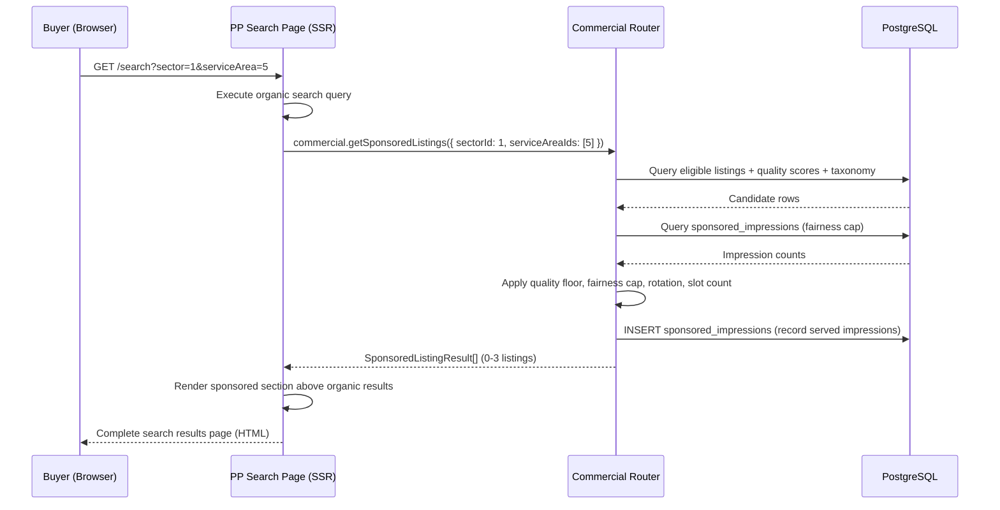

# §4 Sponsored Placement

**Status:** Phase 2 content output
**Agent:** C (Sponsored Placement)
**Slice:** S8 Commercial & Revenue
**Written:** 2026-02-14
**Inputs:** `01-schema.md` (§2.3 `sponsored_impressions`), `01-router-plan.md` (§2.2 `commercial.getSponsoredListings`), `01-decisions.md` (D2), `commercial-and-revenue.md` (v3 interface §4.1 `TIER_LIMITS`), `commercial-and-revenue.md` (v4 concept design §4.4), `shared-infrastructure.md` (v7 §7.1, §9.2)

---

## 4.1 Overview

Sponsored placement injects 0–3 paid listings into search results as a distinct section above organic results. Selection runs per-request during SSR via `commercial.getSponsoredListings`, called by PP's search results page. Eligibility requires Premium/Partner tier (CR §4.1 `TIER_LIMITS.sponsoredPlacement: true`), active lifecycle status, query-relevant taxonomy overlap, and composite quality score >= 50. Rotation is deterministic (not random) to distribute impressions fairly across eligible listings. A per-service-area fairness cap excludes listings receiving disproportionate impressions. [Source: CR concept design §4.4]

The sponsored section is visually distinct from organic results and labelled "Sponsored" per ASA CAP Code rule 2.4. A listing selected for sponsored placement also appears in its organic position — the organic entry is not suppressed. [Source: CR concept design §4.4]

**Upstream flags resolved:** S4-9 (tier gating), S5-2 (`isSponsored` flag surface), S6-1 (integration with search results SSR).

---

## 4.2 `selectSponsoredListings` Algorithm

Core selection function. All reads are against existing tables — no cross-domain writes. The function is a pure query + computation with one side-effect: impression recording.

```typescript
type SponsoredListingsInput = {
  sectorId?: number
  serviceAreaIds?: number[]
  locationSlug?: string
}

type SponsoredListingResult = {
  listingId: UUID
  position: number           // 0-indexed slot within sponsored section
  isSponsored: true          // constant — PP renders "Sponsored" badge [Resolves S5-2]
}

function selectSponsoredListings(
  input: SponsoredListingsInput,
  ctx: { session: AuthSession }
): SponsoredListingResult[]
```

**Algorithm pseudocode:**

```
selectSponsoredListings(input, ctx):

  // Step 1: Candidate pool — Premium/Partner + query overlap + active lifecycle
  candidates = db.select()
    .from(listings)
    .innerJoin(qualityScores, eq(listings.id, qualityScores.listingId))
    .innerJoin(listingTaxonomyTags, eq(listings.id, listingTaxonomyTags.listingId))
    .where(
      and(
        inArray(listings.subscriptionTier, ["premium", "partner"]),
        eq(listings.lifecycleStatus, "active"),     // [CR-X-9]
        isNotNull(listings.accountId),              // must be claimed
        input.sectorId ? eq(listingTaxonomyTags.sectorId, input.sectorId) : undefined,
        input.serviceAreaIds?.length
          ? inArray(listingTaxonomyTags.serviceAreaId, input.serviceAreaIds)
          : undefined
      )
    )
    .groupBy(listings.id)

  // Step 2: Quality floor — composite >= 50
  qualified = candidates.filter(c => c.qualityScore.composite >= 50)

  // Step 3: Slot count determination
  slotCount = computeSlotCount(qualified.length)
  if slotCount === 0:
    return []

  // Step 4: Fairness cap — exclude listings exceeding 3x mean impressions
  //   for each relevant service area in the 30-day window
  fairnessCapped = applyFairnessCap(qualified, input.serviceAreaIds)

  // Step 5: Rotation offset — deterministic daily rotation
  rotated = fairnessCapped
    .map(c => ({
      ...c,
      rotatedScore: c.qualityScore.composite + dailyRotationOffset(c.listingId)
    }))
    .sortBy(c => c.rotatedScore, "desc")

  // Step 6: Select top N from remaining pool
  selected = rotated.take(slotCount)

  // Step 7: Record impressions (side-effect, non-blocking)
  recordSponsoredImpressions(selected, input.serviceAreaIds)

  // Step 8: Log decision
  logDecision({
    domain: "commercial",
    decisionType: "sponsored_placement_selection",
    inputs: {
      query: input,
      candidateCount: candidates.length,
      qualifiedCount: qualified.length,
      fairnessCappedCount: fairnessCapped.length,
      rotationDate: formatDate(now(), "YYYY-MM-DD")
    },
    output: {
      selectedListingIds: selected.map(s => s.listingId),
      slotCount
    },
    entityContext: { accountId: ctx.session.accountId }
  })
  // [Source: SI §9.2 — sponsored_placement_selection decision type]

  return selected.map((s, i) => ({
    listingId: s.listingId,
    position: i,
    isSponsored: true as const
  }))
```

---

## 4.3 Slot Count Rules

Slot count scales with the qualified candidate pool to prevent sparse sponsored sections that undermine buyer trust. Zero slots means the sponsored section is absent entirely — no empty container.

| Qualified Candidates | Slots | Rationale |
|---------------------|-------|-----------|
| 0–2 | 0 | Too few eligible listings — showing 1–2 sponsored results when the pool is < 3 looks artificial. Section hidden. |
| 3–5 | 1 | Minimal pool. Single sponsored listing avoids section domination. |
| 6–10 | 2 | Moderate competition. Two slots provide variety without saturating. |
| > 10 | 3 | Full pool. Maximum 3 per CR concept design §4.4. |

```typescript
function computeSlotCount(qualifiedCount: number): 0 | 1 | 2 | 3 {
  if (qualifiedCount < 3) return 0
  if (qualifiedCount <= 5) return 1
  if (qualifiedCount <= 10) return 2
  return 3
}
```

---

## 4.4 Rotation Mechanism

Rotation is deterministic per day per listing, not random. A listing's rotation offset changes daily but is consistent within a calendar day (UTC). This ensures:
- Consistent results within a user's search session on the same day.
- Fair distribution across days — no single high-quality listing permanently dominates.
- Reproducibility for debugging and fairness auditing.

```typescript
function dailyRotationOffset(listingId: UUID): number {
  const seed = `${listingId}:${formatDate(now(), "YYYY-MM-DD")}`
  return deterministicHash(seed) % 100
  // Produces 0–99. Added to composite quality score (0–100) for sorting.
  // Maximum effective score: 199. Minimum: 50 (quality floor enforced).
  // The offset is large enough relative to quality score range (50–100)
  // that rotation meaningfully shuffles ordering across days.
}
```

**`deterministicHash`:** A fast, non-cryptographic hash (e.g., MurmurHash3 or FNV-1a). The hash must be deterministic across serverless invocations within the same UTC day. No external state — the seed is computed from the listing ID and the current date string. Implementation detail: use a well-known hash from a dependency already present in the stack (e.g., Node's built-in `crypto.createHash('md5')` truncated to 32-bit integer). Cryptographic strength is unnecessary — the goal is uniform distribution, not security.

**Rotation granularity:** Daily (UTC calendar day). Finer granularity (hourly) would reduce fairness monitoring window effectiveness — the 30-day fairness cap operates on impression counts, which need stable daily cohorts. Coarser granularity (weekly) would leave high-quality listings at the top for too long, defeating the fairness purpose.

---

## 4.5 Fairness Monitoring

Per-service-area impression tracking ensures no listing monopolises sponsored placement. The `sponsored_impressions` table (schema §2.3) records each impression served. D2 mandates the per-event table over an aggregate counter — fairness requires per-service-area breakdown.

### 4.5.1 Impression Recording

On each sponsored placement served, INSERT one row per selected listing per relevant service area:

```
recordSponsoredImpressions(selected: SponsoredListingResult[], serviceAreaIds?: number[]):
  // Determine the effective service area for this impression.
  // If the query specified service areas, record one row per service area per listing.
  // If no service area filter, record against the listing's primary service area.

  effectiveServiceAreaIds = serviceAreaIds?.length
    ? serviceAreaIds
    : selected.flatMap(s => getPrimaryServiceAreaId(s.listingId))

  for listing in selected:
    for serviceAreaId in effectiveServiceAreaIds:
      db.insert(sponsoredImpressions).values({
        listingId: listing.listingId,
        serviceAreaId: serviceAreaId,
        impressionDate: now()
      })
```

Impression recording is non-blocking — executed after the response is assembled but before return. At V1 scale (~50 Premium/Partner listings, ~10 impressions/listing/day), this adds ~45K rows over 90 days. INSERT latency is negligible.

### 4.5.2 Fairness Cap Query

Listings exceeding 3x the mean impressions for a service area in the 30-day window are excluded from selection:

```
applyFairnessCap(
  candidates: QualifiedCandidate[],
  serviceAreaIds?: number[]
): QualifiedCandidate[]

  if !serviceAreaIds?.length:
    return candidates  // no service area filter — fairness cap cannot be evaluated

  // Query: per-listing impression count in this service area over 30 days
  impressionCounts = db.select({
      listingId: sponsoredImpressions.listingId,
      count: count()
    })
    .from(sponsoredImpressions)
    .where(
      and(
        inArray(sponsoredImpressions.serviceAreaId, serviceAreaIds),
        gt(sponsoredImpressions.impressionDate, now() - interval('30 days'))
      )
    )
    .groupBy(sponsoredImpressions.listingId)

  // Compute mean impressions across all listings in this service area
  totalImpressions = sum(impressionCounts.map(r => r.count))
  listingCount = impressionCounts.length || 1  // avoid division by zero
  meanImpressions = totalImpressions / listingCount

  // Exclude listings exceeding 3x mean
  excludedListingIds = impressionCounts
    .filter(r => r.count > 3 * meanImpressions)
    .map(r => r.listingId)

  return candidates.filter(c => !excludedListingIds.includes(c.listingId))
```

The 3x threshold is from CR concept design §4.4: "no listing receives >3x the mean impressions for its service area in a 30-day window." The threshold is generous at V1 scale — with ~50 eligible listings, the mean is ~6 impressions/listing/day across service areas. A listing would need ~18 impressions/day in a single service area to be capped.

### 4.5.3 Retention and Cleanup

`sponsored_impressions` rows older than 90 days are deleted. The 30-day fairness window only needs 30 days of data; 90 days provides headroom for trend analysis and debugging.

**Cleanup mechanism:** Inline deletion during the fairness cap query. After computing `impressionCounts`, execute:

```
db.delete(sponsoredImpressions)
  .where(lt(sponsoredImpressions.impressionDate, now() - interval('90 days')))
```

This piggybacks on the existing query, adds minimal overhead, and avoids a separate scheduled cleanup job. At V1 write volume (~500 rows/day max), the DELETE touches a small set of aged rows. No index bloat concern at this scale.

**Migration path:** If impression volume grows beyond 100K rows at steady state (implies ~1,100 impressions/day — roughly 10x V1), evaluate a dedicated deferred action for batch cleanup or a PostgreSQL partition-by-month strategy.

---

## 4.6 Integration Surface with PP Search



**Calling pattern:** PP's search results page calls `commercial.getSponsoredListings` alongside the organic search query during SSR. The two calls are independent — sponsored results are not mixed into organic results. PP renders the sponsored section above organic results with a "Sponsored" label and visual divider. [Source: SI §7.1 — search results are SSR]

**Access control:** `protectedProcedure` — requires authenticated session (`ctx.session`). Anonymous users see search results without the sponsored section. The PP search page conditionally calls this route only when `ctx.session` exists. [Source: `01-router-plan.md` §2.2]

**Empty result handling:** When `selectSponsoredListings` returns `[]` (zero slots), PP omits the sponsored section entirely. No empty container, no "no sponsored results" message. The organic results render at the top of the page as if the sponsored section does not exist.

**Resolves S6-1:** The integration surface is a single tRPC call during SSR. PP does not need to know the selection algorithm — it receives listing IDs with position metadata and renders them. CR owns the selection logic; PP owns the rendering.

---

## 4.7 `isSponsored` Flag Surface

Each `SponsoredListingResult` carries `isSponsored: true` as a constant field. PP uses this to render the "Sponsored" badge on listing cards within the sponsored section.

**Rendering contract:** PP checks `isSponsored` to apply:
1. A small "Sponsored" label on the listing card.
2. An info tooltip on click: "This provider has a Premium subscription which includes sponsored placement in relevant searches. Ranking in organic results below is based on quality score." [Source: CR concept design §4.4]

The flag is typed as the literal `true` (not `boolean`) — the field only appears on sponsored results, never on organic results. PP's organic listing cards do not carry an `isSponsored` field.

**Resolves S5-2:** The `isSponsored` flag provides the rendering surface. S5 (provider dashboard) and S6 (buyer search results) both consume it — S5 for the provider's own listing preview ("Your listing appears as Sponsored in relevant searches"), S6 for the buyer-facing badge.

---

## 4.8 Cache Considerations

No cache at V1. `selectSponsoredListings` executes per-request during SSR. [Source: CR concept design §4.4, CR-23]

**Why no cache:** Sponsored selection must reflect current tier eligibility, quality scores, and fairness state. A cached result could serve a listing that downgraded since the cache was populated. The rotation offset changes daily, but within a day, the same inputs produce the same selection — natural request-level consistency without caching.

**Cache migration threshold:** When search traffic exceeds ~500 concurrent SSR requests/second sustained, evaluate a short-TTL cache (60s) keyed on `(sectorId, serviceAreaIds, locationSlug, date)`. The cache would need invalidation on `subscription_tier_changed` events for any listing in the cached set. At V1 traffic (~50–200 searches/day), this threshold is at least two orders of magnitude away.

**Invalidation complexity:** A per-query cache keyed on taxonomy inputs has high cardinality (sector x service area combinations). The invalidation surface — any `subscription_tier_changed` or `quality_score_changed` event touching a cached listing — creates a fan-out problem. This complexity is the primary reason to defer caching until traffic justifies it.

---

## 4.9 Decision Logging

Every `selectSponsoredListings` invocation logs a `sponsored_placement_selection` decision per SI §9.2.

```typescript
// Decision log entry for sponsored placement
{
  domain: "commercial",
  decisionType: "sponsored_placement_selection",
  inputs: {
    sectorId: number | null,
    serviceAreaIds: number[] | null,
    locationSlug: string | null,
    candidateCount: number,          // before quality floor
    qualifiedCount: number,          // after quality floor, before fairness cap
    fairnessCappedCount: number,     // after fairness cap
    rotationDate: string             // "YYYY-MM-DD" — rotation seed date
  },
  output: {
    selectedListingIds: UUID[],      // 0-3 listing IDs
    slotCount: number                // 0 | 1 | 2 | 3
  },
  entityContext: {
    accountId: UUID                  // requesting user's account
  }
}
```

**Entity learning (V2+):** Decision logs enable analysis of sponsored placement distribution, quality floor impact (how many candidates are filtered), and fairness cap activation frequency. S9 (Entity Intelligence) can wire these signals to adjust the quality floor threshold or fairness cap multiplier.

---

## 4.10 Downstream Flags

| Flag | Target | Description |
|------|--------|-------------|
| S8-SP-1 | S9 | Sponsored placement decision logs available for entity learning: quality floor calibration, fairness cap activation frequency, rotation distribution analysis. |

---

## 4.11 Acceptance Criteria

| # | Criterion |
|---|-----------|
| AC-SP-1 | `commercial.getSponsoredListings` returns `SponsoredListingResult[]` with 0–3 entries. Each entry has `listingId: UUID`, `position: number` (0-indexed), `isSponsored: true`. |
| AC-SP-2 | Only listings with `subscriptionTier` in `["premium", "partner"]`, `lifecycleStatus === "active"`, `accountId !== null`, and taxonomy overlap with the query's `sectorId`/`serviceAreaIds` appear as candidates. |
| AC-SP-3 | Candidates with `qualityScores.composite < 50` are excluded. |
| AC-SP-4 | Slot count follows the progression: 0 slots if < 3 qualified candidates, 1 if 3–5, 2 if 6–10, 3 if > 10. |
| AC-SP-5 | Rotation offset is deterministic: same listing ID + same UTC date produces the same offset. Different dates produce different offsets. |
| AC-SP-6 | Listings exceeding 3x mean impressions for the queried service area in the 30-day window are excluded from selection. |
| AC-SP-7 | Each sponsored listing served produces one `sponsored_impressions` row per relevant service area with correct `listingId`, `serviceAreaId`, and `impressionDate`. |
| AC-SP-8 | `sponsored_impressions` rows older than 90 days are deleted during fairness cap evaluation. |
| AC-SP-9 | Anonymous users (no `ctx.session`) do not receive sponsored listings — PP conditionally skips the call. |
| AC-SP-10 | Every invocation logs a `sponsored_placement_selection` decision with `candidateCount`, `qualifiedCount`, `fairnessCappedCount`, `selectedListingIds`, and `slotCount`. |

---

## Cross-References

| Document | Relationship |
|----------|-------------|
| `commercial-and-revenue.md` (v3 interface §4.1) | `TIER_LIMITS.sponsoredPlacement` — eligibility gate |
| `commercial-and-revenue.md` (v4 concept design §4.4) | Selection algorithm, rotation, slot count, cache constraint (CR-23), ASA labelling, lifecycle filter (CR-X-9) |
| `shared-infrastructure.md` (v7 §7.1) | Search results page is SSR — sponsored selection runs server-side |
| `shared-infrastructure.md` (v7 §9.2) | `sponsored_placement_selection` decision type |
| `01-schema.md` §2.3 | `sponsored_impressions` table definition, indexes, retention policy |
| `01-router-plan.md` §2.2 | `commercial.getSponsoredListings` route specification, `SponsoredListingResult` type |
| `01-decisions.md` D2 | Per-event table (not aggregate counter) for fairness monitoring |
