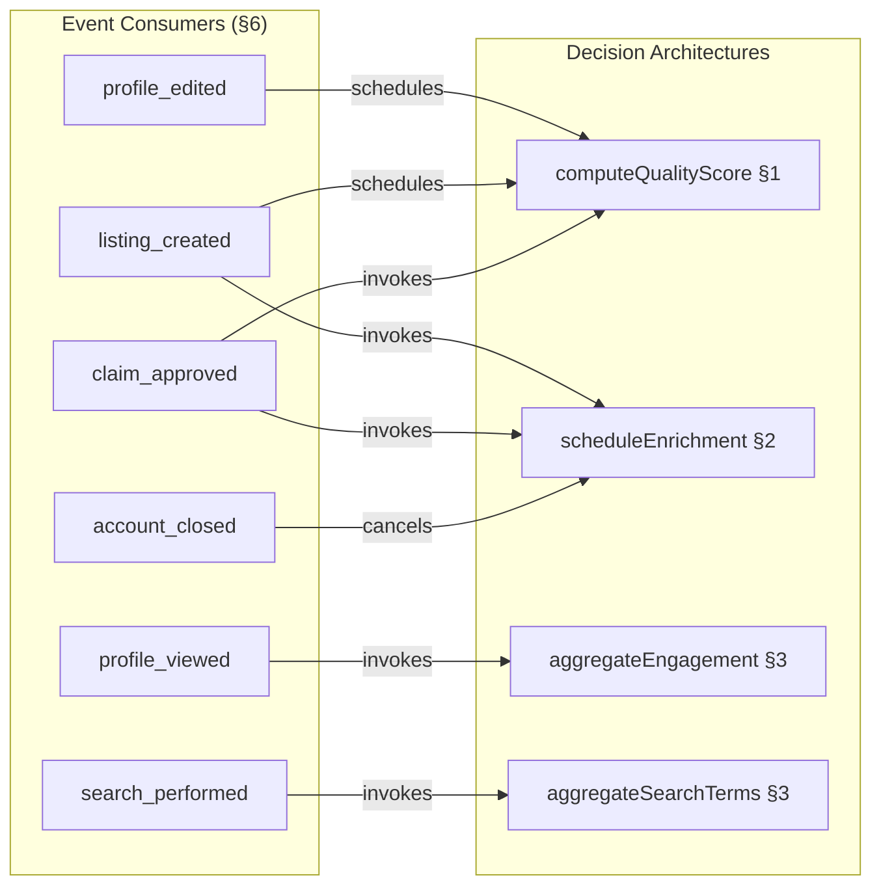

# S9 Router Plan — Entity Intelligence

---

## 1. File Tree

S9 is a backend-only slice. No user-facing pages. All routes are admin-facing queries. The bulk of S9's logic lives in deferred action handlers (17), event consumer handlers (15), and domain-internal decision architectures.

```
src/server/routers/admin/
└── intelligence.ts                        # tRPC router (6 query-only routes)

src/server/intelligence/
├── quality-scoring.ts                     # computeQualityScore, band evaluation, claim abandonment (§1)
├── decay-detection.ts                     # detectDecay, evaluateDecayResponse, enrichment scheduling (§2)
├── analytics-pipeline.ts                  # aggregation pipelines, competitor benchmarking, demographics (§3)
├── ceremony-handlers.ts                   # all 12 ceremony implementations (§4)
├── entity-learning.ts                     # L1-L7 hypothesis analysis, proactive churn, sponsored learning (§5)
└── commercial-intel.ts                    # revenue health extended, conversion attribution, funnel analysis (§5)

src/server/actions/intelligence/
├── quality-score-recalculation.ts         # Deferred action: quality score computation
├── decay-liveness-check.ts                # Deferred action: per-check-type liveness verification
├── enrichment-full-cycle.ts               # Deferred action: full enrichment cycle (self-perpetuating)
├── claim-abandonment-check.ts             # Deferred action: daily batch >90 days pending_review
├── taxonomy-review-preparation.ts         # Deferred action: quarterly ceremony
├── data-health-review.ts                  # Deferred action: monthly ceremony
├── verification-calibration-review.ts     # Deferred action: quarterly ceremony
├── provider-outreach-ranking.ts           # Deferred action: monthly ceremony
├── conversion-funnel-analysis.ts          # Deferred action: monthly ceremony (CR)
├── revenue-health-extended.ts             # Deferred action: monthly ceremony (CR)
├── multi-listing-pricing-evaluation.ts    # Deferred action: quarterly ceremony (CR)
├── sponsored-placement-learning.ts        # Deferred action: monthly ceremony (CR)
├── operational-health-review.ts           # Deferred action: monthly ceremony (Ops)
├── contractor-performance-review.ts       # Deferred action: quarterly ceremony (Ops)
├── principal-briefing-generation.ts       # Deferred action: monthly ceremony (Ops)
├── proactive-churn-detection.ts           # Deferred action: weekly scan (CR)
└── learning-hypothesis-analysis.ts        # Deferred action: monthly L1-L7 measurement (Ops)

src/server/consumers/intelligence/
├── profile-edited.ts                      # Trigger quality score recalc, freshness reset
├── listing-created.ts                     # Initial quality score, enrichment schedule
├── claim-approved.ts                      # Quality recalc (+5 verification), enrichment at claimed cadence, L2/L3 hypothesis tracking
├── profile-viewed.ts                      # Engagement trend aggregation, viewer demographics, deduplication
├── search-performed.ts                    # Search term frequency, zero-result detection, taxonomy gap identification
├── shortlist-added.ts                     # Quality calibration perception signal
├── contact-attempt.ts                     # Unreachable listing detection
├── account-closed.ts                      # Enrichment suspension, cancel pending deferred actions
├── subscription-tier-changed.ts           # Revenue perception update, conversion trigger effectiveness (CR)
├── subscription-ended.ts                  # Churn analysis entry, win-back attribution refinement (CR)
├── conversion-milestone.ts                # Trigger effectiveness, per-gate conversion attribution (CR)
├── enquiry-submitted.ts                   # Enquiry analytics, quality signal, provider outreach prioritisation
├── enquiry-responded.ts                   # Response insights, response time metrics
├── winback-delivery-result.ts             # Win-back effectiveness learning, attribution refinement (CR)
└── decay-signal-detected.ts               # Active support ticket check annotation, duplicate outreach suppression (Ops)

src/db/schema/intelligence.ts              # 6 new tables
```

**Backend-only sections (no dedicated admin pages):**

| Section | Why No Route | Where Logic Lives |
|---------|-------------|-------------------|
| §1 Quality Scoring | Deferred-action-driven + event-driven. Quality scores surface in existing provider dashboard (S5). | `src/server/intelligence/quality-scoring.ts` + `src/server/actions/intelligence/quality-score-recalculation.ts` |
| §2 Decay Detection | Deferred-action-driven. Decay signals trigger email + support tickets (S7). | `src/server/intelligence/decay-detection.ts` + `src/server/actions/intelligence/decay-liveness-check.ts` + `enrichment-full-cycle.ts` |
| §3 Analytics Pipeline | Event-driven aggregation. Analytics surface in provider dashboard (S5). | `src/server/intelligence/analytics-pipeline.ts` — imported by consumers |
| §4 Ceremony Automation | Deferred-action-driven. 12 ceremony outputs surface in admin intelligence routes. | `src/server/intelligence/ceremony-handlers.ts` + 7 deferred action handlers |
| §5 Entity Learning | Deferred-action-driven + monthly ceremonies. Outputs surface in admin intelligence routes. | `src/server/intelligence/entity-learning.ts` + `commercial-intel.ts` + 5 deferred action handlers |
| §6 Event Consumers | Handler registrations in `EVENT_CONSUMER_MATRIX`. Code modules, not routes. | `src/server/consumers/intelligence/*.ts` |

---

## 2. tRPC Router Inventory

### 2.1 admin.intelligence (`src/server/routers/admin/intelligence.ts`)

6 routes. All queries. All `adminProcedure`. No mutations — S9 has no user-initiated intelligence actions. All state changes flow through deferred actions or event consumers.

| Route | Procedure | Input | Return | Section | Description |
|-------|-----------|-------|--------|---------|-------------|
| `admin.intelligence.qualityDistribution` | `adminProcedure.query` | `{ period?: DateRange }` | `QualityDistribution` | §1 | Quality score distribution histogram + band counts |
| `admin.intelligence.decaySignals` | `adminProcedure.query` | `DecaySignalsInput` | `PaginatedDecaySignals` | §2 | Active/resolved decay signals with resolution status |
| `admin.intelligence.enrichmentStatus` | `adminProcedure.query` | `EnrichmentStatusInput` | `PaginatedEnrichmentStatus` | §2 | Enrichment coverage, next checks, failures |
| `admin.intelligence.ceremonies` | `adminProcedure.query` | `CeremoniesInput` | `PaginatedCeremonyRuns` | §4 | Ceremony run log, upcoming schedule, last results |
| `admin.intelligence.learningHypotheses` | `adminProcedure.query` | none | `LearningHypothesis[]` | §5 | L1–L7 current values, trends, confound warnings |
| `admin.intelligence.revenueHealth` | `adminProcedure.query` | none | `RevenuePerception` (extended) | §5 | Extended revenue health (S9 fields populated) |

```typescript
// src/server/routers/admin/intelligence.ts
export const intelligenceRouter = router({
  qualityDistribution: adminProcedure
    .input(z.object({ period: z.object({ from: z.string().datetime(), to: z.string().datetime() }).optional() }))
    .query(/* §1 computeQualityDistribution */),
  decaySignals: adminProcedure
    .input(decaySignalsInput)
    .query(/* §2 listDecaySignals */),
  enrichmentStatus: adminProcedure
    .input(enrichmentStatusInput)
    .query(/* §2 listEnrichmentStatus */),
  ceremonies: adminProcedure
    .input(ceremoniesInput)
    .query(/* §4 listCeremonyRuns */),
  learningHypotheses: adminProcedure
    .query(/* §5 getLearningHypotheses */),
  revenueHealth: adminProcedure
    .query(/* §5 computeRevenuePerception */),
})
```

**Total routes:** 6 (all `adminProcedure`, all query, 0 mutation).

---

### 2.2 Route Specifications

#### `admin.intelligence.qualityDistribution`

Returns quality score distribution histogram for data health monitoring. [Source: D&L CD §5 data health review ceremony]

```typescript
type QualityDistribution = {
  period: DateRange | null                        // null = all time
  bandCounts: {
    poor: number                                  // composite < 40
    fair: number                                  // 40 <= composite < 60
    good: number                                  // 60 <= composite < 80
    excellent: number                             // composite >= 80
  }
  histogram: { score: number; count: number }[]   // 0-100 in buckets of 5
  averageScore: number
  medianScore: number
  totalListings: number
}

const dateRange = z.object({
  from: z.string().datetime(),
  to: z.string().datetime(),
})
```

**Computation:** On-demand aggregate query over `quality_scores` table. Filter by `calculatedBy = "calibrated"` to exclude S1 zero-initialised stubs. Period filter on `quality_scores.updatedAt` if provided.

**Access control:** `adminProcedure` — admin role required.

#### `admin.intelligence.decaySignals`

Paginated list of decay signals with resolution status and listing context. [Source: D&L CD §3 decay detection]

```typescript
const decaySignalsInput = z.object({
  status: z.enum(["active", "resolved"]).optional(),
  severity: z.enum(["critical", "high", "medium"]).optional(),
  signalType: z.enum(["website_dead", "email_bounced", "ch_not_active", "stale_listing", "social_dead", "postcode_invalid", "domain_expired"]).optional(),
  cursor: z.string().optional(),
  limit: z.number().int().min(1).max(50).default(20),
  sort: z.enum(["created_at", "severity"]).default("created_at"),
})

type PaginatedDecaySignals = {
  signals: DecaySignalRow[]
  nextCursor?: string
}

type DecaySignalRow = {
  id: UUID
  listingId: UUID
  listingName: string                            // joined from listings
  signalType: DecaySignalType
  severity: DecaySignalSeverity
  detectedAt: ISO8601
  resolvedAt: ISO8601 | null
  resolutionType: "fixed" | "suppressed" | "archived" | null
  hasActiveSupportTicket: boolean                // computed from support_tickets join
}
```

**Query strategy:** Single query with LEFT JOIN to `listings` and `support_tickets` (to populate `hasActiveSupportTicket`). Filter by `status` (derived: `resolvedAt IS NULL` = active).

#### `admin.intelligence.enrichmentStatus`

Paginated enrichment schedule status with coverage and failure metrics. [Source: D&L CD §3 enrichment]

```typescript
const enrichmentStatusInput = z.object({
  cadenceTier: z.enum(["paid", "claimed", "unclaimed"]).optional(),
  checkType: z.enum(["website", "email", "ch", "social", "postcode", "imdb"]).optional(),
  failuresOnly: z.boolean().default(false),
  cursor: z.string().optional(),
  limit: z.number().int().min(1).max(50).default(20),
})

type PaginatedEnrichmentStatus = {
  entries: EnrichmentStatusRow[]
  nextCursor?: string
  summary: {
    totalListings: number
    coverageByTier: Record<"paid" | "claimed" | "unclaimed", number>
    failedChecksLast7d: number
  }
}

type EnrichmentStatusRow = {
  listingId: UUID
  listingName: string                            // joined from listings
  cadenceTier: "paid" | "claimed" | "unclaimed"
  checkType: EnrichmentCheckType
  nextCheckAt: ISO8601
  lastCheckAt: ISO8601 | null
  lastFullCycleAt: ISO8601 | null
  failureCount: number                           // consecutive failures
  lastError: string | null
}
```

**Query strategy:** Single query with JOIN to `listings` for listing name. Filter by `cadenceTier` and `checkType`. Separate COUNT query for summary stats.

#### `admin.intelligence.ceremonies`

Paginated ceremony run log with execution status and upcoming schedule. [Source: D&L/CR/Ops CD §5/§9 ceremonies]

```typescript
const ceremoniesInput = z.object({
  ceremonyType: z.enum([
    "taxonomy_review",
    "data_health_review",
    "verification_calibration",
    "provider_outreach",
    "conversion_funnel_analysis",
    "revenue_review",
    "multi_listing_pricing",
    "sponsored_placement_learning",
    "operational_health_review",
    "contractor_performance_review",
    "principal_briefing",
    "learning_hypothesis_analysis"
  ]).optional(),
  status: z.enum(["completed", "failed"]).optional(),
  cursor: z.string().optional(),
  limit: z.number().int().min(1).max(50).default(20),
})

type PaginatedCeremonyRuns = {
  runs: CeremonyRunRow[]
  nextCursor?: string
  upcoming: {
    ceremonyType: CeremonyType
    nextRunAt: ISO8601
  }[]
}

type CeremonyRunRow = {
  id: UUID
  ceremonyType: CeremonyType
  executedAt: ISO8601
  status: "completed" | "failed"
  inputsHash: string                             // hash of inputs for deduplication
  outputs: Record<string, unknown>               // ceremony-specific JSONB output
  decisionsLogged: number                        // COUNT of decision_logs entries created by this run
  error: string | null
}
```

**Query strategy:** Main query over `ceremony_runs` table. `upcoming` array computed from `deferred_actions` WHERE `action` IN (ceremony action types) AND `status = "pending"`.

**Access control:** `adminProcedure` — admin role required.

#### `admin.intelligence.learningHypotheses`

Returns current state of all L1–L7 learning hypotheses. [Source: Ops CD §8 learning hypotheses]

```typescript
type LearningHypothesis = {
  hypothesisId: "L1" | "L2" | "L3" | "L4" | "L5" | "L6" | "L7"
  name: string                                   // e.g., "L1: Human-selected listings convert at 5x rate"
  currentValue: number
  previousValue: number | null
  trend: "increasing" | "decreasing" | "stable" | null
  lastMeasuredAt: ISO8601
  confoundWarning: string | null                 // e.g., "Seasonal spike — insufficient baseline"
}
```

**Computation:** Single query over `learning_hypotheses` table (7 static rows). No pagination needed.

**Access control:** `adminProcedure` — admin role required.

#### `admin.intelligence.revenueHealth`

Returns extended revenue perception snapshot. [Source: CR CD §6.2, S8-1]

```typescript
// Extends S8's RevenuePerception type with S9 fields
type RevenuePerception = {
  // S8 V1 fields (non-optional after S9 first run)
  mrr: number
  arr: number
  tierDistribution: Record<SubscriptionTier, number>
  churnRate30d: number
  churnRate90d: number
  conversionRate30d: number
  netRevenueRetention: number
  averageRevenuePerListing: number
  revenueConcentrationIndex: number
  projectedMonthlyRevenue: number
  trialConversions: number
  activeSubscriptions: number

  // S9 extensions (optional until first revenue_health_extended run)
  churnByTier?: Record<SubscriptionTier, number>
  annualRenewalRate?: number
  ltv?: number
  cac?: number
  discountCohortDivergence?: number
  downgradeToPaidChurnRatio?: number
  secondaryListingChurnRate?: number
  averageSubscriptionLifetimeDays?: number
}
```

**Computation:** On-demand aggregate query over `churn_analysis_log`, `listings`, `commercial_state`. S9 fields (`churnByTier` onward) are `null` until the first `revenue_health_extended` deferred action run completes.

**Access control:** `adminProcedure` — admin role required.

**Note on `revenueHealth` vs S8's `commercial.getRevenuePerception`:** Both routes exist. S8's route provides V1 fields (immediate compute). S9's route includes S9 extensions. The admin dashboard revenue panel calls S9's route if available (post-S9 deployment), falls back to S8's route if S9 not yet deployed.

---

## 3. Deferred Action Handler Inventory

17 deferred action handlers. All `domain: "intelligence"` except where noted. All `retryPolicy: "retry_3"` except batch actions (`once`). All `onFailure: "log"` except `enrichment_full_cycle` (`alert_principal` — cost-bearing API calls).

| Action | Params Type | Owner | Schedule | Retry | On Failure | Section | Handler Module |
|--------|-------------|-------|----------|-------|------------|---------|----------------|
| `quality_score_recalculation` | `{ listingId: UUID }` | D&L | Event-driven + nightly batch | `retry_3` | `log` | §1 | `quality-score-recalculation.ts` |
| `decay_liveness_check` | `{ listingId: UUID, checkType: EnrichmentCheckType }` | D&L | Per enrichment cadence (weekly/fortnightly/monthly). Self-perpetuating. | `retry_3` | `log` | §2 | `decay-liveness-check.ts` |
| `enrichment_full_cycle` | `{ listingId: UUID }` | D&L | Per enrichment cadence (quarterly/semi-annual/annual). Self-perpetuating. | `retry_3` | `alert_principal` | §2 | `enrichment-full-cycle.ts` |
| `claim_abandonment_check` | `Record<string, never>` | D&L | Daily batch. Scans `pending_review` listings >90 days. | `once` | `log` | §1 | `claim-abandonment-check.ts` |
| `taxonomy_review_preparation` | `Record<string, never>` | D&L | Quarterly | `once` | `log` | §4 | `taxonomy-review-preparation.ts` |
| `data_health_review` | `Record<string, never>` | D&L | Monthly | `once` | `log` | §4 | `data-health-review.ts` |
| `verification_calibration_review` | `Record<string, never>` | D&L | Quarterly | `once` | `log` | §4 | `verification-calibration-review.ts` |
| `provider_outreach_ranking` | `Record<string, never>` | D&L | Monthly | `once` | `log` | §4 | `provider-outreach-ranking.ts` |
| `conversion_funnel_analysis` | `Record<string, never>` | CR | Monthly | `once` | `log` | §4 | `conversion-funnel-analysis.ts` |
| `revenue_health_extended` | `Record<string, never>` | CR | Monthly | `once` | `log` | §5 | `revenue-health-extended.ts` |
| `multi_listing_pricing_evaluation` | `Record<string, never>` | CR | Quarterly (requires 20+ accounts threshold) | `once` | `log` | §4 | `multi-listing-pricing-evaluation.ts` |
| `sponsored_placement_learning` | `Record<string, never>` | CR | Monthly | `once` | `log` | §5 | `sponsored-placement-learning.ts` |
| `operational_health_review` | `Record<string, never>` | Ops | Monthly | `once` | `log` | §4 | `operational-health-review.ts` |
| `contractor_performance_review` | `Record<string, never>` | Ops | Quarterly | `once` | `log` | §4 | `contractor-performance-review.ts` |
| `principal_briefing_generation` | `Record<string, never>` | Ops | Monthly | `once` | `log` | §4 | `principal-briefing-generation.ts` |
| `proactive_churn_detection` | `Record<string, never>` | CR | Weekly | `retry_3` | `log` | §5 | `proactive-churn-detection.ts` |
| `learning_hypothesis_analysis` | `Record<string, never>` | Ops | Monthly | `once` | `log` | §5 | `learning-hypothesis-analysis.ts` |

**Self-perpetuating pattern examples:**

```typescript
// decay-liveness-check.ts
async function handleDecayLivenessCheck({ listingId, checkType }: { listingId: UUID; checkType: EnrichmentCheckType }) {
  const listing = await getListing(listingId)
  const signal = await detectDecay(listing, checkType)

  if (signal) {
    // Emit decay_signal_detected event
    emit("decay_signal_detected", { listingId, accountId: listing.accountId, signals: [signal], ... })
  }

  // Update last check timestamp
  await updateEnrichmentSchedule(listingId, checkType, { lastCheckAt: now() })

  // Schedule next check (self-perpetuating)
  const nextCheckAt = computeNextCheckAt(listing.cadenceTier, checkType)
  await scheduleDeferred("decay_liveness_check", { listingId, checkType }, nextCheckAt)
}
```

```typescript
// taxonomy-review-preparation.ts (quarterly ceremony)
async function handleTaxonomyReviewPreparation() {
  // Aggregate free-text tags, zero-result queries, taxonomy gaps
  const report = await prepareTaxonomyReview()

  // Log ceremony run
  await logCeremonyRun({
    ceremonyType: "taxonomy_review",
    executedAt: now(),
    status: "completed",
    outputs: report,
  })

  // Schedule next run (self-perpetuating)
  const nextQuarterDate = addMonths(now(), 3)
  await scheduleDeferred("taxonomy_review_preparation", {}, nextQuarterDate)
}
```

**Total SI §2.1/§2.2 updates:** +17 `DeferredActionParamsMap` entries, +17 registered action rows. Prior count: 17 (S0–S8). After S9: **34 deferred actions**.

---

## 4. Event Consumer Handler Inventory

15 consumer handlers registered in `EVENT_CONSUMER_MATRIX`. All `domain: "intelligence"` except where noted. All `mode: "async"`.

| Event | Consumer Domain | Consumer ID | Mode | Handler Module | Invokes | Section |
|-------|----------------|-------------|------|----------------|---------|---------|
| `profile_edited` | D&L (S9) | `intelligence:profile_edited:qualityRecalc` | async | `profile-edited.ts` | §1 `scheduleDeferred("quality_score_recalculation")`, freshness reset | §6 |
| `listing_created` | D&L (S9) | `intelligence:listing_created:initialQuality` | async | `listing-created.ts` | §1 initial quality score, §2 enrichment schedule | §6 |
| `claim_approved` | D&L (S9) | `intelligence:claim_approved:qualityUpgrade` | async | `claim-approved.ts` | §1 quality recalc (+5 verification), §2 enrichment at claimed cadence, §5 L2/L3 hypothesis tracking | §6 |
| `profile_viewed` | D&L (S9) | `intelligence:profile_viewed:engagement` | async | `profile-viewed.ts` | §3 engagement trend aggregation, §3 viewer demographics, §1 deduplication | §6 |
| `search_performed` | D&L (S9) | `intelligence:search_performed:searchAnalytics` | async | `search-performed.ts` | §3 search term frequency, §3 zero-result detection, §3 taxonomy gap identification | §6 |
| `shortlist_added` | D&L (S9) | `intelligence:shortlist_added:qualitySignal` | async | `shortlist-added.ts` | §1 quality calibration perception signal | §6 |
| `contact_attempt` | D&L (S9) | `intelligence:contact_attempt:unreachableDetection` | async | `contact-attempt.ts` | §2 unreachable listing detection (data quality perception) | §6 |
| `account_closed` | D&L (S9) | `intelligence:account_closed:enrichmentSuspension` | async | `account-closed.ts` | §2 enrichment suspension, cancel pending deferred actions | §6 |
| `subscription_tier_changed` | CR (S9) | `intelligence:subscription_tier_changed:revenuePerception` | async | `subscription-tier-changed.ts` | §5 revenue perception update, §5 conversion trigger effectiveness | §6 |
| `subscription_ended` | CR (S9) | `intelligence:subscription_ended:churnAnalysis` | async | `subscription-ended.ts` | §5 churn analysis entry, §5 win-back attribution refinement | §6 |
| `conversion_milestone` | CR (S9) | `intelligence:conversion_milestone:attribution` | async | `conversion-milestone.ts` | §5 trigger effectiveness, §5 per-gate conversion attribution | §6 |
| `enquiry_submitted` | D&L (S9) | `intelligence:enquiry_submitted:enquiryAnalytics` | async | `enquiry-submitted.ts` | §3 enquiry analytics, §1 quality signal, §4 provider outreach prioritisation | §6 |
| `enquiry_responded` | D&L (S9) | `intelligence:enquiry_responded:responseInsights` | async | `enquiry-responded.ts` | §3 response insights, response time metrics | §6 |
| `winback_delivery_result` | CR (S9) | `intelligence:winback_delivery_result:effectiveness` | async | `winback-delivery-result.ts` | §5 win-back effectiveness learning, attribution refinement | §6 |
| `decay_signal_detected` | Ops (S9) | `intelligence:decay_signal_detected:supportCheck` | async | `decay-signal-detected.ts` | Annotate with active support ticket check, duplicate outreach suppression | §6 |

**Consumer-to-domain-logic imports:**



Per D5: §6 (Event Consumers) is authoritative for consumer handler code. §1–§5 provide exported decision architecture pseudocode that §6's handlers invoke. No handler body duplication across content files.

**EVENT_CONSUMER_MATRIX delta:** +15 new consumer entries. Prior count: ~50 (S0–S8). After S9: **~65 consumers**.

---

## 5. Rendering Strategy

All S9 routes are admin-only CSR. No public pages. No SSG or ISR. [Source: SI §7.1]

| Route | Strategy | Rationale |
|-------|----------|-----------|
| `admin.intelligence.*` (all 6 routes) | **CSR** | Admin dashboard. Authenticated, role-guarded, no SEO value. Data is always fresh and admin-specific. Interactive intelligence panels require client-side state. |

S9 adds no SSG or ISR pages. All user-facing intelligence surfaces (quality scores, analytics, competitor benchmarking) were already added in S5 (provider dashboard) and S6 (search results). S9 populates the computation logic.

---

## 6. Cross-Domain Integration Surface

S9 provides computation logic that other slices' routes and handlers consume. Integration is via TypeScript imports (P4), not additional tRPC routes.

| Consuming Slice/Domain | Import | What It Gets |
|------------------------|--------|-------------|
| S5 (provider dashboard) | §3 analytics functions | `computeCompetitorBenchmark`, `computeViewerDemographics`, `computeEnquiryResponseInsights` |
| S5 (quality score display) | §1 quality scoring | `computeQualityScore` — replaced zero-initialised fallback |
| S7 (admin health) | `admin.intelligence.revenueHealth` | Extended revenue health for admin panel |
| D&L domain | §1 quality scoring | `computeQualityScore` for listing quality determination |
| D&L domain | §2 decay detection | `detectDecay`, `evaluateDecayResponse` for enrichment pipeline |
| CR domain | §5 commercial intelligence | `proactiveChurnDetection`, `computeConversionAttribution` |
| Ops domain | §5 learning hypotheses | `analyseLearningHypotheses` for operational perception |

---

## 7. Route-to-Skeleton Section Mapping

| Skeleton Section | Primary Routes / Handlers | Backend-Only Notes |
|-----------------|--------------------------|-------------------|
| §1 Quality Scoring | No dedicated route | `computeQualityScore` imported by S5 provider dashboard and D&L domain. `quality_score_recalculation` deferred action is the primary handler. |
| §2 Decay Detection | `admin.intelligence.decaySignals`, `admin.intelligence.enrichmentStatus` | `decay_liveness_check` and `enrichment_full_cycle` deferred actions are self-perpetuating. Decay warnings trigger S7 support tickets. |
| §3 Analytics Pipeline | No dedicated route | Analytics aggregation surfaces in S5 provider dashboard. `perception_aggregates` table written by scheduled deferred actions. |
| §4 Ceremony Automation | `admin.intelligence.ceremonies` | 12 ceremony deferred action handlers. Run log in `ceremony_runs` table. |
| §5 Entity Learning | `admin.intelligence.learningHypotheses`, `admin.intelligence.revenueHealth` | L1–L7 hypothesis measurements, proactive churn detection, revenue health extension. |
| §6 Event Consumers | No routes | 15 handler registrations in `EVENT_CONSUMER_MATRIX` — code modules |

---

## 8. Router File Organization

```
src/server/routers/admin/
├── index.ts                           # Merges all admin sub-routers
└── intelligence.ts                    # admin.intelligence.* (6 routes)
```

```typescript
// src/server/routers/admin/intelligence.ts
export const intelligenceRouter = router({
  qualityDistribution: adminProcedure
    .input(z.object({ period: z.object({ from: z.string().datetime(), to: z.string().datetime() }).optional() }))
    .query(async ({ input }) => {
      // Delegate to §1 computeQualityDistribution
      return computeQualityDistribution(input.period)
    }),

  decaySignals: adminProcedure
    .input(decaySignalsInput)
    .query(async ({ input }) => {
      // Delegate to §2 listDecaySignals
      return listDecaySignals(input)
    }),

  enrichmentStatus: adminProcedure
    .input(enrichmentStatusInput)
    .query(async ({ input }) => {
      // Delegate to §2 listEnrichmentStatus
      return listEnrichmentStatus(input)
    }),

  ceremonies: adminProcedure
    .input(ceremoniesInput)
    .query(async ({ input }) => {
      // Delegate to §4 listCeremonyRuns
      return listCeremonyRuns(input)
    }),

  learningHypotheses: adminProcedure
    .query(async () => {
      // Delegate to §5 getLearningHypotheses
      return getLearningHypotheses()
    }),

  revenueHealth: adminProcedure
    .query(async () => {
      // Delegate to §5 computeRevenuePerception (extended)
      return computeRevenuePerception()
    }),
})
```

**Total routes:** 6 (all `adminProcedure`, all query, 0 mutation).

---

## Cross-References

| Document | Relationship |
|----------|-------------|
| `shared-infrastructure.md` (v8) | §1 event bus + P1-P5 principles, §2 deferred actions (17 new actions), §4.1 `AuthSession` type (admin guard), §5 email transport (4 new templates), §8 notification types (2 new), §9 decision logging (7 new decision types) |
| `data-and-listings.md` (v5 interface) | §1 emitted events (`decay_signal_detected` §1.7, `quality_score_changed` §1.8), §3 query interfaces (`getEngagementCounters` §3.2, `computeTaxonomyOverlap` §3.1, `getListingAnalytics` §3.x), §4 quality scoring contract |
| `commercial-and-revenue.md` (v3 interface) | §1 emitted events (`churn_risk_detected` §1.1), §4 TierLimits for premium feature gating, §5 conversion trigger types, §6 revenue perception extension |
| `operations.md` (v4 interface) | §3.1 `hasActiveTicket` query (consumed by §2 decay response), §3.4 `getFeatureGateFrictionSummary` (consumed by §5 friction ratios), §5 learning hypotheses |
| `platform-and-product.md` (v6 interface) | §1.x event payloads (consumed by §3 analytics, §6 consumers), §3.1 query interfaces, §4 email templates |
| `data-and-listings.md` (v6 concept design) | §3 quality scoring dimensions, decay detection pipeline, enrichment cadence. §5 ceremonies (taxonomy review, data health, verification calibration, provider outreach) |
| `commercial-and-revenue.md` (v4 concept design) | §3.2 multi-listing pricing evolution, §4 sponsored placement learning, §5 conversion trigger thresholds, §6 revenue perception full specification |
| `operations.md` (v6 concept design) | §8 learning hypotheses L1–L7, §9 ceremonies (operational health review, contractor performance, principal briefing) |
| `slices/slice-08-commercial/00-router-plan.md` (v2) | Structural format reference for backend-only slices. S8's `commercial.getRevenuePerception` route provides V1 fields; S9's `admin.intelligence.revenueHealth` extends with S9 fields. |
| `slices/slice-07-operations/00-router-plan.md` (v2) | Admin route organization pattern. S9 extends admin dashboard with intelligence panel. |
| `s9-drafting/01-decisions.md` | D2: enrichment tracking in separate table (removes 3 listing column amendments), D5: `RevenuePerception` single type with optional fields, D6: template overlap resolution (4 new templates, not 5), D7: notification type overlap (2 new types, not 5) |
