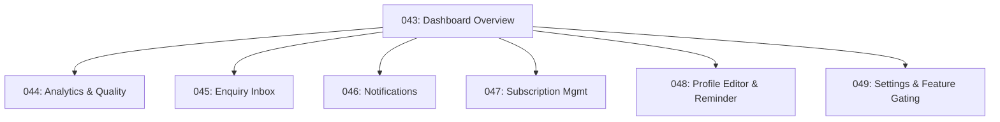

# Chapter: Provider Experience

Source: `3-requirements/slices/slice-05-provider-experience.md` (v2, 46 AC).

## Work Items

| ID | Title | AC | Priority | Effort | Blocked By |
|----|-------|----|----------|--------|------------|
| CS-WORK-043 | Dashboard overview and listing context | 5 | critical | medium | — |
| CS-WORK-044 | Analytics display and quality score panel | 10 | high | large | 043 |
| CS-WORK-045 | Enquiry inbox and response tracking | 7 | high | medium | 043 |
| CS-WORK-046 | Notification centre and schema migration | 4 | high | medium | 043 |
| CS-WORK-047 | Subscription management panel | 4 | medium | small | 043 |
| CS-WORK-048 | Profile editor enhancements and 90-day reminder | 8 | high | large | 043 |
| CS-WORK-049 | Account settings and feature gating UI | 8 | medium | medium | 043 |

## Dependency Graph

## Requirements Coverage

- **Total AC:** 46 (5 + 10 + 7 + 4 + 4 + 8 + 8)
- **Integration-testable:** AC-4, AC-5, AC-9, AC-10, AC-14, AC-16–AC-26, AC-31, AC-32, AC-35–AC-41, AC-45 (27 AC)
- **E2E-deferred:** AC-1–AC-3, AC-6–AC-8, AC-11–AC-13, AC-15, AC-27–AC-30, AC-33, AC-34, AC-43, AC-44 (17 AC)
- **Unit-testable:** AC-42, AC-46 (2 AC)

## Key Constraints

- PP-Q1 (component library) should be resolved before implementation begins — dashboard is the largest UI surface.
- S9 data fields (search terms, demographics, benchmarking) render null until S9 populates them.
- Notifications table does not yet exist — CS-WORK-046 creates it.
- `enquiry_records.status` column does not exist — CS-WORK-045 adds it via migration.
- `listings.version` column does not exist — CS-WORK-048 adds it via migration.
