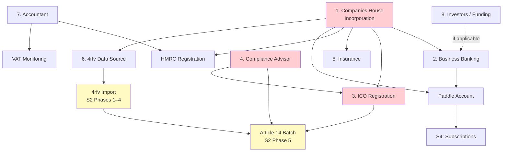
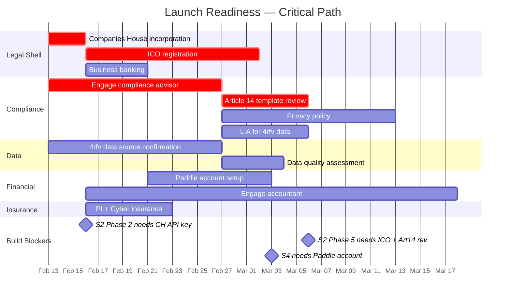

# Launch Readiness — Tracker

**Status:** ACTIVE
**Started:** 2026-02-12
**Last updated:** 2026-02-15
**Scope:** All non-build work required before CALLSHEET can operate as a legal commercial entity processing personal data. Layer 5 (Legal Shell) and Layer 4 (Meatspace Interface) prerequisites.

---

## Dependency Map

**Critical path:** Companies House → ICO + Compliance Advisor → Article 14 batch. Everything else can run in parallel once the Ltd exists.

---

## Workstreams

### 1. Companies House — Incorporation

**Status:** NOT STARTED
**Priority:** CRITICAL — hard dependency for everything else
**Owner:** Principal

The legal shell. CALLSHEET Ltd must exist before bank accounts, contracts, ICO registration, or API access.

| Task | Status | Notes |
|---|---|---|
| Choose company name (CALLSHEET Ltd or variant) | Not started | Check availability on Companies House |
| Register Ltd (Form IN01) | Not started | Director: principal. Registered office address required. |
| Receive certificate of incorporation | Not started | Typically 24 hours for digital filing, 8–10 days postal |
| SIC code selection | Not started | 63110 (Data processing, hosting) or 63120 (Web portals) |
| Registered office address | Not started | Virtual office service if no physical office |
| PSC (Person of Significant Control) registration | Not started | Automatic with incorporation — principal is PSC |
| Companies House API key application | Not started | Required for S3 (claim verification) and S2 (4rfv import Phase 2) |

**Cost:** £12 (digital incorporation) + ~£15–50/month virtual office if needed.
**Timeline:** 1–2 days once filed digitally.

---

### 2. Business Banking

**Status:** NOT STARTED — blocked by Companies House
**Priority:** HIGH — required before Paddle, contractors, or any payments
**Owner:** Principal

| Task | Status | Notes |
|---|---|---|
| Open business current account | Not started | Starling Business / Tide / Monzo Business. No monthly fee options available. |
| Set up Paddle merchant account | Not started | Requires: registered company, bank account, website (can be placeholder). Paddle handles VAT on SaaS sales (merchant of record). |
| Configure Paddle webhooks | Not started | Technical — S4 implementation consumes these. Account setup is the prerequisite. |

**Paddle note:** Paddle is merchant of record — they handle VAT collection/remittance on subscription payments. CALLSHEET still needs to register for VAT when threshold is met but Paddle simplifies compliance significantly.

**Timeline:** Business account: 1–5 days. Paddle: 3–10 days (KYC review).

---

### 3. ICO Registration

**Status:** NOT STARTED — blocked by Companies House
**Priority:** CRITICAL — must register before processing personal data (including 4rfv import)
**Owner:** Principal + Compliance Advisor

| Task | Status | Notes |
|---|---|---|
| Register as data controller with ICO | Not started | UK GDPR requirement. Must be done before any personal data processing. |
| Pay registration fee | Not started | £40/year (Tier 1: <10 staff, <£632K turnover) |
| Document lawful basis for processing | Not started | Legitimate interest (4rfv seed data), consent (account creation), contract (subscriptions) |
| Prepare ROPA (Record of Processing Activities) | Not started | Art 30 requirement. Compliance advisor reviews. |
| Prepare privacy policy | Not started | Required on website before launch. Must cover all processing activities. |

**Hard constraint:** The 4rfv import (S2 Phase 1) is personal data processing. ICO registration must complete before import begins. The Article 14 30-day clock starts at import — registration must be in place first.

**Timeline:** Online registration: immediate. Certificate: 1–2 weeks.

---

### 4. Compliance Advisor

**Status:** NOT STARTED
**Priority:** CRITICAL — Article 14 template requires compliance review before first batch send
**Owner:** Principal (procurement)

| Task | Status | Notes |
|---|---|---|
| Identify compliance advisor | Not started | Freelance data protection consultant or small firm. GDPR specialisation required. |
| Scope engagement | Not started | Initial scope: Article 14 template review, privacy policy review, ROPA review, lawful basis documentation. Ongoing: DSAR process review, quarterly compliance check. |
| Article 14 email template review | Not started | Template structure defined in Ops §5 [X-15]. Legal notice section requires compliance sign-off before Phase 5 batch send. |
| Privacy policy drafting/review | Not started | Must cover: data categories, lawful bases, retention periods, rights, international transfers, cookies, third-party processors (Supabase, Vercel, Resend, Paddle, Cloudflare). |
| Lawful basis assessment | Not started | Legitimate interest assessment (LIA) for 4rfv seed data. Document the balancing test. |
| DSAR process review | Not started | Operations §5 DSAR decision architecture. Compliance advisor validates process meets Art 15–22 requirements. |

**Budget:** £500–1,500 for initial engagement (template review + privacy policy + LIA). Within Operations autonomous procurement limit if <£500; escalate to principal if above.

**Timeline:** 1–2 weeks for initial deliverables once engaged.

---

### 5. Insurance

**Status:** NOT STARTED — blocked by Companies House
**Priority:** MEDIUM — required before processing third-party data at scale, not blocking build
**Owner:** Principal

| Task | Status | Notes |
|---|---|---|
| Professional indemnity insurance | Not started | Covers claims arising from professional advice/services. Standard for B2B platforms. |
| Cyber liability insurance | Not started | Covers data breach costs (notification, forensics, legal). Relevant given 4,700 data subjects at launch. |
| Public liability (if applicable) | Not started | May not be needed if fully digital. Assess based on advisor recommendation. |

**Budget:** £300–600/year for combined PI + cyber at startup scale.

**Timeline:** Can bind same-day once application submitted. Not on critical path.

---

### 6. 4rfv Data Source

**Status:** NOT STARTED
**Priority:** HIGH — the 4,700 seed listings are the platform's launch inventory
**Owner:** Principal

| Task | Status | Notes |
|---|---|---|
| Confirm data source and access method | Not started | How is the 4rfv data obtained? Scrape, export, API, licence agreement? |
| Document data provenance | Not started | Required for Article 14 notices: "source of data" disclosure. Currently specified as "publicly available industry records." |
| Assess licensing/permission requirements | Not started | If 4rfv has terms of use restricting commercial re-use, a licence may be required. If data is truly public (e.g., directory listings), document the basis. |
| Obtain data extract | Not started | Raw data needed before S2 import pipeline can run. Format, schema, completeness. |
| Data quality assessment | Not started | Initial scan: how many records have email? CH numbers? Full addresses? Determines Phase 1–3 effort. |

**Risk:** If 4rfv data source requires a licence fee or is restricted, this is a strategic blocker. The entire onboarding strategy (Path C, claim flow, endowment effect) depends on pre-seeded listings.

**Timeline:** Variable — depends on data source relationship.

---

### 7. Accountant / Bookkeeper

**Status:** NOT STARTED — not blocking, but needed before revenue
**Priority:** LOW (pre-revenue) → HIGH (once Paddle is live)
**Owner:** Principal

| Task | Status | Notes |
|---|---|---|
| Engage accountant | Not started | Small business / startup accountant. Cloud-native (Xero/FreeAgent integration). |
| Corporation tax setup | Not started | First CT return due 12 months after accounting period start. |
| VAT registration monitoring | Not started | Threshold: £90,000 (2025/26). Paddle handles SaaS VAT as merchant of record, but non-Paddle revenue (if any) counts. |
| Bookkeeping system | Not started | Xero or FreeAgent. £15–40/month. Connect to bank feed + Paddle. |
| Confirm annual accounts filing schedule | Not started | Due 9 months after financial year end. |

**Budget:** £50–150/month for ongoing bookkeeping + annual accounts. £500–1,000 for annual accounts preparation.

**Timeline:** Engage before first revenue. Not on critical path for build.

---

### 8. Investors / Funding

**Status:** TO BE DETERMINED
**Priority:** CONDITIONAL — depends on principal's funding strategy
**Owner:** Principal

| Task | Status | Notes |
|---|---|---|
| Determine funding approach | Not started | Self-funded (bootstrapped) vs external investment. £36/month infrastructure suggests bootstrap is viable. |
| Prepare pitch materials (if seeking investment) | Not started | Entity architecture is a differentiator. ~£36/month operating cost is strong capital efficiency story. |
| Financial projections | Not started | Revenue model: £199/£399/£699 annual tiers. 4,700 seed listings → conversion funnel → MRR projection. |
| SEIS/EIS advance assurance (if applicable) | Not started | Tax-efficient investment scheme. Apply to HMRC if seeking UK angel/VC investment. |

**Note:** The entity architecture (autonomous operation, £36/month infrastructure, no human operator required for routine operations) is a strong narrative for either bootstrap ("it practically runs itself") or investment ("capital-efficient AI-native business").

---

## Timeline View

---

## Build Dependency Matrix

Which build slices are blocked by which launch readiness workstreams.

| Build Slice | Spec Status (Requirements) | Launch Readiness Dependency | Blocking? |
|---|---|---|---|
| S0 Infrastructure | **Draft v2 (STRESS TESTED)** | None | No |
| S1 Data Model | **Draft v2 (STRESS TESTED)** | None | No |
| S2 Onboarding (Paths A/B) | **Draft v2 (STRESS TESTED)** | None | No |
| S2 Onboarding (Path C — claim) | **Draft v2 (STRESS TESTED)** | None (claim logic is code, not legal) | No |
| S2 4rfv Import (Phases 1–4) | **Draft v2 (STRESS TESTED)** | **4rfv data source** (need the data) | **Yes** |
| S2 4rfv Import (Phase 5) | **Draft v2 (STRESS TESTED)** | **ICO registration** + **Compliance advisor** (Art 14 template review) | **Yes** |
| S2 CH batch verify (Phase 2) | **Draft v2 (STRESS TESTED)** | **Companies House API key** | **Yes** |
| S3 Claim & Verify | **Draft v2 (STRESS TESTED)** | Companies House API key (for live CH lookups) | Soft — can test with mocks |
| S4 Subscriptions | **Draft v2 (STRESS TESTED)** | **Paddle account** | **Yes** (webhook integration needs real account) |
| S5 Provider Experience | **Draft v2 (STRESS TESTED)** | **S4 Subscriptions** (transitive blocker: Paddle) | **Yes** |
| S6 Buyer Experience | **Draft v2 (STRESS TESTED)** | None directly | No |
| S7 Operations | **Draft v2 (STRESS TESTED)** | **Compliance Advisor** (DSAR process validation for Compliance Register) | **Risk** (Process should be validated before build) |
| S8 Commercial | **Draft v2 (STRESS TESTED)** | **S4 Subscriptions** (transitive blocker: Paddle) | **Yes** |
| S9 Entity Intelligence | **NOT STARTED** | S0-S8 data streams | No |
| S10 Hardening | **NOT STARTED** | All previous slices | No |

**Conclusion:** The specification phase for S0–S8 is effectively complete (Stress Tested). The build can proceed through S0–S3 without any launch readiness work completing, except for the 4rfv import (S2 Phase 2) and live verification. S4 (Paddle) and S7 (Compliance Advisor) are the primary external blockers for the mid-stage build.

---

## Presentation Materials

Each workstream may require different materials for external parties. Track here as needed.

| Party | Material Needed | Status |
|---|---|---|
| Bank | Business plan summary, director ID, incorporation certificate | Not started |
| Paddle | Company details, bank details, website URL, product description | Not started |
| ICO | Processing purposes, data categories, controller details | Not started |
| Compliance advisor | Privacy policy draft, ROPA draft, Article 14 template, DSAR process doc | Partially available (Ops §5, SI §5) |
| 4rfv | Depends on relationship — may need licensing proposal or data access request | Not started |
| Insurance broker | Business description, data processing scope, estimated data subject count (~5,000) | Not started |
| Accountant | Incorporation details, projected revenue model, Paddle MoR structure | Not started |
| Investors (if applicable) | Pitch deck, financial projections, entity architecture summary | **Draft v3** — `investor-presentation.md` (AI compute costs added) + `investor-presentation-v-easy-read.md` (plain language version) |
